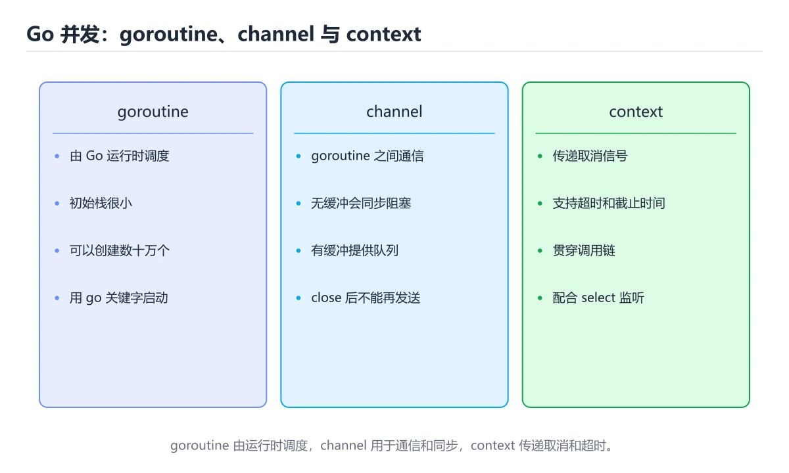
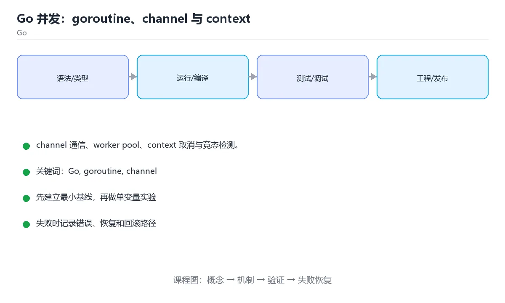

# Go 并发：goroutine、channel 与 context

> 内容更新时间：2026-10-03





## 学习目标

- 能用自己的话解释Go 并发：goroutine、channel 与 context解决了什么问题，而不是只背术语。
- 能说清 「Go」、「goroutine」、「channel」、「context」 之间的关系，并分别举出一个例子。
- 能把本课知识放回「Go」的知识体系，说明它和相邻主题的边界。
- 能完成本课练习，并用验收标准检查自己的结果。

> 一句话摘要：channel 通信、worker pool、context 取消与竞态检测。

## 前置知识

- 先完成上一课《Go 基础》；如果已经掌握，可以直接用本课练习自测。
- 本课阶段：进阶。建议先掌握同一分类的基础课程，并能独立运行正文中的最小示例。
- 开始前先复习：Go、goroutine、channel。
- 如果某一步看不懂，先记录具体卡点，完成练习后再回头读一遍。

## 三个核心原语

| 原语 | 作用 |
| --- | --- |
| `go f()` | 启动 goroutine，几 KB 栈，可轻松开十万个 |
| `chan T` | 类型安全管道；无缓冲同步交接，有缓冲为队列 |
| `select` | 多路等待，可配合超时与退出信号 |

Go 的并发哲学：**不要通过共享内存来通信，而要通过通信来共享内存**。

## 常见模式

1. **Worker Pool**：固定 N 个 worker 从 channel 取任务，控制并发度。
2. **扇出扇入**：多个 goroutine 并行处理后汇总到一个 channel。
3. **超时与取消**：`context.WithTimeout` 传递取消信号，所有阻塞操作都要监听 `ctx.Done()`。
4. **等待一组任务**：`sync.WaitGroup` 的 Add/Done/Wait。

## 必须注意的坑

- **goroutine 泄漏**：启动后无人回收。凡是阻塞在 channel 或网络上的 goroutine，都要有退出路径。
- **向已关闭的 channel 发送** 会 panic；关闭方应是唯一的发送者。
- **循环变量捕获**：Go 1.22 之前需显式复制变量。
- **竞态**：用 `go test -race` 检测，用 mutex 或 channel 消除。

## 共享状态的两条路

优先用 channel 传递所有权；确需共享时用 `sync.Mutex`/`RWMutex` 或 `sync/atomic`。读多写少用 `RWMutex`，计数器用 `atomic.Int64`。

## 本课小结
Go 并发的要点：**用 channel 传递数据、用 context 控制生命周期、用 WaitGroup 等待完成、用 -race 验证正确性**。

## goroutine 与 channel 速查

| 目的 | 写法 | 说明 |
| --- | --- | --- |
| 启动协程 | `go worker()` | 调度开销远小于线程 |
| 等待全部完成 | `var wg sync.WaitGroup` | `Add` 要在 `go` 之前调用 |
| 无缓冲 channel | `make(chan int)` | 收发同步握手 |
| 带缓冲 channel | `make(chan int, 10)` | 缓冲满则发送阻塞 |
| 只发 / 只收类型 | `chan<- int` / `<-chan int` | 用类型表达意图，减少误用 |
| 关闭 channel | `close(ch)` | 由发送方关闭，接收方用 `v, ok := <-ch` 判断 |
| 遍历 channel | `for v := range ch` | channel 关闭且无数据时自动结束 |
| 选择分支 | `select { case v := <-ch: ... }` | 多路复用，可加 `default` 做非阻塞 |
| 超时控制 | `select` + `time.After` | 避免永久等待 |
| 取消传播 | `context.WithCancel` | 逐层传递，配合 `<-ctx.Done()` |
| 限流 | `make(chan struct{}, n)` 或 `errgroup.SetLimit` | 控制并发规模 |
| 错误汇总 | `errgroup.Group` | 任一返回错误即取消其余任务 |

```go
func worker(ctx context.Context, jobs <-chan int, results chan<- int, wg *sync.WaitGroup) {
	defer wg.Done()
	for {
		select {
		case <-ctx.Done():
			return                       // 收到取消信号立即退出
		case job, ok := <-jobs:
			if !ok {
				return                   // channel 已关闭且取完
			}
			select {
			case results <- job * 2:
			case <-ctx.Done():
				return
			}
		}
	}
}
```

## 并发安全速查

| 场景 | 推荐做法 |
| --- | --- |
| 计数器 | `atomic.Int64` 或 `sync.Mutex` |
| 只读共享数据 | 启动前初始化好，之后不再写 |
| 读写比例高 | `sync.RWMutex` |
| 对象复用 | `sync.Pool` |
| 只执行一次的初始化 | `sync.Once` |
| 跨线程传递数据 | channel（CSP 风格） |
| 共享状态较多 | 加锁，但优先考虑改用 channel 传递所有权 |
| 检测数据竞争 | `go test -race` |

## 常见错误对照表

| 容易写错的做法 | 实际现象 | 原因与正确做法 |
| --- | --- | --- |
| `wg.Add(1)` 写在 `go func()` 内部 | `Wait` 提前返回 | `Add` 必须在启动协程前调用 |
| 向已关闭的 channel 发送 | panic | 只让发送方关闭，且关闭后不再发送 |
| 读已关闭的 channel | 立刻返回零值 | 用 `v, ok := <-ch` 区分「零值」与「已关闭」 |
| goroutine 内 panic 未捕获 | 整个进程崩溃 | 在 `recover` 中兜住并记录日志 |
| 只发不收（或只收不发） | 死锁：`all goroutines are asleep` | 确保有对应接收方，或使用缓冲与超时 |
| 在循环里用 `for _, v := range s { go func(){ use(v) }() }` | 旧版 Go 捕获同一变量导致数据错 | 把 `v` 作为参数传入闭包 |
| 忘记 `defer cancel()` | context 泄漏 | 创建后立即 `defer cancel()` |
| 用 `time.Sleep` 等待完成 | 不稳定、慢 | 用 `WaitGroup` 或 channel 同步 |
| 共享 map 并发读写 | panic：`concurrent map writes` | 加锁或用 `sync.Map` |
| 无限制启动 goroutine | 内存暴涨、调度开销大 | 用带缓冲的 channel 或 `errgroup.SetLimit` 限流 |
| 直接 `fmt.Println` 调试并发 | 输出交织、无法定位 | 用结构化日志并带请求 ID |

## 自测清单

- [ ] 会用 `WaitGroup`、`channel`、`context` 控制协程生命周期。
- [ ] 知道「谁发送谁关闭」的惯例，并用 `v, ok` 判断关闭。
- [ ] 共享数据一律加锁或用原子操作。
- [ ] 关键代码跑 `go test -race` 且无告警。
- [ ] 所有并发任务都能被取消并设了超时。

## 零基础详解：goroutine、channel 与「通过通信共享内存」

### 一句话说清它是什么

Go 的并发口号是「**不要通过共享内存来通信，而要通过通信来共享内存**」。
具体做法就是：用 goroutine 起任务，用 channel 在任务之间传数据，而不是到处加锁改同一个变量。

### 用生活比喻理解

| 概念 | 比喻 | 说明 |
| --- | --- | --- |
| goroutine | 临时工 | 几 KB 栈，开几万个也不吓人 |
| channel | 传送带 | 一个送、一个收，天然同步 |
| 无缓冲 channel | 手递手 | 双方必须同时到位 |
| 带缓冲 channel | 周转筐 | 筐没满就能先放 |
| `select` | 多路开关 | 谁先就绪就走哪条 |
| `sync.Mutex` | 一把锁 | 需要保护一小段共享状态时才用 |
| `context` | 停工通知 | 告诉所有相关任务「别干了」 |

### 三个工具的取舍

| 需求 | 推荐 | 原因 |
| --- | --- | --- |
| 传递数据、串起流水线 | channel | 数据流向清晰 |
| 保护一个计数器或缓存 | `sync.Mutex` / `atomic` | 比开 channel 更直接 |
| 等一组任务结束 | `sync.WaitGroup` | 计数归零即完成 |
| 取消、超时、传请求级数据 | `context` | 标准做法，能层层传递 |
| 限制并发数量 | 带缓冲 channel 当信号量 | 简洁可控 |

### 一段完整示例：worker 池

```go
package main

import (
    "fmt"
    "sync"
)

func worker(id int, jobs <-chan int, results chan<- int, wg *sync.WaitGroup) {
    defer wg.Done()
    for job := range jobs {                 // channel 关闭后循环自动结束
        results <- job * job
    }
}

func main() {
    jobs := make(chan int, 5)
    results := make(chan int, 5)
    var wg sync.WaitGroup

    for i := 1; i <= 3; i++ {
        wg.Add(1)                           // 必须在 go 之前 Add
        go worker(i, jobs, results, &wg)
    }

    for i := 1; i <= 5; i++ {
        jobs <- i
    }
    close(jobs)                             // 由发送方关闭

    wg.Wait()
    close(results)

    for r := range results {
        fmt.Println(r)
    }
}
```

### channel 的四条铁律

| 操作 | 无缓冲 | 带缓冲（未满） | 已关闭 |
| --- | --- | --- | --- |
| 发送 | 阻塞到有人接收 | 不阻塞 | **panic** |
| 接收 | 阻塞到有人发送 | 有数据就取 | 返回零值，ok 为 false |
| 关闭 | 可以 | 可以 | 重复关闭会 panic |

结论：**只由发送方关闭 channel，并且不要向已关闭的 channel 发送数据。**

### 新手最容易踩的八个坑

| 坑 | 现象 | 正确做法 |
| --- | --- | --- |
| 向已关闭的 channel 发送 | panic | 只让发送方关，先关闭再停止发送 |
| 重复关闭 | panic | 用 `sync.Once` 或明确单一关闭方 |
| 没人接收就发送 | 全部 goroutine 阻塞，报 deadlock | 保证有接收方或改成带缓冲 |
| 忘了 `wg.Add` | `Wait` 立刻返回 | 起 goroutine 前先 Add |
| `wg.Add` 写在 goroutine 里 | 计数可能来不及加 | 必须在 go 之前调用 |
| goroutine 泄漏 | 内存持续增长 | 用 context 或关闭 channel 让它退出 |
| 用共享 map 不加锁 | 并发写导致崩溃 | 加 `Mutex` 或用 channel 串行化 |
| 循环变量被捕获 | 所有 goroutine 用同一个值 | Go 1.22 已修复，旧版本要 `v := v` |

### 用 context 控制取消

```go
ctx, cancel := context.WithTimeout(context.Background(), 2*time.Second)
defer cancel()                       // 一定要调用，释放资源

select {
case <-ctx.Done():
    fmt.Println("超时或被取消：", ctx.Err())
case result := <-ch:
    fmt.Println("拿到结果：", result)
}
```

### 学完自测

- [ ] 能说出「通过通信共享内存」是什么意思。
- [ ] 知道无缓冲与带缓冲 channel 的区别。
- [ ] 能说出关闭 channel 的两条规则。
- [ ] 知道 `WaitGroup.Add` 为什么必须写在 `go` 之前。
- [ ] 能用 `select` 加 `context` 写出带超时的等待。

## 动手练习

> 本课练习重点：围绕「Go、goroutine、channel」完成复述、实验和交付，每个结果都要能被别人检查。

先写最小程序并用 go test 验证，再补 context、并发上限和错误传播。

### 练习 1：建立心智模型（10 分钟）

合上教程，用 3～5 句话回答：

1. Go 并发：goroutine、channel 与 context解决了什么问题？
2. 如果没有它，会出现什么具体后果？
3. 它和「goroutine」是什么关系？

**验收标准**：至少出现一个本课关键词，并写出一个反例、边界条件或失效场景。

### 练习 2：做一次可控实验（20 分钟）

从正文中选一个最小示例，完成以下操作：

1. 先预测修改一个参数、输入或步骤后的结果。
2. 再实际执行或逐步推演，记录真实结果。
3. 如果结果与预测不同，写出差异原因。

**验收标准**：留下「原例 → 改动 → 预测 → 结果 → 原因」五步记录。

### 练习 3：交付一个小结果（30 分钟）

写一个可运行的小程序，并用 `go test` 或 `go vet` 验证结果。

任务要求：

- 结果必须能被别人检查，不能只写“我已经理解了”。
- 至少覆盖「Go」和「goroutine」两个关键词。
- 写出 1 个仍然不确定的问题，以及下一步如何验证。

> 提示：时间有限时优先做练习 1 和练习 2；练习 3 可以拆成两次完成。

## 实践任务

本节围绕Go 并发：goroutine、channel 与 context安排 3 个可交付任务，每个任务都要求留下可以复查的记录。

### 任务 1：用自己的话画出结构

不看书，用一张图说清「Go 并发：goroutine、channel 与 context」的结构，画完再对照骨架：

- 主干：三个核心原语 → 常见模式 → 必须注意的坑 → 共享状态的两条路
- 连接线：在每条边上标出输入、输出与失败路径。
- 自检：能否用一句话说明Go与goroutine的关系？

### 任务 2：做一次对比实验

**验收标准**：表格里两个方案的结论不能完全一样；写下“在什么条件下应该换方案”。

### 任务 3：迁移到自己的场景

**验收标准**：至少有一个可复现的命令、代码片段或数据样例；结论能被别人独立检查。

## 故障现场

### 现场 1：本课的 Go 常规用例通过，但边界用例失败

**症状**：在本课的练习或生产场景里出现“本课的 Go 常规用例通过，但边界用例失败”。

**复现**：准备一组最小输入，只保留触发“本课的 Go 常规用例通过，但边界用例失败”的必要条件，连续运行两次确认结果稳定。

**定位**：围绕“Go 的前置条件与取值边界没有写进代码，默认值掩盖了空值和极值”检查调用链、输入数据和环境配置，先验证假设再改代码。

**预防**：把“本课的 Go 常规用例通过，但边界用例失败”写成一条自动化用例，并在本课的验收清单里保留对应检查项。

### 现场 2：本课的 goroutine 结果在两次运行之间不一致

**症状**：在本课的练习或生产场景里出现“本课的 goroutine 结果在两次运行之间不一致”。

**复现**：准备一组最小输入，只保留触发“本课的 goroutine 结果在两次运行之间不一致”的必要条件，连续运行两次确认结果稳定。

**定位**：围绕“goroutine 依赖了当前版本、执行顺序或共享状态，单次运行无法暴露差异”检查调用链、输入数据和环境配置，先验证假设再改代码。

**预防**：把“本课的 goroutine 结果在两次运行之间不一致”写成一条自动化用例，并在本课的验收清单里保留对应检查项。

### 现场 3：本课的验证只在开发机通过

**症状**：在本课的练习或生产场景里出现“本课的验证只在开发机通过”。

**定位**：围绕“环境版本、配置和输入规模与目标环境不同，Go 缺少可重复的验证记录”检查调用链、输入数据和环境配置，先验证假设再改代码。

## 版本与时效

- 升级前用 go vet、go test -race 与静态检查覆盖并发生命周期
- 模块校验、最小版本选择与供应链安全是生产升级的重点
- 官方发布说明：https://go.dev/doc/devel/release

### 升级检查清单

- 先固定当前版本，跑通全部示例与测验，再升级工具链。
- 只改一个版本变量，记录编译、测试、性能与产物体积的变化。
- 重点回归默认值、弃用警告、序列化格式、并发语义和错误信息。
- 升级完成后更新本课的“最后复核 / 下次复核”日期与版本说明。

## 本课复习清单

离开本课前，逐项确认：

- [ ] 不看解析，能说出「向已关闭的 channel 发送数据会？」的判断依据。
- [ ] 不看解析，能说出「以下哪组是 Go 并发的正确实践？」的判断依据。
- [ ] 不看解析，能说出「检测数据竞争的官方手段是？」的判断依据。
- [ ] 不看解析，能说出「向无缓冲 channel 发送数据会阻塞，直到？」的判断依据。
- [ ] 不看解析，能说出「sync.WaitGroup 的典型用途是？」的判断依据。
- [ ] 不看解析，能说出的判断依据。
- [ ] 至少运行一次本课示例，记录输入、输出和一个边界情况。
- [ ] 把本课最容易混淆的两个概念写成一句话对照。

| 复盘项 | 记录 |
| --- | --- |
| 已经能独立解释的考点 |  |
| 仍然说不清的概念 |  |
| 下一步验证动作 |  |

## 术语速查

| 术语 | 本课语境 |
| --- | --- |
| `go f()` | \| `go f()` \| 启动 goroutine，几 KB 栈，可轻松开十万个 \| |
| `chan T` | \| `chan T` \| 类型安全管道；无缓冲同步交接，有缓冲为队列 \| |
| `select` | \| `select` \| 多路等待，可配合超时与退出信号 \| |
| `context.WithTimeout` | 超时与取消**：`context.WithTimeout` 传递取消信号，所有阻塞操作都要监听 `ctx.Done()`。 |
| `ctx.Done()` | 超时与取消**：`context.WithTimeout` 传递取消信号，所有阻塞操作都要监听 `ctx.Done()`。 |
| `sync.WaitGroup` | 等待一组任务**：`sync.WaitGroup` 的 Add/Done/Wait。 |

## 考点精讲

### 考点 1：概念判断·Go

- **题目**：向已关闭的 channel 发送数据会？
- **判断依据**：只应由唯一的发送方负责关闭 channel。其他选项：向已关闭的 channel 发送不会返回错误、不会自动重开、也不会阻塞，而是直接 panic，因此关闭操作应由唯一发送方负责。这道题的关键在「Go 并发：goroutine、channel 与 context」的Go、goroutine、channel：先确认题干“向已关闭的 channel 发送数据”问的是哪一步，再排除偷换前提的选项。

### 考点 2：代码补全·Go

- **题目**：下面这段 Go 代码摘自「Go 并发：goroutine、channel 与 context」的正文示例。关于这段代码，下面哪一项说法与实际内容相符？
- **判断依据**：在「Go 并发：goroutine、channel 与 context」里，这段代码包含循环结构，同一段逻辑会被重复执行。这段代码出自「Go 并发：goroutine、channel 与 context」的正文示例，围绕Go、goroutine、channel展开；把输入或边界换成空值、极值或失败情况后，结论要以「Go 并发：goroutine、channel 与 context」的实际运行结果为准。

### 考点 3：概念判断·Go

- **题目**：检测数据竞争的官方手段是？
- **判断依据**：在「Go 并发：goroutine、channel 与 context」里，go test -race。-race 在运行时检测并发访问冲突，应加入 CI。「Go 并发：goroutine、channel 与 context」要求先交代Go、goroutine、channel的前提再下结论，所以“go test -race”只在题干“检测数据竞争的官方手段是”给定的条件下成立。

### 考点 4：概念判断·Go

- **题目**：向无缓冲 channel 发送数据会阻塞，直到？
- **判断依据**：在「Go 并发：goroutine、channel 与 context」里，作答时，先用Go建立输入与输出的基线，再把有接收方准备好接收（收发同步完成）代入边界条件核对，结论才能复现。在「Go 并发：goroutine、channel 与 context」里，这道题要求区分概念与边界，「有接收方准备好接收（收发同步完成）」只有在题干给出的前提下才成立，而「永远不阻塞」、「缓冲区写满」缺少同一组条件。

### 考点 5：多选辨析·Go

- **题目**：围绕“Go 并发：goroutine、channel 与 context”中的 Go、goroutine、channel，下列哪两项是本课强调的实践判断？
- **判断依据**：在「Go 并发：goroutine、channel 与 context」里，学习 Go 时要同时说明输入、输出和失败路径，不能只看正常流程。在Go 并发：goroutine、channel 与 context里，判断 goroutine 时要固定版本与边界输入，所以“验证 goroutine 时要固定版本并覆盖边界输入，结论才可复现”才可复现。

### 考点 6：填空·Go

- **题目**：补全代码：「Go 并发：goroutine、channel 与 context」示例中，下面这行代码缺少哪个关键字或函数名？请填入 ____。 `ctx, cancel := context.____(context.Background, 2*time.Second)`
- **判断依据**：在「Go 并发：goroutine、channel 与 context」里，WithTimeout。在「Go 并发：goroutine、channel 与 context」里判断这道题，要把Go、goroutine、channel的条件、过程与失败路径逐项对齐，换成“补全代码”这个场景，只有满足前提的结论才成立。

## English Overview

**Title:** Go Concurrency

**Summary:** Channels, worker pools, context and race detection.

**Category:** Go
**Level:** 进阶
**Key terms:** Go, goroutine, channel, context, race

## 内容元数据

- 内容版本：v2.0
- 最后更新：2026-10-03
- 学习阶段：进阶
- 适用环境：Go 1.24+
- 内容来源：内置结构化课程与工程实践整理
- 相关主题：Go、goroutine、channel、context、race
- 质量版本：P0 测验标准 + P1 覆盖扩展 + P2 体验补全

## Full English Study Guide

### Overview

**Go Concurrency** focuses on Channels, worker pools, context and race detection.

### Learning Outcomes

- Explain what **Go Concurrency** solves and when it should be used.

### Glossary

- Topic: **Go Concurrency**
- Related terms: Go, goroutine, channel, context

## Bilingual Section Outline

| 中文小节 | English section |
| --- | --- |
| 学习目标 | Learning objectives |
| 前置知识 | Prerequisites |
| 三个核心原语 | 三个核心原语 |
| 常见模式 | 常见模式 |
| 必须注意的坑 | 必须注意的坑 |
| 共享状态的两条路 | 共享状态的两条路 |
| 本课小结 | Summary |
| goroutine 与 channel 速查 | goroutine 与 channel 速查 |
| 并发安全速查 | ConcurrencySecurity速查 |
| 常见错误对照表 | Common mistakes对照表 |

## 参考资料与复核

- 最后复核：2026-10-04
- 下次复核：2027-04-04
- 复核范围：版本兼容、API 行为、安全建议与工程实践
- 来源性质：官方文档、标准或权威教材；正文为离线教学重组

| 参考资料 | 本课用途 |
| --- | --- |
| [Go 并发](https://go.dev/talks/2012/concurrency.slide) | goroutine 与 channel |
| [Go 内存模型](https://go.dev/ref/mem) | 并发读写与同步语义 |
| [Effective Go](https://go.dev/doc/effective_go) | 惯用写法与接口设计 |

> 「Go 并发：goroutine、channel 与 context」的链接用于离线阅读后的延伸核对；App 不会自动联网。
