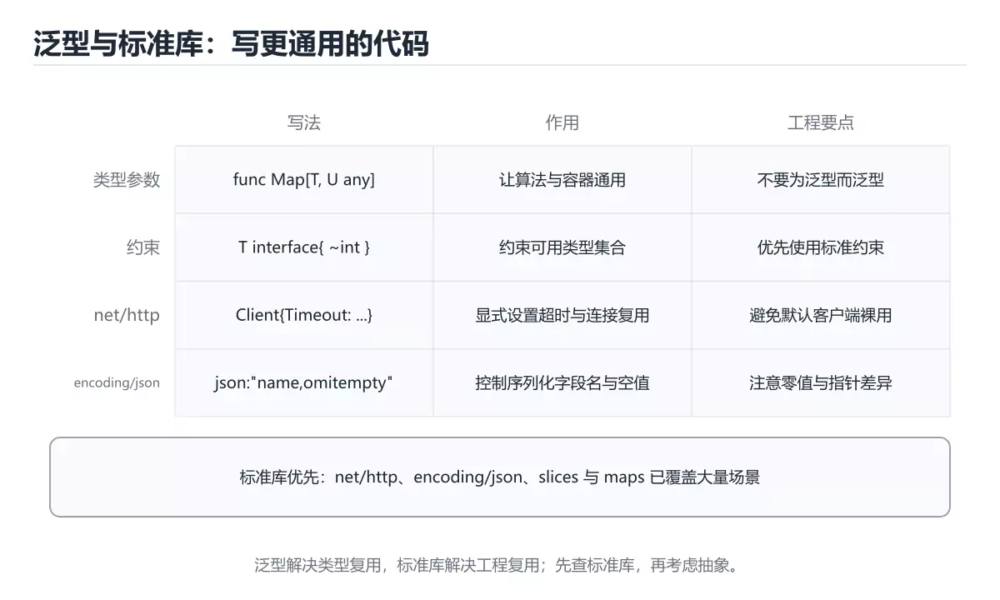
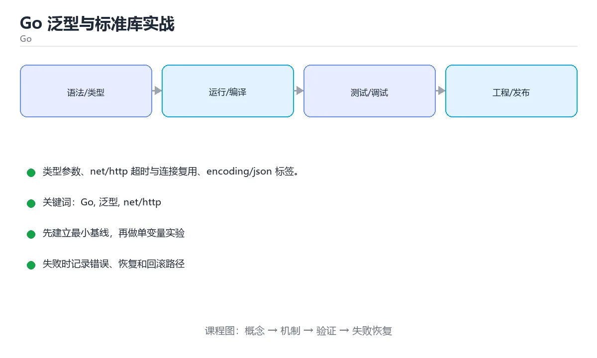

# Go 泛型与标准库实战





> 内容更新时间：2026-10-06 · 学习阶段：高级 · 预计用时：65 分钟

## 学习目标

- 能用自己的话解释Go 泛型与标准库实战解决了什么问题，而不是只背术语。
- 能说清 「Go」、「泛型」、「net/http」、「encoding/json」 之间的关系，并分别举出一个例子。
- 能把 Go 放回「Go 泛型与标准库实战」的知识体系，说明它和 泛型 的边界。
- 能完成本课练习，并用验收标准检查自己的结果。

> 一句话摘要：类型参数、net/http 超时与连接复用、encoding/json 标签。

## 前置知识

- 先完成上一课《Go 工程实践》；如果已经掌握，可以直接用本课练习自测。
- 开始前先复习：Go、泛型、net/http。
- 如果 泛型（Go 1.18+） 这一步看不懂，先记录具体卡点，再用 HandleFunc 复现一遍。

## 泛型（Go 1.18+）

类型参数写在方括号里：`func Max[T constraints.Ordered](a, b T) T`。约束用接口描述可用操作，`constraints` 包提供 Ordered、Integer 等常用约束。

| 概念 | 说明 |
| --- | --- |
| 类型参数 `[T any]` | 让函数/类型适配多种类型 |
| 约束 `T constraints.Ordered` | 限制可用的运算符 |
| 类型集合 `~int \| ~string` | 允许底层类型匹配的自定义类型 |

适用场景：容器、算法工具、类型安全的通用函数。不要为了泛型而泛型——接口与泛型各有边界，能用接口表达行为时优先接口。

## net/http 实战

标准库自带生产可用的 HTTP 服务：`http.HandleFunc` 注册路由、`http.Server` 配置超时、`http.Client` 设置超时与连接复用。

要点：

1. **必须设置超时**（ReadTimeout/WriteTimeout/IdleTimeout），否则慢连接会耗尽连接数。
2. Client 要复用（自定义 Transport 设置 MaxIdleConns），避免频繁建连。
3. `http.MaxBytesReader` 限制请求体大小防内存打爆。
4. 中间件用函数包装 `http.Handler`（日志、鉴权、recover）。

## encoding/json

结构体标签控制序列化：`json:"name,omitempty"` 省略空值；`json:"-"` 忽略字段；自定义 `MarshalJSON`/`UnmarshalJSON` 处理特殊格式（时间、枚举）。流式处理大 JSON 用 `json.Decoder`。

## 本课小结

泛型负责类型安全的复用，标准库负责生产可用的基础能力：**net/http 记得设超时与复用连接，encoding/json 用标签控制契约**。

## 泛型速查

| 概念 | 写法 | 说明 |
| --- | --- | --- |
| 类型参数 | `func Map[T, U any](s []T, f func(T) U) []U` | 泛型函数 |
| 类型约束 | `type Number interface { ~int \| ~float64 }` | `~` 表示底层类型 |
| 内置约束 | `any`、`comparable` | `comparable` 支持 `==` |
| 泛型类型 | `type Set[T comparable] map[T]struct{}` | 泛型数据结构 |
| 类型推断 | 调用时通常可省略类型参数 | `Map(items, fn)` |
| 单态化 | 每种类型编译一份代码 | 体积会增大 |

```go
// 泛型集合：comparable 约束保证可以用作 map 键
type Set[T comparable] map[T]struct{}

func (s Set[T]) Add(v T) { s[v] = struct{}{} }
func (s Set[T]) Has(v T) bool {
	_, ok := s[v]
	return ok
}

// 数值约束：支持多种底层类型
type Number interface {
	~int | ~int64 | ~float64
}

func Sum[T Number](nums []T) T {
	var total T
	for _, n := range nums {
		total += n
	}
	return total
}
```

## 标准库速查

| 场景 | 包与用法 |
| --- | --- |
| HTTP 服务 | `net/http` 的 `http.Server`、`http.HandlerFunc` |
| HTTP 客户端 | `http.Client` + `context` 设置超时 |
| JSON | `encoding/json` 的 `Marshal` / `Unmarshal` / `Decoder` |
| 时间 | `time.Now()`、`time.Parse`、`time.Ticker` |
| 文件与路径 | `os`、`path/filepath`、`io/fs` |
| 字符串处理 | `strings`、`strconv` |
| 并发原语 | `sync`、`sync/atomic`、`context` |
| 日志 | `log/slog`（结构化日志） |
| 测试 | `testing`、`net/http/httptest` |
| 命令行参数 | `flag`（复杂场景用 cobra / urfave） |

```go
// Go 1.22+ 的 ServeMux 支持方法与前缀匹配，标准库即可搭服务
mux := http.NewServeMux()
mux.HandleFunc("GET /healthz", func(w http.ResponseWriter, r *http.Request) {
	w.WriteHeader(http.StatusOK)
	_, _ = w.Write([]byte("ok"))
})

srv := &http.Server{
	Addr:              ":8080",
	Handler:           mux,
	ReadHeaderTimeout: 5 * time.Second,  // 必设，防止慢速攻击
	ReadTimeout:       15 * time.Second,
	WriteTimeout:      15 * time.Second,
	IdleTimeout:       60 * time.Second,
}
```

## 常见错误与排查

| 容易写错的做法 | 实际现象 | 原因与正确做法 |
| --- | --- | --- |
| 泛型约束用 `any` 却要比较 | 编译错误 | 需要比较时用 `comparable` |
| 忘记 `~` | 自定义类型无法匹配 | 用 `~int` 允许底层类型 |
| 泛型滥用 | 代码难读、二进制变大 | 有明确复用需求才使用泛型 |
| `http.Server` 不设超时 | 慢连接耗尽资源 | 设置读写与空闲超时 |
| `json.Unmarshal` 到未导出字段 | 字段始终为零值 | 字段必须导出（大写开头） |
| 忘记 `json` tag | 字段名与接口不一致 | 用 `json:"user_id"` |
| 用字符串拼 JSON | 注入与转义问题 | 用 `encoding/json` |
| `time.Parse` 时区不对 | 时间偏差几小时 | 明确布局与时区（`time.RFC3339`、`time.UTC`） |
| 逐行 `ReadString` 读大文件 | 内存与性能问题 | 用 `bufio.Scanner` 或流式解码 |
| 忽略 `resp.Body.Close()` | 连接泄漏 | `defer resp.Body.Close()` |

## 复习与自测

- [ ] 会用 `comparable` 与自定义约束写泛型。
- [ ] `http.Server` 设置了完整的超时参数。
- [ ] JSON 字段导出并带 tag，错误逐层处理。
- [ ] 时间统一用 UTC 存储、展示时转换。
- [ ] HTTP 响应体一定 `defer Close()`。

## 零基础详解：泛型与标准库常用武器

### 一句话说清它是什么

泛型让同一段代码适配多种类型，同时保留类型检查；
标准库则提供了日常最常用的工具：`net/http`、`encoding/json`、`time`、`slices`、`maps`。

### 泛型三件套

```go
// 1. 类型参数写在方括号里
func Map[T, U any](items []T, fn func(T) U) []U {
    out := make([]U, 0, len(items))
    for _, item := range items {
        out = append(out, fn(item))
    }
    return out
}

// 2. 约束限定可用操作
func Max[T cmp.Ordered](a, b T) T {
    if a > b {
        return a
    }
    return b
}

// 3. 调用时通常能自动推导
nums := []int{3, 1, 2}
doubled := Map(nums, func(n int) int { return n * 2 })
fmt.Println(Max(3, 7), doubled)
```

| 约束 | 允许的操作 | 例子 |
| --- | --- | --- |
| `any` | 任意类型，不能比较大小 | 容器、映射 |
| `comparable` | 可以用 `==`、`!=` | map 的键 |
| `cmp.Ordered` | 可以用 `<`、`>` | 求最大最小、排序 |
| 自定义接口 | 你规定的方法集 | 需要调用特定方法时 |

### 标准库四件套

```go
// 1. net/http：起一个带超时的服务
srv := &http.Server{
    Addr:              ":8080",
    Handler:           mux,
    ReadHeaderTimeout: 5 * time.Second,   // 不设超时是最常见的事故源
    ReadTimeout:       10 * time.Second,
    WriteTimeout:      10 * time.Second,
    IdleTimeout:       60 * time.Second,
}
log.Fatal(srv.ListenAndServe())

// 2. encoding/json：结构体标签控制字段名
type User struct {
    ID    int    `json:"id"`
    Name  string `json:"name"`
    Email string `json:"email,omitempty"`   // 为空时不输出
    Pass  string `json:"-"`                 // 永远不输出
}

// 3. time：超时与定时
ctx, cancel := context.WithTimeout(context.Background(), 3*time.Second)
defer cancel()

// 4. slices / maps：常用集合操作
nums := []int{3, 1, 2}
slices.Sort(nums)                     // 原地排序
fmt.Println(slices.Contains(nums, 2)) // true
fmt.Println(slices.Max(nums))         // 3
```

### 结构体标签速查

| 标签 | 含义 |
| --- | --- |
| `json:"name"` | 序列化时用 name 作为键 |
| `json:"name,omitempty"` | 零值时省略该字段 |
| `json:"-"` | 完全忽略该字段 |
| `json:",string"` | 用字符串形式编码数字 |

**注意**：只有首字母大写的字段才会被序列化。

### 新手最容易踩的八个坑

| 坑 | 现象 | 正确做法 |
| --- | --- | --- |
| 泛型约束太宽 | 编译不过（无法比较） | 按需要加 `comparable` 或 `Ordered` |
| 为了省事全用 `any` | 失去类型检查 | 只在真的任意时用 |
| 忘记结构体字段大写 | JSON 输出空对象 | 需要导出的字段首字母大写 |
| HTTP server 不设超时 | 慢连接拖垮服务 | 至少设 ReadHeaderTimeout |
| 不关闭响应体 | 连接泄漏 | 拿到响应立刻 `defer resp.Body.Close()` |
| 忽略 `json.Unmarshal` 的错误 | 数据静默错乱 | 一定检查 |
| 用 `time.Sleep` 做超时 | 无法取消 | 用 `context.WithTimeout` |
| 手写排序和查找 | 容易出错 | 用 `slices`、`maps` |

### 手把手练习：泛型 + JSON + 超时请求

```go
package main

import (
    "context"
    "encoding/json"
    "fmt"
    "net/http"
    "time"
)

type Post struct {
    ID    int    `json:"id"`
    Title string `json:"title"`
}

func fetchJSON[T any](ctx context.Context, url string) (T, error) {
    var zero T
    req, err := http.NewRequestWithContext(ctx, http.MethodGet, url, nil)
    if err != nil {
        return zero, fmt.Errorf("构造请求失败: %w", err)
    }

    resp, err := http.DefaultClient.Do(req)
    if err != nil {
        return zero, fmt.Errorf("请求失败: %w", err)
    }
    defer resp.Body.Close()

    var out T
    if err := json.NewDecoder(resp.Body).Decode(&out); err != nil {
        return zero, fmt.Errorf("解析失败: %w", err)
    }
    return out, nil
}

func main() {
    ctx, cancel := context.WithTimeout(context.Background(), 3*time.Second)
    defer cancel()

    post, err := fetchJSON[Post](ctx, "https://example.com/api/post/1")
    if err != nil {
        fmt.Println("出错：", err)
        return
    }
    fmt.Println(post.Title)
}
```

### 学完自测

- [ ] 能写出一个带类型参数的函数并说明约束作用。
- [ ] 知道 `any`、`comparable`、`Ordered` 的差别。
- [ ] 能说出结构体标签 `omitempty` 与 `-` 的区别。
- [ ] 知道为什么 HTTP 服务必须设置超时。
- [ ] 会用 `context.WithTimeout` 给请求加时限。

## 动手练习

> 本课练习重点：围绕「Go、泛型、net/http」完成复述、实验和交付，每个结果都要能被别人检查。

用 HandleFunc 构造最小可运行示例，并把输出与「泛型（Go 1.18+）」的结论对照。

### 练习 1：建立心智模型（10 分钟）

合上教程，用 3～5 句话回答：

1. Go 泛型与标准库实战解决了什么问题？
2. 如果没有它，会出现什么具体后果？
3. 它和「泛型」是什么关系？

验收标准：回答里必须出现 Go，并写出一个让结论失效的边界条件。

### 练习 2：做一次可控实验（20 分钟）

从正文中选一个最小示例，完成以下操作：

1. 先预测修改一个参数、输入或步骤后的结果。
2. 再实际执行或逐步推演，记录真实结果。
3. 如果结果与预测不同，写出差异原因。

**验收标准**：先在「泛型（Go 1.18+）」里找一个可运行的最小输入，再按五步法记录Go的影响；预测与结果不一致时补写被忽略的前提。

### 练习 3：交付一个小结果（30 分钟）

用 HandleFunc 构造最小可运行示例，并把输出与「泛型（Go 1.18+）」的结论对照。

任务要求：

- 结果必须能被别人检查，不能只写“我已经理解了”。
- 至少覆盖「Go」和「泛型」两个关键词。
- 写出 1 个仍然不确定的问题，以及下一步如何验证。

> 提示：时间有限时优先做练习 1 和练习 2；练习 3 可以拆成两次完成。

## 验证命令与预期输出

Go 的交付物要能用固定命令复现；下表是本项目的最低验证集：

| 阶段 | 命令 | 预期输出 |
| --- | --- | --- |
| 格式化检查 | `gofmt -l .` | 没有文件需要格式化 |
| 静态检查 | `go vet ./...` | 没有 vet 报告 |
| 运行测试 | `go test ./... -count=1` | 所有包测试通过 |

### 验收证据

- [ ] 保存依赖安装和启动命令的完整输出。
- [ ] 为 HandleFunc 补三条测试：正常、边界、失败各一条。
- [ ] 连续两次触发 泛型，检查数据与计数是否被重复累加。
- [ ] 记录一次失败状态码、错误日志和恢复步骤。
- [ ] 在 README 中写明 Go 所需的环境版本、启动方式和回滚方式。

### 回归与回滚

1. 先在可丢弃的目录或临时库里跑 Go，避免污染真实数据。
2. 修改一处逻辑后重跑全部验证命令，确认没有回归。
3. 若失败，回滚到上一个可运行版本并保留失败日志。
4. 定位原因后补一条自动化测试，再重新执行发布流程。
5. 把教训写入项目复盘或本课笔记，形成下一次的检查项。

## 可运行练习

### 任务 1：先跑通，再解释

```json
{
  "project": "go_generics_stdlib",
  "scenario": "Go的正常路径",
  "input": {"case": "normal", "value": "HandleFunc"},
  "expected": {"ok": true, "checks": ["Go可复现", "泛型有记录"]},
  "failure_case": {"case": "泛型越界或缺失", "error": "validation_error"},
  "idempotency_key": "go_generics_stdlib-001"
}
```

### 任务 2：只改一个条件

把「Go 泛型与标准库实战」的最小示例复制一份，只改一个条件再跑一次：

- 改动点：把 泛型 换成边界值，其他输入保持原样。
- 预测：先写下「Go 泛型与标准库实战」在改动后的输出或错误信息，再运行。
- 记录：对照改动前后的结果，指出差异出在哪一步。
- 验收：换回原条件能复现原结果，改动只影响Go。

### 任务 3：迁移到自己的数据

换一个 泛型 场景重做一次，确认结论不是只对示例数据成立。

## 故障现场

### 现场 1：http.Server 不设超时

**症状**：在《Go 泛型与标准库实战》的复现场景中，慢连接耗尽资源。

**根因**：当出现“http.Server 不设超时”时，执行路径已经绕过了《Go 泛型与标准库实战》的关键约束，最终以“慢连接耗尽资源”暴露出来；修复前必须先确认约束在哪里失效。

**修复**：针对《Go 泛型与标准库实战》的问题，设置读写与空闲超时。

**验证**：在《Go 泛型与标准库实战》中按“设置读写与空闲超时”调整后，从“http.Server 不设超时”的触发条件重放同一条路径，确认“慢连接耗尽资源”不再出现，并补一个相邻边界用例检查没有引入新问题。

### 现场 2：json.Unmarshal 到未导出字段

**症状**：在《Go 泛型与标准库实战》的复现场景中，字段始终为零值。

**根因**：“字段始终为零值”只是表层结果。向上追溯会落到“json.Unmarshal 到未导出字段”这一步，因为它省略了《Go 泛型与标准库实战》的约束，使实现行为和预期模型发生了偏离。

**修复**：针对《Go 泛型与标准库实战》的问题，字段必须导出（大写开头）。

**验证**：先在《Go 泛型与标准库实战》中记录“json.Unmarshal 到未导出字段”留下的失败证据，再执行“字段必须导出（大写开头）”并重放；确认错误路径变为明确结果，且修复没有掩盖同类故障。

### 现场 3：忘记 json tag

**症状**：在《Go 泛型与标准库实战》的复现场景中，字段名与接口不一致。

**根因**：当出现“忘记 json tag”时，执行路径已经绕过了《Go 泛型与标准库实战》的关键约束，最终以“字段名与接口不一致”暴露出来；修复前必须先确认约束在哪里失效。

**修复**：针对《Go 泛型与标准库实战》的问题，用 json:"user_id"。

**验证**：先在《Go 泛型与标准库实战》中记录“忘记 json tag”留下的失败证据，再执行“用 json:"user_id"”并重放；确认错误路径变为明确结果，且修复没有掩盖同类故障。

## 版本与时效

- 升级前先用 HandleFunc 建立基线：记录版本、命令和输出，升级后只比较这些可观察量。
- 模块校验、最小版本选择与供应链安全是生产升级的重点
- 官方发布说明：https://go.dev/doc/devel/release

### 升级检查清单

- 先固定当前版本，跑通全部示例与测验，再升级工具链。
- 一次只改一个版本条件，把 Go 相关的差异单独记成一条结论。
- 升级后重点回归 Go 的默认值、警告信息与错误格式。
- 升级后把 HandleFunc 的实测版本写进「内容元数据」，再更新复核日期。

## 本课复习清单

离开本课前，逐项确认：

- [ ] 不看解析，能说出「Go 泛型的类型参数写在？」的判断依据。
- [ ] 不看解析，能说出「使用 net/http 的 Server 时最容易被忽略但必须设置的是？」的判断依据。
- [ ] 不看解析，能说出「结构体标签 json:"name,omitempty" 的作用是？」的判断依据。
- [ ] 不看解析，能说出「Go 泛型中的类型约束（如 comparable）作用是？」的判断依据。
- [ ] 用 Go 构造一个正常输入和一个边界输入，分别记录输出与判断依据。
- [ ] 把本课最容易混淆的两个概念写成一句话对照。

| 复盘项 | 记录 |
| --- | --- |
| 已经能独立解释的考点 |  |
| 仍然说不清的概念 |  |
| 下一步验证动作 |  |

## 术语速查

把「Go 泛型与标准库实战」里反复出现的术语集中放在一起。复习时先遮住右列，尝试用自己的话解释，再回到正文核对。

| 术语 | 一句话说明 |
| --- | --- |
| `Go` | 由 Google 设计的静态编译语言，强调简单语法、并发和部署便利。 |
| `泛型` | 把类型作为参数复用同一套逻辑，同时让编译器保留类型检查。 |
| `一句话说清它是什么` | 泛型让同一段代码适配多种类型，同时保留类型检查。 |
| `泛型三件套` | // 1. 类型参数写在方括号里。 |

## 考点精讲

### 考点 1：概念判断·Go

- **题目**：Go 泛型的类型参数写在？
- **判断依据**：在「Go 泛型与标准库实战」里，方括号。形如 func Max[T constraints.Ordered](a, b T) T。在「Go 泛型与标准库实战」里判断这道题，要把Go、泛型、net/http的条件、过程与失败路径逐项对齐，换成“Go 泛型的类型参数写在”这个场景，只有满足前提的结论才成立。

### 考点 2：代码补全·Go

- **题目**：下面这段 Go 代码摘自「Go 泛型与标准库实战」的正文示例。关于这段代码，下面哪一项说法与实际内容相符？
- **判断依据**：在「Go 泛型与标准库实战」里，题干的正确项是这段代码会产生可观察的输出，运行后能看到结果，在「Go 泛型与标准库实战」里要结合Go核对输出是否符合预期。把输入或边界换成空值、极值或失败情况后，结论要以「Go 泛型与标准库实战」的实际运行结果为准。「Go 泛型与标准库实战」要求先交代Go、泛型、net/http的前提再下结论，所以“这段代码会产生可观察的输出”只在题干“下面这段 Go 代码摘自Go 泛型与标准库实战的正文示例关于”给定的条件下成立。

### 考点 3：多选辨析·Go

- **题目**：围绕“Go 泛型与标准库实战”中的 Go、泛型、net/http，下列哪两项是本课强调的实践判断？
- **判断依据**：在「Go 泛型与标准库实战」里，题干的正确项是学习 Go 时要同时说明输入、输出和失败路径，不能只看正常流程。在Go 泛型与标准库实战里，判断 泛型 时要固定版本与边界输入，所以“验证 泛型 时要固定版本并覆盖边界输入，结论才可复现”才可复现。这道题的关键在「Go 泛型与标准库实战」的Go、泛型、net/http：先确认题干“围绕Go 泛型与标准库实战中的 Go”问的是哪一步，再排除偷换前提的选项。

### 考点 4：概念判断·Go

- **题目**：Go 泛型中的类型约束（如 comparable）作用是？
- **判断依据**：comparable 允许使用 == 与。在「Go 泛型与标准库实战」里，作答时，先用Go建立输入与输出的基线，再把限定类型参数能用哪些操作代入边界条件核对，结论才能复现。在「Go 泛型与标准库实战」里，这道题要求区分概念与边界，「限定类型参数能用哪些操作」只有在题干给出的前提下才成立，而「让类型在运行时确定」、「限制函数的执行时间」缺少同一组条件。

### 考点 5：概念判断·Go

- **题目**：context.WithTimeout 返回的 cancel 函数为什么必须调用？
- **判断依据**：在「Go 泛型与标准库实战」里，释放定时器等资源，避免上下文泄漏。标准写法是 defer cancel，即使操作提前完成也要调用。在「Go 泛型与标准库实战」里判断这道题，要把Go、泛型、net/http的条件、过程与失败路径逐项对齐，换成“context.WithTimeou”这个场景，只有满足前提的结论才成立。

### 考点 6：填空·"project": "____",

- **题目**：补全代码：「Go 泛型与标准库实战」示例中，下面这行代码缺少哪个关键字或函数名？请填入 ____。 `"project": "____",`
- **判断依据**：空格应填写「go_generics_stdlib」。这道题的关键在「Go 泛型与标准库实战」的Go、泛型、net/http：先确认题干“补全代码”问的是哪一步，再排除偷换前提的选项。把“gogenericsstdlib”代回「Go 泛型与标准库实战」里“Go 泛型与标准库实战示例中”的例子核对，条件一旦改变，结论就要用Go、泛型、net/http重新推导。

## English Overview

**Title:** Generics & Stdlib

**Summary:** Type parameters, net/http and JSON tags.

**Category:** Go
**Level:** 高级
**Key terms:** Go, 泛型, net/http, encoding/json

## 内容元数据

- 内容版本：v2.0
- 最后更新：2026-10-06
- 学习阶段：高级
- 适用环境：Go 1.24+；本课聚焦 Go。
- 内容来源：内置结构化课程与工程实践整理
- 相关主题：Go、泛型、net/http、encoding/json
- 质量版本：P0 测验标准 + P1 覆盖扩展 + P2 体验补全

## 项目专属规格：Go 泛型与标准库实战

### 核心场景

类型参数、net/http 超时与连接复用、encoding/json 标签。 项目目标是把「Go、泛型、net/http、encoding/json」落实为可运行、可测试、可回滚的交付物。

### 架构与数据流

```text
用户/输入 → 接口或命令 → 领域逻辑 → 存储/外部依赖 → 输出与监控
                         ↘ 失败分类 → 重试/补偿 → 回滚
```

### 最小数据模型

| 对象 | 关键字段 | 约束 |
| --- | --- | --- |
| 输入实体 | Go、时间、来源 | 必填校验、长度限制、幂等键 |
| 任务实体 | 状态、优先级、创建时间 | 状态迁移合法、不可重复执行 |
| 结果实体 | 输出、错误码、耗时 | 可序列化、错误可解释 |
| 审计记录 | 操作者、动作、结果、时间 | 不可篡改、可查询、脱敏 |

### 验收场景

1. 正常路径：最小输入得到预期输出，并留下日志与指标。
2. 边界路径：泛型 在重复提交与超长输入下不产生额外副作用。
3. 失败路径：依赖超时或不可用时能快速失败、重试或降级。
4. 幂等路径：同一请求执行两次不会产生重复副作用。
5. 回滚路径：泛型 的失败能按预案恢复，并记录影响范围。

## 项目交付物

### 建议仓库结构

```text
cmd/app/
internal/domain/
internal/infra/
pkg/
go.mod
```

### 测试矩阵

| 层级 | 覆盖内容 | 最低数量 | 通过标准 |
| --- | --- | ---: | --- |
| 单元测试 | 领域规则、边界和错误分类 | 8 | 正常、边界、失败路径全部通过 |
| 集成测试 | 数据库、网络、文件或平台边界 | 3 | 使用真实边界且可重复运行 |
| 端到端测试 | 核心用户路径 | 1 | 从输入到输出完整跑通 |
| 手动验收 | 文档中列出的 5 个场景 | 5 | 有命令、输出和结论记录 |

### 验收数据

```json
{
  "project": "go_generics_stdlib",
  "scenario": "Go的正常路径",
  "input": {"case": "normal", "value": "HandleFunc"},
  "expected": {"ok": true, "checks": ["Go可复现", "泛型有记录"]},
  "failure_case": {"case": "泛型越界或缺失", "error": "validation_error"},
  "idempotency_key": "go_generics_stdlib-001"
}
```

### 复盘模板

| 问题 | 记录 |
| --- | --- |
| 原目标是什么？ | 用一句话描述可验收目标 |
| 实际发生了什么？ | 时间线、指标和关键日志 |
| 哪个假设被推翻？ | 根因与促成因素 |
| 如何回滚？ | 步骤、耗时和数据校验 |
| 下一步做什么？ | 负责人、期限和验证方式 |

> 项目验收围绕「Go、泛型、net/http」：至少完成一次正常路径、一次边界输入、一次失败恢复和一次幂等检查。

## 参考资料与复核

- 最后复核：2026-10-04
- 下次复核：2027-04-17
- 复核范围：版本兼容、API 行为、安全建议与工程实践
- 来源性质：官方文档、标准或权威教材；正文为离线教学重组

| 参考资料 | 本课用途 |
| --- | --- |
| [Go 标准库](https://pkg.go.dev/std) | 标准库 API |
| [net/http](https://pkg.go.dev/net/http) | HTTP 客户端与服务端 |
| [Go 并发](https://go.dev/talks/2012/concurrency.slide) | goroutine 与 channel |

> 「Go 泛型与标准库实战」的链接用于离线阅读后的延伸核对；App 不会自动联网。

<!-- p1-project-review:start -->
## 交付评审：评分表、决策记录与证据链

「Go 泛型与标准库实战」的验收不能只看功能能不能跑通。下面把正文里的交付物、验证命令和关键设计点整理成一张评审表，按表逐项留下证据即可。

### 一、「Go 泛型与标准库实战」的交付物评分表

| 交付物 | 权重 | 合格线 | 需要的证据 |
| --- | ---: | --- | --- |
| 核心链路 | 34% | 能在干净环境复现，且失败路径有明确处理 | 命令与输出、对应测试、一次失败与恢复记录 |
| 测试与验收记录 | 33% | 能在干净环境复现，且失败路径有明确处理 | 命令与输出、对应测试、一次失败与恢复记录 |
| 运行与回滚说明 | 33% | 能在干净环境复现，且失败路径有明确处理 | 命令与输出、对应测试、一次失败与恢复记录 |

「Go 泛型与标准库实战」的评分先看证据再打分：任意一项只要拿不出可复现的命令或测试，该项按 0 分计，不允许用「基本完成」代替。

### 二、需要写下来的决策（ADR）

| 决策点 | 本课给出的做法 | 备选方案 | 代价与回滚 |
| --- | --- | --- | --- |
| 架构与数据流 | 用户/输入 → 接口或命令 → 领域逻辑 → 存储/外部依赖 → 输出与监控 | 不做「架构与数据流」，沿用最朴素的实现（需要额外补一次对照实验） | 若「架构与数据流」出问题，回到上一版本并按本课验收场景重跑 |

ADR 不需要长：每个决策三行就够——选了什么、放弃了什么、出问题怎么退。评审时只检查这三行是否和「Go 泛型与标准库实战」的实际代码一致。

### 三、「Go 泛型与标准库实战」的交付证据链

本课未给出可执行命令，用下面的最小证据集代替：

1. 一条从零开始的环境准备命令。
2. 一条跑通核心链路的命令及其完整输出。
3. 一条触发失败的命令，以及恢复后的验证结果。

把「Go 泛型与标准库实战」的上表整理成一个 evidence/ 目录：每条命令一个文件，文件名带日期，内容包含版本、命令与输出。评审时直接按目录核对，不再口头确认。

### 四、「Go 泛型与标准库实战」的验收指标

| 指标 | 目标值 | 测量方式 | 不达标时的动作 |
| --- | --- | --- | --- |
| Go 的核心路径耗时与失败率 | 用本课正文给出的阈值，没有就写实测基线 | 固定环境重复三次取中位数 | 回到对应小节定位，先修原因再重测 |
| 资源占用峰值与回收情况 | 用本课正文给出的阈值，没有就写实测基线 | 固定环境重复三次取中位数 | 回到对应小节定位，先修原因再重测 |
| 验收场景的通过率 | 用本课正文给出的阈值，没有就写实测基线 | 固定环境重复三次取中位数 | 回到对应小节定位，先修原因再重测 |

指标必须能用一条命令或一次操作测出来；写不出测量方式的指标，在「Go 泛型与标准库实战」的评审里一律视为未定义。

### 五、评审记录模板

| 记录项 | 填写要求 |
| --- | --- |
| 项目标识 | `go_generics_stdlib` |
| 本次范围 | 说明这一轮交付了「Go 泛型与标准库实战」的哪些部分 |
| 未完成项 | 列出与 Go 相关但本轮未做的内容 |
| 证据位置 | 指向 evidence/ 目录下的具体文件 |
| 风险与回滚 | 写清剩余风险、回滚步骤和验证方式 |
| 结论 | 通过 / 有条件通过 / 不通过，三者选一 |

「Go 泛型与标准库实战」评审结束后把这张表填完并归档；下一轮迭代直接读上一次的「未完成项」与「风险与回滚」，避免重复讨论同一个问题。
<!-- p1-project-review:end -->
