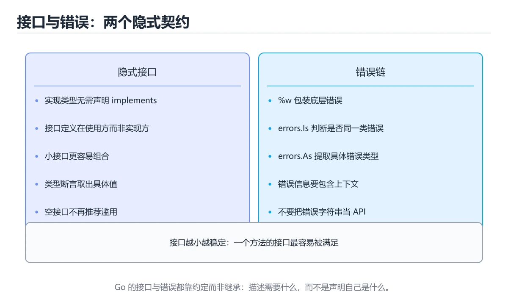
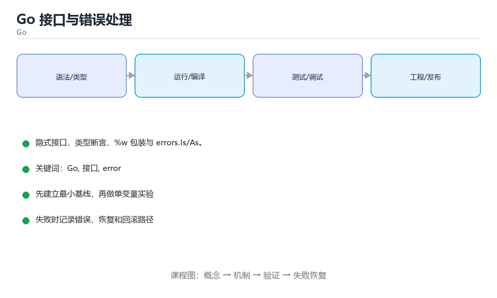

# Go 接口与错误处理

> 内容更新时间：2026-10-06 · 学习阶段：进阶 · 预计用时：30 分钟





## 学习目标

- 能用自己的话解释Go 接口与错误处理解决了什么问题，而不是只背术语。
- 能说清 「Go」、「接口」、「error」、「errors.Is」 之间的关系，并分别举出一个例子。
- 能把 Go 放回「Go 接口与错误处理」的知识体系，说明它和 接口 的边界。
- 能完成本课练习，并用验收标准检查自己的结果。

> 一句话摘要：隐式接口、类型断言、%w 包装与 errors.Is/As。

## 前置知识

- 先完成上一课《Go 并发：goroutine、channel 与 context》；如果已经掌握，可以直接用本课练习自测。
- 本课阶段：入门。只需要基本计算机操作，不要求编程经验。
- 开始前先复习：Go、接口、error。
- 卡在 Go 上时不要跳过：把输入、预期和实际输出写成三行，再回头读正文。

## 接口：隐式实现

Go 的接口是**方法集合**，类型只要实现了这些方法就自动满足接口，无需显式声明。这让「先定义接口还是先写实现」不再互相牵制。

| 实践 | 说明 |
| --- | --- |
| 接口要小 | 单方法接口（Reader/Writer）最易复用 |
| 定义在消费方 | 由使用方声明所需的最小接口，便于替身测试 |
| 空接口与新写法 | `any` 等价于 `interface{}`，尽量避免滥用 |
| 类型断言 | `v, ok := x.(T)` 安全断言；`switch v := x.(type)` 分支判断 |

## 错误处理

Go 用返回值表达错误：`func() (T, error)`，调用方必须显式检查。

```text
包装：fmt.Errorf("load config: %w", err)   // %w 保留错误链
判断：errors.Is(err, os.ErrNotExist)        // 链上任意一层匹配
提取：errors.As(err, &pathErr)              // 取具体类型
```

要点：错误要带上下文（谁、做什么、什么参数），但不要重复堆叠；哨兵错误（`var ErrNotFound = errors.New(...)`）用于可判定场景；自定义错误类型用于携带结构化信息。

## panic 与 recover

panic 只用于**不可恢复**的程序错误（配置缺失、越界访问），不要用它做流程控制。`recover` 只应在库的边界或 HTTP 中间件里兜底，避免整个进程崩溃。

## 本课小结

接口靠约定而非声明，错误靠返回值而非异常：**小接口 + 显式错误 + %w 包装 + errors.Is/As 判定**，是 Go 代码可维护性的基础。

## 接口速查

| 概念 | 说明 |
| --- | --- |
| 隐式实现 | 只要方法集匹配即自动实现接口 |
| 小接口 | 单方法接口（如 `io.Reader`）更易组合 |
| 空接口 `any` | 可存任意值，使用需断言 |
| 类型断言 | `v, ok := x.(T)`，双返回值安全 |
| 类型分支 | `switch v := x.(type) { ... }` |
| 接口嵌套 | `interface { io.Reader; io.Writer }` |
| 接口即约定 | 通常在使用方定义，而非实现方 |

```go
// 小接口 + 组合，比大接口更灵活
type Notifier interface {
	Notify(ctx context.Context, message string) error
}

type MultiNotifier struct {
	notifiers []Notifier
}

func (m *MultiNotifier) Notify(ctx context.Context, message string) error {
	var errs []error
	for _, n := range m.notifiers {
		if err := n.Notify(ctx, message); err != nil {
			errs = append(errs, err) // 不中断，收集全部错误
		}
	}
	return errors.Join(errs...)
}
```

## 错误处理速查

| 目的 | 写法 |
| --- | --- |
| 创建错误 | `errors.New("msg")`、`fmt.Errorf("...: %w", err)` |
| 包装并保留链 | `fmt.Errorf("读取配置失败: %w", err)` |
| 判断错误值 | `errors.Is(err, os.ErrNotExist)` |
| 提取错误类型 | `var pathErr *os.PathError; errors.As(err, &pathErr)` |
| 合并多个错误 | `errors.Join(err1, err2)` |
| 哨兵错误 | `var ErrNotFound = errors.New("not found")` |
| 自定义错误类型 | 实现 `Error() string` 的结构体 |
| 不可恢复错误 | `panic`（仅用于程序缺陷或初始化失败） |
| 恢复 | `defer func() { if r := recover(); r != nil { ... } }()` |

```go
var ErrNotFound = errors.New("not found")

func (s *Store) Get(id int) (User, error) {
	user, ok := s.data[id]
	if !ok {
		return User{}, fmt.Errorf("store.Get(%d): %w", id, ErrNotFound)
	}
	return user, nil
}

// 调用方按错误类型分支处理
user, err := store.Get(42)
switch {
case errors.Is(err, ErrNotFound):
	// 映射成 404
case err != nil:
	// 其他错误：记录并返回 500
default:
	_ = user
}
```

## 常见错误与排查

| 容易写错的做法 | 实际现象 | 原因与正确做法 |
| --- | --- | --- |
| 用 `==` 比较包装后的错误 | 判断失败 | 用 `errors.Is` 穿透包装 |
| 用 `%v` 包装错误 | 丢失错误链 | 用 `%w` |
| 到处 `panic` | 服务整体崩溃 | 只在启动期或不可恢复时 panic |
| `recover` 后不记录日志 | 问题被吞 | 记录堆栈并转成 error 返回 |
| 错误信息重复上下文 | 日志出现「读取失败: 读取失败」 | 只在跨越边界时补充上下文 |
| 定义过大的接口 | 难以 mock、实现臃肿 | 拆成小接口，按需组合 |
| 在实现方定义接口 | 依赖方向错误 | 接口定义在使用方 |
| 接口值为 nil 判断错误 | 非 nil 但调用 panic | 注意具体类型为 nil 时的接口包装 |
| 忘记 `defer` 关闭资源 | 文件与连接泄漏 | `defer f.Close()` 紧跟创建之后 |
| 忽略 `defer` 中的错误 | 写入失败未发现 | 命名返回值 + `defer` 检查错误 |

## 复习与自测

- [ ] 接口按使用方需要定义，保持小而专注。
- [ ] 错误用 `%w` 包装，用 `errors.Is` 与 `errors.As` 判断。
- [ ] 只在启动期或不可恢复时使用 `panic`。
- [ ] `recover` 之后一定记录日志。
- [ ] 资源创建后立刻 `defer` 释放。

## 零基础详解：接口是「能力清单」，error 是「签收回执」

### 一句话说清它是什么

Go 的接口是**隐式实现**的：只要你的类型有这些方法，就算实现了它，不用写 `implements`。
错误处理则坚持**显式返回**：函数把 error 当作第二个返回值交给你，由你决定怎么处理。

### 用生活比喻理解

| 概念 | 比喻 | 说明 |
| --- | --- | --- |
| 接口 | 岗位要求清单 | 满足要求就能上岗，不需要登记 |
| 方法集 | 会的技能 | 有这些方法就满足接口 |
| error | 签收回执 | 每次调用都要看一眼 |
| `%w` 包装 | 转交时附上来源说明 | 保留原始错误，便于追根 |
| panic | 火警 | 只在真的失控时拉响 |

### 接口的两条最佳实践

```go
// 1. 接口定义在使用方，而不是实现方
type Store interface {
    Save(user User) error
}

// 2. 接口要小，一个方法最好
type Stringer interface {
    String() string
}
```

小接口更容易被满足，也更容易组合；`io.Reader`、`io.Writer` 就是最好的例子。

### 错误处理的三种层次

```go
var ErrNotFound = errors.New("记录不存在")     // 1. 哨兵错误，供比较

func Find(id int) (User, error) {
    u, err := db.Query(id)
    if err != nil {
        // 2. 包装错误，保留原因并加上下文
        return User{}, fmt.Errorf("查询用户 %d 失败: %w", id, err)
    }
    if u.ID == 0 {
        return User{}, ErrNotFound
    }
    return u, nil
}

// 3. 调用方按类型或值判断，而不是比字符串
if errors.Is(err, ErrNotFound) {
    // 处理「没找到」
}

var pathErr *os.PathError
if errors.As(err, &pathErr) {
    fmt.Println("出错路径：", pathErr.Path)
}
```

### error 判断方式对照

| 写法 | 用途 | 注意 |
| --- | --- | --- |
| `err != nil` | 最常见 | 必写，别忽略 |
| `errors.Is` | 判断是不是某个具体错误 | 能穿透 `%w` 包装 |
| `errors.As` | 把错误转成具体类型 | 用于需要读字段的场景 |
| 比较错误字符串 | 判断错误内容 | **不要用**，日志一变就失效 |

### panic 与 recover 的正确用法

```go
func safeDivide(a, b int) (result int, err error) {
    defer func() {
        if r := recover(); r != nil {
            err = fmt.Errorf("除零保护: %v", r)
        }
    }()
    return a / b, nil
}
```

规则：**可预期的问题用 error，不可恢复的程序缺陷才 panic**；
`recover` 只应出现在服务或任务的边界（例如 HTTP 中间件），不要到处写。

### 新手最容易踩的八个坑

| 坑 | 现象 | 正确做法 |
| --- | --- | --- |
| 忽略 error | 问题延后爆发 | 每个 error 都处理 |
| 用字符串比较错误 | 日志一变就失效 | 用 `errors.Is` 或 `As` |
| 包装时用 `%v` | 丢失错误链 | 用 `%w` |
| 接口定义得太胖 | 没人能实现 | 拆成一两个方法 |
| 返回接口而不是具体类型 | 调用方失去信息 | 返回具体类型，接收用接口 |
| 到处 panic | 一个错误搞崩服务 | 改回 error 返回 |
| `recover` 写在错误的层级 | 抓不到 | 放在 defer 中且在同一 goroutine |
| nil 接口不等于 nil | 判空失效 | 注意「带类型的 nil」陷阱 |

### 手把手练习：带错误链的配置读取

```go
package main

import (
    "errors"
    "fmt"
)

var ErrMissingKey = errors.New("缺少配置项")

type Config map[string]string

func (c Config) Require(key string) (string, error) {
    value, ok := c[key]
    if !ok || value == "" {
        return "", fmt.Errorf("读取配置 %q: %w", key, ErrMissingKey)
    }
    return value, nil
}

func main() {
    cfg := Config{"host": "localhost"}
    _, err := cfg.Require("port")
    if errors.Is(err, ErrMissingKey) {
        fmt.Println("配置不完整：", err)
    }
}
```

### 学完自测

- [ ] 能解释「隐式实现接口」的含义。
- [ ] 知道为什么接口要定义在使用方且尽量小。
- [ ] 能说出 `errors.Is` 与 `errors.As` 的区别。
- [ ] 知道包装错误要用 `%w` 而不是 `%v`。
- [ ] 能说出 panic 与 error 各自适用的场景。

## 动手练习

> 本课练习重点：围绕「Go、接口、error」完成复述、实验和交付，每个结果都要能被别人检查。

写一个只包含 Go 的最小程序，先验证正常路径，再制造一次失败。

### 练习 1：建立心智模型（10 分钟）

合上教程，用 3～5 句话回答：

1. Go 接口与错误处理解决了什么问题？
2. 如果没有它，会出现什么具体后果？
3. 它和「接口」是什么关系？

验收标准：说明 Go 与 接口 的分工，并写出一个失效场景。

### 练习 2：做一次可控实验（20 分钟）

从正文中选一个最小示例，完成以下操作：

1. 先预测修改一个参数、输入或步骤后的结果。
2. 再实际执行或逐步推演，记录真实结果。
3. 如果结果与预测不同，写出差异原因。

**验收标准**：用 MultiNotifier 复现原例后，把接口改成边界值，五步记录缺一不可，其中「原因」一栏要写明「Go 接口与错误处理」里哪条规则被触发。

### 练习 3：交付一个小结果（30 分钟）

写一个只包含 Go 的最小程序，先验证正常路径，再制造一次失败。

任务要求：

- 结果必须能被别人检查，不能只写“我已经理解了”。
- 至少覆盖「Go」和「接口」两个关键词。
- 写出 1 个仍然不确定的问题，以及下一步如何验证。

> 提示：时间有限时优先做练习 1 和练习 2；练习 3 可以拆成两次完成。

## 可运行练习

本节围绕Go 接口与错误处理安排 3 个可交付任务，每个任务都要求留下可以复查的记录。

### 任务 1：用自己的话画出结构

不看书，用一张图说清「Go 接口与错误处理」的结构，画完再对照骨架：

- 主干：接口：隐式实现 → 错误处理 → panic 与 recover → 接口速查
- 连接线：在每条边上标出输入、输出与失败路径。
- 自检：能否用一句话说明Go与接口的关系？

### 任务 2：做一次对比实验

**验收标准**：用 MultiNotifier 做一次真实对照，结论要说明在「Go 接口与错误处理」的哪个前提下成立。

### 任务 3：迁移到自己的场景

**验收标准**：结论要附带 MultiNotifier 的可复现记录，并说明 Go 在「接口：隐式实现」里的位置。

## 故障现场

### 现场 1：到处 panic

**症状**：在《Go 接口与错误处理》的复现场景中，服务整体崩溃。

**根因**：当出现“到处 panic”时，执行路径已经绕过了《Go 接口与错误处理》的关键约束，最终以“服务整体崩溃”暴露出来；修复前必须先确认约束在哪里失效。

**修复**：针对《Go 接口与错误处理》的问题，只在启动期或不可恢复时 panic。

**验证**：先在《Go 接口与错误处理》中记录“到处 panic”留下的失败证据，再执行“只在启动期或不可恢复时 panic”并重放；确认错误路径变为明确结果，且修复没有掩盖同类故障。

### 现场 2：错误信息重复上下文

**症状**：在《Go 接口与错误处理》的复现场景中，日志出现「读取失败: 读取失败」。

**根因**：“日志出现「读取失败: 读取失败」”只是表层结果。向上追溯会落到“错误信息重复上下文”这一步，因为它省略了《Go 接口与错误处理》的约束，使实现行为和预期模型发生了偏离。

**修复**：针对《Go 接口与错误处理》的问题，只在跨越边界时补充上下文。

**验证**：先在《Go 接口与错误处理》中记录“错误信息重复上下文”留下的失败证据，再执行“只在跨越边界时补充上下文”并重放；确认错误路径变为明确结果，且修复没有掩盖同类故障。

### 现场 3：定义过大的接口

**症状**：在《Go 接口与错误处理》的复现场景中，难以 mock、实现臃肿。

**根因**：“难以 mock、实现臃肿”只是表层结果。向上追溯会落到“定义过大的接口”这一步，因为它省略了《Go 接口与错误处理》的约束，使实现行为和预期模型发生了偏离。

**修复**：针对《Go 接口与错误处理》的问题，拆成小接口，按需组合。

**验证**：保留《Go 接口与错误处理》里触发“难以 mock、实现臃肿”的输入、版本和日志，按“拆成小接口，按需组合”完成修改后原样重放；只有失败现象消失且相邻场景仍可解释，才保留改动。

## 版本与时效

- 升级前先用 MultiNotifier 建立基线：记录版本、命令和输出，升级后只比较这些可观察量。
- 模块校验、最小版本选择与供应链安全是生产升级的重点
- 官方发布说明：https://go.dev/doc/devel/release

### 升级检查清单

- 先固定当前版本，跑通全部示例与测验，再升级工具链。
- 升级时只动一个依赖版本，用 MultiNotifier 记录构建与运行结果。
- 升级后重点回归 Go 的默认值、警告信息与错误格式。
- 升级完成后更新本课「最后复核 / 下次复核」日期，并记录 Go 的版本变化。

## 本课复习清单

离开本课前，逐项确认：

- [ ] 不看解析，能说出「Go 中类型如何满足一个接口？」的判断依据。
- [ ] 不看解析，能说出「要保留错误链并添加上下文，应该用？」的判断依据。
- [ ] 不看解析，能说出「panic 的合理使用场景是？」的判断依据。
- [ ] 不看解析，能说出「errors.Is 与 errors.As 的区别是？」的判断依据。
- [ ] 不看解析，能说出「类型断言 v, ok := x.(T) 中 ok 的含义是？」的判断依据。
- [ ] 跑通「Go 接口与错误处理」的最小示例，并记录一次失败输入的处理方式。
- [ ] 把本课最容易混淆的两个概念写成一句话对照。

| 复盘项 | 记录 |
| --- | --- |
| 已经能独立解释的考点 |  |
| 仍然说不清的概念 |  |
| 下一步验证动作 |  |

## 术语速查

| 术语 | 一句话说明 |
| --- | --- |
| `Go` | 由 Google 设计的静态编译语言，强调简单语法、并发和部署便利。 |
| `接口` | Go 的接口是方法集合，类型只要实现了这些方法就自动满足接口，无需显式声明。这让「先定义接口还是先写实现」不再互相牵制。 |
| `一句话说清它是什么` | Go 的接口是隐式实现的：只要你的类型有这些方法，就算实现了它，不用写 implements。 |
| `接口的两条最佳实践` | // 1. 接口定义在使用方，而不是实现方。 |

## 考点精讲

### 考点 1：概念判断·Go

- **题目**：Go 中类型如何满足一个接口？
- **判断依据**：在「Go 接口与错误处理」里，只要方法集匹配即隐式满足。隐式实现让接口可以定义在消费方，接口也能保持很小。回到「Go 接口与错误处理」的正文示例，用“Go 中类型如何满足一个接口”走一遍Go、接口、error的完整流程，能复现的结论才可以保留。

### 考点 2：代码补全·Go

- **题目**：阅读「Go 接口与错误处理」正文里的这段 Go 代码，下面哪一项判断是正确的？
- **判断依据**：在「Go 接口与错误处理」里，题干的正确项是这段代码包含条件分支，不同输入会走不同的执行路径，在「Go 接口与错误处理」里分支条件由Go决定，替换条件后结论可能变化。把输入或边界换成空值、极值或失败情况后，结论要以「Go 接口与错误处理」的实际运行结果为准。把“这段代码包含条件分支”代回「Go 接口与错误处理」里“阅读Go 接口与错误处理正文里的这段 Go 代码”的例子核对，条件一旦改变，结论就要用Go、接口、error重新推导。

### 考点 3：概念判断·Go

- **题目**：panic 的合理使用场景是？
- **判断依据**：在「Go 接口与错误处理」里，不可恢复的程序错误。可预期错误应通过 error 返回值处理，panic 只用于程序缺陷。在「Go 接口与错误处理」里判断这道题，要把Go、接口、error的条件、过程与失败路径逐项对齐，换成“panic 的合理使用场景是”这个场景，只有满足前提的结论才成立。

### 考点 4：概念判断·Go

- **题目**：errors.Is 与 errors.As 的区别是？
- **判断依据**：在「Go 接口与错误处理」里，结论应落在「Is 判断错误链中是否包含目标错误值」。配合 %w 包装错误，Is/As 能穿透多层包装，比字符串比较可靠得多。在「Go 接口与错误处理」里，这道题要求区分概念与边界，「Is 判断错误链中是否包含目标错误值」只有在题干给出的前提下才成立，而「Is 只能用于 panic」、「As 只能比较字符串」缺少同一组条件。

### 考点 5：多选辨析·Go

- **题目**：围绕“Go 接口与错误处理”中的 Go、接口、error，下列哪两项是本课强调的实践判断？
- **判断依据**：在「Go 接口与错误处理」里，学习 Go 时要同时说明输入、输出和失败路径，不能只看正常流程。在Go 接口与错误处理里，判断 接口 时要固定版本与边界输入，所以“验证 接口 时要固定版本并覆盖边界输入，结论才可复现”才可复现。“围绕Go”与「Go 接口与错误处理」的术语表相呼应，只有符合Go、接口、error约束的“学习 Go 时要同时说明输入”才是正文支持的结论。

### 考点 6：填空·Go

- **题目**：补全代码：「Go 接口与错误处理」示例中，下面这行代码缺少哪个关键字或函数名？请填入 ____。 `判断：errors.Is(err, os.____) // 链上任意一层匹配`
- **判断依据**：在「Go 接口与错误处理」里，ErrNotExist。在「Go 接口与错误处理」里判断这道题，要把Go、接口、error的条件、过程与失败路径逐项对齐，换成“补全代码”这个场景，只有满足前提的结论才成立。“接口与错误处理示例中”与「Go 接口与错误处理」的术语表相呼应，只有符合Go、接口、error约束的“ErrNotExist”才是正文支持的结论。

## English Overview

**Title:** Go Interfaces & Errors

**Summary:** Implicit interfaces, assertions and error wrapping.

**Category:** Go
**Level:** 入门
**Key terms:** Go, 接口, error, errors.Is, panic

## 内容元数据

- 内容版本：v2.0
- 最后更新：2026-10-06
- 学习阶段：进阶
- 适用环境：Go 1.24+
；本课聚焦 Go。
- 内容来源：内置结构化课程与工程实践整理
- 相关主题：Go、接口、error、errors.Is、panic
- 质量版本：P0 测验标准 + P1 覆盖扩展 + P2 体验补全

## 参考资料与复核

- 最后复核：2026-10-04
- 下次复核：2027-04-17
- 复核范围：版本兼容、API 行为、安全建议与工程实践
- 来源性质：官方文档、标准或权威教材；正文为离线教学重组

| 参考资料 | 本课用途 |
| --- | --- |
| [Effective Go](https://go.dev/doc/effective_go) | 惯用写法与接口设计 |
| [Go Modules](https://go.dev/doc/modules/) | 模块、版本与依赖 |
| [Go 并发](https://go.dev/talks/2012/concurrency.slide) | goroutine 与 channel |

> 「Go 接口与错误处理」的链接用于离线阅读后的延伸核对；App 不会自动联网。
