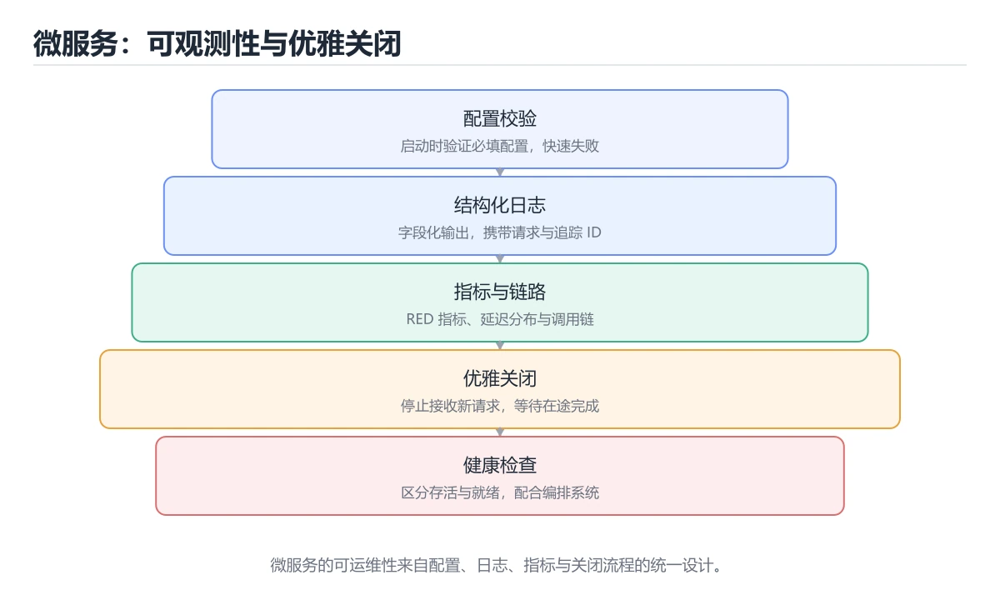
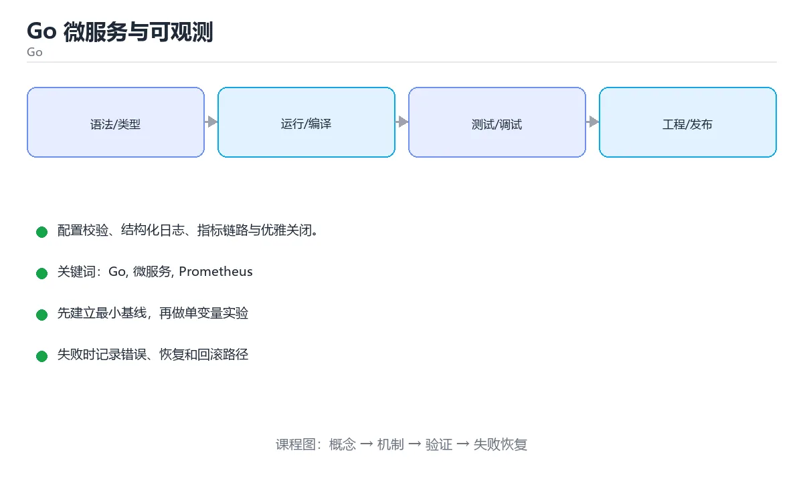

# Go 微服务与可观测





> 内容更新时间：2026-10-03 · 学习阶段：基础 · 预计用时：16 分钟

## 学习目标

- 能用自己的话解释Go 微服务与可观测解决了什么问题，而不是只背术语。
- 能说清 「Go」、「微服务」、「Prometheus」、「OpenTelemetry」 之间的关系，并分别举出一个例子。
- 能把本课知识放回「Go」的知识体系，说明它和相邻主题的边界。
- 能完成本课练习，并用验收标准检查自己的结果。

> 一句话摘要：配置校验、结构化日志、指标链路与优雅关闭。

## 前置知识

- 先完成上一课《Go 性能优化与内存》；如果已经掌握，可以直接用本课练习自测。
- 本课阶段：基础。建议会读写简单代码或命令，并理解变量、输入输出等基本概念。
- 开始前先复习：Go、微服务、Prometheus。
- 如果某一步看不懂，先记录具体卡点，完成练习后再回头读一遍。

## 服务骨架

一个可上线的 Go 服务至少包含：配置加载与校验、日志、HTTP/gRPC 入口、健康检查、指标暴露、优雅关闭。目录上常用 `cmd/server`（入口）+ `internal/`（业务与适配器）。

## 配置与日志

配置从环境变量/文件读取后**必须校验**（缺端口、非法 URL 要在启动时失败，而不是运行时才发现）。日志用标准库 `log/slog` 输出结构化 JSON，字段包含 request_id、user_id、耗时与错误，便于检索聚合。

## 可观测三件套

| 维度 | 方案 |
| --- | --- |
| 指标 | Prometheus 客户端暴露 /metrics（QPS、延迟直方图、错误计数、goroutine 数） |
| 链路 | OpenTelemetry 自动埋点，trace_id 注入日志 |
| 日志 | slog + 结构化字段，集中采集 |

延迟指标要用**直方图**而不是平均值，才能算出 P95/P99。

## 优雅关闭

```text
signal.NotifyContext(ctx, os.Interrupt, syscall.SIGTERM)
<-ctx.Done()
server.Shutdown(timeoutCtx)   // 停止接收新请求，等待在途请求完成
```

顺序很关键：先停止接收新流量，等在途请求结束，再关闭数据库与消息队列连接，最后退出。

## 常见坑

1. 没设超时与重试预算，故障时线程/连接被占满。
2. 健康检查只 ping 自己，没有检查依赖（应区分 liveness 与 readiness）。
3. 容器里 goroutine 泄漏或文件句柄未关，长时间运行后内存与 fd 上涨。
4. 配置写死在代码里，改环境要重新构建。

## 本课小结
Go 微服务的上线标准：**配置校验 + 结构化日志 + 指标/链路 + 优雅关闭 + 健康检查**，缺一项在高并发下都会变成事故。

## 服务骨架速查

| 主题 | 建议做法 |
| --- | --- |
| 配置加载 | 启动时读取环境变量并校验，缺失必填项直接失败 |
| 依赖装配 | `main` 里显式构造依赖并注入，避免全局变量 |
| 路由 | `http.ServeMux` 或轻量框架，版本前缀 `/api/v1` |
| 中间件 | 恢复 panic、日志、请求 ID、鉴权、限流 |
| 优雅关闭 | 监听 `SIGTERM`，先停止接流量再等待在途请求 |
| 健康检查 | `/livez` 只看进程，`/readyz` 检查依赖 |
| 可观测 | 结构化日志 + 指标 + 链路 ID |
| 错误返回 | 统一错误码与 HTTP 状态码映射 |

```go
func main() {
	ctx, stop := signal.NotifyContext(context.Background(),
		syscall.SIGINT, syscall.SIGTERM)
	defer stop()

	cfg, err := config.Load()          // 启动即校验配置
	if err != nil {
		log.Fatalf("配置错误：%v", err)
	}

	srv := &http.Server{
		Addr:              cfg.Addr,
		Handler:           newRouter(cfg),
		ReadHeaderTimeout: 5 * time.Second,
	}

	go func() {
		if err := srv.ListenAndServe(); err != nil && !errors.Is(err, http.ErrServerClosed) {
			log.Fatalf("服务异常退出：%v", err)
		}
	}()

	<-ctx.Done()                        // 等待终止信号
	log.Println("开始优雅关闭")

	shutdownCtx, cancel := context.WithTimeout(context.Background(), 15*time.Second)
	defer cancel()
	if err := srv.Shutdown(shutdownCtx); err != nil {
		log.Printf("关闭超时：%v", err)
	}
	log.Println("已退出")
}
```

## 可观测性速查

| 维度 | 关键内容 |
| --- | --- |
| 日志 | 结构化（JSON）、带 `trace_id`、按级别输出，不打印敏感信息 |
| 指标 | QPS、错误率、P95/P99 延迟、并发数、队列长度、goroutine 数 |
| 链路 | 入口生成 trace id，跨服务透传（HTTP Header / gRPC Metadata） |
| 告警 | 基于 SLO 与错误预算，避免噪声告警 |
| 健康 | `/livez` 与 `/readyz` 分开，readiness 检查下游依赖 |

## 常见错误对照表

| 容易踩的做法 | 实际现象 | 原因与正确做法 |
| --- | --- | --- |
| 直接 `srv.Close()` 关闭 | 在途请求被中断 | 用 `Shutdown` + 超时 |
| 只监听 SIGINT | 容器里收不到停止信号 | 同时监听 SIGTERM |
| 配置缺失时用默认值硬扛 | 线上行为诡异 | 必填项启动即校验并失败 |
| readiness 检查所有依赖 | 下游抖动导致全实例摘除 | 只检查关键依赖，或分级降级 |
| 健康检查做重活 | 探针超时、误重启 | 轻量返回状态 |
| 日志用字符串拼接 | 无法结构化查询 | 用 `slog` 的键值对 |
| 缺少请求 ID | 跨服务排查困难 | 入口生成并透传 |
| goroutine 泄漏 | 内存持续上涨 | 每次请求都带 context 并可取消 |
| 不做限流与超时 | 单个慢依赖拖垮服务 | 客户端设超时、重试上限，服务端限流 |
| 重试无退避与幂等 | 放大故障、重复写入 | 指数退避 + 幂等键 |

## 自测清单

- [ ] 服务能优雅关闭并等待在途请求完成。
- [ ] 配置在启动时校验，缺失必填项直接失败。
- [ ] 日志结构化并带 trace id，指标覆盖延迟与错误率。
- [ ] 所有外部调用都有超时、限流与重试上限。
- [ ] `/livez` 与 `/readyz` 语义分离。

## 零基础详解：Go 微服务的工程要点

### 一句话说清它是什么

一个能上线的 Go 服务，除了业务逻辑，还必须具备四件事：
**能启动、能探活、能优雅退出、能被观测**。缺一件就会在发布或故障时出问题。

### 用生活比喻理解

| 概念 | 比喻 | 说明 |
| --- | --- | --- |
| 健康检查 | 体检报告 | 告诉编排系统能不能接流量 |
| 优雅关闭 | 收摊流程 | 不再接单，把手上活干完 |
| 中间件 | 安检通道 | 统一做日志、恢复、鉴权 |
| 指标 | 仪表盘 | 用数字描述运行状态 |
| 配置校验 | 出发前检查 | 启动时就把错误暴露出来 |

### 一个标准的服务骨架

```go
package main

import (
    "context"
    "errors"
    "log/slog"
    "net/http"
    "os"
    "os/signal"
    "syscall"
    "time"
)

func main() {
    ctx, stop := signal.NotifyContext(context.Background(), syscall.SIGINT, syscall.SIGTERM)
    defer stop()

    cfg, err := LoadConfig()                 // 1. 启动就校验配置
    if err != nil {
        slog.Error("配置无效", "err", err)
        os.Exit(1)
    }

    mux := http.NewServeMux()
    mux.HandleFunc("/healthz/live", func(w http.ResponseWriter, _ *http.Request) {
        w.WriteHeader(http.StatusOK)
    })
    mux.HandleFunc("/healthz/ready", func(w http.ResponseWriter, _ *http.Request) {
        if err := checkDependencies(ctx); err != nil {
            http.Error(w, "未就绪", http.StatusServiceUnavailable)
            return
        }
        w.WriteHeader(http.StatusOK)
    })
    mux.Handle("/api/", WithRecovery(WithLogging(apiHandler())))

    srv := &http.Server{
        Addr:              cfg.Addr,
        Handler:           mux,
        ReadHeaderTimeout: 5 * time.Second,   // 2. 必须设超时
        ReadTimeout:       15 * time.Second,
        WriteTimeout:      15 * time.Second,
        IdleTimeout:       60 * time.Second,
    }

    go func() {
        if err := srv.ListenAndServe(); err != nil && !errors.Is(err, http.ErrServerClosed) {
            slog.Error("服务启动失败", "err", err)
            stop()
        }
    }()
    slog.Info("服务已启动", "addr", cfg.Addr)

    <-ctx.Done()                             // 3. 等待退出信号
    slog.Info("开始优雅关闭")

    shutdownCtx, cancel := context.WithTimeout(context.Background(), 20*time.Second)
    defer cancel()
    if err := srv.Shutdown(shutdownCtx); err != nil {
        slog.Error("关闭超时", "err", err)
    }
}
```

### 两个探针的分工

| 路径 | 检查内容 | 失败后果 |
| --- | --- | --- |
| `/healthz/live` | 进程是否还活着（不查依赖） | 重启容器 |
| `/healthz/ready` | 依赖是否可用、是否完成预热 | 只摘流量 |

**把数据库检查放进 liveness 会引起重启风暴**：数据库抖一下，所有实例全部重启。

### 中间件的两个必备件

```go
func WithRecovery(next http.Handler) http.Handler {
    return http.HandlerFunc(func(w http.ResponseWriter, r *http.Request) {
        defer func() {
            if rec := recover(); rec != nil {
                slog.Error("请求 panic", "path", r.URL.Path, "err", rec)
                http.Error(w, "内部错误", http.StatusInternalServerError)
            }
        }()
        next.ServeHTTP(w, r)
    })
}

func WithLogging(next http.Handler) http.Handler {
    return http.HandlerFunc(func(w http.ResponseWriter, r *http.Request) {
        start := time.Now()
        next.ServeHTTP(w, r)
        slog.Info("请求完成",
            "method", r.Method, "path", r.URL.Path,
            "cost", time.Since(start).String())
    })
}
```

### 可观测性三件套

| 支柱 | Go 里的常见做法 | 回答什么问题 |
| --- | --- | --- |
| 指标 | Prometheus + 直方图 | 整体趋势、告警 |
| 日志 | `log/slog` 结构化输出 | 发生了什么 |
| 链路 | OpenTelemetry + trace id | 这次请求慢在哪 |

**延迟要用直方图而不是平均值**，否则 P95、P99 根本算不出来。

### 配置与依赖

```go
type Config struct {
    Addr        string
    DatabaseURL string
    JWTSecret   string
}

func LoadConfig() (Config, error) {
    cfg := Config{
        Addr:        envOr("ADDR", ":8080"),
        DatabaseURL: os.Getenv("DATABASE_URL"),
        JWTSecret:   os.Getenv("JWT_SECRET"),
    }
    if cfg.DatabaseURL == "" {
        return cfg, errors.New("缺少 DATABASE_URL")
    }
    if len(cfg.JWTSecret) < 32 {
        return cfg, errors.New("JWT_SECRET 至少要 32 个字符")
    }
    return cfg, nil
}
```

### 新手最容易踩的八个坑

| 坑 | 现象 | 正确做法 |
| --- | --- | --- |
| 不设 HTTP 超时 | 慢连接耗尽连接数 | 至少设 ReadHeaderTimeout |
| liveness 检查依赖 | 下游抖动引发重启风暴 | 依赖放 readiness |
| 直接 `os.Exit` | 在途请求被中断 | 用 `srv.Shutdown` |
| panic 不恢复 | 单个请求打挂整个进程 | 加 Recovery 中间件 |
| 配置不校验 | 运行到一半才崩 | 启动时全量校验 |
| 日志用字符串拼接 | 无法检索字段 | 用结构化日志 |
| 指标只有平均值 | 长尾问题看不见 | 用直方图算分位数 |
| 关闭没有超时 | 卡住不退出 | 给 Shutdown 带 context 超时 |

### 学完自测

- [ ] 能说出 liveness 与 readiness 的分工。
- [ ] 知道为什么 HTTP 服务必须设置超时。
- [ ] 能说出优雅关闭的三个步骤。
- [ ] 知道为什么延迟指标要用直方图。
- [ ] 能说出启动时校验配置的好处。

## 动手练习

> 本课练习重点：围绕「Go、微服务、Prometheus」完成复述、实验和交付，每个结果都要能被别人检查。

先写最小程序并用 go test 验证，再补 context、并发上限和错误传播。

### 练习 1：建立心智模型（10 分钟）

合上教程，用 3～5 句话回答：

1. Go 微服务与可观测解决了什么问题？
2. 如果没有它，会出现什么具体后果？
3. 它和「微服务」是什么关系？

**验收标准**：至少出现一个本课关键词，并写出一个反例、边界条件或失效场景。

### 练习 2：做一次可控实验（20 分钟）

从正文中选一个最小示例，完成以下操作：

1. 先预测修改一个参数、输入或步骤后的结果。
2. 再实际执行或逐步推演，记录真实结果。
3. 如果结果与预测不同，写出差异原因。

**验收标准**：留下「原例 → 改动 → 预测 → 结果 → 原因」五步记录。

### 练习 3：交付一个小结果（30 分钟）

写一个可运行的小程序，并用 `go test` 或 `go vet` 验证结果。

任务要求：

- 结果必须能被别人检查，不能只写“我已经理解了”。
- 至少覆盖「Go」和「微服务」两个关键词。
- 写出 1 个仍然不确定的问题，以及下一步如何验证。

> 提示：时间有限时优先做练习 1 和练习 2；练习 3 可以拆成两次完成。

## 实践任务

本节围绕Go 微服务与可观测安排 3 个可交付任务，每个任务都要求留下可以复查的记录。

### 任务 1：用自己的话画出结构

### 任务 2：做一次对比实验

**验收标准**：表格里两个方案的结论不能完全一样；写下“在什么条件下应该换方案”。

### 任务 3：迁移到自己的场景

**验收标准**：至少有一个可复现的命令、代码片段或数据样例；结论能被别人独立检查。

## 故障现场

### 现场 1：本课的 Go 常规用例通过，但边界用例失败

**症状**：在本课的练习或生产场景里出现“本课的 Go 常规用例通过，但边界用例失败”。

**复现**：准备一组最小输入，只保留触发“本课的 Go 常规用例通过，但边界用例失败”的必要条件，连续运行两次确认结果稳定。

**定位**：围绕“Go 的前置条件与取值边界没有写进代码，默认值掩盖了空值和极值”检查调用链、输入数据和环境配置，先验证假设再改代码。

**预防**：把“本课的 Go 常规用例通过，但边界用例失败”写成一条自动化用例，并在本课的验收清单里保留对应检查项。

### 现场 2：本课的 微服务 结果在两次运行之间不一致

**症状**：在本课的练习或生产场景里出现“本课的 微服务 结果在两次运行之间不一致”。

**复现**：准备一组最小输入，只保留触发“本课的 微服务 结果在两次运行之间不一致”的必要条件，连续运行两次确认结果稳定。

**定位**：围绕“微服务 依赖了当前版本、执行顺序或共享状态，单次运行无法暴露差异”检查调用链、输入数据和环境配置，先验证假设再改代码。

**预防**：把“本课的 微服务 结果在两次运行之间不一致”写成一条自动化用例，并在本课的验收清单里保留对应检查项。

### 现场 3：本课的验证只在开发机通过

**症状**：在本课的练习或生产场景里出现“本课的验证只在开发机通过”。

**定位**：围绕“环境版本、配置和输入规模与目标环境不同，Go 缺少可重复的验证记录”检查调用链、输入数据和环境配置，先验证假设再改代码。

## 版本与时效

- 升级前用 go vet、go test -race 与静态检查覆盖并发生命周期
- 模块校验、最小版本选择与供应链安全是生产升级的重点
- 官方发布说明：https://go.dev/doc/devel/release

### 升级检查清单

- 先固定当前版本，跑通全部示例与测验，再升级工具链。
- 只改一个版本变量，记录编译、测试、性能与产物体积的变化。
- 重点回归默认值、弃用警告、序列化格式、并发语义和错误信息。
- 升级完成后更新本课的“最后复核 / 下次复核”日期与版本说明。

## 本课复习清单

离开本课前，逐项确认：

- [ ] 不看解析，能说出「优雅关闭的正确顺序是？」的判断依据。
- [ ] 不看解析，能说出「要能计算 P95/P99 延迟，指标应该用？」的判断依据。
- [ ] 不看解析，能说出「配置校验应该发生在什么时候？」的判断依据。
- [ ] 不看解析，能说出的判断依据。
- [ ] 不看解析，能说出「gRPC 相比 REST + JSON 的主要优势是？」的判断依据。
- [ ] 至少运行一次本课示例，记录输入、输出和一个边界情况。
- [ ] 把本课最容易混淆的两个概念写成一句话对照。

| 复盘项 | 记录 |
| --- | --- |
| 已经能独立解释的考点 |  |
| 仍然说不清的概念 |  |
| 下一步验证动作 |  |

## 术语速查

把「Go 微服务与可观测」里反复出现的术语集中放在一起。复习时先遮住右列，尝试用自己的话解释，再回到正文核对。

| 术语 | 本课语境 |
| --- | --- |
| `[Go, 微服务, Prometheus, OpenTelemetry, 优雅关闭][index]` | 在「Go 微服务与可观测」里理解它的定义、输入和输出。 |
| `[Go, 微服务, Prometheus, OpenTelemetry, 优雅关闭][index]` | 本课用它说明边界条件与失败路径。 |
| `[Go, 微服务, Prometheus, OpenTelemetry, 优雅关闭][index]` | 结合「Go 微服务与可观测」的正文示例确认它的适用条件。 |
| `[Go, 微服务, Prometheus, OpenTelemetry, 优雅关闭][index]` | 在「Go 微服务与可观测」里理解它的定义、输入和输出。 |
| `[Go, 微服务, Prometheus, OpenTelemetry, 优雅关闭][index]` | 本课用它说明边界条件与失败路径。 |

## 考点精讲

### 考点 1：围绕“Go 微服务与可观测”中的 Go、微服务、Prometheus，下列哪两项是本课强调的实践判断？

- **判断依据**：在「Go 微服务与可观测」里，学习 Go 时要同时说明输入、输出和失败路径，不能只看正常流程。在Go 微服务与可观测里，判断 微服务 时要固定版本与边界输入，所以“验证 微服务 时要固定版本并覆盖边界输入，结论才可复现”才可复现。在「Go 微服务与可观测」里判断这道题，要把Go、微服务、Prometheus的条件、过程与失败路径逐项对齐，换成“围绕Go 微服务与可观测中的 Go、”这个场景，只有满足前提的结论才成立。

### 考点 2：这段 Go 代码是「Go 微服务与可观测」的示例片段，下面哪一项描述与它一致？

- **判断依据**：在「Go 微服务与可观测」里，这段代码包含条件分支，不同输入会走不同的执行路径。这段代码出自「Go 微服务与可观测」的正文示例，围绕Go、微服务、Prometheus展开；把输入或边界换成空值、极值或失败情况后，结论要以「Go 微服务与可观测」的实际运行结果为准。把“这段代码包含条件分支”代回「Go 微服务与可观测」里“这段 Go 代码是Go 微服务与可观测的示例片段”的例子核对，条件一旦改变，结论就要用Go、微服务、Prometheus重新推导。

### 考点 3：配置校验应该发生在什么时候？

- **判断依据**：启动即失败比运行到一半才崩更容易定位。在「Go 微服务与可观测」里，作答时，先用Go建立输入与输出的基线，再把启动时立即校验并失败代入边界条件核对，结论才能复现。在「Go 微服务与可观测」里，如果只凭关键词作答，很容易把「不用校验」、「首次使用时」与「启动时立即校验并失败」混在一起；

### 考点 4：Kubernetes 中 liveness 与 readiness 探针的区别是？

- **判断依据**：在「Go 微服务与可观测」里，结论应落在「liveness 失败会重启容器」。启动慢的服务要配合 startupProbe，避免 liveness 在初始化阶段误杀。在「Go 微服务与可观测」里，这道题要求区分概念与边界，「liveness 失败会重启容器」只有在题干给出的前提下才成立，而「两者完全一样」、「readiness 失败会重启容器」缺少同一组条件。

### 考点 5：gRPC 相比 REST + JSON 的主要优势是？

- **判断依据**：在「Go 微服务与可观测」里，基于 HTTP/2 多路复用与 Protobuf，强类型、序列化体积小、支持流式调用。内部服务间高频调用适合 gRPC，对外公开接口仍常选 REST 以便调试与兼容。“gRPC”与「Go 微服务与可观测」的术语表相呼应，只有符合Go、微服务、Prometheus约束的“基于 HTTP/2 多路复用与 Prot”才是正文支持的结论。

### 考点 6：补全代码：「Go 微服务与可观测」示例中，下面这行代码缺少哪个关键字或函数名？请填入 ____。

`____: 5 * time.Second,`

- **判断依据**：空格应填写「ReadHeaderTimeout」、「readheadertimeout」。在「Go 微服务与可观测」里判断这道题，要把Go、微服务、Prometheus的条件、过程与失败路径逐项对齐，换成“补全代码”这个场景，只有满足前提的结论才成立。回到「Go 微服务与可观测」的正文示例，用“补全代码”走一遍Go、微服务、Prometheus的完整流程，能复现的结论才可以保留。

## English Overview

**Title:** Go Microservices

**Summary:** Config, logging, metrics and graceful shutdown.

**Category:** Go
**Level:** 基础
**Key terms:** Go, 微服务, Prometheus, OpenTelemetry, 优雅关闭

## 内容元数据

- 内容版本：v2.0
- 最后更新：2026-10-03
- 学习阶段：基础
- 适用环境：Go 1.24+
- 内容来源：内置结构化课程与工程实践整理
- 相关主题：Go、微服务、Prometheus、OpenTelemetry、优雅关闭
- 质量版本：P0 测验标准 + P1 覆盖扩展 + P2 体验补全

## 参考资料与复核

- 最后复核：2026-10-04
- 下次复核：2027-04-04
- 复核范围：版本兼容、API 行为、安全建议与工程实践
- 来源性质：官方文档、标准或权威教材；正文为离线教学重组

| 参考资料 | 本课用途 |
| --- | --- |
| [net/http](https://pkg.go.dev/net/http) | HTTP 客户端与服务端 |
| [Effective Go](https://go.dev/doc/effective_go) | 惯用写法与接口设计 |
| [Go pprof](https://pkg.go.dev/net/http/pprof) | 性能剖析与火焰图 |

> 「Go 微服务与可观测」的链接用于离线阅读后的延伸核对；App 不会自动联网。
