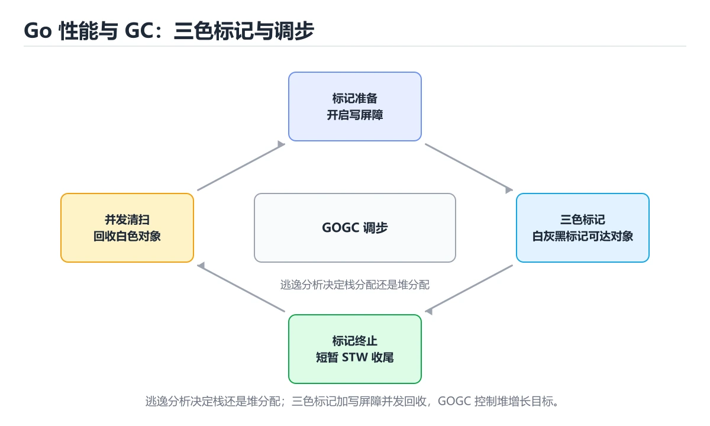
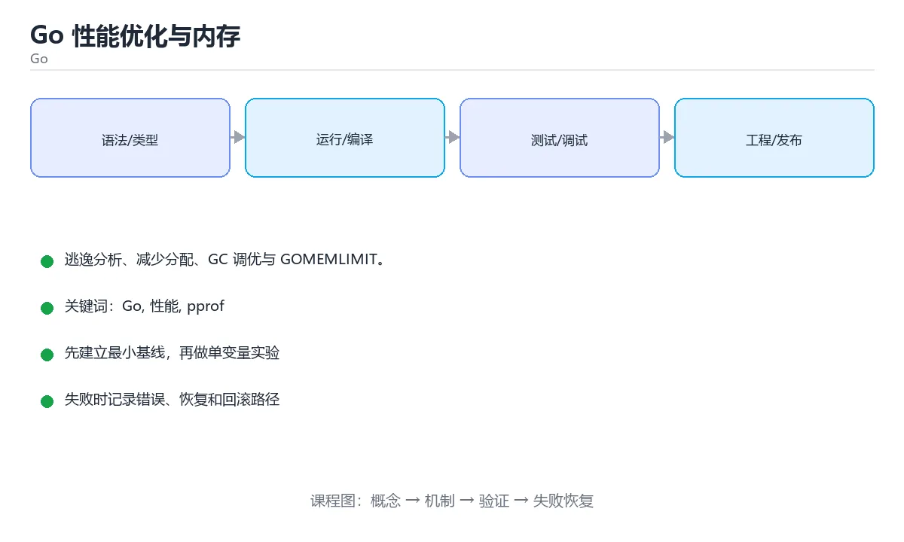

# Go 性能优化与内存





> 内容更新时间：2026-10-03 · 学习阶段：进阶 · 预计用时：16 分钟

## 学习目标

- 能用自己的话解释「Go 性能优化与内存」解决了什么问题，而不是只背术语。
- 能说清 「Go」、「性能」、「pprof」、「逃逸分析」 之间的关系，并分别举出一个例子。
- 能把本课知识放回「Go」的知识体系，说明它和相邻主题的边界。
- 能完成本课练习，并用验收标准检查自己的结果。

> 一句话摘要：逃逸分析、减少分配、GC 调优与 GOMEMLIMIT。

## 前置知识

- 先完成上一课《Go 泛型与标准库实战》；如果已经掌握，可以直接用本课练习自测。
- 本课阶段：进阶。建议先掌握同一分类的基础课程，并能独立运行正文中的最小示例。
- 开始前先复习：Go、性能、pprof。
- 如果某一步看不懂，先记录具体卡点，完成练习后再回头读一遍。


## 先测量再优化

顺序是：基准测试（`go test -bench`）→ pprof（CPU/内存/阻塞）→ 定位热点 → 改代码 → 复测。没有基准的优化都是猜测。

## 逃逸分析与内存分配

编译器决定变量分配在栈还是堆（`go build -gcflags="-m"` 可查看）。逃逸到堆会增加 GC 压力。常见逃逸原因：返回局部变量指针、接口装箱、闭包捕获、切片扩容。

减少分配的技巧：

| 手段 | 效果 |
| --- | --- |
| 预分配容量 `make([]T, 0, n)` | 避免多次扩容拷贝 |
| `strings.Builder` 拼接字符串 | 避免反复分配 |
| `sync.Pool` 复用临时对象 | 降低 GC 频率 |
| 传值 vs 传指针 | 小结构体传值更快（避免解引用与逃逸） |

## GC 调优

Go 的并发三色标记 GC 停顿很短（亚毫秒级），主要成本在 CPU 占用与内存放大。可用 `GOGC` 调整触发阈值（默认 100），或 `GOMEMLIMIT` 设置内存上限——容器环境推荐用 GOMEMLIMIT 防止 OOM。

## 并发与调度

GMP 模型：G（goroutine）、M（内核线程）、P（逻辑处理器）。默认 P 数等于 CPU 核数，CPU 密集任务调大没有收益，IO 密集任务靠 goroutine 数量与 context 控制。

## 常见误区

1. 过早用 `unsafe` 或手写汇编；2. 无脑加缓存导致内存膨胀；3. 用互斥锁保护高频只读数据（应用 atomic 或 RWMutex）；4. 忽略 pprof 结论凭经验改。

## 本课小结
Go 性能优化三件事：**基准与 pprof 定位热点、减少堆分配与 GC 压力、用 GOMEMLIMIT 控制内存上限**。


## 性能工具速查

| 目的 | 命令 / 写法 |
| --- | --- |
| 逃逸分析 | `go build -gcflags="-m -l" ./...` |
| 基准测试 | `go test -bench=. -benchmem ./...` |
| 与旧结果对比 | `go test -bench=. -count=10 > new.txt` + `benchstat old.txt new.txt` |
| CPU 剖析 | 测试中加 `-cpuprofile=cpu.out`，再 `go tool pprof -http=:8080 cpu.out` |
| 内存剖析 | `-memprofile=mem.out` |
| 阻塞剖析 | `runtime.SetBlockProfileRate` + `-blockprofile` |
| 互斥锁剖析 | `runtime.SetMutexProfileFraction` |
| 追踪 | `go test -trace=trace.out` + `go tool trace trace.out` |
| 线上剖析 | 引入 `net/http/pprof`，访问 `/debug/pprof/` |

## 常见优化手段速查

| 手段 | 收益 | 注意点 |
| --- | --- | --- |
| 预分配切片容量 | 减少扩容与拷贝 | `make([]T, 0, n)` |
| 用 `strings.Builder` | 减少字符串拼接分配 | 提前 `Grow` |
| 避免不必要的接口装箱 | 减少分配与间接调用 | 热点路径避免 `any` |
| 用值接收或指针接收统一 | 减少拷贝 | 小结构体传值，大结构体传指针 |
| 复用对象（`sync.Pool`） | 降低 GC 压力 | 池中对象可能被回收 |
| 批量处理 | 减少系统调用与锁竞争 | 注意批次大小的延迟权衡 |
| 并发处理 | 利用多核 | 用 `errgroup` 限制并发 |
| 设置 `GOMEMLIMIT` | 容器中避免 OOM | 结合 `GOGC` 调整 |
| 减少锁粒度 | 提升并发 | 注意一致性 |
| 用 `atomic` 替代互斥锁 | 计数场景更快 | 只适用于简单操作 |

```go
// 基准测试：同时报告内存分配
func BenchmarkParse(b *testing.B) {
	input := []byte(`{"id":1,"name":"小明"}`)
	b.ReportAllocs()
	b.ResetTimer()

	for i := 0; i < b.N; i++ {
		var user User
		if err := json.Unmarshal(input, &user); err != nil {
			b.Fatal(err)
		}
	}
}

// 并发处理 + 限制并发度 + 错误传播
func processAll(ctx context.Context, items []Item) error {
	g, ctx := errgroup.WithContext(ctx)
	g.SetLimit(8)                 // 最多 8 个并发

	for _, item := range items {
		item := item
		g.Go(func() error {
			return process(ctx, item)
		})
	}
	return g.Wait()
}
```

## 常见错误对照表

| 容易踩的做法 | 实际现象 | 原因与正确做法 |
| --- | --- | --- |
| 未做基准测试就优化 | 优化错地方，复杂度上升 | 先剖析定位热点 |
| 基准测试不计时重置 | 数据包含准备时间 | `b.ResetTimer()` |
| 单次运行就下结论 | 结果噪声大 | 多轮运行 + benchstat 对比 |
| 盲目使用 `sync.Pool` | 收益不明显甚至更慢 | 只对高分配热点使用 |
| 切片不预分配容量 | 频繁扩容拷贝 | `make([]T, 0, n)` |
| 热点路径大量接口转换 | 分配与间接调用 | 用具体类型或泛型 |
| goroutine 无上限 | 内存暴涨、调度开销大 | 用 `errgroup.SetLimit` 或信号量 |
| 忘记关闭响应体 | 连接泄漏 | `defer resp.Body.Close()` |
| 容器不设内存限制与 `GOMEMLIMIT` | 被 OOM Killer 杀掉 | 两者配合设置 |
| 生产开启 pprof 无鉴权 | 信息泄露 | 只在内网或加鉴权暴露 |

## 自测清单

- [ ] 优化前先用基准测试或 pprof 定位热点。
- [ ] 基准结果用 benchstat 对比，避免噪声误判。
- [ ] 热点路径避免不必要的分配与装箱。
- [ ] 并发任务限流并传播 context。
- [ ] 容器内存与 `GOMEMLIMIT` 配置配套。


## 零基础详解：性能分析与常见优化

### 一句话说清它是什么

Go 的性能优化只有一条正确路径：**先用 pprof 测量，找到热点，再改一处并复测**。
凭感觉改代码，往往把时间花在不重要的地方。

### 用生活比喻理解

| 工具 | 比喻 | 说明 |
| --- | --- | --- |
| pprof | 体检报告 | 告诉你哪里真的慢 |
| 基准测试 | 对照实验 | 改动前后对比数据 |
| 逃逸分析 | 判断住哪里 | 变量在栈上还是堆上 |
| sync.Pool | 共享储物柜 | 复用临时对象，减轻 GC |
| GOMEMLIMIT | 预算上限 | 告诉运行时内存天花板 |

### 三类 pprof 各看什么

| 类型 | 采集方式 | 回答什么问题 |
| --- | --- | --- |
| CPU | `pprof.StartCPUProfile` | 时间花在哪些函数 |
| 内存 | `pprof.WriteHeapProfile` | 谁在分配、谁在占用 |
| goroutine | `pprof.Lookup("goroutine")` | 是否泄漏、卡在哪 |
| 阻塞 | `pprof.Lookup("block")` | 谁在等待锁或 channel |

最省事的做法是引入 HTTP 端点：

```go
import (
    "net/http"
    _ "net/http/pprof"          // 注册 /debug/pprof/ 路由
)

func main() {
    go func() {
        // 只在内网或本机监听，别暴露到公网
        _ = http.ListenAndServe("127.0.0.1:6060", nil)
    }()
    // ... 启动你的服务
}
```

```bash
go tool pprof http://127.0.0.1:6060/debug/pprof/profile?seconds=30
go tool pprof http://127.0.0.1:6060/debug/pprof/heap
```

### 基准测试：优化的前提

```go
func BenchmarkConcat(b *testing.B) {
    parts := []string{"a", "b", "c", "d"}
    b.ReportAllocs()
    for i := 0; i < b.N; i++ {
        _ = strings.Join(parts, "")
    }
}
```

```bash
go test -bench . -benchmem -count=5
```

看三个数字：**每次耗时 ns/op、每次分配次数 allocs/op、每次分配字节 B/op**。

### 五个最常见的优化点

```go
// 1. 预分配切片容量，避免反复扩容
users := make([]User, 0, len(ids))
for _, id := range ids {
    users = append(users, load(id))
}

// 2. 拼接大量字符串用 Builder
var sb strings.Builder
sb.Grow(1024)
for _, s := range parts {
    sb.WriteString(s)
}
result := sb.String()

// 3. 复用临时对象（注意：池中对象随时可能被回收）
var bufPool = sync.Pool{
    New: func() any { return new(bytes.Buffer) },
}
buf := bufPool.Get().(*bytes.Buffer)
buf.Reset()
defer bufPool.Put(buf)

// 4. map 预分配，减少 rehash
cache := make(map[string]int, 1024)

// 5. 避免不必要的接口装箱与拷贝
func sum(nums []int) int {          // 传切片而不是数组，避免整体拷贝
    total := 0
    for _, n := range nums {
        total += n
    }
    return total
}
```

### 逃逸分析：为什么会有额外分配

```bash
go build -gcflags="-m" ./...
```

常见逃逸原因：

| 原因 | 例子 | 改进 |
| --- | --- | --- |
| 返回局部变量的指针 | `return &x` | 尽量返回值 |
| 存进 interface | `fmt.Println(x)` | 热点路径避免频繁装箱 |
| 闭包捕获 | `go func() { use(x) }()` | 明确传参 |
| 切片增长过大 | `append` 反复扩容 | 预分配容量 |
| 大小未知的栈对象 | 大数组局部变量 | 改用切片或降低体积 |

### 容器里的内存设置

```bash
# 让运行时知道容器内存上限，避免被 OOM Kill
GOMEMLIMIT=800MiB
GOMAXPROCS=4
```

| 环境变量 | 作用 |
| --- | --- |
| `GOMEMLIMIT` | 软性内存上限，比只调 GOGC 更可控 |
| `GOMAXPROCS` | 并行执行的 P 数量 |
| `GOGC` | GC 触发比例，默认 100 |

### 新手最容易踩的八个坑

| 坑 | 现象 | 正确做法 |
| --- | --- | --- |
| 凭感觉优化 | 改了半天没效果 | 先 pprof 定位 |
| 只测一次 | 数据波动误判 | `-count=5` 取多次结果 |
| 把 pprof 暴露公网 | 信息泄露 | 只监听内网或加鉴权 |
| 滥用 `sync.Pool` | 对象丢失导致 bug | 只放可重建的临时对象 |
| 忘记 `Grow` 或 `reserve` | 反复扩容 | 已知规模就预留 |
| 在热路径做字符串拼接 | 分配量巨大 | 用 `Builder` |
| 把大结构按值传 | 每次调用都拷贝 | 传指针或切片 |
| 忽略 GC 指标 | 延迟毛刺查不出 | 看 heap 与 GC 频率 |

### 手把手练习：优化一个统计函数

```go
// 优化前：多次分配、重复拼接
func slowJoin(words []string) string {
    out := ""
    for _, w := range words {
        out += w + ","
    }
    return out
}

// 优化后：一次预分配、无多余拷贝
func fastJoin(words []string) string {
    if len(words) == 0 {
        return ""
    }
    var sb strings.Builder
    sb.Grow(len(words) * 8)          // 估算长度
    for i, w := range words {
        if i > 0 {
            sb.WriteByte(',')
        }
        sb.WriteString(w)
    }
    return sb.String()
}
```

配合两个基准测试对比 `ns/op` 与 `allocs/op`，就能看到明确差距。

### 学完自测

- [ ] 能说出 CPU、内存、goroutine 三类 profile 各回答什么问题。
- [ ] 知道 `-benchmem` 输出的三个关键指标。
- [ ] 能列出至少四个常见逃逸原因。
- [ ] 知道 `sync.Pool` 适合放什么、不适合放什么。
- [ ] 能说出容器里为什么要设置 `GOMEMLIMIT`。

## 动手练习


> 本课练习重点：围绕「Go、性能、pprof」完成复述、实验和交付，每个结果都要能被别人检查。

先写最小程序并用 go test 验证，再补 context、并发上限和错误传播。

### 练习 1：建立心智模型（10 分钟）

合上教程，用 3～5 句话回答：

1. 「Go 性能优化与内存」解决了什么问题？
2. 如果没有它，会出现什么具体后果？
3. 它和「性能」是什么关系？

**验收标准**：至少出现一个本课关键词，并写出一个反例、边界条件或失效场景。

### 练习 2：做一次可控实验（20 分钟）

从正文中选一个最小示例，完成以下操作：

1. 先预测修改一个参数、输入或步骤后的结果。
2. 再实际执行或逐步推演，记录真实结果。
3. 如果结果与预测不同，写出差异原因。

**验收标准**：留下「原例 → 改动 → 预测 → 结果 → 原因」五步记录。

### 练习 3：交付一个小结果（30 分钟）

写一个可运行的小程序，并用 `go test` 或 `go vet` 验证结果。

任务要求：

- 结果必须能被别人检查，不能只写“我已经理解了”。
- 至少覆盖「Go」和「性能」两个关键词。
- 写出 1 个仍然不确定的问题，以及下一步如何验证。

> 提示：时间有限时优先做练习 1 和练习 2；练习 3 可以拆成两次完成。


## 可运行练习

下面 3 个任务围绕“Go 性能优化与内存”展开，代码可以直接粘贴到 App 的离线沙箱里运行；如果示例会读取标准输入，请按代码注释在沙箱的 stdin 区域填入同样格式的数据。

### 任务 1：先跑通，再解释

```bash
go tool pprof http://127.0.0.1:6060/debug/pprof/profile?seconds=30
go tool pprof http://127.0.0.1:6060/debug/pprof/heap
```

**预期输出**：运行后会输出与“Go 性能优化与内存”相关的关键结果；请重点核对输出行数、最后一个数值和异常提示。

**验收标准**：代码能正常运行；逐行解释每个变量的值如何变化，并指出哪一行决定了最终结果。

### 任务 2：只改一个条件

复制上面的代码，只修改一个输入、边界或参数（例如空值、最大值、循环次数、过滤条件），先写出你的预测，再实际运行。

**验收标准**：留下“原结果 → 改动 → 预测 → 实际结果 → 差异原因”五步记录；如果预测错误，要写出修正后的心智模型。

### 任务 3：迁移到自己的数据

用同一套思路处理一组你自己的数据或场景，保持输出格式与任务 1 一致。

**验收标准**：代码不少于 10 行，至少包含 1 个边界检查；把代码和运行结果保存到笔记或片段库。


## 故障现场

这一节把“Go 性能优化与内存”最常见的失败方式还原成现场记录，练习时按“症状 → 复现 → 定位 → 修复 → 预防”的顺序排查。

### 现场 1：“Go 性能优化与内存”的 Go 常规用例通过，但边界用例失败

**症状**：在“Go 性能优化与内存”的练习或生产场景里出现““Go 性能优化与内存”的 Go 常规用例通过，但边界用例失败”。

**复现**：准备一组最小输入，只保留触发““Go 性能优化与内存”的 Go 常规用例通过，但边界用例失败”的必要条件，连续运行两次确认结果稳定。

**定位**：围绕“Go 的前置条件与取值边界没有写进代码，默认值掩盖了空值和极值”检查调用链、输入数据和环境配置，先验证假设再改代码。

**修复**：为“Go 性能优化与内存”补一条空值或极值用例，把前置条件写成断言，并让失败信息直接指出是哪个输入越界

**预防**：把““Go 性能优化与内存”的 Go 常规用例通过，但边界用例失败”写成一条自动化用例，并在“Go 性能优化与内存”的验收清单里保留对应检查项。


### 现场 2：“Go 性能优化与内存”的 性能 结果在两次运行之间不一致

**症状**：在“Go 性能优化与内存”的练习或生产场景里出现““Go 性能优化与内存”的 性能 结果在两次运行之间不一致”。

**复现**：准备一组最小输入，只保留触发““Go 性能优化与内存”的 性能 结果在两次运行之间不一致”的必要条件，连续运行两次确认结果稳定。

**定位**：围绕“性能 依赖了当前版本、执行顺序或共享状态，单次运行无法暴露差异”检查调用链、输入数据和环境配置，先验证假设再改代码。

**修复**：固定“Go 性能优化与内存”使用的版本与随机种子，记录两次运行的完整输入和输出，再逐项消除非确定性来源

**预防**：把““Go 性能优化与内存”的 性能 结果在两次运行之间不一致”写成一条自动化用例，并在“Go 性能优化与内存”的验收清单里保留对应检查项。


### 现场 3：“Go 性能优化与内存”的验证只在开发机通过

**症状**：在“Go 性能优化与内存”的练习或生产场景里出现““Go 性能优化与内存”的验证只在开发机通过”。

**复现**：准备一组最小输入，只保留触发““Go 性能优化与内存”的验证只在开发机通过”的必要条件，连续运行两次确认结果稳定。

**定位**：围绕“环境版本、配置和输入规模与目标环境不同，Go 缺少可重复的验证记录”检查调用链、输入数据和环境配置，先验证假设再改代码。

**修复**：把“Go 性能优化与内存”的运行环境、输入样本和预期输出写成清单，并在另一套环境复跑同一条命令

**预防**：把““Go 性能优化与内存”的验证只在开发机通过”写成一条自动化用例，并在“Go 性能优化与内存”的验收清单里保留对应检查项。


## 版本与时效

这一节记录“Go 性能优化与内存”涉及的版本基线与升级检查点，避免把某个版本的默认行为当成永久结论。

- Go 1.25 是当前主线，泛型、range-over-func 与工具链持续增强
- 升级前用 go vet、go test -race 与静态检查覆盖并发生命周期
- 模块校验、最小版本选择与供应链安全是生产升级的重点
- 官方发布说明：https://go.dev/doc/devel/release

### 升级检查清单

- 先固定当前版本，跑通全部示例与测验，再升级工具链。
- 只改一个版本变量，记录编译、测试、性能与产物体积的变化。
- 重点回归默认值、弃用警告、序列化格式、并发语义和错误信息。
- 升级完成后更新本课的“最后复核 / 下次复核”日期与版本说明。


## 考点精讲：把测验题还原成判断过程

本课有 6 个判断点。先自己作答，再看「判断依据」；如果结论正确但理由不完整，回到正文对应章节补足概念。

### 考点 1：查看变量是否逃逸到堆，使用哪个编译参数？

- **正确判断**：-gcflags="-m"
- **判断依据**：逃逸到堆会增加 GC 压力，是常见的性能来源。其他选项：查看变量是否逃逸要用 -gcflags="-m"。针对「查看变量是否逃逸到堆，使用哪个编译参数，」，本课在「逃逸分析与内存分配」中说明：编译器决定变量分配在栈还是堆（go build -gcflags="-m" 可查看）。本课还在「本课小结」中说明：Go 性能优化三件事：基准与 pprof 定位热点、减少堆分配与 GC 压力、用 GOMEMLIMIT 控制内存上限。
- **迁移检查**：遮住选项，只根据定义复述一次答案，再回来看哪个选项与复述一致。

### 考点 2：容器环境防止被 OOM Kill 的推荐设置是？

- **正确判断**：设置 GOMEMLIMIT
- **判断依据**：正确答案是「设置 GOMEMLIMIT」，本课在「GC 调优」中说明：可用 GOGC 调整触发阈值（默认 100），或 GOMEMLIMIT 设置内存上限——容器环境推荐用 GOMEMLIMIT 防止 OOM。GOMEMLIMIT 给运行时一个内存上限，比 GOGC 更可控。本课还在「零基础详解：性能分析与常见优化」中说明：Go 的性能优化只有一条正确路径：先用 pprof 测量，找到热点，再改一处并复测。
- **迁移检查**：如果给某个错误选项去掉一个限定词，它会不会变成正确？说明理由。

### 考点 3：减少切片扩容拷贝的常用做法是？

- **正确判断**：make([]T, 0, n) 预分配容量
- **判断依据**：正确答案是「make([]T, 0, n) 预分配容量」，本课在「本课小结」中说明：Go 性能优化三件事：基准与 pprof 定位热点、减少堆分配与 GC 压力、用 GOMEMLIMIT 控制内存上限。预分配容量可避免多次扩容与元素拷贝。本课还在「逃逸分析与内存分配」中说明：常见逃逸原因：返回局部变量指针、接口装箱、闭包捕获、切片扩容。本课还在「零基础详解：性能分析与常见优化」中说明：Go 的性能优化只有一条正确路径：先用 pprof 测量，找到热点，再改一处并复测。
- **迁移检查**：如果给某个错误选项去掉一个限定词，它会不会变成正确？说明理由。

### 考点 4：sync.Pool 的典型用途是？

- **正确判断**：复用临时对象
- **判断依据**：正确答案是「复用临时对象」，本课在「常见误区」中说明：3. 用互斥锁保护高频只读数据（应用 atomic 或 RWMutex）。池中对象可能在任意时刻被回收，因此不能存放必须长期存在的数据。本课还在「先测量再优化」中说明：顺序是：基准测试（go test -bench）→ pprof（CPU/内存/阻塞）→ 定位热点 → 改代码 → 复测。本课还在「GC 调优」中说明：Go 的并发三色标记 GC 停顿很短（亚毫秒级），主要成本在 CPU 占用与内存放大。
- **迁移检查**：把题干里的一个条件换成边界值，原来的结论还成立吗？写出判断过程。

### 考点 5：pprof 采集 CPU 性能数据的原理是？

- **正确判断**：以固定频率采样 goroutine 调用栈并统计
- **判断依据**：正确答案是「以固定频率采样 goroutine 调用栈并统计」，本课在「零基础详解：性能分析与常见优化」中说明：看三个数字：每次耗时 ns/op、每次分配次数 allocs/op、每次分配字节 B/op。采样意味着耗时很短的函数可能不出现在结果里，需要结合多轮数据判断。本课还在「零基础详解：性能分析与常见优化」中说明：能说出 CPU、内存、goroutine 三类 profile 各回答什么问题。
- **迁移检查**：遮住选项，只根据定义复述一次答案，再回来看哪个选项与复述一致。

### 考点 6：补全代码：「Go 性能优化与内存」示例中，下面这行代码缺少哪个关键字或函数名？请填入 ____。 `g.____(8) // 最多 8 个并发`

- **正确判断**：SetLimit / setlimit
- **判断依据**：正确答案是「SetLimit」，本课在「零基础详解：性能分析与常见优化」中说明：知道 -benchmem 输出的三个关键指标。本课还在「先测量再优化」中说明：顺序是：基准测试（go test -bench）→ pprof（CPU/内存/阻塞）→ 定位热点 → 改代码 → 复测。本课还在「GC 调优」中说明：Go 的并发三色标记 GC 停顿很短（亚毫秒级），主要成本在 CPU 占用与内存放大。
- **迁移检查**：如果填成相近的另一个函数或关键字，程序会在哪一步出错？

### 补充自测（2 题）

1. 围绕“Go 性能优化与内存”中的 Go、性能、pprof，下列哪两项是本课强调的实践判断？
2. 下面这段 Go 代码复现了“Go 性能优化与内存”中 Go、性能、pprof 相关的一个常见故障，哪一项最准确地解释了问题？

这些题按“先定位概念、再排除边界错误、最后核对答案”的顺序作答；每题解析都给出了判断依据。


## 本课复习清单

离开本课前，逐项确认：

- [ ] 不看解析，能说出「查看变量是否逃逸到堆，使用哪个编译参数？」的判断依据。
- [ ] 不看解析，能说出「容器环境防止被 OOM Kill 的推荐设置是？」的判断依据。
- [ ] 不看解析，能说出「减少切片扩容拷贝的常用做法是？」的判断依据。
- [ ] 不看解析，能说出「sync.Pool 的典型用途是？」的判断依据。
- [ ] 不看解析，能说出「pprof 采集 CPU 性能数据的原理是？」的判断依据。
- [ ] 不看解析，能说出「补全代码：「Go 性能优化与内存」示例中，下面这行代码缺少哪个关键字或函数名？请…」的判断依据。
- [ ] 至少运行一次本课示例，记录输入、输出和一个边界情况。
- [ ] 把本课最容易混淆的两个概念写成一句话对照。

| 复盘项 | 记录 |
| --- | --- |
| 已经能独立解释的考点 |  |
| 仍然说不清的概念 |  |
| 下一步验证动作 |  |

## 术语速查

把本课反复出现的术语集中放在一起。复习时先遮住右列，尝试用自己的话解释，再回到正文核对。

| 术语 | 本课语境 |
| --- | --- |
| `go test -bench` | 顺序是：基准测试（`go test -bench`）→ pprof（CPU/内存/阻塞）→ 定位热点 → 改代码 → 复测。没有基准的优化都是猜测。 |
| `go build -gcflags="-m"` | 编译器决定变量分配在栈还是堆（`go build -gcflags="-m"` 可查看）。逃逸到堆会增加 GC 压力。常见逃逸原因：返回局部变量指针、接口装箱、闭包捕获、切片扩容。 |
| `make([]T, 0, n)` | \| 预分配容量 `make([]T, 0, n)` \| 避免多次扩容拷贝 \| |
| `strings.Builder` | \| `strings.Builder` 拼接字符串 \| 避免反复分配 \| |
| `sync.Pool` | \| `sync.Pool` 复用临时对象 \| 降低 GC 频率 \| |
| `GOGC` | Go 的并发三色标记 GC 停顿很短（亚毫秒级），主要成本在 CPU 占用与内存放大。可用 `GOGC` 调整触发阈值（默认 100），或 `GOMEMLIMIT` 设置内存上限——容器环境推荐用 GOMEMLIMIT … |
| `GOMEMLIMIT` | Go 的并发三色标记 GC 停顿很短（亚毫秒级），主要成本在 CPU 占用与内存放大。可用 `GOGC` 调整触发阈值（默认 100），或 `GOMEMLIMIT` 设置内存上限——容器环境推荐用 GOMEMLIMIT … |
| `unsafe` | 过早用 `unsafe` 或手写汇编；2. 无脑加缓存导致内存膨胀；3. 用互斥锁保护高频只读数据（应用 atomic 或 RWMutex）；4. 忽略 pprof 结论凭经验改。 |
| `go build -gcflags="-m -l" ./...` | \| 逃逸分析 \| `go build -gcflags="-m -l" ./...` \| |
| `go test -bench=. -benchmem ./...` | \| 基准测试 \| `go test -bench=. -benchmem ./...` \| |
| `go test -bench=. -count=10 > new.txt` | \| 与旧结果对比 \| `go test -bench=. -count=10 > new.txt` + `benchstat old.txt new.txt` \| |
| `benchstat old.txt new.txt` | \| 与旧结果对比 \| `go test -bench=. -count=10 > new.txt` + `benchstat old.txt new.txt` \| |

## 面试问答与自测

下面把本课考点换成面试追问。先口述自己的答案，
再对照参考回答检查是否遗漏了前提、边界或失败路径。

### 追问 1：查看变量是否逃逸到堆，使用哪个编译参数？

**参考回答**：逃逸到堆会增加 GC 压力，是常见的性能来源。其他选项：查看变量是否逃逸要用 -gcflags="-m"。针对「查看变量是否逃逸到堆，使用哪个编译参数，」，本课在「逃逸分析与内存分配」中说明：编译器决定变量分配在栈还是堆（go build -gcflags="-m" 可查看）。本课还在「本课小结」中说明：Go 性能优化三件事：基准与 pprof 定位热点、减少堆分配与 GC 压力、用 GOMEMLIMIT 控制内存上限。

### 追问 2：容器环境防止被 OOM Kill 的推荐设置是？

**参考回答**：正确答案是「设置 GOMEMLIMIT」，本课在「GC 调优」中说明：可用 GOGC 调整触发阈值（默认 100），或 GOMEMLIMIT 设置内存上限——容器环境推荐用 GOMEMLIMIT 防止 OOM。GOMEMLIMIT 给运行时一个内存上限，比 GOGC 更可控。本课还在「零基础详解·性能分析与常见优化」中说明：Go 的性能优化只有一条正确路径：先用 pprof 测量，找到热点，再改一处并复测。

### 追问 3：减少切片扩容拷贝的常用做法是？

**参考回答**：正确答案是「make([]T, 0, n) 预分配容量」，本课在「本课小结」中说明：Go 性能优化三件事：基准与 pprof 定位热点、减少堆分配与 GC 压力、用 GOMEMLIMIT 控制内存上限。预分配容量可避免多次扩容与元素拷贝。本课还在「逃逸分析与内存分配」中说明：常见逃逸原因：返回局部变量指针、接口装箱、闭包捕获、切片扩容。本课还在「零基础详解·性能分析与常见优化」中说明：Go 的性能优化只有一条正确路径：先用 pprof 测量，找到热点，再改一处并复测。

### 追问 4：sync.Pool 的典型用途是？

**参考回答**：正确答案是「复用临时对象」，本课在「常见误区」中说明：3. 用互斥锁保护高频只读数据（应用 atomic 或 RWMutex）。池中对象可能在任意时刻被回收，因此不能存放必须长期存在的数据。本课还在「先测量再优化」中说明：顺序是：基准测试（go test -bench）→ pprof（CPU/内存/阻塞）→ 定位热点 → 改代码 → 复测。本课还在「GC 调优」中说明：Go 的并发三色标记 GC 停顿很短（亚毫秒级），主要成本在 CPU 占用与内存放大。

### 追问 5：pprof 采集 CPU 性能数据的原理是？

**参考回答**：正确答案是「以固定频率采样 goroutine 调用栈并统计」，本课在「零基础详解·性能分析与常见优化」中说明：看三个数字：每次耗时 ns/op、每次分配次数 allocs/op、每次分配字节 B/op。采样意味着耗时很短的函数可能不出现在结果里，需要结合多轮数据判断。本课还在「零基础详解·性能分析与常见优化」中说明：能说出 CPU、内存、goroutine 三类 profile 各回答什么问题。

## English Overview

**Title:** Go Performance

**Summary:** Escape analysis, allocations and GC tuning.

**Category:** Go  
**Level:** 进阶  
**Key terms:** Go, 性能, pprof, 逃逸分析, GOMEMLIMIT

> The full tutorial is written in Chinese. This bilingual overview helps English readers identify the topic, scope and key terms before studying the detailed examples.

## 内容元数据

- 内容版本：v2.0
- 最后更新：2026-10-03
- 学习阶段：进阶
- 适用环境：Go 1.24+
- 内容来源：内置结构化课程与工程实践整理
- 相关主题：Go、性能、pprof、逃逸分析、GOMEMLIMIT
- 质量版本：P0 测验标准 + P1 覆盖扩展 + P2 体验补全


## 参考资料与复核

- 最后复核：2026-10-04
- 下次复核：2027-04-04
- 复核范围：版本兼容、API 行为、安全建议与工程实践
- 来源性质：官方文档与标准；本课正文为离线教学重组，不复制原文

| 参考资料 | 本课用途 |
| --- | --- |
| [Go 官方文档](https://go.dev/doc/) | 语言、并发与工具链 |
| [Go 标准库](https://pkg.go.dev/std) | 标准库 API |

> 本课主题：逃逸分析、减少分配、GC 调优与 GOMEMLIMIT。

> App 完全离线展示文字链接，不会自动联网；需要延伸阅读时可复制链接到浏览器。
