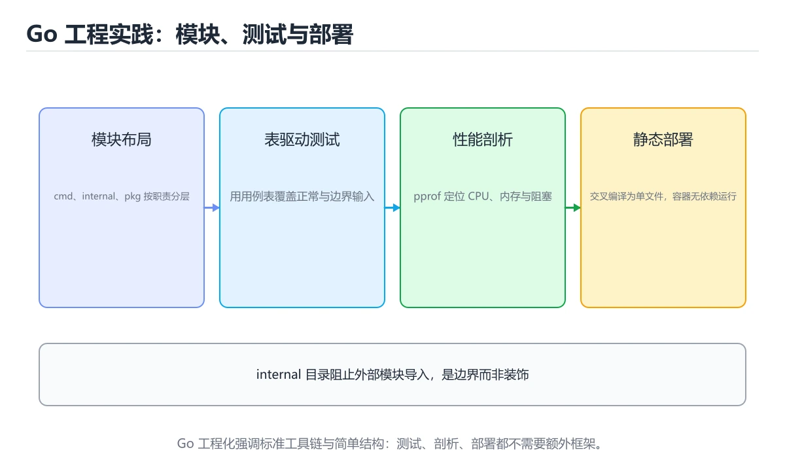
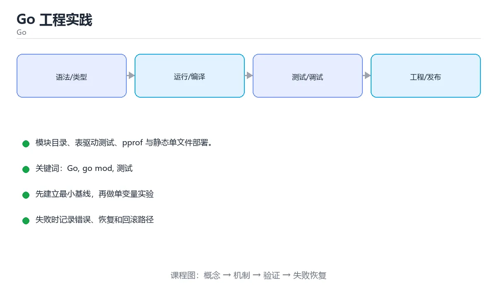

# Go 工程实践





> 内容更新时间：2026-10-06 · 学习阶段：进阶 · 预计用时：80 分钟

## 本节知识框架

**课程定位**：所属分类 `go`（Go），课程主题 `Go 工程实践`，学习阶段 进阶，建议用时 100 分钟。

本课主线：模块目录、表驱动测试、pprof 与静态单文件部署。

**学完本课应当能够**
- 说清 `Go` 与 `测试` 的含义与区别，并各举一个正例和一个反例。
- 用本课示例验证 `pprof` 的行为，记录输入、输出与失败条件。
- 遇到「用相对导入路径」这类问题时，能说出触发条件与修复顺序。

### 从概念到验证的学习链条

1. `Go`：先掌握 go mod init github.com/you/app 初始化模块；目录约定：cmd/（可执行入口）、internal/（仅本模块可见）、pkg/（对外可复用）、api/（接口定义）、testdata/（测试数据），再用它解释 `测试` 为什么会出现。
2. `测试`：先掌握 用可重复的输入和断言验证代码行为是否符合预期，再用它解释 `pprof` 为什么会出现。
3. `pprof`：先掌握 Go 等语言的性能剖析工具，可采集 CPU、内存、阻塞和 Goroutine 数据，再用它解释 `交叉编译` 为什么会出现。
4. `交叉编译`：先掌握 在一个平台生成另一个平台可执行的程序，需要匹配目标架构、系统库和工具链，再用它解释 本课示例的观察结果 为什么会出现。

**先修与衔接**：本课是「Go」分类的第 9 课。先修内容：《Go 接口与错误处理》。《Go 接口与错误处理》里的 `Go`、`接口` 是本课的前提。相关或后续课程：《Go 泛型与标准库实战》。

### 完成判据

- **定义关**：不看正文也能说明 `Go` 是 go mod init github.com/you/app 初始化模块，目录约定：cmd/（可执行入口）、internal/（仅本模块可见）、pkg/（对外可复用）、api/（接口定义）、testdata/（测试数据），并指出一个反例。
- **机制关**：能按“输入 → 转换 → 输出 → 验证”复述 `Go 工程实践`，而不是只背结论。
- **示例关**：能运行或推演 `Go 工程实践` 的 `text` 示例，并说明一个真实出现的标识符或字面量。
- **证据关**：能从 `Go 工程实践` 的示例写出一个输入、处理、输出三元组，并说明它支持或反驳了本课的哪一条结论。
- **排错关**：能复现 用相对导入路径，记录现象并按 用模块名开头的完整路径 修复。
- **迁移关**：能把 `Go`、`go mod`、`测试`、`pprof` 放进一个与 `Go 工程实践` 不同的项目场景，并保持输入与验证条件可追踪。
- **复盘关**：学完 `Go 工程实践` 后，用一句话写下仍然不确定的结论，并列出下一次验证需要的输入、环境和成功判据。

### 复习清单

- [ ] 能不看正文复述本课核心术语，并指出一个边界或反例。
- [ ] 能运行或推演本课示例，记录输入、输出与失败现象。
- [ ] 能完成一次自测，并把错题对照错误表定位原因。

## 核心概念定义

| 术语 | 操作性定义 | 常见边界与风险 |
| --- | --- | --- |
| Go | go mod init github.com/you/app 初始化模块；目录约定：cmd/（可执行入口）、internal/（仅本模块可见）、pkg/（对外可复用）、api/（接口定义）、testdata/（测试数据）。 | 易错：旧版本会全部用最后一个值；正确做法是Go 1.22 已修复，旧版本加 `c := c`。 |
| 测试 | 用可重复的输入和断言验证代码行为是否符合预期。 | 易错：慢且不稳定；正确做法是用接口加内存实现。 |
| pprof | Go 等语言的性能剖析工具，可采集 CPU、内存、阻塞和 Goroutine 数据。 | 结论随输入规模变化，小规模成立不代表大规模成立，需要重新测量。 |
| 交叉编译 | 在一个平台生成另一个平台可执行的程序，需要匹配目标架构、系统库和工具链。 | 只在「在一个平台生成另一个平台可执行的程序，需要匹配目标架构、系统库和工具链」这一前提下成立，换输入或换环境要重新验证。 |

## 原理与运行机制

### 机制总览

**教材衔接：模块与目录**

`go mod init github.com/you/app` 初始化模块；目录约定：`cmd/`（可执行入口）、`internal/`（仅本模块可见）、`pkg/`（对外可复用）、`api/`（接口定义）、`testdata/`（测试数据）。

**教材衔接：质量工具链**

| 命令 | 作用 |
| --- | --- |
| `go fmt ./...` | 统一格式（官方风格，无争议） |
| `go vet ./...` | 静态检查可疑代码 |
| `go test ./... -race -cover` | 测试 + 竞态检测 + 覆盖率 |
| `go test -bench=. -benchmem` | 基准测试与内存分配 |
| `golangci-lint run` | 聚合多种 linter |
| `go mod tidy` | 清理与补齐依赖 |

**教材衔接：工程结构速查**

```text
project/
├── go.mod
├── go.sum
├── cmd/
│   └── api/main.go          # 可执行入口，只做装配
├── internal/                # 只允许本模块导入
│   ├── order/
│   │   ├── service.go
│   │   ├── repository.go
│   │   └── service_test.go
│   └── platform/
│       ├── config/
│       └── logging/
├── migrations/              # 数据库迁移脚本
├── Dockerfile
└── Makefile                 # 常用命令入口
```

| 目录 | 约定 |
| --- | --- |
| `cmd/` | 每个可执行程序一个子目录 |
| `internal/` | 编译器强制限制外部导入 |
| `pkg/` | 确实需要对外暴露时才用 |
| 领域包内聚 | 按业务能力分包，不按「controller/service/dao」分层 |
| 测试文件同目录 | `xxx_test.go` 与被测代码放一起 |

**教材衔接：版本与时效**

- 升级前确认 Go 的兼容范围，把不可回退的改动单独拆成一次提交。
- 模块校验、最小版本选择与供应链安全是生产升级的重点
- 官方发布说明：https://go.dev/doc/devel/release

### 升级检查清单

- 先固定当前版本，跑通全部示例与测验，再升级工具链。
- 升级时只动一个依赖版本，用 CGO_ENABLED 记录构建与运行结果。
- 回归范围锁定 CGO_ENABLED 的默认行为，并确认弃用警告是否出现在构建输出里。
- 升级后把 CGO_ENABLED 的实测版本写进「内容元数据」，再更新复核日期。

**教材衔接：交付评审：评分表、决策记录与证据链**

### 一、「Go 工程实践」的交付物评分表

| 交付物 | 权重 | 合格线 | 需要的证据 |
| --- | ---: | --- | --- |
| 核心链路 | 34% | 能在干净环境复现，且失败路径有明确处理 | 命令与输出、对应测试、一次失败与恢复记录 |
| 测试与验收记录 | 33% | 能在干净环境复现，且失败路径有明确处理 | 命令与输出、对应测试、一次失败与恢复记录 |
| 运行与回滚说明 | 33% | 能在干净环境复现，且失败路径有明确处理 | 命令与输出、对应测试、一次失败与恢复记录 |

「Go 工程实践」的评分先看证据再打分：任意一项只要拿不出可复现的命令或测试，该项按 0 分计，不允许用「基本完成」代替。


### 三、「Go 工程实践」的交付证据链

本课未给出可执行命令，用下面的最小证据集代替：


### 五、评审记录模板

| 记录项 | 填写要求 |
| --- | --- |
| 项目标识 | `go_project` |
| 本次范围 | 说明这一轮交付了「Go 工程实践」的哪些部分 |
| 未完成项 | 列出与 Go 相关但本轮未做的内容 |
| 证据位置 | 指向 evidence/ 目录下的具体文件 |
| 风险与回滚 | 写清剩余风险、回滚步骤和验证方式 |
| 结论 | 通过 / 有条件通过 / 不通过，三者选一 |

### 机制拆解：每一步的输入、动作与输出

#### 1. `Go`
- 输入：`Go`；本步把 go mod init github.com/you/app 初始化模块；目录约定：cmd/（可执行入口）、internal/（仅本模块可见）、pkg/（对外可复用）、api/（接口定义）、testdata/（测试数据） 当作判断规则。
- 动作：围绕 `Go` 保留中间状态，并记录它与 `测试` 的对应关系。
- 输出：`测试`，它可以被下一段代码、测试或记录继续使用。
- `Go` 的失败条件：当循环变量在子测试里时，会出现旧版本会全部用最后一个值。

#### 2. `测试`
- 输入：`Go`；本步把 用可重复的输入和断言验证代码行为是否符合预期 当作判断规则。
- 动作：围绕 `测试` 保留中间状态，并记录它与 `pprof` 的对应关系。
- 输出：`pprof`，它可以被下一段代码、测试或记录继续使用。
- `测试` 的失败条件：当测试依赖真实数据库时，会出现慢且不稳定。

#### 3. `pprof`
- 输入：`测试`；本步把 Go 等语言的性能剖析工具，可采集 CPU、内存、阻塞和 Goroutine 数据 当作判断规则。
- 动作：围绕 `pprof` 保留中间状态，并记录它与 `交叉编译` 的对应关系。
- 输出：`交叉编译`，它可以被下一段代码、测试或记录继续使用。
- `pprof` 的失败条件：结论随输入规模变化，小规模成立不代表大规模成立，需要重新测量。

#### 4. `交叉编译`
- 输入：`pprof`；本步把 在一个平台生成另一个平台可执行的程序，需要匹配目标架构、系统库和工具链 当作判断规则。
- 动作：围绕 `交叉编译` 保留中间状态，并记录它与 `本课示例的最终结果` 的对应关系。
- 输出：`本课示例的最终结果`，它可以被下一段代码、测试或记录继续使用。
- `交叉编译` 的失败条件：只在「在一个平台生成另一个平台可执行的程序，需要匹配目标架构、系统库和工具链」这一前提下成立，换输入或换环境要重新验证。

### 复现实验记录

- 环境：`Go 工程实践` 使用 `text` 示例，固定 `Go`、`go mod`、`测试`、`pprof` 作为第一组条件。
- 首轮输入：从示例中的第一个输入开始，预测 `Go` 会怎样变化。
- 基线观察：记录命令、输入、输出和错误原文，不用截图代替可复制的文本。
- 单变量修改：只改变 `Go`，观察 `交叉编译` 是否仍满足定义。
- 失败注入：复现 用相对导入路径，确认现象是 编译失败。
- 记录结论：把“修改前、修改后、预期变化、实际变化”写成四列表，这样复盘 `Go 工程实践` 时才能区分概念错误与实现错误。

## 典型应用场景

**教材衔接：项目专属规格：Go 工程实践**

### 核心场景

模块目录、表驱动测试、pprof 与静态单文件部署。 项目目标是把「Go、go mod、测试、pprof、交叉编译」落实为可运行、可测试、可回滚的交付物。


### 验收场景

1. 正常路径：最小输入得到预期输出，并留下日志与指标。
2. 边界路径：go mod 在重复提交与超长输入下不产生额外副作用。
3. 失败路径：依赖超时或不可用时能快速失败、重试或降级。
4. 幂等路径：同一请求执行两次不会产生重复副作用。
5. 回滚路径：Go 回滚后数据一致，且能说明恢复时间和影响范围。

**教材衔接：项目交付物**

### 建议仓库结构

```text
cmd/app/
internal/domain/
internal/infra/
pkg/
go.mod
```

### 测试矩阵

| 层级 | 覆盖内容 | 最低数量 | 通过标准 |
| --- | --- | ---: | --- |
| 单元测试 | 领域规则、边界和错误分类 | 8 | 正常、边界、失败路径全部通过 |
| 集成测试 | 数据库、网络、文件或平台边界 | 3 | 使用真实边界且可重复运行 |
| 端到端测试 | 核心用户路径 | 1 | 从输入到输出完整跑通 |
| 手动验收 | 文档中列出的 5 个场景 | 5 | 有命令、输出和结论记录 |

### 验收数据

```json
{
  "project": "go_project",
  "scenario": "Go的正常路径",
  "input": {"case": "normal", "value": "CGO_ENABLED"},
  "expected": {"ok": true, "checks": ["Go可复现", "go mod有记录"]},
  "failure_case": {"case": "go mod越界或缺失", "error": "validation_error"},
  "idempotency_key": "go_project-001"
}
```

### 复盘模板

- **用相对导入路径**：典型现象是编译失败；正确做法是用模块名开头的完整路径。
- **把实现放 `pkg/`**：典型现象是对外暴露内部细节；正确做法是私有实现放 `internal/`。
- **测试依赖真实数据库**：典型现象是慢且不稳定；正确做法是用接口加内存实现。
- **只用 `t.Log` 不失败**：典型现象是测试永远通过；正确做法是用 `t.Errorf` / `t.Fatalf`。

### 最小验证场景

- 准备：保留 `text` 示例的原始输入，先记录 `Go 工程实践` 的基线输出和完整运行命令。
- 判定：新结果与 `Go 工程实践` 的基线不同不等于错误；只有当差异破坏了 `Go` 的定义或错误表中的约束，才判定为失败。

### 选择与边界

- 使用 `Go` 时，先满足它的定义：go mod init github.com/you/app 初始化模块；目录约定：cmd/（可执行入口）、internal/（仅本模块可见）、pkg/（对外可复用）、api/（接口定义）、testdata/（测试数据）；易错：旧版本会全部用最后一个值；正确做法是Go 1.22 已修复，旧版本加 `c := c`。
- 使用 `测试` 时，先满足它的定义：用可重复的输入和断言验证代码行为是否符合预期；易错：慢且不稳定；正确做法是用接口加内存实现。
- 使用 `pprof` 时，先满足它的定义：Go 等语言的性能剖析工具，可采集 CPU、内存、阻塞和 Goroutine 数据；结论随输入规模变化，小规模成立不代表大规模成立，需要重新测量。
- 使用 `交叉编译` 时，先满足它的定义：在一个平台生成另一个平台可执行的程序，需要匹配目标架构、系统库和工具链；只在「在一个平台生成另一个平台可执行的程序，需要匹配目标架构、系统库和工具链」这一前提下成立，换输入或换环境要重新验证。

## 代码/协议/SQL 示例

### 最小可验证示例

```text
CGO_ENABLED=0 go build -ldflags "-s -w" -o app   # 静态单文件，体积更小
GOOS=linux GOARCH=amd64 go build                 # 交叉编译
```

**教材衔接：构建与部署**

配合多阶段 Docker 构建（builder 阶段编译，scratch/alpine 运行）可产出几 MB 的镜像。

**教材衔接：测试与构建速查**

| 目的 | 写法 |
| --- | --- |
| 表驱动测试 | `tests := []struct{ ... }{}` + `t.Run` |
| 子测试并行 | `t.Parallel()` |
| 临时目录 | `t.TempDir()` |
| 基准测试 | `func BenchmarkX(b *testing.B)` + `b.ReportAllocs()` |
| 示例测试 | `func ExampleX()` 带 `// Output:` |
| 覆盖率 | `go test -coverprofile=cover.out ./...` |
| 静态构建 | `CGO_ENABLED=0 go build -trimpath -ldflags="-s -w"` |
| 版本注入 | `-ldflags "-X main.version=$(git describe --tags)"` |

```go
func TestParseAmount(t *testing.T) {
	t.Parallel()

	tests := []struct {
		name    string
		input   string
		want    int
		wantErr bool
	}{
		{name: "正常", input: "100", want: 100},
		{name: "空字符串", input: "", wantErr: true},
		{name: "负数", input: "-1", wantErr: true},
	}

	for _, tt := range tests {
		tt := tt // Go 1.22 之前必须复制，避免闭包捕获同一个变量
		t.Run(tt.name, func(t *testing.T) {
			t.Parallel()
			got, err := ParseAmount(tt.input)
			if (err != nil) != tt.wantErr {
				t.Fatalf("err = %v, wantErr = %v", err, tt.wantErr)
			}
			if got != tt.want {
				t.Errorf("got = %d, want = %d", got, tt.want)
			}
		})
	}
}
```

**教材衔接：零基础详解：Go 工程结构与测试**

### 一句话说清它是什么

Go 的工程约定非常固定：**cmd 放入口、internal 放私有实现、pkg 放可复用库**。
测试则用标准库自带的 `testing` 包，不依赖第三方框架。

### 用生活比喻理解

| 目录 | 比喻 | 说明 |
| --- | --- | --- |
| `cmd/` | 大门 | 每个可执行程序一个子目录 |
| `internal/` | 内部车间 | 编译器强制只允许本模块导入 |
| `pkg/` | 对外开放的柜台 | 允许外部项目使用 |
| `go.mod` | 项目身份证 | 模块名与依赖版本 |
| `_test.go` | 验收单 | 与源码放在一起 |

### 一个标准的项目骨架

```text
myapp/
  cmd/
    server/main.go          程序入口
  internal/
    user/
      service.go            业务逻辑
      service_test.go       单元测试
      store.go              数据访问
  pkg/
    validate/               可被外部复用的工具
  go.mod
  Makefile
```

```go
// cmd/server/main.go
package main

import (
    "log"
    "net/http"

    "example.com/myapp/internal/user"
)

func main() {
    svc := user.NewService()
    mux := http.NewServeMux()
    mux.HandleFunc("/users", svc.HandleList)

    srv := &http.Server{
        Addr:              ":8080",
        Handler:           mux,
        ReadHeaderTimeout: 5 * time.Second,
    }
    log.Fatal(srv.ListenAndServe())
}
```

### 表驱动测试：Go 的标准写法

```go
package user

import (
    "strings"
    "testing"
)

func TestValidateName(t *testing.T) {
    cases := []struct {
        name    string
        input   string
        wantErr bool
    }{
        {"正常", "小明", false},
        {"空字符串", "", true},
        {"太长", strings.Repeat("字", 51), true},
    }

    for _, c := range cases {
        t.Run(c.name, func(t *testing.T) {
            err := ValidateName(c.input)
            if (err != nil) != c.wantErr {
                t.Fatalf("ValidateName(%q) 错误 = %v，期望出错 %v", c.input, err, c.wantErr)
            }
        })
    }
}
```

### 测试四件套

| 功能 | 写法 | 说明 |
| --- | --- | --- |
| 普通测试 | `func TestXxx(t *testing.T)` | 必须以 Test 开头 |
| 基准测试 | `func BenchmarkXxx(b *testing.B)` | 用 `go test -bench .` |
| 示例测试 | `func ExampleXxx()` | 用注释写期望输出 |
| 模糊测试 | `func FuzzXxx(f *testing.F)` | 自动生成输入找边界问题 |

```bash
go test ./...                    # 跑全部包
go test -race ./...              # 检测数据竞争
go test -cover ./...             # 查看覆盖率
go test -run TestValidate -v     # 只跑指定测试
go test -bench . -benchmem       # 基准测试并显示内存分配
```

### 依赖与接口：让测试能替换实现

```go
// 接口定义在使用方，方便测试替换
type Store interface {
    Get(id int) (User, error)
}

type Service struct {
    store Store
}

func NewService(store Store) *Service { return &Service{store: store} }

// 测试里用内存实现，不依赖数据库
type memoryStore struct{ data map[int]User }

func (m *memoryStore) Get(id int) (User, error) {
    u, ok := m.data[id]
    if !ok {
        return User{}, ErrNotFound
    }
    return u, nil
}
```

### 新手最容易踩的八个坑

| 坑 | 现象 | 正确做法 |
| --- | --- | --- |
| 用相对导入路径 | 编译失败 | 用模块名开头的完整路径 |
| 把实现放 `pkg/` | 对外暴露内部细节 | 私有实现放 `internal/` |
| 测试依赖真实数据库 | 慢且不稳定 | 用接口加内存实现 |
| 只用 `t.Log` 不失败 | 测试永远通过 | 用 `t.Errorf` / `t.Fatalf` |
| 表驱动测试没起名字 | 失败时分不清哪条 | 用 `t.Run(name, ...)` |
| 忘了 `-race` | 数据竞争漏检 | CI 里加 `go test -race` |
| 循环变量在子测试里 | 旧版本会全部用最后一个值 | Go 1.22 已修复，旧版本加 `c := c` |
| 依赖版本不整理 | go.mod 与代码不一致 | 提交前 `go mod tidy` |

### 手把手练习：为金额工具写测试

```go
// money.go
package money

import (
    "errors"
    "math"
)

var ErrNegative = errors.New("金额不能为负")

func Round(amount float64) (float64, error) {
    if amount < 0 {
        return 0, ErrNegative
    }
    return math.Round(amount*100) / 100, nil
}
```

```go
// money_test.go
package money

import (
    "errors"
    "testing"
)

func TestRound(t *testing.T) {
    cases := []struct {
        in   float64
        want float64
    }{
        {19.994, 19.99},
        {19.995, 20.0},
        {0, 0},
    }
    for _, c := range cases {
        got, err := Round(c.in)
        if err != nil {
            t.Fatalf("Round(%v) 意外出错：%v", c.in, err)
        }
        if got != c.want {
            t.Errorf("Round(%v) = %v，期望 %v", c.in, got, c.want)
        }
    }
}

func TestRoundNegative(t *testing.T) {
    _, err := Round(-1)
    if !errors.Is(err, ErrNegative) {
        t.Fatalf("期望 ErrNegative，实际 %v", err)
    }
}
```

### 学完自测

- [ ] 能说出 `cmd`、`internal`、`pkg` 各自的用途。
- [ ] 能写出一个表驱动测试并给子测试命名。
- [ ] 知道为什么要用接口让测试替换实现。
- [ ] 能说出 `-race` 与 `-cover` 的作用。
- [ ] 知道提交前要跑 `go mod tidy`。

**教材衔接：验证命令与预期输出**

Go 的交付物要能用固定命令复现；下表是本项目的最低验证集：

| 阶段 | 命令 | 预期输出 |
| --- | --- | --- |
| 格式化检查 | `gofmt -l .` | 没有文件需要格式化 |
| 静态检查 | `go vet ./...` | 没有 vet 报告 |
| 运行测试 | `go test ./... -count=1` | 所有包测试通过 |

### 验收证据

- [ ] 保存依赖安装和启动命令的完整输出。
- [ ] 测试覆盖 go mod 的核心规则，并包含一次可预期的失败。
- [ ] 用同一个幂等键重放 CGO_ENABLED，确认结果与首次一致。
- [ ] 记录一次失败状态码、错误日志和恢复步骤。
- [ ] 记录 CGO_ENABLED 的运行环境与复现命令，并补一段回滚说明。

### 回归与回滚

1. 先在副本上执行 go mod，并记录前后差异。
2. 修改一处逻辑后重跑全部验证命令，确认没有回归。
3. 若失败，回滚到上一个可运行版本并保留失败日志。
4. 定位原因后补一条自动化测试，再重新执行发布流程。
5. 把教训写入项目复盘或本课笔记，形成下一次的检查项。

### 示例精读：先找证据，再改一个条件

- 在 `Go 工程实践` 中与 `Go` 对照：示例必须能支持 go mod init github.com/you/app 初始化模块；目录约定：cmd/（可执行入口）、internal/（仅本模块可见）、pkg/（对外可复用）、api/（接口定义）、testdata/（测试数据），否则说明这一段还缺少实现或验证步骤。
- 在 `Go 工程实践` 中与 `测试` 对照：示例必须能支持 用可重复的输入和断言验证代码行为是否符合预期，否则说明这一段还缺少实现或验证步骤。
- 在 `Go 工程实践` 中与 `pprof` 对照：示例必须能支持 Go 等语言的性能剖析工具，可采集 CPU、内存、阻塞和 Goroutine 数据，否则说明这一段还缺少实现或验证步骤。
- 在 `Go 工程实践` 中与 `交叉编译` 对照：示例必须能支持 在一个平台生成另一个平台可执行的程序，需要匹配目标架构、系统库和工具链，否则说明这一段还缺少实现或验证步骤。
- `Go 工程实践` 的示例没有抽取到函数调用或字面量；按行记录输入、控制流和输出，避免只背代码外形。

## 时间/空间复杂度或性能分析

**教材衔接：测试与基准**

表驱动测试（table-driven）是 Go 的主流写法：用例写成切片，循环执行子测试 `t.Run`。基准测试用 `testing.B`，关注 ns/op 与 allocs/op；优化前先写 benchmark，否则无法判断收益。

标准库自带 `net/http/pprof` 或 `runtime/pprof`，可采集 CPU、内存、阻塞、goroutine 与 mutex profile。排查顺序：先看指标定位资源类型，再用 pprof 找热点函数。

**测量方法**：以 `Go 工程实践` 的 `Go` 场景为对象，固定输入跑一遍记录基线，再把规模或并发度提高一个数量级复测；两次结果的差值与波动范围才是结论依据。

### 需要控制的变量与记录项

- `Go 工程实践` 的 `Go`：固定它的版本、输入范围和资源上限，分别记录速度、内存与失败率的变化。
- `Go 工程实践` 的 `go mod`：固定它的版本、输入范围和资源上限，分别记录速度、内存与失败率的变化。
- `Go 工程实践` 的 `测试`：固定它的版本、输入范围和资源上限，分别记录速度、内存与失败率的变化。
- `Go 工程实践` 的 `pprof`：固定它的版本、输入范围和资源上限，分别记录速度、内存与失败率的变化。
- `Go 工程实践` 的 `交叉编译`：固定它的版本、输入范围和资源上限，分别记录速度、内存与失败率的变化。
- `Go 工程实践` 中 `Go` 的边界：易错：旧版本会全部用最后一个值；正确做法是Go 1.22 已修复，旧版本加 `c := c`。达到边界时不要外推，必须重新测量。
- `Go 工程实践` 中 `测试` 的边界：易错：慢且不稳定；正确做法是用接口加内存实现。达到边界时不要外推，必须重新测量。
- `Go 工程实践` 中 `pprof` 的边界：结论随输入规模变化，小规模成立不代表大规模成立，需要重新测量。达到边界时不要外推，必须重新测量。
- `Go 工程实践` 中 `交叉编译` 的边界：只在「在一个平台生成另一个平台可执行的程序，需要匹配目标架构、系统库和工具链」这一前提下成立，换输入或换环境要重新验证。达到边界时不要外推，必须重新测量。

## 常见误区与易错点

| 容易写错的做法 | 实际现象 | 原因与正确做法 |
| --- | --- | --- |
| 用相对导入路径 | 编译失败 | 用模块名开头的完整路径 |
| 把实现放 `pkg/` | 对外暴露内部细节 | 私有实现放 `internal/` |
| 测试依赖真实数据库 | 慢且不稳定 | 用接口加内存实现 |
| 只用 `t.Log` 不失败 | 测试永远通过 | 用 `t.Errorf` / `t.Fatalf` |
| 表驱动测试没起名字 | 失败时分不清哪条 | 用 `t.Run(name, ...)` |
| 忘了 `-race` | 数据竞争漏检 | CI 里加 `go test -race` |
| 循环变量在子测试里 | 旧版本会全部用最后一个值 | Go 1.22 已修复，旧版本加 `c := c` |
| 依赖版本不整理 | go.mod 与代码不一致 | 提交前 `go mod tidy` |
| 把业务逻辑写在 `main.go` | 无法测试、难以复用 | `main` 只做装配与启动 |
| 包名与目录不一致 | 阅读与导入混乱 | 包名与目录名保持一致 |
| 循环导入 | 编译错误 | 抽公共包，或用接口反转依赖 |
| 用全局变量存配置 | 测试相互影响 | 显式传参或依赖注入 |
| 忘记 `go mod tidy` | 依赖缺失或冗余 | 提交前执行 |
| 沿用 GOPATH 目录结构 | 现代工具链不识别 | 使用模块 `go.mod` |
| 测试依赖真实数据库 | 慢且不稳定 | 用接口替身或测试容器 |
| 未跑 `-race` | 竞态潜伏到线上 | CI 加 `go test -race` |
| 构建未加 `-trimpath` | 产物含本地路径 | 发布构建统一参数 |
| 版本号写死在代码 | 无法追溯发布 | 用 `-ldflags` 注入版本 |
| 把业务逻辑写在 main.go | 无法测试、难以复用。 | main 只做装配与启动。 |

### 现场 1：用相对导入路径

**症状**：编译失败。

**根因与修复**：用模块名开头的完整路径。

**自检**：在本课示例里复现「用相对导入路径」，改成用模块名开头的完整路径后重跑；如果症状消失且失败路径按预期变化，说明定位正确。

### 现场 2：把实现放 `pkg/`

**症状**：对外暴露内部细节。

**根因与修复**：私有实现放 `internal/`。

**自检**：在本课示例里复现「把实现放 `pkg/`」，改成私有实现放 `internal/`后重跑；如果症状消失且失败路径按预期变化，说明定位正确。

### 现场 3：测试依赖真实数据库

**症状**：慢且不稳定。

**根因与修复**：用接口加内存实现。

**自检**：在本课示例里复现「测试依赖真实数据库」，改成用接口加内存实现后重跑；如果症状消失且失败路径按预期变化，说明定位正确。

### 现场 4：只用 `t.Log` 不失败

**症状**：测试永远通过。

**根因与修复**：用 `t.Errorf` / `t.Fatalf`。

**自检**：在本课示例里复现「只用 `t.Log` 不失败」，改成用 `t.Errorf` / `t.Fatalf`后重跑；如果症状消失且失败路径按预期变化，说明定位正确。

### 现场 5：表驱动测试没起名字

**症状**：失败时分不清哪条。

**根因与修复**：用 `t.Run(name, ...)`。

**自检**：在本课示例里复现「表驱动测试没起名字」，改成用 `t.Run(name, ...)`后重跑；如果症状消失且失败路径按预期变化，说明定位正确。

### 现场 6：忘了 `-race`

**症状**：数据竞争漏检。

**根因与修复**：CI 里加 `go test -race`。

**自检**：在本课示例里复现「忘了 `-race`」，改成CI 里加 `go test -race`后重跑；如果症状消失且失败路径按预期变化，说明定位正确。

### 现场 7：循环变量在子测试里

**症状**：旧版本会全部用最后一个值。

**根因与修复**：Go 1.22 已修复，旧版本加 `c := c`。

**自检**：在本课示例里复现「循环变量在子测试里」，改成Go 1.22 已修复，旧版本加 `c := c`后重跑；如果症状消失且失败路径按预期变化，说明定位正确。

### 现场 8：依赖版本不整理

**症状**：go.mod 与代码不一致。

**根因与修复**：提交前 `go mod tidy`。

**自检**：在本课示例里复现「依赖版本不整理」，改成提交前 `go mod tidy`后重跑；如果症状消失且失败路径按预期变化，说明定位正确。

### 现场 9：把业务逻辑写在 `main.go`

**症状**：无法测试、难以复用。

**根因与修复**：`main` 只做装配与启动。

**自检**：在本课示例里复现「把业务逻辑写在 `main.go`」，改成`main` 只做装配与启动后重跑；如果症状消失且失败路径按预期变化，说明定位正确。

## 与其他知识点的关系

- **先修**：`Go 接口与错误处理`。本课默认这些内容已经掌握。
- **相关或后续**：`Go 泛型与标准库实战`。本课术语会在这些课程里继续使用。
- **术语归属**：`Go`、`测试`、`pprof` 的定义以本课「核心概念定义」为准，换到其他课程时先确认定义是否被改写。
- 同一分类的《Go 第一个程序》也涉及 `Go`；两课衔接时先确认这个术语的定义是否一致。
- 同一分类的《Go 变量与输入》也涉及 `Go`；两课衔接时先确认这个术语的定义是否一致。

### 先修与后续术语接口

- `Go 接口与错误处理`：共享术语 `Go`，共同关键词 `Go`。
- `Go 泛型与标准库实战`：共享术语 `Go`，共同关键词 `Go`。

### 容易混淆的相邻概念

- `Go` 与 `测试`：前者强调 go mod init github.com/you/app 初始化模块；目录约定：cmd/（可执行入口）、internal/（仅本模块可见）、pkg/（对外可复用）、api/（接口定义）、testdata/（测试数据）；后者强调 用可重复的输入和断言验证代码行为是否符合预期。判断时分别检查两条定义的适用范围，不要只看名称相似就互换。
- `测试` 与 `pprof`：前者强调 用可重复的输入和断言验证代码行为是否符合预期；后者强调 Go 等语言的性能剖析工具，可采集 CPU、内存、阻塞和 Goroutine 数据。判断时分别检查两条定义的适用范围，不要只看名称相似就互换。
- `pprof` 与 `交叉编译`：前者强调 Go 等语言的性能剖析工具，可采集 CPU、内存、阻塞和 Goroutine 数据；后者强调 在一个平台生成另一个平台可执行的程序，需要匹配目标架构、系统库和工具链。判断时分别检查两条定义的适用范围，不要只看名称相似就互换。

## 自测题与参考答案

> 先独立作答，再对照参考答案；答案都能在本课正文、术语表或错误表里找到依据。

### 自测 1（概念复述）

不看正文，写出 `Go` 的操作性定义，并说明它与 `测试` 的区别。

**参考答案**：go mod init github.com/you/app 初始化模块；目录约定：cmd/（可执行入口）、internal/（仅本模块可见）、pkg/（对外可复用）、api/（接口定义）、testdata/（测试数据）。

`测试` 的定位是：用可重复的输入和断言验证代码行为是否符合预期；两者的差别要从适用对象与失败模式上说明。

### 自测 2（排错）

本课错误表记录了「用相对导入路径」这类做法。请写出它会出现的现象、根因，以及修复顺序。

**参考答案**：现象是编译失败；正确做法是用模块名开头的完整路径。修复时先复现现象并保留证据，再改动一处假设重跑，确认现象消失。

### 自测 3（动手验证）

运行本课的 `text` 示例，改动其中一个输入后重新运行，记录输出与错误信息。

**参考答案**：正常输入下 `text` 示例应当复现正文给出的结果；改动输入后，如果结果改变或报错，先核对它是否满足 `Go 工程实践` 中`Go` 的适用范围，再检查错误表里是否有同类现象。

### 自测 4（代码阅读）

阅读本课开头的 `text` 示例，说明它体现了`Go` 的哪一条性质，并指出改动哪个输入会让这条性质不再成立。

**参考答案**：`Go` 的定义是 go mod init github.com/you/app 初始化模块，目录约定：cmd/（可执行入口）、internal/（仅本模块可见）、pkg/（对外可复用）、api/（接口定义）、testdata/（测试数据），示例正是在实现这条定义。改动与 `Go` 有关的一个输入后，如果结果不再符合 `Go 工程实践` 的正文描述，就说明该性质只在当前前提成立。

### 自测 5（迁移）

把 `Go 工程实践` 的方法迁移到自己的项目：围绕 `Go` 写出一个与错误表同类的风险点，并说明触发条件和检验方式。

**参考答案**：例如「把业务逻辑写在 main.go」，它会导致无法测试、难以复用；检验方式是按main 只做装配与启动改一处再复现，确认现象消失且没有引入新的失败分支。

### 自测 6（对比）

用一个表格对比 `Go` 与 `测试`：各写一行适用场景、一行失败表现。

**参考答案**：`Go` 的定义是go mod init github.com/you/app 初始化模块；目录约定：cmd/（可执行入口）、internal/（仅本模块可见）、pkg/（对外可复用）、api/（接口定义）、testdata/（测试数据）；`测试` 的定义是用可重复的输入和断言验证代码行为是否符合预期。两者的失败表现分别对应本课错误表里与本术语相关的行。

### 自测 7（排错顺序）

面对「用相对导入路径」引发的问题，请把“复现 编译失败 → 保留证据 → 用模块名开头的完整路径 → 回归验证”四步写成可执行的检查清单。

**参考答案**：第一步按编译失败复现；第二步记录输入、版本与完整报错；第三步按用模块名开头的完整路径只改一处；第四步重跑并确认失败路径也按预期变化。

### 自测 8（边界判断）

针对 `交叉编译`，分别写出“可以使用”的条件和“结论不再成立”的条件。

**参考答案**：只在「在一个平台生成另一个平台可执行的程序，需要匹配目标架构、系统库和工具链」这一前提下成立，换输入或换环境要重新验证。 同时要把 `交叉编译` 的定义 在一个平台生成另一个平台可执行的程序，需要匹配目标架构、系统库和工具链 与实际输入逐项对照。

### 自测 9（机制重建）

不看正文，按输入、转换、输出、验证四段重建 `Go` → `测试` → `pprof` → `交叉编译` 的作用链。

**参考答案**：起点是 `Go` 的定义 go mod init github.com/you/app 初始化模块；目录约定：cmd/（可执行入口）、internal/（仅本模块可见）、pkg/（对外可复用）、api/（接口定义）、testdata/（测试数据）；中间每一步都保留可观察状态；终点由 `交叉编译` 检查，失败时回到错误表定位第一个偏离定义的步骤。

### 自测 10（综合排错）

在 `Go 工程实践` 中，现象是 无法测试、难以复用。请围绕 把业务逻辑写在 main.go 写出最小复现、关键证据、修复动作和回归验证，并说明为什么不能只凭一次运行下结论。

**参考答案**：先复现 把业务逻辑写在 main.go，记录输入与完整错误；再按 main 只做装配与启动 只改一处。回归时同时跑正常路径和边界路径，只有两次结果都可解释，才把修复视为完成。

### 自测 11（一分钟复述）

用每分钟约 200 字的速度复述 `Go 工程实践`：先给主问题，再按顺序说出 `Go`、`测试`、`pprof`、`交叉编译`，最后给一个失败案例。

**自评标准**：主问题必须对应 模块目录、表驱动测试、pprof 与静态单文件部署；每个术语都要能接上一句定义或边界；失败案例必须写成可观察现象，不能用“可能有风险”代替证据。

## 术语速查

| 术语 | 一句话说明 |
| --- | --- |
| `Go` | go mod init github.com/you/app 初始化模块；目录约定：cmd/（可执行入口）、internal/（仅本模块可见）、pkg/（对外可复用）、api/（接口定义）、testdata/（测试数据）。 |
| `测试` | 用可重复的输入和断言验证代码行为是否符合预期。 |
| `pprof` | Go 等语言的性能剖析工具，可采集 CPU、内存、阻塞和 Goroutine 数据。 |
| `交叉编译` | 在一个平台生成另一个平台可执行的程序，需要匹配目标架构、系统库和工具链。 |

**术语关系**：`Go`（go mod init github.com/you/app 初始化模块） → `测试`（用可重复的输入和断言验证代码行为是否符合预期） → `pprof`（Go 等语言的性能剖析工具） → `交叉编译`（在一个平台生成另一个平台可执行的程序）。

## 考点精讲

`Go 工程实践` 的题库有 6 道题，下面逐题给出题干、正确项与判断依据：先自己作答，再核对正确项，最后回到正文对应小节复核。

### 考点 1：第 1 题

- **题目**：围绕“Go 工程实践”中的 Go、go mod、测试，下列哪两项是本课强调的实践判断？
- **正确项**：学习 Go 时要同时说明输入、输出和失败路径，不能只看正常流程；验证 go mod 时要固定版本并覆盖边界输入，结论才可复现
- **判断依据**：这道题落在术语 `Go` 上：go mod init github.com/you/app 初始化模块，目录约定：cmd/（可执行入口）、internal/（仅本模块可见）、pkg/（对外可复用）、api/（接口定义）、testdata/（测试数据）。复习时把 `Go` 的定义、适用边界和一个反例一起说清楚，再回到「核心概念定义」核对原文。

### 考点 2：第 2 题

- **题目**：交叉编译到 Linux amd64 需要设置？
- **正确项**：GOOS=linux GOARCH=amd64
- **判断依据**：这道题落在术语 `交叉编译` 上：在一个平台生成另一个平台可执行的程序，需要匹配目标架构、系统库和工具链。复习时把 `交叉编译` 的定义、适用边界和一个反例一起说清楚，再回到「核心概念定义」核对原文。

### 考点 3：第 3 题

- **题目**：`Go 工程实践` 的示例代码用于验证 `Go`，其背景是模块目录、表驱动测试、pprof 与静态单文件部署。代码的真实内容是下面哪一项？
- **正确项**：代码里出现了 `Go` 这个名字
- **判断依据**：这道题落在术语 `Go` 上：go mod init github.com/you/app 初始化模块，目录约定：cmd/（可执行入口）、internal/（仅本模块可见）、pkg/（对外可复用）、api/（接口定义）、testdata/（测试数据）。复习时把 `Go` 的定义、适用边界和一个反例一起说清楚，再回到「核心概念定义」核对原文。

### 考点 4：第 4 题

- **题目**：go mod tidy 的作用是？
- **正确项**：补齐代码需要但缺失的依赖
- **判断依据**：这道题检验本课主问题：模块目录、表驱动测试、pprof 与静态单文件部署。复习时先复述本课主问题，再举一个会让结论失效的输入。

### 考点 5：第 5 题

- **题目**：Go 项目中 cmd/ 与 internal/ 目录的约定是？
- **正确项**：cmd 放可执行程序入口
- **判断依据**：这道题落在术语 `Go` 上：go mod init github.com/you/app 初始化模块，目录约定：cmd/（可执行入口）、internal/（仅本模块可见）、pkg/（对外可复用）、api/（接口定义）、testdata/（测试数据）。复习时把 `Go` 的定义、适用边界和一个反例一起说清楚，再回到「核心概念定义」核对原文。

### 考点 6：第 6 题

- **题目**：填空：补齐下面这段术语说明中的空缺。课程 `模块目录、表驱动测试、pprof 与静态单文件部署。`，这段说明是：`____`：在一个平台生成另一个平台可执行的程序，需要匹配目标架构、系统库和工具链。空缺处应填哪个术语？
- **正确项**：交叉编译
- **判断依据**：这道题落在术语 `测试` 上：用可重复的输入和断言验证代码行为是否符合预期。复习时把 `测试` 的定义、适用边界和一个反例一起说清楚，再回到「核心概念定义」核对原文。

### 考点 7：`Go`

- **要点**：go mod init github.com/you/app 初始化模块；目录约定：cmd/（可执行入口）、internal/（仅本模块可见）、pkg/（对外可复用）、api/（接口定义）、testdata/（测试数据）。
- **Go 的边界**：易错：旧版本会全部用最后一个值；正确做法是Go 1.22 已修复，旧版本加 `c := c`。

### 考点 8：`测试`

- **要点**：用可重复的输入和断言验证代码行为是否符合预期。
- **测试 的边界**：易错：慢且不稳定；正确做法是用接口加内存实现。

### 考点 9：`pprof`

- **要点**：Go 等语言的性能剖析工具，可采集 CPU、内存、阻塞和 Goroutine 数据。
- **pprof 的边界**：结论随输入规模变化，小规模成立不代表大规模成立，需要重新测量。

### 考点 10：`交叉编译`

- **要点**：在一个平台生成另一个平台可执行的程序，需要匹配目标架构、系统库和工具链。
- **交叉编译 的边界**：只在「在一个平台生成另一个平台可执行的程序，需要匹配目标架构、系统库和工具链」这一前提下成立，换输入或换环境要重新验证。

### 考点 11：排错——用相对导入路径

- **现象**：编译失败。
- **处理**：用模块名开头的完整路径。

### 考点 12：排错——把实现放 `pkg/`

- **现象**：对外暴露内部细节。
- **处理**：私有实现放 `internal/`。

### 考点 13：综合辨析——`Go` 与 `交叉编译`

- **辨析点**：`Go` 的定义是 go mod init github.com/you/app 初始化模块；目录约定：cmd/（可执行入口）、internal/（仅本模块可见）、pkg/（对外可复用）、api/（接口定义）、testdata/（测试数据）；`交叉编译` 的定义是 在一个平台生成另一个平台可执行的程序，需要匹配目标架构、系统库和工具链。
- **答题要求**：面对 `Go 工程实践` 的题目，先判断描述的是 `Go` 还是 `交叉编译`，再归到对应定义，最后写出一个会让该定义失效的边界输入。

### 考点 14：排错评分点

- **现象分**：能写出 编译失败，而不是只写“程序有错”。
- **证据分**：保留触发 用相对导入路径 的输入、版本和错误原文。
- **修复分**：按 用模块名开头的完整路径 只改一处，并同时回归正常路径与边界路径。

## 内容元数据

- 内容版本：v2.0
- 最后更新：2026-10-06
- 学习阶段：进阶
- 适用环境：Go 1.24+；本课聚焦 Go。
- 内容来源：内置结构化课程与工程实践整理
- 相关主题：Go、go mod、测试、pprof、交叉编译
- 质量版本：P0 测验标准 + P1 覆盖扩展 + P2 体验补全

## 参考资料与复核

- 最后复核：2026-10-04
- 下次复核：2027-04-10
- 复核范围：版本兼容、API 行为、安全建议与工程实践
- 来源性质：官方文档、标准或权威教材；本课核对关键词：Go、go mod、测试、pprof、交叉编译。

| 参考资料 | 本课用途 |
| --- | --- |
| [Go pprof](https://pkg.go.dev/net/http/pprof) | 性能剖析与火焰图 |
| [Effective Go](https://go.dev/doc/effective_go) | 惯用写法与接口设计 |
| [Go 并发](https://go.dev/talks/2012/concurrency.slide) | goroutine 与 channel |

| [本课术语索引：Go 工程实践](#核心概念定义) | 按本课输入、术语边界和错误表现逐项核对 |
> 「Go 工程实践」的链接用于离线阅读后的延伸核对；App 不会自动联网。

<!-- p1-project-review:start -->