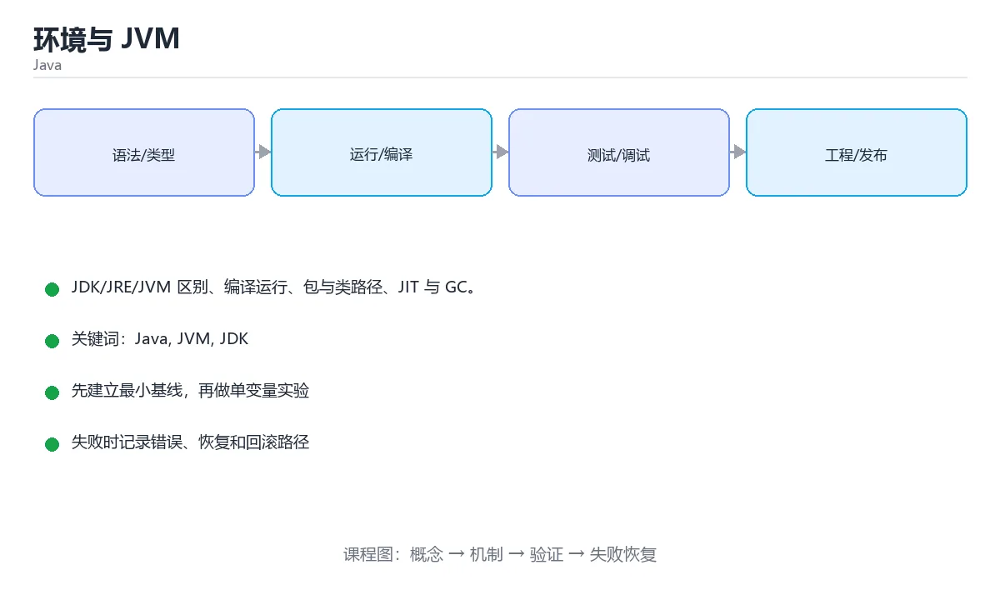

# Java 环境与 JVM



> 内容更新时间：2026-10-03 · 学习阶段：基础 · 预计用时：14 分钟

## 学习目标

- 能用自己的话解释「环境与 JVM」解决了什么问题，而不是只背术语。
- 能说清 「Java」、「JVM」、「JDK」、「javac」 之间的关系，并分别举出一个例子。
- 能把本课知识放回「Java」的知识体系，说明它和相邻主题的边界。
- 能完成本课练习，并用验收标准检查自己的结果。

> 一句话摘要：JDK/JRE/JVM 区别、编译运行、包与类路径、JIT 与 GC。

## 前置知识

- 会进行基本的文件、命令行或浏览器操作；遇到不熟悉的术语先查本课关键词。
- 本课阶段：基础。建议会读写简单代码或命令，并理解变量、输入输出等基本概念。
- 开始前先复习：Java、JVM、JDK。
- 如果某一步看不懂，先记录具体卡点，完成练习后再回头读一遍。


## JDK、JRE 与 JVM

| 名称 | 包含内容 | 用途 |
| --- | --- | --- |
| JVM | 字节码执行引擎 | 运行 `.class` 文件 |
| JRE | JVM + 核心类库 | 只运行 Java 程序 |
| JDK | JRE + 编译器 + 工具 | 开发 Java 程序 |

Java 的口号是「一次编写，到处运行」：源码编译成**字节码**，由各平台的 JVM 执行并负责内存管理与即时编译（JIT）。

## 第一个程序

```java
// Hello.java —— 文件名必须与 public 类名一致
public class Hello {
    public static void main(String[] args) {
        System.out.println("Hello, Java!");
    }
}
```

```bash
javac Hello.java     # 生成 Hello.class 字节码
java Hello           # 启动 JVM 执行

jshell               # JDK 9+ 交互式 REPL，适合快速试验
```

## 包与类路径

```java
package com.example.app;      // 包名通常用倒置域名

import java.util.List;        // 导入其他包的类

public class Main {
    public static void main(String[] args) {
        List<String> names = List.of("tom", "alice");
        System.out.println(names);
    }
}
```

编译带包名的代码：`javac -d out src/com/example/app/Main.java`，运行时用全限定名 `java -cp out com.example.app.Main`。

## 程序生命周期

```text
源码 .java → javac 编译 → 字节码 .class
              ↓ 类加载器（加载 → 链接 → 初始化）
              ↓ 字节码解释执行 + JIT 热点编译
              ↓ 垃圾回收自动回收堆内存
```

`public static void main(String[] args)` 的每个部分都有含义：`public` 让 JVM 能访问、`static` 无需实例化、`void` 无返回值、`String[] args` 接收命令行参数。

## 垃圾回收器与调优参数

| 回收器 | 特点 | 适用 |
| --- | --- | --- |
| Serial | 单线程，停顿明显 | 客户端小程序、容器内极小堆 |
| Parallel | 多线程吞吐优先 | 批处理、吞吐优先场景 |
| CMS | 并发标记清除，低停顿 | 老版本低延迟场景（已废弃） |
| G1 | 分区域回收，可设定停顿目标 | 服务端默认（JDK 9+） |
| ZGC / Shenandoah | 亚毫秒级停顿，支持大堆 | 超大堆、延迟极敏感服务 |

常用参数：`-Xms/-Xmx` 设初始与最大堆（生产建议设成相同值，避免动态扩缩）；`-Xmn` 新生代大小；`-XX:MetaspaceSize` 元空间；`-XX:+HeapDumpOnOutOfMemoryError` 在 OOM 时自动导出堆快照；`-XX:MaxGCPauseMillis` 给 G1 设定停顿目标；`-Xlog:gc*` 输出 GC 日志。

排查思路：先用 `jstat -gc <pid> 1000` 观察 GC 频率与耗时；用 `jmap -histo` 找大对象；OOM 时用 MAT 分析堆转储。**频繁 Full GC 通常是内存泄漏或堆设置过小**，不要一上来就换回收器。

## 本课小结
JDK 提供工具、JVM 负责执行、字节码保证跨平台。理解类加载与 JIT 之后，再看性能与内存问题会清晰得多。

<!-- appendix:v1 -->

## JDK 组成与命令速查

| 术语 | 含义 |
| --- | --- |
| JVM | Java 虚拟机，负责执行字节码 |
| JRE | 运行环境（JVM + 核心类库），只能运行程序 |
| JDK | 开发工具包（JRE + 编译器 + 诊断工具） |
| 字节码 | `.class` 文件，JVM 的执行格式 |
| 类路径 | JVM 查找类的路径，由 `-cp` 指定 |

| 目的 | 命令 |
| --- | --- |
| 查看版本 | `java -version`、`javac -version` |
| 编译 | `javac -d out src/Main.java` |
| 运行 | `java -cp out com.example.Main` |
| 打包 | `jar --create --file app.jar --main-class com.example.Main -C out .` |
| 运行 jar | `java -jar app.jar` |
| 查看字节码 | `javap -c -p out/com/example/Main.class` |
| 查看模块 | `java --list-modules` |
| 诊断线程 | `jstack <pid>` |
| 查看堆 | `jmap -heap <pid>` |
| 统一日志 | `java -Xlog:gc*:file=gc.log` |

版本与特性速查：

| 版本 | 关键特性 |
| --- | --- |
| Java 8 | Lambda、Stream、`java.time` |
| Java 11 | `var` 局部变量推断、内置 HTTP Client |
| Java 17 | record、密封类、switch 模式匹配（预览） |
| Java 21 | 虚拟线程、模式匹配增强、record 模式 |
| Java 25（LTS 方向） | 持续演进，关注长期支持版本 |

## 环境变量速查

| 变量 | 作用 | 注意 |
| --- | --- | --- |
| `JAVA_HOME` | 指向 JDK 根目录 | 构建工具依赖它选择版本 |
| `PATH` | 找到 `java` / `javac` | 多版本时注意顺序 |
| `CLASSPATH` | 默认类路径 | 现代项目不设置，统一用 `-cp` 或构建工具 |
| `JAVA_OPTS` | JVM 参数 | 生产环境显式设置堆大小与 GC |

## 常见错误对照表

| 报错 | 原因 | 处理方式 |
| --- | --- | --- |
| `Could not find or load main class` | 类名或包名不对、类路径错误 | 用带包名的全限定名，检查 `-cp` |
| `NoClassDefFoundError` | 运行时缺依赖 | 把依赖加入类路径或用构建工具打包 |
| `ClassNotFoundException` | 反射或驱动类缺失 | 检查依赖与拼写 |
| `UnsupportedClassVersionError` | 编译版本高于运行版本 | 统一 JDK 版本或降级 `--release` |
| `public class` 与文件名不一致 | `javac` 报错 | 文件名必须与公共类名一致 |
| `package ... does not exist` | 缺少依赖或包路径不对 | 加依赖并检查目录结构 |
| `error: cannot find symbol` | 未导入、拼写错误或作用域不对 | 补 import 或修拼写 |
| `OutOfMemoryError: Java heap space` | 堆不足或内存泄漏 | 调 `-Xmx` 并排查泄漏 |
| `StackOverflowError` | 递归过深 | 加终止条件或改迭代 |
| 程序输出中文乱码 | 编码不一致 | 统一 UTF-8（`-Dfile.encoding=UTF-8`） |

## 自测清单

- [ ] 能说清 JDK、JRE、JVM 的关系。
- [ ] 会用 `javac -d` 与 `java -cp` 手动编译运行。
- [ ] 知道 `JAVA_HOME` 与 `PATH` 的作用。
- [ ] 遇到 `UnsupportedClassVersionError` 先查版本一致性。
- [ ] 会用 `jstack`、`jmap` 做基础诊断。

<!-- appendix:v2 -->

## 零基础详解：Java 程序为什么既要编译又要解释

### 一句话说清它是什么

Java 先把源码编译成**字节码**（`.class`），再由 JVM 在运行时翻译成机器指令。
这叫「一次编写，到处运行」：只要有对应平台的 JVM，同一份字节码就能跑。

### 用生活比喻理解三个缩写

| 缩写 | 全称 | 比喻 | 你要不要装 |
| --- | --- | --- | --- |
| JVM | Java 虚拟机 | 会读字节码的翻译官 | 随 JRE/JDK 一起装 |
| JRE | 运行环境 | 翻译官 + 词典 | 只想运行程序时够用 |
| JDK | 开发工具包 | 翻译官 + 词典 + 写作工具 | **开发者必须装这个** |

### 逐行拆解第一个程序

```java
package demo;                       // 声明所在包，可选但推荐

public class Hello {                // 类名必须与文件名 Hello.java 一致
    public static void main(String[] args) {   // 程序入口
        System.out.println("Hello, World!");   // 输出并换行
    }
}
```

| 部分 | 含义 | 少写会怎样 |
| --- | --- | --- |
| `package demo;` | 这个类属于 `demo` 包 | 类多了会重名冲突 |
| `public class Hello` | 公开类，名字要和文件名一致 | 不一致直接编译不过 |
| `public static void main` | 入口方法，签名固定 | JVM 找不到入口，报「找不到主方法」 |
| `String[] args` | 命令行参数 | 少写就不是合法入口 |
| `System.out.println` | 打印并换行 | 用 `print` 则不换行 |

### 编译与运行的两条命令

```bash
javac -d out src/demo/Hello.java     # 编译，字节码输出到 out 目录
java -cp out demo.Hello              # 运行，写全限定类名
```

注意运行时要写 `demo.Hello`（包名 + 类名），而不是 `Hello`。

### 新手最容易踩的八个坑

| 坑 | 报错信息 | 正确做法 |
| --- | --- | --- |
| 类名与文件名不一致 | `class X is public, should be declared in a file named X.java` | 文件名改成与类名完全一致 |
| 忘写分号 | `';' expected` | 语句结尾加分号 |
| 方法写在 `main` 里面 | `illegal start of expression` | 方法要写在类里、`main` 外 |
| 用了中文标点 | `illegal character` | 全部换成英文半角 |
| 变量未初始化 | `variable x might not have been initialized` | 声明时给初值 |
| 字符串比较用 `==` | 结果时对时错 | 内容比较用 `.equals()` |
| 找不到主方法 | `Main method not found` | 检查签名是否完全一致 |
| 包名与目录不一致 | `package does not exist` | 目录结构与包名一一对应 |

### 变量与常量：`var`、`final`

```java
var count = 10;                 // 局部变量类型推断（Java 10+）
final double PI = 3.14159;      // 常量，赋值后不能改
```

`var` 只是省了写类型，编译期类型就确定了，不是动态类型。

### 输入输出：Scanner 的正确姿势

```java
import java.util.Scanner;

public class Greet {
    public static void main(String[] args) {
        Scanner sc = new Scanner(System.in);
        System.out.print("请输入姓名：");
        String name = sc.nextLine();
        System.out.printf("你好，%s！%n", name);
        sc.close();
    }
}
```

`nextInt()` 之后紧接 `nextLine()` 会读到空串，这是最经典的坑：
读数字后要多调用一次 `nextLine()` 吃掉换行符。

### 代码规范速查

| 元素 | 规范 | 例子 |
| --- | --- | --- |
| 类名 | 大驼峰 | `UserService` |
| 方法与变量 | 小驼峰 | `calcTotal()`、`userName` |
| 常量 | 全大写加下划线 | `MAX_RETRY` |
| 包名 | 全小写，域名倒写 | `com.example.demo` |
| 缩进 | 4 个空格 | 不要用 Tab |

### 手把手练习：命令行计算器

```java
import java.util.Scanner;

public class Calculator {
    public static void main(String[] args) {
        Scanner sc = new Scanner(System.in);
        System.out.print("输入表达式（如 3 + 4）：");
        double a = sc.nextDouble();
        String op = sc.next();
        double b = sc.nextDouble();

        double result = switch (op) {
            case "+" -> a + b;
            case "-" -> a - b;
            case "*" -> a * b;
            case "/" -> b == 0 ? Double.NaN : a / b;
            default -> Double.NaN;
        };
        System.out.printf("结果：%.2f%n", result);
        sc.close();
    }
}
```

### 学完自测

- [ ] 能说出 JDK、JRE、JVM 的区别。
- [ ] 能解释为什么类名和文件名必须一致。
- [ ] 知道 `java` 命令后面要写全限定类名。
- [ ] 能说出 `==` 与 `.equals()` 的区别。
- [ ] 能独立用 `javac` 和 `java` 跑起来一个带包名的类。

## 动手练习

<!-- practice-diversified:v1 -->

> 本课练习重点：围绕「Java、JVM、JDK」完成复述、实验和交付，每个结果都要能被别人检查。

先跑通最小类与测试，再补异常和并发边界，最后观察线程与资源变化。

### 练习 1：建立心智模型（10 分钟）

合上教程，用 3～5 句话回答：

1. 「环境与 JVM」解决了什么问题？
2. 如果没有它，会出现什么具体后果？
3. 它和「JVM」是什么关系？

**验收标准**：至少出现一个本课关键词，并写出一个反例、边界条件或失效场景。

### 练习 2：做一次可控实验（20 分钟）

从正文中选一个最小示例，完成以下操作：

1. 先预测修改一个参数、输入或步骤后的结果。
2. 再实际执行或逐步推演，记录真实结果。
3. 如果结果与预测不同，写出差异原因。

**验收标准**：留下「原例 → 改动 → 预测 → 结果 → 原因」五步记录。

### 练习 3：交付一个小结果（30 分钟）

写一个可运行的小类，补一个普通测试和一个边界输入测试。

任务要求：

- 结果必须能被别人检查，不能只写“我已经理解了”。
- 至少覆盖「Java」和「JVM」两个关键词。
- 写出 1 个仍然不确定的问题，以及下一步如何验证。

> 提示：时间有限时优先做练习 1 和练习 2；练习 3 可以拆成两次完成。

<!-- scaffold:v1 -->

<!-- p2-enrichment:v1 -->

## English Overview

**Title:** JVM & Environment

**Summary:** JDK/JRE/JVM, compiling, packages and classpath.

**Category:** Java  
**Level:** 基础  
**Key terms:** Java, JVM, JDK, javac, 字节码, 包

> The full tutorial is written in Chinese. This bilingual overview helps English readers identify the topic, scope and key terms before studying the detailed examples.

## 内容元数据

- 内容版本：v2.0
- 最后更新：2026-10-03
- 学习阶段：基础
- 适用环境：Java 21+ / Maven 或 Gradle
- 内容来源：内置结构化课程与工程实践整理
- 相关主题：Java、JVM、JDK、javac、字节码、包
- 质量版本：P0 测验标准 + P1 覆盖扩展 + P2 体验补全

<!-- full-english-guide:v1 -->

## Full English Study Guide

### Overview

**JVM & Environment** focuses on JDK/JRE/JVM, compiling, packages and classpath.

### Learning Outcomes

- Explain what **JVM & Environment** solves and when it should be used.
- Identify inputs, outputs, state and failure boundaries.
- Build a minimal reproducible example and observe the real result.
- Test normal, boundary and failure paths.
- Measure performance, resource cost or security impact before optimizing.
- Document the decision, rollback path and remaining uncertainty.

### Core Mental Model

1. **Problem first:** define the exact problem before choosing a tool or pattern.
2. **Smallest example:** reduce the system to one input and one observable output.
3. **State and flow:** trace how data, control or responsibility moves through the system.
4. **Boundaries:** identify invalid input, resource limits, timeouts and permission edges.
5. **Evidence:** use tests, logs, metrics or reproductions instead of intuition.
6. **Trade-offs:** compare correctness, latency, cost, complexity and operability.

### Step-by-step Study Plan

1. Read the Chinese lesson once and write down the main problem in one sentence.
2. Run the smallest example and save the exact command and output.
3. Change only one input or parameter and predict the result before running it.
4. Introduce one failure and record how the system detects, reports and recovers.
5. Write one test or checklist item for the normal, boundary and failure paths.
6. Complete the quiz and explain every wrong answer in your own words.

### Practice Tasks

- Rebuild the minimal example from an empty directory.
- Add one boundary test and one failure test.
- Produce a short report containing the baseline, change, result and rollback.

### Common Failure Modes

- Treating a happy-path demo as production readiness.
- Skipping boundary values and invalid inputs.
- Optimizing before establishing a measurable baseline.
- Hiding errors, permissions or resource limits.

### Self-check Questions

1. What is the smallest observable result that proves this lesson works?
2. What input or state is most likely to break it?
3. Which metric or test would reveal a regression?
4. What is the rollback path?
5. What is the cost of using this approach at 10x scale?
6. Which adjacent topic is most often confused with this one?

### Glossary

- Topic: **JVM & Environment**
- Related terms: Java, JVM, JDK, javac
- Primary evidence: command output, tests, logs, metrics or reproductions

> This guide is an English study companion for the detailed Chinese lesson. It covers the learning path, mental model and acceptance questions; code examples and engineering details remain in the main tutorial.

<!-- bilingual-outline:v1 -->

## Bilingual Section Outline

| 中文小节 | English section |
| --- | --- |
| 学习目标 | Learning objectives |
| 前置知识 | Prerequisites |
| JDK、JRE 与 JVM | JDK、JRE 与 JVM |
| 第一个程序 | 第一个程序 |
| 包与类路径 | 包与类路径 |
| 程序生命周期 | 程序Lifetime |
| 垃圾回收器与调优参数 | 垃圾回收器与调优参数 |
| 本课小结 | Summary |
| JDK 组成与命令速查 | JDK 组成与命令速查 |
| 环境变量速查 | 环境变量速查 |

> 该大纲把每个中文小节映射为英文标题，配合 Full English Study Guide 使用。

<!-- p2-references:v1 -->

## 参考资料与复核

- 最后复核：2026-10-04
- 下次复核：2027-04-04
- 复核范围：版本兼容、API 行为、安全建议与工程实践
- 来源性质：官方文档与标准；本课正文为离线教学重组，不复制原文

| 参考资料 | 本课用途 |
| --- | --- |
| [Java SE API](https://docs.oracle.com/en/java/javase/) | 语言、标准库与 JVM |
| [dev.java](https://dev.java/learn/) | 现代 Java 官方教程 |

> 本课主题：JDK/JRE/JVM 区别、编译运行、包与类路径、JIT 与 GC。

> App 完全离线展示文字链接，不会自动联网；需要延伸阅读时可复制链接到浏览器。

