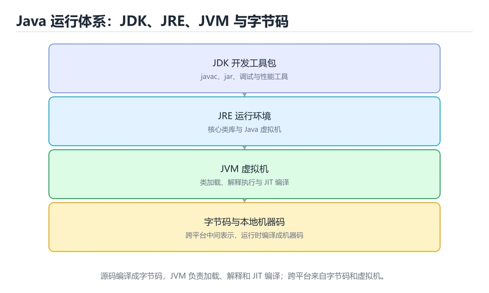

# 环境与 JVM




> 内容更新时间：2026-10-06 · 学习阶段：基础 · 预计用时：55 分钟

## 本节知识框架

**课程定位**：所属分类 `java`（Java），课程主题 `环境与 JVM`，学习阶段 基础，建议用时 50 分钟。

本课主线：JDK/JRE/JVM 区别、编译运行、包与类路径、JIT 与 GC。

**学完本课应当能够**
- 说清 `Java` 与 `JVM` 的含义与区别，并各举一个正例和一个反例。
- 用本课示例验证 `JDK` 的行为，记录输入、输出与失败条件。
- 遇到「类名与文件名不一致」这类问题时，能说出触发条件与修复顺序。

### 从概念到验证的学习链条

1. `Java`：先掌握 编译带包名的代码：javac -d out src/com/example/app/Main.java，运行时用全限定名 java -cp out com.example.app.Main，再用它解释 `JVM` 为什么会出现。
2. `JVM`：先掌握 public static void main(String[] args) 的每个部分都有含义：public 让 JVM 能访问、static 无需实例化、void 无返回值、String[] args 接收命令行参数，再用它解释 `JDK` 为什么会出现。
3. `JDK`：先掌握 Java 开发工具包，包含编译器、运行时和标准工具，再用它解释 `字节码` 为什么会出现。
4. `字节码`：先掌握 源码编译后的中间指令，由虚拟机解释或即时编译执行，再用它解释 `包` 为什么会出现。
5. `包`：先掌握 把一组相关类型、函数或模块组织在一起的命名空间单元，再用它解释 本课示例的观察结果 为什么会出现。

**先修与衔接**：本课是「Java」分类的第 6 课。相关或后续课程：《变量、类型与字符串》。

### 完成判据

- **定义关**：不看正文也能说明 `Java` 是 编译带包名的代码：javac -d out src/com/example/app/Main.java，运行时用全限定名 java -cp out com.example.app.Main，并指出一个反例。
- **机制关**：能按“输入 → 转换 → 输出 → 验证”复述 `环境与 JVM`，而不是只背结论。
- **示例关**：能运行或推演 `环境与 JVM` 的 `text` 示例，并说明一个真实出现的标识符或字面量。
- **证据关**：能指出 `环境与 JVM` 示例里的 调用了 `main()`，并说明它支持或反驳了本课的哪一条结论。
- **排错关**：能复现 类名与文件名不一致，记录现象并按 文件名改成与类名完全一致 修复。
- **迁移关**：能把 `Java`、`JVM`、`JDK`、`javac` 放进一个与 `环境与 JVM` 不同的项目场景，并保持输入与验证条件可追踪。
- **复盘关**：学完 `环境与 JVM` 后，用一句话写下仍然不确定的结论，并列出下一次验证需要的输入、环境和成功判据。

### 复习清单

- [ ] 能不看正文复述本课核心术语，并指出一个边界或反例。
- [ ] 能运行或推演本课示例，记录输入、输出与失败现象。
- [ ] 能完成一次自测，并把错题对照错误表定位原因。

## 核心概念定义

| 术语 | 操作性定义 | 常见边界与风险 |
| --- | --- | --- |
| Java | 编译带包名的代码：javac -d out src/com/example/app/Main.java，运行时用全限定名 java -cp out com.example.app.Main。 | 易错：堆不足或内存泄漏；正确做法是调 `-Xmx` 并排查泄漏。 |
| JVM | public static void main(String[] args) 的每个部分都有含义：public 让 JVM 能访问、static 无需实例化、void 无返回值、String[] args 接收命令行参数。 | 结果依赖数据分布、模型版本与算力预算，换数据集或换硬件都要重新评估。 |
| JDK | Java 开发工具包，包含编译器、运行时和标准工具。 | 易错：编译版本高于运行版本；正确做法是统一 JDK 版本或降级 `--release`。 |
| 字节码 | 源码编译后的中间指令，由虚拟机解释或即时编译执行。 | 静态检查只在编译期成立，运行期输入仍需校验。 |
| 包 | 把一组相关类型、函数或模块组织在一起的命名空间单元。 | 静态检查只在编译期成立，运行期输入仍需校验。 |
| JAVA_HOME | 指向 JDK 根目录 | 只在「指向 JDK 根目录」这一前提下成立，换输入或换环境要重新验证。 |
| PATH | 找到 `java` / `javac` | 只在「找到 `java` / `javac`」这一前提下成立，换输入或换环境要重新验证。 |
| CLASSPATH | 默认类路径 | 只在「默认类路径」这一前提下成立，换输入或换环境要重新验证。 |
| JAVA_OPTS | JVM 参数 | 结果依赖数据分布、模型版本与算力预算，换数据集或换硬件都要重新评估。 |

## 原理与运行机制

### 机制总览

**教材衔接：JDK、JRE 与 JVM**

| 名称 | 包含内容 | 用途 |
| --- | --- | --- |
| JVM | 字节码执行引擎 | 运行 `.class` 文件 |
| JRE | JVM + 核心类库 | 只运行 Java 程序 |
| JDK | JRE + 编译器 + 工具 | 开发 Java 程序 |

Java 的口号是「一次编写，到处运行」：源码编译成**字节码**，由各平台的 JVM 执行并负责内存管理与即时编译（JIT）。

**教材衔接：程序生命周期**

```text
源码 .java → javac 编译 → 字节码 .class
              ↓ 类加载器（加载 → 链接 → 初始化）
              ↓ 字节码解释执行 + JIT 热点编译
              ↓ 垃圾回收自动回收堆内存
```

`public static void main(String[] args)` 的每个部分都有含义：`public` 让 JVM 能访问、`static` 无需实例化、`void` 无返回值、`String[] args` 接收命令行参数。

**教材衔接：版本与时效**

- Java 25 是当前 LTS，Java 21 仍是大量生产系统的基线；Java 的写法要按目标版本选择。
- 升级收益集中在并发与内存模型；JVM 相关代码需要单独回归。
- 升级前先用 nextLine 建立基线：记录版本、命令和输出，升级后只比较这些可观察量。

### 升级检查清单

- 先固定当前版本，跑通全部示例与测验，再升级工具链。
- 升级时只动一个依赖版本，用 nextLine 记录构建与运行结果。
- 升级后重点回归 Java 的默认值、警告信息与错误格式。
- 升级完成后记录 Java 的新旧版本差异，并据此调整下次复核时间。

### 机制拆解：每一步的输入、动作与输出

#### 1. `Java`
- 输入：`Java`；本步把 编译带包名的代码：javac -d out src/com/example/app/Main.java，运行时用全限定名 java -cp out com.example.app.Main 当作判断规则。
- 动作：围绕 `Java` 保留中间状态，并记录它与 `JVM` 的对应关系。
- 输出：`JVM`，它可以被下一段代码、测试或记录继续使用。
- `Java` 的失败条件：当`OutOfMemoryError: Java heap space`时，会出现堆不足或内存泄漏。

#### 2. `JVM`
- 输入：`Java`；本步把 public static void main(String[] args) 的每个部分都有含义：public 让 JVM 能访问、static 无需实例化、void 无返回值、String[] args 接收命令行参数 当作判断规则。
- 动作：围绕 `JVM` 保留中间状态，并记录它与 `JDK` 的对应关系。
- 输出：`JDK`，它可以被下一段代码、测试或记录继续使用。
- `JVM` 的失败条件：结果依赖数据分布、模型版本与算力预算，换数据集或换硬件都要重新评估。

#### 3. `JDK`
- 输入：`JVM`；本步把 Java 开发工具包，包含编译器、运行时和标准工具 当作判断规则。
- 动作：围绕 `JDK` 保留中间状态，并记录它与 `字节码` 的对应关系。
- 输出：`字节码`，它可以被下一段代码、测试或记录继续使用。
- `JDK` 的失败条件：当`UnsupportedClassVersionError`时，会出现编译版本高于运行版本。

#### 4. `字节码`
- 输入：`JDK`；本步把 源码编译后的中间指令，由虚拟机解释或即时编译执行 当作判断规则。
- 动作：围绕 `字节码` 保留中间状态，并记录它与 `包` 的对应关系。
- 输出：`包`，它可以被下一段代码、测试或记录继续使用。
- `字节码` 的失败条件：静态检查只在编译期成立，运行期输入仍需校验。

#### 5. `包`
- 输入：`字节码`；本步把 把一组相关类型、函数或模块组织在一起的命名空间单元 当作判断规则。
- 动作：围绕 `包` 保留中间状态，并记录它与 `main` 的对应关系。
- 输出：`main`，它可以被下一段代码、测试或记录继续使用。
- `包` 的失败条件：当包名与目录不一致时，会出现`package does not exist`。

### 示例中的可观察事实

1. 调用了 `main()`；它对应的课程主题是 `环境与 JVM`。
2. 调用了 `println()`；它对应的课程主题是 `环境与 JVM`。
3. 出现字面量 `Hello, Java!`；它对应的课程主题是 `环境与 JVM`。

### 复现实验记录

- 环境：`环境与 JVM` 使用 `text` 示例，固定 `Java`、`JVM`、`JDK`、`javac` 作为第一组条件。
- 首轮输入：先确认 调用了 `main()`，预测 `Java` 会怎样变化。
- 基线观察：记录命令、输入、输出和错误原文，不用截图代替可复制的文本。
- 单变量修改：只改变 `Java`，观察 `包` 是否仍满足定义。
- 失败注入：复现 类名与文件名不一致，确认现象是 `class X is public, should be declared in a file named X.java`。
- 记录结论：把“修改前、修改后、预期变化、实际变化”写成四列表，这样复盘 `环境与 JVM` 时才能区分概念错误与实现错误。

## 典型应用场景

- **类名与文件名不一致**：典型现象是`class X is public, should be declared in a file named X.java`；正确做法是文件名改成与类名完全一致。
- **忘写分号**：典型现象是`';' expected`；正确做法是语句结尾加分号。
- **方法写在 `main` 里面**：典型现象是`illegal start of expression`；正确做法是方法要写在类里、`main` 外。
- **用了中文标点**：典型现象是`illegal character`；正确做法是全部换成英文半角。

### 最小验证场景

- 准备：保留 `text` 示例的原始输入，先记录 `环境与 JVM` 的基线输出和完整运行命令。
- 观察：先核对 调用了 `main()`，再改变一个与 `Java` 相关的条件。
- 判定：新结果与 `环境与 JVM` 的基线不同不等于错误；只有当差异破坏了 `Java` 的定义或错误表中的约束，才判定为失败。

### 选择与边界

- 使用 `Java` 时，先满足它的定义：编译带包名的代码：javac -d out src/com/example/app/Main.java，运行时用全限定名 java -cp out com.example.app.Main；易错：堆不足或内存泄漏；正确做法是调 `-Xmx` 并排查泄漏。
- 使用 `JVM` 时，先满足它的定义：public static void main(String[] args) 的每个部分都有含义：public 让 JVM 能访问、static 无需实例化、void 无返回值、String[] args 接收命令行参数；结果依赖数据分布、模型版本与算力预算，换数据集或换硬件都要重新评估。
- 使用 `JDK` 时，先满足它的定义：Java 开发工具包，包含编译器、运行时和标准工具；易错：编译版本高于运行版本；正确做法是统一 JDK 版本或降级 `--release`。
- 使用 `字节码` 时，先满足它的定义：源码编译后的中间指令，由虚拟机解释或即时编译执行；静态检查只在编译期成立，运行期输入仍需校验。
- 使用 `包` 时，先满足它的定义：把一组相关类型、函数或模块组织在一起的命名空间单元；静态检查只在编译期成立，运行期输入仍需校验。

## 代码/协议/SQL 示例

### 最小可验证示例

```java
// Hello.java —— 文件名必须与 public 类名一致
public class Hello {
    public static void main(String[] args) {
        System.out.println("Hello, Java!");
    }
}
```

**教材衔接：第一个程序**

```bash
javac Hello.java     # 生成 Hello.class 字节码
java Hello           # 启动 JVM 执行

jshell               # JDK 9+ 交互式 REPL，适合快速试验
```

**教材衔接：包与类路径**

```java
package com.example.app;      // 包名通常用倒置域名

import java.util.List;        // 导入其他包的类

public class Main {
    public static void main(String[] args) {
        List<String> names = List.of("tom", "alice");
        System.out.println(names);
    }
}
```

编译带包名的代码：`javac -d out src/com/example/app/Main.java`，运行时用全限定名 `java -cp out com.example.app.Main`。

**教材衔接：JDK 组成与命令速查**

| 术语 | 含义 |
| --- | --- |
| JVM | Java 虚拟机，负责执行字节码 |
| JRE | 运行环境（JVM + 核心类库），只能运行程序 |
| JDK | 开发工具包（JRE + 编译器 + 诊断工具） |
| 字节码 | `.class` 文件，JVM 的执行格式 |
| 类路径 | JVM 查找类的路径，由 `-cp` 指定 |

| 目的 | 命令 |
| --- | --- |
| 查看版本 | `java -version`、`javac -version` |
| 编译 | `javac -d out src/Main.java` |
| 运行 | `java -cp out com.example.Main` |
| 打包 | `jar --create --file app.jar --main-class com.example.Main -C out .` |
| 运行 jar | `java -jar app.jar` |
| 查看字节码 | `javap -c -p out/com/example/Main.class` |
| 查看模块 | `java --list-modules` |
| 诊断线程 | `jstack <pid>` |
| 查看堆 | `jmap -heap <pid>` |
| 统一日志 | `java -Xlog:gc*:file=gc.log` |

版本与特性速查：

| 版本 | 关键特性 |
| --- | --- |
| Java 8 | Lambda、Stream、`java.time` |
| Java 11 | `var` 局部变量推断、内置 HTTP Client |
| Java 17 | record、密封类、switch 模式匹配（预览） |
| Java 21 | 虚拟线程、模式匹配增强、record 模式 |
| Java 25（LTS 方向） | 持续演进，关注长期支持版本 |

**教材衔接：零基础详解：Java 程序为什么既要编译又要解释**

### 一句话说清它是什么

Java 先把源码编译成**字节码**（`.class`），再由 JVM 在运行时翻译成机器指令。
这叫「一次编写，到处运行」：只要有对应平台的 JVM，同一份字节码就能跑。

### 用生活比喻理解三个缩写

| 缩写 | 全称 | 比喻 | 你要不要装 |
| --- | --- | --- | --- |
| JVM | Java 虚拟机 | 会读字节码的翻译官 | 随 JRE/JDK 一起装 |
| JRE | 运行环境 | 翻译官 + 词典 | 只想运行程序时够用 |
| JDK | 开发工具包 | 翻译官 + 词典 + 写作工具 | **开发者必须装这个** |

### 逐行拆解第一个程序

```java
package demo;                       // 声明所在包，可选但推荐

public class Hello {                // 类名必须与文件名 Hello.java 一致
    public static void main(String[] args) {   // 程序入口
        System.out.println("Hello, World!");   // 输出并换行
    }
}
```

| 部分 | 含义 | 少写会怎样 |
| --- | --- | --- |
| `package demo;` | 这个类属于 `demo` 包 | 类多了会重名冲突 |
| `public class Hello` | 公开类，名字要和文件名一致 | 不一致直接编译不过 |
| `public static void main` | 入口方法，签名固定 | JVM 找不到入口，报「找不到主方法」 |
| `String[] args` | 命令行参数 | 少写就不是合法入口 |
| `System.out.println` | 打印并换行 | 用 `print` 则不换行 |

### 编译与运行的两条命令

```bash
javac -d out src/demo/Hello.java     # 编译，字节码输出到 out 目录
java -cp out demo.Hello              # 运行，写全限定类名
```

注意运行时要写 `demo.Hello`（包名 + 类名），而不是 `Hello`。

### 新手最容易踩的八个坑

| 坑 | 报错信息 | 正确做法 |
| --- | --- | --- |
| 类名与文件名不一致 | `class X is public, should be declared in a file named X.java` | 文件名改成与类名完全一致 |
| 忘写分号 | `';' expected` | 语句结尾加分号 |
| 方法写在 `main` 里面 | `illegal start of expression` | 方法要写在类里、`main` 外 |
| 用了中文标点 | `illegal character` | 全部换成英文半角 |
| 变量未初始化 | `variable x might not have been initialized` | 声明时给初值 |
| 字符串比较用 `==` | 结果时对时错 | 内容比较用 `.equals()` |
| 找不到主方法 | `Main method not found` | 检查签名是否完全一致 |
| 包名与目录不一致 | `package does not exist` | 目录结构与包名一一对应 |

### 变量与常量：`var`、`final`

```java
var count = 10;                 // 局部变量类型推断（Java 10+）
final double PI = 3.14159;      // 常量，赋值后不能改
```

`var` 只是省了写类型，编译期类型就确定了，不是动态类型。

### 输入输出：Scanner 的正确姿势

```java
import java.util.Scanner;

public class Greet {
    public static void main(String[] args) {
        Scanner sc = new Scanner(System.in);
        System.out.print("请输入姓名：");
        String name = sc.nextLine();
        System.out.printf("你好，%s！%n", name);
        sc.close();
    }
}
```

`nextInt()` 之后紧接 `nextLine()` 会读到空串，这是最经典的坑：
读数字后要多调用一次 `nextLine()` 吃掉换行符。

### 代码规范速查

| 元素 | 规范 | 例子 |
| --- | --- | --- |
| 类名 | 大驼峰 | `UserService` |
| 方法与变量 | 小驼峰 | `calcTotal()`、`userName` |
| 常量 | 全大写加下划线 | `MAX_RETRY` |
| 包名 | 全小写，域名倒写 | `com.example.demo` |
| 缩进 | 4 个空格 | 不要用 Tab |

### 手把手练习：命令行计算器

```java
import java.util.Scanner;

public class Calculator {
    public static void main(String[] args) {
        Scanner sc = new Scanner(System.in);
        System.out.print("输入表达式（如 3 + 4）：");
        double a = sc.nextDouble();
        String op = sc.next();
        double b = sc.nextDouble();

        double result = switch (op) {
            case "+" -> a + b;
            case "-" -> a - b;
            case "*" -> a * b;
            case "/" -> b == 0 ? Double.NaN : a / b;
            default -> Double.NaN;
        };
        System.out.printf("结果：%.2f%n", result);
        sc.close();
    }
}
```

### 学完自测

- [ ] 能说出 JDK、JRE、JVM 的区别。
- [ ] 能解释为什么类名和文件名必须一致。
- [ ] 知道 `java` 命令后面要写全限定类名。
- [ ] 能说出 `==` 与 `.equals()` 的区别。
- [ ] 能独立用 `javac` 和 `java` 跑起来一个带包名的类。

### 示例精读：先找证据，再改一个条件

1. 调用了 `main()`；它出现在 `环境与 JVM` 的示例中，阅读时先确认它前后各发生了什么。
2. 调用了 `println()`；它出现在 `环境与 JVM` 的示例中，阅读时先确认它前后各发生了什么。
3. 出现字面量 `Hello, Java!`；它出现在 `环境与 JVM` 的示例中，阅读时先确认它前后各发生了什么。
- 在 `环境与 JVM` 中与 `Java` 对照：示例必须能支持 编译带包名的代码：javac -d out src/com/example/app/Main.java，运行时用全限定名 java -cp out com.example.app.Main，否则说明这一段还缺少实现或验证步骤。
- 在 `环境与 JVM` 中与 `JVM` 对照：示例必须能支持 public static void main(String[] args) 的每个部分都有含义：public 让 JVM 能访问、static 无需实例化、void 无返回值、String[] args 接收命令行参数，否则说明这一段还缺少实现或验证步骤。
- 在 `环境与 JVM` 中与 `JDK` 对照：示例必须能支持 Java 开发工具包，包含编译器、运行时和标准工具，否则说明这一段还缺少实现或验证步骤。
- 在 `环境与 JVM` 中与 `字节码` 对照：示例必须能支持 源码编译后的中间指令，由虚拟机解释或即时编译执行，否则说明这一段还缺少实现或验证步骤。

## 时间/空间复杂度或性能分析

| 回收器 | 特点 | 适用 |
| --- | --- | --- |
| Serial | 单线程，停顿明显 | 客户端小程序、容器内极小堆 |
| Parallel | 多线程吞吐优先 | 批处理、吞吐优先场景 |
| CMS | 并发标记清除，低停顿 | 老版本低延迟场景（已废弃） |
| G1 | 分区域回收，可设定停顿目标 | 服务端默认（JDK 9+） |
| ZGC / Shenandoah | 亚毫秒级停顿，支持大堆 | 超大堆、延迟极敏感服务 |

排查思路：先用 `jstat -gc <pid> 1000` 观察 GC 频率与耗时；用 `jmap -histo` 找大对象；OOM 时用 MAT 分析堆转储。**频繁 Full GC 通常是内存泄漏或堆设置过小**，不要一上来就换回收器。

**测量方法**：以 `环境与 JVM` 的 `Java` 场景为对象，固定输入跑一遍记录基线，再把规模或并发度提高一个数量级复测；两次结果的差值与波动范围才是结论依据。

### 需要控制的变量与记录项

- `环境与 JVM` 的 `Java`：固定它的版本、输入范围和资源上限，分别记录速度、内存与失败率的变化。
- `环境与 JVM` 的 `JVM`：固定它的版本、输入范围和资源上限，分别记录速度、内存与失败率的变化。
- `环境与 JVM` 的 `JDK`：固定它的版本、输入范围和资源上限，分别记录速度、内存与失败率的变化。
- `环境与 JVM` 的 `javac`：固定它的版本、输入范围和资源上限，分别记录速度、内存与失败率的变化。
- `环境与 JVM` 的 `字节码`：固定它的版本、输入范围和资源上限，分别记录速度、内存与失败率的变化。
- `环境与 JVM` 中 `Java` 的边界：易错：堆不足或内存泄漏；正确做法是调 `-Xmx` 并排查泄漏。达到边界时不要外推，必须重新测量。
- `环境与 JVM` 中 `JVM` 的边界：结果依赖数据分布、模型版本与算力预算，换数据集或换硬件都要重新评估。达到边界时不要外推，必须重新测量。
- `环境与 JVM` 中 `JDK` 的边界：易错：编译版本高于运行版本；正确做法是统一 JDK 版本或降级 `--release`。达到边界时不要外推，必须重新测量。
- `环境与 JVM` 中 `字节码` 的边界：静态检查只在编译期成立，运行期输入仍需校验。达到边界时不要外推，必须重新测量。
- `环境与 JVM` 中 `包` 的边界：静态检查只在编译期成立，运行期输入仍需校验。达到边界时不要外推，必须重新测量。
- `环境与 JVM` 的代码证据：先验证 调用了 `main()`，再记录该路径的输入规模与耗时；只看代码行数不能推出复杂度。

## 常见误区与易错点

| 容易写错的做法 | 实际现象 | 原因与正确做法 |
| --- | --- | --- |
| 类名与文件名不一致 | `class X is public, should be declared in a file named X.java` | 文件名改成与类名完全一致 |
| 忘写分号 | `';' expected` | 语句结尾加分号 |
| 方法写在 `main` 里面 | `illegal start of expression` | 方法要写在类里、`main` 外 |
| 用了中文标点 | `illegal character` | 全部换成英文半角 |
| 变量未初始化 | `variable x might not have been initialized` | 声明时给初值 |
| 字符串比较用 `==` | 结果时对时错 | 内容比较用 `.equals()` |
| 找不到主方法 | `Main method not found` | 检查签名是否完全一致 |
| 包名与目录不一致 | `package does not exist` | 目录结构与包名一一对应 |
| `Could not find or load main class` | 类名或包名不对、类路径错误 | 用带包名的全限定名，检查 `-cp` |
| `NoClassDefFoundError` | 运行时缺依赖 | 把依赖加入类路径或用构建工具打包 |
| `ClassNotFoundException` | 反射或驱动类缺失 | 检查依赖与拼写 |
| `UnsupportedClassVersionError` | 编译版本高于运行版本 | 统一 JDK 版本或降级 `--release` |
| `public class` 与文件名不一致 | `javac` 报错 | 文件名必须与公共类名一致 |
| `package ... does not exist` | 缺少依赖或包路径不对 | 加依赖并检查目录结构 |
| `error: cannot find symbol` | 未导入、拼写错误或作用域不对 | 补 import 或修拼写 |
| `OutOfMemoryError: Java heap space` | 堆不足或内存泄漏 | 调 `-Xmx` 并排查泄漏 |
| `StackOverflowError` | 递归过深 | 加终止条件或改迭代 |
| 程序输出中文乱码 | 编码不一致 | 统一 UTF-8（`-Dfile.encoding=UTF-8`） |
| Could not find or load main class | 类名或包名不对、类路径错误。 | 用带包名的全限定名，检查 -cp。 |
| NoClassDefFoundError | 运行时缺依赖。 | 把依赖加入类路径或用构建工具打包。 |
| ClassNotFoundException | 反射或驱动类缺失。 | 检查依赖与拼写。 |

### 现场 1：类名与文件名不一致

**症状**：`class X is public, should be declared in a file named X.java`。

**根因与修复**：文件名改成与类名完全一致。

**自检**：在本课示例里复现「类名与文件名不一致」，改成文件名改成与类名完全一致后重跑；如果症状消失且失败路径按预期变化，说明定位正确。

### 现场 2：忘写分号

**症状**：`';' expected`。

**根因与修复**：语句结尾加分号。

**自检**：在本课示例里复现「忘写分号」，改成语句结尾加分号后重跑；如果症状消失且失败路径按预期变化，说明定位正确。

### 现场 3：方法写在 `main` 里面

**症状**：`illegal start of expression`。

**根因与修复**：方法要写在类里、`main` 外。

**自检**：在本课示例里复现「方法写在 `main` 里面」，改成方法要写在类里、`main` 外后重跑；如果症状消失且失败路径按预期变化，说明定位正确。

### 现场 4：用了中文标点

**症状**：`illegal character`。

**根因与修复**：全部换成英文半角。

**自检**：在本课示例里复现「用了中文标点」，改成全部换成英文半角后重跑；如果症状消失且失败路径按预期变化，说明定位正确。

### 现场 5：变量未初始化

**症状**：`variable x might not have been initialized`。

**根因与修复**：声明时给初值。

**自检**：在本课示例里复现「变量未初始化」，改成声明时给初值后重跑；如果症状消失且失败路径按预期变化，说明定位正确。

### 现场 6：字符串比较用 `==`

**症状**：结果时对时错。

**根因与修复**：内容比较用 `.equals()`。

**自检**：在本课示例里复现「字符串比较用 `==`」，改成内容比较用 `.equals()`后重跑；如果症状消失且失败路径按预期变化，说明定位正确。

### 现场 7：找不到主方法

**症状**：`Main method not found`。

**根因与修复**：检查签名是否完全一致。

**自检**：在本课示例里复现「找不到主方法」，改成检查签名是否完全一致后重跑；如果症状消失且失败路径按预期变化，说明定位正确。

### 现场 8：包名与目录不一致

**症状**：`package does not exist`。

**根因与修复**：目录结构与包名一一对应。

**自检**：在本课示例里复现「包名与目录不一致」，改成目录结构与包名一一对应后重跑；如果症状消失且失败路径按预期变化，说明定位正确。

### 现场 9：`Could not find or load main class`

**症状**：类名或包名不对、类路径错误。

**根因与修复**：用带包名的全限定名，检查 `-cp`。

**自检**：在本课示例里复现「`Could not find or load main class`」，改成用带包名的全限定名，检查 `-cp`后重跑；如果症状消失且失败路径按预期变化，说明定位正确。

## 与其他知识点的关系

- **相关或后续**：`变量、类型与字符串`。本课术语会在这些课程里继续使用。
- **术语归属**：`Java`、`JVM`、`JDK` 的定义以本课「核心概念定义」为准，换到其他课程时先确认定义是否被改写。
- 同一分类的《Java 第一个类》也涉及 `Java`；两课衔接时先确认这个术语的定义是否一致。
- 同一分类的《Java 变量与输出》也涉及 `Java`；两课衔接时先确认这个术语的定义是否一致。

### 先修与后续术语接口

- `变量、类型与字符串`：两者通过本分类的学习顺序衔接，阅读时重点比较各自的输入与失败条件。

### 容易混淆的相邻概念

- `Java` 与 `JVM`：前者强调 编译带包名的代码：javac -d out src/com/example/app/Main.java，运行时用全限定名 java -cp out com.example.app.Main；后者强调 public static void main(String[] args) 的每个部分都有含义：public 让 JVM 能访问、static 无需实例化、void 无返回值、String[] args 接收命令行参数。判断时分别检查两条定义的适用范围，不要只看名称相似就互换。
- `JVM` 与 `JDK`：前者强调 public static void main(String[] args) 的每个部分都有含义：public 让 JVM 能访问、static 无需实例化、void 无返回值、String[] args 接收命令行参数；后者强调 Java 开发工具包，包含编译器、运行时和标准工具。判断时分别检查两条定义的适用范围，不要只看名称相似就互换。
- `JDK` 与 `字节码`：前者强调 Java 开发工具包，包含编译器、运行时和标准工具；后者强调 源码编译后的中间指令，由虚拟机解释或即时编译执行。判断时分别检查两条定义的适用范围，不要只看名称相似就互换。
- `字节码` 与 `包`：前者强调 源码编译后的中间指令，由虚拟机解释或即时编译执行；后者强调 把一组相关类型、函数或模块组织在一起的命名空间单元。判断时分别检查两条定义的适用范围，不要只看名称相似就互换。

## 自测题与参考答案

> 先独立作答，再对照参考答案；答案都能在本课正文、术语表或错误表里找到依据。

### 自测 1（概念复述）

不看正文，写出 `Java` 的操作性定义，并说明它与 `JVM` 的区别。

**参考答案**：编译带包名的代码：javac -d out src/com/example/app/Main.java，运行时用全限定名 java -cp out com.example.app.Main。

`JVM` 的定位是：public static void main(String[] args) 的每个部分都有含义：public 让 JVM 能访问、static 无需实例化、void 无返回值、String[] args 接收命令行参数；两者的差别要从适用对象与失败模式上说明。

### 自测 2（排错）

本课错误表记录了「类名与文件名不一致」这类做法。请写出它会出现的现象、根因，以及修复顺序。

**参考答案**：现象是`class X is public, should be declared in a file named X.java`；正确做法是文件名改成与类名完全一致。修复时先复现现象并保留证据，再改动一处假设重跑，确认现象消失。

### 自测 3（动手验证）

运行本课的 `text` 示例，改动其中一个输入后重新运行，记录输出与错误信息。

**参考答案**：正常输入下 `text` 示例应当复现正文给出的结果；改动输入后，如果结果改变或报错，先核对它是否满足 `环境与 JVM` 中`Java` 的适用范围，再检查错误表里是否有同类现象。

### 自测 4（代码阅读）

阅读本课开头的 `text` 示例，说明它体现了`Java` 的哪一条性质，并指出改动哪个输入会让这条性质不再成立。

**参考答案**：`Java` 的定义是 编译带包名的代码：javac -d out src/com/example/app/Main.java，运行时用全限定名 java -cp out com.example.app.Main，示例正是在实现这条定义。改动与 `Java` 有关的一个输入后，如果结果不再符合 `环境与 JVM` 的正文描述，就说明该性质只在当前前提成立。

### 自测 5（迁移）

把 `环境与 JVM` 的方法迁移到自己的项目：围绕 `Java` 写出一个与错误表同类的风险点，并说明触发条件和检验方式。

**参考答案**：例如「ClassNotFoundException」，它会导致反射或驱动类缺失；检验方式是按检查依赖与拼写改一处再复现，确认现象消失且没有引入新的失败分支。

### 自测 6（对比）

用一个表格对比 `Java` 与 `JVM`：各写一行适用场景、一行失败表现。

**参考答案**：`Java` 的定义是编译带包名的代码：javac -d out src/com/example/app/Main.java，运行时用全限定名 java -cp out com.example.app.Main；`JVM` 的定义是public static void main(String[] args) 的每个部分都有含义：public 让 JVM 能访问、static 无需实例化、void 无返回值、String[] args 接收命令行参数。两者的失败表现分别对应本课错误表里与本术语相关的行。

### 自测 7（排错顺序）

面对「类名与文件名不一致」引发的问题，请把“复现 `class X is public, should be declared in a file named X.java` → 保留证据 → 文件名改成与类名完全一致 → 回归验证”四步写成可执行的检查清单。

**参考答案**：第一步按`class X is public, should be declared in a file named X.java`复现；第二步记录输入、版本与完整报错；第三步按文件名改成与类名完全一致只改一处；第四步重跑并确认失败路径也按预期变化。

### 自测 8（边界判断）

针对 `包`，分别写出“可以使用”的条件和“结论不再成立”的条件。

**参考答案**：静态检查只在编译期成立，运行期输入仍需校验。 同时要把 `包` 的定义 把一组相关类型、函数或模块组织在一起的命名空间单元 与实际输入逐项对照。

### 自测 9（机制重建）

不看正文，按输入、转换、输出、验证四段重建 `Java` → `JVM` → `JDK` → `字节码` 的作用链。

**参考答案**：起点是 `Java` 的定义 编译带包名的代码：javac -d out src/com/example/app/Main.java，运行时用全限定名 java -cp out com.example.app.Main；中间每一步都保留可观察状态；终点由 `包` 检查，失败时回到错误表定位第一个偏离定义的步骤。

### 自测 10（综合排错）

在 `环境与 JVM` 中，现象是 反射或驱动类缺失。请围绕 ClassNotFoundException 写出最小复现、关键证据、修复动作和回归验证，并说明为什么不能只凭一次运行下结论。

**参考答案**：先复现 ClassNotFoundException，记录输入与完整错误；再按 检查依赖与拼写 只改一处。回归时同时跑正常路径和边界路径，只有两次结果都可解释，才把修复视为完成。

### 自测 11（一分钟复述）

用每分钟约 200 字的速度复述 `环境与 JVM`：先给主问题，再按顺序说出 `Java`、`JVM`、`JDK`、`字节码`，最后给一个失败案例。

**自评标准**：主问题必须对应 JDK/JRE/JVM 区别、编译运行、包与类路径、JIT 与 GC；每个术语都要能接上一句定义或边界；失败案例必须写成可观察现象，不能用“可能有风险”代替证据。

## 术语速查

| 术语 | 一句话说明 |
| --- | --- |
| `Java` | 编译带包名的代码：javac -d out src/com/example/app/Main.java，运行时用全限定名 java -cp out com.example.app.Main。 |
| `JVM` | public static void main(String[] args) 的每个部分都有含义：public 让 JVM 能访问、static 无需实例化、void 无返回值、String[] args 接收命令行参数。 |
| `JDK` | Java 开发工具包，包含编译器、运行时和标准工具。 |
| `字节码` | 源码编译后的中间指令，由虚拟机解释或即时编译执行。 |
| `包` | 把一组相关类型、函数或模块组织在一起的命名空间单元。 |

**术语关系**：`Java`（编译带包名的代码：javac -d out src/com/example/app/Main.java） → `JVM`（public static void main(String[] args) 的每个部分都有含义：public 让 JVM 能访问、static 无需实例化、void 无返回值、String[] args 接收命令行参数） → `JDK`（Java 开发工具包） → `字节码`（源码编译后的中间指令）。

## 考点精讲

`环境与 JVM` 的题库有 6 道题，下面逐题给出题干、正确项与判断依据：先自己作答，再核对正确项，最后回到正文对应小节复核。

### 考点 1：第 1 题

- **题目**：围绕“环境与 JVM”中的 Java、JVM、JDK，下列哪两项是本课强调的实践判断？
- **正确项**：学习 Java 时要同时说明输入、输出和失败路径，不能只看正常流程；验证 JVM 时要固定版本并覆盖边界输入，结论才可复现
- **判断依据**：这道题落在术语 `Java` 上：编译带包名的代码：javac -d out src/com/example/app/Main.java，运行时用全限定名 java -cp out com.example.app.Main。复习时把 `Java` 的定义、适用边界和一个反例一起说清楚，再回到「核心概念定义」核对原文。

### 考点 2：第 2 题

- **题目**：public class Hello 的源文件名必须是？
- **正确项**：Hello.java
- **判断依据**：这道题检验本课主问题：JDK/JRE/JVM 区别、编译运行、包与类路径、JIT 与 GC。复习时先复述本课主问题，再举一个会让结论失效的输入。

### 考点 3：第 3 题

- **题目**：Java 实现「一次编写，到处运行」的关键是？
- **正确项**：编译成字节码
- **判断依据**：这道题落在术语 `Java` 上：编译带包名的代码：javac -d out src/com/example/app/Main.java，运行时用全限定名 java -cp out com.example.app.Main。复习时把 `Java` 的定义、适用边界和一个反例一起说清楚，再回到「核心概念定义」核对原文。

### 考点 4：第 4 题

- **题目**：阅读 `环境与 JVM` 的 `Java` 示例。它服务于JDK/JRE/JVM 区别、编译运行、包与类路径、JIT 与 GC。代码中实际包含下列哪一项？
- **正确项**：出现字面量 `Hello, Java!`
- **判断依据**：这道题落在术语 `Java` 上：编译带包名的代码：javac -d out src/com/example/app/Main.java，运行时用全限定名 java -cp out com.example.app.Main。复习时把 `Java` 的定义、适用边界和一个反例一起说清楚，再回到「核心概念定义」核对原文。

### 考点 5：第 5 题

- **题目**：Java 程序入口方法的正确签名是？
- **正确项**：public static void main(String[] args)
- **判断依据**：这道题落在术语 `Java` 上：编译带包名的代码：javac -d out src/com/example/app/Main.java，运行时用全限定名 java -cp out com.example.app.Main。复习时把 `Java` 的定义、适用边界和一个反例一起说清楚，再回到「核心概念定义」核对原文。

### 考点 6：第 6 题

- **题目**：填空：补齐下面这段术语说明中的空缺。课程 `JDK/JRE/JVM 区别、编译运行、包与类路径、JIT 与 GC。`，这段说明是：`____`：源码编译后的中间指令，由虚拟机解释或即时编译执行。空缺处应填哪个术语？
- **正确项**：字节码
- **判断依据**：这道题落在术语 `JVM` 上：public static void main(String[] args) 的每个部分都有含义：public 让 JVM 能访问、static 无需实例化、void 无返回值、String[] args 接收命令行参数。复习时把 `JVM` 的定义、适用边界和一个反例一起说清楚，再回到「核心概念定义」核对原文。

### 考点 7：`Java`

- **要点**：编译带包名的代码：javac -d out src/com/example/app/Main.java，运行时用全限定名 java -cp out com.example.app.Main。
- **Java 的边界**：易错：堆不足或内存泄漏；正确做法是调 `-Xmx` 并排查泄漏。

### 考点 8：`JVM`

- **要点**：public static void main(String[] args) 的每个部分都有含义：public 让 JVM 能访问、static 无需实例化、void 无返回值、String[] args 接收命令行参数。
- **JVM 的边界**：结果依赖数据分布、模型版本与算力预算，换数据集或换硬件都要重新评估。

### 考点 9：`JDK`

- **要点**：Java 开发工具包，包含编译器、运行时和标准工具。
- **JDK 的边界**：易错：编译版本高于运行版本；正确做法是统一 JDK 版本或降级 `--release`。

### 考点 10：`字节码`

- **要点**：源码编译后的中间指令，由虚拟机解释或即时编译执行。
- **字节码 的边界**：静态检查只在编译期成立，运行期输入仍需校验。

### 考点 11：`包`

- **要点**：把一组相关类型、函数或模块组织在一起的命名空间单元。
- **包 的边界**：静态检查只在编译期成立，运行期输入仍需校验。

### 考点 12：排错——类名与文件名不一致

- **现象**：`class X is public, should be declared in a file named X.java`。
- **处理**：文件名改成与类名完全一致。

### 考点 13：排错——忘写分号

- **现象**：`';' expected`。
- **处理**：语句结尾加分号。

### 考点 14：综合辨析——`Java` 与 `包`

- **辨析点**：`Java` 的定义是 编译带包名的代码：javac -d out src/com/example/app/Main.java，运行时用全限定名 java -cp out com.example.app.Main；`包` 的定义是 把一组相关类型、函数或模块组织在一起的命名空间单元。
- **答题要求**：面对 `环境与 JVM` 的题目，先判断描述的是 `Java` 还是 `包`，再归到对应定义，最后写出一个会让该定义失效的边界输入。

### 考点 15：排错评分点

- **现象分**：能写出 `class X is public, should be declared in a file named X.java`，而不是只写“程序有错”。
- **证据分**：保留触发 类名与文件名不一致 的输入、版本和错误原文。
- **修复分**：按 文件名改成与类名完全一致 只改一处，并同时回归正常路径与边界路径。

## 内容元数据

- 内容版本：v2.0
- 最后更新：2026-10-06
- 学习阶段：基础
- 适用环境：Java 21+ / Maven 或 Gradle；本课聚焦 Java。
- 内容来源：内置结构化课程与工程实践整理
- 相关主题：Java、JVM、JDK、javac、字节码、包
- 质量版本：P0 测验标准 + P1 覆盖扩展 + P2 体验补全

## 参考资料与复核

- 最后复核：2026-10-04
- 下次复核：2027-02-24
- 复核范围：版本兼容、API 行为、安全建议与工程实践
- 来源性质：官方文档、标准或权威教材；本课核对关键词：Java、JVM、JDK、javac、字节码、包。

| 参考资料 | 本课用途 |
| --- | --- |
| [JVM 规范](https://docs.oracle.com/javase/specs/jvms/se21/html/index.html) | 字节码与运行时行为 |
| [Java GC 调优](https://docs.oracle.com/en/java/javase/21/gctuning/) | 垃圾回收与性能调优 |
| [dev.java 学习](https://dev.java/learn/) | 现代 Java 官方教程 |

| [本课术语索引：环境与 JVM](#核心概念定义) | 按本课输入、术语边界和错误表现逐项核对 |
> 「环境与 JVM」的链接用于离线阅读后的延伸核对；App 不会自动联网。