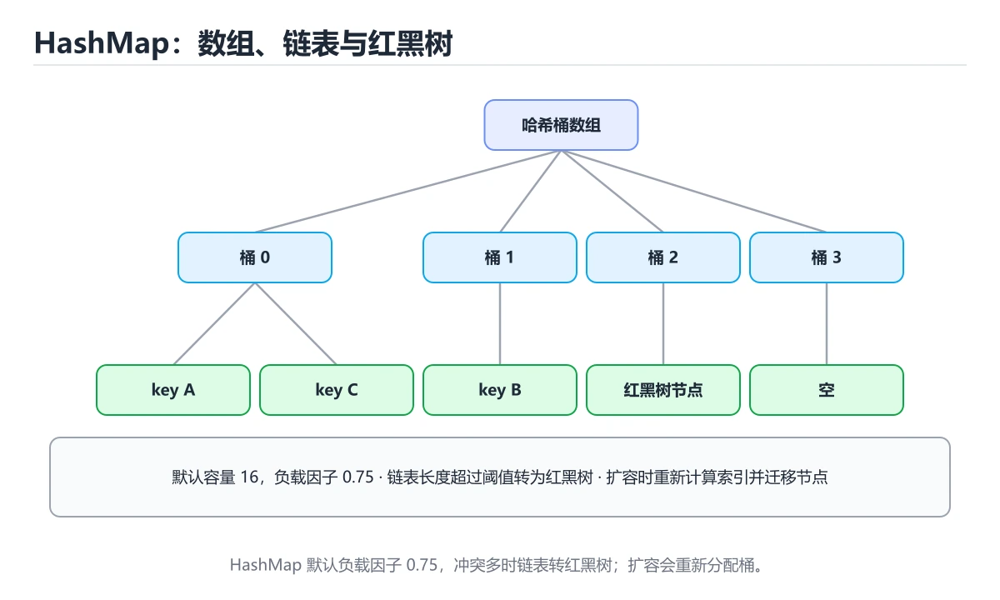
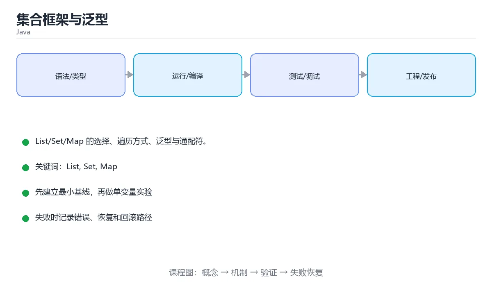

# 集合框架与泛型

> 内容更新时间：2026-10-06 · 学习阶段：进阶 · 预计用时：40 分钟





## 学习目标

- 能用自己的话解释集合框架与泛型解决了什么问题，而不是只背术语。
- 能说清 「List」、「Set」、「Map」、「HashMap」 之间的关系，并分别举出一个例子。
- 能把本课知识放回「Java」的知识体系，说明它和相邻主题的边界。
- 能完成本课练习，并用验收标准检查自己的结果。

> 一句话摘要：List/Set/Map 的选择、遍历方式、泛型与通配符。

## 前置知识

- 先完成上一课《继承、接口与多态》；如果已经掌握，可以直接用本课练习自测。
- 本课阶段：进阶。建议先掌握同一分类的基础课程，并能独立运行正文中的最小示例。
- 开始前先复习：List、Set、Map。
- 如果某一步看不懂，先记录具体卡点，完成练习后再回头读一遍。

## 集合体系

```text
Collection ─┬─ List（有序、可重复）→ ArrayList / LinkedList
            ├─ Set（不可重复）      → HashSet / TreeSet / LinkedHashSet
            └─ Queue（队列）        → ArrayDeque / PriorityQueue
Map（键值对）→ HashMap / TreeMap / LinkedHashMap
```

## List

```java
List<String> names = new ArrayList<>();
names.add("tom");
names.add(1, "alice");            // 指定位置插入
names.set(0, "bob");              // 修改
names.remove("alice");

System.out.println(names.get(0));
System.out.println(names.size());
names.sort(Comparator.naturalOrder());

List<String> fixed = List.of("a", "b");   // 不可变列表
```

`ArrayList` 随机访问快，`LinkedList` 中间插删快但实际使用较少（缓存不友好）。

## Set

```java
Set<String> tags = new HashSet<>();
tags.add("java");
tags.add("java");                 // 重复元素不会被加入
System.out.println(tags.contains("java"));

Set<String> ordered = new LinkedHashSet<>();   // 保留插入顺序
Set<Integer> sorted = new TreeSet<>();         // 自动排序
```

## Map

```java
Map<String, Integer> scores = new HashMap<>();
scores.put("math", 90);
scores.putIfAbsent("english", 85);

System.out.println(scores.getOrDefault("history", 0));   // 不存在时返回默认值

for (Map.Entry<String, Integer> entry : scores.entrySet()) {
    System.out.println(entry.getKey() + "=" + entry.getValue());
}

scores.forEach((subject, score) -> System.out.println(subject + score));
```

## 泛型

```java
public class Box<T> {                  // 泛型类
    private T value;
    public void set(T value) { this.value = value; }
    public T get() { return value; }
}

public static <T extends Comparable<T>> T max(List<T> items) {   // 泛型方法 + 上界
    T result = items.get(0);
    for (T item : items) if (item.compareTo(result) > 0) result = item;
    return result;
}

List<? extends Number> numbers = List.of(1, 2.5);    // 上界通配符：只读
List<? super Integer> sink = new ArrayList<Number>(); // 下界通配符：可写
```

泛型在编译后会**类型擦除**，因此不能 `new T[]`，也不能对泛型做 `instanceof`。

## 性能特征与并发容器

| 容器 | 随机访问 | 插入删除 | 适用 |
| --- | --- | --- | --- |
| ArrayList | O(1) | 尾部均摊 O(1)，中间 O(n) | 默认选择，读多写少 |
| LinkedList | O(n) | 已知位置 O(1) | 频繁在两端操作（多数场景仍不如 ArrayDeque） |
| HashMap | 平均 O(1) | 平均 O(1) | 键值查找，需正确实现 equals/hashCode |
| TreeMap | O(log n) | O(log n) | 需要有序遍历或范围查询 |
| ArrayDeque | 两端 O(1) | 两端 O(1) | 栈与队列的首选 |

**扩容机制**：ArrayList 默认容量 10，扩容为 1.5 倍；HashMap 默认 16、负载因子 0.75，扩容翻倍并 rehash。已知规模时预设容量（`new ArrayList<>(10000)`）可避免多次扩容拷贝。

**并发容器**：`ConcurrentHashMap`（分段/CAS，读几乎无锁）、`CopyOnWriteArrayList`（写时复制，适合读多写极少）、`BlockingQueue`（生产者-消费者）。注意：`Collections.synchronizedMap` 只是给每个方法加锁，遍历时仍需手动同步；`ConcurrentHashMap` 不允许 null 键值。

## 本课小结

日常组合：`ArrayList` + `HashMap` + `HashSet` 覆盖 90% 场景；需要排序用 `TreeMap`/`TreeSet`，需要线程安全用 `ConcurrentHashMap`。

## 集合选型速查

| 需求 | 首选实现 | 关键复杂度 | 备注 |
| --- | --- | --- | --- |
| 有序、按下标访问 | `ArrayList` | 访问 O(1)、中间插入 O(n) | 绝大多数场景的默认选择 |
| 频繁头尾插入删除 | `ArrayDeque` / `LinkedList` | 两端 O(1) | 当队列或栈用优先 `ArrayDeque` |
| 去重且不关心顺序 | `HashSet` | 平均 O(1) | 依赖 `hashCode` 与 `equals` |
| 去重且要排序 | `TreeSet` | O(log n) | 元素需可比较或传 `Comparator` |
| 键值映射 | `HashMap` | 平均 O(1) | 允许一个 null 键 |
| 键有序 | `TreeMap` | O(log n) | 适合范围查询 `subMap`、`headMap` |
| 保留插入顺序 | `LinkedHashMap` | 平均 O(1) | 做 LRU 缓存的常见基础 |
| 线程安全 | `ConcurrentHashMap` | 平均 O(1) | 比 `Collections.synchronizedMap` 并发更高 |
| 不可变集合 | `List.of` / `Map.of` | 只读 | 写入抛 `UnsupportedOperationException` |

## 常用方法对照

| 操作 | List | Set | Map |
| --- | --- | --- | --- |
| 增 | `add` / `add(index, e)` | `add` | `put` / `putIfAbsent` / `computeIfAbsent` |
| 删 | `remove(index)` / `remove(obj)` | `remove` | `remove(key)` |
| 查 | `get(index)` | `contains` | `get` / `getOrDefault` |
| 判空 | `isEmpty()` | `isEmpty()` | `isEmpty()` |
| 遍历 | `for (E e : list)` | `for (E e : set)` | `for (var e : map.entrySet())` |
| 大小 | `size()` | `size()` | `size()` |
| 排序 | `Collections.sort` / `list.sort` | `TreeSet` | `TreeMap` |
| 转换 | `List.copyOf` / `toArray` | `Set.copyOf` | `Map.copyOf` |

```java
// 统计词频：computeIfAbsent 比「先判断再 put」更简洁
Map<String, Integer> counter = new HashMap<>();
for (String word : words) {
    counter.merge(word, 1, Integer::sum);
}

// 分组：一行完成「按部门归类员工」
Map<String, List<Employee>> byDept = employees.stream()
        .collect(Collectors.groupingBy(Employee::dept));
```

## 常见错误与排查

| 容易写错的写法 | 实际现象 | 原因与正确做法 |
| --- | --- | --- |
| `list.remove(1)` 想删元素 1 | 删掉的是下标 1 | 参数是 `int` 时按下标删除；删对象要写 `list.remove(Integer.valueOf(1))` |
| 遍历 List 时 `list.remove(e)` | `ConcurrentModificationException` | 用 `Iterator.remove()` 或 `removeIf(...)` |
| `map.get(key)` 后直接 `+1` | `NullPointerException` | 用 `getOrDefault(key, 0)` 或 `merge` |
| 只用 `equals` 不重写 `hashCode` | `HashSet` 里出现「重复」元素 | 两者必须成对重写，或用 `record` 自动生成 |
| `Arrays.asList(...)` 后 `add` | `UnsupportedOperationException` | 它返回固定大小的视图，改成 `new ArrayList<>(Arrays.asList(...))` |
| `List.of(...)` 里放 null | `NullPointerException` | 不可变工厂不允许 null，用 `Collections.singletonList` 或 `ArrayList` |
| `HashMap` 在多线程下并发写 | 数据错乱甚至死循环 | 改用 `ConcurrentHashMap`，或用 `computeIfAbsent` 做原子初始化 |
| 遍历 `keySet()` 再 `get` | 多一次查找 | 遍历 `entrySet()` 一次拿键值 |
| 用可变对象作 `HashMap` 的键 | 改字段后查不到 | 键应使用不可变对象（`String`、`record`） |

## 复习与自测

- [ ] 能根据「是否去重、是否需要顺序、是否并发」选定集合类型。
- [ ] 记得 `ArrayList` 随机访问快、`LinkedList` 两端操作快。
- [ ] 遍历 Map 时使用 `entrySet()`。
- [ ] 自定义对象放进 `HashSet` 或做 `HashMap` 键时，重写 `equals` + `hashCode`。
- [ ] 多线程共享 Map 时优先用 `ConcurrentHashMap`。

## 零基础详解：List、Set、Map 怎么选

### 一句话说清它是什么

Java 的集合框架解决三件事：**有序列表（List）、去重集合（Set）、键值映射（Map）**。
选对接口，代码又短又快；选错了要自己写一堆判断。

### 三种集合的定位

| 接口 | 比喻 | 特点 | 常用实现 |
| --- | --- | --- | --- |
| `List` | 排队队伍 | 有序、可重复、按下标访问 | `ArrayList`、`LinkedList` |
| `Set` | 会员名册 | 不重复、无下标 | `HashSet`、`TreeSet` |
| `Map` | 通讯录 | 键唯一、按键查找 | `HashMap`、`TreeMap` |

### `ArrayList` 与 `LinkedList` 的选择

| 操作 | ArrayList | LinkedList |
| --- | --- | --- |
| 按下标读 | 快 O(1) | 慢 O(n) |
| 尾部添加 | 快 | 快 |
| 中间插入或删除 | 慢 O(n) | 快 O(1)（已定位时） |
| 内存占用 | 更省 | 每个节点额外指针 |
| 结论 | **默认选它** | 只有在频繁头尾操作时才考虑 |

### `HashMap`、`LinkedHashMap`、`TreeMap`

| 实现 | 顺序 | 查找 | 典型用途 |
| --- | --- | --- | --- |
| `HashMap` | 无序 | O(1) | 默认选择，追求速度 |
| `LinkedHashMap` | 插入顺序 | O(1) | 需要稳定遍历顺序 |
| `TreeMap` | 按键排序 | O(log n) | 需要按顺序遍历或取范围 |

### 常用操作速查

```java
import java.util.*;

List<String> names = new ArrayList<>(List.of("小明", "小红"));
names.add("小刚");
names.set(0, "小美");                    // 改
names.remove("小刚");                     // 按值删
boolean has = names.contains("小红");

Set<String> tags = new HashSet<>();
tags.add("java");
tags.add("java");                        // 重复，不会生效
System.out.println(tags.size());          // 1

Map<String, Integer> counts = new HashMap<>();
counts.put("a", 1);
counts.merge("a", 1, Integer::sum);       // 计数神器：a -> 2
counts.getOrDefault("b", 0);              // 取不到给默认值
for (Map.Entry<String, Integer> e : counts.entrySet()) {
    System.out.println(e.getKey() + "=" + e.getValue());
}
```

### 遍历与删除的正确姿势

```java
// 遍历 List
for (String n : names) System.out.println(n);

// 遍历 Map
counts.forEach((k, v) -> System.out.println(k + "=" + v));

// 边遍历边删：必须用迭代器或 removeIf
names.removeIf(n -> n.startsWith("小"));
```

直接 `for (String n : names) names.remove(n);` 会抛 `ConcurrentModificationException`。

### 不可变集合与空集合

```java
List<String> empty = List.of();                  // 不可变空列表
List<String> fixed = List.of("a", "b");          // 不可变
List<String> copy = new ArrayList<>(fixed);      // 需要改就拷一份
```

不可变集合能防止意外修改，适合当返回值或常量。

### 新手最容易踩的八个坑

| 坑 | 现象 | 正确做法 |
| --- | --- | --- |
| 遍历中删除 | `ConcurrentModificationException` | 用 `removeIf` 或迭代器 |
| `List.of` 后添加 | `UnsupportedOperationException` | 先 `new ArrayList<>(...)` |
| 用 `==` 比较元素 | 结果不确定 | 用 `equals` |
| `HashMap` 的键是可变对象 | 改完后查不到 | 键用不可变类型 |
| 返回 `null` 集合 | 调用方空指针 | 返回空集合 |
| `Arrays.asList` 当可变列表 | 长度固定，增删报错 | 包一层 `new ArrayList<>` |
| 只看接口不选实现 | 顺序或性能不达标 | 按需求挑实现类 |
| `contains` 用错集合 | List 判存在很慢 | 改用 `HashSet` |

### 手把手练习：统计与排序

```java
import java.util.*;

public class WordCount {
    public static void main(String[] args) {
        String text = "the quick brown fox jumps over the lazy dog the fox";

        Map<String, Integer> counts = new HashMap<>();
        for (String w : text.split(" ")) {
            counts.merge(w, 1, Integer::sum);
        }

        List<Map.Entry<String, Integer>> top = new ArrayList<>(counts.entrySet());
        top.sort(Comparator.comparingInt(Map.Entry<String, Integer>::getValue)
                           .reversed()
                           .thenComparing(Map.Entry::getKey));

        top.stream().limit(3)
           .forEach(e -> System.out.println(e.getKey() + ": " + e.getValue()));
        System.out.println("不同单词数：" + counts.keySet().size());
    }
}
```

### 学完自测

- [ ] 能说出 List、Set、Map 各自的特点。
- [ ] 知道 `ArrayList` 与 `LinkedList` 的取舍。
- [ ] 能说出 `HashMap`、`LinkedHashMap`、`TreeMap` 的差别。
- [ ] 会用 `merge` 做计数、用 `getOrDefault` 取默认值。
- [ ] 知道遍历集合时删除元素该用什么方法。

## 动手练习

> 本课练习重点：围绕「List、Set、Map」完成复述、实验和交付，每个结果都要能被别人检查。

先跑通最小类与测试，再补异常和并发边界，最后观察线程与资源变化。

### 练习 1：建立心智模型（10 分钟）

合上教程，用 3～5 句话回答：

1. 集合框架与泛型解决了什么问题？
2. 如果没有它，会出现什么具体后果？
3. 它和「Set」是什么关系？

**验收标准**：至少出现一个本课关键词，并写出一个反例、边界条件或失效场景。

### 练习 2：做一次可控实验（20 分钟）

从正文中选一个最小示例，完成以下操作：

1. 先预测修改一个参数、输入或步骤后的结果。
2. 再实际执行或逐步推演，记录真实结果。
3. 如果结果与预测不同，写出差异原因。

**验收标准**：留下「原例 → 改动 → 预测 → 结果 → 原因」五步记录。

### 练习 3：交付一个小结果（30 分钟）

写一个可运行的小类，补一个普通测试和一个边界输入测试。

任务要求：

- 结果必须能被别人检查，不能只写“我已经理解了”。
- 至少覆盖「List」和「Set」两个关键词。
- 写出 1 个仍然不确定的问题，以及下一步如何验证。

> 提示：时间有限时优先做练习 1 和练习 2；练习 3 可以拆成两次完成。

## 可运行练习

本节围绕集合框架与泛型安排 3 个可交付任务，每个任务都要求留下可以复查的记录。

### 任务 1：用自己的话画出结构

不看书，用一张图说清「集合框架与泛型」的结构，画完再对照骨架：

- 主干：集合体系 → 泛型 → 性能特征与并发容器 → 集合选型速查
- 连接线：在每条边上标出输入、输出与失败路径。
- 自检：能否用一句话说明List与Set的关系？

### 任务 2：做一次对比实验

**验收标准**：表格里两个方案的结论不能完全一样；写下“在什么条件下应该换方案”。

### 任务 3：迁移到自己的场景

**验收标准**：至少有一个可复现的命令、代码片段或数据样例；结论能被别人独立检查。

## 故障现场

### 现场 1：本课的 List 常规用例通过，但边界用例失败

**症状**：在本课的练习或生产场景里出现“本课的 List 常规用例通过，但边界用例失败”。

**复现**：准备一组最小输入，只保留触发“本课的 List 常规用例通过，但边界用例失败”的必要条件，连续运行两次确认结果稳定。

**定位**：围绕“List 的前置条件与取值边界没有写进代码，默认值掩盖了空值和极值”检查调用链、输入数据和环境配置，先验证假设再改代码。

**预防**：把“本课的 List 常规用例通过，但边界用例失败”写成一条自动化用例，并在本课的验收清单里保留对应检查项。

### 现场 2：本课的 Set 结果在两次运行之间不一致

**症状**：在本课的练习或生产场景里出现“本课的 Set 结果在两次运行之间不一致”。

**复现**：准备一组最小输入，只保留触发“本课的 Set 结果在两次运行之间不一致”的必要条件，连续运行两次确认结果稳定。

**定位**：围绕“Set 依赖了当前版本、执行顺序或共享状态，单次运行无法暴露差异”检查调用链、输入数据和环境配置，先验证假设再改代码。

**预防**：把“本课的 Set 结果在两次运行之间不一致”写成一条自动化用例，并在本课的验收清单里保留对应检查项。

### 现场 3：本课的验证只在开发机通过

**症状**：在本课的练习或生产场景里出现“本课的验证只在开发机通过”。

**定位**：围绕“环境版本、配置和输入规模与目标环境不同，List 缺少可重复的验证记录”检查调用链、输入数据和环境配置，先验证假设再改代码。

## 版本与时效

- Java 25 是当前 LTS，Java 21 仍是大量生产系统的基线
- 虚拟线程、记录模式、结构化并发与分代 ZGC 是升级收益最大的部分
- 升级前重点检查反射、字节码增强、序列化与第三方框架兼容性

### 升级检查清单

- 先固定当前版本，跑通全部示例与测验，再升级工具链。
- 只改一个版本变量，记录编译、测试、性能与产物体积的变化。
- 重点回归默认值、弃用警告、序列化格式、并发语义和错误信息。
- 升级完成后更新本课的“最后复核 / 下次复核”日期与版本说明。

## 本课复习清单

离开本课前，逐项确认：

- [ ] 不看解析，能说出「不允许重复元素的集合是？」的判断依据。
- [ ] 不看解析，能说出「以下哪组集合类型更适合多线程并发访问？」的判断依据。
- [ ] 不看解析，能说出「List.of(...) 返回的列表是？」的判断依据。
- [ ] 不看解析，能说出「ArrayList 与 LinkedList 的选择依据是？」的判断依据。
- [ ] 不看解析，能说出「下列哪些集合实现更适合高并发读写场景？请选择所有正确答案。」的判断依据。
- [ ] 至少运行一次本课示例，记录输入、输出和一个边界情况。
- [ ] 把本课最容易混淆的两个概念写成一句话对照。

| 复盘项 | 记录 |
| --- | --- |
| 已经能独立解释的考点 |  |
| 仍然说不清的概念 |  |
| 下一步验证动作 |  |

## 术语速查

把「集合框架与泛型」里反复出现的术语集中放在一起。复习时先遮住右列，尝试用自己的话解释，再回到正文核对。

| 术语 | 本课语境 |
| --- | --- |
| `List` | 围绕“环境版本、配置和输入规模与目标环境不同，List 缺少可重复的验证记录”检查调用链、输入数据和环境配置，先验证假设再改代码。 |
| `Set` | 围绕“Set 依赖了当前版本、执行顺序或共享状态，单次运行无法暴露差异”检查调用链、输入数据和环境配置，先验证假设再改代码。 |
| `Map` | Summary: List, Set, Map, iteration, generics and wildcards.。 |
| `HashMap` | 日常组合：ArrayList + HashMap + HashSet 覆盖 90% 场景；需要排序用 TreeMap/TreeSet，需要线程安全用 ConcurrentHashMap。 |
| `泛型` | 集合体系 → 泛型 → 性能特征与并发容器 → 集合选型速查。 |
| `类型擦除` | 它在「集合框架与泛型」里是理解「类型擦除」的关键术语，用来解释定义、适用条件与失败路径；它与List、Set共同决定这一节的判断边界。复习时回到正文示例核对输入、输出和验证方式。 |

## 考点精讲

### 考点 1：概念判断·List

- **题目**：不允许重复元素的集合是？
- **判断依据**：Set 保证元素唯一，HashSet 依赖 hashCode/equals，TreeSet 还会排序。其他选项：List 与数组允许重复，Queue 面向排队场景。这道题的关键在「集合框架与泛型」的List、Set、Map：先确认题干“不允许重复元素的集合是”问的是哪一步，再排除偷换前提的选项。

### 考点 2：概念判断·List

- **题目**：以下哪组集合类型更适合多线程并发访问？
- **判断依据**：在「集合框架与泛型」里，ConcurrentHashMap 和 CopyOnWriteArrayList 专为并发场景设计，分别适合高并发键值访问和读多写少的列表。在「集合框架与泛型」里，普通 HashMap、ArrayList、LinkedList、HashSet、TreeMap 和 ArrayDeque 都不是线程安全容器，多线程修改时可能出现数据损坏或抛异常。

### 考点 3：代码补全·List

- **题目**：阅读「集合框架与泛型」正文里的这段 Java 代码，下面哪一项判断是正确的？
- **判断依据**：在「集合框架与泛型」里，题干的正确项是这段代码包含循环结构，同一段逻辑会被重复执行，在「集合框架与泛型」里循环次数与List的输入规模直接相关。把输入或边界换成空值、极值或失败情况后，结论要以「集合框架与泛型」的实际运行结果为准。「集合框架与泛型」要求先交代List、Set、Map的前提再下结论，所以“这段代码包含循环结构”只在题干“阅读集合框架与泛型正文里的这段 Java 代码”给定的条件下成立。

### 考点 4：概念判断·List

- **题目**：ArrayList 与 LinkedList 的选择依据是？
- **判断依据**：在「集合框架与泛型」里，结论应落在「随机访问多用 ArrayList」。ArrayList 是数组实现，按下标访问 O(1)。在「集合框架与泛型」里，这道题要求区分概念与边界，「随机访问多用 ArrayList」只有在题干给出的前提下才成立，而「LinkedList 随机访问更快」、「ArrayList 不能扩容」缺少同一组条件。

### 考点 5：多选辨析·List

- **题目**：下列哪些集合实现更适合高并发读写场景？请选择所有正确答案。
- **判断依据**：在「集合框架与泛型」里，CopyOnWriteArrayList。在「集合框架与泛型」里，ArrayList 和 LinkedList 不是线程安全实现，多线程同时修改时需要外部同步。「集合框架与泛型」要求先交代List、Set、Map的前提再下结论，所以“ConcurrentHashMap”只在题干“下列哪些集合实现更适合高并发读写场景”给定的条件下成立。

### 考点 6：顺序排列·List

- **题目**：按照「集合框架与泛型」从概念到实践的讲解顺序排列下列主题。
- **判断依据**：正确的执行顺序是「集合体系」 → 「List」 → 「Set」 → 「Map」。在本课中，正确顺序是：1. 集合体系 → 2. List → 3. Set → 4. Map。本课围绕List/Set/Map 的选择、遍历方式、泛型与通配符。在「集合框架与泛型」里判断这道题，要把List、Set、Map的条件、过程与失败路径逐项对齐，换成“按照集合框架与泛型从概念到实践的讲解”这个场景，只有满足前提的结论才成立。

## English Overview

**Title:** Collections & Generics

**Summary:** List, Set, Map, iteration, generics and wildcards.

**Category:** Java
**Level:** 进阶
**Key terms:** List, Set, Map, HashMap, 泛型, 类型擦除

## 内容元数据

- 内容版本：v2.0
- 最后更新：2026-10-06
- 学习阶段：进阶
- 适用环境：Java 21+ / Maven 或 Gradle
- 内容来源：内置结构化课程与工程实践整理
- 相关主题：List、Set、Map、HashMap、泛型、类型擦除
- 质量版本：P0 测验标准 + P1 覆盖扩展 + P2 体验补全

## 参考资料与复核

- 最后复核：2026-10-04
- 下次复核：2027-04-04
- 复核范围：版本兼容、API 行为、安全建议与工程实践
- 来源性质：官方文档、标准或权威教材；正文为离线教学重组

| 参考资料 | 本课用途 |
| --- | --- |
| [Java SE API](https://docs.oracle.com/en/java/javase/21/docs/api/) | 标准库 API |
| [dev.java 学习](https://dev.java/learn/) | 现代 Java 官方教程 |
| [JDBC 教程](https://docs.oracle.com/javase/tutorial/jdbc/) | 数据库连接与事务 |

> 「集合框架与泛型」的链接用于离线阅读后的延伸核对；App 不会自动联网。
