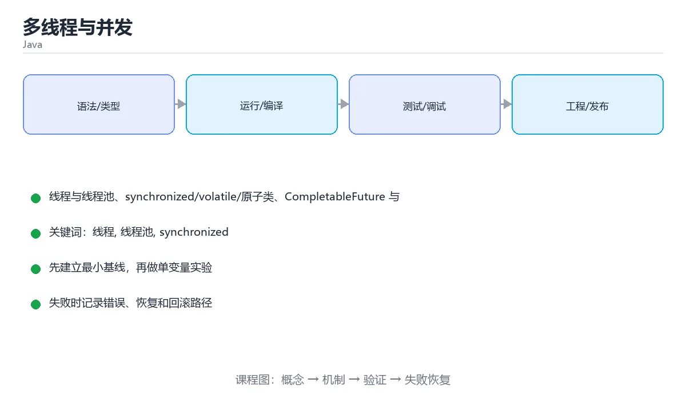

# 多线程与并发



> 内容更新时间：2026-10-03 · 学习阶段：高级 · 预计用时：17 分钟

## 学习目标

- 能用自己的话解释「多线程与并发」解决了什么问题，而不是只背术语。
- 能说清 「线程」、「线程池」、「synchronized」、「volatile」 之间的关系，并分别举出一个例子。
- 能把本课知识放回「Java」的知识体系，说明它和相邻主题的边界。
- 能完成本课练习，并用验收标准检查自己的结果。

> 一句话摘要：线程与线程池、synchronized/volatile/原子类、CompletableFuture 与虚拟线程。

## 前置知识

- 先完成上一课《Lambda 与 Stream API》；如果已经掌握，可以直接用本课练习自测。
- 本课阶段：高级。建议具备同一方向的完整基础，能阅读较长的代码、配置或系统设计说明。
- 开始前先复习：线程、线程池、synchronized。
- 如果某一步看不懂，先记录具体卡点，完成练习后再回头读一遍。


## 创建线程

```java
// 方式一：实现 Runnable（推荐，组合优于继承）
Runnable task = () -> System.out.println("运行在 " + Thread.currentThread().getName());
Thread thread = new Thread(task);
thread.start();
thread.join();                 // 等待结束

// 方式二：线程池提交任务
ExecutorService pool = Executors.newFixedThreadPool(4);
Future<Integer> future = pool.submit(() -> 1 + 1);
System.out.println(future.get());
pool.shutdown();
```

## 共享状态与同步

```java
class Counter {
    private int count = 0;

    public synchronized void increase() { count++; }   // 方法级同步

    public int get() { return count; }
}

// 显式锁
private final ReentrantLock lock = new ReentrantLock();
public void increase2() {
    lock.lock();
    try { count++; } finally { lock.unlock(); }
}
```

`volatile` 保证可见性与有序性，但**不保证原子性**，`count++` 仍需加锁或改用 `AtomicInteger`。

```java
private final AtomicInteger atomicCount = new AtomicInteger();
atomicCount.incrementAndGet();
```

## 并发工具类

```java
ConcurrentHashMap<String, Integer> cache = new ConcurrentHashMap<>();
cache.computeIfAbsent("key", k -> 1);

CountDownLatch latch = new CountDownLatch(3);
latch.countDown();
latch.await();
```

## CompletableFuture 组合异步任务

```java
CompletableFuture<String> future = CompletableFuture
        .supplyAsync(() -> "结果")
        .thenApply(String::toUpperCase)
        .thenCompose(s -> CompletableFuture.completedFuture(s + "!"))
        .exceptionally(e -> "失败：" + e.getMessage());

System.out.println(future.join());
```

## Java 内存模型要点

- 每个线程有自己的工作内存，共享变量读写可能看不到最新值。
- `synchronized` 与 `volatile` 建立 happens-before 关系，保证可见性。
- 死锁的四个条件与避免方式（统一加锁顺序）同样适用。

## 虚拟线程（Java 21+）

```java
try (var executor = Executors.newVirtualThreadPerTaskExecutor()) {
    for (int i = 0; i < 10_000; i++) {
        executor.submit(() -> {
            Thread.sleep(1000);          // 阻塞不再是问题：虚拟线程自动让出载体线程
            return null;
        });
    }
}
```

虚拟线程极轻量，适合高并发 IO 场景，不需要再为了吞吐写复杂的异步回调。

## 线程池参数与常见故障

| 参数 | 含义 | 设置建议 |
| --- | --- | --- |
| corePoolSize | 常驻核心线程数 | 按 CPU 核数与任务类型定（CPU 密集 ≈ 核数，IO 密集可更大） |
| maximumPoolSize | 最大线程数 | 有界队列时才有意义，避免无限扩张 |
| keepAliveTime | 空闲线程存活时间 | 配合 allowCoreThreadTimeOut |
| workQueue | 任务队列 | **必须用有界队列**，无界队列会掩盖过载直到 OOM |
| threadFactory | 线程创建 | 起有意义的线程名，便于排查 |
| rejectedExecutionHandler | 拒绝策略 | 优先 CallerRunsPolicy（自带背压）或自定义降级 |

**四种拒绝策略**：AbortPolicy（抛异常，默认）、CallerRunsPolicy（调用者执行，天然背压）、DiscardPolicy（静默丢弃，慎用）、DiscardOldestPolicy（丢弃最旧任务）。

**常见故障与排查**：① 队列无界导致任务堆积、内存暴涨；② 线程池被慢任务占满（下游超时未设），表现为所有请求排队；③ 父子任务共用同一个池导致死锁（父等待子，子排队）；④ 线程泄漏（线程名不带业务标识，无法定位来源）。排查手段：`jstack` 看线程状态与堆栈、`ThreadPoolExecutor` 的 getActiveCount/getQueue.size 打点监控。

## 本课小结
并发三件事：**可见性（volatile/synchronized）、原子性（锁/原子类）、有序性（happens-before）**。业务代码优先用线程池与 CompletableFuture，别手动 new Thread。


## 并发工具选型速查

| 需求 | 推荐工具 | 说明 |
| --- | --- | --- |
| 简单互斥 | `synchronized` | 语法内置，自动释放 |
| 需要超时 / 可中断 / 公平 | `ReentrantLock` | 记得在 `finally` 中 `unlock()` |
| 读多写少 | `ReentrantReadWriteLock` | 读并发，写互斥 |
| 原子计数 | `AtomicInteger` / `LongAdder` | 高并发下 `LongAdder` 吞吐更好 |
| 线程安全 Map | `ConcurrentHashMap` | 用 `computeIfAbsent` 做原子初始化 |
| 任务执行 | `ThreadPoolExecutor` | 明确核心数、队列与拒绝策略 |
| 定时任务 | `ScheduledExecutorService` | 别用 `Timer`（单线程、异常即终止） |
| 结果聚合 | `CompletableFuture` | 组合多个异步任务 |
| 线程间协作 | `CountDownLatch` / `CyclicBarrier` | 一等一等多、循环复用 |
| 限流 | `Semaphore` | 控制同时访问的线程数 |

线程池参数速查：

| 参数 | 含义 | 设置建议 |
| --- | --- | --- |
| `corePoolSize` | 常驻线程数 | 按 QPS 与单任务耗时估算 |
| `maximumPoolSize` | 最大线程数 | CPU 密集 ≈ 核数；IO 密集可放大 |
| `keepAliveTime` | 空闲回收时间 | 结合流量波动设置 |
| `workQueue` | 任务队列 | **必须有界**，否则容易内存溢出 |
| `threadFactory` | 线程命名 | 命名便于排查（如 `order-pool-1`） |
| `handler` | 拒绝策略 | 用 `CallerRunsPolicy` 做背压，或自定义记录后降级 |

```java
// 手动创建线程池：参数明确，便于定位问题
ExecutorService pool = new ThreadPoolExecutor(
        8, 32, 60L, TimeUnit.SECONDS,
        new ArrayBlockingQueue<>(1000),
        new ThreadFactory() {
            private final AtomicInteger seq = new AtomicInteger();
            @Override
            public Thread newThread(Runnable r) {
                return new Thread(r, "order-pool-" + seq.incrementAndGet());
            }
        },
        new ThreadPoolExecutor.CallerRunsPolicy());
```

## 常见错误对照表

| 容易写错的做法 | 实际现象 | 原因与正确做法 |
| --- | --- | --- |
| `Executors.newFixedThreadPool(...)` | 队列无界，任务堆积导致 OOM | 手动 `ThreadPoolExecutor` 并指定有界队列 |
| `count++` 多线程自增 | 结果偏小 | 用 `AtomicInteger.incrementAndGet()` 或加锁 |
| 用 `volatile` 做自增 | 仍然丢失更新 | `volatile` 只保证可见性，不保证复合操作原子性 |
| 双重检查锁忘记 `volatile` | 可能拿到半初始化对象 | 单例用静态内部类或枚举更稳 |
| `synchronized` 锁 `String` 常量 | 全局串扰，性能极差 | 用专用 `private final Object lock = new Object()` |
| 有嵌套锁且加锁顺序不一致 | 死锁 | 统一加锁顺序，或用带超时的 `tryLock` |
| 在 `finally` 之外 `unlock()` | 异常时锁不释放 | `lock(); try { ... } finally { lock.unlock(); }` |
| `CompletableFuture` 里抛异常 | 结果被吞，日志无痕 | 用 `exceptionally` / `handle` 处理，或 `join` 抛出 |
| 在异步任务里访问请求上下文 | `NullPointerException` | 上下文不跨线程传递，需显式传参 |
| 忘记关闭线程池 | 进程无法退出、线程泄漏 | 用 `try/finally` 调用 `shutdown` + `awaitTermination` |
| 虚拟线程里跑阻塞的本地锁 | 平台线程被钉住 | 虚拟线程适合 IO 等待，避免长时 `synchronized` |

## 自测清单

- [ ] 能说清 `volatile` 与 `Atomic` 的差别。
- [ ] 线程池一律使用有界队列并明确拒绝策略。
- [ ] 加锁顺序统一，或使用带超时的 `tryLock` 避免死锁。
- [ ] 知道 `ConcurrentHashMap.computeIfAbsent` 的原子语义。
- [ ] 用 `CompletableFuture` 组合异步任务，并处理异常分支。


## 零基础详解：线程、线程池与并发工具

### 一句话说清它是什么

并发就是「同时做几件事」。Java 的做法是：**不要自己 new Thread，而是交给线程池**；
共享数据要加保护，任务之间用 `Future` 或并发集合传递结果。

### 用生活比喻理解

| 概念 | 比喻 | 说明 |
| --- | --- | --- |
| 线程 | 办事窗口 | 每个窗口独立跑一段逻辑 |
| 线程池 | 固定编制的服务组 | 复用线程，避免频繁创建销毁 |
| `synchronized` | 门锁 | 同一时刻只有一个人能进 |
| `volatile` | 公告栏 | 保证可见性，但不保证原子性 |
| `AtomicInteger` | 带计数器的取号机 | 自增是原子的 |
| `Future` | 取件凭条 | 先拿着，稍后凭它取结果 |
| 虚拟线程 | 超轻量临时工 | JDK 21+，适合大量 IO 等待 |

### 从 new Thread 到线程池

```java
// 1. 直接创建：不推荐，难以控制数量
new Thread(() -> System.out.println("跑起来了")).start();

// 2. 线程池：推荐
ExecutorService pool = Executors.newFixedThreadPool(4);
try {
    for (int i = 0; i < 10; i++) {
        int taskId = i;
        pool.submit(() -> System.out.println("任务 " + taskId));
    }
} finally {
    pool.shutdown();                       // 不再接收新任务
    pool.awaitTermination(10, TimeUnit.SECONDS);
}
```

| 创建方式 | 适用场景 | 注意 |
| --- | --- | --- |
| `newFixedThreadPool(n)` | CPU 密集型 | 线程数约等于核心数 |
| `newCachedThreadPool()` | 大量短任务 | 可能无限膨胀，生产慎用 |
| `newScheduledThreadPool(n)` | 定时与周期任务 | 替代 Timer |
| `newVirtualThreadPerTaskExecutor()` | 大量 IO 等待 | JDK 21+，吞吐高 |

### 拿到返回值：Future 与 CompletableFuture

```java
ExecutorService pool = Executors.newFixedThreadPool(2);

Future<Integer> future = pool.submit(() -> {
    Thread.sleep(500);
    return 42;
});
Integer value = future.get(2, TimeUnit.SECONDS);   // 阻塞等待结果

// 组合多个异步任务
CompletableFuture<String> a = CompletableFuture.supplyAsync(() -> "A");
CompletableFuture<String> b = CompletableFuture.supplyAsync(() -> "B");
String combined = a.thenCombine(b, (x, y) -> x + y).join();
System.out.println(combined);                       // AB
```

### 三种保护共享数据的方式

```java
// 1. synchronized：简单可靠
private final Object lock = new Object();
private int count = 0;
void increase() {
    synchronized (lock) { count++; }
}

// 2. 原子类：单变量自增最省事
private final AtomicInteger counter = new AtomicInteger();
void increaseFast() { counter.incrementAndGet(); }

// 3. 显式锁：需要超时或公平策略时用
private final ReentrantLock lock2 = new ReentrantLock();
void doWork() {
    lock2.lock();
    try { /* 临界区 */ } finally { lock2.unlock(); }
}
```

| 工具 | 保护范围 | 什么时候用 |
| --- | --- | --- |
| `volatile` | 单个变量的可见性 | 状态标志位 |
| `AtomicInteger` / `LongAdder` | 单个变量的原子操作 | 计数、累加 |
| `synchronized` | 一段代码或方法 | 需要保护多个变量时 |
| `ReentrantLock` | 一段代码 | 需要超时、可中断、公平 |
| `ConcurrentHashMap` | 并发读写映射 | 多线程共享缓存 |

### 常用并发集合

| 集合 | 特点 |
| --- | --- |
| `ConcurrentHashMap` | 高并发读写，推荐替代 `Hashtable` |
| `CopyOnWriteArrayList` | 读多写极少，写时复制 |
| `BlockingQueue` | 生产者消费者队列，天然阻塞 |
| `ConcurrentLinkedQueue` | 无锁队列，高吞吐 |

### 新手最容易踩的八个坑

| 坑 | 现象 | 正确做法 |
| --- | --- | --- |
| 用 `volatile` 做自增 | 结果偏小 | 用 `AtomicInteger` |
| 手动 new 大量线程 | 内存暴涨、切换频繁 | 用线程池 |
| 忘了 `shutdown` | 程序不退出 | `finally` 中关闭 |
| 在锁里做 IO | 其他线程全被拖住 | 缩小临界区 |
| 两把锁顺序不一致 | 死锁 | 统一加锁顺序 |
| 用 `HashMap` 并发写 | 数据错乱甚至死循环 | 用 `ConcurrentHashMap` |
| 忽略 `Future.get` 异常 | 任务失败被吞 | 捕获并处理 `ExecutionException` |
| 以为并行一定更快 | 小任务反而更慢 | 压测后决定 |

### 手把手练习：并发统计订单金额

```java
import java.util.*;
import java.util.concurrent.*;
import java.util.concurrent.atomic.LongAdder;

public class OrderStats {
    public static void main(String[] args) throws Exception {
        List<Integer> orders = new ArrayList<>();
        for (int i = 1; i <= 1000; i++) orders.add(i);

        LongAdder total = new LongAdder();
        ExecutorService pool = Executors.newFixedThreadPool(4);

        List<Callable<Void>> tasks = new ArrayList<>();
        int chunk = 250;
        for (int start = 0; start < orders.size(); start += chunk) {
            int from = start, to = Math.min(start + chunk, orders.size());
            tasks.add(() -> {
                for (int value : orders.subList(from, to)) total.add(value);
                return null;
            });
        }

        try {
            for (Future<Void> f : pool.invokeAll(tasks)) f.get();
        } finally {
            pool.shutdown();
        }
        System.out.println("订单总额：" + total.sum());
    }
}
```

### 学完自测

- [ ] 能说出为什么推荐线程池而不是直接 new Thread。
- [ ] 知道 `volatile` 与 `AtomicInteger` 的区别。
- [ ] 能说出 `Future` 与 `CompletableFuture` 的差别。
- [ ] 知道 `ConcurrentHashMap` 可以替代哪种老集合。
- [ ] 能说出死锁最常见的成因与避免方法。


## 动手练习

### 练习 1：概念复述（10 分钟）

合上教程，用 3～5 句话解释「多线程与并发」解决什么问题，并写出一个边界条件。

**验收标准**：至少使用一个本课关键词，并给出一个反例。

### 练习 2：示例改写（20 分钟）

从正文选一个最小示例，先预测修改一个输入后的结果，再实际验证并记录差异。

**验收标准**：留下「原例 → 改动 → 预测 → 结果 → 原因」五步记录。

### 练习 3：迁移任务（30 分钟）

写一个可运行的小类，补一个普通测试和一个边界输入测试。

- 至少覆盖「线程」和「线程池」两个关键词。
- 产出一个别人可以检查的结果。
- 写出一个仍不确定的问题和验证方法。


## 考点精讲：把测验题还原成判断过程

本课有 6 个判断点。先自己作答，再看「判断依据」；如果结论正确但理由不完整，回到正文对应章节补足概念。

### 考点 1：volatile 关键字保证了什么？

- **正确判断**：可见性与有序性
- **判断依据**：volatile 保证一个线程的写入对其他线程可见，但不保证复合操作（如 count++）的原子性。其他选项：volatile 只保证可见性与有序性，不保证原子性，所以 count++ 依然会丢失更新。针对「volatile 关键字保证了什么，」，本课在「共享状态与同步」中说明：volatile 保证可见性与有序性，但不保证原子性，count++ 仍需加锁或改用 AtomicInteger。本课还在「本课小结」中说明：并发三件事：可见性（volatile/synchronized）、原子性（锁/原子类）、有序性（happens-before）。
- **迁移检查**：如果给某个错误选项去掉一个限定词，它会不会变成正确？说明理由。

### 考点 2：多个线程对共享计数变量自增导致结果偏小，最佳解决办法是？

- **正确判断**：使用 AtomicInteger 或加锁
- **判断依据**：正确答案是「使用 AtomicInteger 或加锁」，本课在「虚拟线程（Java 21+）」中说明：虚拟线程极轻量，适合高并发 IO 场景，不需要再为了吞吐写复杂的异步回调。自增是读-改-写三步，需要原子类或互斥锁来保证原子性。本课还在「Java 内存模型要点」中说明：每个线程有自己的工作内存，共享变量读写可能看不到最新值。本课还在「Java 内存模型要点」中说明：synchronized 与 volatile 建立 happens-before 关系，保证可见性。
- **迁移检查**：如果给某个错误选项去掉一个限定词，它会不会变成正确？说明理由。

### 考点 3：虚拟线程（Java 21+）最适合哪类任务？

- **正确判断**：高并发 IO 等待
- **判断依据**：正确答案是「高并发 IO 等待」，本课在「虚拟线程（Java 21+）」中说明：虚拟线程极轻量，适合高并发 IO 场景，不需要再为了吞吐写复杂的异步回调。虚拟线程在阻塞时会让出载体线程，极适合大量 IO 等待场景，而不适合纯 CPU 计算。本课还在「线程池参数与常见故障」中说明：② 线程池被慢任务占满（下游超时未设），表现为所有请求排队。本课还在「本课小结」中说明：业务代码优先用线程池与 CompletableFuture，别手动 new Thread。
- **迁移检查**：把题干里的一个条件换成边界值，原来的结论还成立吗？写出判断过程。

### 考点 4：synchronized 与 ReentrantLock 的关系是？

- **正确判断**：synchronized 是语法内置锁
- **判断依据**：正确答案是「synchronized 是语法内置锁」，本课在「Java 内存模型要点」中说明：synchronized 与 volatile 建立 happens-before 关系，保证可见性。简单互斥优先用 synchronized。本课还在「线程池参数与常见故障」中说明：② 线程池被慢任务占满（下游超时未设），表现为所有请求排队。本课还在「零基础详解：线程、线程池与并发工具」中说明：Java 的做法是：不要自己 new Thread，而是交给线程池。
- **迁移检查**：遮住选项，只根据定义复述一次答案，再回来看哪个选项与复述一致。

### 考点 5：使用线程池相比直接 new Thread 的优势是？

- **正确判断**：复用线程，限制并发规模
- **判断依据**：正确答案是「复用线程，限制并发规模」，本课在「本课小结」中说明：业务代码优先用线程池与 CompletableFuture，别手动 new Thread。务必使用有界队列与合适的拒绝策略，避免任务无限堆积导致内存溢出。本课还在「零基础详解：线程、线程池与并发工具」中说明：能说出为什么推荐线程池而不是直接 new Thread。本课还在「本课小结」中说明：并发三件事：可见性（volatile/synchronized）、原子性（锁/原子类）、有序性（happens-before）。
- **迁移检查**：遮住选项，只根据定义复述一次答案，再回来看哪个选项与复述一致。

### 考点 6：补全代码：「多线程与并发」示例中，下面这行代码缺少哪个关键字或函数名？请填入 ____。 `ExecutorService pool = Executors.____(4);`

- **正确判断**：newFixedThreadPool / newfixedthreadpool
- **判断依据**：正确答案是「newFixedThreadPool」，本课在「线程池参数与常见故障」中说明：④ 线程泄漏（线程名不带业务标识，无法定位来源）。本课还在「线程池参数与常见故障」中说明：排查手段：jstack 看线程状态与堆栈、ThreadPoolExecutor 的 getActiveCount/getQueue.size 打点监控。本课还在「零基础详解：线程、线程池与并发工具」中说明：知道 volatile 与 AtomicInteger 的区别。
- **迁移检查**：如果填成相近的另一个函数或关键字，程序会在哪一步出错？

## 本课复习清单

离开本课前，逐项确认：

- [ ] 不看解析，能说出「volatile 关键字保证了什么？」的判断依据。
- [ ] 不看解析，能说出「多个线程对共享计数变量自增导致结果偏小，最佳解决办法是？」的判断依据。
- [ ] 不看解析，能说出「虚拟线程（Java 21+）最适合哪类任务？」的判断依据。
- [ ] 不看解析，能说出「synchronized 与 ReentrantLock 的关系是？」的判断依据。
- [ ] 不看解析，能说出「使用线程池相比直接 new Thread 的优势是？」的判断依据。
- [ ] 不看解析，能说出「补全代码：「多线程与并发」示例中，下面这行代码缺少哪个关键字或函数名？请填入 _…」的判断依据。
- [ ] 至少运行一次本课示例，记录输入、输出和一个边界情况。
- [ ] 把本课最容易混淆的两个概念写成一句话对照。

| 复盘项 | 记录 |
| --- | --- |
| 已经能独立解释的考点 |  |
| 仍然说不清的概念 |  |
| 下一步验证动作 |  |

## 术语速查

把本课反复出现的术语集中放在一起。复习时先遮住右列，尝试用自己的话解释，再回到正文核对。

| 术语 | 本课语境 |
| --- | --- |
| `volatile` | `volatile` 保证可见性与有序性，但**不保证原子性**，`count++` 仍需加锁或改用 `AtomicInteger`。 |
| `count++` | `volatile` 保证可见性与有序性，但**不保证原子性**，`count++` 仍需加锁或改用 `AtomicInteger`。 |
| `AtomicInteger` | `volatile` 保证可见性与有序性，但**不保证原子性**，`count++` 仍需加锁或改用 `AtomicInteger`。 |
| `synchronized` | `synchronized` 与 `volatile` 建立 happens-before 关系，保证可见性。 |
| `jstack` | 常见故障与排查**：① 队列无界导致任务堆积、内存暴涨；② 线程池被慢任务占满（下游超时未设），表现为所有请求排队；③ 父子任务共用同一个池导致死锁（父等待子，子排队）；④ 线程泄漏（线程名不带业务标识，无法定位来源）。… |
| `ThreadPoolExecutor` | 常见故障与排查**：① 队列无界导致任务堆积、内存暴涨；② 线程池被慢任务占满（下游超时未设），表现为所有请求排队；③ 父子任务共用同一个池导致死锁（父等待子，子排队）；④ 线程泄漏（线程名不带业务标识，无法定位来源）。… |
| `ReentrantLock` | \| 需要超时 / 可中断 / 公平 \| `ReentrantLock` \| 记得在 `finally` 中 `unlock()` \| |
| `finally` | \| 需要超时 / 可中断 / 公平 \| `ReentrantLock` \| 记得在 `finally` 中 `unlock()` \| |
| `unlock()` | \| 需要超时 / 可中断 / 公平 \| `ReentrantLock` \| 记得在 `finally` 中 `unlock()` \| |
| `ReentrantReadWriteLock` | \| 读多写少 \| `ReentrantReadWriteLock` \| 读并发，写互斥 \| |
| `LongAdder` | \| 原子计数 \| `AtomicInteger` / `LongAdder` \| 高并发下 `LongAdder` 吞吐更好 \| |
| `ConcurrentHashMap` | \| 线程安全 Map \| `ConcurrentHashMap` \| 用 `computeIfAbsent` 做原子初始化 \| |

## 面试问答与自测

下面把本课考点换成面试追问。先口述自己的答案，
再对照参考回答检查是否遗漏了前提、边界或失败路径。

### 追问 1：volatile 关键字保证了什么？

**参考回答**：volatile 保证一个线程的写入对其他线程可见，但不保证复合操作（如 count++）的原子性。其他选项：volatile 只保证可见性与有序性，不保证原子性，所以 count++ 依然会丢失更新。针对「volatile 关键字保证了什么，」，本课在「共享状态与同步」中说明：volatile 保证可见性与有序性，但不保证原子性，count++ 仍需加锁或改用 AtomicInteger。本课还在「本课小结」中说明：并发三件事：可见性（volatile/synchronized）、原子性（锁/原子类）、有序性（happens-before）。

### 追问 2：多个线程对共享计数变量自增导致结果偏小，最佳解决办法是？

**参考回答**：正确答案是「使用 AtomicInteger 或加锁」，本课在「虚拟线程（Java 21+）」中说明：虚拟线程极轻量，适合高并发 IO 场景，不需要再为了吞吐写复杂的异步回调。自增是读-改-写三步，需要原子类或互斥锁来保证原子性。本课还在「Java 内存模型要点」中说明：每个线程有自己的工作内存，共享变量读写可能看不到最新值。本课还在「Java 内存模型要点」中说明：synchronized 与 volatile 建立 happens-before 关系，保证可见性。

### 追问 3：虚拟线程（Java 21+）最适合哪类任务？

**参考回答**：正确答案是「高并发 IO 等待」，本课在「虚拟线程（Java 21+）」中说明：虚拟线程极轻量，适合高并发 IO 场景，不需要再为了吞吐写复杂的异步回调。虚拟线程在阻塞时会让出载体线程，极适合大量 IO 等待场景，而不适合纯 CPU 计算。本课还在「线程池参数与常见故障」中说明：② 线程池被慢任务占满（下游超时未设），表现为所有请求排队。本课还在「本课小结」中说明：业务代码优先用线程池与 CompletableFuture，别手动 new Thread。

### 追问 4：synchronized 与 ReentrantLock 的关系是？

**参考回答**：正确答案是「synchronized 是语法内置锁」，本课在「Java 内存模型要点」中说明：synchronized 与 volatile 建立 happens-before 关系，保证可见性。简单互斥优先用 synchronized。本课还在「线程池参数与常见故障」中说明：② 线程池被慢任务占满（下游超时未设），表现为所有请求排队。本课还在「零基础详解·线程、线程池与并发工具」中说明：Java 的做法是：不要自己 new Thread，而是交给线程池。

### 追问 5：使用线程池相比直接 new Thread 的优势是？

**参考回答**：正确答案是「复用线程，限制并发规模」，本课在「本课小结」中说明：业务代码优先用线程池与 CompletableFuture，别手动 new Thread。务必使用有界队列与合适的拒绝策略，避免任务无限堆积导致内存溢出。本课还在「零基础详解·线程、线程池与并发工具」中说明：能说出为什么推荐线程池而不是直接 new Thread。本课还在「本课小结」中说明：并发三件事：可见性（volatile/synchronized）、原子性（锁/原子类）、有序性（happens-before）。

## English Overview

**Title:** Concurrency

**Summary:** Threads, pools, synchronization, CompletableFuture, virtual threads.

**Category:** Java  
**Level:** 高级  
**Key terms:** 线程, 线程池, synchronized, volatile, AtomicInteger, 虚拟线程

> The full tutorial is written in Chinese. This bilingual overview helps English readers identify the topic, scope and key terms before studying the detailed examples.

## 内容元数据

- 内容版本：v2.0
- 最后更新：2026-10-03
- 学习阶段：高级
- 适用环境：Java 21+ / Maven 或 Gradle
- 内容来源：内置结构化课程与工程实践整理
- 相关主题：线程、线程池、synchronized、volatile、AtomicInteger、虚拟线程
- 质量版本：P0 测验标准 + P1 覆盖扩展 + P2 体验补全


## Full English Study Guide

### Overview

**Concurrency** focuses on Threads, pools, synchronization, CompletableFuture, virtual threads.

### Learning Outcomes

- Explain what **Concurrency** solves and when it should be used.
- Identify inputs, outputs, state and failure boundaries.
- Build a minimal reproducible example and observe the real result.
- Test normal, boundary and failure paths.
- Measure performance, resource cost or security impact before optimizing.
- Document the decision, rollback path and remaining uncertainty.

### Core Mental Model

1. **Problem first:** define the exact problem before choosing a tool or pattern.
2. **Smallest example:** reduce the system to one input and one observable output.
3. **State and flow:** trace how data, control or responsibility moves through the system.
4. **Boundaries:** identify invalid input, resource limits, timeouts and permission edges.
5. **Evidence:** use tests, logs, metrics or reproductions instead of intuition.
6. **Trade-offs:** compare correctness, latency, cost, complexity and operability.

### Step-by-step Study Plan

1. Read the Chinese lesson once and write down the main problem in one sentence.
2. Run the smallest example and save the exact command and output.
3. Change only one input or parameter and predict the result before running it.
4. Introduce one failure and record how the system detects, reports and recovers.
5. Write one test or checklist item for the normal, boundary and failure paths.
6. Complete the quiz and explain every wrong answer in your own words.

### Practice Tasks

- Rebuild the minimal example from an empty directory.
- Add one boundary test and one failure test.
- Produce a short report containing the baseline, change, result and rollback.

### Common Failure Modes

- Treating a happy-path demo as production readiness.
- Skipping boundary values and invalid inputs.
- Optimizing before establishing a measurable baseline.
- Hiding errors, permissions or resource limits.

### Self-check Questions

1. What is the smallest observable result that proves this lesson works?
2. What input or state is most likely to break it?
3. Which metric or test would reveal a regression?
4. What is the rollback path?
5. What is the cost of using this approach at 10x scale?
6. Which adjacent topic is most often confused with this one?

### Glossary

- Topic: **Concurrency**
- Related terms: 线程, 线程池, synchronized, volatile
- Primary evidence: command output, tests, logs, metrics or reproductions

> This guide is an English study companion for the detailed Chinese lesson. It covers the learning path, mental model and acceptance questions; code examples and engineering details remain in the main tutorial.


## Bilingual Section Outline

| 中文小节 | English section |
| --- | --- |
| 学习目标 | Learning Objectives |
| 前置知识 | Pre-knowledge |
| 创建线程 | Create thread |
| 共享状态与同步 | Sharing status and synchronization |
| 并发工具类 | Concurrent Tools Class |
| CompletableFuture 组合异步任务 | CompletableFuture Combined Asynchronous Task |
| Java 内存模型要点 | Java Memory Model Essentials |
| 虚拟线程（Java 21+） | Virtual Thread (Java 21 +) |
| 线程池参数与常见故障 | Thread Pool Parameters and Common Faults |
| 本课小结 | Lesson Summary |

> 该大纲把每个中文小节映射为英文标题，配合 Full English Study Guide 使用。


## 参考资料与复核

- 最后复核：2026-10-04
- 下次复核：2027-04-04
- 复核范围：版本兼容、API 行为、安全建议与工程实践
- 来源性质：官方文档与标准；本课正文为离线教学重组，不复制原文

| 参考资料 | 本课用途 |
| --- | --- |
| [Java SE API](https://docs.oracle.com/en/java/javase/) | 语言、标准库与 JVM |
| [dev.java](https://dev.java/learn/) | 现代 Java 官方教程 |

> 本课主题：线程与线程池、synchronized/volatile/原子类、CompletableFuture 与虚拟线程。

> App 完全离线展示文字链接，不会自动联网；需要延伸阅读时可复制链接到浏览器。
