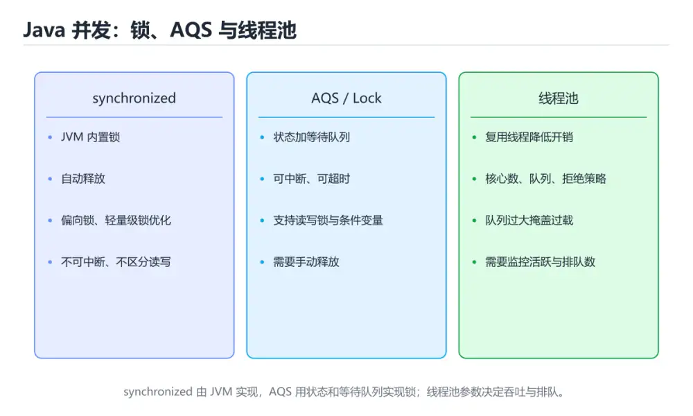

# 多线程与并发




> 内容更新时间：2026-10-06 · 学习阶段：高级 · 预计用时：55 分钟

## 本节知识框架

**课程定位**：所属分类为「Java」，课程主题为「多线程与并发」，学习阶段为「高级」，建议用时 55 分钟。

**本课要解决的主问题**：线程与线程池、synchronized/volatile/原子类、CompletableFuture 与虚拟线程。

| 学习层次 | 要回答的问题 | 完成判据 |
| --- | --- | --- |
| 概念层 | 「多线程与并发」有哪些必须区分的对象与术语？ | 能用自己的话定义核心术语，并各举一个正例和一个反例。 |
| 机制层 | 这些对象按什么顺序发生作用，输入如何变成输出？ | 能画出或写出机制步骤，并说明每一步的失败条件。 |
| 应用层 | 什么场景适合使用「多线程与并发」，什么场景不适合？ | 能给出一个真实场景、一个最小示例和一个边界案例。 |
| 性能层 | 时间、空间、吞吐或延迟受哪些量影响？ | 能说出复杂度或性能瓶颈的证据来源；没有证据时明确写“材料未提供”。 |
| 复习层 | 怎样确认自己不是只记住了结论？ | 能独立完成本课自测，并把错误定位到概念、机制、示例或边界。 |

### 阅读路线

1. 先读「核心概念定义」，建立「线程」等对象的精确定义。
2. 再读「原理与运行机制」，把定义串成可重复的过程。
3. 用「代码/协议/SQL 示例」验证过程，并只改一个条件观察结果变化。
4. 最后检查性能、易错点、知识关系与自测题，形成可复习的证据链。

**前置知识**：《Lambda 与 Stream API》

**学习位置**：本课位于《构建、测试与生态》之后；如果前一课的自测不能通过，应先回补再继续。

**后续衔接**：下一课《实战：Spring Boot REST API》会继续使用本课术语，学完后建议立即完成一次自测。

**教材衔接：学习目标**

- 能用自己的话解释多线程与并发解决了什么问题，而不是只背术语。
- 能说清 「线程」、「线程池」、「synchronized」、「volatile」 之间的关系，并分别举出一个例子。
- 能把 线程 放回「多线程与并发」的知识体系，说明它和 线程池 的边界。
- 能完成本课练习，并用验收标准检查自己的结果。

> 一句话摘要：线程与线程池、synchronized/volatile/原子类、CompletableFuture 与虚拟线程。

**教材衔接：前置知识**

- 先完成上一课《Lambda 与 Stream API》；如果已经掌握，可以直接用本课练习自测。
- 开始前先复习：线程、线程池、synchronized。
- 如果 创建线程 这一步看不懂，先记录具体卡点，再用 ExecutorService 复现一遍。

**教材衔接：本课小结**

并发三件事：**可见性（volatile/synchronized）、原子性（锁/原子类）、有序性（happens-before）**。业务代码优先用线程池与 CompletableFuture，别手动 new Thread。

## 核心概念定义

> 阅读约定：本课先给「多线程与并发」相关术语的操作性定义与适用边界；正文里的口语化说法与定义冲突时，以定义和可复现示例为准。

| 术语 | 操作性定义 | 本课中的边界 |
| --- | --- | --- |
| 线程 | 操作系统调度的执行单元，同一进程内的线程共享地址空间和大部分资源。 | 仅在「多线程与并发」明确给出的输入、版本与资源条件下成立。 |
| 线程池 | 复用固定数量线程处理任务，避免频繁创建销毁，并需要定义队列和拒绝策略。 | 仅在「多线程与并发」明确给出的输入、版本与资源条件下成立。 |
| synchronized | 并发三件事：可见性（volatile/synchronized）、原子性（锁/原子类）、有序性（happens-before）。 | 仅在「多线程与并发」明确给出的输入、版本与资源条件下成立。 |
| AtomicInteger | volatile 保证可见性与有序性，但不保证原子性，count++ 仍需加锁或改用 AtomicInteger。 | 仅在「多线程与并发」明确给出的输入、版本与资源条件下成立。 |
| 虚拟线程 | 虚拟线程、记录模式、结构化并发与分代 ZGC 是升级收益最大的部分。 | 仅在「多线程与并发」明确给出的输入、版本与资源条件下成立。 |
| 内存模型 | 编程语言或硬件对多线程读写可见性、原子性和重排序给出的规则集合 | 仅在「多线程与并发」明确给出的输入、版本与资源条件下成立。 |

### 定义如何使用

在「多线程与并发」中判断一个说法是否成立，先确认它使用的是哪个对象的定义，再检查输入规模、运行环境与失败路径。定义不是口号，而是后续推导、代码示例和自测题共享的约束。

**教材衔接：Java 内存模型要点**

- 每个线程有自己的工作内存，共享变量读写可能看不到最新值。
- `synchronized` 与 `volatile` 建立 happens-before 关系，保证可见性。
- 死锁的四个条件与避免方式（统一加锁顺序）同样适用。

## 原理与运行机制

### 机制总览

1. **建立输入**：把「线程」按本课定义整理成可观察、可重复的输入条件。
2. **执行转换**：围绕「线程池」执行本课的核心步骤；每一步都记录中间状态，避免只看最终输出。
3. **产生输出**：得到「synchronized」后，用正文示例或协议/SQL 结果核对输出是否符合预期。
4. **改变一个条件**：只替换一个边界条件或环境参数，观察「多线程与并发」的结论是否仍然成立。

| 阶段 | 关注对象 | 失败时应检查 |
| --- | --- | --- |
| 输入 | 线程 | 类型、范围、编码、版本或前置状态是否满足定义。 |
| 处理 | 线程池 | 顺序、可见性、锁、路由、事务或调度规则是否被破坏。 |
| 输出 | synchronized | 结果是否可复现，错误是否被正确传播而不是被吞掉。 |

本课的机制结论要用「多线程与并发」自己的示例验证。「多线程与并发」没有给出某个数量级、吞吐或内存数据时，本课把该判断标为“材料未提供”，不从相邻主题外推。

**教材衔接：版本与时效**

- 先确认运行环境是 Java 21 还是 25，再决定 ExecutorService 能否使用新语法。
- 虚拟线程与结构化并发对 线程 的影响最大，升级前先确认线程模型。
- 升级前先用 ExecutorService 建立基线：记录版本、命令和输出，升级后只比较这些可观察量。

### 升级检查清单

- 先固定当前版本，跑通全部示例与测验，再升级工具链。
- 升级时只动一个依赖版本，用 ExecutorService 记录构建与运行结果。
- 回归范围锁定 ExecutorService 的默认行为，并确认弃用警告是否出现在构建输出里。
- 升级完成后记录 线程 的新旧版本差异，并据此调整下次复核时间。

## 典型应用场景

| 场景 | 典型输入或前提 | 期望产物 |
| --- | --- | --- |
| 学习验证 | 使用本课最小示例和 线程、线程池 | 能复现正文结论，并解释每一步。 |
| 工程落地 | 把「多线程与并发」放入真实模块或服务边界 | 输出可观测、失败可定位、参数可配置。 |
| 故障排查 | 只改一个版本、规模、输入或依赖条件 | 能区分概念错误、实现错误和环境差异。 |

判断「多线程与并发」的场景是否成立，标准是能否写出输入、处理、输出和失败路径；材料中没有出现的数据在本课标注为“材料未提供”，不用推测替代证据。

**课程内置实验入口**：`sandbox:java`，用于动手验证《多线程与并发》的机制；实验结论不替代概念定义与复杂度分析。

## 代码/协议/SQL 示例

### 最小可验证示例

下面保留《多线程与并发》原文中的最小示例。先预测《多线程与并发》示例的输出，再按正文步骤运行或推演；示例依赖外部环境时，同时记录版本与输入。

```java
// 方式一：实现 Runnable（推荐，组合优于继承）
Runnable task = () -> System.out.println("运行在 " + Thread.currentThread().getName());
Thread thread = new Thread(task);
thread.start();
thread.join();                 // 等待结束

// 方式二：线程池提交任务
ExecutorService pool = Executors.newFixedThreadPool(4);
Future<Integer> future = pool.submit(() -> 1 + 1);
System.out.println(future.get());
pool.shutdown();
```

**教材衔接：创建线程**

```java
// 方式一：实现 Runnable（推荐，组合优于继承）
Runnable task = () -> System.out.println("运行在 " + Thread.currentThread().getName());
Thread thread = new Thread(task);
thread.start();
thread.join();                 // 等待结束

// 方式二：线程池提交任务
ExecutorService pool = Executors.newFixedThreadPool(4);
Future<Integer> future = pool.submit(() -> 1 + 1);
System.out.println(future.get());
pool.shutdown();
```

**教材衔接：共享状态与同步**

```java
class Counter {
    private int count = 0;

    public synchronized void increase() { count++; }   // 方法级同步

    public int get() { return count; }
}

// 显式锁
private final ReentrantLock lock = new ReentrantLock();
public void increase2() {
    lock.lock();
    try { count++; } finally { lock.unlock(); }
}
```

`volatile` 保证可见性与有序性，但**不保证原子性**，`count++` 仍需加锁或改用 `AtomicInteger`。

```java
private final AtomicInteger atomicCount = new AtomicInteger();
atomicCount.incrementAndGet();
```

**教材衔接：CompletableFuture 组合异步任务**

```java
CompletableFuture<String> future = CompletableFuture
        .supplyAsync(() -> "结果")
        .thenApply(String::toUpperCase)
        .thenCompose(s -> CompletableFuture.completedFuture(s + "!"))
        .exceptionally(e -> "失败：" + e.getMessage());

System.out.println(future.join());
```

**教材衔接：虚拟线程（Java 21+）**

```java
try (var executor = Executors.newVirtualThreadPerTaskExecutor()) {
    for (int i = 0; i < 10_000; i++) {
        executor.submit(() -> {
            Thread.sleep(1000);          // 阻塞不再是问题：虚拟线程自动让出载体线程
            return null;
        });
    }
}
```

虚拟线程极轻量，适合高并发 IO 场景，不需要再为了吞吐写复杂的异步回调。

## 时间/空间复杂度或性能分析

**复杂度证据**：「多线程与并发」的现有材料没有给出渐近时间或空间复杂度的明确结论，本课只做定性检查，不补写未经验证的 $O$ 记号。

| 维度 | 本课关注点 | 判断依据 |
| --- | --- | --- |
| 时间/延迟 | 「多线程与并发」的主要步骤是否会随输入规模、并发度或网络往返增长。 | 以正文复杂度、基准数据或可重复测量为准。 |
| 空间/内存 | 中间状态、缓存、副本、连接或索引是否随规模增长。 | 记录峰值内存与数据副本，不只看最终结果。 |
| 吞吐/资源 | 版本、调度、锁、IO、序列化或协议开销是否成为瓶颈。 | 固定环境做对照实验，改变一个变量。 |

评估「多线程与并发」时要区分“正确性成立”和“性能达标”两件事；材料没有给出基准时，本课只保留量级来源与测量方法，不写不可验证的绝对数字。

**教材衔接：并发工具类**

```java
ConcurrentHashMap<String, Integer> cache = new ConcurrentHashMap<>();
cache.computeIfAbsent("key", k -> 1);

CountDownLatch latch = new CountDownLatch(3);
latch.countDown();
latch.await();
```

**教材衔接：并发工具选型速查**

| 需求 | 推荐工具 | 说明 |
| --- | --- | --- |
| 简单互斥 | `synchronized` | 语法内置，自动释放 |
| 需要超时 / 可中断 / 公平 | `ReentrantLock` | 记得在 `finally` 中 `unlock()` |
| 读多写少 | `ReentrantReadWriteLock` | 读并发，写互斥 |
| 原子计数 | `AtomicInteger` / `LongAdder` | 高并发下 `LongAdder` 吞吐更好 |
| 线程安全 Map | `ConcurrentHashMap` | 用 `computeIfAbsent` 做原子初始化 |
| 任务执行 | `ThreadPoolExecutor` | 明确核心数、队列与拒绝策略 |
| 定时任务 | `ScheduledExecutorService` | 别用 `Timer`（单线程、异常即终止） |
| 结果聚合 | `CompletableFuture` | 组合多个异步任务 |
| 线程间协作 | `CountDownLatch` / `CyclicBarrier` | 一等一等多、循环复用 |
| 限流 | `Semaphore` | 控制同时访问的线程数 |

线程池参数速查：

| 参数 | 含义 | 设置建议 |
| --- | --- | --- |
| `corePoolSize` | 常驻线程数 | 按 QPS 与单任务耗时估算 |
| `maximumPoolSize` | 最大线程数 | CPU 密集 ≈ 核数；IO 密集可放大 |
| `keepAliveTime` | 空闲回收时间 | 结合流量波动设置 |
| `workQueue` | 任务队列 | **必须有界**，否则容易内存溢出 |
| `threadFactory` | 线程命名 | 命名便于排查（如 `order-pool-1`） |
| `handler` | 拒绝策略 | 用 `CallerRunsPolicy` 做背压，或自定义记录后降级 |

```java
// 手动创建线程池：参数明确，便于定位问题
ExecutorService pool = new ThreadPoolExecutor(
        8, 32, 60L, TimeUnit.SECONDS,
        new ArrayBlockingQueue<>(1000),
        new ThreadFactory() {
            private final AtomicInteger seq = new AtomicInteger();
            @Override
            public Thread newThread(Runnable r) {
                return new Thread(r, "order-pool-" + seq.incrementAndGet());
            }
        },
        new ThreadPoolExecutor.CallerRunsPolicy());
```

**教材衔接：零基础详解：线程、线程池与并发工具**

### 一句话说清它是什么

并发就是「同时做几件事」。Java 的做法是：**不要自己 new Thread，而是交给线程池**；
共享数据要加保护，任务之间用 `Future` 或并发集合传递结果。

### 用生活比喻理解

| 概念 | 比喻 | 说明 |
| --- | --- | --- |
| 线程 | 办事窗口 | 每个窗口独立跑一段逻辑 |
| 线程池 | 固定编制的服务组 | 复用线程，避免频繁创建销毁 |
| `synchronized` | 门锁 | 同一时刻只有一个人能进 |
| `volatile` | 公告栏 | 保证可见性，但不保证原子性 |
| `AtomicInteger` | 带计数器的取号机 | 自增是原子的 |
| `Future` | 取件凭条 | 先拿着，稍后凭它取结果 |
| 虚拟线程 | 超轻量临时工 | JDK 21+，适合大量 IO 等待 |

### 从 new Thread 到线程池

```java
// 1. 直接创建：不推荐，难以控制数量
new Thread(() -> System.out.println("跑起来了")).start();

// 2. 线程池：推荐
ExecutorService pool = Executors.newFixedThreadPool(4);
try {
    for (int i = 0; i < 10; i++) {
        int taskId = i;
        pool.submit(() -> System.out.println("任务 " + taskId));
    }
} finally {
    pool.shutdown();                       // 不再接收新任务
    pool.awaitTermination(10, TimeUnit.SECONDS);
}
```

| 创建方式 | 适用场景 | 注意 |
| --- | --- | --- |
| `newFixedThreadPool(n)` | CPU 密集型 | 线程数约等于核心数 |
| `newCachedThreadPool()` | 大量短任务 | 可能无限膨胀，生产慎用 |
| `newScheduledThreadPool(n)` | 定时与周期任务 | 替代 Timer |
| `newVirtualThreadPerTaskExecutor()` | 大量 IO 等待 | JDK 21+，吞吐高 |

### 拿到返回值：Future 与 CompletableFuture

```java
ExecutorService pool = Executors.newFixedThreadPool(2);

Future<Integer> future = pool.submit(() -> {
    Thread.sleep(500);
    return 42;
});
Integer value = future.get(2, TimeUnit.SECONDS);   // 阻塞等待结果

// 组合多个异步任务
CompletableFuture<String> a = CompletableFuture.supplyAsync(() -> "A");
CompletableFuture<String> b = CompletableFuture.supplyAsync(() -> "B");
String combined = a.thenCombine(b, (x, y) -> x + y).join();
System.out.println(combined);                       // AB
```

### 三种保护共享数据的方式

```java
// 1. synchronized：简单可靠
private final Object lock = new Object();
private int count = 0;
void increase() {
    synchronized (lock) { count++; }
}

// 2. 原子类：单变量自增最省事
private final AtomicInteger counter = new AtomicInteger();
void increaseFast() { counter.incrementAndGet(); }

// 3. 显式锁：需要超时或公平策略时用
private final ReentrantLock lock2 = new ReentrantLock();
void doWork() {
    lock2.lock();
    try { /* 临界区 */ } finally { lock2.unlock(); }
}
```

| 工具 | 保护范围 | 什么时候用 |
| --- | --- | --- |
| `volatile` | 单个变量的可见性 | 状态标志位 |
| `AtomicInteger` / `LongAdder` | 单个变量的原子操作 | 计数、累加 |
| `synchronized` | 一段代码或方法 | 需要保护多个变量时 |
| `ReentrantLock` | 一段代码 | 需要超时、可中断、公平 |
| `ConcurrentHashMap` | 并发读写映射 | 多线程共享缓存 |

### 常用并发集合

| 集合 | 特点 |
| --- | --- |
| `ConcurrentHashMap` | 高并发读写，推荐替代 `Hashtable` |
| `CopyOnWriteArrayList` | 读多写极少，写时复制 |
| `BlockingQueue` | 生产者消费者队列，天然阻塞 |
| `ConcurrentLinkedQueue` | 无锁队列，高吞吐 |

### 新手最容易踩的八个坑

| 坑 | 现象 | 正确做法 |
| --- | --- | --- |
| 用 `volatile` 做自增 | 结果偏小 | 用 `AtomicInteger` |
| 手动 new 大量线程 | 内存暴涨、切换频繁 | 用线程池 |
| 忘了 `shutdown` | 程序不退出 | `finally` 中关闭 |
| 在锁里做 IO | 其他线程全被拖住 | 缩小临界区 |
| 两把锁顺序不一致 | 死锁 | 统一加锁顺序 |
| 用 `HashMap` 并发写 | 数据错乱甚至死循环 | 用 `ConcurrentHashMap` |
| 忽略 `Future.get` 异常 | 任务失败被吞 | 捕获并处理 `ExecutionException` |
| 以为并行一定更快 | 小任务反而更慢 | 压测后决定 |

### 手把手练习：并发统计订单金额

```java
import java.util.*;
import java.util.concurrent.*;
import java.util.concurrent.atomic.LongAdder;

public class OrderStats {
    public static void main(String[] args) throws Exception {
        List<Integer> orders = new ArrayList<>();
        for (int i = 1; i <= 1000; i++) orders.add(i);

        LongAdder total = new LongAdder();
        ExecutorService pool = Executors.newFixedThreadPool(4);

        List<Callable<Void>> tasks = new ArrayList<>();
        int chunk = 250;
        for (int start = 0; start < orders.size(); start += chunk) {
            int from = start, to = Math.min(start + chunk, orders.size());
            tasks.add(() -> {
                for (int value : orders.subList(from, to)) total.add(value);
                return null;
            });
        }

        try {
            for (Future<Void> f : pool.invokeAll(tasks)) f.get();
        } finally {
            pool.shutdown();
        }
        System.out.println("订单总额：" + total.sum());
    }
}
```

### 学完自测

- [ ] 能说出为什么推荐线程池而不是直接 new Thread。
- [ ] 知道 `volatile` 与 `AtomicInteger` 的区别。
- [ ] 能说出 `Future` 与 `CompletableFuture` 的差别。
- [ ] 知道 `ConcurrentHashMap` 可以替代哪种老集合。
- [ ] 能说出死锁最常见的成因与避免方法。

## 常见误区与易错点

> 复核《多线程与并发》的易错点时，优先保留原文的错误表、故障现场与排错路径；每条修正都要能用本课示例复验。

| 易错点 | 常见表现 | 正确做法 |
| --- | --- | --- |
| 只背结论 | 能复述「多线程与并发」的定义，却说不清输入、输出与边界。 | 回到机制步骤，用最小示例逐一验证。 |
| 混淆相邻概念 | 把本课对象与相邻主题的对象当成同一类。 | 先比较定义、资源归属、生命周期和失败模式。 |
| 忽略版本与环境 | 在开发机通过后直接外推到生产环境。 | 固定版本、输入和资源条件，再记录可复现结果。 |

**教材衔接：线程池参数与常见故障**

| 参数 | 含义 | 设置建议 |
| --- | --- | --- |
| corePoolSize | 常驻核心线程数 | 按 CPU 核数与任务类型定（CPU 密集 ≈ 核数，IO 密集可更大） |
| maximumPoolSize | 最大线程数 | 有界队列时才有意义，避免无限扩张 |
| keepAliveTime | 空闲线程存活时间 | 配合 allowCoreThreadTimeOut |
| workQueue | 任务队列 | **必须用有界队列**，无界队列会掩盖过载直到 OOM |
| threadFactory | 线程创建 | 起有意义的线程名，便于排查 |
| rejectedExecutionHandler | 拒绝策略 | 优先 CallerRunsPolicy（自带背压）或自定义降级 |

**四种拒绝策略**：AbortPolicy（抛异常，默认）、CallerRunsPolicy（调用者执行，天然背压）、DiscardPolicy（静默丢弃，慎用）、DiscardOldestPolicy（丢弃最旧任务）。

**常见故障与排查**：① 队列无界导致任务堆积、内存暴涨；② 线程池被慢任务占满（下游超时未设），表现为所有请求排队；③ 父子任务共用同一个池导致死锁（父等待子，子排队）；④ 线程泄漏（线程名不带业务标识，无法定位来源）。排查手段：`jstack` 看线程状态与堆栈、`ThreadPoolExecutor` 的 getActiveCount/getQueue.size 打点监控。

**教材衔接：常见错误与排查**

| 容易写错的做法 | 实际现象 | 原因与正确做法 |
| --- | --- | --- |
| `Executors.newFixedThreadPool(...)` | 队列无界，任务堆积导致 OOM | 手动 `ThreadPoolExecutor` 并指定有界队列 |
| `count++` 多线程自增 | 结果偏小 | 用 `AtomicInteger.incrementAndGet()` 或加锁 |
| 用 `volatile` 做自增 | 仍然丢失更新 | `volatile` 只保证可见性，不保证复合操作原子性 |
| 双重检查锁忘记 `volatile` | 可能拿到半初始化对象 | 单例用静态内部类或枚举更稳 |
| `synchronized` 锁 `String` 常量 | 全局串扰，性能极差 | 用专用 `private final Object lock = new Object()` |
| 有嵌套锁且加锁顺序不一致 | 死锁 | 统一加锁顺序，或用带超时的 `tryLock` |
| 在 `finally` 之外 `unlock()` | 异常时锁不释放 | `lock(); try { ... } finally { lock.unlock(); }` |
| `CompletableFuture` 里抛异常 | 结果被吞，日志无痕 | 用 `exceptionally` / `handle` 处理，或 `join` 抛出 |
| 在异步任务里访问请求上下文 | `NullPointerException` | 上下文不跨线程传递，需显式传参 |
| 忘记关闭线程池 | 进程无法退出、线程泄漏 | 用 `try/finally` 调用 `shutdown` + `awaitTermination` |
| 虚拟线程里跑阻塞的本地锁 | 平台线程被钉住 | 虚拟线程适合 IO 等待，避免长时 `synchronized` |

**教材衔接：故障现场**

### 现场 1：Executors.newFixedThreadPool(...)

**症状**：在《多线程与并发》的复现场景中，队列无界，任务堆积导致 OOM。

**根因**：当出现“Executors.newFixedThreadPool(...)”时，执行路径已经绕过了《多线程与并发》的关键约束，最终以“队列无界，任务堆积导致 OOM”暴露出来；修复前必须先确认约束在哪里失效。

**修复**：针对《多线程与并发》的问题，手动 ThreadPoolExecutor 并指定有界队列。

**验证**：保留《多线程与并发》里触发“队列无界，任务堆积导致 OOM”的输入、版本和日志，按“手动 ThreadPoolExecutor 并指定有界队列”完成修改后原样重放；只有失败现象消失且相邻场景仍可解释，才保留改动。

### 现场 2：用 volatile 做自增

**症状**：在《多线程与并发》的复现场景中，仍然丢失更新。

**根因**：触发点是把“用 volatile 做自增”当成安全做法。它没有满足《多线程与并发》要求的前提，因此先表现为“仍然丢失更新”；排查时先完整复现这一段，再核对输入、配置与依赖。

**修复**：针对《多线程与并发》的问题，volatile 只保证可见性，不保证复合操作原子性。

**验证**：先在《多线程与并发》中记录“用 volatile 做自增”留下的失败证据，再执行“volatile 只保证可见性，不保证复合操作原子性”并重放；确认错误路径变为明确结果，且修复没有掩盖同类故障。

### 现场 3：双重检查锁忘记 volatile

**症状**：在《多线程与并发》的复现场景中，可能拿到半初始化对象。

**根因**：“可能拿到半初始化对象”只是表层结果。向上追溯会落到“双重检查锁忘记 volatile”这一步，因为它省略了《多线程与并发》的约束，使实现行为和预期模型发生了偏离。

**修复**：针对《多线程与并发》的问题，单例用静态内部类或枚举更稳。

**验证**：保留《多线程与并发》里触发“可能拿到半初始化对象”的输入、版本和日志，按“单例用静态内部类或枚举更稳”完成修改后原样重放；只有失败现象消失且相邻场景仍可解释，才保留改动。

## 与其他知识点的关系

| 关系 | 课程 | 为什么 |
| --- | --- | --- |
| 先修 | 《Lambda 与 Stream API》 | 本课会直接使用它的概念或操作前提。 |
| 关联 | 《构建、测试与生态》 | 用于横向比较或把本课结论迁移到相邻主题。 |
| 前置顺序 | 《构建、测试与生态》 | 同分类中安排在本课之前，建议先完成其自测。 |
| 后续顺序 | 《实战：Spring Boot REST API》 | 同分类中安排在本课之后，会继续使用本课术语。 |

把「多线程与并发」放回知识体系时，不只要记住“前面学过什么”，还要说明两个主题在输入、机制、资源边界和失败模式上的差异。这样才能把单课知识迁移到项目、排障和后续课程。

## 自测题与参考答案

> 先独立作答《多线程与并发》的自测题，再对照答案与解析；每处判断都要能在本课正文或示例中找到依据。

### 自测 1

volatile 关键字保证了什么？

A. 可见性与有序性
B. 互斥
C. 原子性
D. 线程安全的自增

**参考答案**：可见性与有序性

**解析**：volatile 保证一个线程的写入对其他线程可见，但不保证复合操作（如 count++）的原子性。其他选项：volatile 只保证可见性与有序性，不保证原子性，所以 count++ 依然会丢失更新。「多线程与并发」要求先交代线程、线程池、synchronized的前提再下结论，所以“可见性与有序性”只在题干“volatile 关键字保证了什么”给定的条件下成立。

### 自测 2

阅读「多线程与并发」正文里的这段 Java 代码，下面哪一项判断是正确的？

```java
// 手动创建线程池：参数明确，便于定位问题
ExecutorService pool = new ThreadPoolExecutor(
        8, 32, 60L, TimeUnit.SECONDS,
        new ArrayBlockingQueue<>(1000),
        new ThreadFactory() {
            private final AtomicInteger seq = new AtomicInteger();
            @Override
            public Thread newThread(Runnable r) {
                return new Thread(r, "order-pool-" + seq.incrementAndGet());
            }
        },
        new ThreadPoolExecutor.CallerRunsPolicy());
```

A. 这段代码会读取外部输入，结果依赖传入的数据。
B. 这段代码把主要逻辑封装在函数或方法里，需要被调用才会执行。
C. 这段代码包含条件分支，不同输入会走不同的执行路径。
D. 这段代码包含异常处理分支，失败时会走专门的补救路径。

**参考答案**：这段代码把主要逻辑封装在函数或方法里，需要被调用才会执行。

**解析**：在「多线程与并发」里，题干的正确项是这段代码把主要逻辑封装在函数或方法里，需要被调用才会执行，在「多线程与并发」里封装边界决定线程从哪一步开始生效。把输入或边界换成空值、极值或失败情况后，结论要以「多线程与并发」的实际运行结果为准。回到「多线程与并发」的正文示例，用“阅读多线程与并发正文里的这段 Jav”走一遍线程、线程池、synchronized的完整流程，能复现的结论才可以保留。

### 自测 3

围绕“多线程与并发”中的 线程、线程池、synchronized，下列哪两项是本课强调的实践判断？

A. 学习 线程 时要同时说明输入、输出和失败路径，不能只看正常流程
B. 只要 线程 的常规示例通过，就可以跳过边界与异常路径
C. 验证 线程池 时要固定版本并覆盖边界输入，结论才可复现
D. 把 线程池 的单次运行结果当成所有版本和规模都成立

**参考答案**：学习 线程 时要同时说明输入、输出和失败路径，不能只看正常流程；验证 线程池 时要固定版本并覆盖边界输入，结论才可复现

**解析**：本课把多线程与并发拆成概念、示例与故障现场三部分，因此判断 线程 时必须同时交代输入、输出和失败路径，这使“学习 线程 时要同时说明输入、输出和失败路径，不能只看正常流程”成立。在多线程与并发里，判断 线程池 时要固定版本与边界输入，所以“验证 线程池 时要固定版本并覆盖边界输入，结论才可复现”才可复现。

**教材衔接：复习与自测**

- [ ] 能说清 `volatile` 与 `Atomic` 的差别。
- [ ] 线程池一律使用有界队列并明确拒绝策略。
- [ ] 加锁顺序统一，或使用带超时的 `tryLock` 避免死锁。
- [ ] 知道 `ConcurrentHashMap.computeIfAbsent` 的原子语义。
- [ ] 用 `CompletableFuture` 组合异步任务，并处理异常分支。

**教材衔接：动手练习**

### 练习 1：概念复述（10 分钟）

合上教程，用 3～5 句话解释多线程与并发解决什么问题，并写出一个边界条件。

**验收标准**：至少使用一个本课关键词，并给出一个反例。

### 练习 2：示例改写（20 分钟）

把 线程池 的条件换掉一个，记录预测与实际的差异。

**验收标准**：先在「创建线程」里找一个可运行的最小输入，再按五步法记录线程的影响；预测与结果不一致时补写被忽略的前提。

### 练习 3：迁移任务（30 分钟）

写一个可运行的小类，补一个普通测试和一个边界输入测试。

- 至少覆盖「线程」和「线程池」两个关键词。
- 产出一个别人可以检查的结果。
- 写出一个仍不确定的问题和验证方法。

**教材衔接：可运行练习**

本节围绕多线程与并发安排 3 个可交付任务，每个任务都要求留下可以复查的记录。

### 任务 1：用自己的话画出结构

不看书，用一张图说清「多线程与并发」的结构，画完再对照骨架：

- 主干：创建线程 → 共享状态与同步 → 并发工具类 → CompletableFuture 组合异步任务
- 连接线：在每条边上标出输入、输出与失败路径。
- 自检：能否用一句话说明线程与线程池的关系？

### 任务 2：做一次对比实验

**验收标准**：两个方案的差异必须落在「多线程与并发」的实际约束上；写清当线程越过哪条边界时应该换方案。

### 任务 3：迁移到自己的场景

**验收标准**：至少给出一个命令或数据样例，让读者能独立复现 线程池 的结论。

**教材衔接：本课复习清单**

离开本课前，逐项确认：

- [ ] 不看解析，能说出「volatile 关键字保证了什么？」的判断依据。
- [ ] 不看解析，能说出「多个线程对共享计数变量自增导致结果偏小，最佳解决办法是？」的判断依据。
- [ ] 不看解析，能说出「虚拟线程（Java 21+）最适合哪类任务？」的判断依据。
- [ ] 不看解析，能说出「synchronized 与 ReentrantLock 的关系是？」的判断依据。
- [ ] 不看解析，能说出「使用线程池相比直接 new Thread 的优势是？」的判断依据。
- [ ] 用 线程 构造一个正常输入和一个边界输入，分别记录输出与判断依据。
- [ ] 把本课最容易混淆的两个概念写成一句话对照。

| 复盘项 | 记录 |
| --- | --- |
| 已经能独立解释的考点 |  |
| 仍然说不清的概念 |  |
| 下一步验证动作 |  |

---

## 术语速查

把「多线程与并发」里反复出现的术语集中放在一起。复习时先遮住右列，尝试用自己的话解释，再回到正文核对。

| 术语 | 一句话说明 |
| --- | --- |
| `线程` | 操作系统调度的执行单元，同一进程内的线程共享地址空间和大部分资源。 |
| `线程池` | 复用固定数量线程处理任务，避免频繁创建销毁，并需要定义队列和拒绝策略。 |
| `synchronized` | 并发三件事：可见性（volatile/synchronized）、原子性（锁/原子类）、有序性（happens-before）。 |
| `AtomicInteger` | volatile 保证可见性与有序性，但不保证原子性，count++ 仍需加锁或改用 AtomicInteger。 |
| `虚拟线程` | 虚拟线程、记录模式、结构化并发与分代 ZGC 是升级收益最大的部分。 |
| `内存模型` | 编程语言或硬件对多线程读写可见性、原子性和重排序给出的规则集合 |

## 考点精讲

### 考点 1：概念判断·线程

- **题目**：volatile 关键字保证了什么？
- **判断依据**：volatile 保证一个线程的写入对其他线程可见，但不保证复合操作（如 count++）的原子性。其他选项：volatile 只保证可见性与有序性，不保证原子性，所以 count++ 依然会丢失更新。「多线程与并发」要求先交代线程、线程池、synchronized的前提再下结论，所以“可见性与有序性”只在题干“volatile 关键字保证了什么”给定的条件下成立。

### 考点 2：代码补全·线程

- **题目**：阅读「多线程与并发」正文里的这段 Java 代码，下面哪一项判断是正确的？
- **判断依据**：在「多线程与并发」里，题干的正确项是这段代码把主要逻辑封装在函数或方法里，需要被调用才会执行，在「多线程与并发」里封装边界决定线程从哪一步开始生效。把输入或边界换成空值、极值或失败情况后，结论要以「多线程与并发」的实际运行结果为准。回到「多线程与并发」的正文示例，用“阅读多线程与并发正文里的这段 Jav”走一遍线程、线程池、synchronized的完整流程，能复现的结论才可以保留。

### 考点 3：多选辨析·线程

- **题目**：围绕“多线程与并发”中的 线程、线程池、synchronized，下列哪两项是本课强调的实践判断？
- **判断依据**：本课把多线程与并发拆成概念、示例与故障现场三部分，因此判断 线程 时必须同时交代输入、输出和失败路径，这使“学习 线程 时要同时说明输入、输出和失败路径，不能只看正常流程”成立。在多线程与并发里，判断 线程池 时要固定版本与边界输入，所以“验证 线程池 时要固定版本并覆盖边界输入，结论才可复现”才可复现。

### 考点 4：概念判断·线程

- **题目**：synchronized 与 ReentrantLock 的关系是？
- **判断依据**：在「多线程与并发」里，结论应落在「synchronized 是语法内置锁」。简单互斥优先用 synchronized。在「多线程与并发」里，这道题要求区分概念与边界，「synchronized 是语法内置锁」只有在题干给出的前提下才成立，而「ReentrantLock 不能加锁」、「synchronized 支持超时获取」缺少同一组条件。

### 考点 5：概念判断·线程

- **题目**：使用线程池相比直接 new Thread 的优势是？
- **判断依据**：在「多线程与并发」里，复用线程，限制并发规模。务必使用有界队列与合适的拒绝策略，避免任务无限堆积导致内存溢出。这道题的关键在「多线程与并发」的线程、线程池、synchronized：先确认题干“使用线程池相比直接 new Thre”问的是哪一步，再排除偷换前提的选项。

### 考点 6：填空·线程

- **题目**：补全代码：「多线程与并发」示例中，下面这行代码缺少哪个关键字或函数名？请填入 ____。 `ExecutorService pool = Executors.____(4);`
- **判断依据**：空格应填写「newFixedThreadPool」、「newfixedthreadpool」。这道题的关键在「多线程与并发」的线程、线程池、synchronized：先确认题干“补全代码”问的是哪一步，再排除偷换前提的选项。回到线程、线程池、synchronized本身再看一遍：只有“newFixedThreadPool”与题干“newFixedThreadPool”的前提一致，结论才成立。

## English Overview

**Title:** Concurrency

**Summary:** Threads, pools, synchronization, CompletableFuture, virtual threads.

**Category:** Java
**Level:** 高级
**Key terms:** 线程, 线程池, synchronized, volatile, AtomicInteger, 虚拟线程

## 内容元数据

- 内容版本：v2.0
- 最后更新：2026-10-06
- 学习阶段：高级
- 适用环境：Java 21+ / Maven 或 Gradle；本课聚焦 线程。
- 内容来源：内置结构化课程与工程实践整理
- 相关主题：线程、线程池、synchronized、volatile、AtomicInteger、虚拟线程
- 质量版本：P0 测验标准 + P1 覆盖扩展 + P2 体验补全

## Full English Study Guide

### Overview

**Concurrency** focuses on Threads, pools, synchronization, CompletableFuture, virtual threads.

### Learning Outcomes

- Explain what **Concurrency** solves and when it should be used.

### Glossary

- Topic: **Concurrency**
- Related terms: 线程, 线程池, synchronized, volatile

## Bilingual Section Outline

| 中文小节 | English section |
| --- | --- |
| 学习目标 | Learning Objectives |
| 前置知识 | Pre-knowledge |
| 创建线程 | Create thread |
| 共享状态与同步 | Sharing status and synchronization |
| 并发工具类 | Concurrent Tools Class |
| CompletableFuture 组合异步任务 | CompletableFuture Combined Asynchronous Task |
| Java 内存模型要点 | Java Memory Model Essentials |
| 虚拟线程（Java 21+） | Virtual Thread (Java 21 +) |
| 线程池参数与常见故障 | Thread Pool Parameters and Common Faults |
| 本课小结 | Lesson Summary |

## 参考资料与复核

- 最后复核：2026-10-04
- 下次复核：2027-02-24
- 复核范围：版本兼容、API 行为、安全建议与工程实践
- 来源性质：官方文档、标准或权威教材；正文为离线教学重组

| 参考资料 | 本课用途 |
| --- | --- |
| [Java 并发教程](https://docs.oracle.com/javase/tutorial/essential/concurrency/) | 线程、同步与并发工具 |
| [Gradle 文档](https://docs.gradle.org/current/userguide/userguide.html) | 构建脚本与依赖管理 |
| [Java GC 调优](https://docs.oracle.com/en/java/javase/21/gctuning/) | 垃圾回收与性能调优 |

> 「多线程与并发」的链接用于离线阅读后的延伸核对；App 不会自动联网。
