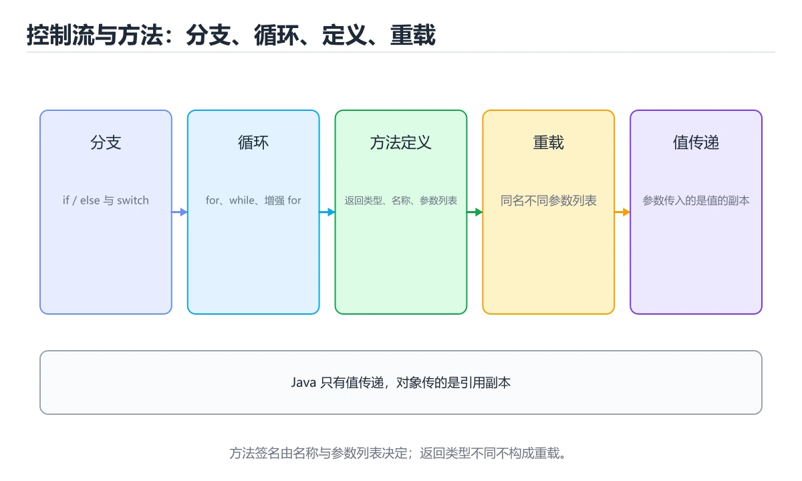
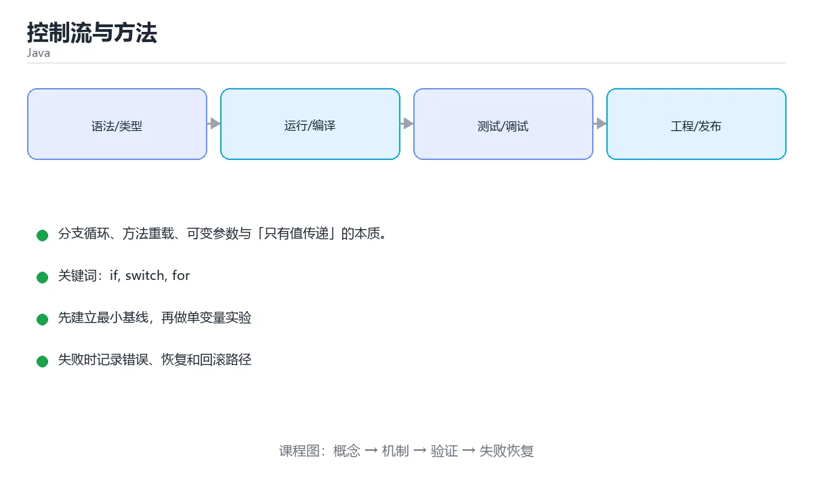

# 控制流与方法





> 内容更新时间：2026-10-03 · 学习阶段：基础 · 预计用时：14 分钟

## 学习目标

- 能用自己的话解释「控制流与方法」解决了什么问题，而不是只背术语。
- 能说清 「if」、「switch」、「for」、「重载」 之间的关系，并分别举出一个例子。
- 能把本课知识放回「Java」的知识体系，说明它和相邻主题的边界。
- 能完成本课练习，并用验收标准检查自己的结果。

> 一句话摘要：分支循环、方法重载、可变参数与「只有值传递」的本质。

## 前置知识

- 先完成上一课《变量、类型与字符串》；如果已经掌握，可以直接用本课练习自测。
- 本课阶段：基础。建议会读写简单代码或命令，并理解变量、输入输出等基本概念。
- 开始前先复习：if、switch、for。
- 如果某一步看不懂，先记录具体卡点，完成练习后再回头读一遍。


## 分支与循环

```java
int score = 78;
if (score >= 90) {
    System.out.println("优秀");
} else if (score >= 60) {
    System.out.println("及格");
} else {
    System.out.println("不及格");
}

switch (score / 10) {
    case 10, 9 -> System.out.println("A");     // 箭头语法不会有贯穿问题
    case 8 -> System.out.println("B");
    default -> System.out.println("C");
}

for (int i = 0; i < 5; i++) { }
for (String name : names) { }                  // 增强 for
while (condition) { }
do { } while (condition);                      // 至少执行一次
```

用 `break` 跳出、`continue` 跳过本轮；带标签的 `break outer;` 可以跳出多层循环。

## 方法定义与重载

```java
public static int add(int a, int b) {
    return a + b;
}

public static double add(double a, double b) {   // 重载：参数列表不同
    return a + b;
}

public static int sum(int... numbers) {           // 可变参数
    int total = 0;
    for (int n : numbers) total += n;
    return total;
}

public static void printAll(String... names) { }
```

重载只看方法名 + 参数列表，与返回值无关；可变参数必须是最后一个参数。

## 值传递

Java **只有值传递**：基本类型传副本，对象传的是引用的副本。

```java
static void change(int x) { x = 100; }              // 不影响调用方

static void addItem(List<String> list) {
    list.add("new");                                // 修改对象内容：有效
}

static void reassign(List<String> list) {
    list = new ArrayList<>();                       // 重新赋值引用：无效
}
```

## 方法设计建议

1. 一个方法只做一件事，命名用动词短语。
2. 参数不超过 4 个，过多时封装成对象。
3. 尽早返回，减少嵌套层级。
4. 用 `@Override`、`final`、`private` 表达意图。

## 本课小结
控制流决定逻辑走向，方法决定复用粒度。牢记「Java 只有值传递，但对象内容是共享的」，能避免大量误解。


## 控制流速查

| 结构 | 写法 | 注意 |
| --- | --- | --- |
| `if / else if / else` | 条件分支 | 条件必须是 `boolean` |
| `switch` 语句 | 传统分支 | 别忘 `break`，否则穿透 |
| `switch` 表达式 | `case X -> value;` | Java 14+，无穿透且可赋值 |
| `for` | 计次循环 | 注意边界 `i < n` |
| 增强 `for` | `for (String s : list)` | 遍历中不能改集合结构 |
| `while` / `do...while` | 条件循环 | `do...while` 至少执行一次 |
| 标签 + `break` | `break outer;` | 跳出多层循环 |
| `continue` | 跳过本次 | 配合条件过滤 |
| `try / catch / finally` | 异常处理 | 见异常章节 |

```java
// switch 表达式：直接返回值，编译期检查是否覆盖所有分支
String level = switch (score / 10) {
    case 10, 9 -> "优秀";
    case 8 -> "良好";
    case 7 -> "中等";
    default -> "需努力";
};

// 需要多行逻辑时用 yield 返回值
int fee = switch (type) {
    case "vip" -> 0;
    case "normal" -> {
        int base = 10;
        yield base * 2;
    }
    default -> throw new IllegalArgumentException("未知类型：" + type);
};
```

## 方法速查

| 概念 | 规则 |
| --- | --- |
| 重载（Overload） | 同名不同参数列表，返回值不参与判断 |
| 重写（Override） | 子类重新实现父类方法，签名一致 |
| 参数传递 | Java 只有值传递，对象传的是引用的副本 |
| 可变参数 | `int... nums` 必须是最后一个参数 |
| 默认值 | Java 不支持默认参数，用重载或建造者替代 |
| 返回值 | 所有分支都要有返回，或用 `throw` |
| `static` 方法 | 属于类，不能用实例成员 |
| `final` 参数 | 方法内不能重新赋值 |

```java
// 用重载替代默认参数
public void log(String msg) {
    log(msg, false);
}

public void log(String msg, boolean verbose) {
    System.out.println(verbose ? "[DEBUG] " + msg : msg);
}

// 可变参数 + 边界校验
public int sum(int first, int... rest) {
    int total = first;
    for (int n : rest) {
        total += n;
    }
    return total;
}
```

## 常见错误对照表

| 容易写错的做法 | 实际现象 | 原因与正确做法 |
| --- | --- | --- |
| `switch` 忘记 `break` | 穿透执行后续分支 | 用 `->` 表达式或补 `break` |
| 遍历 List 时 `list.remove(x)` | `ConcurrentModificationException` | 用 `removeIf` 或迭代器 |
| 用 `==` 比较字符串 | 结果不可靠 | 用 `equals` |
| 方法写了返回值却有分支没 `return` | 编译错误 | 所有路径都要返回或抛异常 |
| 重载只看返回值不同 | 编译错误：方法重复定义 | 重载必须参数列表不同 |
| 可变参数前面再加普通参数顺序错 | 编译错误 | 可变参数必须在最后 |
| `for (int i = 0; i <= list.size(); i++)` | `IndexOutOfBoundsException` | 用 `<` 或增强 `for` |
| 循环里修改 `i` 造成跳步 | 漏处理元素 | 让循环变量只由一个地方推进 |
| 用浮点数做循环判断 | 死循环或次数不对 | 用整数计数 |
| `while (true)` 没有退出条件 | 程序卡死 | 明确退出条件或 `break` |

## 自测清单

- [ ] 会用 `switch` 表达式和 `yield`。
- [ ] 知道重载与重写的区别。
- [ ] 明白 Java 只有值传递。
- [ ] 可变参数放在参数列表最后。
- [ ] 遍历集合时不在循环里结构性修改。


## 零基础详解：分支、循环与方法

### 一句话说清它是什么

方法把逻辑打包并命名，分支处理不同情况，循环重复执行。
Java 的方法**必须写在类里面**，这是它和 C 系语言最直观的差别。

### 分支：`if` 与 `switch` 的分工

| 场景 | 推荐 | 原因 |
| --- | --- | --- |
| 范围判断（分数段、金额区间） | `if / else if` | 天然支持范围与组合条件 |
| 对固定值分流（枚举、状态码） | `switch` | 结构清晰、编译器能查漏 |
| 少数几个分支 | 三元运算符 `? :` | 一行写完，但别嵌套 |

```java
// 传统 switch
switch (day) {
    case 1: System.out.println("周一"); break;
    case 2: System.out.println("周二"); break;
    default: System.out.println("其它");
}

// 新式 switch 表达式：不会穿透，还能直接赋值
String type = switch (day) {
    case 1, 2, 3, 4, 5 -> "工作日";
    case 6, 7 -> "周末";
    default -> throw new IllegalArgumentException("非法日期");
};
```

### 循环三兄弟

| 循环 | 适合场景 | 注意 |
| --- | --- | --- |
| `for` | 次数明确、遍历数组 | 最常用 |
| 增强 `for` | 遍历集合/数组，不需要下标 | 不能边遍历边删元素 |
| `while` | 条件驱动，可能一次都不执行 | 别忘更新条件变量 |
| `do...while` | 至少执行一次 | 例如重试输入 |

```java
for (int i = 0; i < 3; i++) System.out.println(i);

int[] nums = {1, 2, 3};
for (int n : nums) System.out.println(n);

int n = 0;
while (n < 3) { System.out.println(n); n++; }
```

### 方法签名：每一部分都有用

```java
public static int add(int a, int b) { return a + b; }
//  |      |      |    |        |
//  |      |      |    |        └─ 参数列表
//  |      |      |    └────────── 返回类型
//  |      |      └─────────────── 方法名
//  |      └────────────────────── static：属于类，不需要 new
//  └───────────────────────────── 访问修饰符
```

### 方法重载：同名不同参

```java
int add(int a, int b) { return a + b; }
double add(double a, double b) { return a + b; }
int add(int a, int b, int c) { return a + b + c; }
```

判定依据只有**方法名 + 参数列表**；只改返回类型不算重载，编译不过。

### Java 只有值传递

这是最容易被绕晕的点：**Java 传的永远是值的副本**，只不过引用类型复制的是「地址」。

```java
void change(int x) { x = 99; }              // 外面不变
void change(int[] arr) { arr[0] = 99; }     // 外面会变，因为改的是堆里同一个数组
```

记忆方法：**改副本本身无效，改副本指向的对象有效。**

### 可变参数

```java
int sum(int... nums) {          // 调用时可以传 0 个或多个
    int total = 0;
    for (int n : nums) total += n;
    return total;
}
sum();                // 0
sum(1, 2, 3);         // 6
```

可变参数必须放在参数列表最后，一个方法只能有一个。

### 新手最容易踩的七个坑

| 坑 | 现象 | 正确做法 |
| --- | --- | --- |
| `if (a = b)` | 编译报错或逻辑错 | 比较写 `==` |
| 循环里删集合元素 | `ConcurrentModificationException` | 用 `Iterator.remove()` 或 `removeIf` |
| 增强 `for` 里改数组 | 改了副本没效果 | 需要下标时用普通 `for` |
| 递归无终止条件 | `StackOverflowError` | 先写出口 |
| 方法名相同但只有返回类型不同 | 编译错误 | 改参数列表 |
| 方法太长 | 难测试难复用 | 按单一职责拆分 |
| 忽略返回值 | 以为对象被改了 | 接收返回值或改用可变对象 |

### 手把手练习：数字猜谜 + 素数统计

```java
public class Demo {
    static boolean isPrime(int n) {
        if (n < 2) return false;
        for (int d = 2; d * d <= n; d++) {
            if (n % d == 0) return false;
        }
        return true;
    }

    static int countPrimes(int limit) {
        int count = 0;
        for (int i = 2; i <= limit; i++) {
            if (isPrime(i)) count++;
        }
        return count;
    }

    public static void main(String[] args) {
        System.out.println("100 以内素数有 " + countPrimes(100) + " 个");
    }
}
```

### 学完自测

- [ ] 能说出新式 `switch` 表达式相比传统写法的两个好处。
- [ ] 能解释为什么增强 `for` 里删除元素会抛异常。
- [ ] 能说清「Java 只有值传递」这句话的含义。
- [ ] 能写出一个用可变参数求和的静态方法。
- [ ] 知道方法重载的判定依据是什么。

## 动手练习


> 本课练习重点：围绕「if、switch、for」完成复述、实验和交付，每个结果都要能被别人检查。

先跑通最小类与测试，再补异常和并发边界，最后观察线程与资源变化。

### 练习 1：建立心智模型（10 分钟）

合上教程，用 3～5 句话回答：

1. 「控制流与方法」解决了什么问题？
2. 如果没有它，会出现什么具体后果？
3. 它和「switch」是什么关系？

**验收标准**：至少出现一个本课关键词，并写出一个反例、边界条件或失效场景。

### 练习 2：做一次可控实验（20 分钟）

从正文中选一个最小示例，完成以下操作：

1. 先预测修改一个参数、输入或步骤后的结果。
2. 再实际执行或逐步推演，记录真实结果。
3. 如果结果与预测不同，写出差异原因。

**验收标准**：留下「原例 → 改动 → 预测 → 结果 → 原因」五步记录。

### 练习 3：交付一个小结果（30 分钟）

写一个可运行的小类，补一个普通测试和一个边界输入测试。

任务要求：

- 结果必须能被别人检查，不能只写“我已经理解了”。
- 至少覆盖「if」和「switch」两个关键词。
- 写出 1 个仍然不确定的问题，以及下一步如何验证。

> 提示：时间有限时优先做练习 1 和练习 2；练习 3 可以拆成两次完成。


## 实践任务

本节围绕“控制流与方法”安排 3 个可交付任务，每个任务都要求留下可以复查的记录。

### 任务 1：用自己的话画出结构

合上教程，用 5 句话说明“控制流与方法”解决什么问题、输入是什么、输出是什么、失败时会怎样、与相邻概念的边界在哪里。画一张流程图或状态图，把每个节点标注成“输入 / 处理 / 输出 / 失败路径”之一。

**验收标准**：图里至少有 5 个节点和 1 条失败路径；每个节点都能在正文中找到依据。

### 任务 2：做一次对比实验

从正文里选两个差异最小的方案，列成 4 列表格：方案、前提、代价、适用边界。然后只改变一个条件（数据规模、并发度、精度或资源上限），记录结果变化。

**验收标准**：表格里两个方案的结论不能完全一样；写下“在什么条件下应该换方案”。

### 任务 3：迁移到自己的场景

把“控制流与方法”的核心方法用到你熟悉的一个真实场景，写出一份 300 字以内的实施记录：目标、步骤、验证方式、仍然不确定的问题。

**验收标准**：至少有一个可复现的命令、代码片段或数据样例；结论能被别人独立检查。


## 故障现场

这一节把“控制流与方法”最常见的失败方式还原成现场记录，练习时按“症状 → 复现 → 定位 → 修复 → 预防”的顺序排查。

### 现场 1：“控制流与方法”的 if 常规用例通过，但边界用例失败

**症状**：在“控制流与方法”的练习或生产场景里出现““控制流与方法”的 if 常规用例通过，但边界用例失败”。

**复现**：准备一组最小输入，只保留触发““控制流与方法”的 if 常规用例通过，但边界用例失败”的必要条件，连续运行两次确认结果稳定。

**定位**：围绕“if 的前置条件与取值边界没有写进代码，默认值掩盖了空值和极值”检查调用链、输入数据和环境配置，先验证假设再改代码。

**修复**：为“控制流与方法”补一条空值或极值用例，把前置条件写成断言，并让失败信息直接指出是哪个输入越界

**预防**：把““控制流与方法”的 if 常规用例通过，但边界用例失败”写成一条自动化用例，并在“控制流与方法”的验收清单里保留对应检查项。


### 现场 2：“控制流与方法”的 switch 结果在两次运行之间不一致

**症状**：在“控制流与方法”的练习或生产场景里出现““控制流与方法”的 switch 结果在两次运行之间不一致”。

**复现**：准备一组最小输入，只保留触发““控制流与方法”的 switch 结果在两次运行之间不一致”的必要条件，连续运行两次确认结果稳定。

**定位**：围绕“switch 依赖了当前版本、执行顺序或共享状态，单次运行无法暴露差异”检查调用链、输入数据和环境配置，先验证假设再改代码。

**修复**：固定“控制流与方法”使用的版本与随机种子，记录两次运行的完整输入和输出，再逐项消除非确定性来源

**预防**：把““控制流与方法”的 switch 结果在两次运行之间不一致”写成一条自动化用例，并在“控制流与方法”的验收清单里保留对应检查项。


### 现场 3：“控制流与方法”的验证只在开发机通过

**症状**：在“控制流与方法”的练习或生产场景里出现““控制流与方法”的验证只在开发机通过”。

**复现**：准备一组最小输入，只保留触发““控制流与方法”的验证只在开发机通过”的必要条件，连续运行两次确认结果稳定。

**定位**：围绕“环境版本、配置和输入规模与目标环境不同，if 缺少可重复的验证记录”检查调用链、输入数据和环境配置，先验证假设再改代码。

**修复**：把“控制流与方法”的运行环境、输入样本和预期输出写成清单，并在另一套环境复跑同一条命令

**预防**：把““控制流与方法”的验证只在开发机通过”写成一条自动化用例，并在“控制流与方法”的验收清单里保留对应检查项。


## 版本与时效

这一节记录“控制流与方法”涉及的版本基线与升级检查点，避免把某个版本的默认行为当成永久结论。

- Java 25 是当前 LTS，Java 21 仍是大量生产系统的基线
- 虚拟线程、记录模式、结构化并发与分代 ZGC 是升级收益最大的部分
- 升级前重点检查反射、字节码增强、序列化与第三方框架兼容性
- 官方发布说明：https://www.oracle.com/java/technologies/javase/

### 升级检查清单

- 先固定当前版本，跑通全部示例与测验，再升级工具链。
- 只改一个版本变量，记录编译、测试、性能与产物体积的变化。
- 重点回归默认值、弃用警告、序列化格式、并发语义和错误信息。
- 升级完成后更新本课的“最后复核 / 下次复核”日期与版本说明。


## 考点精讲：把测验题还原成判断过程

本课有 6 个判断点。先自己作答，再看「判断依据」；如果结论正确但理由不完整，回到正文对应章节补足概念。

### 考点 1：Java 的参数传递方式是？

- **正确判断**：全部值传递
- **判断依据**：正确答案是「全部值传递」，本课在「值传递」中说明：Java 只有值传递：基本类型传副本，对象传的是引用的副本。Java 只有值传递：对象传递的是引用的副本，所以能改对象内容，但重新赋值引用不影响调用方。本课还在「零基础详解：分支、循环与方法」中说明：可变参数必须放在参数列表最后，一个方法只能有一个。本课还在「本课小结」中说明：牢记「Java 只有值传递，但对象内容是共享的」，能避免大量误解。
- **迁移检查**：遮住选项，只根据定义复述一次答案，再回来看哪个选项与复述一致。

### 考点 2：可变参数（int... nums）必须放在？

- **正确判断**：参数列表最后
- **判断依据**：可变参数必须是最后一个参数，一个方法最多只有一个。其他选项：可变参数必须是参数列表最后一个，否则编译器无法判断参数边界。针对「可变参数（int... nums）必须放在，」，本课在「零基础详解：分支、循环与方法」中说明：可变参数必须放在参数列表最后，一个方法只能有一个。本课还在「方法定义与重载」中说明：重载只看方法名 + 参数列表，与返回值无关。本课还在「零基础详解：分支、循环与方法」中说明：能说清「Java 只有值传递」这句话的含义。
- **迁移检查**：把题干里的一个条件换成边界值，原来的结论还成立吗？写出判断过程。

### 考点 3：方法重载的判定依据是？

- **正确判断**：方法名 + 参数列表
- **判断依据**：正确答案是「方法名 + 参数列表」，本课在「方法定义与重载」中说明：重载只看方法名 + 参数列表，与返回值无关。重载只看方法名和参数列表，返回值不同不构成重载。本课还在「值传递」中说明：Java 只有值传递：基本类型传副本，对象传的是引用的副本。本课还在「零基础详解：分支、循环与方法」中说明：能说出新式 switch 表达式相比传统写法的两个好处。
- **迁移检查**：把题干里的一个条件换成边界值，原来的结论还成立吗？写出判断过程。

### 考点 4：Java 14+ 的 switch 表达式相比传统 switch 的优势是？

- **正确判断**：用 -> 避免 case 穿透
- **判断依据**：正确答案是「用 -> 避免 case 穿透」，本课在「零基础详解：分支、循环与方法」中说明：能说出新式 switch 表达式相比传统写法的两个好处。多分支用 yield 返回值，编译期还能检查是否覆盖所有枚举常量。本课还在「本课小结」中说明：牢记「Java 只有值传递，但对象内容是共享的」，能避免大量误解。本课还在「零基础详解：分支、循环与方法」中说明：方法把逻辑打包并命名，分支处理不同情况，循环重复执行。
- **迁移检查**：如果给某个错误选项去掉一个限定词，它会不会变成正确？说明理由。

### 考点 5：带标签的 break（break outer;）的作用是？

- **正确判断**：跳出被标记的外层循环
- **判断依据**：正确答案是「跳出被标记的外层循环」，本课在「分支与循环」中说明：带标签的 break outer; 可以跳出多层循环。嵌套循环中需要一次性退出时要靠标签，但多数情况可重构为提取方法 + return。本课还在「分支与循环」中说明：用 break 跳出、continue 跳过本轮。本课还在「零基础详解：分支、循环与方法」中说明：能说清「Java 只有值传递」这句话的含义。
- **迁移检查**：遮住选项，只根据定义复述一次答案，再回来看哪个选项与复述一致。

### 考点 6：补全代码：「控制流与方法」示例中，下面这行代码缺少哪个关键字或函数名？请填入 ____。 `____ -> System.out.println("C");`

- **正确判断**：default
- **判断依据**：正确答案是「default」，本课在「零基础详解：分支、循环与方法」中说明：Java 的方法必须写在类里面，这是它和 C 系语言最直观的差别。本课还在「零基础详解：分支、循环与方法」中说明：记忆方法：改副本本身无效，改副本指向的对象有效。本课示例中还能看到 `default -> "需努力";` 这样的用法，说明该关键字在本课代码中承担实际功能。
- **迁移检查**：把答案换成另一种等价写法，是否仍然正确？说明依据。

### 补充自测（2 题）

1. 围绕“控制流与方法”中的 if、switch、for，下列哪两项是本课强调的实践判断？
2. 下面这段 Java 代码复现了“控制流与方法”中 if、switch、for 相关的一个常见故障，哪一项最准确地解释了问题？

这些题按“先定位概念、再排除边界错误、最后核对答案”的顺序作答；每题解析都给出了判断依据。


## 本课复习清单

离开本课前，逐项确认：

- [ ] 不看解析，能说出「Java 的参数传递方式是？」的判断依据。
- [ ] 不看解析，能说出「可变参数（int... nums）必须放在？」的判断依据。
- [ ] 不看解析，能说出「方法重载的判定依据是？」的判断依据。
- [ ] 不看解析，能说出「Java 14+ 的 switch 表达式相比传统 switch 的优势是？」的判断依据。
- [ ] 不看解析，能说出「带标签的 break（break outer;）的作用是？」的判断依据。
- [ ] 不看解析，能说出「补全代码：「控制流与方法」示例中，下面这行代码缺少哪个关键字或函数名？请填入 _…」的判断依据。
- [ ] 至少运行一次本课示例，记录输入、输出和一个边界情况。
- [ ] 把本课最容易混淆的两个概念写成一句话对照。

| 复盘项 | 记录 |
| --- | --- |
| 已经能独立解释的考点 |  |
| 仍然说不清的概念 |  |
| 下一步验证动作 |  |

## 术语速查

把本课反复出现的术语集中放在一起。复习时先遮住右列，尝试用自己的话解释，再回到正文核对。

| 术语 | 本课语境 |
| --- | --- |
| `break` | 用 `break` 跳出、`continue` 跳过本轮；带标签的 `break outer;` 可以跳出多层循环。 |
| `continue` | 用 `break` 跳出、`continue` 跳过本轮；带标签的 `break outer;` 可以跳出多层循环。 |
| `break outer;` | 用 `break` 跳出、`continue` 跳过本轮；带标签的 `break outer;` 可以跳出多层循环。 |
| `@Override` | 用 `@Override`、`final`、`private` 表达意图。 |
| `final` | 用 `@Override`、`final`、`private` 表达意图。 |
| `private` | 用 `@Override`、`final`、`private` 表达意图。 |
| `if / else if / else` | \| `if / else if / else` \| 条件分支 \| 条件必须是 `boolean` \| |
| `boolean` | \| `if / else if / else` \| 条件分支 \| 条件必须是 `boolean` \| |
| `switch` | \| `switch` 语句 \| 传统分支 \| 别忘 `break`，否则穿透 \| |
| `case X -> value;` | \| `switch` 表达式 \| `case X -> value;` \| Java 14+，无穿透且可赋值 \| |
| `for` | \| `for` \| 计次循环 \| 注意边界 `i < n` \| |
| `i < n` | \| `for` \| 计次循环 \| 注意边界 `i < n` \| |

## 面试问答与自测

下面把本课考点换成面试追问。先口述自己的答案，
再对照参考回答检查是否遗漏了前提、边界或失败路径。

### 追问 1：Java 的参数传递方式是？

**参考回答**：正确答案是「全部值传递」，本课在「值传递」中说明：Java 只有值传递：基本类型传副本，对象传的是引用的副本。Java 只有值传递：对象传递的是引用的副本，所以能改对象内容，但重新赋值引用不影响调用方。本课还在「零基础详解·分支、循环与方法」中说明：可变参数必须放在参数列表最后，一个方法只能有一个。本课还在「本课小结」中说明：牢记「Java 只有值传递，但对象内容是共享的」，能避免大量误解。

### 追问 2：可变参数（int... nums）必须放在？

**参考回答**：可变参数必须是最后一个参数，一个方法最多只有一个。其他选项：可变参数必须是参数列表最后一个，否则编译器无法判断参数边界。针对「可变参数（int... nums）必须放在，」，本课在「零基础详解·分支、循环与方法」中说明：可变参数必须放在参数列表最后，一个方法只能有一个。本课还在「方法定义与重载」中说明：重载只看方法名 + 参数列表，与返回值无关。本课还在「零基础详解·分支、循环与方法」中说明：能说清「Java 只有值传递」这句话的含义。

### 追问 3：方法重载的判定依据是？

**参考回答**：正确答案是「方法名 + 参数列表」，本课在「方法定义与重载」中说明：重载只看方法名 + 参数列表，与返回值无关。重载只看方法名和参数列表，返回值不同不构成重载。本课还在「值传递」中说明：Java 只有值传递：基本类型传副本，对象传的是引用的副本。本课还在「零基础详解·分支、循环与方法」中说明：能说出新式 switch 表达式相比传统写法的两个好处。

### 追问 4：Java 14+ 的 switch 表达式相比传统 switch 的优势是？

**参考回答**：正确答案是「用 -> 避免 case 穿透」，本课在「零基础详解·分支、循环与方法」中说明：能说出新式 switch 表达式相比传统写法的两个好处。多分支用 yield 返回值，编译期还能检查是否覆盖所有枚举常量。本课还在「本课小结」中说明：牢记「Java 只有值传递，但对象内容是共享的」，能避免大量误解。本课还在「零基础详解·分支、循环与方法」中说明：方法把逻辑打包并命名，分支处理不同情况，循环重复执行。

### 追问 5：带标签的 break（break outer;）的作用是？

**参考回答**：正确答案是「跳出被标记的外层循环」，本课在「分支与循环」中说明：带标签的 break outer; 可以跳出多层循环。嵌套循环中需要一次性退出时要靠标签，但多数情况可重构为提取方法 + return。本课还在「分支与循环」中说明：用 break 跳出、continue 跳过本轮。本课还在「零基础详解·分支、循环与方法」中说明：能说清「Java 只有值传递」这句话的含义。

## English Overview

**Title:** Control Flow & Methods

**Summary:** Branches, loops, overloads, varargs and pass-by-value.

**Category:** Java  
**Level:** 基础  
**Key terms:** if, switch, for, 重载, 可变参数, 值传递

> The full tutorial is written in Chinese. This bilingual overview helps English readers identify the topic, scope and key terms before studying the detailed examples.

## 内容元数据

- 内容版本：v2.0
- 最后更新：2026-10-03
- 学习阶段：基础
- 适用环境：Java 21+ / Maven 或 Gradle
- 内容来源：内置结构化课程与工程实践整理
- 相关主题：if、switch、for、重载、可变参数、值传递
- 质量版本：P0 测验标准 + P1 覆盖扩展 + P2 体验补全


## 参考资料与复核

- 最后复核：2026-10-04
- 下次复核：2027-04-04
- 复核范围：版本兼容、API 行为、安全建议与工程实践
- 来源性质：官方文档与标准；本课正文为离线教学重组，不复制原文

| 参考资料 | 本课用途 |
| --- | --- |
| [Java SE API](https://docs.oracle.com/en/java/javase/) | 语言、标准库与 JVM |
| [dev.java](https://dev.java/learn/) | 现代 Java 官方教程 |

> 本课主题：分支循环、方法重载、可变参数与「只有值传递」的本质。

> App 完全离线展示文字链接，不会自动联网；需要延伸阅读时可复制链接到浏览器。

<!-- code-practice:v1:start -->

## 代码练习（6 题）

下面题目与课程测验同源：覆盖代码输出、排错与场景判断。建议先自己写出答案，再到「测验」里核对成绩。

### 练习 1 · 代码输出

在 Java 课程“控制流与方法”的集合实验里，这段代码运行后输出什么？

```java
public class Main {
    public static void main(String[] args) {
        int total = 0;
        for (int i = 1; i <= 5; i++) {
            total += i;
        }
        System.out.println(total);
    }
}
```

- A. 15
- B. 30
- C. 14
- D. 16

**参考答案**：A. 15
**参考输出**：`15`

**解析**

在 Java 课程“控制流与方法”的集合代码实验里，程序先完成赋值、循环或函数调用，再把结果写到标准输出，因此正确结果是 15。
判断 Java 课程“控制流与方法”的代码输出时，要把“源码写了什么”和“运行时实际打印什么”分开；变量值和循环边界都会直接改变最终结果。
把 15 当作基线后，可以只改一个输入或一个边界，再观察 Java 课程“控制流与方法”的输出如何变化，这就是验证掌握程度的方法。

### 练习 2 · 代码输出

在 Java 课程“控制流与方法”的函数实验里，这段代码运行后输出什么？

```java
public class Main {
    public static void main(String[] args) {
        int x = 5;
        System.out.println(x);
    }
}
```

- A. 4
- B. 10
- C. 6
- D. 5

**参考答案**：D. 5
**参考输出**：`5`

**解析**

在 Java 课程“控制流与方法”的函数代码实验里，程序先完成赋值、循环或函数调用，再把结果写到标准输出，因此正确结果是 5。
判断 Java 课程“控制流与方法”的代码输出时，要把“源码写了什么”和“运行时实际打印什么”分开；变量值和循环边界都会直接改变最终结果。
把 5 当作基线后，可以只改一个输入或一个边界，再观察 Java 课程“控制流与方法”的输出如何变化，这就是验证掌握程度的方法。

### 练习 3 · 代码输出

在 Java 课程“控制流与方法”的条件实验里，这段代码运行后输出什么？

```java
public class Main {
    static int doubleValue(int value) {
        return value * 2;
    }

    public static void main(String[] args) {
        System.out.println(doubleValue(5));
    }
}
```

- A. 9
- B. 11
- C. 10
- D. 20

**参考答案**：C. 10
**参考输出**：`10`

**解析**

在 Java 课程“控制流与方法”的条件代码实验里，程序先完成赋值、循环或函数调用，再把结果写到标准输出，因此正确结果是 10。
判断 Java 课程“控制流与方法”的代码输出时，要把“源码写了什么”和“运行时实际打印什么”分开；变量值和循环边界都会直接改变最终结果。
把 10 当作基线后，可以只改一个输入或一个边界，再观察 Java 课程“控制流与方法”的输出如何变化，这就是验证掌握程度的方法。

### 练习 4 · 代码排错

Java 课程“控制流与方法”的下面这段代码无法运行，最可能的修复是什么？

```java
public class Main {
    public static void main(String[] args) {
        int x = 5
        System.out.println(x);
    }
}
```

- A. 在 int x = 5 这一行末尾补上分号
- B. 把输出语句整段删除，代码就会自动修复
- C. 把变量名改成另一个单词即可
- D. 重新安装运行时并清空所有缓存

**参考答案**：A. 在 int x = 5 这一行末尾补上分号

**解析**

Java 课程“控制流与方法”里的这段代码无法通过编译或解析，关键原因是缺少了必要语法结构，正确修复是在 int x = 5 这一行末尾补上分号。
在 Java 课程“控制流与方法”中，错误信息通常会指出出错行和期望符号；先读第一条错误，再检查这一行的括号、冒号、分号或花括号。
修复后还要重新运行 Java 课程“控制流与方法”的最小示例，确认输出恢复，并记录这次问题属于语法错误而不是逻辑错误。

### 练习 5 · 代码排错

Java 课程“控制流与方法”的这段代码结果偏小，应该怎样修改？

```java
public class Main {
    public static void main(String[] args) {
        int total = 0;
        for (int i = 1; i < 5; i++) {
            total += i;
        }
        System.out.println(total);
    }
}
```

- A. 把循环条件 i < 5 改成 i <= 5
- B. 把累加操作改成减法操作
- C. 把循环变量从 1 改成 0，其余保持不变
- D. 把输出语句移到循环体内部

**参考答案**：A. 把循环条件 i < 5 改成 i <= 5
**修复后输出**：`15`

**解析**

Java 课程“控制流与方法”里的循环边界少算了最后一项，当前输出是 10，而完整求和应为 15。
正确修复是把循环条件 i < 5 改成 i <= 5；这类错误属于边界问题，代码能运行但结果偏离，所以比语法错误更隐蔽。
验证 Java 课程“控制流与方法”时至少选择首项、中间值和末尾值三个输入，比较手算结果与程序输出，才能发现类似偏差。

### 练习 6 · 概念判断

在 Java 课程“控制流与方法”的学习或项目场景中，哪种做法最有助于得到可验证、可迁移的结果？

- A. 一次改完所有变量和依赖，再统一观察是否报错
- B. 先围绕「if」写最小可运行示例，再用边界输入验证“控制流与方法”的结果
- C. 只背下「控制流与方法」的结论，遇到新输入时凭感觉修改代码
- D. 跳过错误信息，直接复制另一段代码直到能运行

**参考答案**：B. 先围绕「if」写最小可运行示例，再用边界输入验证“控制流与方法”的结果

**解析**

在 Java 课程“控制流与方法”里，if不是孤立的名词，而是一组可以用输入、过程、输出和边界验证的行为。
对 Java 课程“控制流与方法”来说，先写最小可运行示例，再逐步增加边界输入，能把“感觉会了”转化成可以重复的证据。
如果只背结论或一次改很多变量，出错时就无法判断是哪一步破坏了 Java 课程“控制流与方法”的预期；先把变化隔离出来才容易定位。

<!-- code-practice:v1:end -->
