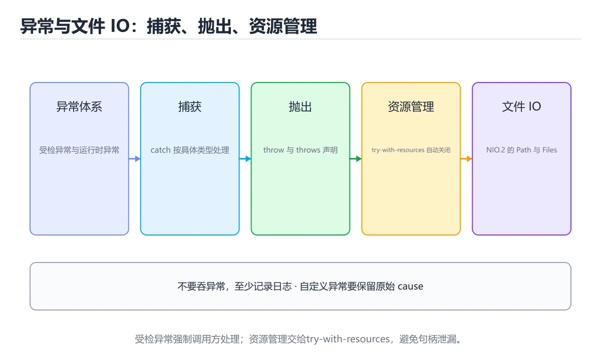
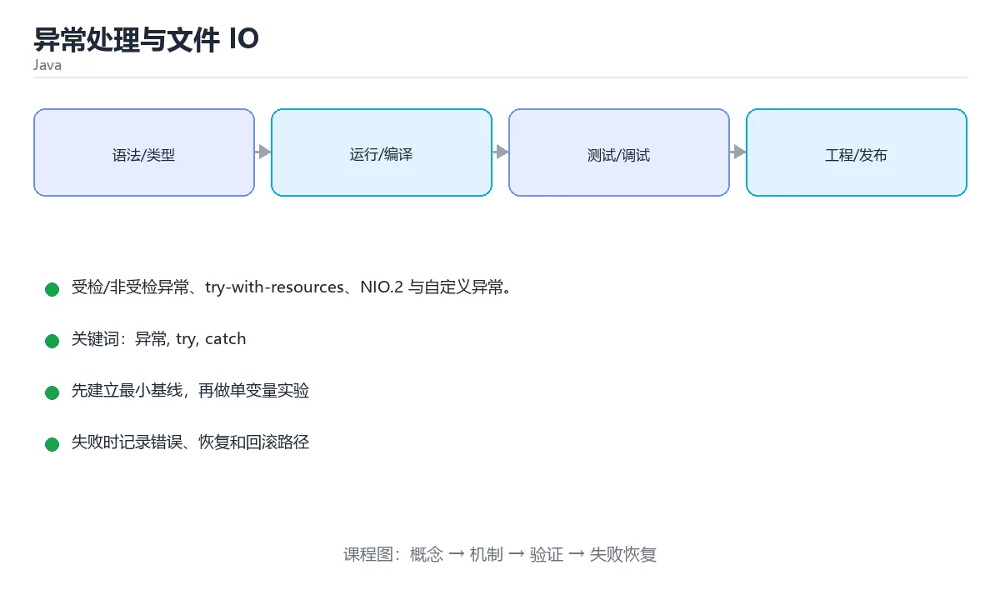

# 异常处理与文件 IO

> 内容更新时间：2026-10-06 · 学习阶段：进阶 · 预计用时：40 分钟





## 学习目标

- 能用自己的话解释异常处理与文件 IO解决了什么问题，而不是只背术语。
- 能说清 「异常」、「try」、「catch」、「finally」 之间的关系，并分别举出一个例子。
- 能把 异常 放回「异常处理与文件 IO」的知识体系，说明它和 try 的边界。
- 能完成本课练习，并用验收标准检查自己的结果。

> 一句话摘要：受检/非受检异常、try-with-resources、NIO.2 与自定义异常。

## 前置知识

- 先完成上一课《集合框架与泛型》；如果已经掌握，可以直接用本课练习自测。
- 本课阶段：进阶。建议先完成「集合框架与泛型」，或确认自己能独立跑通正文里的 OutOfMemoryError 示例。
- 开始前先复习：异常、try、catch。
- 如果 异常体系 这一步看不懂，先记录具体卡点，再用 OutOfMemoryError 复现一遍。

## 异常体系

```text
Throwable
├── Error（严重错误，不应捕获，如 OutOfMemoryError）
└── Exception
    ├── RuntimeException（非受检：NullPointerException、IllegalArgumentException）
    └── 其他（受检：IOException、SQLException，必须处理或声明）
```

## 捕获与抛出

```java
public static int parse(String text) {
    try {
        return Integer.parseInt(text);
    } catch (NumberFormatException e) {
        System.err.println("格式错误：" + e.getMessage());
        return 0;
    } finally {
        System.out.println("无论如何都会执行");
    }
}

public void read(String path) throws IOException {   // 受检异常要声明
    if (path == null) {
        throw new IllegalArgumentException("路径不能为空");   // 非受检，无需声明
    }
    // ...
}
```

多异常捕获：`catch (IOException | SQLException e)`。子类异常必须写在父类前面。

## try-with-resources

```java
try (BufferedReader reader = Files.newBufferedReader(Path.of("data.txt"))) {
    String line;
    while ((line = reader.readLine()) != null) {
        System.out.println(line);
    }
} catch (IOException e) {
    e.printStackTrace();
}
```

实现 `AutoCloseable` 的资源会在代码块结束时自动关闭，异常也不会漏关。

## 读写文件（NIO.2）

```java
import java.nio.file.*;
import java.util.List;

Path path = Path.of("notes.txt");

Files.writeString(path, "第一行\n", StandardOpenOption.CREATE,
                  StandardOpenOption.APPEND);

List<String> lines = Files.readAllLines(path);
lines.forEach(System.out::println);

Files.createDirectories(Path.of("data/cache"));   // 递归创建目录
```

## 自定义异常

```java
public class BalanceException extends RuntimeException {
    public BalanceException(String message) { super(message); }
}

if (balance < amount) {
    throw new BalanceException("余额不足：" + balance);
}
```

## 使用建议

1. 不要用异常控制正常流程。
2. 捕获后要么处理、要么包装成业务异常抛出，不要 `printStackTrace` 后继续。
3. 记录日志时保留原始异常：`throw new ServiceException("下单失败", e);`
4. 尽早失败：参数校验失败立刻抛 `IllegalArgumentException`。

## 本课小结

受检异常强制调用方思考失败路径，运行时异常表达编程错误。资源一律交给 try-with-resources。

## 异常体系速查

| 类型 | 是否受检 | 典型例子 | 处理建议 |
| --- | --- | --- | --- |
| `Error` | 否 | `OutOfMemoryError`、`StackOverflowError` | 不捕获，交给进程处理 |
| 受检异常 | 是 | `IOException`、`SQLException` | 必须捕获或声明抛出 |
| 运行时异常 | 否 | `NullPointerException`、`IllegalArgumentException` | 修代码，少捕获 |

常用写法速查：

| 目的 | 写法 |
| --- | --- |
| 捕获并记录 | `catch (IOException e) { log.error("读取失败", e); }` |
| 多类型同处理 | `catch (IOException \| SQLException e) { ... }` |
| 重新抛出并保留原因 | `throw new ServiceException("下单失败", e);` |
| 自动关闭资源 | `try (var in = new FileInputStream(path)) { ... }` |
| 无异常时执行 | `try { ... } catch (...) { ... }` 之后写正常逻辑 |
| 一定执行的清理 | `finally { ... }` |
| 断言参数 | `Objects.requireNonNull(id, "id 不能为空")` |
| 校验参数合法性 | `if (n < 0) throw new IllegalArgumentException("n 必须非负");` |
| 自定义异常 | `class OrderException extends RuntimeException { ... }` |

```java
public Order createOrder(OrderRequest request) {
    Objects.requireNonNull(request, "request 不能为空");
    if (request.items().isEmpty()) {
        throw new IllegalArgumentException("订单不能为空");
    }
    try {
        return repository.save(request.toEntity());
    } catch (DataAccessException e) {
        // 保留原始异常，便于排查根因
        throw new OrderCreateException("保存订单失败", e);
    }
}
```

## 常见错误与排查

| 容易写错的做法 | 实际现象 | 原因与正确做法 |
| --- | --- | --- |
| `catch (Exception e) { }` | 异常被吞，问题难以发现 | 至少记录日志，只捕获能处理的异常 |
| `e.printStackTrace()` | 日志框架里丢失上下文 | 用 `log.error("上下文", e)` |
| 在 `finally` 里 `return` | 覆盖返回值、吞掉异常 | `finally` 只做资源释放 |
| 用异常控制正常流程 | 性能差、语义混乱 | 用返回值或 `Optional` 表达预期分支 |
| 丢失原始异常 | 只剩一句「失败了」 | 构造新异常时传入 `cause` |
| 捕获后不做处理也不抛 | 上层以为成功 | 记录并重新抛出，或返回明确失败结果 |
| 自定义异常继承 `Throwable` | 语义过重，可能不被常规捕获 | 业务异常继承 `RuntimeException` 或 `Exception` |
| `try` 块里包含大量无关代码 | 误捕获、定位困难 | `try` 只包最小可能失败的片段 |
| 忘记关闭资源 | 文件句柄与连接泄漏 | 用 try-with-resources |
| 受检异常在 `lambda` 里直接抛 | 编译不通过 | 包装成运行时异常，或在 lambda 内处理 |

## 复习与自测

- [ ] 分得清受检异常、运行时异常与 `Error` 的处理策略。
- [ ] 捕获时始终传原始异常作为 cause。
- [ ] 用 try-with-resources 管理需要关闭的资源。
- [ ] 参数校验用 `Objects.requireNonNull` 与 `IllegalArgumentException`。
- [ ] 日志用占位符并带上异常对象，不用 `printStackTrace`。

## 零基础详解：异常体系与资源管理

### 一句话说清它是什么

异常是 Java 表达「出问题了」的方式。它分成**受检异常**（必须处理）和**非受检异常**（运行时问题）。
配套的 `try-with-resources` 负责自动关闭文件、连接这类资源。

### 异常家族结构

```text
Throwable
  包含 Error（JVM 级严重问题，不该捕获，如 OutOfMemoryError）
  包含 Exception
     包含 RuntimeException（非受检：空指针、越界、类型转换）
     包含其它受检异常（IOException、SQLException）
```

| 类型 | 是否必须处理 | 典型场景 | 处理建议 |
| --- | --- | --- | --- |
| 受检异常 | 必须 `try` 或声明 `throws` | 读文件、连数据库 | 能恢复就处理，否则向上抛 |
| 非受检异常 | 不强制 | 参数非法、空指针 | 修代码，而不是到处捕获 |
| Error | 不该捕获 | 内存耗尽 | 让程序退出 |

### 完整写法

```java
import java.io.IOException;
import java.nio.file.Files;
import java.nio.file.Path;

public class Loader {
    public static String load(Path path) throws IOException {
        try {
            return Files.readString(path);
        } catch (IOException e) {
            System.err.println("读取失败：" + path);
            throw e;                       // 记录后再抛出，别吞掉
        }
    }

    public static void main(String[] args) {
        try {
            System.out.println(load(Path.of("config.txt")));
        } catch (IOException e) {
            System.out.println("程序继续运行：" + e.getMessage());
        } finally {
            System.out.println("无论成功失败都会执行");
        }
    }
}
```

### try-with-resources：自动关闭

```java
try (var reader = Files.newBufferedReader(Path.of("data.txt"))) {
    String line;
    while ((line = reader.readLine()) != null) {
        System.out.println(line);
    }
} catch (IOException e) {
    System.out.println("读取出错：" + e.getMessage());
}
```

只要资源实现了 `AutoCloseable`，写在 `try(...)` 里就会自动关闭——**比手写 `finally` 更安全**。

### 抛异常的三条规范

```java
// 1. 参数校验抛非受检，让错误尽早暴露
if (amount <= 0) throw new IllegalArgumentException("金额必须为正");

// 2. 保留原因链，别丢掉原始异常
try {
    parse(text);
} catch (NumberFormatException e) {
    throw new IllegalArgumentException("解析失败：" + text, e);
}

// 3. 自定义异常让调用方精确处理
class InsufficientBalanceException extends RuntimeException {
    InsufficientBalanceException(String message) { super(message); }
}
```

### 新手最容易踩的八个坑

| 坑 | 现象 | 正确做法 |
| --- | --- | --- |
| 捕获后什么都不做 | 问题被彻底掩盖 | 至少记录日志，或重新抛出 |
| 捕获 `Exception` 一把抓 | 掩盖真正的 bug | 先捕获具体类型 |
| 用异常做流程控制 | 又慢又难读 | 能用判断就用判断 |
| 忘了关闭资源 | 句柄泄漏 | 用 try-with-resources |
| 在 `finally` 里返回 | 吞掉异常和返回值 | 别在 `finally` 中返回 |
| 空指针只捕获不修 | 崩溃延后发生 | 用 `Optional` 或判空从源头解决 |
| 丢掉 cause | 排查时看不到根因 | 用带 `cause` 的构造方法 |
| 自定义异常太多 | 没人能记住 | 只在调用方需要区别处理时才自定义 |

### 空指针的现代防御

```java
import java.util.Optional;

Optional<String> nickname = Optional.ofNullable(user.getNickname());
String shown = nickname.orElse("匿名用户");

// 链式取值，任何一环为 null 都不会抛异常
String city = Optional.ofNullable(user)
        .map(User::getAddress)
        .map(Address::getCity)
        .orElse("未填写");
```

### 手把手练习：安全解析数字并统计

```java
import java.util.*;

public class ParseDemo {
    static int parseScore(String raw) {
        try {
            int value = Integer.parseInt(raw.trim());
            if (value < 0 || value > 100) {
                throw new IllegalArgumentException("分数必须在 0~100：" + raw);
            }
            return value;
        } catch (NumberFormatException e) {
            throw new IllegalArgumentException("不是合法数字：" + raw, e);
        }
    }

    public static void main(String[] args) {
        List<String> inputs = List.of("88", " 92 ", "abc", "120");
        List<Integer> scores = new ArrayList<>();
        for (String raw : inputs) {
            try {
                scores.add(parseScore(raw));
            } catch (IllegalArgumentException e) {
                System.out.println("跳过：" + e.getMessage());
            }
        }
        System.out.println("有效分数：" + scores);
    }
}
```

### 学完自测

- [ ] 能说出受检异常与非受检异常的区别。
- [ ] 知道为什么不该写 `catch (Exception e) {}`。
- [ ] 会用 try-with-resources 自动关闭资源。
- [ ] 知道抛异常时如何保留原因链。
- [ ] 能用 `Optional` 写出不抛空指针的链式取值。

## 动手练习

> 本课练习重点：围绕「异常、try、catch」完成复述、实验和交付，每个结果都要能被别人检查。

先跑通 异常 的最小类与测试，再补异常与并发边界，最后观察资源变化。

### 练习 1：建立心智模型（10 分钟）

合上教程，用 3～5 句话回答：

1. 异常处理与文件 IO解决了什么问题？
2. 如果没有它，会出现什么具体后果？
3. 它和「try」是什么关系？

验收标准：用自己的话解释 异常，并给出一个它不成立的反例。

### 练习 2：做一次可控实验（20 分钟）

从正文中选一个最小示例，完成以下操作：

1. 先预测修改一个参数、输入或步骤后的结果。
2. 再实际执行或逐步推演，记录真实结果。
3. 如果结果与预测不同，写出差异原因。

**验收标准**：五步记录要写进笔记——原例是 OutOfMemoryError，改动落在异常上，结论必须能被他人在同一环境里复现。

### 练习 3：交付一个小结果（30 分钟）

写一个可运行的小类，补一个普通测试和一个边界输入测试。

任务要求：

- 结果必须能被别人检查，不能只写“我已经理解了”。
- 至少覆盖「异常」和「try」两个关键词。
- 写出 1 个仍然不确定的问题，以及下一步如何验证。

> 提示：时间有限时优先做练习 1 和练习 2；练习 3 可以拆成两次完成。

## 可运行练习

本节围绕异常处理与文件 IO安排 3 个可交付任务，每个任务都要求留下可以复查的记录。

### 任务 1：用自己的话画出结构

不看书，用一张图说清「异常处理与文件 IO」的结构，画完再对照骨架：

- 主干：异常体系 → 捕获与抛出 → 读写文件（NIO.2） → 自定义异常
- 连接线：在每条边上标出输入、输出与失败路径。
- 自检：能否用一句话说明异常与try的关系？

### 任务 2：做一次对比实验

**验收标准**：对照表里只能用 OutOfMemoryError 这类可观察的指标做结论，并给出try从优到劣的转折条件。

### 任务 3：迁移到自己的场景

**验收标准**：结论要附带 OutOfMemoryError 的可复现记录，并说明 异常 在「异常体系」里的位置。

## 故障现场

### 现场 1：catch (Exception e) { }

**症状**：在《异常处理与文件 IO》的复现场景中，异常被吞，问题难以发现。

**根因**：触发点是把“catch (Exception e) { }”当成安全做法。它没有满足《异常处理与文件 IO》要求的前提，因此先表现为“异常被吞，问题难以发现”；排查时先完整复现这一段，再核对输入、配置与依赖。

**修复**：针对《异常处理与文件 IO》的问题，至少记录日志，只捕获能处理的异常。

**验证**：保留《异常处理与文件 IO》里触发“异常被吞，问题难以发现”的输入、版本和日志，按“至少记录日志，只捕获能处理的异常”完成修改后原样重放；只有失败现象消失且相邻场景仍可解释，才保留改动。

### 现场 2：e.printStackTrace()

**症状**：在《异常处理与文件 IO》的复现场景中，日志框架里丢失上下文。

**根因**：“日志框架里丢失上下文”只是表层结果。向上追溯会落到“e.printStackTrace()”这一步，因为它省略了《异常处理与文件 IO》的约束，使实现行为和预期模型发生了偏离。

**修复**：针对《异常处理与文件 IO》的问题，用 log.error("上下文", e)。

**验证**：保留《异常处理与文件 IO》里触发“日志框架里丢失上下文”的输入、版本和日志，按“用 log.error("上下文", e)”完成修改后原样重放；只有失败现象消失且相邻场景仍可解释，才保留改动。

### 现场 3：在 finally 里 return

**症状**：在《异常处理与文件 IO》的复现场景中，覆盖返回值、吞掉异常。

**根因**：“覆盖返回值、吞掉异常”只是表层结果。向上追溯会落到“在 finally 里 return”这一步，因为它省略了《异常处理与文件 IO》的约束，使实现行为和预期模型发生了偏离。

**修复**：针对《异常处理与文件 IO》的问题，finally 只做资源释放。

**验证**：保留《异常处理与文件 IO》里触发“覆盖返回值、吞掉异常”的输入、版本和日志，按“finally 只做资源释放”完成修改后原样重放；只有失败现象消失且相邻场景仍可解释，才保留改动。

## 版本与时效

- 先确认运行环境是 Java 21 还是 25，再决定 OutOfMemoryError 能否使用新语法。
- 虚拟线程与结构化并发对 异常 的影响最大，升级前先确认线程模型。
- 升级前确认 异常 的兼容范围，把不可回退的改动单独拆成一次提交。

### 升级检查清单

- 先固定当前版本，跑通全部示例与测验，再升级工具链。
- 一次只改一个版本条件，把 异常 相关的差异单独记成一条结论。
- 升级后重点回归 异常 的默认值、警告信息与错误格式。
- 升级完成后更新本课「最后复核 / 下次复核」日期，并记录 异常 的版本变化。

## 本课复习清单

离开本课前，逐项确认：

- [ ] 不看解析，能说出「受检异常（checked exception）必须如何处理？」的判断依据。
- [ ] 不看解析，能说出「try-with-resources 要求资源对象实现哪个接口？」的判断依据。
- [ ] 不看解析，能说出「多个 catch 子句的书写顺序要求是？」的判断依据。
- [ ] 不看解析，能说出「在 finally 中写 return 的风险是？」的判断依据。
- [ ] 不看解析，能说出「抛出异常时想保留原始异常信息，正确做法是？」的判断依据。
- [ ] 跑通「异常处理与文件 IO」的最小示例，并记录一次失败输入的处理方式。
- [ ] 把本课最容易混淆的两个概念写成一句话对照。

| 复盘项 | 记录 |
| --- | --- |
| 已经能独立解释的考点 |  |
| 仍然说不清的概念 |  |
| 下一步验证动作 |  |

## 术语速查

| 术语 | 一句话说明 |
| --- | --- |
| `AutoCloseable` | 实现 `AutoCloseable` 的资源会在代码块结束时自动关闭，异常也不会漏关。 |
| `printStackTrace` | 捕获后要么处理、要么包装成业务异常抛出，不要 `printStackTrace` 后继续。 |
| `IllegalArgumentException` | 尽早失败：参数校验失败立刻抛 `IllegalArgumentException`。 |
| `异常` | 程序执行中偏离正常控制流的错误事件，需要捕获、传播或转换。 |

## 考点精讲

### 考点 1：多选辨析·异常

- **题目**：围绕“异常处理与文件 IO”中的 异常、try、catch，下列哪两项是本课强调的实践判断？
- **判断依据**：本课把异常处理与文件 IO拆成概念、示例与故障现场三部分，因此判断 异常 时必须同时交代输入、输出和失败路径，这使“学习 异常 时要同时说明输入、输出和失败路径，不能只看正常流程”成立。在异常处理与文件 IO里，判断 try 时要固定版本与边界输入，所以“验证 try 时要固定版本并覆盖边界输入，结论才可复现”才可复现。

### 考点 2：代码补全·异常

- **题目**：这段 Java 代码是「异常处理与文件 IO」的示例片段，下面哪一项描述与它一致？
- **判断依据**：在「异常处理与文件 IO」里，题干的正确项是这段代码把主要逻辑封装在函数或方法里，需要被调用才会执行，在「异常处理与文件 IO」里封装边界决定异常从哪一步开始生效。把输入或边界换成空值、极值或失败情况后，结论要以「异常处理与文件 IO」的实际运行结果为准。把“这段代码把主要逻辑封装在函数或方法里”代回「异常处理与文件 IO」里“这段 Java 代码是异常处理与文件 IO的示例片段”的例子核对，条件一旦改变，结论就要用异常、try、catch重新推导。

### 考点 3：概念判断·异常

- **题目**：多个 catch 子句的书写顺序要求是？
- **判断依据**：子类异常先捕获，否则父类分支会先匹配，编译器也会直接报错。在「异常处理与文件 IO」里，如果只凭关键词作答，很容易把「必须按字母顺序」、「顺序无所谓」与「子类异常必须在前」混在一起；把“子类异常必须在前”代回「异常处理与文件 IO」里“多个 catch 子句的书写顺序要求是”的例子核对，条件一旦改变，结论就要用异常、try、catch重新推导。

### 考点 4：概念判断·异常

- **题目**：在 finally 中写 return 的风险是？
- **判断依据**：在「异常处理与文件 IO」里，结论应落在「会覆盖 try 中的返回值甚至吞掉异常」。finally 应只做资源释放，避免在里面写 return 或抛出新异常。在「异常处理与文件 IO」里，这道题要求区分概念与边界，「会覆盖 try 中的返回值甚至吞掉异常」只有在题干给出的前提下才成立，而「会编译失败」、「会触发内存泄漏」缺少同一组条件。

### 考点 5：概念判断·异常

- **题目**：抛出异常时想保留原始异常信息，正确做法是？
- **判断依据**：在「异常处理与文件 IO」里，new RuntimeException("处理失败", cause)。传入 cause 能保留完整调用链，排查时不会丢失根因。这道题的关键在「异常处理与文件 IO」的异常、try、catch：先确认题干“抛出异常时想保留原始异常信息”问的是哪一步，再排除偷换前提的选项。

### 考点 6：填空·异常

- **题目**：补全代码：「异常处理与文件 IO」示例中，下面这行代码缺少哪个关键字或函数名？请填入 ____。 `if (amount <= 0) throw new ____("金额必须为正");`
- **判断依据**：空格应填写「IllegalArgumentException」、「illegalargumentexception」。「异常处理与文件 IO」要求先交代异常、try、catch的前提再下结论，所以“IllegalArgumentExcep”只在题干“异常处理与文件 IO示例中”给定的条件下成立。

## English Overview

**Title:** Exceptions & IO

**Summary:** Checked exceptions, try-with-resources, NIO.2.

**Category:** Java
**Level:** 进阶
**Key terms:** 异常, try, catch, finally, AutoCloseable, Files

## 内容元数据

- 内容版本：v2.0
- 最后更新：2026-10-06
- 学习阶段：进阶
- 适用环境：Java 21+ / Maven 或 Gradle
；本课聚焦 异常。
- 内容来源：内置结构化课程与工程实践整理
- 相关主题：异常、try、catch、finally、AutoCloseable、Files
- 质量版本：P0 测验标准 + P1 覆盖扩展 + P2 体验补全

## 参考资料与复核

- 最后复核：2026-10-04
- 下次复核：2027-02-24
- 复核范围：版本兼容、API 行为、安全建议与工程实践
- 来源性质：官方文档、标准或权威教材；正文为离线教学重组

| 参考资料 | 本课用途 |
| --- | --- |
| [Gradle 文档](https://docs.gradle.org/current/userguide/userguide.html) | 构建脚本与依赖管理 |
| [Java GC 调优](https://docs.oracle.com/en/java/javase/21/gctuning/) | 垃圾回收与性能调优 |
| [Java 语言规范](https://docs.oracle.com/javase/specs/jls/se21/html/index.html) | 语言语义与类型规则 |

> 「异常处理与文件 IO」的链接用于离线阅读后的延伸核对；App 不会自动联网。
