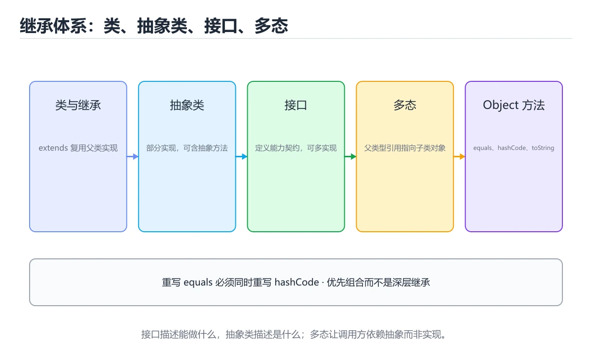
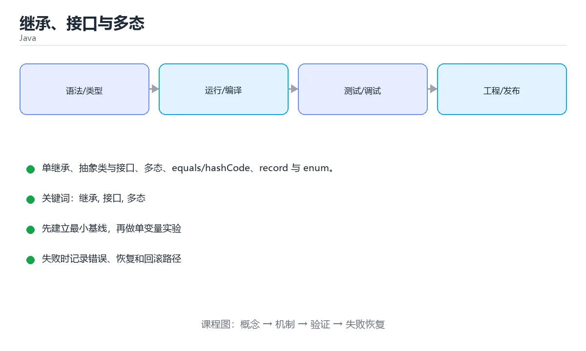

# 继承、接口与多态

> 内容更新时间：2026-10-03





## 学习目标

- 能用自己的话解释继承、接口与多态解决了什么问题，而不是只背术语。
- 能说清 「继承」、「接口」、「多态」、「equals」 之间的关系，并分别举出一个例子。
- 能把本课知识放回「Java」的知识体系，说明它和相邻主题的边界。
- 能完成本课练习，并用验收标准检查自己的结果。

> 一句话摘要：单继承、抽象类与接口、多态、equals/hashCode、record 与 enum。

## 前置知识

- 先完成上一课《类与对象》；如果已经掌握，可以直接用本课练习自测。
- 本课阶段：进阶。建议先掌握同一分类的基础课程，并能独立运行正文中的最小示例。
- 开始前先复习：继承、接口、多态。
- 如果某一步看不懂，先记录具体卡点，完成练习后再回头读一遍。

## 继承

```java
public class Animal {
    protected final String name;

    public Animal(String name) { this.name = name; }

    public String speak() { return "..."; }
}

public class Cat extends Animal {
    public Cat(String name) { super(name); }

    @Override
    public String speak() { return name + " 喵"; }
}
```

Java 只支持单继承；`super` 调用父类构造器或方法，`final` 修饰的类不能被继承。

## 抽象类与接口

```java
public abstract class Shape {
    public abstract double area();               // 抽象方法
    public String describe() { return "面积 " + area(); }
}

public interface Comparable2 {
    int compareTo(Object other);                 // 默认 public abstract
    default boolean isGreater(Object other) {    // 默认方法
        return compareTo(other) > 0;
    }
    static Comparable2 naturalOrder() { return null; }
}

class Circle extends Shape implements Comparable2 {
    private final double radius;
    Circle(double radius) { this.radius = radius; }

    @Override public double area() { return Math.PI * radius * radius; }
    @Override public int compareTo(Object other) { return 0; }
}
```

选择原则：**抽象类描述「是什么」，接口描述「能做什么」**；优先面向接口编程。

## 多态

```java
Shape shape = new Circle(2);       // 父类型引用指向子类对象
System.out.println(shape.area());  // 运行时调用 Circle 的实现

if (shape instanceof Circle circle) {   // Java 16+ 模式匹配
    System.out.println(circle.area());
}
```

## Object 的通用方法

```java
@Override
public boolean equals(Object other) {
    if (this == other) return true;
    if (!(other instanceof Point p)) return false;
    return x == p.x && y == p.y;
}

@Override
public int hashCode() { return Objects.hash(x, y); }

@Override
public String toString() { return "Point(" + x + ", " + y + ")"; }
```

约定：**equals 相等则 hashCode 必须相等**，否则放进 HashMap/HashSet 会出问题。

## record 与 enum

```java
public record Point(int x, int y) { }     // Java 16+：不可变数据载体，自带 equals/hashCode/toString

enum Status {
    NEW, RUNNING, DONE;
}
```

## 本课小结
继承复用实现，接口定义契约，多态让调用方只依赖抽象。重写 equals 时别忘了 hashCode。

## 抽象类与接口速查

| 维度 | 抽象类 | 接口 |
| --- | --- | --- |
| 关键字 | `abstract class` | `interface` |
| 继承数量 | 只能继承一个 | 可以实现多个 |
| 构造器 | 有 | 无 |
| 字段 | 任意字段 | 只能是 `public static final` 常量 |
| 方法实现 | 可以有 | 可以有 `default` / `static` 方法 |
| 适用 | 共享状态与部分实现 | 定义能力契约 |

多态速查：

| 概念 | 说明 |
| --- | --- |
| 向上转型 | 父类引用指向子类对象，安全 |
| 向下转型 | 需要显式转换，转换失败抛 `ClassCastException` |
| 运行时多态 | 调用被重写的方法执行子类实现 |
| `@Override` | 编译期检查是否真的重写 |
| 动态分派 | 按实际对象类型选择方法 |
| 静态方法 | 不参与多态，按引用类型调用 |

```java
public interface PaymentMethod {
    void pay(long cents);

    default String describe() {
        return "支付方式：" + name();
    }

    static PaymentMethod of(String type) {
        return switch (type) {
            case "alipay" -> new Alipay();
            case "card" -> new Card();
            default -> throw new IllegalArgumentException("不支持：" + type);
        };
    }
}
```

## 常见错误对照表

| 容易写错的做法 | 实际现象 | 原因与正确做法 |
| --- | --- | --- |
| 忘记 `@Override` | 拼错方法名后变成新方法，不报错 | 重写方法一律加注解 |
| 用 `==` 比较对象内容 | 结果不符合预期 | 重写 `equals` 或用 `Objects.equals` |
| 父类构造器没有无参构造，子类未调用 | 编译错误 | 子类构造器显式 `super(...)` |
| 向下转型不判断 | `ClassCastException` | 先 `instanceof` 再转换 |
| 在父类构造器里调用被重写方法 | 子类状态未初始化 | 构造器只调用 `private` / `final` 方法 |
| 接口里放可变状态 | 编译不允许或语义混乱 | 状态放实现类，接口只定义行为 |
| 用继承复用工具代码 | 层级僵化 | 优先组合，必要时才继承 |
| `default` 方法冲突 | 编译错误：类继承了不相关的方法 | 在实现类中显式重写解决冲突 |
| 静态方法想被重写 | 编译不报错但行为不符合预期 | 静态方法按类型调用，不参与多态 |
| 把父类字段设为 `protected` | 子类强耦合 | 用私有字段 + `protected` 方法 |

## 自测清单

- [ ] 能说出抽象类与接口的取舍标准。
- [ ] 重写方法一定加 `@Override`。
- [ ] 向下转型前先用 `instanceof` 判断。
- [ ] 优先用组合而不是继承复用代码。
- [ ] 构造器中不调用可被重写的方法。

## 零基础详解：继承、多态与组合

### 一句话说清它是什么

继承表达「是一种」，多态让父类变量在运行时表现子类行为，组合表达「有一个」。
Java 只允许单继承类，但可以实现多个接口——**优先用组合和接口，继承控制在两层内**。

### 用生活比喻理解

| 概念 | 比喻 | 说明 |
| --- | --- | --- |
| 继承 | 家族血脉 | 子类天然拥有父类能力 |
| `super` | 向父母请教 | 调用父类实现 |
| 抽象类 | 未完成的说明书 | 必须由子类补全 |
| 接口 | 岗位要求 | 谁满足谁上岗，可多个 |
| 组合 | 组装零件 | 用对象当成员，而不是继承 |

### 完整示例：形状与面积

```java
public interface Shape {
    String name();
    double area();

    default String describe() {                 // 接口默认方法
        return "%s 面积 %.2f".formatted(name(), area());
    }
}

public abstract class AbstractShape implements Shape {
    private final String name;

    protected AbstractShape(String name) {
        this.name = name;
    }

    @Override
    public final String name() {
        return name;
    }
}

public final class Circle extends AbstractShape {
    private final double radius;

    public Circle(double radius) {
        super("圆形");
        if (radius <= 0) throw new IllegalArgumentException("半径必须为正");
        this.radius = radius;
    }

    @Override
    public double area() {
        return Math.PI * radius * radius;
    }
}

public final class Rectangle extends AbstractShape {
    private final double width;
    private final double height;

    public Rectangle(double width, double height) {
        super("矩形");
        this.width = width;
        this.height = height;
    }

    @Override
    public double area() {
        return width * height;
    }

    @Override
    public String describe() {
        return Shape.super.describe() + "（四边形）";
    }
}
```

### 多态的三种体现

```java
List<Shape> shapes = List.of(new Circle(2), new Rectangle(3, 4));
for (Shape shape : shapes) {
    System.out.println(shape.describe());       // 同一调用，不同实现
}

// 向上转型：子类对象赋值给父类变量
Shape s = new Circle(1);

// 向下转型：先判断再转，避免 ClassCastException
if (s instanceof Circle c) {                    // 模式匹配（Java 16+）
    System.out.println(c.area());
}
```

### 五个关键修饰符

| 修饰符 | 作用 | 使用建议 |
| --- | --- | --- |
| `abstract` | 必须由子类实现 | 只放真正共有的成员 |
| `final`（类） | 禁止继承 | 工具类、值对象常用 |
| `final`（方法） | 禁止重写 | 关键逻辑不希望被改 |
| `protected` | 子类可访问 | 谨慎使用，容易破坏封装 |
| `@Override` | 声明重写 | **总是写**，让编译器检查 |

### 继承 vs 组合：一个真实判断

```java
// 反例：为了复用代码而继承，结果 Stack 拥有了 List 的全部方法
class BadStack<T> extends ArrayList<T> { }

// 正例：组合 + 只暴露需要的方法
public class GoodStack<T> {
    private final Deque<T> items = new ArrayDeque<>();

    public void push(T item) { items.push(item); }
    public T pop() { return items.pop(); }
    public boolean isEmpty() { return items.isEmpty(); }
}
```

**判断标准**：如果能说出「子类是一种父类」，才考虑继承；否则用组合。

### 抽象类与接口的取舍

| 对比 | 抽象类 | 接口 |
| --- | --- | --- |
| 数量 | 只能继承一个 | 可实现多个 |
| 状态 | 可以有实例字段 | 只能是常量 |
| 构造方法 | 有 | 没有 |
| 方法 | 抽象 + 具体 | 抽象 + 默认 + 静态 |
| 表达 | 「是什么」 | 「能做什么」 |
| 何时用 | 需要共享实现与状态 | 需要跨类型统一能力 |

### 新手最容易踩的八个坑

| 坑 | 现象 | 正确做法 |
| --- | --- | --- |
| 忘了 `@Override` | 拼错方法名变成新方法 | 总是加注解 |
| 用继承复用代码 | 层次深、耦合重 | 优先组合 |
| 在构造方法里调可重写方法 | 子类字段还没初始化 | 构造完再调用 |
| 子类访问 `protected` 字段 | 破坏封装 | 提供 `protected` 方法 |
| 忘记 `super(...)` | 编译错误 | 显式调用父类构造 |
| 用 `==` 比较对象 | 比的是地址 | 重写 `equals` 与 `hashCode` |
| 强转前不判断类型 | `ClassCastException` | 用 `instanceof` 模式匹配 |
| 把可变对象暴露出去 | 外部能改内部状态 | 返回副本或不可变视图 |

### 手把手练习：支付方式多态

```java
public interface Payment {
    String name();
    long feeCents(long amountCents);
}

public final class Alipay implements Payment {
    @Override public String name() { return "支付宝"; }
    @Override public long feeCents(long amountCents) {
        return Math.round(amountCents * 0.006);
    }
}

public final class BankCard implements Payment {
    @Override public String name() { return "银行卡"; }
    @Override public long feeCents(long amountCents) {
        return amountCents >= 100_000 ? 0 : 200;
    }
}

void main() {
    List<Payment> methods = List.of(new Alipay(), new BankCard());
    long amount = 80_000;
    for (Payment p : methods) {
        long fee = p.feeCents(amount);
        System.out.printf("%s 手续费 %.2f 元，实收 %.2f 元%n",
                p.name(), fee / 100.0, (amount - fee) / 100.0);
    }
}
```

### 学完自测

- [ ] 能说出继承与组合的判断标准。
- [ ] 知道为什么 `@Override` 一定要写。
- [ ] 能说出抽象类与接口的三点区别。
- [ ] 知道在构造方法里调可重写方法的风险。
- [ ] 能说出向上转型与向下转型的区别。

## 动手练习

> 本课练习重点：围绕「继承、接口、多态」完成复述、实验和交付，每个结果都要能被别人检查。

先跑通最小类与测试，再补异常和并发边界，最后观察线程与资源变化。

### 练习 1：建立心智模型（10 分钟）

合上教程，用 3～5 句话回答：

1. 继承、接口与多态解决了什么问题？
2. 如果没有它，会出现什么具体后果？
3. 它和「接口」是什么关系？

**验收标准**：至少出现一个本课关键词，并写出一个反例、边界条件或失效场景。

### 练习 2：做一次可控实验（20 分钟）

从正文中选一个最小示例，完成以下操作：

1. 先预测修改一个参数、输入或步骤后的结果。
2. 再实际执行或逐步推演，记录真实结果。
3. 如果结果与预测不同，写出差异原因。

**验收标准**：留下「原例 → 改动 → 预测 → 结果 → 原因」五步记录。

### 练习 3：交付一个小结果（30 分钟）

写一个可运行的小类，补一个普通测试和一个边界输入测试。

任务要求：

- 结果必须能被别人检查，不能只写“我已经理解了”。
- 至少覆盖「继承」和「接口」两个关键词。
- 写出 1 个仍然不确定的问题，以及下一步如何验证。

> 提示：时间有限时优先做练习 1 和练习 2；练习 3 可以拆成两次完成。

## 实践任务

本节围绕继承、接口与多态安排 3 个可交付任务，每个任务都要求留下可以复查的记录。

### 任务 1：用自己的话画出结构

不看书，用一张图说清「继承、接口与多态」的结构，画完再对照骨架：

- 主干：继承 → 抽象类与接口 → 多态 → Object 的通用方法
- 连接线：在每条边上标出输入、输出与失败路径。
- 自检：能否用一句话说明继承与接口的关系？

### 任务 2：做一次对比实验

**验收标准**：表格里两个方案的结论不能完全一样；写下“在什么条件下应该换方案”。

### 任务 3：迁移到自己的场景

**验收标准**：至少有一个可复现的命令、代码片段或数据样例；结论能被别人独立检查。

## 故障现场

### 现场 1：本课的 继承 常规用例通过，但边界用例失败

**症状**：在本课的练习或生产场景里出现“本课的 继承 常规用例通过，但边界用例失败”。

**复现**：准备一组最小输入，只保留触发“本课的 继承 常规用例通过，但边界用例失败”的必要条件，连续运行两次确认结果稳定。

**定位**：围绕“继承 的前置条件与取值边界没有写进代码，默认值掩盖了空值和极值”检查调用链、输入数据和环境配置，先验证假设再改代码。

**预防**：把“本课的 继承 常规用例通过，但边界用例失败”写成一条自动化用例，并在本课的验收清单里保留对应检查项。

### 现场 2：本课的 接口 结果在两次运行之间不一致

**症状**：在本课的练习或生产场景里出现“本课的 接口 结果在两次运行之间不一致”。

**复现**：准备一组最小输入，只保留触发“本课的 接口 结果在两次运行之间不一致”的必要条件，连续运行两次确认结果稳定。

**定位**：围绕“接口 依赖了当前版本、执行顺序或共享状态，单次运行无法暴露差异”检查调用链、输入数据和环境配置，先验证假设再改代码。

**预防**：把“本课的 接口 结果在两次运行之间不一致”写成一条自动化用例，并在本课的验收清单里保留对应检查项。

### 现场 3：本课的验证只在开发机通过

**症状**：在本课的练习或生产场景里出现“本课的验证只在开发机通过”。

**定位**：围绕“环境版本、配置和输入规模与目标环境不同，继承 缺少可重复的验证记录”检查调用链、输入数据和环境配置，先验证假设再改代码。

## 版本与时效

- Java 25 是当前 LTS，Java 21 仍是大量生产系统的基线
- 虚拟线程、记录模式、结构化并发与分代 ZGC 是升级收益最大的部分
- 升级前重点检查反射、字节码增强、序列化与第三方框架兼容性

### 升级检查清单

- 先固定当前版本，跑通全部示例与测验，再升级工具链。
- 只改一个版本变量，记录编译、测试、性能与产物体积的变化。
- 重点回归默认值、弃用警告、序列化格式、并发语义和错误信息。
- 升级完成后更新本课的“最后复核 / 下次复核”日期与版本说明。

## 本课复习清单

离开本课前，逐项确认：

- [ ] 不看解析，能说出「Java 中一个类可以继承几个父类？」的判断依据。
- [ ] 不看解析，能说出「重写 equals 时必须同时重写？」的判断依据。
- [ ] 不看解析，能说出「抽象类与接口的关系，下面说法正确的是？」的判断依据。
- [ ] 不看解析，能说出「@Override 注解的价值是？」的判断依据。
- [ ] 不看解析，能说出「父类引用指向子类对象并调用被重写的方法时，执行的是？」的判断依据。
- [ ] 至少运行一次本课示例，记录输入、输出和一个边界情况。
- [ ] 把本课最容易混淆的两个概念写成一句话对照。

| 复盘项 | 记录 |
| --- | --- |
| 已经能独立解释的考点 |  |
| 仍然说不清的概念 |  |
| 下一步验证动作 |  |

## 术语速查

| 术语 | 本课语境 |
| --- | --- |
| `super` | Java 只支持单继承；`super` 调用父类构造器或方法，`final` 修饰的类不能被继承。 |
| `final` | Java 只支持单继承；`super` 调用父类构造器或方法，`final` 修饰的类不能被继承。 |
| `abstract class` | \| 关键字 \| `abstract class` \| `interface` \| |
| `interface` | \| 关键字 \| `abstract class` \| `interface` \| |
| `public static final` | \| 字段 \| 任意字段 \| 只能是 `public static final` 常量 \| |
| `default` | \| 方法实现 \| 可以有 \| 可以有 `default` / `static` 方法 \| |

## 考点精讲

### 考点 1：多选辨析·继承

- **题目**：围绕“继承、接口与多态”中的 继承、接口、多态，下列哪两项是本课强调的实践判断？
- **判断依据**：本课把继承、接口与多态拆成概念、示例与故障现场三部分，因此判断 继承 时必须同时交代输入、输出和失败路径，这使“学习 继承 时要同时说明输入、输出和失败路径，不能只看正常流程”成立。在继承、接口与多态里，判断 接口 时要固定版本与边界输入，所以“验证 接口 时要固定版本并覆盖边界输入，结论才可复现”才可复现。

### 考点 2：代码补全·继承

- **题目**：下面这段 Java 代码摘自「继承、接口与多态」的正文示例。关于这段代码，下面哪一项说法与实际内容相符？
- **判断依据**：题干的正确项是这段代码把主要逻辑封装在函数或方法里，需要被调用才会执行，在「继承、接口与多态」里封装边界决定继承从哪一步开始生效。这段代码出自「继承、接口与多态」的正文示例，围绕继承、接口、多态展开；把输入或边界换成空值、极值或失败情况后，结论要以「继承、接口与多态」的实际运行结果为准。“下面这段”与「继承、接口与多态」的术语表相呼应，只有符合继承、接口、多态约束的“这段代码把主要逻辑封装在函数或方法里”才是正文支持的结论。

### 考点 3：概念判断·继承

- **题目**：抽象类与接口的关系，下面说法正确的是？
- **判断依据**：抽象类可以有字段和构造器，适合描述「是什么」。在「继承、接口与多态」里，如果只凭关键词作答，很容易把「两者完全等价」、「抽象类不能有方法实现」与「抽象类可以持有状态」混在一起；在「继承、接口与多态」里判断这道题，要把继承、接口、多态的条件、过程与失败路径逐项对齐，换成“抽象类与接口的关系”这个场景，只有满足前提的结论才成立。

### 考点 4：概念判断·继承

- **题目**：@Override 注解的价值是？
- **判断依据**：在「继承、接口与多态」里，结论应落在「让编译器检查是否真的重写了父类/接口方法，避免拼写错误」。结论应落在让编译器检查是否真的重写了父类/接口方法。写成 @Overide 或签名不一致时编译器会报错，是廉价而有效的保护。在「继承、接口与多态」里，这道题要求区分概念与边界，「让编译器检查是否真的重写了父类/接口方法，避免拼写错误」只有在题干给出的前提下才成立，而「强制方法不能被再次重写（仅部分场景成立）」、「提升运行速度」缺少同一组条件。

### 考点 5：概念判断·继承

- **题目**：父类引用指向子类对象并调用被重写的方法时，执行的是？
- **判断依据**：在「继承、接口与多态」里，子类的实现（运行时多态）。方法调用在运行时按实际对象类型分派，这就是多态的核心。「继承、接口与多态」要求先交代继承、接口、多态的前提再下结论，所以“子类的实现（运行时多态）”只在题干“父类引用指向子类对象并调用被重写的方法时”给定的条件下成立。把“子类的实现（运行时多态）”代回「继承、接口与多态」里“父类引用指向子类对象并调用被重写的方法时”的例子核对，条件一旦改变，结论就要用继承、接口、多态重新推导。

### 考点 6：填空·继承

- **题目**：补全代码：「继承、接口与多态」示例中，下面这行代码缺少哪个关键字或函数名？请填入 ____。 `public int ____ { return Objects.hash(x, y); }`
- **判断依据**：空格应填写「hashCode」、「hashcode」。} 这样的用法，说明该关键字在本课代码中承担实际功能。这道题的关键在「继承、接口与多态」的继承、接口、多态：先确认题干“补全代码”问的是哪一步，再排除偷换前提的选项。回到继承、接口、多态本身再看一遍：只有“hashCode”与题干“接口与多态示例中”的前提一致，结论才成立。

## English Overview

**Title:** Inheritance & Interfaces

**Summary:** Inheritance, interfaces, polymorphism and records.

**Category:** Java
**Level:** 进阶
**Key terms:** 继承, 接口, 多态, equals, hashCode, record

## 内容元数据

- 内容版本：v2.0
- 最后更新：2026-10-03
- 学习阶段：进阶
- 适用环境：Java 21+ / Maven 或 Gradle
- 内容来源：内置结构化课程与工程实践整理
- 相关主题：继承、接口、多态、equals、hashCode、record
- 质量版本：P0 测验标准 + P1 覆盖扩展 + P2 体验补全

## 参考资料与复核

- 最后复核：2026-10-04
- 下次复核：2027-04-04
- 复核范围：版本兼容、API 行为、安全建议与工程实践
- 来源性质：官方文档、标准或权威教材；正文为离线教学重组

| 参考资料 | 本课用途 |
| --- | --- |
| [dev.java 学习](https://dev.java/learn/) | 现代 Java 官方教程 |
| [Gradle 文档](https://docs.gradle.org/current/userguide/userguide.html) | 构建脚本与依赖管理 |
| [Java 并发教程](https://docs.oracle.com/javase/tutorial/essential/concurrency/) | 线程、同步与并发工具 |

> 「继承、接口与多态」的链接用于离线阅读后的延伸核对；App 不会自动联网。
