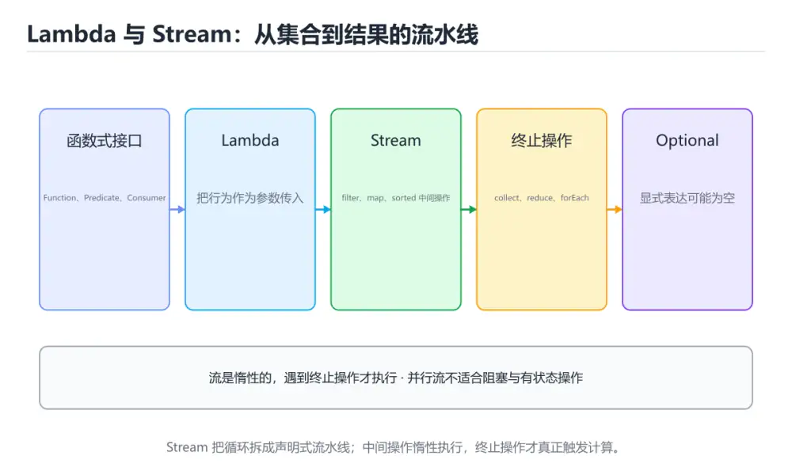
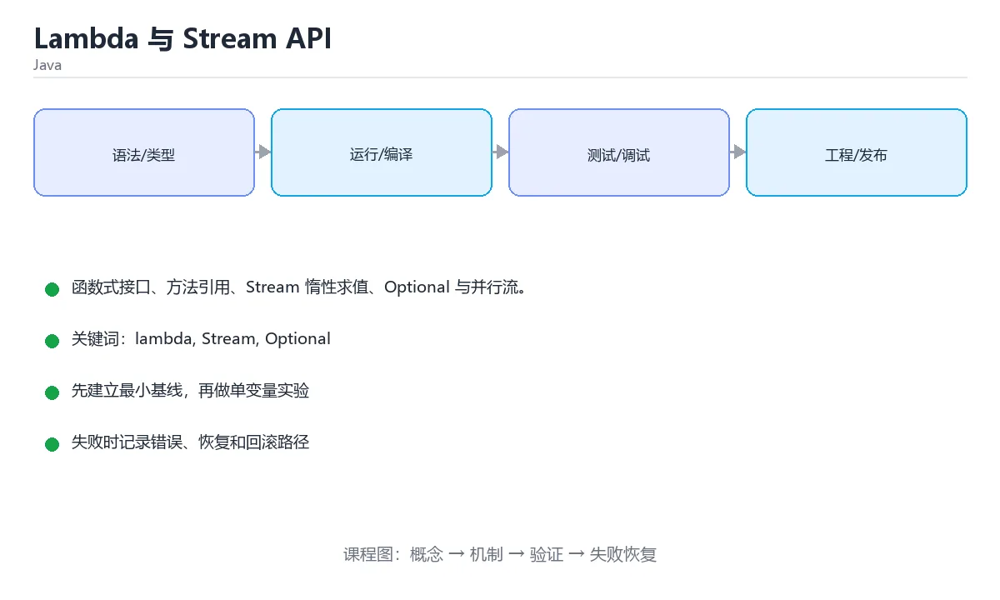

# Lambda 与 Stream API

> 内容更新时间：2026-10-06 · 学习阶段：进阶 · 预计用时：40 分钟





## 学习目标

- 能用自己的话解释Lambda 与 Stream API解决了什么问题，而不是只背术语。
- 能说清 「lambda」、「Stream」、「Optional」、「函数式接口」 之间的关系，并分别举出一个例子。
- 能把本课知识放回「Java」的知识体系，说明它和相邻主题的边界。
- 能完成本课练习，并用验收标准检查自己的结果。

> 一句话摘要：函数式接口、方法引用、Stream 惰性求值、Optional 与并行流。

## 前置知识

- 先完成上一课《异常处理与文件 IO》；如果已经掌握，可以直接用本课练习自测。
- 本课阶段：进阶。建议先掌握同一分类的基础课程，并能独立运行正文中的最小示例。
- 开始前先复习：lambda、Stream、Optional。
- 如果某一步看不懂，先记录具体卡点，完成练习后再回头读一遍。

## 函数式接口

只有一个抽象方法的接口就是函数式接口，可以用 lambda 实现。

```java
@FunctionalInterface
interface Calculator {
    int apply(int a, int b);
}

Calculator add = (a, b) -> a + b;
Calculator max = Integer::max;          // 方法引用

System.out.println(add.apply(1, 2));
```

JDK 内置四大接口：

| 接口 | 签名 | 用途 |
| --- | --- | --- |
| `Supplier<T>` | `() -> T` | 提供值 |
| `Consumer<T>` | `T -> void` | 消费值 |
| `Function<T,R>` | `T -> R` | 转换 |
| `Predicate<T>` | `T -> boolean` | 判断 |

## Stream 常用操作

```java
import java.util.*;
import java.util.stream.*;

List<String> names = List.of("tom", "alice", "bob", "anna");

List<String> result = names.stream()
        .filter(n -> n.length() > 3)          // 中间操作：惰性
        .map(String::toUpperCase)            // 转换
        .sorted()                            // 排序
        .distinct()                          // 去重
        .limit(10)
        .collect(Collectors.toList());       // 终止操作：触发执行

System.out.println(result);

// 分组与统计
Map<Integer, List<String>> byLength = names.stream()
        .collect(Collectors.groupingBy(String::length));

long count = names.stream().filter(n -> n.startsWith("a")).count();
int totalLength = names.stream().mapToInt(String::length).sum();
```

中间操作（`filter`/`map`/`sorted`）不会立刻执行，只有遇到终止操作（`collect`/`forEach`/`count`/`reduce`）才会遍历一次。

## Optional

```java
Optional<String> maybe = names.stream()
        .filter(n -> n.startsWith("z"))
        .findFirst();

String value = maybe.orElse("默认值");
maybe.ifPresent(System.out::println);

// 不要用 optional.get()，先判断或使用 orElseThrow
```

## 并行流与注意事项

```java
long total = IntStream.rangeClosed(1, 1_000_000)
        .parallel()
        .filter(n -> n % 2 == 0)
        .count();
```

并行流使用公共 ForkJoinPool，适合纯计算且数据量大；有共享可变状态、IO 操作时不要用。

## Stream 常见误用与性能提示

| 误用 | 后果 | 正确做法 |
| --- | --- | --- |
| 在 forEach 里修改外部集合 | 并发修改异常或结果不确定 | 用 collect 生成新集合 |
| 中途忘记终止操作 | 代码根本不执行（流是惰性的） | 以 collect/forEach/reduce 收尾 |
| 在流里做重 IO 或远程调用 | 延迟叠加、线程池被打满 | 外提为批量操作或异步任务 |
| 无脑用 parallelStream | 公共 ForkJoinPool 被占满，拖慢全局 | 仅纯计算且数据量大时用，或自定义池 |
| 反复遍历同一个流 | 流只能消费一次，第二次抛异常 | 需要多次使用先 collect 成集合 |

性能取舍：小数据量（几百条）用普通循环往往更快——流有对象创建与装箱开销；可读性收益明显时用流，热点路径则实测后决定。基本类型流用 `IntStream/LongStream` 避免装箱，`mapToInt` + `sum` 比 `map` + `reduce` 更高效。

## 本课小结

Lambda + Stream 让集合处理变成声明式：**先说做什么（filter/map），再收集结果（collect）**。代码更短，但要注意惰性求值与副作用。

## Stream 操作速查

| 类别 | 方法 | 作用 |
| --- | --- | --- |
| 创建 | `list.stream()`、`Stream.of(...)`、`IntStream.range(0, n)` | 生成流 |
| 中间操作 | `filter` | 过滤 |
| 中间操作 | `map` / `mapToInt` | 映射（后者避免装箱） |
| 中间操作 | `flatMap` | 一个元素展开成多个 |
| 中间操作 | `distinct` / `sorted` / `limit` / `skip` | 去重、排序、截断、跳过 |
| 中间操作 | `peek` | 调试用，正式代码慎用 |
| 终止操作 | `collect(Collectors.toList())` | 收集成集合 |
| 终止操作 | `toList()`（Java 16+） | 更简洁的收集 |
| 终止操作 | `count` / `sum` / `average` / `max` / `min` | 统计 |
| 终止操作 | `anyMatch` / `allMatch` / `noneMatch` | 条件判断（可短路） |
| 终止操作 | `findFirst` / `findAny` | 取元素，返回 `Optional` |
| 终止操作 | `forEach` | 副作用，避免在流里改外部状态 |
| 终止操作 | `reduce` | 归约成单个值 |

收集器速查：

| 目的 | 写法 |
| --- | --- |
| 收集成 List | `.collect(Collectors.toList())` |
| 收集成 Set | `.collect(Collectors.toSet())` |
| 收集成 Map | `.collect(Collectors.toMap(Key::get, Value::get, (a, b) -> a))` |
| 分组 | `.collect(Collectors.groupingBy(Item::category))` |
| 分组后计数 | `.collect(Collectors.groupingBy(Item::cat, Collectors.counting()))` |
| 分组后求平均 | `.collect(Collectors.groupingBy(Item::cat, Collectors.averagingInt(Item::price)))` |
| 分区（按布尔） | `.collect(Collectors.partitioningBy(Item::active))` |
| 拼接字符串 | `.collect(Collectors.joining(", ", "[", "]"))` |

```java
// 常见组合：过滤 -> 去重 -> 排序 -> 取前 3 -> 转列表
List<String> top = orders.stream()
        .filter(Order::paid)
        .map(Order::userId)
        .distinct()
        .sorted()
        .limit(3)
        .toList();

// 分组统计：每个类目的订单总额
Map<String, Integer> amountByCategory = orders.stream()
        .collect(Collectors.groupingBy(
                Order::category,
                Collectors.summingInt(Order::amount)));
```

## 常见错误与排查

| 容易写错的做法 | 实际现象 | 原因与正确做法 |
| --- | --- | --- |
| 流被重复消费 | `IllegalStateException: stream has already been operated upon or closed` | 流只能消费一次，需要复用就重新 `stream()` |
| 忘记写终止操作 | 什么都不执行 | `filter`、`map` 都是惰性的，必须 `collect`、`forEach` 等触发 |
| 在 `forEach` 里修改外部集合 | 代码难以推理，并行时出错 | 用 `collect` 生成结果，避免副作用 |
| 用并行流处理 IO | 线程池被占满，性能更差 | 并行流适合纯 CPU 计算，IO 用专门的线程池 |
| `toMap` 遇到重复键 | `IllegalStateException: Duplicate key` | 提供合并函数 `(a, b) -> a` |
| `toMap` 的 value 为 null | `NullPointerException` | 先过滤或改用 `HashMap` 手动填充 |
| `Optional.get()` 直接取值 | `NoSuchElementException` | 用 `orElse`、`orElseThrow`、`ifPresent` |
| `map` 里返回 `null` | 后续出现空指针 | 用 `flatMap` + `Optional` 过滤空值 |
| 在 `peek` 里做核心逻辑 | 可能被优化掉或跳过 | `peek` 只用于调试 |
| 大量装箱操作 | 性能下降 | 用 `mapToInt`、`IntStream` 等原始类型流 |
| 用 `sorted()` 排大集合 | 慢且占内存 | 数据量大时考虑数据库排序或 TopK 结构 |

## 复习与自测

- [ ] 能列出常用中间操作与终止操作，并知道流是惰性的。
- [ ] 会用 `Collectors.groupingBy` 做分组统计。
- [ ] `toMap` 时提供合并函数避免重复键异常。
- [ ] 用 `Optional` 的 `orElse` / `orElseThrow` 替代 `get()`。
- [ ] 并行流只用于纯 CPU 计算，且先做性能验证。

## 零基础详解：Lambda 与 Stream 流水线

### 一句话说清它是什么

Lambda 是「把一小段行为当成参数传进去」，Stream 是「用一串链式操作处理集合」。
两者配合，能把过去要写十几行的循环压缩成一条清晰的数据流水线。

### 用生活比喻理解

| 概念 | 比喻 | 说明 |
| --- | --- | --- |
| 函数式接口 | 只干一件事的岗位 | 只有一个抽象方法，才能用 Lambda |
| Lambda | 临时工 | 现场写一段行为，不用新建类 |
| 方法引用 | 直接派老员工上 | 已有方法可复用，写法更短 |
| Stream | 流水线 | 一环一环加工数据 |
| 中间操作 | 加工工位 | `filter`、`map`，返回新流 |
| 终止操作 | 出货口 | `collect`、`sum`，触发实际计算 |

### Lambda 的四步演化

```java
List<String> names = List.of("小明", "小红", "小刚");

// 1. 匿名内部类（老写法，啰嗦）
names.forEach(new Consumer<String>() {
    @Override
    public void accept(String s) { System.out.println(s); }
});

// 2. Lambda
names.forEach(s -> System.out.println(s));

// 3. 方法引用（更短）
names.forEach(System.out::println);

// 4. 带条件与方法链
names.stream()
     .filter(s -> s.startsWith("小"))
     .map(String::toUpperCase)
     .forEach(System.out::println);
```

### 四个内置函数式接口

| 接口 | 输入 | 输出 | 典型用途 |
| --- | --- | --- | --- |
| `Function<T,R>` | T | R | 映射变换 |
| `Consumer<T>` | T | 无 | 遍历打印、写库 |
| `Supplier<T>` | 无 | T | 延迟创建对象 |
| `Predicate<T>` | T | boolean | 条件过滤 |

### Stream 常用操作

```java
record Student(String name, String team, int score) {}

var students = List.of(
    new Student("小明", "A", 88),
    new Student("小红", "B", 95),
    new Student("小刚", "A", 59),
    new Student("小美", "B", 72)
);

// 过滤 + 映射 + 收集
List<String> passed = students.stream()
    .filter(s -> s.score() >= 60)
    .map(Student::name)
    .toList();

// 分组
Map<String, List<Student>> byTeam = students.stream()
    .collect(Collectors.groupingBy(Student::team));

// 聚合
double average = students.stream()
    .mapToInt(Student::score)
    .average()
    .orElse(0);

// 转成映射表
Map<String, Integer> scoreMap = students.stream()
    .collect(Collectors.toMap(Student::name, Student::score));
```

| 操作 | 类型 | 作用 |
| --- | --- | --- |
| `filter` | 中间 | 按条件筛选 |
| `map` / `mapToInt` | 中间 | 转换元素或转基本类型流 |
| `sorted` / `distinct` / `limit` | 中间 | 排序、去重、截断 |
| `collect` / `toList` | 终止 | 收集结果 |
| `reduce` | 终止 | 自定义聚合 |
| `anyMatch` / `allMatch` | 终止 | 条件判断 |
| `findFirst` | 终止 | 取第一个（配合 Optional） |

### Optional：不用再返回 null

```java
Optional<Student> top = students.stream()
    .max(Comparator.comparingInt(Student::score));

String name = top.map(Student::name).orElse("无数据");
top.ifPresent(s -> System.out.println("最高分：" + s.name()));

// 注意：orElse 无论是否需要都会执行参数；需要延迟创建用 orElseGet
String value = top.map(Student::name).orElseGet(() -> "计算出来的默认值");
```

### 新手最容易踩的八个坑

| 坑 | 现象 | 正确做法 |
| --- | --- | --- |
| 把 Stream 当集合复用 | `IllegalStateException: stream has already been operated upon` | 每条流水线只用一个流 |
| 中间操作不触发执行 | 什么也没发生 | 必须有终止操作 |
| Lambda 里改变量 | 编译错误 | 捕获的局部变量必须是事实上的 final |
| 在循环里反复建流 | 性能变差 | 一次流水线完成 |
| 乱用并行流 | 结果错乱或更慢 | 只在数据量大且无副作用时用 |
| `toMap` 键重复 | `IllegalStateException` | 提供合并函数 |
| 用 `orElse` 做重计算 | 每次都白算 | 改用 `orElseGet` |
| 忘记处理 Optional | 直接 `get()` 抛异常 | 用 `orElse`、`ifPresent` |

### 手把手练习：生成成绩报表

```java
import java.util.*;
import java.util.stream.*;

public class Report {
    record Student(String name, String team, int score) {}

    public static void main(String[] args) {
        var students = List.of(
            new Student("小明", "A", 88),
            new Student("小红", "B", 95),
            new Student("小刚", "A", 59),
            new Student("小美", "B", 72)
        );

        Map<String, IntSummaryStatistics> stats = students.stream()
            .collect(Collectors.groupingBy(
                Student::team,
                Collectors.summarizingInt(Student::score)));

        stats.forEach((team, s) -> System.out.printf(
            "%s 队：%d 人，均分 %.1f，最高 %d%n",
            team, s.getCount(), s.getAverage(), s.getMax()));

        String topNames = students.stream()
            .filter(s -> s.score() >= 80)
            .sorted(Comparator.comparingInt(Student::score).reversed())
            .map(Student::name)
            .collect(Collectors.joining("、"));
        System.out.println("80 分以上：" + topNames);
    }
}
```

### 学完自测

- [ ] 能说出 Lambda 与匿名内部类的关系。
- [ ] 能区分 Stream 的中间操作与终止操作。
- [ ] 知道为什么中间操作不写终止操作就不会执行。
- [ ] 能说出 `orElse` 与 `orElseGet` 的差别。
- [ ] 会用 `groupingBy` 加 `summarizingInt` 生成分组统计。

## 动手练习

> 本课练习重点：围绕「lambda、Stream、Optional」完成复述、实验和交付，每个结果都要能被别人检查。

先跑通最小类与测试，再补异常和并发边界，最后观察线程与资源变化。

### 练习 1：建立心智模型（10 分钟）

合上教程，用 3～5 句话回答：

1. Lambda 与 Stream API解决了什么问题？
2. 如果没有它，会出现什么具体后果？
3. 它和「Stream」是什么关系？

**验收标准**：至少出现一个本课关键词，并写出一个反例、边界条件或失效场景。

### 练习 2：做一次可控实验（20 分钟）

从正文中选一个最小示例，完成以下操作：

1. 先预测修改一个参数、输入或步骤后的结果。
2. 再实际执行或逐步推演，记录真实结果。
3. 如果结果与预测不同，写出差异原因。

**验收标准**：留下「原例 → 改动 → 预测 → 结果 → 原因」五步记录。

### 练习 3：交付一个小结果（30 分钟）

写一个可运行的小类，补一个普通测试和一个边界输入测试。

任务要求：

- 结果必须能被别人检查，不能只写“我已经理解了”。
- 至少覆盖「lambda」和「Stream」两个关键词。
- 写出 1 个仍然不确定的问题，以及下一步如何验证。

> 提示：时间有限时优先做练习 1 和练习 2；练习 3 可以拆成两次完成。

## 可运行练习

本节围绕Lambda 与 Stream API安排 3 个可交付任务，每个任务都要求留下可以复查的记录。

### 任务 1：用自己的话画出结构

不看书，用一张图说清「Lambda 与 Stream API」的结构，画完再对照骨架：

- 主干：函数式接口 → Stream 常用操作 → 并行流与注意事项 → Stream 常见误用与性能提示
- 连接线：在每条边上标出输入、输出与失败路径。
- 自检：能否用一句话说明lambda与Stream的关系？

### 任务 2：做一次对比实验

**验收标准**：表格里两个方案的结论不能完全一样；写下“在什么条件下应该换方案”。

### 任务 3：迁移到自己的场景

**验收标准**：至少有一个可复现的命令、代码片段或数据样例；结论能被别人独立检查。

## 故障现场

### 现场 1：本课的 lambda 常规用例通过，但边界用例失败

**症状**：在本课的练习或生产场景里出现“本课的 lambda 常规用例通过，但边界用例失败”。

**复现**：准备一组最小输入，只保留触发“本课的 lambda 常规用例通过，但边界用例失败”的必要条件，连续运行两次确认结果稳定。

**定位**：围绕“lambda 的前置条件与取值边界没有写进代码，默认值掩盖了空值和极值”检查调用链、输入数据和环境配置，先验证假设再改代码。

**预防**：把“本课的 lambda 常规用例通过，但边界用例失败”写成一条自动化用例，并在本课的验收清单里保留对应检查项。

### 现场 2：本课的 Stream 结果在两次运行之间不一致

**症状**：在本课的练习或生产场景里出现“本课的 Stream 结果在两次运行之间不一致”。

**复现**：准备一组最小输入，只保留触发“本课的 Stream 结果在两次运行之间不一致”的必要条件，连续运行两次确认结果稳定。

**定位**：围绕“Stream 依赖了当前版本、执行顺序或共享状态，单次运行无法暴露差异”检查调用链、输入数据和环境配置，先验证假设再改代码。

**预防**：把“本课的 Stream 结果在两次运行之间不一致”写成一条自动化用例，并在本课的验收清单里保留对应检查项。

### 现场 3：本课的验证只在开发机通过

**症状**：在本课的练习或生产场景里出现“本课的验证只在开发机通过”。

**定位**：围绕“环境版本、配置和输入规模与目标环境不同，lambda 缺少可重复的验证记录”检查调用链、输入数据和环境配置，先验证假设再改代码。

## 版本与时效

- Java 25 是当前 LTS，Java 21 仍是大量生产系统的基线
- 虚拟线程、记录模式、结构化并发与分代 ZGC 是升级收益最大的部分
- 升级前重点检查反射、字节码增强、序列化与第三方框架兼容性

### 升级检查清单

- 先固定当前版本，跑通全部示例与测验，再升级工具链。
- 只改一个版本变量，记录编译、测试、性能与产物体积的变化。
- 重点回归默认值、弃用警告、序列化格式、并发语义和错误信息。
- 升级完成后更新本课的“最后复核 / 下次复核”日期与版本说明。

## 本课复习清单

离开本课前，逐项确认：

- [ ] 不看解析，能说出「Stream 的中间操作（filter/map）什么时候真正执行？」的判断依据。
- [ ] 不看解析，能说出「函数式接口的判断标准是？」的判断依据。
- [ ] 不看解析，能说出「关于 Optional，推荐的做法是？」的判断依据。
- [ ] 不看解析，能说出「Stream 的 collect 与 forEach 的区别是？」的判断依据。
- [ ] 不看解析，能说出「方法引用 String::length 等价于哪个 lambda？」的判断依据。
- [ ] 不看解析，能说出的判断依据。
- [ ] 至少运行一次本课示例，记录输入、输出和一个边界情况。
- [ ] 把本课最容易混淆的两个概念写成一句话对照。

| 复盘项 | 记录 |
| --- | --- |
| 已经能独立解释的考点 |  |
| 仍然说不清的概念 |  |
| 下一步验证动作 |  |

## 术语速查

| 术语 | 本课语境 |
| --- | --- |
| `Supplier<T>` | \| `Supplier<T>` \| `() -> T` \| 提供值 \| |
| `() -> T` | \| `Supplier<T>` \| `() -> T` \| 提供值 \| |
| `Consumer<T>` | \| `Consumer<T>` \| `T -> void` \| 消费值 \| |
| `T -> void` | \| `Consumer<T>` \| `T -> void` \| 消费值 \| |
| `Function<T,R>` | \| `Function<T,R>` \| `T -> R` \| 转换 \| |
| `T -> R` | \| `Function<T,R>` \| `T -> R` \| 转换 \| |

## 考点精讲

### 考点 1：概念判断·lambda

- **题目**：Stream 的中间操作（filter/map）什么时候真正执行？
- **判断依据**：在「Lambda 与 Stream API」里，遇到终止操作时才执行。中间操作是惰性的，只有 collect/forEach/count 等终止操作才会触发一次遍历。回到「Lambda 与 Stream API」的正文示例，用“Stream 的中间操作（filte”走一遍lambda、Stream、Optional的完整流程，能复现的结论才可以保留。

### 考点 2：代码补全·lambda

- **题目**：下面这段 Java 代码摘自「Lambda 与 Stream API」的正文示例。关于这段代码，下面哪一项说法与实际内容相符？
- **判断依据**：在「Lambda 与 Stream API」里，这段代码会产生可观察的输出，运行后能看到结果。这段代码出自「Lambda 与 Stream API」的正文示例，围绕lambda、Stream、Optional展开；把输入或边界换成空值、极值或失败情况后，结论要以「Lambda 与 Stream API」的实际运行结果为准。

### 考点 3：多选辨析·lambda

- **题目**：围绕“Lambda 与 Stream API”中的 lambda、Stream、Optional，下列哪两项是本课强调的实践判断？
- **判断依据**：本课把Lambda 与 Stream API拆成概念、示例与故障现场三部分，因此判断 lambda 时必须同时交代输入、输出和失败路径，这使“学习 lambda 时要同时说明输入、输出和失败路径，不能只看正常流程”成立。在Lambda 与 Stream API里，判断 Stream 时要固定版本与边界输入，所以“验证 Stream 时要固定版本并覆盖边界输入，结论才可复现”才可复现。

### 考点 4：概念判断·lambda

- **题目**：Stream 的 collect 与 forEach 的区别是？
- **判断依据**：在「Lambda 与 Stream API」里，结论应落在「collect 是终止操作，把结果汇总成集合」。结论应落在collect 是终止操作。在流里修改外部状态是常见坏味道，能 collect 就优先 collect。在「Lambda 与 Stream API」里，这道题要求区分概念与边界，「collect 是终止操作，把结果汇总成集合」只有在题干给出的前提下才成立，而「collect 只能用于并行流」、「两者都返回 Stream」缺少同一组条件。

### 考点 5：概念判断·lambda

- **题目**：方法引用 String::length 等价于哪个 lambda？
- **判断依据**：方法引用是 lambda 的语法糖，可读性更好，也能表达构造器引用 Class::new。在「Lambda 与 Stream API」里，其他选项：方法引用把接收者作为隐式参数传入，因此 String::length 等价于 s -> s.length。「Lambda 与 Stream API」要求先交代lambda、Stream、Optional的前提再下结论，所以“s -> s.length”只在题干“方法引用 String”给定的条件下成立。

### 考点 6：填空·@____

- **题目**：补全代码：「Lambda 与 Stream API」示例中，下面这行代码缺少哪个关键字或函数名？请填入 ____。 `@____`
- **判断依据**：空格应填写「FunctionalInterface」、「functionalinterface」。在「Lambda 与 Stream API」里判断这道题，要把lambda、Stream、Optional的条件、过程与失败路径逐项对齐，换成“补全代码”这个场景，只有满足前提的结论才成立。

## English Overview

**Title:** Lambda & Streams

**Summary:** Functional interfaces, streams, Optional and parallel streams.

**Category:** Java
**Level:** 进阶
**Key terms:** lambda, Stream, Optional, 函数式接口, collect, 并行流

## 内容元数据

- 内容版本：v2.0
- 最后更新：2026-10-06
- 学习阶段：进阶
- 适用环境：Java 21+ / Maven 或 Gradle
- 内容来源：内置结构化课程与工程实践整理
- 相关主题：lambda、Stream、Optional、函数式接口、collect、并行流
- 质量版本：P0 测验标准 + P1 覆盖扩展 + P2 体验补全

## 参考资料与复核

- 最后复核：2026-10-04
- 下次复核：2027-04-04
- 复核范围：版本兼容、API 行为、安全建议与工程实践
- 来源性质：官方文档、标准或权威教材；正文为离线教学重组

| 参考资料 | 本课用途 |
| --- | --- |
| [Java SE API](https://docs.oracle.com/en/java/javase/21/docs/api/) | 标准库 API |
| [dev.java 学习](https://dev.java/learn/) | 现代 Java 官方教程 |
| [Maven 指南](https://maven.apache.org/guides/) | 依赖、生命周期与构建 |

> 「Lambda 与 Stream API」的链接用于离线阅读后的延伸核对；App 不会自动联网。
