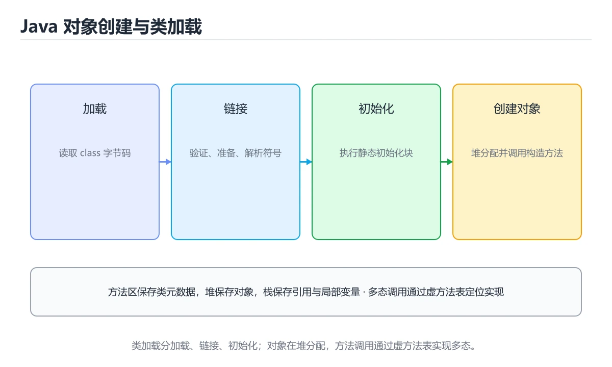
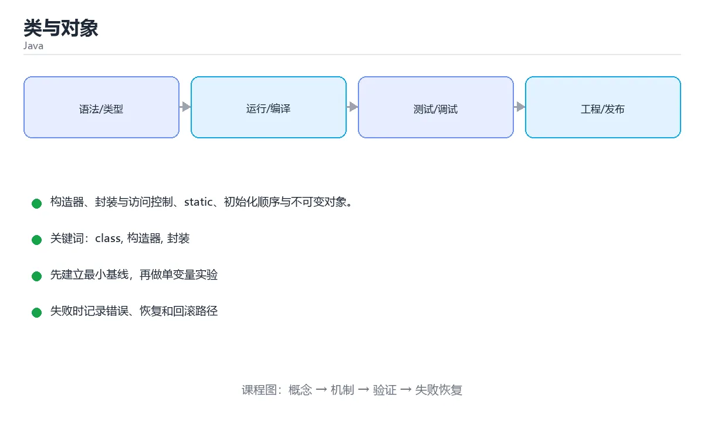

# 类与对象

> 内容更新时间：2026-10-06 · 学习阶段：进阶 · 预计用时：35 分钟





## 学习目标

- 能用自己的话解释类与对象解决了什么问题，而不是只背术语。
- 能说清 「class」、「构造器」、「封装」、「static」 之间的关系，并分别举出一个例子。
- 能把本课知识放回「Java」的知识体系，说明它和相邻主题的边界。
- 能完成本课练习，并用验收标准检查自己的结果。

> 一句话摘要：构造器、封装与访问控制、static、初始化顺序与不可变对象。

## 前置知识

- 先完成上一课《控制流与方法》；如果已经掌握，可以直接用本课练习自测。
- 本课阶段：进阶。建议先掌握同一分类的基础课程，并能独立运行正文中的最小示例。
- 开始前先复习：class、构造器、封装。
- 如果某一步看不懂，先记录具体卡点，完成练习后再回头读一遍。

## 定义类

```java
public class Account {
    private final String owner;      // 封装：数据私有
    private double balance;
    private static int count = 0;    // 静态字段：属于类，所有实例共享

    public Account(String owner, double balance) {   // 构造器
        this.owner = owner;          // this 区分字段与参数
        this.balance = balance;
        count++;
    }

    public void deposit(double amount) {
        if (amount <= 0) throw new IllegalArgumentException("金额必须为正");
        balance += amount;
    }

    public double getBalance() { return balance; }

    public static int getCount() { return count; }   // 静态方法
}
```

```java
Account account = new Account("小明", 100);
account.deposit(50);
System.out.println(account.getBalance() + " / " + Account.getCount());
```

## 封装与访问控制

| 修饰符 | 同类 | 同包 | 子类 | 其他 |
| --- | --- | --- | --- | --- |
| `private` | ✔ | ✘ | ✘ | ✘ |
| 默认（无） | ✔ | ✔ | ✘ | ✘ |
| `protected` | ✔ | ✔ | ✔ | ✘ |
| `public` | ✔ | ✔ | ✔ | ✔ |

实践：字段用 `private`，通过 getter/setter 或业务方法暴露行为。

## 初始化块与静态块

```java
class Demo {
    static { System.out.println("类加载时执行一次"); }
    { System.out.println("每次创建对象都执行"); }
    Demo() { System.out.println("构造器最后执行"); }
}
```

执行顺序：静态块 → 实例块 → 构造器。

## 不可变对象

```java
public final class Point {
    private final int x;
    private final int y;

    public Point(int x, int y) { this.x = x; this.y = y; }
    public int x() { return x; }
    public int y() { return y; }

    public Point move(int dx, int dy) { return new Point(x + dx, y + dy); }
}
```

不可变对象天然线程安全，`String`、`Integer`、`record` 都是这个思路。

## 本课小结
类是数据与行为的封装体：**字段私有、行为公开、状态自洽**。静态成员属于类，实例成员属于对象，不要混用。

## 类与对象速查

| 修饰符 | 本类 | 同包 | 子类 | 其他 |
| --- | --- | --- | --- | --- |
| `private` | 可见 | 不可见 | 不可见 | 不可见 |
| 默认（无） | 可见 | 可见 | 不可见 | 不可见 |
| `protected` | 可见 | 可见 | 可见 | 不可见 |
| `public` | 可见 | 可见 | 可见 | 可见 |

| 关键字 | 作用 |
| --- | --- |
| `static` | 属于类，所有实例共享 |
| `final` | 类不可继承 / 方法不可重写 / 字段不可重新赋值 |
| `this` | 当前实例引用，构造器重载用 `this(...)` |
| `record` | 不可变数据载体，自动生成 getter、`equals`、`hashCode`、`toString` |
| `enum` | 类型安全枚举，可带字段与方法 |
| `instanceof` | 类型判断，可配合模式变量 |
| `sealed` | 限制可继承的子类集合（Java 17+） |

```java
// 不可变值对象：字段 final、无 setter、构造器校验
public final class Money {
    private final long cents;

    public Money(long cents) {
        if (cents < 0) throw new IllegalArgumentException("金额不能为负");
        this.cents = cents;
    }

    public long cents() { return cents; }

    public Money plus(Money other) {
        return new Money(this.cents + other.cents);   // 返回新对象
    }

    @Override
    public boolean equals(Object o) {
        return o instanceof Money m && m.cents == cents;
    }

    @Override
    public int hashCode() { return Long.hashCode(cents); }
}

// record 版本：等价但更简洁
public record Point(int x, int y) {
    public Point {
        if (x < 0) throw new IllegalArgumentException("x 不能为负");
    }
}
```

## 常见错误对照表

| 容易写错的做法 | 实际现象 | 原因与正确做法 |
| --- | --- | --- |
| 字段公开可改 | 状态被任意修改 | 私有字段 + 构造器校验，必要时返回副本 |
| 只重写 `equals` 不重写 `hashCode` | `HashSet` / `HashMap` 行为异常 | 两者必须成对重写，或用 `record` |
| 可变对象作 `HashMap` 键 | 改字段后查不到 | 用不可变对象作键 |
| `return` 内部可变集合 | 外部能改内部状态 | 返回 `List.copyOf(...)` 或不可变视图 |
| 构造器里调用可被重写的方法 | 子类字段尚未初始化 | 构造器只做本类初始化 |
| `static` 字段存状态 | 多实例互相影响、并发不安全 | 用实例字段或无状态设计 |
| 用 `enum` 存可变的共享状态 | 状态被全局修改 | `enum` 只放常量与不可变数据 |
| `final` 修饰可变对象后直接改内容 | 内容仍然变了 | `final` 只锁定引用，需要真正不可变要深拷贝 |
| `toString` 暴露敏感信息 | 日志泄漏 | 输出必要字段并脱敏 |
| 用 `instanceof` 堆分支 | 新增类型要改多处 | 用多态抽象行为 |

## 自测清单

- [ ] 能画出四种访问修饰符的可见范围。
- [ ] 会用 `record` 表达不可变数据。
- [ ] 重写 `equals` 时同步重写 `hashCode`。
- [ ] 不对外暴露内部可变集合。
- [ ] 构造器只做本类初始化，不调用可重写方法。

## 零基础详解：类、对象、封装与接口

### 一句话说清它是什么

Java 是纯面向对象语言：**所有代码都写在类里**。
类是模板，对象是实例；封装负责保护数据，接口负责约定能力。

### 用生活比喻理解

| 概念 | 比喻 | 代码 |
| --- | --- | --- |
| 类 | 图纸 | `class User {}` |
| 对象 | 造出来的实物 | `new User()` |
| 字段 | 内部零件 | `private String name;` |
| 方法 | 对外提供的操作 | `public String getName()` |
| 封装 | 外壳，不让人随便拆 | `private` + 公开方法 |
| 接口 | 岗位说明书 | `interface Payable {}` |

### 逐行拆解第一个类

```java
public class Account {
    private double balance;                 // 私有字段，外部不能直接改

    public Account(double initial) {        // 构造方法，与类同名，无返回值
        if (initial < 0) throw new IllegalArgumentException("初始金额不能为负");
        this.balance = initial;             // this 区分字段与参数
    }

    public double getBalance() {            // 只读访问
        return balance;
    }

    public void deposit(double amount) {    // 通过方法修改，才能校验
        if (amount <= 0) throw new IllegalArgumentException("金额必须为正");
        balance += amount;
    }

    @Override
    public String toString() {              // 打印对象时的文本
        return "Account(balance=%.2f)".formatted(balance);
    }
}
```

| 关键字 | 作用 |
| --- | --- |
| `private` | 只有本类能访问，是封装的基础 |
| `this` | 指向当前对象，用来区分同名字段与参数 |
| `@Override` | 声明「我在重写父类方法」，写错编译器会提醒 |
| `static` | 属于类而不是对象，如工具方法 |

### 四种访问修饰符

| 修饰符 | 本类 | 同包 | 子类 | 其它包 |
| --- | --- | --- | --- | --- |
| `private` | 是 | 否 | 否 | 否 |
| 默认（不写） | 是 | 是 | 否 | 否 |
| `protected` | 是 | 是 | 是 | 否 |
| `public` | 是 | 是 | 是 | 是 |

经验法则：**字段一律 `private`，方法尽量收窄，只有对外 API 才 `public`。**

### 接口与抽象类怎么选

| 对比 | 接口 `interface` | 抽象类 `abstract class` |
| --- | --- | --- |
| 表达 | 「能做什么」能力约定 | 「是什么」的公共部分 |
| 多继承 | 一个类可实现多个接口 | 只能继承一个 |
| 字段 | 只能是常量 | 可以有实例字段 |
| 方法 | 抽象方法 + 默认方法 | 抽象方法 + 普通方法 |
| 何时用 | 需要跨类型统一能力 | 需要共享实现与状态 |

```java
interface Payable {
    double amount();                       // 隐含 public abstract
}

class Order implements Payable {
    private final double total;
    Order(double total) { this.total = total; }
    @Override public double amount() { return total; }
}
```

### 三个必须记住的「Java 惯例」

1. **字段私有、通过方法访问**，需要改数据时在方法里校验。
2. **继承用于「是一种」**，只是为了复用代码就用组合。
3. **面向接口编程**：变量类型写接口，实例写具体类，方便替换与测试。

### 新手最容易踩的七个坑

| 坑 | 现象 | 正确做法 |
| --- | --- | --- |
| 字段公开 | 外部随意改，难以排查 | 改 `private` + 方法 |
| 构造方法写返回类型 | 变成普通方法 | 构造方法不能有返回类型 |
| 忘了 `new` | 空引用 `NullPointerException` | `Account a = new Account(0);` |
| 用 `==` 比较对象 | 比的是地址 | 重写 `equals` 或按业务键比较 |
| 忘了 `@Override` | 拼错方法名变成新方法 | 加上注解让编译器检查 |
| 继承层次过深 | 牵一发动全身 | 优先组合 |
| 静态方法里用实例字段 | 编译错误 | 静态方法只能访问静态成员 |

### 手把手练习：图书与借阅

```java
interface Borrowable {
    boolean borrow();
    void giveBack();
}

class Book implements Borrowable {
    private final String title;
    private boolean borrowed = false;

    Book(String title) { this.title = title; }

    @Override
    public boolean borrow() {
        if (borrowed) return false;
        borrowed = true;
        return true;
    }

    @Override
    public void giveBack() { borrowed = false; }

    @Override
    public String toString() {
        return title + (borrowed ? "（已借出）" : "（在架）");
    }
}

public class Library {
    public static void main(String[] args) {
        Borrowable item = new Book("Java 编程思想");
        System.out.println(item.borrow());     // true
        System.out.println(item.borrow());     // false
        System.out.println(item);
    }
}
```

### 学完自测

- [ ] 能说出类与对象的区别。
- [ ] 能解释封装为什么要求字段私有。
- [ ] 能说出接口与抽象类的三点差别。
- [ ] 知道 `@Override` 帮你避免什么错误。
- [ ] 能判断一个场景该用继承还是组合。

## 动手练习

> 本课练习重点：围绕「class、构造器、封装」完成复述、实验和交付，每个结果都要能被别人检查。

先跑通最小类与测试，再补异常和并发边界，最后观察线程与资源变化。

### 练习 1：建立心智模型（10 分钟）

合上教程，用 3～5 句话回答：

1. 类与对象解决了什么问题？
2. 如果没有它，会出现什么具体后果？
3. 它和「构造器」是什么关系？

**验收标准**：至少出现一个本课关键词，并写出一个反例、边界条件或失效场景。

### 练习 2：做一次可控实验（20 分钟）

从正文中选一个最小示例，完成以下操作：

1. 先预测修改一个参数、输入或步骤后的结果。
2. 再实际执行或逐步推演，记录真实结果。
3. 如果结果与预测不同，写出差异原因。

**验收标准**：留下「原例 → 改动 → 预测 → 结果 → 原因」五步记录。

### 练习 3：交付一个小结果（30 分钟）

写一个可运行的小类，补一个普通测试和一个边界输入测试。

任务要求：

- 结果必须能被别人检查，不能只写“我已经理解了”。
- 至少覆盖「class」和「构造器」两个关键词。
- 写出 1 个仍然不确定的问题，以及下一步如何验证。

> 提示：时间有限时优先做练习 1 和练习 2；练习 3 可以拆成两次完成。

## 实践任务

本节围绕类与对象安排 3 个可交付任务，每个任务都要求留下可以复查的记录。

### 任务 1：用自己的话画出结构

不看书，用一张图说清「类与对象」的结构，画完再对照骨架：

- 主干：定义类 → 封装与访问控制 → 初始化块与静态块 → 不可变对象
- 连接线：在每条边上标出输入、输出与失败路径。
- 自检：能否用一句话说明class与构造器的关系？

### 任务 2：做一次对比实验

**验收标准**：表格里两个方案的结论不能完全一样；写下“在什么条件下应该换方案”。

### 任务 3：迁移到自己的场景

**验收标准**：至少有一个可复现的命令、代码片段或数据样例；结论能被别人独立检查。

## 故障现场

### 现场 1：本课的 class 常规用例通过，但边界用例失败

**症状**：在本课的练习或生产场景里出现“本课的 class 常规用例通过，但边界用例失败”。

**复现**：准备一组最小输入，只保留触发“本课的 class 常规用例通过，但边界用例失败”的必要条件，连续运行两次确认结果稳定。

**定位**：围绕“class 的前置条件与取值边界没有写进代码，默认值掩盖了空值和极值”检查调用链、输入数据和环境配置，先验证假设再改代码。

**预防**：把“本课的 class 常规用例通过，但边界用例失败”写成一条自动化用例，并在本课的验收清单里保留对应检查项。

### 现场 2：本课的 构造器 结果在两次运行之间不一致

**症状**：在本课的练习或生产场景里出现“本课的 构造器 结果在两次运行之间不一致”。

**复现**：准备一组最小输入，只保留触发“本课的 构造器 结果在两次运行之间不一致”的必要条件，连续运行两次确认结果稳定。

**定位**：围绕“构造器 依赖了当前版本、执行顺序或共享状态，单次运行无法暴露差异”检查调用链、输入数据和环境配置，先验证假设再改代码。

**预防**：把“本课的 构造器 结果在两次运行之间不一致”写成一条自动化用例，并在本课的验收清单里保留对应检查项。

### 现场 3：本课的验证只在开发机通过

**症状**：在本课的练习或生产场景里出现“本课的验证只在开发机通过”。

**定位**：围绕“环境版本、配置和输入规模与目标环境不同，class 缺少可重复的验证记录”检查调用链、输入数据和环境配置，先验证假设再改代码。

## 版本与时效

- Java 25 是当前 LTS，Java 21 仍是大量生产系统的基线
- 虚拟线程、记录模式、结构化并发与分代 ZGC 是升级收益最大的部分
- 升级前重点检查反射、字节码增强、序列化与第三方框架兼容性

### 升级检查清单

- 先固定当前版本，跑通全部示例与测验，再升级工具链。
- 只改一个版本变量，记录编译、测试、性能与产物体积的变化。
- 重点回归默认值、弃用警告、序列化格式、并发语义和错误信息。
- 升级完成后更新本课的“最后复核 / 下次复核”日期与版本说明。

## 本课复习清单

离开本课前，逐项确认：

- [ ] 不看解析，能说出「被 private 修饰的字段可以从哪里访问？」的判断依据。
- [ ] 不看解析，能说出「静态成员（static）的特点是？」的判断依据。
- [ ] 不看解析，能说出「不可变对象的主要优势是？」的判断依据。
- [ ] 不看解析，能说出「record 类型的主要特点是？」的判断依据。
- [ ] 不看解析，能说出「用 enum 替代 int 常量的好处是？」的判断依据。
- [ ] 至少运行一次本课示例，记录输入、输出和一个边界情况。
- [ ] 把本课最容易混淆的两个概念写成一句话对照。

| 复盘项 | 记录 |
| --- | --- |
| 已经能独立解释的考点 |  |
| 仍然说不清的概念 |  |
| 下一步验证动作 |  |

## 术语速查

| 术语 | 本课语境 |
| --- | --- |
| `private` | \| `private` \| ✔ \| ✘ \| ✘ \| ✘ \| |
| `protected` | \| `protected` \| ✔ \| ✔ \| ✔ \| ✘ \| |
| `public` | \| `public` \| ✔ \| ✔ \| ✔ \| ✔ \| |
| `String` | 不可变对象天然线程安全，`String`、`Integer`、`record` 都是这个思路。 |
| `Integer` | 不可变对象天然线程安全，`String`、`Integer`、`record` 都是这个思路。 |
| `record` | 不可变对象天然线程安全，`String`、`Integer`、`record` 都是这个思路。 |

## 考点精讲

### 考点 1：概念判断·class

- **题目**：被 private 修饰的字段可以从哪里访问？
- **判断依据**：private 只在类内部可见，这正是封装的基础。其他选项：private 连子类和同包都不可见，只有同一个类的内部可以访问。在「类与对象」里判断这道题，要把class、构造器、封装的条件、过程与失败路径逐项对齐，换成“被 private 修饰的字段可以从”这个场景，只有满足前提的结论才成立。

### 考点 2：多选辨析·class

- **题目**：围绕“类与对象”中的 class、构造器、封装，下列哪两项是本课强调的实践判断？
- **判断依据**：本课把类与对象拆成概念、示例与故障现场三部分，因此判断 class 时必须同时交代输入、输出和失败路径，这使“学习 class 时要同时说明输入、输出和失败路径，不能只看正常流程”成立。在类与对象里，判断 构造器 时要固定版本与边界输入，所以“验证 构造器 时要固定版本并覆盖边界输入，结论才可复现”才可复现。

### 考点 3：概念判断·class

- **题目**：不可变对象的主要优势是？
- **判断依据**：在「类与对象」里，天然线程安全，可安全共享。状态不可变就不会有并发修改问题，String、record 都是典型例子。回到「类与对象」的正文示例，用“不可变对象的主要优势是”走一遍class、构造器、封装的完整流程，能复现的结论才可以保留。

### 考点 4：代码补全·class

- **题目**：这段 Java 代码是「类与对象」的示例片段，下面哪一项描述与它一致？
- **判断依据**：题干的正确项是这段代码包含条件分支，不同输入会走不同的执行路径，在「类与对象」里分支条件由class决定，替换条件后结论可能变化。这段代码出自「类与对象」的正文示例，围绕class、构造器、封装展开；把输入或边界换成空值、极值或失败情况后，结论要以「类与对象」的实际运行结果为准。“Java”与「类与对象」的术语表相呼应，只有符合class、构造器、封装约束的“这段代码包含条件分支”才是正文支持的结论。

### 考点 5：概念判断·class

- **题目**：用 enum 替代 int 常量的好处是？
- **判断依据**：在「类与对象」里，类型安全，可读性好。enum 会做类型检查，编译期就能拦住传错状态值的问题。在「类与对象」里判断这道题，要把class、构造器、封装的条件、过程与失败路径逐项对齐，换成“用 enum 替代 int 常量的好”这个场景，只有满足前提的结论才成立。回到「类与对象」的正文示例，用“用 enum 替代 int 常量的好”走一遍class、构造器、封装的完整流程，能复现的结论才可以保留。

### 考点 6：填空·class

- **题目**：补全代码：「类与对象」示例中，下面这行代码缺少哪个关键字或函数名？请填入 ____。 `return o ____ Money m && m.cents == cents;`
- **判断依据**：在「类与对象」里，instanceof。这道题的关键在「类与对象」的class、构造器、封装：先确认题干“补全代码”问的是哪一步，再排除偷换前提的选项。“instanceof”与术语表相呼应，只有符合class、构造器、封装约束的“instanceof”才是正文支持的结论。

## English Overview

**Title:** Classes & Objects

**Summary:** Constructors, encapsulation, statics and immutability.

**Category:** Java
**Level:** 进阶
**Key terms:** class, 构造器, 封装, static, 不可变对象

## 内容元数据

- 内容版本：v2.0
- 最后更新：2026-10-06
- 学习阶段：进阶
- 适用环境：Java 21+ / Maven 或 Gradle
- 内容来源：内置结构化课程与工程实践整理
- 相关主题：class、构造器、封装、static、不可变对象
- 质量版本：P0 测验标准 + P1 覆盖扩展 + P2 体验补全

## 参考资料与复核

- 最后复核：2026-10-04
- 下次复核：2027-04-04
- 复核范围：版本兼容、API 行为、安全建议与工程实践
- 来源性质：官方文档、标准或权威教材；正文为离线教学重组

| 参考资料 | 本课用途 |
| --- | --- |
| [dev.java 学习](https://dev.java/learn/) | 现代 Java 官方教程 |
| [Gradle 文档](https://docs.gradle.org/current/userguide/userguide.html) | 构建脚本与依赖管理 |
| [JVM 规范](https://docs.oracle.com/javase/specs/jvms/se21/html/index.html) | 字节码与运行时行为 |

> 「类与对象」的链接用于离线阅读后的延伸核对；App 不会自动联网。
