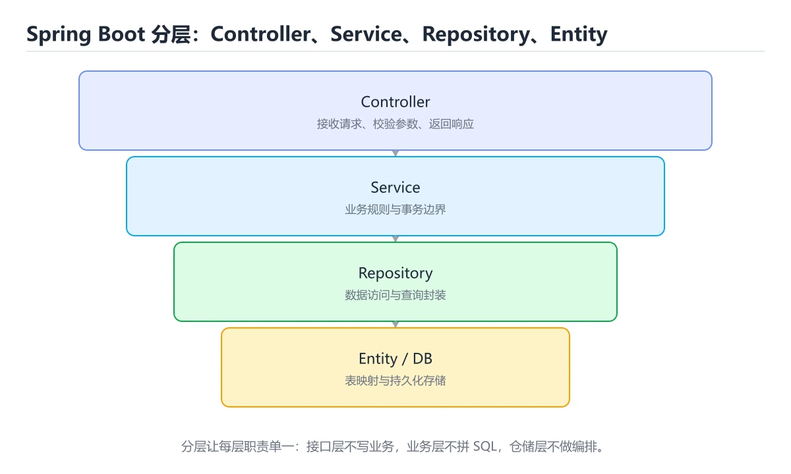
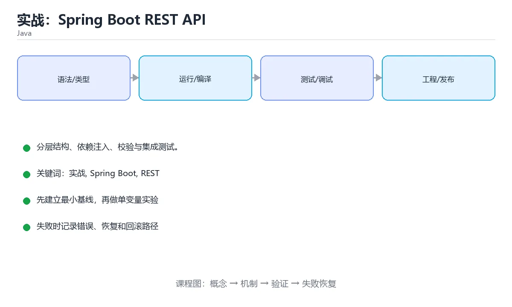

# 实战：Spring Boot REST API





> 内容更新时间：2026-10-06 · 学习阶段：高级 · 预计用时：125 分钟

## 学习目标

- 能用自己的话解释实战：Spring Boot REST API解决了什么问题，而不是只背术语。
- 能说清 「实战」、「Spring Boot」、「REST」、「依赖注入」 之间的关系，并分别举出一个例子。
- 能把本课知识放回「Java」的知识体系，说明它和相邻主题的边界。
- 能完成本课练习，并用验收标准检查自己的结果。

> 一句话摘要：分层结构、依赖注入、校验与集成测试。

## 前置知识

- 先完成上一课《构建、测试与生态》；如果已经掌握，可以直接用本课练习自测。
- 开始前先复习：实战、Spring Boot、REST。
- 如果某一步看不懂，先记录具体卡点，完成练习后再回头读一遍。

## 项目结构

```text
src/main/java/com/example/demo/
├── DemoApplication.java
├── controller/UserController.java
├── service/UserService.java
├── repository/UserRepository.java
└── model/User.java
```

分层职责：controller 处理 HTTP、service 承载业务、repository 访问数据、model 表达数据结构。

## 依赖与配置

```xml
<dependencies>
  <dependency>
    <groupId>org.springframework.boot</groupId>
    <artifactId>spring-boot-starter-web</artifactId>
  </dependency>
  <dependency>
    <groupId>org.springframework.boot</groupId>
    <artifactId>spring-boot-starter-validation</artifactId>
  </dependency>
</dependencies>
```

```properties
server.port=8080
spring.jackson.default-property-inclusion=non_null
```

## 数据模型与校验

```java
public record User(Long id, @NotBlank String name, @Min(0) int age) { }
```

`record` 天生适合做 API 的请求/响应模型；`@NotBlank`、`@Min` 由 Bean Validation 在入口处自动校验。

## 服务与控制器

```java
@Service
public class UserService {
    private final Map<Long, User> store = new ConcurrentHashMap<>();
    private final AtomicLong ids = new AtomicLong();

    public List<User> findAll() { return List.copyOf(store.values()); }

    public User create(String name, int age) {
        long id = ids.incrementAndGet();
        User user = new User(id, name, age);
        store.put(id, user);
        return user;
    }

    public Optional<User> findById(long id) { return Optional.ofNullable(store.get(id)); }
}

@RestController
@RequestMapping("/api/users")
public class UserController {
    private final UserService service;

    public UserController(UserService service) { this.service = service; }   // 构造器注入

    @GetMapping
    public List<User> list() { return service.findAll(); }

    @GetMapping("/{id}")
    public User get(@PathVariable long id) {
        return service.findById(id).orElseThrow(() -> new ResponseStatusException(HttpStatus.NOT_FOUND));
    }

    @PostMapping
    @ResponseStatus(HttpStatus.CREATED)
    public User create(@Valid @RequestBody User request) {
        return service.create(request.name(), request.age());
    }
}
```

## 测试

```java
@SpringBootTest(webEnvironment = SpringBootTest.WebEnvironment.RANDOM_PORT)
class UserControllerTest {
    @Autowired TestRestTemplate rest;

    @Test
    void createsAndFetchesUser() {
        User created = rest.postForObject("/api/users", new User(null, "tom", 18), User.class);
        assertThat(created.id()).isNotNull();
        assertThat(rest.getForObject("/api/users/" + created.id(), User.class).name()).isEqualTo("tom");
    }
}
```

## 上线前检查

1. 统一异常处理（`@RestControllerAdvice`）返回一致的错误结构。
2. 日志用 SLF4J，禁止打印敏感字段。
3. 配置外部化（`application-{env}.yml` + 环境变量）。
4. 用 Actuator 暴露健康检查，接入监控。

## 本课小结

Spring Boot 的关键是**分层 + 依赖注入 + 约定优于配置**：controller 薄、service 厚、repository 只负责数据。

## Spring Boot 注解速查

| 注解 | 作用 |
| --- | --- |
| `@SpringBootApplication` | 启动类，组合配置与组件扫描 |
| `@RestController` | REST 控制器，返回值序列化为 JSON |
| `@RequestMapping` / `@GetMapping` / `@PostMapping` | 路由映射 |
| `@PathVariable` / `@RequestParam` | 路径变量 / 查询参数 |
| `@RequestBody` | 请求体绑定为对象 |
| `@Valid` / `@Validated` | 触发参数校验 |
| `@Service` / `@Repository` / `@Component` | 组件声明 |
| `@Configuration` + `@Bean` | 手动声明 Bean |
| `@Autowired` | 注入（推荐构造器注入，可省略该注解） |
| `@Transactional` | 事务边界 |
| `@ControllerAdvice` + `@ExceptionHandler` | 全局异常处理 |
| `@ConfigurationProperties` | 绑定配置项 |

```java
@RestController
@RequestMapping("/api/orders")
public class OrderController {
    private final OrderService service;

    // 构造器注入：依赖不可变、便于测试
    public OrderController(OrderService service) {
        this.service = service;
    }

    @GetMapping("/{id}")
    public OrderResponse get(@PathVariable long id) {
        return service.findById(id);
    }

    @PostMapping
    @ResponseStatus(HttpStatus.CREATED)
    public OrderResponse create(@Valid @RequestBody CreateOrderRequest request) {
        return service.create(request);
    }
}

@RestControllerAdvice
class GlobalExceptionHandler {
    @ExceptionHandler(OrderNotFoundException.class)
    @ResponseStatus(HttpStatus.NOT_FOUND)
    ErrorResponse handleNotFound(OrderNotFoundException ex) {
        return new ErrorResponse("ORDER_NOT_FOUND", ex.getMessage());
    }
}
```

## 分层职责速查

| 层 | 职责 | 不该做的事 |
| --- | --- | --- |
| Controller | 参数绑定、校验、返回状态码 | 写业务规则、拼 SQL |
| Service | 业务规则、事务边界、编排 | 直接依赖 HTTP 对象 |
| Repository | 数据访问 | 写业务判断 |
| DTO | 对外数据结构 | 直接暴露实体与敏感字段 |
| Entity | 持久化模型 | 承担接口返回格式 |

JPA 与事务速查：

| 目的 | 写法 |
| --- | --- |
| 查询单条 | `findById(id)` 返回 `Optional` |
| 条件查询 | `findByStatusAndCreatedAtAfter(...)` |
| 分页 | `PageRequest.of(page, size, Sort.by("createdAt").descending())` |
| 避免 N+1 | `@EntityGraph` 或 `join fetch` |
| 只读事务 | `@Transactional(readOnly = true)` |
| 更新并返回 | `saveAndFlush` 或 `@Modifying` 批量更新 |
| 乐观锁 | `@Version` 字段 + 捕获冲突后重试 |
| 迁移 | Flyway / Liquibase 管理脚本 |

## 常见错误与排查

| 容易踩的做法 | 实际现象 | 原因与正确做法 |
| --- | --- | --- |
| Controller 直接返回实体 | 暴露敏感字段、循环序列化 | 用 DTO 转换 |
| 字段注入 `@Autowired` | 难以测试、隐藏依赖 | 用构造器注入 |
| 事务方法内部 `try/catch` 吞异常 | 事务不回滚 | 只捕获需要处理的异常，或手动标记回滚 |
| 同类内部方法调用事务方法 | 事务不生效 | 通过代理调用，或拆分 Bean |
| 忘记 `@Transactional` | 多次写入出现半成功 | 在 Service 层声明事务 |
| `@Transactional` 方法里发网络请求 | 事务变长、连接占用 | 外部调用放在事务外 |
| 实体关联默认急加载 | 查询变慢、笛卡尔积 | 按需设置 `FetchType.LAZY` 并用 `join fetch` |
| 拼接 SQL 字符串 | 注入风险 | 用参数绑定或 Spring Data 方法命名 |
| 用 `application.properties` 存密钥 | 泄漏 | 用环境变量或配置中心 |
| 参数校验靠手写 if | 代码重复、遗漏 | 用 `@Valid` + 注解 |
| 用 500 返回业务错误 | 客户端无法区分 | 用 `@ControllerAdvice` 映射合适状态码 |

## 复习与自测

- [ ] 分层职责清晰，Controller 不写业务逻辑。
- [ ] 使用构造器注入，依赖不可变。
- [ ] 事务声明在 Service 层，且不包含网络调用。
- [ ] 用 DTO 隔离实体，避免暴露敏感字段。
- [ ] 数据库结构变更由迁移脚本管理。

## 零基础详解：Java 项目实战骨架

### 一句话说清它是什么

一个可交付的 Java 服务要分层清晰、配置外置、能探活、能优雅关闭、有测试、能打包成镜像。
下面用「订单服务」把整套骨架走一遍。

### 用生活比喻理解

| 层 | 比喻 | 职责 |
| --- | --- | --- |
| Controller | 前台 | 收请求、校验、返回 |
| Service | 后厨 | 业务规则与事务 |
| Repository | 仓库 | 只跟数据库打交道 |
| DTO | 表单 | 对外数据结构 |
| Entity | 库存台账 | 与表结构对应 |

### 包结构

```text
src/main/java/com/example/order/
  OrderApplication.java
  controller/OrderController.java
  service/OrderService.java
  repository/OrderRepository.java
  domain/Order.java
  dto/CreateOrderRequest.java
  config/AppConfig.java
  exception/GlobalExceptionHandler.java
src/main/resources/
  application.yml
  application-prod.yml
src/test/java/...
```

**要点**：DTO 与 Entity 分开，不要让接口结构跟着表结构走。

### 分层写法

```java
@RestController
@RequestMapping("/api/orders")
public class OrderController {
    private final OrderService service;

    public OrderController(OrderService service) {   // 构造注入，便于测试
        this.service = service;
    }

    @PostMapping
    public ResponseEntity<OrderView> create(@Valid @RequestBody CreateOrderRequest req) {
        OrderView view = service.create(req);
        return ResponseEntity.status(HttpStatus.CREATED).body(view);
    }
}

@Service
public class OrderService {
    private final OrderRepository repository;

    public OrderService(OrderRepository repository) {
        this.repository = repository;
    }

    @Transactional
    public OrderView create(CreateOrderRequest req) {
        if (req.quantity() <= 0) {
            throw new IllegalArgumentException("数量必须为正");
        }
        Order saved = repository.save(Order.from(req));
        return OrderView.from(saved);
    }
}
```

```java
public record CreateOrderRequest(
        @NotBlank String customer,
        @Positive int quantity) {}

public record OrderView(long id, String customer, int quantity, String status) {
    static OrderView from(Order order) {
        return new OrderView(order.getId(), order.getCustomer(),
                             order.getQuantity(), order.getStatus().name());
    }
}
```

### 统一异常处理：别把堆栈返回给用户

```java
@RestControllerAdvice
public class GlobalExceptionHandler {
    private static final Logger log = LoggerFactory.getLogger(GlobalExceptionHandler.class);

    @ExceptionHandler(MethodArgumentNotValidException.class)
    @ResponseStatus(HttpStatus.BAD_REQUEST)
    public ApiError onValidation(MethodArgumentNotValidException ex) {
        List<String> issues = ex.getBindingResult().getFieldErrors().stream()
                .map(e -> e.getField() + ": " + e.getDefaultMessage())
                .toList();
        return new ApiError("参数不合法", "VALIDATION_FAILED", issues);
    }

    @ExceptionHandler(OrderNotFoundException.class)
    @ResponseStatus(HttpStatus.NOT_FOUND)
    public ApiError onNotFound(OrderNotFoundException ex) {
        return new ApiError(ex.getMessage(), "ORDER_NOT_FOUND", List.of());
    }

    @ExceptionHandler(Exception.class)
    @ResponseStatus(HttpStatus.INTERNAL_SERVER_ERROR)
    public ApiError onUnexpected(Exception ex) {
        log.error("未预期异常", ex);              // 细节只进日志
        return new ApiError("服务内部错误", "INTERNAL_ERROR", List.of());
    }
}

public record ApiError(String message, String code, List<String> issues) {}
```

### 配置外置与校验

```yaml
# application.yml
server:
  port: ${PORT:8080}
  shutdown: graceful          # 优雅关闭

spring:
  datasource:
    url: ${DB_URL}
    username: ${DB_USER}
    password: ${DB_PASSWORD}
  lifecycle:
    timeout-per-shutdown-phase: 20s

app:
  retry:
    max-attempts: ${RETRY_MAX:3}
```

```java
@ConfigurationProperties(prefix = "app.retry")
@Validated
public record RetryProperties(
        @Min(1) @Max(10) int maxAttempts) {}
```

**启动时校验配置**，而不是运行到一半才发现缺变量。

### 健康检查与指标

```xml
<dependency>
  <groupId>org.springframework.boot</groupId>
  <artifactId>spring-boot-starter-actuator</artifactId>
</dependency>
```

```yaml
management:
  endpoints:
    web:
      exposure:
        include: health,info,metrics,prometheus
  endpoint:
    health:
      probes:
        enabled: true          # 提供 /healthz/live 与 /healthz/ready
```

### 测试三层

```java
@ExtendWith(MockitoExtension.class)
class OrderServiceTest {
    @Mock OrderRepository repository;
    @InjectMocks OrderService service;

    @Test
    void 数量为零时抛出异常() {
        var req = new CreateOrderRequest("小明", 0);
        assertThatThrownBy(() -> service.create(req))
                .isInstanceOf(IllegalArgumentException.class)
                .hasMessageContaining("数量");
    }
}
```

| 层级 | 工具 | 覆盖 |
| --- | --- | --- |
| 单元测试 | JUnit 5 + Mockito | 业务规则 |
| 切片测试 | `@WebMvcTest` | 控制器与序列化 |
| 集成测试 | `@SpringBootTest` + Testcontainers | 数据库与外部依赖 |

### 打包成镜像

```dockerfile
FROM eclipse-temurin:21-jre
WORKDIR /app
COPY target/app.jar app.jar
RUN useradd -r -u 1001 appuser && chown -R appuser /app
USER appuser
EXPOSE 8080
ENTRYPOINT ["java", "-XX:MaxRAMPercentage=75", "-jar", "/app/app.jar"]
```

| 参数 | 作用 |
| --- | --- |
| `MaxRAMPercentage` | 容器里按比例限制堆，避免被 OOM Kill |
| `USER` | 非 root 运行 |
| `shutdown: graceful` | 发布时不中断在途请求 |

### 新手最容易踩的八个坑

| 坑 | 现象 | 正确做法 |
| --- | --- | --- |
| Entity 直接当接口返回 | 泄露字段、耦合表结构 | 用 DTO 转换 |
| 用字段注入 | 循环依赖、难测试 | 用构造注入 |
| 把异常堆栈返回给用户 | 泄露实现细节 | 统一异常处理 |
| 事务加在 Controller | 事务边界不清 | 加在 Service 方法 |
| 配置硬编码 | 换环境要改代码 | 用环境变量与 profile |
| 忘了 graceful shutdown | 发布时 502 | 开启并设置超时 |
| 用 `System.out` 打日志 | 无法分级与采集 | 用 SLF4J |
| 容器里堆内存不限 | 被 OOM Kill | 设置 `MaxRAMPercentage` |

### 学完自测

- [ ] 能说出 Controller、Service、Repository 各自的职责。
- [ ] 知道为什么 DTO 要与 Entity 分开。
- [ ] 能说出构造注入相比字段注入的优势。
- [ ] 知道为什么要开启 graceful shutdown。
- [ ] 能说出容器里限制堆内存的参数。

## 动手练习

> 本课练习重点：围绕「实战、Spring Boot、REST」完成复述、实验和交付，每个结果都要能被别人检查。

先跑通最小类与测试，再补异常和并发边界，最后观察线程与资源变化。

### 练习 1：建立心智模型（10 分钟）

合上教程，用 3～5 句话回答：

1. 实战：Spring Boot REST API解决了什么问题？
2. 如果没有它，会出现什么具体后果？
3. 它和「Spring Boot」是什么关系？

**验收标准**：至少出现一个本课关键词，并写出一个反例、边界条件或失效场景。

### 练习 2：做一次可控实验（20 分钟）

从正文中选一个最小示例，完成以下操作：

1. 先预测修改一个参数、输入或步骤后的结果。
2. 再实际执行或逐步推演，记录真实结果。
3. 如果结果与预测不同，写出差异原因。

**验收标准**：留下「原例 → 改动 → 预测 → 结果 → 原因」五步记录。

### 练习 3：交付一个小结果（30 分钟）

写一个可运行的小类，补一个普通测试和一个边界输入测试。

任务要求：

- 结果必须能被别人检查，不能只写“我已经理解了”。
- 至少覆盖「实战」和「Spring Boot」两个关键词。
- 写出 1 个仍然不确定的问题，以及下一步如何验证。

> 提示：时间有限时优先做练习 1 和练习 2；练习 3 可以拆成两次完成。

## 验证命令与预期输出

项目代码不能只看“能编译”，还要能按固定命令复现结果。下表给出最低验证集：

| 阶段 | 命令 | 预期输出 |
| --- | --- | --- |
| 编译 | `./mvnw -q -DskipTests package` | 生成 JAR 且编译无错误 |
| 运行测试 | `./mvnw test` | JUnit 测试全部通过 |
| 启动服务 | `java -jar target/app.jar` | 端口监听成功并输出启动日志 |

### 验收证据

- [ ] 保存依赖安装和启动命令的完整输出。
- [ ] 至少运行 3 条测试，其中包含一条非法输入或失败路径。
- [ ] 重复执行同一操作两次，确认没有重复写入或副作用。
- [ ] 记录一次失败状态码、错误日志和恢复步骤。
- [ ] 在 README 中写明环境版本、启动方式和回滚方式。

### 回归与回滚

1. 先在一个可丢弃的目录或临时数据库执行，避免污染真实数据。
2. 修改一处逻辑后重跑全部验证命令，确认没有回归。
3. 若失败，回滚到上一个可运行版本并保留失败日志。
4. 定位原因后补一条自动化测试，再重新执行发布流程。
5. 把教训写入项目复盘或本课笔记，形成下一次的检查项。

## 可运行练习

### 任务 1：先跑通，再解释

```xml
<dependencies>
  <dependency>
    <groupId>org.springframework.boot</groupId>
    <artifactId>spring-boot-starter-web</artifactId>
  </dependency>
  <dependency>
    <groupId>org.springframework.boot</groupId>
    <artifactId>spring-boot-starter-validation</artifactId>
  </dependency>
</dependencies>
```

**预期输出**：沙箱会解析并格式化实战：Spring Boot REST API中的这段 XML；请重点检查标签闭合、属性和嵌套层级。

### 任务 2：只改一个条件

把「实战：Spring Boot REST API」的最小示例复制一份，只改一个条件再跑一次：

- 改动点：只把实战的输入换成空值、极值或错误输入，其余保持不变。
- 预测：先写下「实战：Spring Boot REST API」在改动后的输出或错误信息，再运行。
- 记录：对照改动前后的结果，指出差异出在哪一步。
- 验收：换回原条件能复现原结果，改动只影响实战。

### 任务 3：迁移到自己的数据

用同一套思路处理一组你自己的数据或场景，保持输出格式与任务 1 一致。

## 故障现场

### 现场 1：本课的 实战 常规用例通过，但边界用例失败

**症状**：在本课的练习或生产场景里出现“本课的 实战 常规用例通过，但边界用例失败”。

**复现**：准备一组最小输入，只保留触发“本课的 实战 常规用例通过，但边界用例失败”的必要条件，连续运行两次确认结果稳定。

**定位**：围绕“实战 的前置条件与取值边界没有写进代码，默认值掩盖了空值和极值”检查调用链、输入数据和环境配置，先验证假设再改代码。

**预防**：把“本课的 实战 常规用例通过，但边界用例失败”写成一条自动化用例，并在本课的验收清单里保留对应检查项。

### 现场 2：本课的 Spring Boot 结果在两次运行之间不一致

**症状**：在本课的练习或生产场景里出现“本课的 Spring Boot 结果在两次运行之间不一致”。

**复现**：准备一组最小输入，只保留触发“本课的 Spring Boot 结果在两次运行之间不一致”的必要条件，连续运行两次确认结果稳定。

**定位**：围绕“Spring Boot 依赖了当前版本、执行顺序或共享状态，单次运行无法暴露差异”检查调用链、输入数据和环境配置，先验证假设再改代码。

**预防**：把“本课的 Spring Boot 结果在两次运行之间不一致”写成一条自动化用例，并在本课的验收清单里保留对应检查项。

### 现场 3：本课的验证只在开发机通过

**症状**：在本课的练习或生产场景里出现“本课的验证只在开发机通过”。

**定位**：围绕“环境版本、配置和输入规模与目标环境不同，实战 缺少可重复的验证记录”检查调用链、输入数据和环境配置，先验证假设再改代码。

## 版本与时效

- Java 25 是当前 LTS，Java 21 仍是大量生产系统的基线
- 虚拟线程、记录模式、结构化并发与分代 ZGC 是升级收益最大的部分
- 升级前重点检查反射、字节码增强、序列化与第三方框架兼容性

### 升级检查清单

- 先固定当前版本，跑通全部示例与测验，再升级工具链。
- 只改一个版本变量，记录编译、测试、性能与产物体积的变化。
- 重点回归默认值、弃用警告、序列化格式、并发语义和错误信息。
- 升级完成后更新本课的“最后复核 / 下次复核”日期与版本说明。

## 本课复习清单

离开本课前，逐项确认：

- [ ] 不看解析，能说出「在分层架构中，Controller 的职责是？」的判断依据。
- [ ] 不看解析，能说出「使用构造器注入的主要好处是？」的判断依据。
- [ ] 不看解析，能说出「@Valid 注解在 @RequestBody 上的作用是？」的判断依据。
- [ ] 不看解析，能说出「@RestController 与 @Controller 的差别是？」的判断依据。
- [ ] 不看解析，能说出「JPA 中 N+1 查询问题的常见解法是？」的判断依据。
- [ ] 不看解析，能说出的判断依据。
- [ ] 至少运行一次本课示例，记录输入、输出和一个边界情况。
- [ ] 把本课最容易混淆的两个概念写成一句话对照。

| 复盘项 | 记录 |
| --- | --- |
| 已经能独立解释的考点 |  |
| 仍然说不清的概念 |  |
| 下一步验证动作 |  |

## 术语速查

| 术语 | 本课语境 |
| --- | --- |
| `record` | `record` 天生适合做 API 的请求/响应模型；`@NotBlank`、`@Min` 由 Bean Validation 在入口处自动校验。 |
| `@NotBlank` | `record` 天生适合做 API 的请求/响应模型；`@NotBlank`、`@Min` 由 Bean Validation 在入口处自动校验。 |
| `@Min` | `record` 天生适合做 API 的请求/响应模型；`@NotBlank`、`@Min` 由 Bean Validation 在入口处自动校验。 |
| `@RestControllerAdvice` | 统一异常处理（`@RestControllerAdvice`）返回一致的错误结构。 |
| `application-{env}.yml` | 配置外部化（`application-{env}.yml` + 环境变量）。 |
| `@SpringBootApplication` | \| `@SpringBootApplication` \| 启动类，组合配置与组件扫描 \| |

## 考点精讲

### 考点 1：多选辨析·实战

- **题目**：围绕“实战：Spring Boot REST API”中的 实战、Spring Boot、REST，下列哪两项是本课强调的实践判断？
- **判断依据**：在「实战：Spring Boot REST API」里，学习 实战 时要同时说明输入、输出和失败路径，不能只看正常流程。在实战：Spring Boot REST API里，判断 Spring Boot 时要固定版本与边界输入，所以“验证 Spring Boot 时要固定版本并覆盖边界输入，结论才可复现”才可复现。

### 考点 2：概念判断·实战

- **题目**：使用构造器注入的主要好处是？
- **判断依据**：在「实战：Spring Boot REST API」里，依赖显式且便于测试。构造器注入让依赖不可变、显式，单元测试可直接传入 mock。在「实战：Spring Boot REST API」里判断这道题，要把实战、Spring Boot、REST的条件、过程与失败路径逐项对齐，换成“使用构造器注入的主要好处是”这个场景，只有满足前提的结论才成立。

### 考点 3：代码补全·实战

- **题目**：下面这段 Java 代码摘自「实战：Spring Boot REST API」的正文示例。关于这段代码，下面哪一项说法与实际内容相符？
- **判断依据**：在「实战：Spring Boot REST API」里，这段代码把主要逻辑封装在函数或方法里，需要被调用才会执行。这段代码出自「实战：Spring Boot REST API」的正文示例，围绕实战、Spring Boot、REST展开；把输入或边界换成空值、极值或失败情况后，结论要以「实战：Spring Boot REST API」的实际运行结果为准。

### 考点 4：概念判断·实战

- **题目**：@RestController 与 @Controller 的差别是？
- **判断依据**：在「实战：Spring Boot REST API」里，结论应落在「@RestController 默认把返回值序列化为 JSON（相当于 @Controller + @ResponseBody）」。返回视图页面时用 @Controller，写 REST API 时用 @RestController 更省事。

### 考点 5：概念判断·实战

- **题目**：JPA 中 N+1 查询问题的常见解法是？
- **判断依据**：在「实战：Spring Boot REST API」里，用 join fetch / @EntityGraph 一次性预加载关联数据。N+1 的典型现象是 1 条主查询 + N 条关联查询，用批量抓取或联表抓取可以解决。把“用 join fetch / @Enti”代回「实战：Spring Boot REST API」里“JPA 中 N+1 查询问题的常见解法是”的例子核对，条件一旦改变，结论就要用实战、Spring Boot、REST重新推导。

### 考点 6：填空·实战

- **题目**：补全代码：「实战：Spring Boot REST API」示例中，下面这行代码缺少哪个关键字或函数名？请填入 ____。 `@____(prefix = "app.retry")`
- **判断依据**：空格应填写「ConfigurationProperties」、「configurationproperties」。这道题的关键在「实战：Spring Boot REST API」的实战、Spring Boot、REST：先确认题干“补全代码”问的是哪一步，再排除偷换前提的选项。

## English Overview

**Title:** Project: Spring Boot API

**Summary:** Layering, DI, validation and integration tests.

**Category:** Java
**Level:** 高级
**Key terms:** 实战, Spring Boot, REST, 依赖注入, 测试

## 内容元数据

- 内容版本：v2.0
- 最后更新：2026-10-06
- 学习阶段：高级
- 适用环境：Java 21+ / Maven 或 Gradle
- 内容来源：内置结构化课程与工程实践整理
- 相关主题：实战、Spring Boot、REST、依赖注入、测试
- 质量版本：P0 测验标准 + P1 覆盖扩展 + P2 体验补全

## 项目专属规格：实战：Spring Boot REST API

### 核心场景

分层结构、依赖注入、校验与集成测试。 项目目标是把「实战、Spring Boot、REST、依赖注入、测试」落实为可运行、可测试、可回滚的交付物。

### 架构与数据流

```text
用户/输入 → 接口或命令 → 领域逻辑 → 存储/外部依赖 → 输出与监控
                         ↘ 失败分类 → 重试/补偿 → 回滚
```

### 最小数据模型

| 对象 | 关键字段 | 约束 |
| --- | --- | --- |
| 输入实体 | 实战、时间、来源 | 必填校验、长度限制、幂等键 |
| 任务实体 | 状态、优先级、创建时间 | 状态迁移合法、不可重复执行 |
| 结果实体 | 输出、错误码、耗时 | 可序列化、错误可解释 |
| 审计记录 | 操作者、动作、结果、时间 | 不可篡改、可查询、脱敏 |

### 验收场景

1. 正常路径：最小输入得到预期输出，并留下日志与指标。
2. 边界路径：空值、最大值、重复数据和超长内容得到明确处理。
3. 失败路径：依赖超时或不可用时能快速失败、重试或降级。
4. 幂等路径：同一请求执行两次不会产生重复副作用。
5. 回滚路径：回滚后数据一致，且能说明恢复时间和影响范围。

## 项目交付物

### 建议仓库结构

```text
src/main/java/
src/main/resources/
src/test/java/
pom.xml
README.md
```

### 测试矩阵

| 层级 | 覆盖内容 | 最低数量 | 通过标准 |
| --- | --- | ---: | --- |
| 单元测试 | 领域规则、边界和错误分类 | 8 | 正常、边界、失败路径全部通过 |
| 集成测试 | 数据库、网络、文件或平台边界 | 3 | 使用真实边界且可重复运行 |
| 端到端测试 | 核心用户路径 | 1 | 从输入到输出完整跑通 |
| 手动验收 | 文档中列出的 5 个场景 | 5 | 有命令、输出和结论记录 |

### 验收数据

```json
{
  "project": "java_project",
  "input": {"case": "normal", "value": 5},
  "expected": {"ok": true, "result": 5},
  "failure_case": {"value": -1, "error": "validation_error"},
  "idempotency_key": "demo-001"
}
```

### 复盘模板

| 问题 | 记录 |
| --- | --- |
| 原目标是什么？ | 用一句话描述可验收目标 |
| 实际发生了什么？ | 时间线、指标和关键日志 |
| 哪个假设被推翻？ | 根因与促成因素 |
| 如何回滚？ | 步骤、耗时和数据校验 |
| 下一步做什么？ | 负责人、期限和验证方式 |

> 项目验收围绕「实战、Spring Boot、REST」：至少完成一次正常路径、一次边界输入、一次失败恢复和一次幂等检查。

## Full English Study Guide

### Overview

**Project: Spring Boot API** focuses on Layering, DI, validation and integration tests.

### Learning Outcomes

- Explain what **Project: Spring Boot API** solves and when it should be used.

### Glossary

- Topic: **Project: Spring Boot API**
- Related terms: 实战, Spring Boot, REST, 依赖注入

## Bilingual Section Outline

| 中文小节 | English section |
| --- | --- |
| 学习目标 | Learning objectives |
| 前置知识 | Prerequisites |
| 项目结构 | 项目结构 |
| 依赖与配置 | 依赖与配置 |
| 数据模型与校验 | 数据Model与校验 |
| 服务与控制器 | 服务与控制器 |
| 测试 | Testing |
| 上线前检查 | 上线前检查 |
| 本课小结 | Summary |
| Spring Boot 注解速查 | Spring Boot 注解速查 |

## 参考资料与复核

- 最后复核：2026-10-04
- 下次复核：2027-04-04
- 复核范围：版本兼容、API 行为、安全建议与工程实践
- 来源性质：官方文档、标准或权威教材；正文为离线教学重组

| 参考资料 | 本课用途 |
| --- | --- |
| [Gradle 文档](https://docs.gradle.org/current/userguide/userguide.html) | 构建脚本与依赖管理 |
| [JUnit 用户指南](https://junit.org/junit5/docs/current/user-guide/) | 自动化测试与断言 |
| [dev.java 学习](https://dev.java/learn/) | 现代 Java 官方教程 |

> 「实战：Spring Boot REST API」的链接用于离线阅读后的延伸核对；App 不会自动联网。
