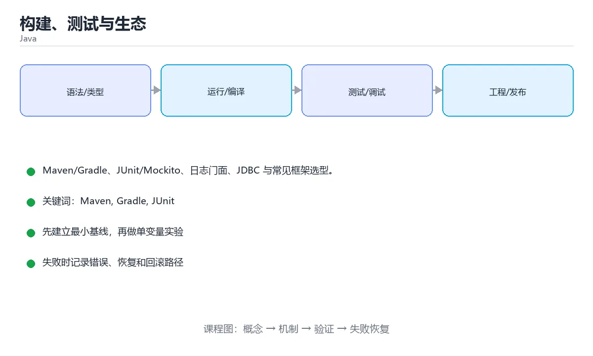

# 构建、测试与生态



> 内容更新时间：2026-10-03 · 学习阶段：进阶 · 预计用时：16 分钟

## 学习目标

- 能用自己的话解释「构建、测试与生态」解决了什么问题，而不是只背术语。
- 能说清 「Maven」、「Gradle」、「JUnit」、「Mockito」 之间的关系，并分别举出一个例子。
- 能把本课知识放回「Java」的知识体系，说明它和相邻主题的边界。
- 能完成本课练习，并用验收标准检查自己的结果。

> 一句话摘要：Maven/Gradle、JUnit/Mockito、日志门面、JDBC 与常见框架选型。

## 前置知识

- 先完成上一课《多线程与并发》；如果已经掌握，可以直接用本课练习自测。
- 本课阶段：进阶。建议先掌握同一分类的基础课程，并能独立运行正文中的最小示例。
- 开始前先复习：Maven、Gradle、JUnit。
- 如果某一步看不懂，先记录具体卡点，完成练习后再回头读一遍。


## Maven 与 Gradle

```xml
<!-- pom.xml（Maven）-->
<project>
  <modelVersion>4.0.0</modelVersion>
  <groupId>com.example</groupId>
  <artifactId>demo</artifactId>
  <version>1.0.0</version>
  <properties>
    <maven.compiler.release>21</maven.compiler.release>
  </properties>
  <dependencies>
    <dependency>
      <groupId>org.junit.jupiter</groupId>
      <artifactId>junit-jupiter</artifactId>
      <version>5.10.0</version>
      <scope>test</scope>
    </dependency>
  </dependencies>
</project>
```

```groovy
// build.gradle（Gradle）
plugins { id 'java' }
java { toolchain { languageVersion = JavaLanguageVersion.of(21) } }
repositories { mavenCentral() }
dependencies {
    testImplementation 'org.junit.jupiter:junit-jupiter:5.10.0'
}
```

```bash
mvn clean package          # Maven：编译 + 测试 + 打包
gradle build               # Gradle：默认增量构建更快
```

## 单元测试

```java
import org.junit.jupiter.api.Test;
import static org.junit.jupiter.api.Assertions.*;

class CalculatorTest {
    @Test
    void addsNumbers() {
        assertEquals(5, Calculator.add(2, 3));
    }

    @Test
    void throwsOnDivideByZero() {
        assertThrows(ArithmeticException.class, () -> Calculator.divide(1, 0));
    }
}
```

Mockito 用于隔离依赖：

```java
UserRepository repo = mock(UserRepository.class);
when(repo.findById(1L)).thenReturn(Optional.of(new User("tom")));
```

## 日志

```java
private static final Logger log = LoggerFactory.getLogger(Service.class);

log.info("创建订单 id={} userId={}", orderId, userId);
log.warn("库存不足 sku={}", sku);
log.error("下单失败 userId={}", userId, exception);   // 异常作为最后一个参数
```

用 SLF4J 门面 + Logback/Log4j2 实现，避免直接使用 `System.out.println`；日志要带上下文，且不要输出密码、令牌等敏感信息。

## 数据库访问

```java
try (Connection conn = DriverManager.getConnection(url, user, password);
     PreparedStatement ps = conn.prepareStatement("SELECT name FROM users WHERE id = ?")) {
    ps.setLong(1, userId);
    try (ResultSet rs = ps.executeQuery()) {
        if (rs.next()) System.out.println(rs.getString("name"));
    }
}
```

JDBC 是基础，实际项目常用连接池（HikariCP）+ JPA/MyBatis。**永远使用 PreparedStatement 防 SQL 注入**。

## 生态速览

| 领域 | 常用选择 |
| --- | --- |
| Web 框架 | Spring Boot、Quarkus、Javalin |
| 持久化 | JDBC、JPA/Hibernate、MyBatis |
| 测试 | JUnit 5、Mockito、Testcontainers |
| 构建 | Maven、Gradle |
| 日志 | SLF4J + Logback |

## 本课小结
Java 工程能力 = 构建工具 + 单测 + 日志 + 数据访问。先掌握 JUnit 与 Maven/Gradle 的基本用法，再按项目需要引入框架。


## 构建工具速查

| 目的 | Maven | Gradle |
| --- | --- | --- |
| 配置格式 | `pom.xml` | `build.gradle(.kts)` |
| 编译 | `mvn compile` | `gradle compileJava` |
| 测试 | `mvn test` | `gradle test` |
| 打包 | `mvn package` | `gradle build` |
| 跳过测试打包 | `mvn package -DskipTests` | `gradle build -x test` |
| 清理 | `mvn clean` | `gradle clean` |
| 依赖树 | `mvn dependency:tree` | `gradle dependencies` |
| 常用插件 | Surefire、Shade | Shadow、Spotless |

依赖管理速查：

| 概念 | 说明 |
| --- | --- |
| `groupId:artifactId:version` | Maven 坐标，定位一个依赖 |
| `implementation` | Gradle 中不对使用者暴露的依赖 |
| `api` | Gradle 中会传递给使用者的依赖 |
| `testImplementation` | 只用于测试 |
| BOM / `platform` | 统一管理一组依赖版本 |
| `dependencyManagement` | Maven 中锁定版本 |
| 传递依赖冲突 | 用 `enforcedPlatform` 或 `exclude` 处理 |

## JUnit 5 速查

| 注解 / 方法 | 作用 |
| --- | --- |
| `@Test` | 标记测试方法 |
| `@BeforeEach` / `@AfterEach` | 每个用例前后执行 |
| `@BeforeAll` / `@AfterAll` | 整个测试类前后执行（需静态） |
| `@DisplayName` | 可读的用例名 |
| `@Disabled` | 暂时跳过 |
| `@ParameterizedTest` + `@ValueSource` / `@CsvSource` | 参数化 |
| `@Nested` | 分组用例 |
| `@Tag` | 分类标记（如 `slow`） |
| `assertThrows` | 断言抛异常 |
| `assertAll` | 一次断言多项，全部失败都报告 |
| `assertTimeout` | 断言执行时间 |

```java
import org.junit.jupiter.api.*;
import static org.junit.jupiter.api.Assertions.*;

class PriceCalculatorTest {
    private PriceCalculator calculator;

    @BeforeEach
    void setUp() {
        calculator = new PriceCalculator();
    }

    @Test
    @DisplayName("VIP 用户免运费")
    void vipFreeShipping() {
        assertEquals(0, calculator.shippingFee("vip", 100));
    }

    @ParameterizedTest
    @CsvSource({"normal,100,10", "normal,300,0"})
    void shippingByAmount(String type, int amount, int expected) {
        assertEquals(expected, calculator.shippingFee(type, amount));
    }

    @Test
    void rejectsNegativeAmount() {
        assertThrows(IllegalArgumentException.class,
                () -> calculator.shippingFee("normal", -1));
    }
}
```

## 日志速查

| 目的 | 写法 |
| --- | --- |
| 声明日志器 | `private static final Logger log = LoggerFactory.getLogger(X.class);` |
| 占位符 | `log.info("下单成功 userId={}, amount={}", userId, amount);` |
| 记录异常 | `log.error("处理失败 orderId={}", id, e);` |
| 条件日志 | `if (log.isDebugEnabled()) { ... }` |
| 级别 | `ERROR` > `WARN` > `INFO` > `DEBUG` > `TRACE` |
| 禁止 | `System.out.println`、字符串拼接日志、打印敏感数据 |

## 常见错误对照表

| 容易踩的做法 | 实际现象 | 原因与正确做法 |
| --- | --- | --- |
| `mvn package -DskipTests` 当成默认 | 带缺陷发布 | 只在明确需要时跳过，CI 必须跑测试 |
| 依赖不加版本、依赖 BOM 缺失 | 版本漂移 | 用 BOM 或显式声明版本 |
| `implementation` 与 `api` 混用 | 使用方编译失败或依赖泄漏 | 内部依赖用 `implementation` |
| 测试依赖放进 `dependencies` | 生产包体积变大 | 用 `testImplementation` / `test` scope |
| 依赖冲突不排查 | 运行时 `NoSuchMethodError` | 用依赖树定位并排除 |
| 日志用字符串拼接 | 无谓的性能开销 | 用占位符 `{}` |
| 用 `System.out.println` 调试 | 生产日志无法统一收集 | 用日志框架并分级 |
| 日志打印密码或令牌 | 安全事件 | 脱敏处理 |
| 测试之间共享静态状态 | 单跑通过、一起跑失败 | 每个用例独立准备数据 |
| 断言太弱（只断言不抛异常） | 回归测不出来 | 断言具体值或异常类型 |

## 自测清单

- [ ] 会用 Maven 或 Gradle 完成编译、测试、打包。
- [ ] 依赖冲突会用依赖树定位并排除。
- [ ] JUnit 5 用例覆盖正常、边界与异常路径。
- [ ] 日志用占位符且不打印敏感信息。
- [ ] CI 中不跳过测试。


## 零基础详解：Java 工具链与工程实践

### 一句话说清它是什么

Java 的工具链负责四件事：**编译、依赖管理、构建打包、测试与质量检查**。
现代项目基本都用 Maven 或 Gradle 中的一个，再配上 JUnit 与静态检查。

### 用生活比喻理解

| 工具 | 比喻 | 说明 |
| --- | --- | --- |
| JDK | 全套工具 | 编译器 + 运行时 + 工具 |
| Maven / Gradle | 施工队 | 拉材料、编译、打包 |
| 仓库 | 建材市场 | 中央仓库 + 私服 |
| JUnit | 验收员 | 自动跑测试 |
| 依赖范围 | 材料用途 | compile / runtime / test |

### Maven 与 Gradle 怎么选

| 对比 | Maven | Gradle |
| --- | --- | --- |
| 配置方式 | XML，约定优先 | Groovy/Kotlin DSL，灵活 |
| 学习曲线 | 平缓 | 前期略陡 |
| 构建速度 | 一般 | 增量与缓存更好 |
| 生态 | 极其成熟 | 现代 Android 与微服务主流 |
| 建议 | 企业传统项目 | 新项目或 Android |

### Maven 的 pom 关键片段

```xml
<properties>
  <maven.compiler.release>21</maven.compiler.release>
  <project.build.sourceEncoding>UTF-8</project.build.sourceEncoding>
</properties>

<dependencies>
  <dependency>
    <groupId>com.fasterxml.jackson.core</groupId>
    <artifactId>jackson-databind</artifactId>
    <version>2.18.0</version>
  </dependency>
  <dependency>
    <groupId>org.junit.jupiter</groupId>
    <artifactId>junit-jupiter</artifactId>
    <version>5.11.0</version>
    <scope>test</scope>            <!-- 只在测试期需要 -->
  </dependency>
</dependencies>

<build>
  <plugins>
    <plugin>
      <groupId>org.apache.maven.plugins</groupId>
      <artifactId>maven-surefire-plugin</artifactId>
      <version>3.5.0</version>
    </plugin>
  </plugins>
</build>
```

常用命令：

```bash
mvn -q clean verify            # 清理 + 编译 + 测试 + 打包校验
mvn -q test                    # 只跑测试
mvn -q dependency:tree         # 查看依赖树，排查冲突
mvn -q versions:display-dependency-updates   # 检查可升级依赖
```

### Gradle 的 build.gradle.kts 关键片段

```kotlin
plugins {
    java
    application
}

java {
    toolchain { languageVersion = JavaLanguageVersion.of(21) }
}

repositories { mavenCentral() }

dependencies {
    implementation("com.fasterxml.jackson.core:jackson-databind:2.18.0")
    testImplementation("org.junit.jupiter:junit-jupiter:5.11.0")
    testRuntimeOnly("org.junit.platform:junit-platform-launcher")
}

tasks.test {
    useJUnitPlatform()
}

application { mainClass = "com.example.App" }
```

```bash
./gradlew build             # 编译 + 测试 + 打包
./gradlew test --info       # 详细测试输出
./gradlew dependencies      # 依赖树
./gradlew --refresh-dependencies build
```

**记得提交 `gradle/wrapper` 与 `mvnw`**，这样别人不用装指定版本也能构建。

### JUnit 5 的三件套

```java
import org.junit.jupiter.api.*;
import org.junit.jupiter.params.ParameterizedTest;
import org.junit.jupiter.params.provider.ValueSource;

import static org.junit.jupiter.api.Assertions.*;

class PriceTest {
    @Test
    void 保留两位小数() {
        assertEquals("19.90", Price.format(19.9));
    }

    @Test
    void 负数抛异常() {
        var ex = assertThrows(IllegalArgumentException.class, () -> Price.format(-1));
        assertTrue(ex.getMessage().contains("不能为负"));
    }

    @ParameterizedTest
    @ValueSource(strings = {"", " ", "abc"})
    void 非法输入都报错(String input) {
        assertThrows(IllegalArgumentException.class, () -> Price.parse(input));
    }
}
```

| 注解 | 作用 |
| --- | --- |
| `@Test` | 一个测试方法 |
| `@BeforeEach` / `@AfterEach` | 每个用例前后执行 |
| `@ParameterizedTest` | 一组数据跑同一逻辑 |
| `@Disabled` | 临时跳过（需说明原因） |
| `@DisplayName` | 给用例起可读名字 |

### CI 里的标准动作

```yaml
- run: ./mvnw -B -q clean verify        # 或 ./gradlew build
- run: ./mvnw -B org.jacoco:jacoco-maven-plugin:report
```

| 检查 | 工具 |
| --- | --- |
| 单元测试 | JUnit 5 |
| 覆盖率 | JaCoCo |
| 静态分析 | SpotBugs、Error Prone |
| 依赖漏洞 | OWASP Dependency-Check |
| 代码格式 | Spotless、google-java-format |

### 新手最容易踩的八个坑

| 坑 | 现象 | 正确做法 |
| --- | --- | --- |
| 用 `system` 路径引本地 jar | 换机器就失败 | 装进私服或本地仓库 |
| 依赖版本互相冲突 | `NoSuchMethodError` | 用 `dependency:tree` 排查 |
| 忘提交 wrapper | 构建环境不一致 | 提交 `mvnw` / `gradlew` |
| 测试依赖生产配置 | 测试不稳定 | 用测试专用配置 |
| 依赖不写 `test` 范围 | 打包体积变大 | 测试依赖标 `test` |
| 用 `mvn install` 代替 `verify` | 污染本地仓库 | CI 用 `verify` |
| 忽略编码设置 | 中文乱码 | 显式设 UTF-8 |
| 不看依赖更新 | 漏洞长期存在 | 定期升级并跑漏洞扫描 |

### 手把手练习：给项目加质量门禁

```xml
<plugin>
  <groupId>org.jacoco</groupId>
  <artifactId>jacoco-maven-plugin</artifactId>
  <version>0.8.12</version>
  <executions>
    <execution>
      <goals><goal>prepare-agent</goal></goals>
    </execution>
    <execution>
      <id>check</id>
      <phase>verify</phase>
      <goals><goal>check</goal></goals>
      <configuration>
        <rules>
          <rule>
            <element>BUNDLE</element>
            <limits>
              <limit>
                <counter>LINE</counter>
                <value>COVEREDRATIO</value>
                <minimum>0.70</minimum>
              </limit>
            </limits>
          </rule>
        </rules>
      </configuration>
    </execution>
  </executions>
</plugin>
```

这样覆盖率低于 70% 时 `mvn verify` 会直接失败，形成硬门禁。

### 学完自测

- [ ] 能说出 Maven 与 Gradle 的三点差异。
- [ ] 知道 `test` 依赖范围的作用。
- [ ] 能说出 `mvn verify` 与 `mvn install` 的区别。
- [ ] 知道为什么要提交 wrapper 与 mvnw。
- [ ] 能用 JaCoCo 配置一条覆盖率门禁。

## 动手练习


> 本课练习重点：围绕「Maven、Gradle、JUnit」完成复述、实验和交付，每个结果都要能被别人检查。

先跑通最小类与测试，再补异常和并发边界，最后观察线程与资源变化。

### 练习 1：建立心智模型（10 分钟）

合上教程，用 3～5 句话回答：

1. 「构建、测试与生态」解决了什么问题？
2. 如果没有它，会出现什么具体后果？
3. 它和「Gradle」是什么关系？

**验收标准**：至少出现一个本课关键词，并写出一个反例、边界条件或失效场景。

### 练习 2：做一次可控实验（20 分钟）

从正文中选一个最小示例，完成以下操作：

1. 先预测修改一个参数、输入或步骤后的结果。
2. 再实际执行或逐步推演，记录真实结果。
3. 如果结果与预测不同，写出差异原因。

**验收标准**：留下「原例 → 改动 → 预测 → 结果 → 原因」五步记录。

### 练习 3：交付一个小结果（30 分钟）

写一个可运行的小类，补一个普通测试和一个边界输入测试。

任务要求：

- 结果必须能被别人检查，不能只写“我已经理解了”。
- 至少覆盖「Maven」和「Gradle」两个关键词。
- 写出 1 个仍然不确定的问题，以及下一步如何验证。

> 提示：时间有限时优先做练习 1 和练习 2；练习 3 可以拆成两次完成。


## 考点精讲：把测验题还原成判断过程

本课有 6 个判断点。先自己作答，再看「判断依据」；如果结论正确但理由不完整，回到正文对应章节补足概念。

### 考点 1：Maven 与 Gradle 的主要作用是？

- **正确判断**：项目构建与依赖管理
- **判断依据**：正确答案是「项目构建与依赖管理」，本课在「零基础详解：Java 工具链与工程实践」中说明：Java 的工具链负责四件事：编译、依赖管理、构建打包、测试与质量检查。它们负责编译、测试、打包和依赖解析，是现代 Java 项目的基础设施。本课还在「零基础详解：Java 工具链与工程实践」中说明：记得提交 gradle/wrapper 与 mvnw，这样别人不用装指定版本也能构建。本课还在「本课小结」中说明：Java 工程能力 = 构建工具 + 单测 + 日志 + 数据访问。
- **迁移检查**：如果给某个错误选项去掉一个限定词，它会不会变成正确？说明理由。

### 考点 2：日志门面（facade）通常使用？

- **正确判断**：SLF4J
- **判断依据**：SLF4J 屏蔽具体日志实现，配合 Logback/Log4j2 使用，便于统一与替换。其他选项：SLF4J 是日志门面，可绑定 Logback 等实现。针对「日志门面（facade）通常使用，」，本课在「日志」中说明：用 SLF4J 门面 + Logback/Log4j2 实现，避免直接使用 System.out.println。本课还在「零基础详解：Java 工具链与工程实践」中说明：Java 的工具链负责四件事：编译、依赖管理、构建打包、测试与质量检查。
- **迁移检查**：遮住选项，只根据定义复述一次答案，再回来看哪个选项与复述一致。

### 考点 3：防止 SQL 注入的正确做法是？

- **正确判断**：使用 PreparedStatement 参数占位符
- **判断依据**：正确答案是「使用 PreparedStatement 参数占位符」，本课在「数据库访问」中说明：永远使用 PreparedStatement 防 SQL 注入。预编译语句把参数与 SQL 结构分离，是防注入的标准手段。本课还在「零基础详解：Java 工具链与工程实践」中说明：记得提交 gradle/wrapper 与 mvnw，这样别人不用装指定版本也能构建。
- **迁移检查**：遮住选项，只根据定义复述一次答案，再回来看哪个选项与复述一致。

### 考点 4：JUnit 5 中编写参数化测试使用哪个注解？

- **正确判断**：@ParameterizedTest
- **判断依据**：配合 @ValueSource / @CsvSource 提供数据，同样的逻辑可覆盖多组输入。其他选项：JUnit 5 使用 @ParameterizedTest 搭配 @ValueSource 或 @CsvSource。本课示例中还能看到 `@ParameterizedTest` 这样的用法，说明该关键字在本课代码中承担实际功能。
- **迁移检查**：如果给某个错误选项去掉一个限定词，它会不会变成正确？说明理由。

### 考点 5：Gradle 中 settings.gradle 与 build.gradle 的分工是？

- **正确判断**：settings 定义项目结构（包含哪些模块）
- **判断依据**：正确答案是「settings 定义项目结构（包含哪些模块）」，本课在「数据库访问」中说明：JDBC 是基础，实际项目常用连接池（HikariCP）+ JPA/MyBatis。多模块 Gradle 项目靠 settings.gradle 聚合子模块。本课还在「本课小结」中说明：先掌握 JUnit 与 Maven/Gradle 的基本用法，再按项目需要引入框架。本课还在「零基础详解：Java 工具链与工程实践」中说明：现代项目基本都用 Maven 或 Gradle 中的一个，再配上 JUnit 与静态检查。
- **迁移检查**：遮住选项，只根据定义复述一次答案，再回来看哪个选项与复述一致。

### 考点 6：补全代码：「构建、测试与生态」示例中，下面这行代码缺少哪个关键字或函数名？请填入 ____。 `____("org.junit.jupiter:junit-jupiter:5.11.0")`

- **正确判断**：testImplementation / testimplementation
- **判断依据**：正确答案是「testImplementation」，这道题在问补全代码：构建、测试与生态示例中，下面这行代码缺少哪…it-jupiter:5.11.0")`，判断时要把题干限定的输入、边界与目标逐项对齐。本课示例中还能看到 `testImplementation 'org.junit.jupiter:junit-jupiter:5.10.0'` 这样的用法，说明该关键字在本课代码中承担实际功能。
- **迁移检查**：如果填成相近的另一个函数或关键字，程序会在哪一步出错？

## 本课复习清单

离开本课前，逐项确认：

- [ ] 不看解析，能说出「Maven 与 Gradle 的主要作用是？」的判断依据。
- [ ] 不看解析，能说出「日志门面（facade）通常使用？」的判断依据。
- [ ] 不看解析，能说出「防止 SQL 注入的正确做法是？」的判断依据。
- [ ] 不看解析，能说出「JUnit 5 中编写参数化测试使用哪个注解？」的判断依据。
- [ ] 不看解析，能说出「Gradle 中 settings.gradle 与 build.gradle …」的判断依据。
- [ ] 不看解析，能说出「补全代码：「构建、测试与生态」示例中，下面这行代码缺少哪个关键字或函数名？请填入…」的判断依据。
- [ ] 至少运行一次本课示例，记录输入、输出和一个边界情况。
- [ ] 把本课最容易混淆的两个概念写成一句话对照。

| 复盘项 | 记录 |
| --- | --- |
| 已经能独立解释的考点 |  |
| 仍然说不清的概念 |  |
| 下一步验证动作 |  |

## 术语速查

把本课反复出现的术语集中放在一起。复习时先遮住右列，尝试用自己的话解释，再回到正文核对。

| 术语 | 本课语境 |
| --- | --- |
| `System.out.println` | 用 SLF4J 门面 + Logback/Log4j2 实现，避免直接使用 `System.out.println`；日志要带上下文，且不要输出密码、令牌等敏感信息。 |
| `pom.xml` | \| 配置格式 \| `pom.xml` \| `build.gradle(.kts)` \| |
| `build.gradle(.kts)` | \| 配置格式 \| `pom.xml` \| `build.gradle(.kts)` \| |
| `mvn compile` | \| 编译 \| `mvn compile` \| `gradle compileJava` \| |
| `gradle compileJava` | \| 编译 \| `mvn compile` \| `gradle compileJava` \| |
| `mvn test` | \| 测试 \| `mvn test` \| `gradle test` \| |
| `gradle test` | \| 测试 \| `mvn test` \| `gradle test` \| |
| `mvn package` | \| 打包 \| `mvn package` \| `gradle build` \| |
| `gradle build` | \| 打包 \| `mvn package` \| `gradle build` \| |
| `mvn package -DskipTests` | \| 跳过测试打包 \| `mvn package -DskipTests` \| `gradle build -x test` \| |
| `gradle build -x test` | \| 跳过测试打包 \| `mvn package -DskipTests` \| `gradle build -x test` \| |
| `mvn clean` | \| 清理 \| `mvn clean` \| `gradle clean` \| |

## 面试问答与自测

下面把本课考点换成面试追问。先口述自己的答案，
再对照参考回答检查是否遗漏了前提、边界或失败路径。

### 追问 1：Maven 与 Gradle 的主要作用是？

**参考回答**：正确答案是「项目构建与依赖管理」，本课在「零基础详解·Java 工具链与工程实践」中说明：Java 的工具链负责四件事：编译、依赖管理、构建打包、测试与质量检查。它们负责编译、测试、打包和依赖解析，是现代 Java 项目的基础设施。本课还在「零基础详解·Java 工具链与工程实践」中说明：记得提交 gradle/wrapper 与 mvnw，这样别人不用装指定版本也能构建。本课还在「本课小结」中说明：Java 工程能力 = 构建工具 + 单测 + 日志 + 数据访问。

### 追问 2：日志门面（facade）通常使用？

**参考回答**：SLF4J 屏蔽具体日志实现，配合 Logback/Log4j2 使用，便于统一与替换。其他选项：SLF4J 是日志门面，可绑定 Logback 等实现。针对「日志门面（facade）通常使用，」，本课在「日志」中说明：用 SLF4J 门面 + Logback/Log4j2 实现，避免直接使用 System.out.println。本课还在「零基础详解·Java 工具链与工程实践」中说明：Java 的工具链负责四件事：编译、依赖管理、构建打包、测试与质量检查。

### 追问 3：防止 SQL 注入的正确做法是？

**参考回答**：正确答案是「使用 PreparedStatement 参数占位符」，本课在「数据库访问」中说明：永远使用 PreparedStatement 防 SQL 注入。预编译语句把参数与 SQL 结构分离，是防注入的标准手段。本课还在「零基础详解·Java 工具链与工程实践」中说明：记得提交 gradle/wrapper 与 mvnw，这样别人不用装指定版本也能构建。

### 追问 4：JUnit 5 中编写参数化测试使用哪个注解？

**参考回答**：配合 @ValueSource / @CsvSource 提供数据，同样的逻辑可覆盖多组输入。其他选项：JUnit 5 使用 @ParameterizedTest 搭配 @ValueSource 或 @CsvSource。本课示例中还能看到 `@ParameterizedTest` 这样的用法，说明该关键字在本课代码中承担实际功能。

### 追问 5：Gradle 中 settings.gradle 与 build.gradle 的分工是？

**参考回答**：正确答案是「settings 定义项目结构（包含哪些模块）」，本课在「数据库访问」中说明：JDBC 是基础，实际项目常用连接池（HikariCP）+ JPA/MyBatis。多模块 Gradle 项目靠 settings.gradle 聚合子模块。本课还在「本课小结」中说明：先掌握 JUnit 与 Maven/Gradle 的基本用法，再按项目需要引入框架。本课还在「零基础详解·Java 工具链与工程实践」中说明：现代项目基本都用 Maven 或 Gradle 中的一个，再配上 JUnit 与静态检查。

## English Overview

**Title:** Build, Test & Ecosystem

**Summary:** Maven/Gradle, JUnit, logging, JDBC and frameworks.

**Category:** Java  
**Level:** 进阶  
**Key terms:** Maven, Gradle, JUnit, Mockito, SLF4J, JDBC

> The full tutorial is written in Chinese. This bilingual overview helps English readers identify the topic, scope and key terms before studying the detailed examples.

## 内容元数据

- 内容版本：v2.0
- 最后更新：2026-10-03
- 学习阶段：进阶
- 适用环境：Java 21+ / Maven 或 Gradle
- 内容来源：内置结构化课程与工程实践整理
- 相关主题：Maven、Gradle、JUnit、Mockito、SLF4J、JDBC
- 质量版本：P0 测验标准 + P1 覆盖扩展 + P2 体验补全


## 参考资料与复核

- 最后复核：2026-10-04
- 下次复核：2027-04-04
- 复核范围：版本兼容、API 行为、安全建议与工程实践
- 来源性质：官方文档与标准；本课正文为离线教学重组，不复制原文

| 参考资料 | 本课用途 |
| --- | --- |
| [Java SE API](https://docs.oracle.com/en/java/javase/) | 语言、标准库与 JVM |
| [dev.java](https://dev.java/learn/) | 现代 Java 官方教程 |

> 本课主题：Maven/Gradle、JUnit/Mockito、日志门面、JDBC 与常见框架选型。

> App 完全离线展示文字链接，不会自动联网；需要延伸阅读时可复制链接到浏览器。
