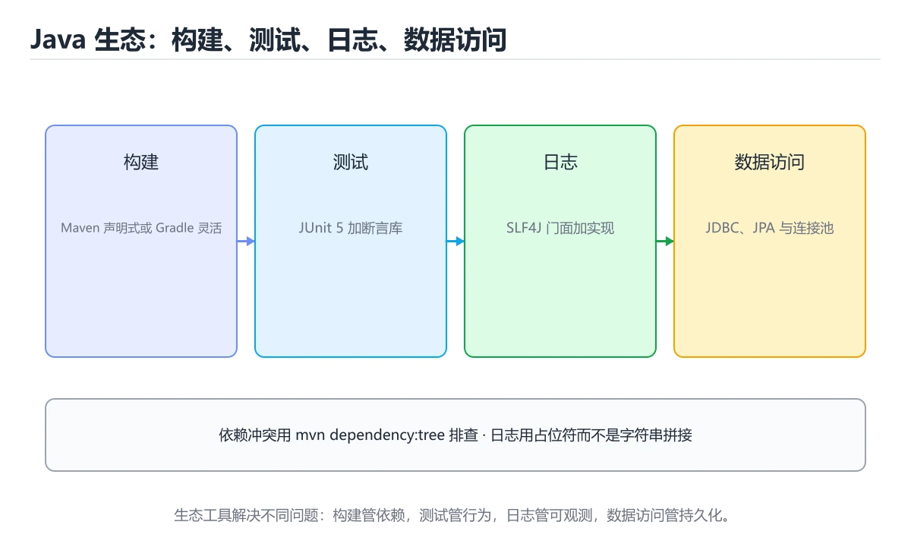

# 构建、测试与生态

> 内容更新时间：2026-10-06 · 学习阶段：进阶 · 预计用时：60 分钟




## 本节知识框架

**课程定位**：所属分类为「Java」，课程主题为「构建、测试与生态」，学习阶段为「进阶」，建议用时 60 分钟。

**本课要解决的主问题**：Maven/Gradle、JUnit/Mockito、日志门面、JDBC 与常见框架选型。

| 学习层次 | 要回答的问题 | 完成判据 |
| --- | --- | --- |
| 概念层 | 「构建、测试与生态」有哪些必须区分的对象与术语？ | 能用自己的话定义核心术语，并各举一个正例和一个反例。 |
| 机制层 | 这些对象按什么顺序发生作用，输入如何变成输出？ | 能画出或写出机制步骤，并说明每一步的失败条件。 |
| 应用层 | 什么场景适合使用「构建、测试与生态」，什么场景不适合？ | 能给出一个真实场景、一个最小示例和一个边界案例。 |
| 性能层 | 时间、空间、吞吐或延迟受哪些量影响？ | 能说出复杂度或性能瓶颈的证据来源；没有证据时明确写“材料未提供”。 |
| 复习层 | 怎样确认自己不是只记住了结论？ | 能独立完成本课自测，并把错误定位到概念、机制、示例或边界。 |

### 阅读路线

1. 先读「核心概念定义」，建立「Maven」等对象的精确定义。
2. 再读「原理与运行机制」，把定义串成可重复的过程。
3. 用「代码/协议/SQL 示例」验证过程，并只改一个条件观察结果变化。
4. 最后检查性能、易错点、知识关系与自测题，形成可复习的证据链。

**前置知识**：没有硬性先修课；仍建议先具备本分类的基础阅读与操作能力。

**学习位置**：本课位于《Lambda 与 Stream API》之后；如果前一课的自测不能通过，应先回补再继续。

**后续衔接**：下一课《多线程与并发》会继续使用本课术语，学完后建议立即完成一次自测。

**教材衔接：学习目标**

- 能用自己的话解释构建、测试与生态解决了什么问题，而不是只背术语。
- 能说清 「Maven」、「Gradle」、「JUnit」、「Mockito」 之间的关系，并分别举出一个例子。
- 能把 Maven 放回「构建、测试与生态」的知识体系，说明它和 Gradle 的边界。
- 能完成本课练习，并用验收标准检查自己的结果。

> 一句话摘要：Maven/Gradle、JUnit/Mockito、日志门面、JDBC 与常见框架选型。

**教材衔接：前置知识**

- 先完成上一课《多线程与并发》；如果已经掌握，可以直接用本课练习自测。
- 本课阶段：进阶。建议先掌握同一分类的基础课程，并能独立运行正文里的 JavaLanguageVersion 示例。
- 开始前先复习：Maven、Gradle、JUnit。
- 卡在 Maven 上时不要跳过：把输入、预期和实际输出写成三行，再回头读正文。

**教材衔接：本课小结**

Java 工程能力 = 构建工具 + 单测 + 日志 + 数据访问。先掌握 JUnit 与 Maven/Gradle 的基本用法，再按项目需要引入框架。

## 核心概念定义

> 阅读约定：本课先给「构建、测试与生态」相关术语的操作性定义与适用边界；正文里的口语化说法与定义冲突时，以定义和可复现示例为准。

| 术语 | 操作性定义 | 本课中的边界 |
| --- | --- | --- |
| System.out.println | 用 SLF4J 门面 + Logback/Log4j2 实现，避免直接使用 System.out.println；日志要带上下文，且不要输出密码、令牌等敏感信息。 | 仅在「构建、测试与生态」明确给出的输入、版本与资源条件下成立。 |
| JUnit | Java 常用的单元测试框架，用注解声明测试、断言和生命周期。 | 仅在「构建、测试与生态」明确给出的输入、版本与资源条件下成立。 |
| JDBC | JDBC 是基础，实际项目常用连接池（HikariCP）+ JPA/MyBatis。 | 仅在「构建、测试与生态」明确给出的输入、版本与资源条件下成立。 |
| 依赖坐标 | groupId 加 artifactId 加版本号唯一确定一个构件，冲突时按最近优先规则解析。 | 仅在「构建、测试与生态」明确给出的输入、版本与资源条件下成立。 |

### 定义如何使用

在「构建、测试与生态」中判断一个说法是否成立，先确认它使用的是哪个对象的定义，再检查输入规模、运行环境与失败路径。定义不是口号，而是后续推导、代码示例和自测题共享的约束。

## 原理与运行机制

### 机制总览

1. **建立输入**：把「System.out.println」按本课定义整理成可观察、可重复的输入条件。
2. **执行转换**：围绕「JUnit」执行本课的核心步骤；每一步都记录中间状态，避免只看最终输出。
3. **产生输出**：得到「JDBC」后，用正文示例或协议/SQL 结果核对输出是否符合预期。
4. **改变一个条件**：只替换一个边界条件或环境参数，观察「构建、测试与生态」的结论是否仍然成立。

| 阶段 | 关注对象 | 失败时应检查 |
| --- | --- | --- |
| 输入 | System.out.println | 类型、范围、编码、版本或前置状态是否满足定义。 |
| 处理 | JUnit | 顺序、可见性、锁、路由、事务或调度规则是否被破坏。 |
| 输出 | JDBC | 结果是否可复现，错误是否被正确传播而不是被吞掉。 |

本课的机制结论要用「构建、测试与生态」自己的示例验证。「构建、测试与生态」没有给出某个数量级、吞吐或内存数据时，本课把该判断标为“材料未提供”，不从相邻主题外推。

**教材衔接：生态速览**

| 领域 | 常用选择 |
| --- | --- |
| Web 框架 | Spring Boot、Quarkus、Javalin |
| 持久化 | JDBC、JPA/Hibernate、MyBatis |
| 测试 | JUnit 5、Mockito、Testcontainers |
| 构建 | Maven、Gradle |
| 日志 | SLF4J + Logback |

**教材衔接：构建工具速查**

| 目的 | Maven | Gradle |
| --- | --- | --- |
| 配置格式 | `pom.xml` | `build.gradle(.kts)` |
| 编译 | `mvn compile` | `gradle compileJava` |
| 测试 | `mvn test` | `gradle test` |
| 打包 | `mvn package` | `gradle build` |
| 跳过测试打包 | `mvn package -DskipTests` | `gradle build -x test` |
| 清理 | `mvn clean` | `gradle clean` |
| 依赖树 | `mvn dependency:tree` | `gradle dependencies` |
| 常用插件 | Surefire、Shade | Shadow、Spotless |

依赖管理速查：

| 概念 | 说明 |
| --- | --- |
| `groupId:artifactId:version` | Maven 坐标，定位一个依赖 |
| `implementation` | Gradle 中不对使用者暴露的依赖 |
| `api` | Gradle 中会传递给使用者的依赖 |
| `testImplementation` | 只用于测试 |
| BOM / `platform` | 统一管理一组依赖版本 |
| `dependencyManagement` | Maven 中锁定版本 |
| 传递依赖冲突 | 用 `enforcedPlatform` 或 `exclude` 处理 |

**教材衔接：日志速查**

| 目的 | 写法 |
| --- | --- |
| 声明日志器 | `private static final Logger log = LoggerFactory.getLogger(X.class);` |
| 占位符 | `log.info("下单成功 userId={}, amount={}", userId, amount);` |
| 记录异常 | `log.error("处理失败 orderId={}", id, e);` |
| 条件日志 | `if (log.isDebugEnabled()) { ... }` |
| 级别 | `ERROR` > `WARN` > `INFO` > `DEBUG` > `TRACE` |
| 禁止 | `System.out.println`、字符串拼接日志、打印敏感数据 |

**教材衔接：版本与时效**

- 版本基线会影响 Maven 的可用 API，升级前先用编译与测试验证。
- 升级收益集中在并发与内存模型；Gradle 相关代码需要单独回归。
- 升级「构建、测试与生态」涉及的依赖前，先用 JavaLanguageVersion 复现当前行为，再逐项核对版本说明与破坏性变更。

### 升级检查清单

- 先固定当前版本，跑通全部示例与测验，再升级工具链。
- 升级时只动一个依赖版本，用 JavaLanguageVersion 记录构建与运行结果。
- 回归范围锁定 JavaLanguageVersion 的默认行为，并确认弃用警告是否出现在构建输出里。
- 升级完成后更新本课「最后复核 / 下次复核」日期，并记录 Maven 的版本变化。

## 典型应用场景

| 场景 | 典型输入或前提 | 期望产物 |
| --- | --- | --- |
| 学习验证 | 使用本课最小示例和 Maven、Gradle | 能复现正文结论，并解释每一步。 |
| 工程落地 | 把「构建、测试与生态」放入真实模块或服务边界 | 输出可观测、失败可定位、参数可配置。 |
| 故障排查 | 只改一个版本、规模、输入或依赖条件 | 能区分概念错误、实现错误和环境差异。 |

判断「构建、测试与生态」的场景是否成立，标准是能否写出输入、处理、输出和失败路径；材料中没有出现的数据在本课标注为“材料未提供”，不用推测替代证据。

**课程内置实验入口**：`sandbox:java`，用于动手验证《构建、测试与生态》的机制；实验结论不替代概念定义与复杂度分析。

## 代码/协议/SQL 示例

### 最小可验证示例

下面保留《构建、测试与生态》原文中的最小示例。先预测《构建、测试与生态》示例的输出，再按正文步骤运行或推演；示例依赖外部环境时，同时记录版本与输入。

```xml
<!-- pom.xml（Maven）-->
<project>
  <modelVersion>4.0.0</modelVersion>
  <groupId>com.example</groupId>
  <artifactId>demo</artifactId>
  <version>1.0.0</version>
  <properties>
    <maven.compiler.release>21</maven.compiler.release>
  </properties>
  <dependencies>
    <dependency>
      <groupId>org.junit.jupiter</groupId>
      <artifactId>junit-jupiter</artifactId>
      <version>5.10.0</version>
      <scope>test</scope>
    </dependency>
  </dependencies>
</project>
```

**教材衔接：Maven 与 Gradle**

```xml
<!-- pom.xml（Maven）-->
<project>
  <modelVersion>4.0.0</modelVersion>
  <groupId>com.example</groupId>
  <artifactId>demo</artifactId>
  <version>1.0.0</version>
  <properties>
    <maven.compiler.release>21</maven.compiler.release>
  </properties>
  <dependencies>
    <dependency>
      <groupId>org.junit.jupiter</groupId>
      <artifactId>junit-jupiter</artifactId>
      <version>5.10.0</version>
      <scope>test</scope>
    </dependency>
  </dependencies>
</project>
```

```groovy
// build.gradle（Gradle）
plugins { id 'java' }
java { toolchain { languageVersion = JavaLanguageVersion.of(21) } }
repositories { mavenCentral() }
dependencies {
    testImplementation 'org.junit.jupiter:junit-jupiter:5.10.0'
}
```

```bash
mvn clean package          # Maven：编译 + 测试 + 打包
gradle build               # Gradle：默认增量构建更快
```

**教材衔接：单元测试**

```java
import org.junit.jupiter.api.Test;
import static org.junit.jupiter.api.Assertions.*;

class CalculatorTest {
    @Test
    void addsNumbers() {
        assertEquals(5, Calculator.add(2, 3));
    }

    @Test
    void throwsOnDivideByZero() {
        assertThrows(ArithmeticException.class, () -> Calculator.divide(1, 0));
    }
}
```

Mockito 用于隔离依赖：

```java
UserRepository repo = mock(UserRepository.class);
when(repo.findById(1L)).thenReturn(Optional.of(new User("tom")));
```

**教材衔接：日志**

```java
private static final Logger log = LoggerFactory.getLogger(Service.class);

log.info("创建订单 id={} userId={}", orderId, userId);
log.warn("库存不足 sku={}", sku);
log.error("下单失败 userId={}", userId, exception);   // 异常作为最后一个参数
```

用 SLF4J 门面 + Logback/Log4j2 实现，避免直接使用 `System.out.println`；日志要带上下文，且不要输出密码、令牌等敏感信息。

**教材衔接：数据库访问**

```java
try (Connection conn = DriverManager.getConnection(url, user, password);
     PreparedStatement ps = conn.prepareStatement("SELECT name FROM users WHERE id = ?")) {
    ps.setLong(1, userId);
    try (ResultSet rs = ps.executeQuery()) {
        if (rs.next()) System.out.println(rs.getString("name"));
    }
}
```

JDBC 是基础，实际项目常用连接池（HikariCP）+ JPA/MyBatis。**永远使用 PreparedStatement 防 SQL 注入**。

**教材衔接：JUnit 5 速查**

| 注解 / 方法 | 作用 |
| --- | --- |
| `@Test` | 标记测试方法 |
| `@BeforeEach` / `@AfterEach` | 每个用例前后执行 |
| `@BeforeAll` / `@AfterAll` | 整个测试类前后执行（需静态） |
| `@DisplayName` | 可读的用例名 |
| `@Disabled` | 暂时跳过 |
| `@ParameterizedTest` + `@ValueSource` / `@CsvSource` | 参数化 |
| `@Nested` | 分组用例 |
| `@Tag` | 分类标记（如 `slow`） |
| `assertThrows` | 断言抛异常 |
| `assertAll` | 一次断言多项，全部失败都报告 |
| `assertTimeout` | 断言执行时间 |

```java
import org.junit.jupiter.api.*;
import static org.junit.jupiter.api.Assertions.*;

class PriceCalculatorTest {
    private PriceCalculator calculator;

    @BeforeEach
    void setUp() {
        calculator = new PriceCalculator();
    }

    @Test
    @DisplayName("VIP 用户免运费")
    void vipFreeShipping() {
        assertEquals(0, calculator.shippingFee("vip", 100));
    }

    @ParameterizedTest
    @CsvSource({"normal,100,10", "normal,300,0"})
    void shippingByAmount(String type, int amount, int expected) {
        assertEquals(expected, calculator.shippingFee(type, amount));
    }

    @Test
    void rejectsNegativeAmount() {
        assertThrows(IllegalArgumentException.class,
                () -> calculator.shippingFee("normal", -1));
    }
}
```

**教材衔接：零基础详解：Java 工具链与工程实践**

### 一句话说清它是什么

Java 的工具链负责四件事：**编译、依赖管理、构建打包、测试与质量检查**。
现代项目基本都用 Maven 或 Gradle 中的一个，再配上 JUnit 与静态检查。

### 用生活比喻理解

| 工具 | 比喻 | 说明 |
| --- | --- | --- |
| JDK | 全套工具 | 编译器 + 运行时 + 工具 |
| Maven / Gradle | 施工队 | 拉材料、编译、打包 |
| 仓库 | 建材市场 | 中央仓库 + 私服 |
| JUnit | 验收员 | 自动跑测试 |
| 依赖范围 | 材料用途 | compile / runtime / test |

### Maven 与 Gradle 怎么选

| 对比 | Maven | Gradle |
| --- | --- | --- |
| 配置方式 | XML，约定优先 | Groovy/Kotlin DSL，灵活 |
| 学习曲线 | 平缓 | 前期略陡 |
| 构建速度 | 一般 | 增量与缓存更好 |
| 生态 | 极其成熟 | 现代 Android 与微服务主流 |
| 建议 | 企业传统项目 | 新项目或 Android |

### Maven 的 pom 关键片段

```xml
<properties>
  <maven.compiler.release>21</maven.compiler.release>
  <project.build.sourceEncoding>UTF-8</project.build.sourceEncoding>
</properties>

<dependencies>
  <dependency>
    <groupId>com.fasterxml.jackson.core</groupId>
    <artifactId>jackson-databind</artifactId>
    <version>2.18.0</version>
  </dependency>
  <dependency>
    <groupId>org.junit.jupiter</groupId>
    <artifactId>junit-jupiter</artifactId>
    <version>5.11.0</version>
    <scope>test</scope>            <!-- 只在测试期需要 -->
  </dependency>
</dependencies>

<build>
  <plugins>
    <plugin>
      <groupId>org.apache.maven.plugins</groupId>
      <artifactId>maven-surefire-plugin</artifactId>
      <version>3.5.0</version>
    </plugin>
  </plugins>
</build>
```

常用命令：

```bash
mvn -q clean verify            # 清理 + 编译 + 测试 + 打包校验
mvn -q test                    # 只跑测试
mvn -q dependency:tree         # 查看依赖树，排查冲突
mvn -q versions:display-dependency-updates   # 检查可升级依赖
```

### Gradle 的 build.gradle.kts 关键片段

```kotlin
plugins {
    java
    application
}

java {
    toolchain { languageVersion = JavaLanguageVersion.of(21) }
}

repositories { mavenCentral() }

dependencies {
    implementation("com.fasterxml.jackson.core:jackson-databind:2.18.0")
    testImplementation("org.junit.jupiter:junit-jupiter:5.11.0")
    testRuntimeOnly("org.junit.platform:junit-platform-launcher")
}

tasks.test {
    useJUnitPlatform()
}

application { mainClass = "com.example.App" }
```

```bash
./gradlew build             # 编译 + 测试 + 打包
./gradlew test --info       # 详细测试输出
./gradlew dependencies      # 依赖树
./gradlew --refresh-dependencies build
```

**记得提交 `gradle/wrapper` 与 `mvnw`**，这样别人不用装指定版本也能构建。

### JUnit 5 的三件套

```java
import org.junit.jupiter.api.*;
import org.junit.jupiter.params.ParameterizedTest;
import org.junit.jupiter.params.provider.ValueSource;

import static org.junit.jupiter.api.Assertions.*;

class PriceTest {
    @Test
    void 保留两位小数() {
        assertEquals("19.90", Price.format(19.9));
    }

    @Test
    void 负数抛异常() {
        var ex = assertThrows(IllegalArgumentException.class, () -> Price.format(-1));
        assertTrue(ex.getMessage().contains("不能为负"));
    }

    @ParameterizedTest
    @ValueSource(strings = {"", " ", "abc"})
    void 非法输入都报错(String input) {
        assertThrows(IllegalArgumentException.class, () -> Price.parse(input));
    }
}
```

| 注解 | 作用 |
| --- | --- |
| `@Test` | 一个测试方法 |
| `@BeforeEach` / `@AfterEach` | 每个用例前后执行 |
| `@ParameterizedTest` | 一组数据跑同一逻辑 |
| `@Disabled` | 临时跳过（需说明原因） |
| `@DisplayName` | 给用例起可读名字 |

### CI 里的标准动作

```yaml
- run: ./mvnw -B -q clean verify        # 或 ./gradlew build
- run: ./mvnw -B org.jacoco:jacoco-maven-plugin:report
```

| 检查 | 工具 |
| --- | --- |
| 单元测试 | JUnit 5 |
| 覆盖率 | JaCoCo |
| 静态分析 | SpotBugs、Error Prone |
| 依赖漏洞 | OWASP Dependency-Check |
| 代码格式 | Spotless、google-java-format |

### 新手最容易踩的八个坑

| 坑 | 现象 | 正确做法 |
| --- | --- | --- |
| 用 `system` 路径引本地 jar | 换机器就失败 | 装进私服或本地仓库 |
| 依赖版本互相冲突 | `NoSuchMethodError` | 用 `dependency:tree` 排查 |
| 忘提交 wrapper | 构建环境不一致 | 提交 `mvnw` / `gradlew` |
| 测试依赖生产配置 | 测试不稳定 | 用测试专用配置 |
| 依赖不写 `test` 范围 | 打包体积变大 | 测试依赖标 `test` |
| 用 `mvn install` 代替 `verify` | 污染本地仓库 | CI 用 `verify` |
| 忽略编码设置 | 中文乱码 | 显式设 UTF-8 |
| 不看依赖更新 | 漏洞长期存在 | 定期升级并跑漏洞扫描 |

### 手把手练习：给项目加质量门禁

```xml
<plugin>
  <groupId>org.jacoco</groupId>
  <artifactId>jacoco-maven-plugin</artifactId>
  <version>0.8.12</version>
  <executions>
    <execution>
      <goals><goal>prepare-agent</goal></goals>
    </execution>
    <execution>
      <id>check</id>
      <phase>verify</phase>
      <goals><goal>check</goal></goals>
      <configuration>
        <rules>
          <rule>
            <element>BUNDLE</element>
            <limits>
              <limit>
                <counter>LINE</counter>
                <value>COVEREDRATIO</value>
                <minimum>0.70</minimum>
              </limit>
            </limits>
          </rule>
        </rules>
      </configuration>
    </execution>
  </executions>
</plugin>
```

这样覆盖率低于 70% 时 `mvn verify` 会直接失败，形成硬门禁。

### 学完自测

- [ ] 能说出 Maven 与 Gradle 的三点差异。
- [ ] 知道 `test` 依赖范围的作用。
- [ ] 能说出 `mvn verify` 与 `mvn install` 的区别。
- [ ] 知道为什么要提交 wrapper 与 mvnw。
- [ ] 能用 JaCoCo 配置一条覆盖率门禁。

## 时间/空间复杂度或性能分析

**复杂度证据**：「构建、测试与生态」的现有材料没有给出渐近时间或空间复杂度的明确结论，本课只做定性检查，不补写未经验证的 $O$ 记号。

| 维度 | 本课关注点 | 判断依据 |
| --- | --- | --- |
| 时间/延迟 | 「构建、测试与生态」的主要步骤是否会随输入规模、并发度或网络往返增长。 | 以正文复杂度、基准数据或可重复测量为准。 |
| 空间/内存 | 中间状态、缓存、副本、连接或索引是否随规模增长。 | 记录峰值内存与数据副本，不只看最终结果。 |
| 吞吐/资源 | 版本、调度、锁、IO、序列化或协议开销是否成为瓶颈。 | 固定环境做对照实验，改变一个变量。 |

评估「构建、测试与生态」时要区分“正确性成立”和“性能达标”两件事；材料没有给出基准时，本课只保留量级来源与测量方法，不写不可验证的绝对数字。

## 常见误区与易错点

> 复核《构建、测试与生态》的易错点时，优先保留原文的错误表、故障现场与排错路径；每条修正都要能用本课示例复验。

| 易错点 | 常见表现 | 正确做法 |
| --- | --- | --- |
| 只背结论 | 能复述「构建、测试与生态」的定义，却说不清输入、输出与边界。 | 回到机制步骤，用最小示例逐一验证。 |
| 混淆相邻概念 | 把本课对象与相邻主题的对象当成同一类。 | 先比较定义、资源归属、生命周期和失败模式。 |
| 忽略版本与环境 | 在开发机通过后直接外推到生产环境。 | 固定版本、输入和资源条件，再记录可复现结果。 |

**教材衔接：常见错误与排查**

| 容易踩的做法 | 实际现象 | 原因与正确做法 |
| --- | --- | --- |
| `mvn package -DskipTests` 当成默认 | 带缺陷发布 | 只在明确需要时跳过，CI 必须跑测试 |
| 依赖不加版本、依赖 BOM 缺失 | 版本漂移 | 用 BOM 或显式声明版本 |
| `implementation` 与 `api` 混用 | 使用方编译失败或依赖泄漏 | 内部依赖用 `implementation` |
| 测试依赖放进 `dependencies` | 生产包体积变大 | 用 `testImplementation` / `test` scope |
| 依赖冲突不排查 | 运行时 `NoSuchMethodError` | 用依赖树定位并排除 |
| 日志用字符串拼接 | 无谓的性能开销 | 用占位符 `{}` |
| 用 `System.out.println` 调试 | 生产日志无法统一收集 | 用日志框架并分级 |
| 日志打印密码或令牌 | 安全事件 | 脱敏处理 |
| 测试之间共享静态状态 | 单跑通过、一起跑失败 | 每个用例独立准备数据 |
| 断言太弱（只断言不抛异常） | 回归测不出来 | 断言具体值或异常类型 |

**教材衔接：故障现场**

### 现场 1：implementation 与 api 混用

**症状**：在《构建、测试与生态》的复现场景中，使用方编译失败或依赖泄漏。

**根因**：触发点是把“implementation 与 api 混用”当成安全做法。它没有满足《构建、测试与生态》要求的前提，因此先表现为“使用方编译失败或依赖泄漏”；排查时先完整复现这一段，再核对输入、配置与依赖。

**修复**：针对《构建、测试与生态》的问题，内部依赖用 implementation。

**验证**：先在《构建、测试与生态》中记录“implementation 与 api 混用”留下的失败证据，再执行“内部依赖用 implementation”并重放；确认错误路径变为明确结果，且修复没有掩盖同类故障。

### 现场 2：测试依赖放进 dependencies

**症状**：在《构建、测试与生态》的复现场景中，生产包体积变大。

**根因**：当出现“测试依赖放进 dependencies”时，执行路径已经绕过了《构建、测试与生态》的关键约束，最终以“生产包体积变大”暴露出来；修复前必须先确认约束在哪里失效。

**修复**：针对《构建、测试与生态》的问题，用 testImplementation / test scope。

**验证**：保留《构建、测试与生态》里触发“生产包体积变大”的输入、版本和日志，按“用 testImplementation / test scope”完成修改后原样重放；只有失败现象消失且相邻场景仍可解释，才保留改动。

### 现场 3：依赖冲突不排查

**症状**：在《构建、测试与生态》的复现场景中，运行时 NoSuchMethodError。

**根因**：“运行时 NoSuchMethodError”只是表层结果。向上追溯会落到“依赖冲突不排查”这一步，因为它省略了《构建、测试与生态》的约束，使实现行为和预期模型发生了偏离。

**修复**：针对《构建、测试与生态》的问题，用依赖树定位并排除。

**验证**：先在《构建、测试与生态》中记录“依赖冲突不排查”留下的失败证据，再执行“用依赖树定位并排除”并重放；确认错误路径变为明确结果，且修复没有掩盖同类故障。

## 与其他知识点的关系

| 关系 | 课程 | 为什么 |
| --- | --- | --- |
| 关联 | 《实战：Spring Boot REST API》 | 用于横向比较或把本课结论迁移到相邻主题。 |
| 前置顺序 | 《Lambda 与 Stream API》 | 同分类中安排在本课之前，建议先完成其自测。 |
| 后续顺序 | 《多线程与并发》 | 同分类中安排在本课之后，会继续使用本课术语。 |

把「构建、测试与生态」放回知识体系时，不只要记住“前面学过什么”，还要说明两个主题在输入、机制、资源边界和失败模式上的差异。这样才能把单课知识迁移到项目、排障和后续课程。

## 自测题与参考答案

> 先独立作答《构建、测试与生态》的自测题，再对照答案与解析；每处判断都要能在本课正文或示例中找到依据。

### 自测 1

围绕“构建、测试与生态”中的 Maven、Gradle、JUnit，下列哪两项是本课强调的实践判断？

A. 把 Gradle 的单次运行结果当成所有版本和规模都成立
B. 学习 Maven 时要同时说明输入、输出和失败路径，不能只看正常流程
C. 只要 Maven 的常规示例通过，就可以跳过边界与异常路径
D. 验证 Gradle 时要固定版本并覆盖边界输入，结论才可复现

**参考答案**：学习 Maven 时要同时说明输入、输出和失败路径，不能只看正常流程；验证 Gradle 时要固定版本并覆盖边界输入，结论才可复现

**解析**：本课把构建、测试与生态拆成概念、示例与故障现场三部分，因此判断 Maven 时必须同时交代输入、输出和失败路径，这使“学习 Maven 时要同时说明输入、输出和失败路径，不能只看正常流程”成立。在构建、测试与生态里，判断 Gradle 时要固定版本与边界输入，所以“验证 Gradle 时要固定版本并覆盖边界输入，结论才可复现”才可复现。

### 自测 2

这段代码是「构建、测试与生态」的示例片段，下面哪一项描述与它一致？

```java
mvn clean package          # Maven：编译 + 测试 + 打包
gradle build               # Gradle：默认增量构建更快
```

A. 这段代码只做静态声明，没有循环、分支或可观察输出。
B. 这段代码把主要逻辑封装在函数或方法里，需要被调用才会执行。
C. 这段代码包含异常处理分支，失败时会走专门的补救路径。
D. 这段代码会读取外部输入，结果依赖传入的数据。

**参考答案**：这段代码只做静态声明，没有循环、分支或可观察输出。

**解析**：在「构建、测试与生态」里，题干的正确项是这段代码只做静态声明，没有循环、分支或可观察输出，在「构建、测试与生态」里它只能证明Maven相关约束存在，不能替代真实运行证据。把输入或边界换成空值、极值或失败情况后，结论要以「构建、测试与生态」的实际运行结果为准。把“这段代码只做静态声明，没有循环”代回「构建、测试与生态」里“这段代码是构建、测试与生态的示例片段”的例子核对，条件一旦改变，结论就要用Maven、Gradle、JUnit重新推导。

### 自测 3

防止 SQL 注入的正确做法是？

A. 过滤单引号
B. 使用 PreparedStatement 参数占位符
C. 用存储过程
D. 字符串拼接 SQL，但这会留下攻击面，同时这会加重锁竞争

**参考答案**：使用 PreparedStatement 参数占位符

**解析**：在「构建、测试与生态」里，使用 PreparedStatement 参数占位符。预编译语句把参数与 SQL 结构分离，是防注入的标准手段。“注入的正确做法是”与「构建、测试与生态」的术语表相呼应，只有符合Maven、Gradle、JUnit约束的“使用 PreparedStatement”才是正文支持的结论。

**教材衔接：复习与自测**

- [ ] 会用 Maven 或 Gradle 完成编译、测试、打包。
- [ ] 依赖冲突会用依赖树定位并排除。
- [ ] JUnit 5 用例覆盖正常、边界与异常路径。
- [ ] 日志用占位符且不打印敏感信息。
- [ ] CI 中不跳过测试。

**教材衔接：动手练习**

> 本课练习重点：围绕「Maven、Gradle、JUnit」完成复述、实验和交付，每个结果都要能被别人检查。

先跑通 Maven 的最小类与测试，再补异常与并发边界，最后观察资源变化。

### 练习 1：建立心智模型（10 分钟）

合上教程，用 3～5 句话回答：

1. 构建、测试与生态解决了什么问题？
2. 如果没有它，会出现什么具体后果？
3. 它和「Gradle」是什么关系？

验收标准：说明 Maven 与 Gradle 的分工，并写出一个失效场景。

### 练习 2：做一次可控实验（20 分钟）

从正文中选一个最小示例，完成以下操作：

1. 先预测修改一个参数、输入或步骤后的结果。
2. 再实际执行或逐步推演，记录真实结果。
3. 如果结果与预测不同，写出差异原因。

**验收标准**：用 JavaLanguageVersion 复现原例后，把Gradle改成边界值，五步记录缺一不可，其中「原因」一栏要写明「构建、测试与生态」里哪条规则被触发。

### 练习 3：交付一个小结果（30 分钟）

写一个可运行的小类，补一个普通测试和一个边界输入测试。

任务要求：

- 结果必须能被别人检查，不能只写“我已经理解了”。
- 至少覆盖「Maven」和「Gradle」两个关键词。
- 写出 1 个仍然不确定的问题，以及下一步如何验证。

> 提示：时间有限时优先做练习 1 和练习 2；练习 3 可以拆成两次完成。

**教材衔接：可运行练习**

### 任务 1：先跑通，再解释

```bash
mvn -q clean verify            # 清理 + 编译 + 测试 + 打包校验
mvn -q test                    # 只跑测试
mvn -q dependency:tree         # 查看依赖树，排查冲突
mvn -q versions:display-dependency-updates   # 检查可升级依赖
```

### 任务 2：只改一个条件

把「构建、测试与生态」的最小示例复制一份，只改一个条件再跑一次：

- 改动点：把 Gradle 换成边界值，其他输入保持原样。
- 预测：先写下「构建、测试与生态」在改动后的输出或错误信息，再运行。
- 记录：对照改动前后的结果，指出差异出在哪一步。
- 验收：换回原条件能复现原结果，改动只影响Maven。

### 任务 3：迁移到自己的数据

把 JavaLanguageVersion 换成你自己的输入，先保持步骤不变，再比较输出差异。

**教材衔接：本课复习清单**

离开本课前，逐项确认：

- [ ] 不看解析，能说出「Maven 与 Gradle 的主要作用是？」的判断依据。
- [ ] 不看解析，能说出「日志门面（facade）通常使用？」的判断依据。
- [ ] 不看解析，能说出「防止 SQL 注入的正确做法是？」的判断依据。
- [ ] 不看解析，能说出「JUnit 5 中编写参数化测试使用哪个注解？」的判断依据。
- [ ] 至少运行一次 JavaLanguageVersion 的示例，记录输入、输出和 Maven 的边界情况。
- [ ] 把本课最容易混淆的两个概念写成一句话对照。

| 复盘项 | 记录 |
| --- | --- |
| 已经能独立解释的考点 |  |
| 仍然说不清的概念 |  |
| 下一步验证动作 |  |

---

## 术语速查

| 术语 | 一句话说明 |
| --- | --- |
| `System.out.println` | 用 SLF4J 门面 + Logback/Log4j2 实现，避免直接使用 `System.out.println`；日志要带上下文，且不要输出密码、令牌等敏感信息。 |
| `JUnit` | Java 常用的单元测试框架，用注解声明测试、断言和生命周期。 |
| `JDBC` | JDBC 是基础，实际项目常用连接池（HikariCP）+ JPA/MyBatis。 |
| `依赖坐标` | groupId 加 artifactId 加版本号唯一确定一个构件，冲突时按最近优先规则解析。 |

## 考点精讲

### 考点 1：多选辨析·Maven

- **题目**：围绕“构建、测试与生态”中的 Maven、Gradle、JUnit，下列哪两项是本课强调的实践判断？
- **判断依据**：本课把构建、测试与生态拆成概念、示例与故障现场三部分，因此判断 Maven 时必须同时交代输入、输出和失败路径，这使“学习 Maven 时要同时说明输入、输出和失败路径，不能只看正常流程”成立。在构建、测试与生态里，判断 Gradle 时要固定版本与边界输入，所以“验证 Gradle 时要固定版本并覆盖边界输入，结论才可复现”才可复现。

### 考点 2：代码补全·Maven

- **题目**：这段代码是「构建、测试与生态」的示例片段，下面哪一项描述与它一致？
- **判断依据**：在「构建、测试与生态」里，题干的正确项是这段代码只做静态声明，没有循环、分支或可观察输出，在「构建、测试与生态」里它只能证明Maven相关约束存在，不能替代真实运行证据。把输入或边界换成空值、极值或失败情况后，结论要以「构建、测试与生态」的实际运行结果为准。把“这段代码只做静态声明，没有循环”代回「构建、测试与生态」里“这段代码是构建、测试与生态的示例片段”的例子核对，条件一旦改变，结论就要用Maven、Gradle、JUnit重新推导。

### 考点 3：概念判断·Maven

- **题目**：防止 SQL 注入的正确做法是？
- **判断依据**：在「构建、测试与生态」里，使用 PreparedStatement 参数占位符。预编译语句把参数与 SQL 结构分离，是防注入的标准手段。“注入的正确做法是”与「构建、测试与生态」的术语表相呼应，只有符合Maven、Gradle、JUnit约束的“使用 PreparedStatement”才是正文支持的结论。

### 考点 4：概念判断·Maven

- **题目**：JUnit 5 中编写参数化测试使用哪个注解？
- **判断依据**：配合 @ValueSource / @CsvSource 提供数据，同样的逻辑可覆盖多组输入。在「构建、测试与生态」里，其他选项：JUnit 5 使用 @ParameterizedTest 搭配 @ValueSource 或 @CsvSource。在「构建、测试与生态」里，这道题要求区分概念与边界，「@ParameterizedTest」只有在题干给出的前提下才成立，而「@RepeatTest」、「@TheoryTest」缺少同一组条件。

### 考点 5：概念判断·Maven

- **题目**：Gradle 中 settings.gradle 与 build.gradle 的分工是？
- **判断依据**：在「构建、测试与生态」里，settings 定义项目结构（包含哪些模块）。多模块 Gradle 项目靠 settings.gradle 聚合子模块。这道题的关键在「构建、测试与生态」的Maven、Gradle、JUnit：先确认题干“Gradle 中 settings.”问的是哪一步，再排除偷换前提的选项。

### 考点 6：填空·Maven

- **题目**：补全代码：「构建、测试与生态」示例中，下面这行代码缺少哪个关键字或函数名？请填入 ____。 `____("org.junit.jupiter:junit-jupiter:5.11.0")`
- **判断依据**：空格应填写「testImplementation」、「testimplementation」。回到「构建、测试与生态」的正文示例，用“补全代码”走一遍Maven、Gradle、JUnit的完整流程，能复现的结论才可以保留。回到Maven、Gradle、JUnit本身再看一遍：只有“testImplementation”与题干“测试与生态示例中”的前提一致，结论才成立。

## English Overview

**Title:** Build, Test & Ecosystem

**Summary:** Maven/Gradle, JUnit, logging, JDBC and frameworks.

**Category:** Java
**Level:** 进阶
**Key terms:** Maven, Gradle, JUnit, Mockito, SLF4J, JDBC

## 内容元数据

- 内容版本：v2.0
- 最后更新：2026-10-06
- 学习阶段：进阶
- 适用环境：Java 21+ / Maven 或 Gradle
；本课聚焦 Maven。
- 内容来源：内置结构化课程与工程实践整理
- 相关主题：Maven、Gradle、JUnit、Mockito、SLF4J、JDBC
- 质量版本：P0 测验标准 + P1 覆盖扩展 + P2 体验补全

## 参考资料与复核

- 最后复核：2026-10-04
- 下次复核：2027-02-24
- 复核范围：版本兼容、API 行为、安全建议与工程实践
- 来源性质：官方文档、标准或权威教材；正文为离线教学重组

| 参考资料 | 本课用途 |
| --- | --- |
| [Gradle 文档](https://docs.gradle.org/current/userguide/userguide.html) | 构建脚本与依赖管理 |
| [JUnit 用户指南](https://junit.org/junit5/docs/current/user-guide/) | 自动化测试与断言 |
| [Java 并发教程](https://docs.oracle.com/javase/tutorial/essential/concurrency/) | 线程、同步与并发工具 |

> 「构建、测试与生态」的链接用于离线阅读后的延伸核对；App 不会自动联网。
