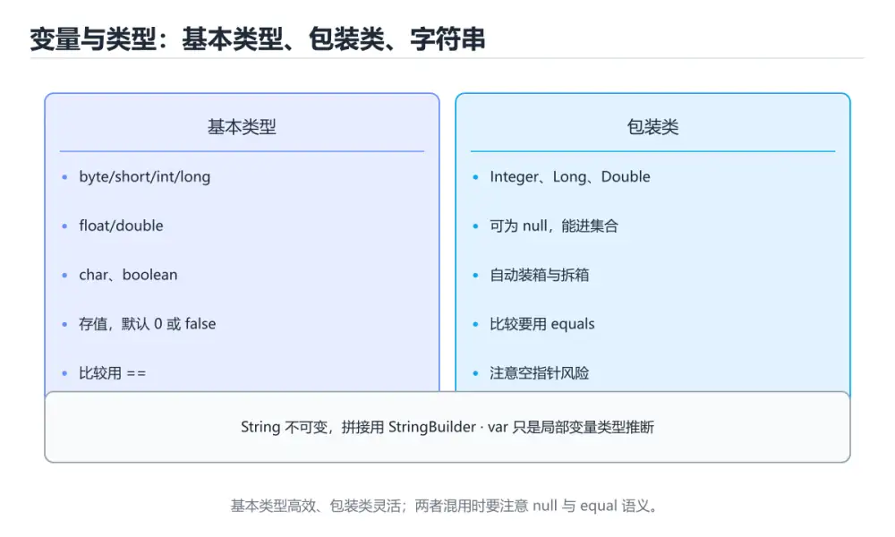
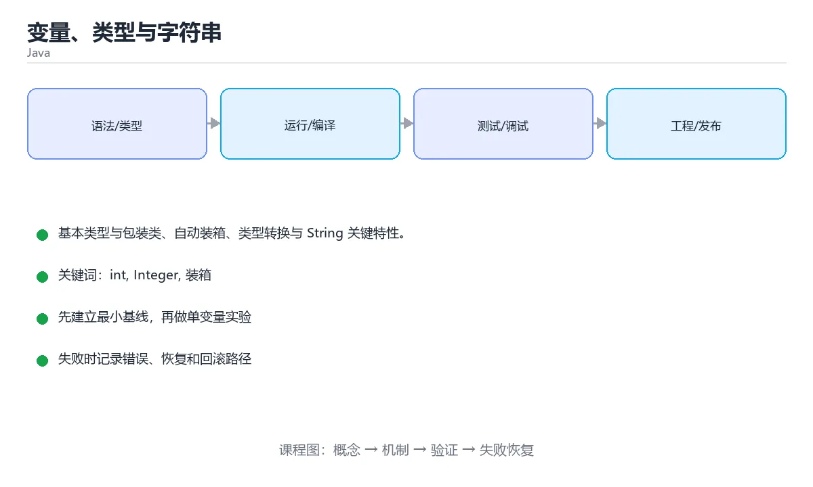

# 变量、类型与字符串





> 内容更新时间：2026-10-06 · 学习阶段：基础 · 预计用时：35 分钟

## 学习目标

- 能用自己的话解释变量、类型与字符串解决了什么问题，而不是只背术语。
- 能说清 「int」、「Integer」、「装箱」、「String」 之间的关系，并分别举出一个例子。
- 能把本课知识放回「Java」的知识体系，说明它和相邻主题的边界。
- 能完成本课练习，并用验收标准检查自己的结果。

> 一句话摘要：基本类型与包装类、自动装箱、类型转换与 String 关键特性。

## 前置知识

- 先完成上一课《环境与 JVM》；如果已经掌握，可以直接用本课练习自测。
- 本课阶段：基础。建议会读写简单代码或命令，并理解变量、输入输出等基本概念。
- 开始前先复习：int、Integer、装箱。
- 如果某一步看不懂，先记录具体卡点，完成练习后再回头读一遍。

## 基本类型与包装类

```java
int      count = 42;        // 4 字节
long     big = 9_000_000_000L;
double   pi = 3.14159;
float    ratio = 0.5f;
boolean  ok = true;
char     letter = 'A';

Integer boxed = count;              // 自动装箱
int unboxed = boxed;                // 自动拆箱
```

基本类型不能为 `null`、不能当泛型参数；包装类可以，但拆箱时若为 `null` 会抛 `NullPointerException`。

## 类型转换

```java
int small = 100;
long widened = small;                 // 自动：小范围 → 大范围

double value = 3.99;
int truncated = (int) value;          // 强制：3，小数被截断

String text = "123";
int parsed = Integer.parseInt(text);  // 字符串 → 数字
String back = String.valueOf(parsed);
```

## String 要点

```java
String a = "hello";
String b = "hello";
System.out.println(a == b);            // true：字符串常量池复用

String c = new String("hello");
System.out.println(a == c);            // false：不同对象
System.out.println(a.equals(c));       // true：内容相同

String joined = a + " " + "world";     // 编译期优化为 StringBuilder
String upper = joined.toUpperCase();
```

**比较内容一律用 `equals`**；字符串不可变，每次「修改」都会产生新对象，循环拼接应使用 `StringBuilder`。

```java
StringBuilder sb = new StringBuilder();
for (int i = 0; i < 3; i++) {
    sb.append(i).append(',');
}
System.out.println(sb.toString());

// Java 15+ 文本块，多行字符串更清晰
String json = """
        {"name": "tom"}
        """;
```

## var 与常量

```java
var names = new ArrayList<String>();   // Java 10+ 局部变量类型推导
final int MAX = 100;                   // 常量，不可重新赋值
```

`var` 只用于局部变量，不降低类型安全，但可读性优先时可显式写类型。

## 本课小结
记住三个高频陷阱：**包装类可能为 null、字符串比较用 equals、浮点不要用 == 比较精确值**。

## 基本类型与包装类速查

| 基本类型 | 大小 | 包装类 | 默认值 |
| --- | --- | --- | --- |
| `byte` | 1 字节 | `Byte` | 0 |
| `short` | 2 字节 | `Short` | 0 |
| `int` | 4 字节 | `Integer` | 0 |
| `long` | 8 字节 | `Long` | 0L |
| `float` | 4 字节 | `Float` | 0.0f |
| `double` | 8 字节 | `Double` | 0.0d |
| `char` | 2 字节 | `Character` | '\u0000' |
| `boolean` | 1 字节 | `Boolean` | false |

装箱与拆箱速查：

| 场景 | 说明 |
| --- | --- |
| `Integer a = 1;` | 自动装箱 |
| `int b = a;` | 自动拆箱，`a` 为 `null` 时抛 `NullPointerException` |
| `Integer.valueOf(127) == Integer.valueOf(127)` | `true`（缓存 -128~127） |
| `Integer.valueOf(1000) == Integer.valueOf(1000)` | 通常 `false`，比较对象引用 |
| `a.equals(b)` | 比较值，包装类推荐用法 |
| `Integer.parseInt("42")` | 字符串转 `int`，失败抛 `NumberFormatException` |

## 字符串 API 速查

| 目的 | 写法 |
| --- | --- |
| 判空 | `str == null \|\| str.isEmpty()`，或 `str.isBlank()` |
| 比较 | `a.equals(b)`、`a.equalsIgnoreCase(b)` |
| 查找 | `indexOf`、`contains`、`startsWith`、`endsWith` |
| 截取 | `substring(begin, end)`（左闭右开） |
| 替换 | `replace`、`replaceAll`（正则） |
| 拆分 | `split(",")`，注意 `split` 参数是正则 |
| 拼接 | `String.join(",", list)` |
| 格式化 | `String.format("%.2f", price)` |
| 去空格 | `strip()`（推荐）、`trim()`（仅 ASCII） |
| 大小写 | `toUpperCase(Locale.ROOT)`（避免地区差异） |
| 与数字互转 | `Integer.parseInt` / `String.valueOf` |

```java
// 文本块（Java 15+）：写多行 JSON 或 SQL 更清晰
String json = """
        {
          "name": "小明",
          "age": 18
        }
        """;

// 金额用 BigDecimal，并明确舍入模式
import java.math.BigDecimal;
import java.math.RoundingMode;

BigDecimal price = new BigDecimal("19.9");
BigDecimal total = price.multiply(BigDecimal.valueOf(3))
                        .setScale(2, RoundingMode.HALF_UP);
```

## 常见错误对照表

| 容易写错的做法 | 实际现象 | 原因与正确做法 |
| --- | --- | --- |
| `a == b` 比较字符串 | 内容相同时可能为 `false` | 用 `equals`，注意顺序避免空指针 |
| `str.equals("x")` 且 `str` 为 null | `NullPointerException` | 写成 `"x".equals(str)` 或用 `Objects.equals` |
| 包装类直接参与运算 | 为 null 时 NPE | 先判空或用基本类型 |
| `double` 算金额 | 精度误差 | 用 `BigDecimal` 并指定舍入 |
| `float` 存大整数 | 精度丢失 | 用 `long` 或 `double` |
| `int` 相加溢出 | 结果变成负数 | 用 `long` 或 `Math.addExact` |
| `"a,b,,".split(",")` 长度不符 | 结尾空串被丢弃 | 用 `split(",", -1)` 保留空串 |
| `replaceAll(".", "")` 想删点号 | 全部字符被删 | 参数是正则，点号要转义或用 `replace` |
| `String` 循环拼接 | 产生大量临时对象 | 用 `StringBuilder` |
| 用 `==` 比较包装类 | 大数值时结果错误 | 用 `equals` 或先拆箱成基本类型 |

## 自测清单

- [ ] 能列出八种基本类型、包装类与默认值。
- [ ] 知道装箱缓存的取值范围（-128~127）。
- [ ] 字符串比较一律用 `equals`，并把常量写在前面。
- [ ] 金额用 `BigDecimal`，明确小数位与舍入模式。
- [ ] 循环拼接字符串使用 `StringBuilder`。

## 零基础详解：基本类型、包装类与字符串

### 一句话说清它是什么

Java 的类型分成两大家族：**基本类型**（直接存值，8 种）和**引用类型**（存地址，指向对象）。
理解这条分界线，`==`、装箱、null 这些问题就都通了。

### 八种基本类型

| 类型 | 大小 | 范围（约） | 默认值 | 说明 |
| --- | --- | --- | --- | --- |
| `byte` | 1 字节 | -128 ~ 127 | 0 | 处理原始字节 |
| `short` | 2 字节 | ±3.2 万 | 0 | 很少用 |
| `int` | 4 字节 | ±21 亿 | 0 | 默认整数类型 |
| `long` | 8 字节 | ±9.2×10¹⁸ | 0L | 写常量要加 `L` |
| `float` | 4 字节 | 约 7 位有效数字 | 0.0f | 写常量要加 `f` |
| `double` | 8 字节 | 约 15 位有效数字 | 0.0d | 默认小数类型 |
| `char` | 2 字节 | 0 ~ 65535 | '\u0000' | 存一个 Unicode 字符 |
| `boolean` | 1 位语义 | true / false | false | 不能与数字互转 |

### 基本类型 vs 包装类

| 对比项 | 基本类型 `int` | 包装类 `Integer` |
| --- | --- | --- |
| 存储 | 直接存值 | 存对象引用 |
| 能否为 null | 不能 | 能 |
| 能否当泛型参数 | 不能 | 能（`List<Integer>`） |
| 比较相等 | `==` 比值 | 必须用 `.equals()` |
| 性能 | 更好 | 有装箱开销 |

```java
Integer a = 127, b = 127;
System.out.println(a == b);        // true，小整数走了缓存池

Integer c = 128, d = 128;
System.out.println(c == d);        // false！超出缓存范围就是不同对象
```

**结论：包装类比较一律用 `.equals()`，别用 `==`。**

### 自动装箱与拆箱的隐藏陷阱

```java
Integer total = null;
int value = total;      // 拆箱时直接抛 NullPointerException
```

所以方法参数尽量用基本类型；必须用包装类时，先判空。

### String 的三条铁律

1. **不可变**：任何「修改」都返回新对象，原串不变。
2. **`==` 比地址，`.equals()` 比内容**。
3. **频繁拼接用 `StringBuilder`**，否则循环里会产生大量临时对象。

```java
String s = "abc";
s.toUpperCase();
System.out.println(s);              // 还是 abc，因为没用返回值

StringBuilder sb = new StringBuilder();
for (int i = 0; i < 3; i++) sb.append(i).append(',');
System.out.println(sb);             // 0,1,2,
```

### 类型转换：自动与强制

```java
int n = 100;
long big = n;               // 小 -> 大，自动提升
int back = (int) big;       // 大 -> 小，必须强转，可能丢高位
double d = 5 / 2;           // 结果是 2.0，不是 2.5！
double ok = 5 / 2.0;        // 2.5
```

整数除法先算完再提升，这是新手最常见的「精度丢失」原因。

### 新手最容易踩的七个坑

| 坑 | 现象 | 正确做法 |
| --- | --- | --- |
| 浮点直接比相等 | 条件几乎不成立 | 用误差 `Math.abs(a - b) < 1e-9` |
| `int` 溢出 | 结果变成负数 | 用 `long`，或 `Math.addExact` 抛异常 |
| 包装类 `==` 比较 | 128 以上就不相等 | 改用 `.equals()` |
| 拆箱空指针 | `NullPointerException` | 用前判空或用基本类型 |
| `String` 循环拼接 | 数据量大时极慢 | 用 `StringBuilder` |
| 字符串没接收返回值 | 以为被改了 | `s = s.trim()` |
| 忘记 `L` / `f` 后缀 | 编译错误或精度丢失 | `long n = 10L; float f = 1.5f;` |

### 手把手练习：金额与格式化

```java
import java.math.BigDecimal;
import java.math.RoundingMode;

public class Money {
    public static void main(String[] args) {
        // 金额不要用 double，用 BigDecimal
        BigDecimal price = new BigDecimal("19.99");
        BigDecimal count = new BigDecimal("3");
        BigDecimal total = price.multiply(count)
                                .setScale(2, RoundingMode.HALF_UP);
        System.out.println("总价：" + total);

        int seconds = 3725;
        int h = seconds / 3600;
        int m = seconds % 3600 / 60;
        int s = seconds % 60;
        System.out.printf("%02d:%02d:%02d%n", h, m, s);
    }
}
```

### 学完自测

- [ ] 能列出八种基本类型并说出各自用途。
- [ ] 能解释 `Integer a = 128` 与 `b = 128` 用 `==` 比较为什么是 false。
- [ ] 知道 `s.toUpperCase()` 为什么不改变原字符串。
- [ ] 能说出 `5 / 2` 和 `5 / 2.0` 的结果差异。
- [ ] 知道涉及金额应该用 `BigDecimal`。

## 动手练习

> 本课练习重点：围绕「int、Integer、装箱」完成复述、实验和交付，每个结果都要能被别人检查。

先跑通最小类与测试，再补异常和并发边界，最后观察线程与资源变化。

### 练习 1：建立心智模型（10 分钟）

合上教程，用 3～5 句话回答：

1. 变量、类型与字符串解决了什么问题？
2. 如果没有它，会出现什么具体后果？
3. 它和「Integer」是什么关系？

**验收标准**：至少出现一个本课关键词，并写出一个反例、边界条件或失效场景。

### 练习 2：做一次可控实验（20 分钟）

从正文中选一个最小示例，完成以下操作：

1. 先预测修改一个参数、输入或步骤后的结果。
2. 再实际执行或逐步推演，记录真实结果。
3. 如果结果与预测不同，写出差异原因。

**验收标准**：留下「原例 → 改动 → 预测 → 结果 → 原因」五步记录。

### 练习 3：交付一个小结果（30 分钟）

写一个可运行的小类，补一个普通测试和一个边界输入测试。

任务要求：

- 结果必须能被别人检查，不能只写“我已经理解了”。
- 至少覆盖「int」和「Integer」两个关键词。
- 写出 1 个仍然不确定的问题，以及下一步如何验证。

> 提示：时间有限时优先做练习 1 和练习 2；练习 3 可以拆成两次完成。

## 实践任务

本节围绕变量、类型与字符串安排 3 个可交付任务，每个任务都要求留下可以复查的记录。

### 任务 1：用自己的话画出结构

不看书，用一张图说清「变量、类型与字符串」的结构，画完再对照骨架：

- 主干：基本类型与包装类 → 类型转换 → String 要点 → var 与常量
- 连接线：在每条边上标出输入、输出与失败路径。
- 自检：能否用一句话说明int与Integer的关系？

### 任务 2：做一次对比实验

**验收标准**：表格里两个方案的结论不能完全一样；写下“在什么条件下应该换方案”。

### 任务 3：迁移到自己的场景

**验收标准**：至少有一个可复现的命令、代码片段或数据样例；结论能被别人独立检查。

## 故障现场

### 现场 1：本课的 int 常规用例通过，但边界用例失败

**症状**：在本课的练习或生产场景里出现“本课的 int 常规用例通过，但边界用例失败”。

**复现**：准备一组最小输入，只保留触发“本课的 int 常规用例通过，但边界用例失败”的必要条件，连续运行两次确认结果稳定。

**定位**：围绕“int 的前置条件与取值边界没有写进代码，默认值掩盖了空值和极值”检查调用链、输入数据和环境配置，先验证假设再改代码。

**预防**：把“本课的 int 常规用例通过，但边界用例失败”写成一条自动化用例，并在本课的验收清单里保留对应检查项。

### 现场 2：本课的 Integer 结果在两次运行之间不一致

**症状**：在本课的练习或生产场景里出现“本课的 Integer 结果在两次运行之间不一致”。

**复现**：准备一组最小输入，只保留触发“本课的 Integer 结果在两次运行之间不一致”的必要条件，连续运行两次确认结果稳定。

**定位**：围绕“Integer 依赖了当前版本、执行顺序或共享状态，单次运行无法暴露差异”检查调用链、输入数据和环境配置，先验证假设再改代码。

**预防**：把“本课的 Integer 结果在两次运行之间不一致”写成一条自动化用例，并在本课的验收清单里保留对应检查项。

### 现场 3：本课的验证只在开发机通过

**症状**：在本课的练习或生产场景里出现“本课的验证只在开发机通过”。

**定位**：围绕“环境版本、配置和输入规模与目标环境不同，int 缺少可重复的验证记录”检查调用链、输入数据和环境配置，先验证假设再改代码。

## 版本与时效

- Java 25 是当前 LTS，Java 21 仍是大量生产系统的基线
- 虚拟线程、记录模式、结构化并发与分代 ZGC 是升级收益最大的部分
- 升级前重点检查反射、字节码增强、序列化与第三方框架兼容性

### 升级检查清单

- 先固定当前版本，跑通全部示例与测验，再升级工具链。
- 只改一个版本变量，记录编译、测试、性能与产物体积的变化。
- 重点回归默认值、弃用警告、序列化格式、并发语义和错误信息。
- 升级完成后更新本课的“最后复核 / 下次复核”日期与版本说明。

## 本课复习清单

离开本课前，逐项确认：

- [ ] 不看解析，能说出「比较两个字符串的内容，应该用？」的判断依据。
- [ ] 不看解析，能说出「包装类对象为 null 时进行自动拆箱会？」的判断依据。
- [ ] 不看解析，能说出「循环中拼接字符串推荐使用？」的判断依据。
- [ ] 不看解析，能说出「Java 中 String 的不可变性意味着？」的判断依据。
- [ ] 不看解析，能说出「用 double 计算金额的主要风险是？」的判断依据。
- [ ] 至少运行一次本课示例，记录输入、输出和一个边界情况。
- [ ] 把本课最容易混淆的两个概念写成一句话对照。

| 复盘项 | 记录 |
| --- | --- |
| 已经能独立解释的考点 |  |
| 仍然说不清的概念 |  |
| 下一步验证动作 |  |

## 术语速查

| 术语 | 本课语境 |
| --- | --- |
| `null` | 基本类型不能为 `null`、不能当泛型参数；包装类可以，但拆箱时若为 `null` 会抛 `NullPointerException`。 |
| `NullPointerException` | 基本类型不能为 `null`、不能当泛型参数；包装类可以，但拆箱时若为 `null` 会抛 `NullPointerException`。 |
| `equals` | 比较内容一律用 `equals`**；字符串不可变，每次「修改」都会产生新对象，循环拼接应使用 `StringBuilder`。 |
| `StringBuilder` | 比较内容一律用 `equals`**；字符串不可变，每次「修改」都会产生新对象，循环拼接应使用 `StringBuilder`。 |
| `var` | `var` 只用于局部变量，不降低类型安全，但可读性优先时可显式写类型。 |
| `byte` | \| `byte` \| 1 字节 \| `Byte` \| 0 \| |

## 考点精讲

### 考点 1：多选辨析·int

- **题目**：围绕“变量、类型与字符串”中的 int、Integer、装箱，下列哪两项是本课强调的实践判断？
- **判断依据**：本课把变量、类型与字符串拆成概念、示例与故障现场三部分，因此判断 int 时必须同时交代输入、输出和失败路径，这使“学习 int 时要同时说明输入、输出和失败路径，不能只看正常流程”成立。在变量、类型与字符串里，判断 Integer 时要固定版本与边界输入，所以“验证 Integer 时要固定版本并覆盖边界输入，结论才可复现”才可复现。

### 考点 2：代码补全·int

- **题目**：下面这段 Java 代码摘自「变量、类型与字符串」的正文示例。关于这段代码，下面哪一项说法与实际内容相符？
- **判断依据**：题干的正确项是这段代码只做静态声明，没有循环、分支或可观察输出，在「变量、类型与字符串」里它只能证明int相关约束存在，不能替代真实运行证据。这段代码出自「变量、类型与字符串」的正文示例，围绕int、Integer、装箱展开；把输入或边界换成空值、极值或失败情况后，结论要以「变量、类型与字符串」的实际运行结果为准。回到「变量、类型与字符串」的正文示例，用“下面这段 Java 代码摘自变量、类”走一遍int、Integer、装箱的完整流程，能复现的结论才可以保留。

### 考点 3：概念判断·int

- **题目**：循环中拼接字符串推荐使用？
- **判断依据**：在「变量、类型与字符串」里，String 不可变，循环中用 + 会不断创建新对象，StringBuilder 才是原地追加。其他选项：+ 与 concat 每次都会创建新对象，字符数组需要手工管理。回到「变量、类型与字符串」的正文示例，用“循环中拼接字符串推荐使用”走一遍int、Integer、装箱的完整流程，能复现的结论才可以保留。

### 考点 4：概念判断·int

- **题目**：Java 中 String 的不可变性意味着？
- **判断依据**：在「变量、类型与字符串」里，结论应落在「字符串内容创建后不能修改，拼接会产生新对象」。不可变让字符串可安全共享与缓存哈希，但频繁拼接要改用 StringBuilder。在「变量、类型与字符串」里，这道题要求区分概念与边界，「字符串内容创建后不能修改，拼接会产生新对象」只有在题干给出的前提下才成立，而「String 变量不能再赋值」、「String 只能存 ASCII」缺少同一组条件。

### 考点 5：概念判断·int

- **题目**：用 double 计算金额的主要风险是？
- **判断依据**：在「变量、类型与字符串」里，二进制浮点无法精确表示十进制小数。金额场景应使用 BigDecimal，并明确指定舍入模式与小数位。在「变量、类型与字符串」里判断这道题，要把int、Integer、装箱的条件、过程与失败路径逐项对齐，换成“用 double 计算金额的主要风险”这个场景，只有满足前提的结论才成立。

### 考点 6：填空·int

- **题目**：补全代码：「变量、类型与字符串」示例中，下面这行代码缺少哪个关键字或函数名？请填入 ____。 `int value = total; // 拆箱时直接抛 ____`
- **判断依据**：空格应填写「NullPointerException」、「nullpointerexception」。这道题的关键在「变量、类型与字符串」的int、Integer、装箱：先确认题干“补全代码”问的是哪一步，再排除偷换前提的选项。回到int、Integer、装箱本身再看一遍：只有“NullPointerException”与题干“类型与字符串示例中”的前提一致，结论才成立。

## English Overview

**Title:** Types & Strings

**Summary:** Primitives, wrappers, casting and strings.

**Category:** Java
**Level:** 基础
**Key terms:** int, Integer, 装箱, String, StringBuilder, var

## 内容元数据

- 内容版本：v2.0
- 最后更新：2026-10-06
- 学习阶段：基础
- 适用环境：Java 21+ / Maven 或 Gradle
- 内容来源：内置结构化课程与工程实践整理
- 相关主题：int、Integer、装箱、String、StringBuilder、var
- 质量版本：P0 测验标准 + P1 覆盖扩展 + P2 体验补全

## 参考资料与复核

- 最后复核：2026-10-04
- 下次复核：2027-04-04
- 复核范围：版本兼容、API 行为、安全建议与工程实践
- 来源性质：官方文档、标准或权威教材；正文为离线教学重组

| 参考资料 | 本课用途 |
| --- | --- |
| [Java SE API](https://docs.oracle.com/en/java/javase/21/docs/api/) | 标准库 API |
| [dev.java 学习](https://dev.java/learn/) | 现代 Java 官方教程 |
| [Gradle 文档](https://docs.gradle.org/current/userguide/userguide.html) | 构建脚本与依赖管理 |

> 「变量、类型与字符串」的链接用于离线阅读后的延伸核对；App 不会自动联网。
