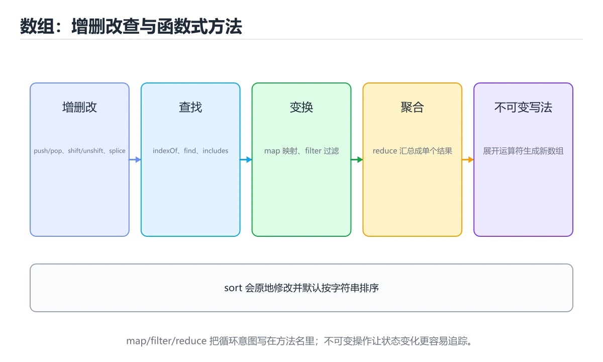
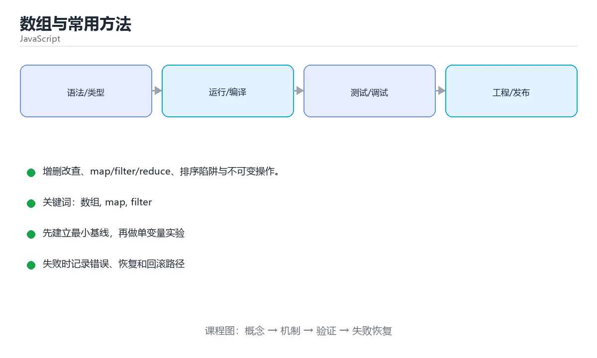

# 数组与常用方法





> 内容更新时间：2026-10-03 · 学习阶段：进阶 · 预计用时：14 分钟

## 学习目标

- 能用自己的话解释本课主题解决了什么问题，而不是只背术语。
- 能说清 「数组」、「map」、「filter」、「reduce」 之间的关系，并分别举出一个例子。
- 能把本课知识放回「JavaScript」的知识体系，说明它和相邻主题的边界。
- 能完成本课练习，并用验收标准检查自己的结果。

> 一句话摘要：增删改查、map/filter/reduce、排序陷阱与不可变操作。

## 前置知识

- 先完成上一课《对象、原型与类》；如果已经掌握，可以直接用本课练习自测。
- 本课阶段：进阶。建议先掌握同一分类的基础课程，并能独立运行正文中的最小示例。
- 开始前先复习：数组、map、filter。
- 如果某一步看不懂，先记录具体卡点，完成练习后再回头读一遍。

## 增删改查

```javascript
const nums = [3, 1, 2];

nums.push(4);            // 末尾添加
nums.pop();              // 删除末尾
nums.unshift(0);         // 头部添加
nums.shift();            // 删除头部
nums.splice(1, 1, 9);    // 从下标 1 删除 1 个并插入 9
nums.slice(1, 3);        // 截取子数组，不改变原数组
nums.includes(2);        // 是否包含
nums.indexOf(2);         // 下标，找不到返回 -1
```

`slice` 不改原数组，`splice` 会改；这是最容易混淆的一对方法。

## 函数式方法

```javascript
const users = [
  { name: 'tom', age: 18 },
  { name: 'alice', age: 25 },
  { name: 'bob', age: 30 },
];

users.map(u => u.name);                     // ['tom','alice','bob']
users.filter(u => u.age >= 20);             // 筛选
users.find(u => u.name === 'alice');        // 第一个匹配项
users.some(u => u.age > 60);                // 是否存在
users.every(u => u.age > 0);                // 是否全部满足
users.reduce((sum, u) => sum + u.age, 0);   // 归约求和 = 73
users.sort((a, b) => a.age - b.age);        // 排序（会改原数组）
users.flatMap(u => u.name.split(''));       // 映射后展平
```

注意：`sort` 默认按字符串比较，数字排序必须传比较函数，且它会修改原数组，需要副本可用 `[...users].sort(...)`。

## 不可变操作

```javascript
const added = [...nums, 5];                 // 追加
const removed = nums.filter(n => n !== 1);  // 删除
const updated = nums.map(n => (n === 2 ? 20 : n));
const merged = [...a, ...b];
const [[first], ...others] = [[1, 2], [3], [4]];
```

React / Redux 等状态管理要求「不直接改原数组」，用展开与 map/filter 生成新数组。

## 迭代与生成器

```javascript
for (const n of nums) { }

function* range(start, end) {      // 生成器：按需产出
  for (let i = start; i < end; i++) yield i;
}
console.log([...range(1, 4)]);     // [1, 2, 3]
```

## 本课小结
数组是 JS 最常用的结构：**查询用 find/filter、转换用 map、聚合用 reduce、排序记得传比较函数**。

## 数组方法速查（是否修改原数组）

| 方法 | 作用 | 返回值 | 改动原数组 |
| --- | --- | --- | --- |
| `push` / `pop` | 尾部增删 | 新长度 / 被删元素 | 是 |
| `unshift` / `shift` | 头部增删 | 新长度 / 被删元素 | 是 |
| `splice` | 任意位置增删 | 被删元素数组 | 是 |
| `sort` / `reverse` | 排序 / 反转 | 原数组引用 | 是 |
| `fill` / `copyWithin` | 填充 / 内部复制 | 原数组引用 | 是 |
| `slice` | 截取子数组 | 新数组 | 否 |
| `concat` | 拼接 | 新数组 | 否 |
| `map` / `filter` | 映射 / 过滤 | 新数组 | 否 |
| `flat` / `flatMap` | 展平 | 新数组 | 否 |
| `toSorted` / `toReversed` | 排序 / 反转的不可变版本 | 新数组 | 否 |
| `find` / `findIndex` | 首个匹配元素 / 下标 | 元素或 `undefined` / -1 | 否 |
| `some` / `every` | 是否存在 / 是否全部满足 | 布尔值 | 否 |
| `reduce` | 归约成单个值 | 任意类型 | 否 |
| `join` | 转成字符串 | 字符串 | 否 |
| `includes` / `indexOf` | 是否存在 / 下标 | 布尔值 / 下标 | 否 |

```js
const nums = [3, 1, 2];

// 不可变写法：得到新数组，原数组不变
const sorted = nums.toSorted((a, b) => a - b);   // [1, 2, 3]

// 常见组合：过滤后映射，再求和
const total = items
  .filter((item) => item.active)
  .map((item) => item.price)
  .reduce((sum, price) => sum + price, 0);

// 按字段分组：一行得到 { 类目: [商品...] }
const grouped = items.reduce((acc, item) => {
  (acc[item.category] ??= []).push(item);
  return acc;
}, {});
```

## 常见错误对照表

| 容易写错的做法 | 实际现象 | 原因与正确做法 |
| --- | --- | --- |
| `[10, 9, 1].sort()` | 得到 `[1, 10, 9]` | 默认按字符串比较，数字要传 `(a, b) => a - b` |
| `sort()` 后原数组被改 | 依赖原顺序的代码出 bug | 用 `toSorted()` 或先 `[...arr].sort()` |
| `forEach` 里 `return` 想跳出 | 循环继续执行 | `forEach` 不能中断，改用 `for...of` 或 `some` |
| `map` 里没写 `return` | 得到一堆 `undefined` | 显式返回，或改用 `forEach` 做副作用 |
| `find` 结果直接用 | 可能是 `undefined` | 先判空或用可选链 |
| `includes(NaN)` | `false` | 判 `NaN` 用 `Number.isNaN` 或 `some` |
| 用 `==` 判断元素存在 | 类型被隐式转换 | 用 `includes`（内部按 `SameValueZero` 比较） |
| `reduce` 不传初始值 | 空数组报错，类型可能与预期不同 | 传初始值，如 `reduce(fn, 0)` |
| `delete arr[i]` | 留下 `empty` 空洞 | 用 `splice` 或 `filter` |
| 直接改 `array.length` 截断 | 元素被永久丢弃 | 需要副本时用 `slice` |
| `push(...bigArray)` 传超大数组 | `RangeError: Maximum call stack size exceeded` | 大数据量用循环或 `concat` |
| 用 `for...in` 遍历数组 | 拿到字符串下标，还可能带上自定义属性 | 用 `for...of` 或 `forEach` |

## 自测清单

- [ ] 能说出哪些方法会修改原数组，哪些返回新数组。
- [ ] 数字排序一定传比较函数。
- [ ] 会用 `filter` + `map` + `reduce` 组合处理数据。
- [ ] 知道 `find` 可能返回 `undefined`，会做判空。
- [ ] 需要不可变操作时使用 `toSorted`、`toReversed` 或展开复制。

## 零基础详解：数组方法与「不改原数组」的写法

### 一句话说清它是什么

数组是有序列表。JavaScript 的数组方法很多，但要先分清两类：
**会修改原数组的**（`push`、`sort`、`splice`）和**返回新数组的**（`map`、`filter`、`slice`）。

### 用生活比喻理解

| 方法 | 比喻 | 是否改原数组 |
| --- | --- | --- |
| `push` / `pop` | 队伍尾部进出 | 改 |
| `shift` / `unshift` | 队伍头部进出 | 改 |
| `map` | 每个都加工一遍，交新名单 | 不改 |
| `filter` | 按条件筛选，交新名单 | 不改 |
| `reduce` | 把所有项汇总成一个结果 | 不改 |
| `slice` | 复印一段 | 不改 |
| `splice` | 就地剪接 | 改 |

### 查看与修改

```javascript
const arr = ["a", "b", "c"];

arr[0];                    // "a"
arr.at(-1);                // "c"，负数取倒数第几项
arr.length;                // 3

arr.push("d");             // 尾部加，返回新长度
arr.pop();                 // 尾部删，返回被删的值
arr.unshift("z");          // 头部加
arr.shift();               // 头部删

arr.includes("b");         // true
arr.indexOf("b");          // 1，找不到返回 -1
```

### 五个高频「函数式」方法

```javascript
const nums = [1, 2, 3, 4, 5];

const doubled = nums.map((n) => n * 2);          // [2,4,6,8,10]
const evens = nums.filter((n) => n % 2 === 0);   // [2,4]
const total = nums.reduce((sum, n) => sum + n, 0);   // 15
const found = nums.find((n) => n > 3);           // 4
const allPositive = nums.every((n) => n > 0);    // true
```

| 方法 | 一句话 | 返回 |
| --- | --- | --- |
| `map` | 每个元素变一个 | 等长新数组 |
| `filter` | 挑出符合条件的 | 可能更短的新数组 |
| `reduce` | 压缩成一个值 | 任意类型 |
| `find` / `findIndex` | 找第一个满足的 | 元素或下标 |
| `some` / `every` | 是否存在 / 是否全部 | 布尔值 |
| `flat` / `flatMap` | 拍平嵌套 | 新数组 |

### 排序：默认行为是个坑

```javascript
const nums = [10, 9, 100];
nums.sort();                        // [10, 100, 9]，按字符串比较！
nums.sort((a, b) => a - b);         // [9, 10, 100]，数字升序

const users = [{ age: 30 }, { age: 20 }];
users.sort((a, b) => a.age - b.age);      // 按字段排序
```

数字数组排序**必须传比较函数**，否则默认按字符串比较。

### 不改原数组的现代写法

```javascript
const source = [3, 1, 2];

const sorted = source.toSorted((a, b) => a - b);   // 排序但不改原数组
const reversed = source.toReversed();              // 反转但不改原数组
const spliced = source.toSpliced(0, 1);            // 删除但不改原数组
const withNew = source.with(0, 99);                // 替换指定下标

console.log(source);        // [3, 1, 2] 原样不变
```

### 去重与分组

```javascript
const list = [1, 2, 2, 3, 3, 3];
const unique = [...new Set(list)];                 // [1,2,3]

const people = [
  { name: "小明", team: "A" },
  { name: "小红", team: "B" },
  { name: "小刚", team: "A" },
];

const byTeam = Object.groupBy(people, (p) => p.team);
console.log(byTeam.A.length);                       // 2
```

### 新手最容易踩的八个坑

| 坑 | 现象 | 正确做法 |
| --- | --- | --- |
| 数字排序不传比较函数 | 10 排在 9 前面 | 传 `(a, b) => a - b` |
| `forEach` 里 `break` | 报错或无效 | 改 `for...of` |
| `map` 里忘 `return` | 一堆 undefined | 用表达式体箭头函数 |
| 用 `delete arr[i]` | 留下空洞，长度不变 | 用 `splice` 或 `filter` |
| 把 `slice` 当 `splice` | 一个不改一个改，结果混乱 | 记住 slice 是复印 |
| 直接比较数组 | `[1] === [1]` 是 false | 逐项比较或转字符串 |
| 浅拷贝嵌套数组 | 内层互相影响 | 用 `structuredClone` |
| 用下标删中间元素 | 顺序错乱 | 用 `filter` 重建 |

### 手把手练习：成绩统计

```javascript
const students = [
  { name: "小明", score: 88 },
  { name: "小红", score: 95 },
  { name: "小刚", score: 59 },
  { name: "小美", score: 72 },
];

const passed = students.filter((s) => s.score >= 60);
const average =
  students.reduce((sum, s) => sum + s.score, 0) / students.length;
const ranked = students.toSorted((a, b) => b.score - a.score);
const names = ranked.map((s) => `${s.name}(${s.score})`).join(", ");

console.log(`及格 ${passed.length} 人，平均 ${average.toFixed(1)} 分`);
console.log("排名：", names);

// 按分数段分组
const groups = Object.groupBy(
  students,
  (s) => (s.score >= 90 ? "优秀" : s.score >= 60 ? "及格" : "不及格"),
);
console.log(Object.keys(groups));
```

### 学完自测

- [ ] 能说出哪些方法会改原数组。
- [ ] 知道数字排序为什么必须传比较函数。
- [ ] 能用 `map` + `filter` + `reduce` 完成一段统计。
- [ ] 能说出 `slice` 与 `splice` 的区别。
- [ ] 知道 `toSorted`、`with` 这些新方法的意义。

## 动手练习

> 本课练习重点：围绕「数组、map、filter」完成复述、实验和交付，每个结果都要能被别人检查。

先在 Node 或浏览器复现行为，再改写异步与错误路径，最后补测试。

### 练习 1：建立心智模型（10 分钟）

合上教程，用 3～5 句话回答：

1. 本课主题解决了什么问题？
2. 如果没有它，会出现什么具体后果？
3. 它和「map」是什么关系？

**验收标准**：至少出现一个本课关键词，并写出一个反例、边界条件或失效场景。

### 练习 2：做一次可控实验（20 分钟）

从正文中选一个最小示例，完成以下操作：

1. 先预测修改一个参数、输入或步骤后的结果。
2. 再实际执行或逐步推演，记录真实结果。
3. 如果结果与预测不同，写出差异原因。

**验收标准**：留下「原例 → 改动 → 预测 → 结果 → 原因」五步记录。

### 练习 3：交付一个小结果（30 分钟）

在浏览器控制台或 Node.js 中写一个最小示例，列出至少 3 组输入输出。

任务要求：

- 结果必须能被别人检查，不能只写“我已经理解了”。
- 至少覆盖「数组」和「map」两个关键词。
- 写出 1 个仍然不确定的问题，以及下一步如何验证。

> 提示：时间有限时优先做练习 1 和练习 2；练习 3 可以拆成两次完成。

## 可运行练习

### 任务 1：先跑通，再解释

```javascript
const source = [3, 1, 2];

const sorted = source.toSorted((a, b) => a - b);   // 排序但不改原数组
const reversed = source.toReversed();              // 反转但不改原数组
const spliced = source.toSpliced(0, 1);            // 删除但不改原数组
const withNew = source.with(0, 99);                // 替换指定下标

console.log(source);        // [3, 1, 2] 原样不变
```

### 任务 2：只改一个条件

### 任务 3：迁移到自己的数据

用同一套思路处理一组你自己的数据或场景，保持输出格式与任务 1 一致。

## 故障现场

### 现场 1：本课的 数组 常规用例通过，但边界用例失败

**症状**：在本课的练习或生产场景里出现“本课的 数组 常规用例通过，但边界用例失败”。

**复现**：准备一组最小输入，只保留触发“本课的 数组 常规用例通过，但边界用例失败”的必要条件，连续运行两次确认结果稳定。

**定位**：围绕“数组 的前置条件与取值边界没有写进代码，默认值掩盖了空值和极值”检查调用链、输入数据和环境配置，先验证假设再改代码。

**预防**：把“本课的 数组 常规用例通过，但边界用例失败”写成一条自动化用例，并在本课的验收清单里保留对应检查项。

### 现场 2：本课的 map 结果在两次运行之间不一致

**症状**：在本课的练习或生产场景里出现“本课的 map 结果在两次运行之间不一致”。

**复现**：准备一组最小输入，只保留触发“本课的 map 结果在两次运行之间不一致”的必要条件，连续运行两次确认结果稳定。

**定位**：围绕“map 依赖了当前版本、执行顺序或共享状态，单次运行无法暴露差异”检查调用链、输入数据和环境配置，先验证假设再改代码。

**预防**：把“本课的 map 结果在两次运行之间不一致”写成一条自动化用例，并在本课的验收清单里保留对应检查项。

### 现场 3：本课的验证只在开发机通过

**症状**：在本课的练习或生产场景里出现“本课的验证只在开发机通过”。

**定位**：围绕“环境版本、配置和输入规模与目标环境不同，数组 缺少可重复的验证记录”检查调用链、输入数据和环境配置，先验证假设再改代码。

## 版本与时效

- 运行时要同时考虑浏览器基线、Node LTS 与打包工具的降级策略
- 升级前用特性检测和构建目标矩阵验证，不要只在本机浏览器测试

### 升级检查清单

- 先固定当前版本，跑通全部示例与测验，再升级工具链。
- 只改一个版本变量，记录编译、测试、性能与产物体积的变化。
- 重点回归默认值、弃用警告、序列化格式、并发语义和错误信息。
- 升级完成后更新本课的“最后复核 / 下次复核”日期与版本说明。

## 本课复习清单

离开本课前，逐项确认：

- [ ] 不看解析，能说出「下面哪个方法不会修改原数组？」的判断依据。
- [ ] 不看解析，能说出「对数字数组正确排序的写法是？」的判断依据。
- [ ] 不看解析，能说出「reduce 的典型用途是？」的判断依据。
- [ ] 不看解析，能说出「find 与 filter 的区别是？」的判断依据。
- [ ] 不看解析，能说出「arr.flatMap(fn) 相当于？」的判断依据。
- [ ] 至少运行一次本课示例，记录输入、输出和一个边界情况。
- [ ] 把本课最容易混淆的两个概念写成一句话对照。

| 复盘项 | 记录 |
| --- | --- |
| 已经能独立解释的考点 |  |
| 仍然说不清的概念 |  |
| 下一步验证动作 |  |

## 术语速查

| 术语 | 本课语境 |
| --- | --- |
| `slice` | `slice` 不改原数组，`splice` 会改；这是最容易混淆的一对方法。 |
| `splice` | `slice` 不改原数组，`splice` 会改；这是最容易混淆的一对方法。 |
| `sort` | 注意：`sort` 默认按字符串比较，数字排序必须传比较函数，且它会修改原数组，需要副本可用 `[...users].sort(...)`。 |
| `[...users].sort(...)` | 注意：`sort` 默认按字符串比较，数字排序必须传比较函数，且它会修改原数组，需要副本可用 `[...users].sort(...)`。 |
| `push` | \| `push` / `pop` \| 尾部增删 \| 新长度 / 被删元素 \| 是 \| |
| `pop` | \| `push` / `pop` \| 尾部增删 \| 新长度 / 被删元素 \| 是 \| |
| `unshift` | \| `unshift` / `shift` \| 头部增删 \| 新长度 / 被删元素 \| 是 \| |
| `shift` | \| `unshift` / `shift` \| 头部增删 \| 新长度 / 被删元素 \| 是 \| |
| `reverse` | \| `sort` / `reverse` \| 排序 / 反转 \| 原数组引用 \| 是 \| |
| `fill` | \| `fill` / `copyWithin` \| 填充 / 内部复制 \| 原数组引用 \| 是 \| |
| `copyWithin` | \| `fill` / `copyWithin` \| 填充 / 内部复制 \| 原数组引用 \| 是 \| |
| `concat` | \| `concat` \| 拼接 \| 新数组 \| 否 \| |

## 考点精讲

### 考点 1：下面哪个方法不会修改原数组？

- **判断依据**：filter/map/slice 返回新数组。splice、sort、push 会修改原数组。作答时，先用数组建立输入与输出的基线，再把filter代入边界条件核对，结论才能复现。判断这类题时，要把「filter」放回题干限定的对象、输入和边界，「push」、「sort」 等说法虽然包含相关术语，但范围或前提与本题不一致。

### 考点 2：围绕“数组与常用方法”中的 数组、map、filter，下列哪两项是本课强调的实践判断？

- **判断依据**：正确答案包括「验证 map 时要固定版本并覆盖边界输入，结论才可复现」、「学习 数组 时要同时说明输入、输出和失败路径，不能只看正常流程」。本题应选验证 map 时要固定版本并覆盖边界输入。本课把本课主题拆成概念、示例与故障现场三部分，因此判断 数组 时必须同时交代输入、输出和失败路径，这使“学习 数组 时要同时说明输入、输出和失败路径，不能只看正常流程”成立。在本课主题里，判断 map 时要固定版本与边界输入，所以“验证 map 时要固定版本并覆盖边界输入，结论才可复现”才可复现。

### 考点 3：reduce 的典型用途是？

- **判断依据**：符合题干条件的是「把数组归约为单个值（求和、分组等）」。reduce 用累加器把数组折叠成一个结果，是求和、计数、分组的通用工具。正确的判断需要逐项核对定义、版本和适用条件（jsarrays 第 3 题）。正确的判断需要逐项核对定义、版本和适用条件（js_arrays 第 3 题）。

### 考点 4：find 与 filter 的区别是？

- **判断依据**：结论应落在「find 返回第一个匹配的元素（或 undefined）」。只要一个结果就用 find 提前短路，需要全部结果才用 filter。这道题要求区分概念与边界，「find 返回第一个匹配的元素（或 undefined）」只有在题干给出的前提下才成立，而「两者都修改原数组」、「find 会排序后再查找」缺少同一组条件。

### 考点 5：下面这段 JavaScript 代码复现了“数组与常用方法”中 数组、map、filter 相关的一个常见故障，哪一项最准确地解释了问题？

- **判断依据**：正确答案是「var 声明的 i 是函数级作用域，三个闭包最终都读到循环结束后的同一个值」。正确答案是var 声明的 i 是函数级作用域，三个闭包最终都读到循环结束后的同一个值（jsarrays 第 5 题）。var 在循环结束后仍然保留最后一个值，在这个复现里三个闭包引用的是同一个 数组。在这个复现里，把 map 对应的 var 换成 let，每次迭代都会创建新的绑定，闭包就能分别捕获正确的值。

### 考点 6：补全代码：「数组与常用方法」示例中，下面这行代码缺少哪个关键字或函数名？请填入 ____。

`const reversed = source.____();              // 反转但不改原数组`

- **判断依据**：空格应填写「toReversed」、「toreversed」。// 反转但不改原数组 这样的用法，说明该关键字在本课代码中承担实际功能。解题的关键不是记住孤立术语，而是确认「toReversed 或 toreversed」是否完整覆盖题干的输入、输出和失败路径，并排除这类相邻概念。

## English Overview

**Title:** Arrays & Methods

**Summary:** Array CRUD, map/filter/reduce, sorting and immutability.

**Category:** JavaScript
**Level:** 进阶
**Key terms:** 数组, map, filter, reduce, sort, 展开运算符

## 内容元数据

- 内容版本：v2.0
- 最后更新：2026-10-03
- 学习阶段：进阶
- 适用环境：Node.js 22+ / 现代浏览器
- 内容来源：内置结构化课程与工程实践整理
- 相关主题：数组、map、filter、reduce、sort、展开运算符
- 质量版本：P0 测验标准 + P1 覆盖扩展 + P2 体验补全


## 参考资料与复核

- 最后复核：2026-10-04
- 下次复核：2027-04-04
- 复核范围：版本兼容、API 行为、安全建议与工程实践
- 来源性质：官方文档、标准或权威教材；正文为离线教学重组

| 参考资料 | 本课用途 |
| --- | --- |
| [MDN JavaScript 指南](https://developer.mozilla.org/docs/Web/JavaScript/Guide) | 语言基础与浏览器 API |
| [MDN 模块](https://developer.mozilla.org/docs/Web/JavaScript/Guide/Modules) | ES Module 与依赖组织 |
| [npm 文档](https://docs.npmjs.com/) | 包管理与发布 |

> 「数组与常用方法」的链接用于离线阅读后的延伸核对；App 不会自动联网。
