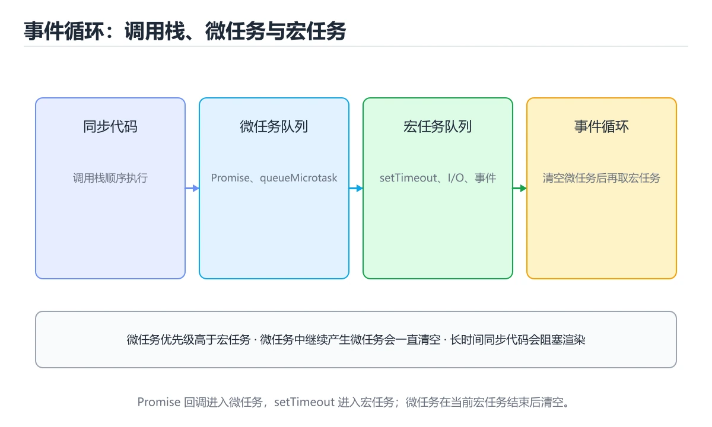
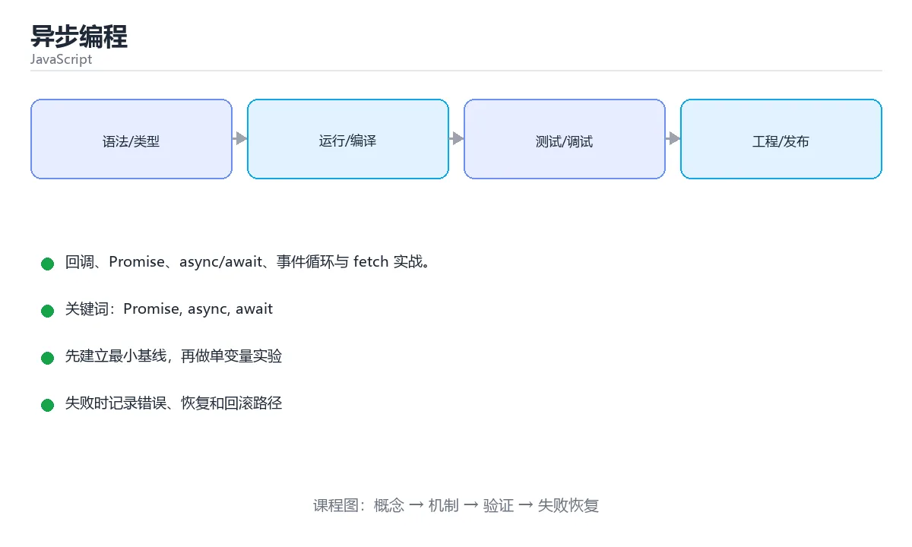

# 异步编程

> 内容更新时间：2026-10-06 · 学习阶段：进阶 · 预计用时：60 分钟





## 本节知识框架

**课程定位**：所属分类 `javascript`（JavaScript），课程主题 `异步编程`，学习阶段 进阶，建议用时 55 分钟。

本课主线：回调、Promise、async/await、事件循环与 fetch 实战。

**学完本课应当能够**
- 说清 `Promise` 与 `async` 的含义与区别，并各举一个正例和一个反例。
- 用本课示例验证 `await` 的行为，记录输入、输出与失败条件。
- 遇到「忘写 `await`」这类问题时，能说出触发条件与修复顺序。

### 从概念到验证的学习链条

1. `Promise`：先掌握 表示异步操作最终结果的对象，可链式处理成功和失败，再用它解释 `async` 为什么会出现。
2. `async`：先掌握 标记异步函数或异步块，使内部可以使用 await 而不阻塞调用线程，再用它解释 `await` 为什么会出现。
3. `await`：先掌握 ② 忘记 await 使错误变成 unhandledRejection，再用它解释 `事件循环` 为什么会出现。
4. `事件循环`：先掌握 运行时从任务队列取出回调并执行的调度循环，负责协调同步栈与异步任务，再用它解释 `fetch` 为什么会出现。
5. `fetch`：先掌握 浏览器和现代运行时提供的基于 Promise 的 HTTP 请求接口，再用它解释 本课示例的观察结果 为什么会出现。

**先修与衔接**：本课是「JavaScript」分类的第 12 课。先修内容：《数组与常用方法》。《数组与常用方法》里的 `slice`、`sort` 是本课的前提。相关或后续课程：《DOM 与事件》、《浏览器渲染与事件循环深入》、《异步编程与异常处理》、《图解事件循环：同步、微任务与宏任务》。

### 完成判据

- **定义关**：不看正文也能说明 `Promise` 是 表示异步操作最终结果的对象，可链式处理成功和失败，并指出一个反例。
- **机制关**：能按“输入 → 转换 → 输出 → 验证”复述 `异步编程`，而不是只背结论。
- **示例关**：能运行或推演 `异步编程` 的 `javascript` 示例，并说明一个真实出现的标识符或字面量。
- **证据关**：能指出 `异步编程` 示例里的 调用了 `fetch()`，并说明它支持或反驳了本课的哪一条结论。
- **排错关**：能复现 忘写 `await`，记录现象并按 在 `async` 函数里 await 修复。
- **迁移关**：能把 `Promise`、`async`、`await`、`事件循环` 放进一个与 `异步编程` 不同的项目场景，并保持输入与验证条件可追踪。
- **复盘关**：学完 `异步编程` 后，用一句话写下仍然不确定的结论，并列出下一次验证需要的输入、环境和成功判据。

### 复习清单

- [ ] 能不看正文复述本课核心术语，并指出一个边界或反例。
- [ ] 能运行或推演本课示例，记录输入、输出与失败现象。
- [ ] 能完成一次自测，并把错题对照错误表定位原因。

## 核心概念定义

| 术语 | 操作性定义 | 常见边界与风险 |
| --- | --- | --- |
| Promise | 表示异步操作最终结果的对象，可链式处理成功和失败。 | 易错：拿到 Promise 对象而不是数据；正确做法是在 `async` 函数里 await。 |
| async | 标记异步函数或异步块，使内部可以使用 await 而不阻塞调用线程。 | 易错：拿到 Promise 对象而不是数据；正确做法是在 `async` 函数里 await。 |
| await | ② 忘记 await 使错误变成 unhandledRejection。 | 易错：拿到 Promise 对象而不是数据；正确做法是在 `async` 函数里 await。 |
| 事件循环 | 运行时从任务队列取出回调并执行的调度循环，负责协调同步栈与异步任务。 | 越界、悬垂引用与释放顺序会破坏结论，必须在边界输入下复验。 |
| fetch | 浏览器和现代运行时提供的基于 Promise 的 HTTP 请求接口。 | 易错：请求失败无法被捕获；正确做法是必须 `await fetch(url)`，否则拿到的是 Promise。 |

## 原理与运行机制

### 机制总览

**教材衔接：Promise 组合速查**

| 方法 | 何时用 | 失败行为 | 返回值 |
| --- | --- | --- | --- |
| `Promise.all(list)` | 全部成功才算成功 | 任一失败立即 reject | 结果数组，顺序与输入一致 |
| `Promise.allSettled(list)` | 允许部分失败 | 永不 reject | `{status, value/reason}` 数组 |
| `Promise.race(list)` | 取最快的一个（含失败） | 最快的结果决定成败 | 单个结果 |
| `Promise.any(list)` | 取最快的成功结果 | 全部失败才 reject（`AggregateError`） | 单个成功值 |
| `await Promise.resolve(x)` | 把同步值包成 Promise | 不会失败 | `x` |

**教材衔接：版本与时效**

- setTimeout 依赖的新 API 必须有降级路径，否则老环境直接报错。
- 升级「异步编程」涉及的依赖前，先用 setTimeout 复现当前行为，再逐项核对版本说明与破坏性变更。

### 升级检查清单

- 先固定当前版本，跑通全部示例与测验，再升级工具链。
- 升级时只动一个依赖版本，用 setTimeout 记录构建与运行结果。
- 先回归 Promise 与 async 的默认行为和错误信息，再扩大测试范围。
- 升级完成后更新本课「最后复核 / 下次复核」日期，并记录 Promise 的版本变化。

### 机制拆解：每一步的输入、动作与输出

#### 1. `Promise`
- 输入：`Promise`；本步把 表示异步操作最终结果的对象，可链式处理成功和失败 当作判断规则。
- 动作：围绕 `Promise` 保留中间状态，并记录它与 `async` 的对应关系。
- 输出：`async`，它可以被下一段代码、测试或记录继续使用。
- `Promise` 的失败条件：当忘写 `await`时，会出现拿到 Promise 对象而不是数据。

#### 2. `async`
- 输入：`Promise`；本步把 标记异步函数或异步块，使内部可以使用 await 而不阻塞调用线程 当作判断规则。
- 动作：围绕 `async` 保留中间状态，并记录它与 `await` 的对应关系。
- 输出：`await`，它可以被下一段代码、测试或记录继续使用。
- `async` 的失败条件：当忘写 `await`时，会出现拿到 Promise 对象而不是数据。

#### 3. `await`
- 输入：`async`；本步把 ② 忘记 await 使错误变成 unhandledRejection 当作判断规则。
- 动作：围绕 `await` 保留中间状态，并记录它与 `事件循环` 的对应关系。
- 输出：`事件循环`，它可以被下一段代码、测试或记录继续使用。
- `await` 的失败条件：当忘写 `await`时，会出现拿到 Promise 对象而不是数据。

#### 4. `事件循环`
- 输入：`await`；本步把 运行时从任务队列取出回调并执行的调度循环，负责协调同步栈与异步任务 当作判断规则。
- 动作：围绕 `事件循环` 保留中间状态，并记录它与 `fetch` 的对应关系。
- 输出：`fetch`，它可以被下一段代码、测试或记录继续使用。
- `事件循环` 的失败条件：越界、悬垂引用与释放顺序会破坏结论，必须在边界输入下复验。

#### 5. `fetch`
- 输入：`事件循环`；本步把 浏览器和现代运行时提供的基于 Promise 的 HTTP 请求接口 当作判断规则。
- 动作：围绕 `fetch` 保留中间状态，并记录它与 `fetch` 的对应关系。
- 输出：`fetch`，它可以被下一段代码、测试或记录继续使用。
- `fetch` 的失败条件：当`try { fetch(url) } catch {}` 不写 `await`时，会出现请求失败无法被捕获。

### 示例中的可观察事实

1. 调用了 `fetch()`；它对应的课程主题是 `异步编程`。
2. 调用了 `stringify()`；它对应的课程主题是 `异步编程`。
3. 调用了 `json()`；它对应的课程主题是 `异步编程`。
4. 出现字面量 `/api/items`；它对应的课程主题是 `异步编程`。
5. 出现字面量 `POST`；它对应的课程主题是 `异步编程`。
6. 出现字面量 `Content-Type`；它对应的课程主题是 `异步编程`。
7. 出现字面量 `application/json`；它对应的课程主题是 `异步编程`。
8. 出现字面量 `book`；它对应的课程主题是 `异步编程`。

### 复现实验记录

- 环境：`异步编程` 使用 `javascript` 示例，固定 `Promise`、`async`、`await`、`事件循环` 作为第一组条件。
- 首轮输入：先确认 调用了 `fetch()`，预测 `Promise` 会怎样变化。
- 基线观察：记录命令、输入、输出和错误原文，不用截图代替可复制的文本。
- 单变量修改：只改变 `Promise`，观察 `fetch` 是否仍满足定义。
- 失败注入：复现 忘写 `await`，确认现象是 拿到 Promise 对象而不是数据。
- 记录结论：把“修改前、修改后、预期变化、实际变化”写成四列表，这样复盘 `异步编程` 时才能区分概念错误与实现错误。

## 典型应用场景

**教材衔接：fetch 实战**

```javascript
const response = await fetch('/api/items', {
  method: 'POST',
  headers: { 'Content-Type': 'application/json' },
  body: JSON.stringify({ name: 'book' }),
});
const data = await response.json();
```

`fetch` 只在网络错误时 reject，**4xx/5xx 也会 resolve**，所以要检查 `response.ok`；超时可用 `AbortController` 实现。

- **忘写 `await`**：典型现象是拿到 Promise 对象而不是数据；正确做法是在 `async` 函数里 await。
- **循环里逐个 `await`**：典型现象是总耗时是各任务之和；正确做法是用 `Promise.all` 并发。
- **`forEach` 里用 `await`**：典型现象是不会等待，循环直接结束；正确做法是改 `for...of`。
- **漏了 `catch`**：典型现象是出现未处理的 Promise 拒绝；正确做法是加 `try/catch` 或 `.catch`。

### 最小验证场景

- 准备：保留 `javascript` 示例的原始输入，先记录 `异步编程` 的基线输出和完整运行命令。
- 观察：先核对 调用了 `fetch()`，再改变一个与 `Promise` 相关的条件。
- 判定：新结果与 `异步编程` 的基线不同不等于错误；只有当差异破坏了 `Promise` 的定义或错误表中的约束，才判定为失败。

### 选择与边界

- 使用 `Promise` 时，先满足它的定义：表示异步操作最终结果的对象，可链式处理成功和失败；易错：拿到 Promise 对象而不是数据；正确做法是在 `async` 函数里 await。
- 使用 `async` 时，先满足它的定义：标记异步函数或异步块，使内部可以使用 await 而不阻塞调用线程；易错：拿到 Promise 对象而不是数据；正确做法是在 `async` 函数里 await。
- 使用 `await` 时，先满足它的定义：② 忘记 await 使错误变成 unhandledRejection；易错：拿到 Promise 对象而不是数据；正确做法是在 `async` 函数里 await。
- 使用 `事件循环` 时，先满足它的定义：运行时从任务队列取出回调并执行的调度循环，负责协调同步栈与异步任务；越界、悬垂引用与释放顺序会破坏结论，必须在边界输入下复验。
- 使用 `fetch` 时，先满足它的定义：浏览器和现代运行时提供的基于 Promise 的 HTTP 请求接口；易错：请求失败无法被捕获；正确做法是必须 `await fetch(url)`，否则拿到的是 Promise。

## 代码/协议/SQL 示例

### 最小可验证示例

```javascript
// 回调：多层嵌套会形成「回调地狱」
setTimeout(() => {
  console.log('1 秒后执行');
}, 1000);

// Promise：三种状态 pending → fulfilled / rejected
const task = new Promise((resolve, reject) => {
  const ok = true;
  ok ? resolve('成功') : reject(new Error('失败'));
});

task
  .then(value => console.log(value))
  .catch(error => console.error(error))
  .finally(() => console.log('结束'));
```

**教材衔接：从回调到 Promise**

并行与串行：

```javascript
Promise.all([fetchA(), fetchB()]);        // 全部成功才成功，最快但要等最慢的
Promise.allSettled([fetchA(), fetchB()]); // 不因单个失败而中断
Promise.race([fetchA(), timeout()]);      // 竞速，取最先完成的
```

**教材衔接：async / await**

```javascript
async function loadUser(id) {
  try {
    const response = await fetch(`/api/users/${id}`);
    if (!response.ok) throw new Error(`HTTP ${response.status}`);
    const user = await response.json();
    return user;
  } catch (error) {
    console.error('加载失败', error);
    throw error;                 // 交给调用方处理
  }
}

const [a, b] = await Promise.all([loadUser(1), loadUser(2)]);   // 并发请求
```

`async` 函数总是返回 Promise；`await` 只能在 async 函数或模块顶层使用。

**教材衔接：事件循环**

```text
调用栈 → 微任务队列（Promise.then、queueMicrotask）→ 宏任务队列（setTimeout、事件、IO）
```

每轮事件循环会**清空所有微任务**再执行下一个宏任务，所以下面输出顺序是 1 → 3 → 2：

```javascript
console.log(1);
setTimeout(() => console.log(2), 0);
Promise.resolve().then(() => console.log(3));
```

**教材衔接：async / await 速查**

| 写法 | 含义 |
| --- | --- |
| `async function f() {}` | 返回值自动包成 Promise |
| `await p` | 等待 Promise 落定，失败会抛出异常 |
| `try { await p } catch (e) {}` | 捕获异步错误的标准写法 |
| `for await (const x of stream)` | 逐个消费异步可迭代对象 |
| `await Promise.all([...])` | 并发执行多个任务，比逐个 `await` 快得多 |
| `arr.map(async (x) => ...)` | 得到的是 Promise 数组，记得 `await Promise.all(...)` |
| `return await p` 与 `return p` | 在 `try` 里需要捕获错误时用前者，否则可直接 `return p` |

```js
// 并发请求：3 个请求同时发出，总耗时接近最慢的那个
const [user, orders, coupons] = await Promise.all([
  fetchUser(id),
  fetchOrders(id),
  fetchCoupons(id),
]);

// 允许部分失败：拿到每个任务的成败明细
const results = await Promise.allSettled([fetchA(), fetchB()]);
const okCount = results.filter((r) => r.status === "fulfilled").length;
```

**教材衔接：零基础详解：事件循环、Promise 与 async/await**

### 一句话说清它是什么

JavaScript 只有**一个主线程**，所以耗时操作不能傻等。
异步的本质是：**先登记一个回调，等结果好了再回来执行**。事件循环负责调度这些回调。

### 用生活比喻理解

| 概念 | 比喻 | 说明 |
| --- | --- | --- |
| 主线程 | 只有一个窗口的柜台 | 一次只能办一件事 |
| 异步任务 | 取号后去旁边等 | 不占着窗口 |
| 事件循环 | 叫号系统 | 窗口空了就叫下一个 |
| 微任务 | VIP 队列 | Promise 回调，优先于宏任务 |
| 宏任务 | 普通队列 | setTimeout、事件回调 |

**关键结论**：`setTimeout(fn, 0)` 不会立刻执行，它排在所有微任务之后。

### 一段代码看清执行顺序

```javascript
console.log("1 同步");
setTimeout(() => console.log("4 宏任务"), 0);
Promise.resolve().then(() => console.log("3 微任务"));
console.log("2 同步");
// 输出顺序：1 同步 → 2 同步 → 3 微任务 → 4 宏任务
```

规则：**同步代码 → 微任务队列清空 → 取一个宏任务 → 再清空微任务 → 循环**。

### 从回调地狱到 async/await

```javascript
// 1. 回调：嵌套深、错误处理分散
getUser(id, (err, user) => {
  if (err) return handle(err);
  getOrders(user.id, (err2, orders) => {
    if (err2) return handle(err2);
    console.log(orders);
  });
});

// 2. Promise 链：能扁平化，但仍要写 then
getUser(id)
  .then((user) => getOrders(user.id))
  .then((orders) => console.log(orders))
  .catch(handle);

// 3. async/await：像同步代码一样，推荐
async function show() {
  try {
    const user = await getUser(id);
    const orders = await getOrders(user.id);
    console.log(orders);
  } catch (error) {
    handle(error);
  }
}
```

### Promise 的三种状态与四个方法

| 状态 | 含义 | 能否再变 |
| --- | --- | --- |
| pending | 进行中 | —— |
| fulfilled | 成功 | 不能再变 |
| rejected | 失败 | 不能再变 |

| 方法 | 作用 | 什么时候用 |
| --- | --- | --- |
| `Promise.all` | 全部成功才成功，任一失败即失败 | 结果都要，且缺一不可 |
| `Promise.allSettled` | 等全部结束，不管成功失败 | 批量任务，想拿到每一份结果 |
| `Promise.race` | 第一个结束的说了算 | 超时控制 |
| `Promise.any` | 第一个成功的说了算 | 多个镜像源，任一个可用即可 |

```javascript
// 并发请求：别用循环里 await，那样是串行
const users = await Promise.all(ids.map((id) => fetchUser(id)));

// 超时控制
const result = await Promise.race([
  fetchData(),
  new Promise((_, reject) => setTimeout(() => reject(new Error("超时")), 3000)),
]);
```

### 新手最容易踩的八个坑

| 坑 | 现象 | 正确做法 |
| --- | --- | --- |
| 忘写 `await` | 拿到 Promise 对象而不是数据 | 在 `async` 函数里 await |
| 循环里逐个 `await` | 总耗时是各任务之和 | 用 `Promise.all` 并发 |
| `forEach` 里用 `await` | 不会等待，循环直接结束 | 改 `for...of` |
| 漏了 `catch` | 出现未处理的 Promise 拒绝 | 加 `try/catch` 或 `.catch` |
| 在非 `async` 函数里用 `await` | 语法错误 | 函数加 `async`，或用 `.then` |
| 以为 `setTimeout(fn, 0)` 立即执行 | 顺序不对 | 记住微任务优先 |
| 混用回调与 Promise | 错误处理遗漏 | 统一成 Promise 风格 |
| 忘了 `return` Promise | 外层拿不到结果 | `return await` 或直接 `return` |

### 取消与超时

```javascript
const controller = new AbortController();
const timer = setTimeout(() => controller.abort(), 3000);

try {
  const res = await fetch(url, { signal: controller.signal });
  console.log(await res.json());
} catch (error) {
  console.log(error.name === "AbortError" ? "请求超时" : error.message);
} finally {
  clearTimeout(timer);
}
```

### 手把手练习：并发抓取并容错

```javascript
async function fetchJson(url) {
  const res = await fetch(url);
  if (!res.ok) throw new Error(`${url} 返回 ${res.status}`);
  return res.json();
}

async function loadAll(urls) {
  const results = await Promise.allSettled(urls.map(fetchJson));
  const ok = [];
  const failed = [];

  results.forEach((r, i) => {
    if (r.status === "fulfilled") ok.push(r.value);
    else failed.push({ url: urls[i], reason: r.reason.message });
  });

  return { ok, failed };
}

loadAll(["/api/a", "/api/b"]).then(({ ok, failed }) => {
  console.log(`成功 ${ok.length} 个，失败 ${failed.length} 个`);
});
```

### 学完自测

- [ ] 能背出「同步 → 微任务 → 宏任务」的执行顺序。
- [ ] 能说出 Promise 的三种状态。
- [ ] 知道 `Promise.all` 与 `allSettled` 的差别。
- [ ] 能解释为什么循环里 `await` 比 `Promise.all` 慢。
- [ ] 会用 `AbortController` 实现请求超时。

**运行方式**：运行 `异步编程` 的示例时，保存为 `.js` 后用 `node 文件名.js` 运行；涉及浏览器 API 的示例要放到页面里执行。

### 示例精读：先找证据，再改一个条件

1. 调用了 `fetch()`；它出现在 `异步编程` 的示例中，阅读时先确认它前后各发生了什么。
2. 调用了 `stringify()`；它出现在 `异步编程` 的示例中，阅读时先确认它前后各发生了什么。
3. 调用了 `json()`；它出现在 `异步编程` 的示例中，阅读时先确认它前后各发生了什么。
4. 出现字面量 `/api/items`；它出现在 `异步编程` 的示例中，阅读时先确认它前后各发生了什么。
5. 出现字面量 `POST`；它出现在 `异步编程` 的示例中，阅读时先确认它前后各发生了什么。
6. 出现字面量 `Content-Type`；它出现在 `异步编程` 的示例中，阅读时先确认它前后各发生了什么。
7. 出现字面量 `application/json`；它出现在 `异步编程` 的示例中，阅读时先确认它前后各发生了什么。
8. 出现字面量 `book`；它出现在 `异步编程` 的示例中，阅读时先确认它前后各发生了什么。
- 在 `异步编程` 中与 `Promise` 对照：示例必须能支持 表示异步操作最终结果的对象，可链式处理成功和失败，否则说明这一段还缺少实现或验证步骤。
- 在 `异步编程` 中与 `async` 对照：示例必须能支持 标记异步函数或异步块，使内部可以使用 await 而不阻塞调用线程，否则说明这一段还缺少实现或验证步骤。
- 在 `异步编程` 中与 `await` 对照：示例必须能支持 ② 忘记 await 使错误变成 unhandledRejection，否则说明这一段还缺少实现或验证步骤。
- 在 `异步编程` 中与 `事件循环` 对照：示例必须能支持 运行时从任务队列取出回调并执行的调度循环，负责协调同步栈与异步任务，否则说明这一段还缺少实现或验证步骤。

## 时间/空间复杂度或性能分析

**性能关注点（异步编程）**：事件循环与 DOM 操作是瓶颈来源：记录脚本执行时间、长任务与主线程阻塞时长。

**本课特有开销（异步编程 · Promise）**：并发度提高后要观察是否出现拐点：延迟上升而吞吐不增，说明瓶颈已转移。

**测量方法**：以 `异步编程` 的 `Promise` 场景为对象，固定输入跑一遍记录基线，再把规模或并发度提高一个数量级复测；两次结果的差值与波动范围才是结论依据。

### 需要控制的变量与记录项

- `异步编程` 的 `Promise`：固定它的版本、输入范围和资源上限，分别记录速度、内存与失败率的变化。
- `异步编程` 的 `async`：固定它的版本、输入范围和资源上限，分别记录速度、内存与失败率的变化。
- `异步编程` 的 `await`：固定它的版本、输入范围和资源上限，分别记录速度、内存与失败率的变化。
- `异步编程` 的 `事件循环`：固定它的版本、输入范围和资源上限，分别记录速度、内存与失败率的变化。
- `异步编程` 的 `fetch`：固定它的版本、输入范围和资源上限，分别记录速度、内存与失败率的变化。
- `异步编程` 中 `Promise` 的边界：易错：拿到 Promise 对象而不是数据；正确做法是在 `async` 函数里 await。达到边界时不要外推，必须重新测量。
- `异步编程` 中 `async` 的边界：易错：拿到 Promise 对象而不是数据；正确做法是在 `async` 函数里 await。达到边界时不要外推，必须重新测量。
- `异步编程` 中 `await` 的边界：易错：拿到 Promise 对象而不是数据；正确做法是在 `async` 函数里 await。达到边界时不要外推，必须重新测量。
- `异步编程` 中 `事件循环` 的边界：越界、悬垂引用与释放顺序会破坏结论，必须在边界输入下复验。达到边界时不要外推，必须重新测量。
- `异步编程` 中 `fetch` 的边界：易错：请求失败无法被捕获；正确做法是必须 `await fetch(url)`，否则拿到的是 Promise。达到边界时不要外推，必须重新测量。
- `异步编程` 的代码证据：先验证 调用了 `fetch()`，再记录该路径的输入规模与耗时；只看代码行数不能推出复杂度。

## 常见误区与易错点

| 容易写错的做法 | 实际现象 | 原因与正确做法 |
| --- | --- | --- |
| 忘写 `await` | 拿到 Promise 对象而不是数据 | 在 `async` 函数里 await |
| 循环里逐个 `await` | 总耗时是各任务之和 | 用 `Promise.all` 并发 |
| `forEach` 里用 `await` | 不会等待，循环直接结束 | 改 `for...of` |
| 漏了 `catch` | 出现未处理的 Promise 拒绝 | 加 `try/catch` 或 `.catch` |
| 在非 `async` 函数里用 `await` | 语法错误 | 函数加 `async`，或用 `.then` |
| 以为 `setTimeout(fn, 0)` 立即执行 | 顺序不对 | 记住微任务优先 |
| 混用回调与 Promise | 错误处理遗漏 | 统一成 Promise 风格 |
| 忘了 `return` Promise | 外层拿不到结果 | `return await` 或直接 `return` |
| `items.forEach(async (i) => { await save(i) })` | 外层不等待，函数直接结束 | `forEach` 忽略返回值；改成 `for...of` + `await` 或 `await Promise.all(items.map(...))` |
| `try { fetch(url) } catch {}` 不写 `await` | 请求失败无法被捕获 | 必须 `await fetch(url)`，否则拿到的是 Promise |
| `fetch` 返回 404 就走 `catch` | 不会进 `catch` | HTTP 错误不触发 reject，要检查 `res.ok` |
| 循环里逐个 `await` | 串行执行，耗时相加 | 无依赖时用 `Promise.all` 并发 |
| `await` 写在 `map` 的回调外 | 拿到 Promise 数组而不是结果 | 先 `map` 收集 Promise，再 `await Promise.all` |
| 忘记处理 rejected | 浏览器报 `UnhandledPromiseRejection` | 加 `try/catch`、`.catch()` 或全局兜底 |
| `setTimeout(fn, 0)` 想先让 DOM 更新 | 顺序与预期不符 | 微任务（Promise）先于宏任务（定时器）执行 |
| `await` 一个普通值 | 不会报错，会包一层 | 可以直接写同步值，但要注意可读性 |
| items.forEach(async (i) => { await save(i) }) | 外层不等待，函数直接结束。 | forEach 忽略返回值；改成 for...of + await 或 await Promise.all(items.map(...))。 |
| try { fetch(url) } catch {} 不写 await | 请求失败无法被捕获。 | 必须 await fetch(url)，否则拿到的是 Promise。 |
| fetch 返回 404 就走 catch | 不会进 catch。 | HTTP 错误不触发 reject，要检查 res.ok。 |

### 现场 1：忘写 `await`

**症状**：拿到 Promise 对象而不是数据。

**根因与修复**：在 `async` 函数里 await。

**自检**：在本课示例里复现「忘写 `await`」，改成在 `async` 函数里 await后重跑；如果症状消失且失败路径按预期变化，说明定位正确。

### 现场 2：循环里逐个 `await`

**症状**：总耗时是各任务之和。

**根因与修复**：用 `Promise.all` 并发。

**自检**：在本课示例里复现「循环里逐个 `await`」，改成用 `Promise.all` 并发后重跑；如果症状消失且失败路径按预期变化，说明定位正确。

### 现场 3：`forEach` 里用 `await`

**症状**：不会等待，循环直接结束。

**根因与修复**：改 `for...of`。

**自检**：在本课示例里复现「`forEach` 里用 `await`」，改成改 `for...of`后重跑；如果症状消失且失败路径按预期变化，说明定位正确。

### 现场 4：漏了 `catch`

**症状**：出现未处理的 Promise 拒绝。

**根因与修复**：加 `try/catch` 或 `.catch`。

**自检**：在本课示例里复现「漏了 `catch`」，改成加 `try/catch` 或 `.catch`后重跑；如果症状消失且失败路径按预期变化，说明定位正确。

### 现场 5：在非 `async` 函数里用 `await`

**症状**：语法错误。

**根因与修复**：函数加 `async`，或用 `.then`。

**自检**：在本课示例里复现「在非 `async` 函数里用 `await`」，改成函数加 `async`，或用 `.then`后重跑；如果症状消失且失败路径按预期变化，说明定位正确。

### 现场 6：以为 `setTimeout(fn, 0)` 立即执行

**症状**：顺序不对。

**根因与修复**：记住微任务优先。

**自检**：在本课示例里复现「以为 `setTimeout(fn, 0)` 立即执行」，改成记住微任务优先后重跑；如果症状消失且失败路径按预期变化，说明定位正确。

### 现场 7：混用回调与 Promise

**症状**：错误处理遗漏。

**根因与修复**：统一成 Promise 风格。

**自检**：在本课示例里复现「混用回调与 Promise」，改成统一成 Promise 风格后重跑；如果症状消失且失败路径按预期变化，说明定位正确。

### 现场 8：忘了 `return` Promise

**症状**：外层拿不到结果。

**根因与修复**：`return await` 或直接 `return`。

**自检**：在本课示例里复现「忘了 `return` Promise」，改成`return await` 或直接 `return`后重跑；如果症状消失且失败路径按预期变化，说明定位正确。

### 现场 9：`items.forEach(async (i) => { await save(i) })`

**症状**：外层不等待，函数直接结束。

**根因与修复**：`forEach` 忽略返回值；改成 `for...of` + `await` 或 `await Promise.all(items.map(...))`。

**自检**：在本课示例里复现「`items.forEach(async (i) => { await save(i) })`」，改成`forEach` 忽略返回值；改成 `for...of` + `await` 或 `await Promise.all(items.map(...))`后重跑；如果症状消失且失败路径按预期变化，说明定位正确。

## 与其他知识点的关系

| 关系 | 课程 | 为什么 |
| --- | --- | --- |
| 先修 | 《数组与常用方法》 | 本课会直接使用它的概念或操作前提。 |
| 关联 | 《DOM 与事件》 | 用于横向比较或把本课结论迁移到相邻主题。 |
| 关联 | 《浏览器渲染与事件循环深入》 | 用于横向比较或把本课结论迁移到相邻主题。 |
| 关联 | 《异步编程与异常处理》 | 用于横向比较或把本课结论迁移到相邻主题。 |
| 关联 | 《图解事件循环：同步、微任务与宏任务》 | 用于横向比较或把本课结论迁移到相邻主题。 |
| 前置顺序 | 《数组与常用方法》 | 同分类中安排在本课之前，建议先完成其自测。 |
| 后续顺序 | 《DOM 与事件》 | 同分类中安排在本课之后，会继续使用本课术语。 |

- **先修**：`数组与常用方法`。本课默认这些内容已经掌握。
- **相关或后续**：`DOM 与事件`、`浏览器渲染与事件循环深入`、`异步编程与异常处理`、`图解事件循环：同步、微任务与宏任务`。本课术语会在这些课程里继续使用。
- **术语归属**：`Promise`、`async`、`await` 的定义以本课「核心概念定义」为准，换到其他课程时先确认定义是否被改写。
- 同一分类的《Node.js 后端工程》也涉及 `事件循环`；两课衔接时先确认这个术语的定义是否一致。

### 先修与后续术语接口

- `浏览器渲染与事件循环深入`：共享术语 `事件循环`，共同关键词 `事件循环`、`微任务`。
- `数组与常用方法`：两者通过本分类的学习顺序衔接，阅读时重点比较各自的输入与失败条件。
- `DOM 与事件`：两者通过本分类的学习顺序衔接，阅读时重点比较各自的输入与失败条件。
- `异步编程与异常处理`：共享术语 `async`，共同关键词 `async`、`await`。
- `图解事件循环：同步、微任务与宏任务`：共享术语 `事件循环`、`Promise`，共同关键词 `事件循环`、`微任务`、`Promise`。

### 容易混淆的相邻概念

- `Promise` 与 `async`：前者强调 表示异步操作最终结果的对象，可链式处理成功和失败；后者强调 标记异步函数或异步块，使内部可以使用 await 而不阻塞调用线程。判断时分别检查两条定义的适用范围，不要只看名称相似就互换。
- `async` 与 `await`：前者强调 标记异步函数或异步块，使内部可以使用 await 而不阻塞调用线程；后者强调 ② 忘记 await 使错误变成 unhandledRejection。判断时分别检查两条定义的适用范围，不要只看名称相似就互换。
- `await` 与 `事件循环`：前者强调 ② 忘记 await 使错误变成 unhandledRejection；后者强调 运行时从任务队列取出回调并执行的调度循环，负责协调同步栈与异步任务。判断时分别检查两条定义的适用范围，不要只看名称相似就互换。
- `事件循环` 与 `fetch`：前者强调 运行时从任务队列取出回调并执行的调度循环，负责协调同步栈与异步任务；后者强调 浏览器和现代运行时提供的基于 Promise 的 HTTP 请求接口。判断时分别检查两条定义的适用范围，不要只看名称相似就互换。

## 自测题与参考答案

> 先独立作答，再对照参考答案；答案都能在本课正文、术语表或错误表里找到依据。

### 自测 1（概念复述）

不看正文，写出 `Promise` 的操作性定义，并说明它与 `async` 的区别。

**参考答案**：表示异步操作最终结果的对象，可链式处理成功和失败。

`async` 的定位是：标记异步函数或异步块，使内部可以使用 await 而不阻塞调用线程；两者的差别要从适用对象与失败模式上说明。

### 自测 2（排错）

本课错误表记录了「忘写 `await`」这类做法。请写出它会出现的现象、根因，以及修复顺序。

**参考答案**：现象是拿到 Promise 对象而不是数据；正确做法是在 `async` 函数里 await。修复时先复现现象并保留证据，再改动一处假设重跑，确认现象消失。

### 自测 3（动手验证）

运行本课的 `javascript` 示例，把其中的 `'/api/items'` 换成一个边界值后重新运行，记录输出与错误信息。

**参考答案**：正常输入下 `javascript` 示例应当复现正文给出的结果；把 `'/api/items'` 换成边界值后，如果结果改变或报错，先核对它是否满足 `异步编程` 中`Promise` 的适用范围，再检查错误表里是否有同类现象。

### 自测 4（代码阅读）

阅读本课开头的 `javascript` 示例，说明它体现了`Promise` 的哪一条性质，并指出改动哪个输入会让这条性质不再成立。

**参考答案**：`Promise` 的定义是 表示异步操作最终结果的对象，可链式处理成功和失败，示例正是在实现这条定义。改动与 `Promise` 有关的一个输入后，如果结果不再符合 `异步编程` 的正文描述，就说明该性质只在当前前提成立。

### 自测 5（迁移）

把 `异步编程` 的方法迁移到自己的项目：围绕 `Promise` 写出一个与错误表同类的风险点，并说明触发条件和检验方式。

**参考答案**：例如「fetch 返回 404 就走 catch」，它会导致不会进 catch；检验方式是按HTTP 错误不触发 reject，要检查 res.ok改一处再复现，确认现象消失且没有引入新的失败分支。

### 自测 6（对比）

用一个表格对比 `Promise` 与 `async`：各写一行适用场景、一行失败表现。

**参考答案**：`Promise` 的定义是表示异步操作最终结果的对象，可链式处理成功和失败；`async` 的定义是标记异步函数或异步块，使内部可以使用 await 而不阻塞调用线程。两者的失败表现分别对应本课错误表里与本术语相关的行。

### 自测 7（排错顺序）

面对「忘写 `await`」引发的问题，请把“复现 拿到 Promise 对象而不是数据 → 保留证据 → 在 `async` 函数里 await → 回归验证”四步写成可执行的检查清单。

**参考答案**：第一步按拿到 Promise 对象而不是数据复现；第二步记录输入、版本与完整报错；第三步按在 `async` 函数里 await只改一处；第四步重跑并确认失败路径也按预期变化。

### 自测 8（边界判断）

针对 `fetch`，分别写出“可以使用”的条件和“结论不再成立”的条件。

**参考答案**：易错：请求失败无法被捕获；正确做法是必须 `await fetch(url)`，否则拿到的是 Promise。 同时要把 `fetch` 的定义 浏览器和现代运行时提供的基于 Promise 的 HTTP 请求接口 与实际输入逐项对照。

### 自测 9（机制重建）

不看正文，按输入、转换、输出、验证四段重建 `Promise` → `async` → `await` → `事件循环` 的作用链。

**参考答案**：起点是 `Promise` 的定义 表示异步操作最终结果的对象，可链式处理成功和失败；中间每一步都保留可观察状态；终点由 `fetch` 检查，失败时回到错误表定位第一个偏离定义的步骤。

### 自测 10（综合排错）

在 `异步编程` 中，现象是 不会进 catch。请围绕 fetch 返回 404 就走 catch 写出最小复现、关键证据、修复动作和回归验证，并说明为什么不能只凭一次运行下结论。

**参考答案**：先复现 fetch 返回 404 就走 catch，记录输入与完整错误；再按 HTTP 错误不触发 reject，要检查 res.ok 只改一处。回归时同时跑正常路径和边界路径，只有两次结果都可解释，才把修复视为完成。

### 自测 11（一分钟复述）

用每分钟约 200 字的速度复述 `异步编程`：先给主问题，再按顺序说出 `Promise`、`async`、`await`、`事件循环`，最后给一个失败案例。

**自评标准**：主问题必须对应 回调、Promise、async/await、事件循环与 fetch 实战；每个术语都要能接上一句定义或边界；失败案例必须写成可观察现象，不能用“可能有风险”代替证据。

## 术语速查

| 术语 | 一句话说明 |
| --- | --- |
| `Promise` | 表示异步操作最终结果的对象，可链式处理成功和失败。 |
| `async` | 标记异步函数或异步块，使内部可以使用 await 而不阻塞调用线程。 |
| `await` | ② 忘记 await 使错误变成 unhandledRejection。 |
| `事件循环` | 运行时从任务队列取出回调并执行的调度循环，负责协调同步栈与异步任务。 |
| `fetch` | 浏览器和现代运行时提供的基于 Promise 的 HTTP 请求接口。 |

**术语关系**：`Promise`（表示异步操作最终结果的对象） → `async`（标记异步函数或异步块） → `await`（② 忘记 await 使错误变成 unhandledRejection） → `事件循环`（运行时从任务队列取出回调并执行的调度循环）。

## 考点精讲

`异步编程` 的题库有 6 道题，下面逐题给出题干、正确项与判断依据：先自己作答，再核对正确项，最后回到正文对应小节复核。

### 考点 1：第 1 题

- **题目**：下面这段 `javascript` 代码来自 `异步编程`。课程主线是回调、Promise、async/await、事件循环与 fetch 实战。代码与 `Promise` 有关。哪一项是代码里真实出现的内容？
- **正确项**：出现字面量 `Content-Type`
- **判断依据**：这道题落在术语 `Promise` 上：表示异步操作最终结果的对象，可链式处理成功和失败。复习时把 `Promise` 的定义、适用边界和一个反例一起说清楚，再回到「核心概念定义」核对原文。

### 考点 2：第 2 题

- **题目**：围绕“异步编程”中的 Promise、async、await，下列哪两项是本课强调的实践判断？
- **正确项**：学习 Promise 时要同时说明输入、输出和失败路径，不能只看正常流程；验证 async 时要固定版本并覆盖边界输入，结论才可复现
- **判断依据**：这道题落在术语 `Promise` 上：表示异步操作最终结果的对象，可链式处理成功和失败。复习时把 `Promise` 的定义、适用边界和一个反例一起说清楚，再回到「核心概念定义」核对原文。

### 考点 3：第 3 题

- **题目**：fetch 遇到 HTTP 404 时会？
- **正确项**：resolve
- **判断依据**：这道题落在术语 `fetch` 上：浏览器和现代运行时提供的基于 Promise 的 HTTP 请求接口。复习时把 `fetch` 的定义、适用边界和一个反例一起说清楚，再回到「核心概念定义」核对原文。

### 考点 4：第 4 题

- **题目**：Promise.allSettled 与 Promise.all 的关键区别是？
- **正确项**：allSettled 等全部完成并返回每个任务的成功/失败状态，不会因单个失败而短路
- **判断依据**：这道题落在术语 `Promise` 上：表示异步操作最终结果的对象，可链式处理成功和失败。复习时把 `Promise` 的定义、适用边界和一个反例一起说清楚，再回到「核心概念定义」核对原文。

### 考点 5：第 5 题

- **题目**：async 函数总是返回什么？
- **正确项**：Promise
- **判断依据**：这道题落在术语 `Promise` 上：表示异步操作最终结果的对象，可链式处理成功和失败。复习时把 `Promise` 的定义、适用边界和一个反例一起说清楚，再回到「核心概念定义」核对原文。

### 考点 6：第 6 题

- **题目**：填空：补齐下面这段术语说明中的空缺。课程 `回调、Promise、async/await、事件循环与 fetch 实战。`，这段说明是：`____`：表示异步操作最终结果的对象，可链式处理成功和失败。空缺处应填哪个术语？
- **正确项**：Promise
- **判断依据**：这道题落在术语 `Promise` 上：表示异步操作最终结果的对象，可链式处理成功和失败。复习时把 `Promise` 的定义、适用边界和一个反例一起说清楚，再回到「核心概念定义」核对原文。

### 考点 7：`Promise`

- **要点**：表示异步操作最终结果的对象，可链式处理成功和失败。
- **Promise 的边界**：易错：拿到 Promise 对象而不是数据；正确做法是在 `async` 函数里 await。

### 考点 8：`async`

- **要点**：标记异步函数或异步块，使内部可以使用 await 而不阻塞调用线程。
- **async 的边界**：易错：拿到 Promise 对象而不是数据；正确做法是在 `async` 函数里 await。

### 考点 9：`await`

- **要点**：② 忘记 await 使错误变成 unhandledRejection。
- **await 的边界**：易错：拿到 Promise 对象而不是数据；正确做法是在 `async` 函数里 await。

### 考点 10：`事件循环`

- **要点**：运行时从任务队列取出回调并执行的调度循环，负责协调同步栈与异步任务。
- **事件循环 的边界**：越界、悬垂引用与释放顺序会破坏结论，必须在边界输入下复验。

### 考点 11：`fetch`

- **要点**：浏览器和现代运行时提供的基于 Promise 的 HTTP 请求接口。
- **fetch 的边界**：易错：请求失败无法被捕获；正确做法是必须 `await fetch(url)`，否则拿到的是 Promise。

### 考点 12：排错——忘写 `await`

- **现象**：拿到 Promise 对象而不是数据。
- **处理**：在 `async` 函数里 await。

### 考点 13：排错——循环里逐个 `await`

- **现象**：总耗时是各任务之和。
- **处理**：用 `Promise.all` 并发。

### 考点 14：综合辨析——`Promise` 与 `fetch`

- **辨析点**：`Promise` 的定义是 表示异步操作最终结果的对象，可链式处理成功和失败；`fetch` 的定义是 浏览器和现代运行时提供的基于 Promise 的 HTTP 请求接口。
- **答题要求**：面对 `异步编程` 的题目，先判断描述的是 `Promise` 还是 `fetch`，再归到对应定义，最后写出一个会让该定义失效的边界输入。

### 考点 15：排错评分点

- **现象分**：能写出 拿到 Promise 对象而不是数据，而不是只写“程序有错”。
- **证据分**：保留触发 忘写 `await` 的输入、版本和错误原文。
- **修复分**：按 在 `async` 函数里 await 只改一处，并同时回归正常路径与边界路径。

## 内容元数据

- 内容版本：v2.0
- 最后更新：2026-10-06
- 学习阶段：进阶
- 适用环境：Node.js 22+ / 现代浏览器；本课聚焦 Promise。
- 内容来源：内置结构化课程与工程实践整理
- 相关主题：Promise、async、await、事件循环、fetch、微任务
- 质量版本：P0 测验标准 + P1 覆盖扩展 + P2 体验补全

## 参考资料与复核

- 最后复核：2026-10-04
- 下次复核：2027-05-17
- 复核范围：版本兼容、API 行为、安全建议与工程实践
- 来源性质：官方文档、标准或权威教材；本课核对关键词：Promise、async、await、事件循环、fetch、微任务。

| 参考资料 | 本课用途 |
| --- | --- |
| [MDN Promise](https://developer.mozilla.org/docs/Web/JavaScript/Reference/Global_Objects/Promise) | Promise 与异步链 |
| [Node 事件循环](https://nodejs.org/en/learn/asynchronous-work/event-loop-timers-and-nexttick) | 事件循环与异步顺序 |
| [ECMAScript 标准](https://tc39.es/ecma262/) | JavaScript 语言标准 |

| [本课术语索引：异步编程](#核心概念定义) | 按本课输入、术语边界和错误表现逐项核对 |
> 「异步编程」的链接用于离线阅读后的延伸核对；App 不会自动联网。