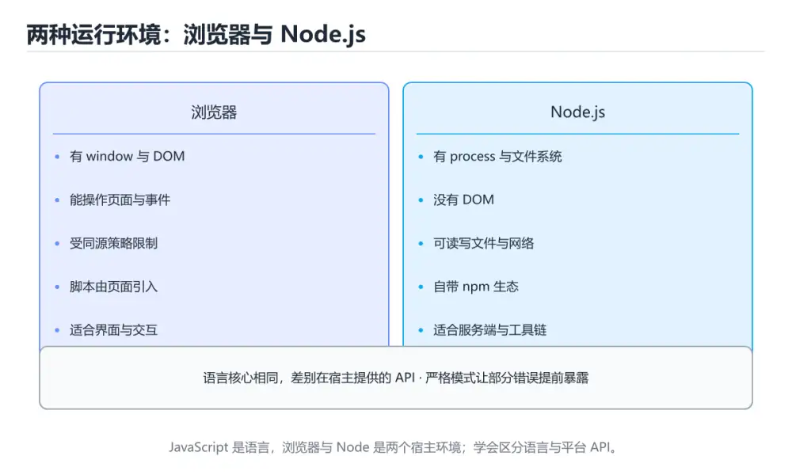
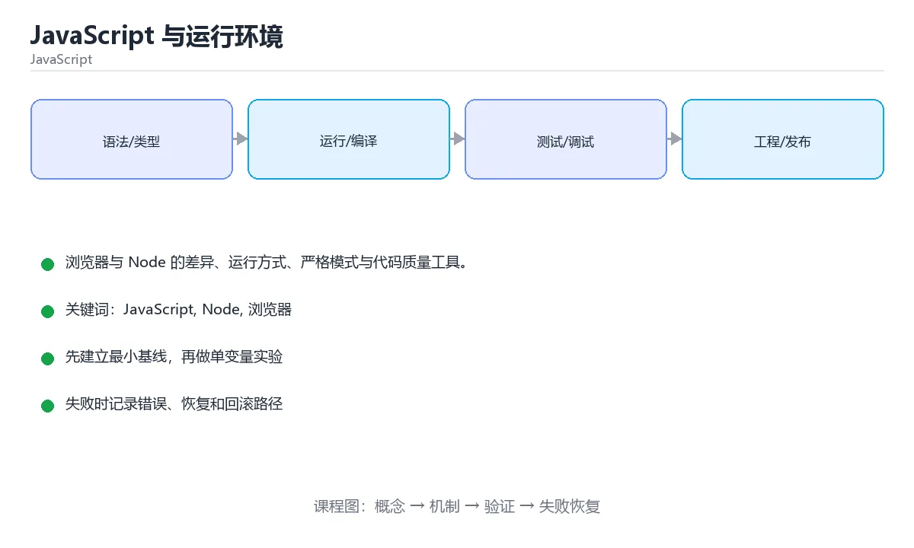

# JavaScript 与运行环境





> 内容更新时间：2026-10-03 · 学习阶段：基础 · 预计用时：12 分钟

## 学习目标

- 能用自己的话解释JavaScript 与运行环境解决了什么问题，而不是只背术语。
- 能说清 「JavaScript」、「Node」、「浏览器」、「console」 之间的关系，并分别举出一个例子。
- 能把本课知识放回「JavaScript」的知识体系，说明它和相邻主题的边界。
- 能完成本课练习，并用验收标准检查自己的结果。

> 一句话摘要：浏览器与 Node 的差异、运行方式、严格模式与代码质量工具。

## 前置知识

- 会进行基本的文件、命令行或浏览器操作；遇到不熟悉的术语先查本课关键词。
- 本课阶段：基础。建议会读写简单代码或命令，并理解变量、输入输出等基本概念。
- 开始前先复习：JavaScript、Node、浏览器。
- 如果某一步看不懂，先记录具体卡点，完成练习后再回头读一遍。

## JavaScript 是什么

JavaScript 是**动态类型、基于原型**的脚本语言，标准名为 ECMAScript。它既能跑在浏览器里操作页面，也能通过 Node.js 写服务端、命令行和桌面应用。

## 两种运行环境

| 环境 | 提供的能力 |
| --- | --- |
| 浏览器 | DOM、事件、fetch、localStorage、Canvas |
| Node.js | 文件系统、进程、网络、npm 生态 |

语言核心（变量、函数、对象、Promise）两边通用，宿主 API 不同。

## 运行方式

```html
<!-- 浏览器：defer 表示解析完 HTML 再执行，避免阻塞 -->
<script src="app.js" defer></script>
```

```bash
node app.js      # 运行脚本
node             # 进入 REPL 交互模式
```

```javascript
console.log('Hello, JavaScript!');
console.warn('警告');
console.error('错误');
console.table([{ a: 1 }, { a: 2 }]);   // 以表格展示
```

## 严格模式

```javascript
'use strict';    // 禁止隐式全局变量、静默失败等历史行为
```

ES Module 默认就是严格模式；新代码建议使用模块而不是全局脚本。

## 代码质量工具

```bash
npm install --save-dev eslint prettier
npx eslint . --fix
npx prettier --write .
```

ESLint 抓潜在错误，Prettier 统一格式，两者配合是前端工程的标准配置。

## 本课小结
先分清代码运行在浏览器还是 Node，再去查对应的 API；语言核心两者通用。

## 运行环境速查

| 能力 | 浏览器 | Node.js |
| --- | --- | --- |
| 操作 DOM | 有（`document`） | 无 |
| 获取用户事件 | 有（`addEventListener`） | 无 |
| 读写本地文件 | 受限（File API） | 有（`node:fs`） |
| 发起网络请求 | `fetch` | `fetch`（18+ 内置） |
| 定时器 | `setTimeout` / `setInterval` | 同样支持 |
| 全局对象 | `window` | `globalThis` |
| 模块系统 | ESM 为主 | ESM 与 CommonJS 都支持 |
| 环境变量 | 无（构建时注入） | `process.env` |

脚本加载方式速查：

| 写法 | 解析阻塞 | 执行时机 |
| --- | --- | --- |
| `<script src="a.js">` | 阻塞解析 | 立即按顺序执行 |
| `<script async src="a.js">` | 不阻塞 | 下载完立刻执行（顺序不确定） |
| `<script defer src="a.js">` | 不阻塞 | DOM 解析完成后按顺序执行 |
| `type="module"` | 不阻塞 | 默认 defer 语义，作用域独立 |

## 控制台速查

| 目的 | 写法 |
| --- | --- |
| 打印值 | `console.log(a, b)` |
| 打印对象结构 | `console.dir(obj, { depth: null })` |
| 表格展示数组 | `console.table(list)` |
| 分组输出 | `console.group()` / `console.groupEnd()` |
| 计时 | `console.time("t")` / `console.timeEnd("t")` |
| 断言 | `console.assert(cond, "提示")` |
| 调用栈 | `console.trace()` |
| 断点 | 代码里写 `debugger;` |

## 常见错误对照表

| 报错或现象 | 含义 | 处理方式 |
| --- | --- | --- |
| `ReferenceError: x is not defined` | 变量未声明就使用 | 检查拼写与作用域，声明后再用 |
| `TypeError: Cannot read properties of undefined` | 访问了 `undefined` 的属性 | 用可选链或先判空 |
| `SyntaxError: Unexpected token` | 语法错误（常漏括号或逗号） | 看行号，检查上一行是否完整 |
| 页面报 `require is not defined` | 浏览器没有 CommonJS | 改用 ESM 的 `import` |
| `process is not defined` | 在浏览器用了 Node API | 改前端方案或在构建时注入 |
| 脚本在 `<head>` 里执行却拿不到元素 | 脚本先于 DOM 运行 | 加 `defer` 或放到 `</body>` 前 |
| `async` 脚本顺序错乱 | `async` 不保证顺序 | 有依赖关系时改用 `defer` 或模块 |
| 修改了变量但页面没更新 | 缺少渲染逻辑 | 修改数据后显式更新 DOM 或触发框架重渲染 |
| `let` 重复声明 | `SyntaxError: Identifier has already been declared` | 同一作用域内不要重复声明 |
| 严格模式才报的错（如未声明赋值） | 静默失败 | 用 ESM 或加 `"use strict"` 暴露问题 |

## 自测清单

- [ ] 能说清浏览器与 Node 各自提供什么能力。
- [ ] 知道 `defer` 与 `async` 的差别和使用场景。
- [ ] 会用 `console.table`、`console.time`、`debugger` 调试。
- [ ] 遇到 `undefined` 报错先查取值链上的空值。
- [ ] 前端代码使用 ESM 导入，不混用 `require`。

## 零基础详解：JavaScript 到底在哪里运行

### 一句话说清它是什么

JavaScript 是**脚本语言**：不需要提前编译，写完立刻由运行环境解释执行。
它有两大宿主：浏览器（能操作页面）和 Node.js（能读写文件、起服务）。

### 用生活比喻理解

| 概念 | 比喻 | 说明 |
| --- | --- | --- |
| 引擎 | 翻译官 | V8（Chrome/Node）、JavaScriptCore（Safari） |
| 宿主环境 | 翻译官上班的公司 | 浏览器给了 `document`，Node 给了 `fs` |
| 事件循环 | 排队叫号 | 同步任务先做完，再处理回调队列 |
| 单线程 | 只有一个窗口办业务 | 所以耗时操作要异步，否则界面卡死 |

**同一门语言，能用的 API 取决于宿主环境**——浏览器里没有 `fs`，Node 里没有 `document`。

### 逐行拆解第一个程序

```javascript
// 浏览器控制台或 Node 里都能运行
console.log("Hello, World!");   // 打印到控制台

const name = "小明";             // 常量，不能重新赋值
let age = 18;                   // 变量，可以改
age = age + 1;                  // 重新赋值

console.log(`你好，${name}，明年 ${age} 岁`);
```

| 行 | 在做什么 | 为什么这么写 |
| --- | --- | --- |
| `console.log(...)` | 输出内容 | 调试最常用的手段 |
| `const name = ...` | 声明一个不可重新赋值的名字 | 默认就用 `const`，更安全 |
| `let age = 18` | 声明一个可以改的变量 | 确实需要改时才用 `let` |
| `` `...${x}...` `` | 模板字符串 | 反引号 + `${}` 才能插值 |

### `var`、`let`、`const` 三者的取舍

| 关键字 | 能否重新赋值 | 作用域 | 能否重复声明 | 建议 |
| --- | --- | --- | --- | --- |
| `var` | 能 | 函数作用域 | 能 | 老代码里见，新代码别用 |
| `let` | 能 | 块作用域 `{}` | 不能 | 需要改时用 |
| `const` | 不能 | 块作用域 `{}` | 不能 | **默认选择** |

注意：`const` 锁的是「绑定」，不是内容：
`const arr = [1]; arr.push(2);` 是合法的，但 `arr = []` 会报错。

### 在浏览器里怎么跑起来

```html
<!DOCTYPE html>
<html lang="zh-CN">
  <head><meta charset="utf-8"><title>JS 入门</title></head>
  <body>
    <p id="out">等待中…</p>
    <script src="main.js"></script>
    <!-- 也可以直接内联：<script>console.log('hi')</script> -->
  </body>
</html>
```

脚本放在 `</body>` 前，或用 `defer`，能保证 HTML 先解析完，`document` 才可用。

### 新手最容易踩的八个坑

| 坑 | 现象 | 正确做法 |
| --- | --- | --- |
| 用 `==` 比较 | `"1" == 1` 是 true | 一律用 `===` |
| 忘记 `await` | 拿到的是 Promise 而不是结果 | 在 `async` 函数里 `await` |
| 循环里用 `var` | 回调里全是最后一个值 | 改用 `let` |
| 变量未声明就赋值 | 严格模式报错，非严格模式污染全局 | 始终用 `let` / `const` |
| 数字与字符串相加 | `"1" + 2` 得到 `"12"` | 先 `Number()` 转换 |
| 直接读 `undefined` 的属性 | `TypeError: Cannot read properties of undefined` | 用 `?.` 可选链 |
| 以为对象是复制的 | 改副本影响了原对象 | 用展开 `{...obj}` 做浅拷贝 |
| 中文标点 | `SyntaxError` | 代码里全部用英文半角 |

### 三类运行环境要分清

| 环境 | 能做什么 | 不能做什么 |
| --- | --- | --- |
| 浏览器 | 操作 DOM、发请求、存 localStorage | 读写本地文件 |
| Node.js | 读写文件、起 HTTP 服务 | 访问 `document` |
| 两者共有 | 语法、内置对象、Promise、JSON | —— |

### 手把手练习：命令行问候与简单统计

```javascript
// Node 环境：node hello.js
const readline = require("node:readline/promises");

async function main() {
  const rl = readline.createInterface({
    input: process.stdin,
    output: process.stdout,
  });

  const name = (await rl.question("请输入姓名：")).trim();
  const scores = [88, 92, 79];
  const total = scores.reduce((sum, n) => sum + n, 0);
  const avg = (total / scores.length).toFixed(1);

  console.log(`你好，${name || "朋友"}！平均分 ${avg}`);
  rl.close();
}

main();
```

### 学完自测

- [ ] 能说出浏览器和 Node 各自多出哪些能力。
- [ ] 能解释 `const` 声明的数组为什么还能 `push`。
- [ ] 知道 `var` 与 `let` 在循环回调里的差别。
- [ ] 能说出 `==` 和 `===` 的区别。
- [ ] 知道脚本为什么建议放在 `</body>` 前或用 `defer`。

## 动手练习

> 本课练习重点：围绕「JavaScript、Node、浏览器」完成复述、实验和交付，每个结果都要能被别人检查。

先在 Node 或浏览器复现行为，再改写异步与错误路径，最后补测试。

### 练习 1：建立心智模型（10 分钟）

合上教程，用 3～5 句话回答：

1. JavaScript 与运行环境解决了什么问题？
2. 如果没有它，会出现什么具体后果？
3. 它和「Node」是什么关系？

**验收标准**：至少出现一个本课关键词，并写出一个反例、边界条件或失效场景。

### 练习 2：做一次可控实验（20 分钟）

从正文中选一个最小示例，完成以下操作：

1. 先预测修改一个参数、输入或步骤后的结果。
2. 再实际执行或逐步推演，记录真实结果。
3. 如果结果与预测不同，写出差异原因。

**验收标准**：留下「原例 → 改动 → 预测 → 结果 → 原因」五步记录。

### 练习 3：交付一个小结果（30 分钟）

在浏览器控制台或 Node.js 中写一个最小示例，列出至少 3 组输入输出。

任务要求：

- 结果必须能被别人检查，不能只写“我已经理解了”。
- 至少覆盖「JavaScript」和「Node」两个关键词。
- 写出 1 个仍然不确定的问题，以及下一步如何验证。

> 提示：时间有限时优先做练习 1 和练习 2；练习 3 可以拆成两次完成。

## 可运行练习

### 任务 1：先跑通，再解释

```javascript
console.log('Hello, JavaScript!');
console.warn('警告');
console.error('错误');
console.table([{ a: 1 }, { a: 2 }]);   // 以表格展示
```

**预期输出**：Hello, JavaScript!

### 任务 2：只改一个条件

把「JavaScript 与运行环境」的最小示例复制一份，只改一个条件再跑一次：

- 改动点：只把JavaScript的输入换成空值、极值或错误输入，其余保持不变。
- 预测：先写下「JavaScript 与运行环境」在改动后的输出或错误信息，再运行。
- 记录：对照改动前后的结果，指出差异出在哪一步。
- 验收：换回原条件能复现原结果，改动只影响JavaScript。

### 任务 3：迁移到自己的数据

用同一套思路处理一组你自己的数据或场景，保持输出格式与任务 1 一致。

## 故障现场

### 现场 1：本课的 JavaScript 常规用例通过，但边界用例失败

**症状**：在本课的练习或生产场景里出现“本课的 JavaScript 常规用例通过，但边界用例失败”。

**复现**：准备一组最小输入，只保留触发“本课的 JavaScript 常规用例通过，但边界用例失败”的必要条件，连续运行两次确认结果稳定。

**定位**：围绕“JavaScript 的前置条件与取值边界没有写进代码，默认值掩盖了空值和极值”检查调用链、输入数据和环境配置，先验证假设再改代码。

**预防**：把“本课的 JavaScript 常规用例通过，但边界用例失败”写成一条自动化用例，并在本课的验收清单里保留对应检查项。

### 现场 2：本课的 Node 结果在两次运行之间不一致

**症状**：在本课的练习或生产场景里出现“本课的 Node 结果在两次运行之间不一致”。

**复现**：准备一组最小输入，只保留触发“本课的 Node 结果在两次运行之间不一致”的必要条件，连续运行两次确认结果稳定。

**定位**：围绕“Node 依赖了当前版本、执行顺序或共享状态，单次运行无法暴露差异”检查调用链、输入数据和环境配置，先验证假设再改代码。

**预防**：把“本课的 Node 结果在两次运行之间不一致”写成一条自动化用例，并在本课的验收清单里保留对应检查项。

### 现场 3：本课的验证只在开发机通过

**症状**：在本课的练习或生产场景里出现“本课的验证只在开发机通过”。

**定位**：围绕“环境版本、配置和输入规模与目标环境不同，JavaScript 缺少可重复的验证记录”检查调用链、输入数据和环境配置，先验证假设再改代码。

## 版本与时效

- 运行时要同时考虑浏览器基线、Node LTS 与打包工具的降级策略
- 升级前用特性检测和构建目标矩阵验证，不要只在本机浏览器测试

### 升级检查清单

- 先固定当前版本，跑通全部示例与测验，再升级工具链。
- 只改一个版本变量，记录编译、测试、性能与产物体积的变化。
- 重点回归默认值、弃用警告、序列化格式、并发语义和错误信息。
- 升级完成后更新本课的“最后复核 / 下次复核”日期与版本说明。

## 本课复习清单

离开本课前，逐项确认：

- [ ] 不看解析，能说出「下面哪项是浏览器提供、Node.js 没有的能力？」的判断依据。
- [ ] 不看解析，能说出「<script defer> 的作用是？」的判断依据。
- [ ] 不看解析，能说出「ECMAScript 指的是？」的判断依据。
- [ ] 不看解析，能说出「let、const 与 var 的作用域区别是？」的判断依据。
- [ ] 不看解析，能说出「"use strict" 严格模式的主要作用是？」的判断依据。
- [ ] 不看解析，能说出的判断依据。
- [ ] 至少运行一次本课示例，记录输入、输出和一个边界情况。
- [ ] 把本课最容易混淆的两个概念写成一句话对照。

| 复盘项 | 记录 |
| --- | --- |
| 已经能独立解释的考点 |  |
| 仍然说不清的概念 |  |
| 下一步验证动作 |  |

## 术语速查

| 术语 | 本课语境 |
| --- | --- |
| `document` | \| 操作 DOM \| 有（`document`） \| 无 \| |
| `addEventListener` | \| 获取用户事件 \| 有（`addEventListener`） \| 无 \| |
| `node:fs` | \| 读写本地文件 \| 受限（File API） \| 有（`node:fs`） \| |
| `fetch` | \| 发起网络请求 \| `fetch` \| `fetch`（18+ 内置） \| |
| `setTimeout` | \| 定时器 \| `setTimeout` / `setInterval` \| 同样支持 \| |
| `setInterval` | \| 定时器 \| `setTimeout` / `setInterval` \| 同样支持 \| |

## 考点精讲

### 考点 1：概念判断·JavaScript

- **题目**：下面哪项是浏览器提供、Node.js 没有的能力？
- **判断依据**：作答时，先用JavaScript建立输入与输出的基线，再把DOM 操作代入边界条件核对，结论才能复现。这道题的关键在「JavaScript 与运行环境」的JavaScript、Node、浏览器：先确认题干“下面哪项是浏览器提供、Node.js”问的是哪一步，再排除偷换前提的选项。

### 考点 2：概念判断·JavaScript

- **题目**：<script defer> 的作用是？
- **判断依据**：在「JavaScript 与运行环境」里，HTML 解析完成后再执行脚本。defer 让脚本异步下载并在文档解析完成后按顺序执行，避免阻塞首屏渲染。回到「JavaScript 与运行环境」的正文示例，用“<script defer 的作用是”走一遍JavaScript、Node、浏览器的完整流程，能复现的结论才可以保留。

### 考点 3：代码补全·JavaScript

- **题目**：阅读「JavaScript 与运行环境」正文里的这段 JavaScript 代码，下面哪一项判断是正确的？
- **判断依据**：在「JavaScript 与运行环境」里，这段代码会产生可观察的输出，运行后能看到结果。这段代码出自「JavaScript 与运行环境」的正文示例，围绕JavaScript、Node、浏览器展开；把输入或边界换成空值、极值或失败情况后，结论要以「JavaScript 与运行环境」的实际运行结果为准。

### 考点 4：多选辨析·JavaScript

- **题目**：围绕“JavaScript 与运行环境”中的 JavaScript、Node、浏览器，下列哪两项是本课强调的实践判断？
- **判断依据**：结论应落在验证 Node 时要固定版本并覆盖边界输入。本课把JavaScript 与运行环境拆成概念、示例与故障现场三部分，因此判断 JavaScript 时必须同时交代输入、输出和失败路径，这使“学习 JavaScript 时要同时说明输入、输出和失败路径，不能只看正常流程”成立。在JavaScript 与运行环境里，判断 Node 时要固定版本与边界输入，所以“验证 Node 时要固定版本并覆盖边界输入，结论才可复现”才可复现。

### 考点 5：概念判断·JavaScript

- **题目**："use strict" 严格模式的主要作用是？
- **判断依据**：在「JavaScript 与运行环境」里，把未声明就赋值等静默错误改为直接抛错。ES Module 与 class 内部默认就是严格模式，因此现代代码很少手写它。把“把未声明就赋值等静默错误改为直接抛错”代回「JavaScript 与运行环境」里“"use strict" 严格模式的主要作用是”的例子核对，条件一旦改变，结论就要用JavaScript、Node、浏览器重新推导。

### 考点 6：填空·JavaScript

- **题目**：补全代码：「JavaScript 与运行环境」示例中，下面这行代码缺少哪个关键字或函数名？请填入 ____。 `const name = (await rl.____("请输入姓名：")).trim;`
- **判断依据**：是合法的，但 arr = [] 会报错。这道题的关键在「JavaScript 与运行环境」的JavaScript、Node、浏览器：先确认题干“补全代码”问的是哪一步，再排除偷换前提的选项。把“question”代回「JavaScript 与运行环境」里“JavaScript 与运行环境示例中”的例子核对，条件一旦改变，结论就要用JavaScript、Node、浏览器重新推导。

## English Overview

**Title:** JavaScript & Runtimes

**Summary:** Browser vs Node, running code, strict mode and tooling.

**Category:** JavaScript
**Level:** 基础
**Key terms:** JavaScript, Node, 浏览器, console, ECMAScript

## 内容元数据

- 内容版本：v2.0
- 最后更新：2026-10-03
- 学习阶段：基础
- 适用环境：Node.js 22+ / 现代浏览器
- 内容来源：内置结构化课程与工程实践整理
- 相关主题：JavaScript、Node、浏览器、console、ECMAScript
- 质量版本：P0 测验标准 + P1 覆盖扩展 + P2 体验补全

## Full English Study Guide

### Overview

**JavaScript & Runtimes** focuses on Browser vs Node, running code, strict mode and tooling.

### Learning Outcomes

- Explain what **JavaScript & Runtimes** solves and when it should be used.

### Glossary

- Topic: **JavaScript & Runtimes**
- Related terms: JavaScript, Node, 浏览器, console

## Bilingual Section Outline

| 中文小节 | English section |
| --- | --- |
| 学习目标 | Learning objectives |
| 前置知识 | Prerequisites |
| JavaScript 是什么 | JavaScript 是什么 |
| 两种运行环境 | 两种运行环境 |
| 运行方式 | 运行方式 |
| 严格模式 | 严格模式 |
| 代码质量工具 | 代码质量Tools |
| 本课小结 | Summary |
| 运行环境速查 | 运行环境速查 |
| 控制台速查 | 控制台速查 |

## 参考资料与复核

- 最后复核：2026-10-04
- 下次复核：2027-04-04
- 复核范围：版本兼容、API 行为、安全建议与工程实践
- 来源性质：官方文档、标准或权威教材；正文为离线教学重组

| 参考资料 | 本课用途 |
| --- | --- |
| [ECMAScript 标准](https://tc39.es/ecma262/) | JavaScript 语言标准 |
| [Node.js 文档](https://nodejs.org/docs/latest/api/) | 服务端运行时与模块 |
| [MDN JavaScript 指南](https://developer.mozilla.org/docs/Web/JavaScript/Guide) | 语言基础与浏览器 API |

> 「JavaScript 与运行环境」的链接用于离线阅读后的延伸核对；App 不会自动联网。
