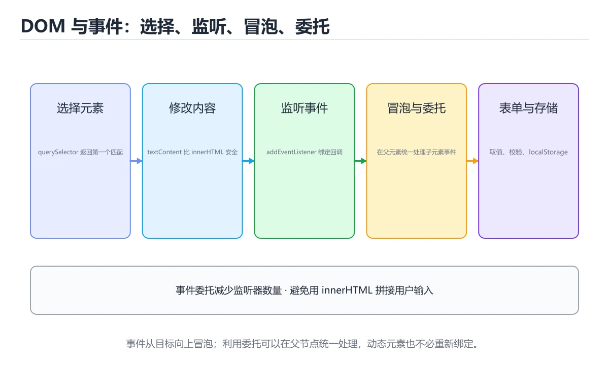
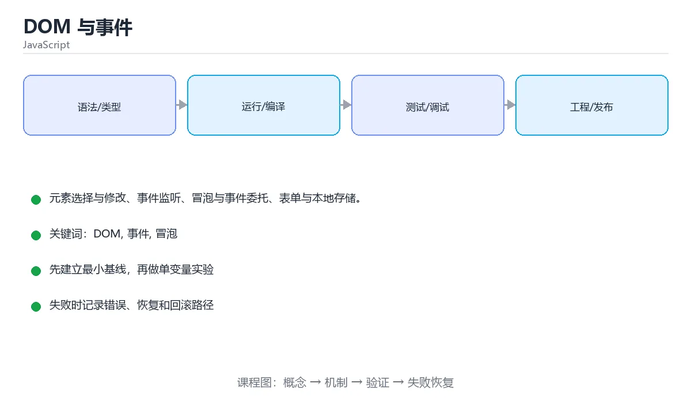

# DOM 与事件





> 内容更新时间：2026-10-06 · 学习阶段：进阶 · 预计用时：45 分钟

## 学习目标

- 能用自己的话解释DOM 与事件解决了什么问题，而不是只背术语。
- 能说清 「DOM」、「事件」、「冒泡」、「事件委托」 之间的关系，并分别举出一个例子。
- 能把 DOM 放回「DOM 与事件」的知识体系，说明它和 事件 的边界。
- 能完成本课练习，并用验收标准检查自己的结果。

> 一句话摘要：元素选择与修改、事件监听、冒泡与事件委托、表单与本地存储。

## 前置知识

- 先完成上一课《异步编程》；如果已经掌握，可以直接用本课练习自测。
- 本课阶段：进阶。建议先完成「异步编程」，或确认自己能独立跑通正文里的 querySelectorAll 示例。
- 开始前先复习：DOM、事件、冒泡。
- 如果 选择与修改元素 这一步看不懂，先记录具体卡点，再用 querySelectorAll 复现一遍。

## 选择与修改元素

```javascript
const title = document.querySelector('#title');        // 第一个匹配
const items = document.querySelectorAll('.item');      // NodeList

title.textContent = '新标题';                          // 纯文本，安全
title.innerHTML = '<b>加粗</b>';                       // 解析 HTML，注意 XSS
title.classList.add('active');
title.classList.toggle('hidden');
title.style.color = 'red';

const div = document.createElement('div');
div.textContent = '动态创建';
document.body.append(div);
items.forEach(item => item.remove());                  // NodeList 支持 forEach
```

插入用户输入时优先 `textContent`，使用 `innerHTML` 前必须转义，否则存在 XSS 风险。

## 事件监听

```javascript
const button = document.querySelector('#save');

function handleClick(event) {
  console.log('点击了', event.target);
}
button.addEventListener('click', handleClick);
button.removeEventListener('click', handleClick);   // 移除需传同一函数引用
```

## 冒泡与事件委托

事件默认从目标向外冒泡（target → 祖先），因此可以在父元素上统一处理子元素事件：

```javascript
document.querySelector('#list').addEventListener('click', event => {
  const item = event.target.closest('li[data-id]');
  if (!item) return;
  console.log('点击了', item.dataset.id);   // data-id → dataset.id
});

event.stopPropagation();   // 阻止继续冒泡（慎用）
event.preventDefault();    // 阻止默认行为，如提交表单
```

委托的好处：动态新增的元素无需重新绑定监听器。

## 表单与本地存储

```javascript
form.addEventListener('submit', event => {
  event.preventDefault();                  // 阻止页面刷新
  const data = new FormData(form);
  console.log(Object.fromEntries(data));
});

localStorage.setItem('token', 'abc');      // 持久保存（同源、仅字符串）
sessionStorage.setItem('step', '1');       // 关闭标签页即清除
const token = localStorage.getItem('token');
```

## 开发者工具

Elements 看结构、Console 试代码、Network 看请求、Sources 打断点、Application 看存储与缓存。

## 事件与 DOM 的性能注意点

| 场景 | 问题 | 做法 |
| --- | --- | --- |
| 列表渲染上千项 | 逐个 append 触发多次重排 | 用 DocumentFragment 批量插入，或虚拟滚动 |
| 高频事件（scroll/resize/input） | 每秒触发几十次 | 用防抖（debounce）或节流（throttle） |
| 大量子元素事件 | 绑定上千个监听器 | 事件委托到父容器 |
| 读写布局属性交替 | 强制同步布局（layout thrashing） | 先批量读，再批量写 |
| 频繁改样式 | 逐条改 style 触发多次重绘 | 改 class 或使用 CSS 变量 |

清理与正确性：组件卸载时移除监听器（`removeEventListener` 需同一函数引用）与取消定时器；`requestAnimationFrame` 适合逐帧更新；表单提交用 `preventDefault` 后自行校验，避免页面刷新丢失状态。

## 本课小结

DOM 操作记住三件事：**用 querySelector 选择、用 addEventListener 绑定、用事件委托处理动态列表**，并把用户内容当作不可信数据。

## DOM 查询与修改速查

| 目的 | 写法 | 说明 |
| --- | --- | --- |
| 查单个元素 | `document.querySelector(".card")` | 返回第一个匹配或 `null` |
| 查全部元素 | `document.querySelectorAll(".card")` | 返回静态 NodeList，可 `forEach` |
| 按 id 查 | `document.getElementById("app")` | 最快，但只按 id |
| 改文本 | `el.textContent = "内容"` | 安全，不解析 HTML |
| 改 HTML | `el.innerHTML = html` | 有 XSS 风险，只用可信内容 |
| 改样式 | `el.classList.add("active")` | 优于直接拼 `style` |
| 改属性 | `el.setAttribute("aria-label", "关闭")` | 表单值优先用 `el.value` |
| 创建节点 | `document.createElement("li")` | 配合 `append` 插入 |
| 插入节点 | `parent.append(child)` | `prepend` / `before` / `after` 同理 |
| 删除节点 | `el.remove()` | 直接把自己从文档中移除 |
| 事件委托 | `list.addEventListener("click", fn)` | 在父元素上监听，减少监听器数量 |
| 阻止默认行为 | `event.preventDefault()` | 如阻止表单提交跳转 |
| 阻止冒泡 | `event.stopPropagation()` | 慎用，会破坏事件委托 |
| 一次性监听 | `addEventListener("click", fn, { once: true })` | 自动移除，避免泄漏 |

```js
// 事件委托：动态新增的条目也能响应
const list = document.querySelector("#todo-list");
list.addEventListener("click", (event) => {
  const target = event.target.closest("li[data-id]");
  if (!target) return;
  target.classList.toggle("done");
});
```

## 表单速查

| 目的 | 写法 |
| --- | --- |
| 阻止提交刷新页面 | `form.addEventListener("submit", (e) => { e.preventDefault(); ... })` |
| 读取输入 | `input.value.trim()` |
| 复选框状态 | `checkbox.checked` |
| 单选组取值 | `form.elements["gender"].value` |
| 表单整体取值 | `new FormData(form)` 或 `Object.fromEntries(new FormData(form))` |
| 自定义校验 | `input.setCustomValidity("提示")` |
| 触发原生校验 | `form.reportValidity()` |

## 常见错误与排查

| 容易写错的做法 | 实际现象 | 原因与正确做法 |
| --- | --- | --- |
| `<script>` 放在 `<head>` 里直接查 DOM | `Cannot read properties of null` | 用 `defer`、放到 `</body>` 前，或监听 `DOMContentLoaded` |
| 用 `innerHTML` 插入用户输入 | XSS 漏洞 | 用 `textContent`，必要时先转义 |
| 循环里给每个元素 `addEventListener` | 列表大时性能差、内存占用高 | 用事件委托在父元素监听 |
| `querySelectorAll` 结果直接 `.map` | `TypeError: map is not a function` | NodeList 不是数组，先 `Array.from(...)` |
| 用 `event.target` 当委托目标 | 点到子元素时拿到子元素 | 用 `event.target.closest(选择器)` |
| 忘了 `preventDefault` | 表单提交导致页面刷新 | 在 `submit` 里阻止默认行为 |
| 用 `stopPropagation` 处理所有问题 | 其他监听器失效 | 明确事件流，只在必要时阻止 |
| 动态元素直接绑定事件 | 新增元素不响应 | 事件委托或插入后再绑定 |
| 在循环里拼接 `innerHTML +=` | 反复重排，性能差、监听器丢失 | 先拼字符串或 DocumentFragment，最后一次性插入 |
| 直接读 `element.style.width` | 拿到的是内联样式，可能是空字符串 | 用 `getComputedStyle(el).width` |

## 复习与自测

- [ ] 会用 `querySelector` 与 `querySelectorAll` 查询元素。
- [ ] 插入不可信文本时使用 `textContent`。
- [ ] 会用事件委托处理动态列表。
- [ ] 表单提交先 `preventDefault`，再用 `FormData` 取值。
- [ ] 知道脚本要等 DOM 就绪，或用 `defer`。

## 零基础详解：DOM 操作与事件处理

### 一句话说清它是什么

DOM 是浏览器把 HTML 变成的一棵「节点树」，JS 通过它读写页面；
事件是「用户做了什么」的通知，你注册回调函数来决定怎么响应。

### 用生活比喻理解

| 概念 | 比喻 | 说明 |
| --- | --- | --- |
| DOM 树 | 家谱 | 每个标签是一个节点，有父子兄弟关系 |
| 选择器 | 点名 | 按 id、class、标签找到元素 |
| 事件监听 | 装门铃 | 有人按铃就执行你的回调 |
| 事件冒泡 | 水泡上浮 | 子元素的事件会往父元素传 |
| 事件委托 | 前台统一收件 | 只在一个父节点上监听所有子节点 |

### 选取元素的四种方式

```javascript
const one = document.querySelector("#app");          // 第一个匹配
const all = document.querySelectorAll(".item");       // 全部匹配，返回 NodeList
const byId = document.getElementById("app");          // 最快
const byClass = document.getElementsByClassName("item");   // 实时集合

for (const el of all) {                               // NodeList 可迭代
  el.classList.add("active");
}
```

### 读写内容与属性

```javascript
const box = document.querySelector("#box");

box.textContent = "纯文本";                  // 安全，不会解析标签
box.innerHTML = "<b>富文本</b>";             // 会解析 HTML，注意 XSS

box.classList.add("active");
box.classList.toggle("dark");
box.classList.remove("active");

box.setAttribute("data-id", "7");
box.dataset.userId;                          // 读取 data-user-id

box.style.color = "red";                     // 行内样式，少量使用
box.hidden = true;                           // 推荐：用类或 hidden 控制显隐
```

**安全提醒**：只有内容可信时才用 `innerHTML`；用户输入一律用 `textContent`。

### 创建、插入与移除

```javascript
const list = document.querySelector("#list");

const li = document.createElement("li");
li.textContent = "新条目";
list.append(li);                 // 追加到末尾

li.remove();                     // 删除自己
list.replaceChildren();          // 一次清空（比循环删更快）
```

### 事件处理与冒泡控制

```javascript
const button = document.querySelector("#save");

function onSave(event) {
  event.preventDefault();        // 阻止默认行为（表单提交、链接跳转）
  console.log("点击了", event.target);
}

button.addEventListener("click", onSave);
// 需要移除时必须传同一个函数引用
// button.removeEventListener("click", onSave);
```

| 方法 | 作用 |
| --- | --- |
| `preventDefault()` | 阻止默认行为 |
| `stopPropagation()` | 阻止继续冒泡（谨慎使用） |
| `event.target` | 实际触发事件的元素 |
| `event.currentTarget` | 绑定监听的那个元素 |
| `{ once: true }` | 只触发一次后自动移除 |

### 事件委托：列表点击的标准写法

```javascript
const list = document.querySelector("#list");

list.addEventListener("click", (event) => {
  const item = event.target.closest("li[data-id]");
  if (!item) return;                       // 点在空白处，忽略
  console.log("选中", item.dataset.id);
});
```

好处：**新加的子元素自动生效，不用重复绑定**。

### 新手最容易踩的八个坑

| 坑 | 现象 | 正确做法 |
| --- | --- | --- |
| 脚本在元素之前执行 | `Cannot read properties of null` | 用 `defer` 或放到 `</body>` 前 |
| 用 `innerHTML` 拼接用户输入 | XSS 漏洞 | 用 `textContent` |
| 循环里绑定监听 | 元素多时性能差 | 用事件委托 |
| `removeEventListener` 无效 | 回调传的是新函数 | 保存同一个函数引用 |
| 忘记 `preventDefault` | 表单刷新页面 | 在提交处理里加上 |
| 用 `style` 到处改样式 | 难以维护 | 用 class 切换 |
| 频繁读写 `offsetHeight` | 强制同步布局，卡顿 | 批量读取后统一写 |
| 以为 NodeList 是数组 | `map` 报错 | 用 `Array.from` 或 `[...]` |

### 手把手练习：可增删的待办列表

```javascript
const form = document.querySelector("#todo-form");
const input = document.querySelector("#todo-input");
const list = document.querySelector("#todo-list");

form.addEventListener("submit", (event) => {
  event.preventDefault();
  const text = input.value.trim();
  if (!text) return;

  const li = document.createElement("li");
  li.textContent = text;
  li.dataset.id = String(Date.now());
  list.append(li);
  input.value = "";
  input.focus();
});

// 事件委托：删除按钮未来新增的也能生效
list.addEventListener("click", (event) => {
  const li = event.target.closest("li");
  if (li) li.remove();
});
```

### 学完自测

- [ ] 能说出 `querySelector` 与 `querySelectorAll` 的区别。
- [ ] 知道为什么不能直接用 `innerHTML` 渲染用户输入。
- [ ] 能解释事件冒泡与事件委托。
- [ ] 知道 `event.target` 与 `currentTarget` 的差别。
- [ ] 能说出脚本放在 `<head>` 里要注意什么。

## 动手练习

> 本课练习重点：围绕「DOM、事件、冒泡」完成复述、实验和交付，每个结果都要能被别人检查。

先在 Node 或浏览器复现 DOM 的行为，再改写异步与错误路径，最后补测试。

### 练习 1：建立心智模型（10 分钟）

合上教程，用 3～5 句话回答：

1. DOM 与事件解决了什么问题？
2. 如果没有它，会出现什么具体后果？
3. 它和「事件」是什么关系？

验收标准：说明 DOM 与 事件 的分工，并写出一个失效场景。

### 练习 2：做一次可控实验（20 分钟）

从正文中选一个最小示例，完成以下操作：

1. 先预测修改一个参数、输入或步骤后的结果。
2. 再实际执行或逐步推演，记录真实结果。
3. 如果结果与预测不同，写出差异原因。

**验收标准**：先在「选择与修改元素」里找一个可运行的最小输入，再按五步法记录DOM的影响；预测与结果不一致时补写被忽略的前提。

### 练习 3：交付一个小结果（30 分钟）

用 querySelectorAll 写一个可直接运行的片段，覆盖正常、边界与失败输入。

任务要求：

- 结果必须能被别人检查，不能只写“我已经理解了”。
- 至少覆盖「DOM」和「事件」两个关键词。
- 写出 1 个仍然不确定的问题，以及下一步如何验证。

> 提示：时间有限时优先做练习 1 和练习 2；练习 3 可以拆成两次完成。

## 可运行练习

### 任务 1：先跑通，再解释

```javascript
const button = document.querySelector('#save');

function handleClick(event) {
  console.log('点击了', event.target);
}
button.addEventListener('click', handleClick);
button.removeEventListener('click', handleClick);   // 移除需传同一函数引用
```

### 任务 2：只改一个条件

把「DOM 与事件」的最小示例复制一份，只改一个条件再跑一次：

- 改动点：把 事件 换成边界值，其他输入保持原样。
- 预测：先写下「DOM 与事件」在改动后的输出或错误信息，再运行。
- 记录：对照改动前后的结果，指出差异出在哪一步。
- 验收：换回原条件能复现原结果，改动只影响DOM。

### 任务 3：迁移到自己的数据

用同一套思路处理一组你自己的 DOM 数据，保持输出格式与任务 1 一致。

## 故障现场

### 现场 1：<script> 放在 <head> 里直接查 DOM

**症状**：在《DOM 与事件》的复现场景中，Cannot read properties of null。

**根因**：触发点是把“<script> 放在 <head> 里直接查 DOM”当成安全做法。它没有满足《DOM 与事件》要求的前提，因此先表现为“Cannot read properties of null”；排查时先完整复现这一段，再核对输入、配置与依赖。

**修复**：针对《DOM 与事件》的问题，用 defer、放到 </body> 前，或监听 DOMContentLoaded。

**验证**：在《DOM 与事件》中按“用 defer、放到 </body> 前，或监听 DOMContentLoaded”调整后，从“<script> 放在 <head> 里直接查 DOM”的触发条件重放同一条路径，确认“Cannot read properties of null”不再出现，并补一个相邻边界用例检查没有引入新问题。

### 现场 2：用 innerHTML 插入用户输入

**症状**：在《DOM 与事件》的复现场景中，XSS 漏洞。

**根因**：“XSS 漏洞”只是表层结果。向上追溯会落到“用 innerHTML 插入用户输入”这一步，因为它省略了《DOM 与事件》的约束，使实现行为和预期模型发生了偏离。

**修复**：针对《DOM 与事件》的问题，用 textContent，必要时先转义。

**验证**：保留《DOM 与事件》里触发“XSS 漏洞”的输入、版本和日志，按“用 textContent，必要时先转义”完成修改后原样重放；只有失败现象消失且相邻场景仍可解释，才保留改动。

### 现场 3：循环里给每个元素 addEventListener

**症状**：在《DOM 与事件》的复现场景中，列表大时性能差、内存占用高。

**根因**：“列表大时性能差、内存占用高”只是表层结果。向上追溯会落到“循环里给每个元素 addEventListener”这一步，因为它省略了《DOM 与事件》的约束，使实现行为和预期模型发生了偏离。

**修复**：针对《DOM 与事件》的问题，用事件委托在父元素监听。

**验证**：先在《DOM 与事件》中记录“循环里给每个元素 addEventListener”留下的失败证据，再执行“用事件委托在父元素监听”并重放；确认错误路径变为明确结果，且修复没有掩盖同类故障。

## 版本与时效

- querySelectorAll 依赖的新 API 必须有降级路径，否则老环境直接报错。
- 升级前确认 DOM 的兼容范围，把不可回退的改动单独拆成一次提交。

### 升级检查清单

- 先固定当前版本，跑通全部示例与测验，再升级工具链。
- 一次只改一个版本条件，把 DOM 相关的差异单独记成一条结论。
- 回归范围锁定 querySelectorAll 的默认行为，并确认弃用警告是否出现在构建输出里。
- 升级完成后记录 DOM 的新旧版本差异，并据此调整下次复核时间。

## 本课复习清单

离开本课前，逐项确认：

- [ ] 不看解析，能说出「事件委托能生效的前提是？」的判断依据。
- [ ] 不看解析，能说出「把用户输入插入页面，安全的做法是？」的判断依据。
- [ ] 不看解析，能说出「event.preventDefault() 的作用是？」的判断依据。
- [ ] 不看解析，能说出「DOMContentLoaded 与 load 的区别是？」的判断依据。
- [ ] 至少运行一次 querySelectorAll 的示例，记录输入、输出和 DOM 的边界情况。
- [ ] 把本课最容易混淆的两个概念写成一句话对照。

| 复盘项 | 记录 |
| --- | --- |
| 已经能独立解释的考点 |  |
| 仍然说不清的概念 |  |
| 下一步验证动作 |  |

## 术语速查

把「DOM 与事件」里反复出现的术语集中放在一起。复习时先遮住右列，尝试用自己的话解释，再回到正文核对。

| 术语 | 一句话说明 |
| --- | --- |
| `DOM` | DOM 操作记住三件事：用 querySelector 选择、用 addEventListener 绑定、用事件委托处理动态列表，并把用户内容当作不可信数据。 |
| `事件` | 事件是「用户做了什么」的通知，你注册回调函数来决定怎么响应。 |
| `冒泡` | 事件从触发元素向上传播到祖先节点的过程。 |
| `事件委托` | 把监听器挂在父元素上，靠事件冒泡统一处理子元素事件，避免为每个子节点绑定监听。 |
| `localStorage` | 浏览器提供的同源持久化键值存储，容量有限且只能存字符串。 |
| `XSS` | 插入用户输入时优先 textContent，使用 innerHTML 前必须转义，否则存在 XSS 风险。 |

## 考点精讲

### 考点 1：代码补全·DOM

- **题目**：这段 JavaScript 代码是「DOM 与事件」的示例片段，下面哪一项描述与它一致？
- **判断依据**：题干的正确项是这段代码把主要逻辑封装在函数或方法里，需要被调用才会执行，在「DOM 与事件」里封装边界决定DOM从哪一步开始生效。这段代码出自「DOM 与事件」的正文示例，围绕DOM、事件、冒泡展开；把输入或边界换成空值、极值或失败情况后，结论要以「DOM 与事件」的实际运行结果为准。“JavaScript”与「DOM 与事件」的术语表相呼应，只有符合DOM、事件、冒泡约束的“这段代码把主要逻辑封装在函数或方法里”才是正文支持的结论。

### 考点 2：概念判断·DOM

- **题目**：把用户输入插入页面，安全的做法是？
- **判断依据**：在「DOM 与事件」里，textContent 把内容当纯文本，不会执行脚本。在「DOM 与事件」里，innerHTML 需先转义以防 XSS。「DOM 与事件」要求先交代DOM、事件、冒泡的前提再下结论，所以“textContent”只在题干“把用户输入插入页面”给定的条件下成立。

### 考点 3：概念判断·DOM

- **题目**：event.preventDefault 的作用是？
- **判断依据**：在「DOM 与事件」里，阻止浏览器默认行为（如提交表单、跳转链接）。preventDefault 取消默认行为，stopPropagation 才是阻止冒泡，两者常被混淆。这道题的关键在「DOM 与事件」的DOM、事件、冒泡：先确认题干“event.preventDefau”问的是哪一步，再排除偷换前提的选项。

### 考点 4：多选辨析·DOM

- **题目**：围绕“DOM 与事件”中的 DOM、事件、冒泡，下列哪两项是本课强调的实践判断？
- **判断依据**：结论应落在验证 事件 时要固定版本并覆盖边界输入。本课把DOM 与事件拆成概念、示例与故障现场三部分，因此判断 DOM 时必须同时交代输入、输出和失败路径，这使“学习 DOM 时要同时说明输入、输出和失败路径，不能只看正常流程”成立。在DOM 与事件里，判断 事件 时要固定版本与边界输入，所以“验证 事件 时要固定版本并覆盖边界输入，结论才可复现”才可复现。

### 考点 5：概念判断·DOM

- **题目**：DOMContentLoaded 与 load 的区别是？
- **判断依据**：在「DOM 与事件」里，DOMContentLoaded 在 HTML 解析完成时触发。脚本尽早绑定事件应使用 DOMContentLoaded，统计完整加载耗时才用 load。在「DOM 与事件」里判断这道题，要把DOM、事件、冒泡的条件、过程与失败路径逐项对齐，换成“DOMContentLoaded 与”这个场景，只有满足前提的结论才成立。

### 考点 6：填空·DOM

- **题目**：补全代码：「DOM 与事件」示例中，下面这行代码缺少哪个关键字或函数名？请填入 ____。 `button.____('click', handleClick); // 移除需传同一函数引用`
- **判断依据**：空格应填写「removeEventListener」、「removeeventlistener」。把“removeEventListener”代回「DOM 与事件」里“DOM 与事件示例中”的例子核对，条件一旦改变，结论就要用DOM、事件、冒泡重新推导。「DOM 与事件」要求先交代DOM、事件、冒泡的前提再下结论，所以“removeEventListener”只在题干“与事件示例中”给定的条件下成立。

## English Overview

**Title:** DOM & Events

**Summary:** Selecting elements, events, delegation, forms and storage.

**Category:** JavaScript
**Level:** 进阶
**Key terms:** DOM, 事件, 冒泡, 事件委托, localStorage, XSS

## 内容元数据

- 内容版本：v2.0
- 最后更新：2026-10-06
- 学习阶段：进阶
- 适用环境：Node.js 22+ / 现代浏览器；本课聚焦 DOM。
- 内容来源：内置结构化课程与工程实践整理
- 相关主题：DOM、事件、冒泡、事件委托、localStorage、XSS
- 质量版本：P0 测验标准 + P1 覆盖扩展 + P2 体验补全

## 参考资料与复核

- 最后复核：2026-10-04
- 下次复核：2027-05-17
- 复核范围：版本兼容、API 行为、安全建议与工程实践
- 来源性质：官方文档、标准或权威教材；正文为离线教学重组

| 参考资料 | 本课用途 |
| --- | --- |
| [MDN JavaScript 指南](https://developer.mozilla.org/docs/Web/JavaScript/Guide) | 语言基础与浏览器 API |
| [MDN 模块](https://developer.mozilla.org/docs/Web/JavaScript/Guide/Modules) | ES Module 与依赖组织 |
| [Node 事件循环](https://nodejs.org/en/learn/asynchronous-work/event-loop-timers-and-nexttick) | 事件循环与异步顺序 |

> 「DOM 与事件」的链接用于离线阅读后的延伸核对；App 不会自动联网。
