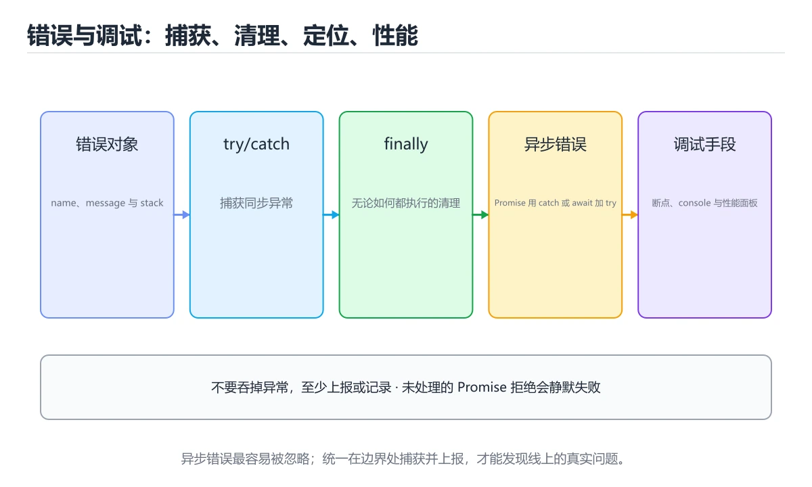
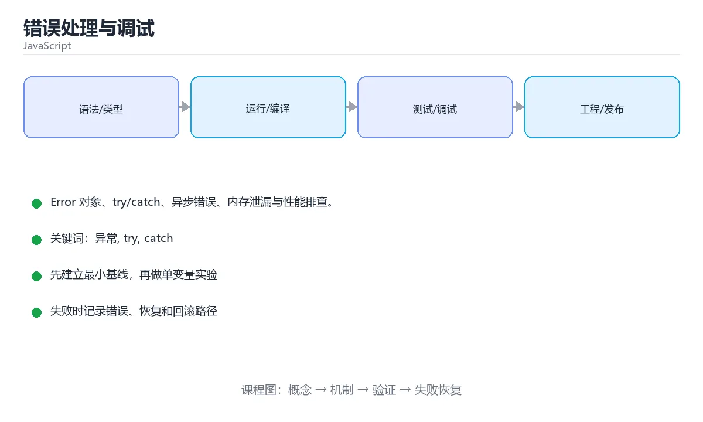

# 错误处理与调试





> 内容更新时间：2026-10-03 · 学习阶段：进阶 · 预计用时：14 分钟

## 学习目标

- 能用自己的话解释错误处理与调试解决了什么问题，而不是只背术语。
- 能说清 「异常」、「try」、「catch」、「调试」 之间的关系，并分别举出一个例子。
- 能把本课知识放回「JavaScript」的知识体系，说明它和相邻主题的边界。
- 能完成本课练习，并用验收标准检查自己的结果。

> 一句话摘要：Error 对象、try/catch、异步错误、内存泄漏与性能排查。

## 前置知识

- 先完成上一课《DOM 与事件》；如果已经掌握，可以直接用本课练习自测。
- 本课阶段：进阶。建议先掌握同一分类的基础课程，并能独立运行正文中的最小示例。
- 开始前先复习：异常、try、catch。
- 如果某一步看不懂，先记录具体卡点，完成练习后再回头读一遍。

## 错误对象

```javascript
const error = new Error('出错了');
error.name;      // 'Error'
error.message;   // '出错了'
error.stack;     // 调用栈，定位问题的关键

// 常见内置错误类型
// TypeError、ReferenceError、RangeError、SyntaxError、URIError
```

## try / catch / finally

```javascript
function parse(json) {
  try {
    return JSON.parse(json);
  } catch (error) {
    if (error instanceof SyntaxError) {
      console.warn('JSON 格式错误', error.message);
      return null;
    }
    throw error;              // 处理不了的错误继续抛出
  } finally {
    console.log('解析结束');    // 无论成功失败都执行
  }
}
```

异步错误要额外注意：`try/catch` 只能捕获 `await` 的错误，**未处理的 Promise 拒绝**需要 `.catch()` 或 `window.addEventListener('unhandledrejection', ...)`。

```javascript
window.onerror = (message, source, line) => { /* 上报 */ };
```

## 调试手段

```javascript
console.log({ user });              // 用对象打印，保留变量名
console.table(users);
console.time('loop');
// ... 代码
console.timeEnd('loop');            // 简单性能测量
debugger;                           // 断点，DevTools 打开时暂停
```

定位顺序：看控制台第一条报错 → 点开 stack 找到自己的代码 → 在可疑处打条件断点 → 缩小复现范围。

## 内存与性能

- 全局变量、未清理的定时器、未移除的监听器、闭包长期引用大对象 → 内存泄漏。
- 用 DevTools Memory 面板做堆快照对比，Performance 面板看长任务与重排。
- 大列表使用虚拟滚动；频繁 DOM 操作合并为一次（DocumentFragment）。

```javascript
const controller = new AbortController();
setTimeout(() => controller.abort(), 5000);   // 超时取消请求
clearInterval(timerId);                        // 组件卸载时清理定时器
```

## 调试工具与线上排错

| 场景 | 手段 |
| --- | --- |
| 断点调试 | DevTools Sources：行断点、条件断点、日志断点、XHR 断点 |
| 捕获全局错误 | `window.onerror` 与 `unhandledrejection` 上报到监控平台 |
| 回溯用户操作 | 埋点 + session replay（回放用户操作轨迹） |
| 定位慢代码 | Performance 面板录制、`console.time`、`performance.mark/measure` |
| 看异步调用栈 | DevTools 的 Async 栈、`console.trace()` |

**线上排错三原则**：① 上报要带 sourcemap 才能还原压缩后的堆栈（构建时生成并上传）；② 用错误聚合（按指纹分组）而不是逐条看，优先修影响用户最多的；③ 采集上下文（浏览器版本、路由、用户 ID、发布版本）便于复现。

**常见错误类型与处理**：`TypeError: Cannot read properties of undefined` 多半是数据未就绪（加可选链与默认值）；`ChunkLoadError` 通常是发版后旧页面请求旧 chunk（提示用户刷新或做版本协商）；`CORS` 报错要在服务端配置响应头而不是前端绕过。

## 本课小结
出错时先读 **stack**，再怀疑**异步未捕获**与**资源未释放**。日志带上下文，错误要么处理要么向上抛，不要静默吞掉。

## 错误类型速查

| 类型 | 典型原因 | 示例 |
| --- | --- | --- |
| `SyntaxError` | 语法错误 | 少括号、少逗号 |
| `ReferenceError` | 使用未声明的变量 | 拼写错误、作用域外访问 |
| `TypeError` | 类型不匹配或访问空值 | `undefined.foo`、调用非函数 |
| `RangeError` | 数值越界或栈溢出 | 递归过深、`new Array(-1)` |
| `URIError` | URI 编解码错误 | `decodeURIComponent("%")` |
| `AggregateError` | 多个错误聚合 | `Promise.any` 全部失败 |

调试手段速查：

| 手段 | 用法 | 适用场景 |
| --- | --- | --- |
| 断点 | 源码面板打断点 | 逐行观察变量 |
| 条件断点 | 设置表达式为真时暂停 | 循环中特定迭代 |
| `debugger` 语句 | 代码里直接写 | 快速定位入口 |
| 调用栈 | 面板查看 Call Stack | 找到真正的触发点 |
| 网络面板 | 查看请求与响应 | 接口问题 |
| `try / catch` | 捕获并记录 | 预期可能失败的代码 |
| 全局兜底 | `window.onerror`、`unhandledrejection` | 上报未捕获错误 |
| Source Map | 构建时生成并上传 | 定位压缩后的线上报错 |

```js
// 统一错误上报：捕获同步与异步未处理错误
window.addEventListener("error", (event) => {
  report(event.error ?? new Error(event.message), { type: "sync" });
});

window.addEventListener("unhandledrejection", (event) => {
  report(event.reason instanceof Error ? event.reason : new Error(String(event.reason)),
         { type: "promise" });
});

function report(error, extra) {
  // 生产环境只上报必要字段，避免泄露用户数据
  console.error(error, extra);
}
```

## 常见错误对照表

| 容易写错的做法 | 实际现象 | 原因与正确做法 |
| --- | --- | --- |
| `catch (e) { console.log("出错") }` | 丢失堆栈与原因 | 打印 `e` 本身，并上报到监控 |
| `throw "字符串"` | 没有堆栈 | 抛 `Error` 实例 |
| 自定义错误不继承 `Error` | 拿不到堆栈与 `instanceof` 判断 | `class MyError extends Error {}` |
| `catch` 后返回 `null` | 调用方继续访问字段报错 | 明确返回失败结果或重新抛出 |
| 用 `try` 包住整个函数 | 误捕获无关错误 | 只包可能失败的最小片段 |
| 异步错误用同步 `try` 包 | 捕获不到 | 需要 `await`，或 `.catch()` |
| `finally` 里 `return` | 覆盖 try 的返回值 | `finally` 只做清理 |
| 只在本地复现不了就放线上 | 用户先遇到问题 | 加 source map 与错误上报 |
| 报错日志不含上下文 | 无法定位用户与操作 | 带上请求 ID、用户标识与关键参数 |
| 生产环境打印完整对象 | 泄露敏感信息 | 只记录必要字段并脱敏 |

## 自测清单

- [ ] 能区分 `TypeError` 与 `ReferenceError` 的常见原因。
- [ ] 会用条件断点与调用栈定位偶发问题。
- [ ] 自定义错误继承 `Error` 并保留堆栈。
- [ ] 捕获异步错误时使用 `await` 或 `.catch()`。
- [ ] 生产环境接入了错误上报与 source map。

## 零基础详解：错误处理与调试方法

### 一句话说清它是什么

错误处理让程序在出错时走可预期的分支，调试则是「在不知道原因时，用工具一步步缩小范围」。
关键在于：**先看报错类型，再定位行号，最后用断点验证猜测**。

### 用生活比喻理解

| 工具 | 比喻 | 说明 |
| --- | --- | --- |
| `try/catch` | 安全网 | 出问题时不至于整个掉下去 |
| `throw` | 主动报警 | 自己发现异常时上报 |
| `Error` 对象 | 病历 | 含类型、消息与调用栈 |
| 断点 | 暂停键 | 停在关键位置检查现场 |
| `console` 家族 | 记录仪 | 不同级别留痕 |

### 错误处理的完整结构

```javascript
class ValidationError extends Error {
  constructor(message) {
    super(message);
    this.name = "ValidationError";
  }
}

function parseAge(raw) {
  const n = Number(raw);
  if (!Number.isInteger(n) || n < 0 || n > 150) {
    throw new ValidationError(`年龄不合法：${raw}`);
  }
  return n;
}

try {
  console.log(parseAge("abc"));
} catch (error) {
  if (error instanceof ValidationError) {
    console.warn("输入问题：", error.message);
  } else {
    console.error("意外错误：", error);       // 保留完整堆栈
    throw error;                              // 处理不了就继续往上抛
  }
} finally {
  console.log("处理结束");
}
```

### 异步代码的错误处理

```javascript
// Promise 方式
fetch("/api/user")
  .then((res) => {
    if (!res.ok) throw new Error(`HTTP ${res.status}`);
    return res.json();
  })
  .catch((error) => console.error("请求失败：", error.message));

// async/await 方式（推荐）
async function loadUser() {
  try {
    const res = await fetch("/api/user");
    if (!res.ok) throw new Error(`HTTP ${res.status}`);
    return await res.json();
  } catch (error) {
    console.error("请求失败：", error.message);
    return null;
  }
}
```

**注意**：`await` 之后如果不加 `try/catch`，错误会变成未处理的 Promise 拒绝。

### console 家族与调试工具

| 方法 | 用途 |
| --- | --- |
| `console.log` | 普通输出 |
| `console.warn` / `error` | 警告与错误，可在面板过滤 |
| `console.table` | 数组或对象以表格展示 |
| `console.group` / `groupEnd` | 分组折叠 |
| `console.time` / `timeEnd` | 测量耗时 |
| `console.trace` | 打印调用栈 |
| `debugger` | 代码里直接下断点 |

```javascript
const users = [{ id: 1, name: "小明" }, { id: 2, name: "小红" }];
console.table(users);

console.time("解析");
// 一些耗时操作
console.timeEnd("解析");
```

### 断点调试的标准流程

1. **复现**：先找到稳定复现的步骤。
2. **定位**：在可疑函数入口打断点，看参数对不对。
3. **二分**：范围太大时，在中间位置验证，排除一半。
4. **验证**：看调用栈与作用域变量，确认是「数据错」还是「逻辑错」。
5. **收尾**：修完补一个测试或断言，避免复发。

### 新手最容易踩的八个坑

| 坑 | 现象 | 正确做法 |
| --- | --- | --- |
| 用 `catch {}` 什么都不做 | 问题被完全掩盖 | 至少记录日志 |
| 只 `catch` 不 `throw` | 上层以为成功了 | 处理不了就继续抛 |
| 把 `console.log` 留在生产 | 泄露信息、性能损耗 | 提交前清理或用日志库 |
| 直接打印对象 | 看不到当前值 | 打印副本 `{...obj}` 或 `JSON.stringify` |
| 捕获了但丢掉了 `error` | 失去堆栈 | 打印 `error` 本身而不是 `error.message` |
| 在循环里吞异常 | 部分数据静默丢失 | 记录失败的条目与原因 |
| 依赖字符串比较错误信息 | 文案一变就失效 | 用自定义错误类与 `instanceof` |
| 忘了异步错误也需处理 | 出现未处理的拒绝 | 加 `try/catch` 或 `.catch` |

### 手把手练习：带容错的批量处理

```javascript
class DataError extends Error {
  constructor(index, reason) {
    super(`第 ${index} 条数据有问题：${reason}`);
    this.name = "DataError";
    this.index = index;
  }
}

function processAll(rows) {
  const ok = [];
  const failed = [];

  rows.forEach((row, i) => {
    try {
      const value = Number(row.value);
      if (!Number.isFinite(value)) throw new Error("不是数字");
      ok.push({ id: row.id, value });
    } catch (error) {
      failed.push(new DataError(i, error.message));
    }
  });

  return { ok, failed };
}

const result = processAll([
  { id: 1, value: "10" },
  { id: 2, value: "abc" },
  { id: 3, value: "30" },
]);

console.log(`成功 ${result.ok.length} 条，失败 ${result.failed.length} 条`);
for (const e of result.failed) console.warn(e.message);
```

### 学完自测

- [ ] 能写出自定义错误类并区分处理。
- [ ] 知道为什么不能写空的 `catch`。
- [ ] 能说出 `console.table`、`time`、`trace` 各自的用途。
- [ ] 知道断点调试的五步流程。
- [ ] 能说出异步代码里错误容易被漏掉的原因。

## 动手练习

> 本课练习重点：围绕「异常、try、catch」完成复述、实验和交付，每个结果都要能被别人检查。

先在 Node 或浏览器复现行为，再改写异步与错误路径，最后补测试。

### 练习 1：建立心智模型（10 分钟）

合上教程，用 3～5 句话回答：

1. 错误处理与调试解决了什么问题？
2. 如果没有它，会出现什么具体后果？
3. 它和「try」是什么关系？

**验收标准**：至少出现一个本课关键词，并写出一个反例、边界条件或失效场景。

### 练习 2：做一次可控实验（20 分钟）

从正文中选一个最小示例，完成以下操作：

1. 先预测修改一个参数、输入或步骤后的结果。
2. 再实际执行或逐步推演，记录真实结果。
3. 如果结果与预测不同，写出差异原因。

**验收标准**：留下「原例 → 改动 → 预测 → 结果 → 原因」五步记录。

### 练习 3：交付一个小结果（30 分钟）

在浏览器控制台或 Node.js 中写一个最小示例，列出至少 3 组输入输出。

任务要求：

- 结果必须能被别人检查，不能只写“我已经理解了”。
- 至少覆盖「异常」和「try」两个关键词。
- 写出 1 个仍然不确定的问题，以及下一步如何验证。

> 提示：时间有限时优先做练习 1 和练习 2；练习 3 可以拆成两次完成。

## 可运行练习

### 任务 1：先跑通，再解释

```javascript
function parse(json) {
  try {
    return JSON.parse(json);
  } catch (error) {
    if (error instanceof SyntaxError) {
      console.warn('JSON 格式错误', error.message);
      return null;
    }
    throw error;              // 处理不了的错误继续抛出
  } finally {
    console.log('解析结束');    // 无论成功失败都执行
  }
}
```

**预期输出**：解析结束

### 任务 2：只改一个条件

### 任务 3：迁移到自己的数据

用同一套思路处理一组你自己的数据或场景，保持输出格式与任务 1 一致。

## 故障现场

### 现场 1：本课的 异常 常规用例通过，但边界用例失败

**症状**：在本课的练习或生产场景里出现“本课的 异常 常规用例通过，但边界用例失败”。

**复现**：准备一组最小输入，只保留触发“本课的 异常 常规用例通过，但边界用例失败”的必要条件，连续运行两次确认结果稳定。

**定位**：围绕“异常 的前置条件与取值边界没有写进代码，默认值掩盖了空值和极值”检查调用链、输入数据和环境配置，先验证假设再改代码。

**预防**：把“本课的 异常 常规用例通过，但边界用例失败”写成一条自动化用例，并在本课的验收清单里保留对应检查项。

### 现场 2：本课的 try 结果在两次运行之间不一致

**症状**：在本课的练习或生产场景里出现“本课的 try 结果在两次运行之间不一致”。

**复现**：准备一组最小输入，只保留触发“本课的 try 结果在两次运行之间不一致”的必要条件，连续运行两次确认结果稳定。

**定位**：围绕“try 依赖了当前版本、执行顺序或共享状态，单次运行无法暴露差异”检查调用链、输入数据和环境配置，先验证假设再改代码。

**预防**：把“本课的 try 结果在两次运行之间不一致”写成一条自动化用例，并在本课的验收清单里保留对应检查项。

### 现场 3：本课的验证只在开发机通过

**症状**：在本课的练习或生产场景里出现“本课的验证只在开发机通过”。

**定位**：围绕“环境版本、配置和输入规模与目标环境不同，异常 缺少可重复的验证记录”检查调用链、输入数据和环境配置，先验证假设再改代码。

## 版本与时效

- 运行时要同时考虑浏览器基线、Node LTS 与打包工具的降级策略
- 升级前用特性检测和构建目标矩阵验证，不要只在本机浏览器测试

### 升级检查清单

- 先固定当前版本，跑通全部示例与测验，再升级工具链。
- 只改一个版本变量，记录编译、测试、性能与产物体积的变化。
- 重点回归默认值、弃用警告、序列化格式、并发语义和错误信息。
- 升级完成后更新本课的“最后复核 / 下次复核”日期与版本说明。

## 本课复习清单

离开本课前，逐项确认：

- [ ] 不看解析，能说出「finally 代码块什么时候执行？」的判断依据。
- [ ] 不看解析，能说出「定位报错位置最关键的信息是？」的判断依据。
- [ ] 不看解析，能说出「未被捕获的 Promise 拒绝会导致？」的判断依据。
- [ ] 不看解析，能说出「让自定义错误继承 Error 的好处是？」的判断依据。
- [ ] 不看解析，能说出「source map（.map 文件）的作用是？」的判断依据。
- [ ] 不看解析，能说出「把错误处理与调试中「零基础详解：错误处理与调试方法」的步骤调整为正确顺序。」的判断依据。
- [ ] 至少运行一次本课示例，记录输入、输出和一个边界情况。
- [ ] 把本课最容易混淆的两个概念写成一句话对照。

| 复盘项 | 记录 |
| --- | --- |
| 已经能独立解释的考点 |  |
| 仍然说不清的概念 |  |
| 下一步验证动作 |  |

## 术语速查

把「错误处理与调试」里反复出现的术语集中放在一起。复习时先遮住右列，尝试用自己的话解释，再回到正文核对。

| 术语 | 本课语境 |
| --- | --- |
| `[异常, try, catch, 调试, 内存泄漏, 性能][index]` | 在「错误处理与调试」里理解它的定义、输入和输出。 |
| `[异常, try, catch, 调试, 内存泄漏, 性能][index]` | 本课用它说明边界条件与失败路径。 |
| `[异常, try, catch, 调试, 内存泄漏, 性能][index]` | 结合「错误处理与调试」的正文示例确认它的适用条件。 |
| `[异常, try, catch, 调试, 内存泄漏, 性能][index]` | 在「错误处理与调试」里理解它的定义、输入和输出。 |
| `[异常, try, catch, 调试, 内存泄漏, 性能][index]` | 本课用它说明边界条件与失败路径。 |
| `[异常, try, catch, 调试, 内存泄漏, 性能][index]` | 结合「错误处理与调试」的正文示例确认它的适用条件。 |

## 考点精讲

### 考点 1：围绕“错误处理与调试”中的 异常、try、catch，下列哪两项是本课强调的实践判断？

- **判断依据**：本课把错误处理与调试拆成概念、示例与故障现场三部分，因此判断 异常 时必须同时交代输入、输出和失败路径，这使“学习 异常 时要同时说明输入、输出和失败路径，不能只看正常流程”成立。在错误处理与调试里，判断 try 时要固定版本与边界输入，所以“验证 try 时要固定版本并覆盖边界输入，结论才可复现”才可复现。

### 考点 2：定位报错位置最关键的信息是？

- **判断依据**：在「错误处理与调试」里，error.stack。stack 给出调用链与行号，message 只说明错误内容。这道题的关键在「错误处理与调试」的异常、try、catch：先确认题干“定位报错位置最关键的信息是”问的是哪一步，再排除偷换前提的选项。这道题的关键在「错误处理与调试」的异常、try、catch：先确认题干“定位报错位置最关键的信息是”问的是哪一步，再排除偷换前提的选项。

### 考点 3：未被捕获的 Promise 拒绝会导致？

- **判断依据**：在「错误处理与调试」里，变成 unhandledrejection，可能静默失败。必须用 catch 处理，或监听 unhandledrejection 统一上报。“未被捕获的”与「错误处理与调试」的术语表相呼应，只有符合异常、try、catch约束的“变成 unhandledrejectio”才是正文支持的结论。

### 考点 4：让自定义错误继承 Error 的好处是？

- **判断依据**：结论应落在「保留堆栈信息」。自定义错误便于在 catch 中按业务类型分支处理，而不是靠判断 message 字符串。这道题要求区分概念与边界，「保留堆栈信息」只有在题干给出的前提下才成立，而「让错误不再抛出」、「自动重试」缺少同一组条件。「错误处理与调试」要求先交代异常、try、catch的前提再下结论，所以“保留堆栈信息”只在题干“让自定义错误继承 Error 的好处是”给定的条件下成立。

### 考点 5：下面这段 JavaScript 代码摘自「错误处理与调试」的正文示例。关于这段代码，下面哪一项说法与实际内容相符？

- **判断依据**：在「错误处理与调试」里，这段代码包含异常处理分支，失败时会走专门的补救路径。这段代码出自「错误处理与调试」的正文示例，围绕异常、try、catch展开；把输入或边界换成空值、极值或失败情况后，结论要以「错误处理与调试」的实际运行结果为准。回到「错误处理与调试」的正文示例，用“下面这段 JavaScript 代码”走一遍异常、try、catch的完整流程，能复现的结论才可以保留。

### 考点 6：把「错误处理与调试」中「零基础详解：错误处理与调试方法」的步骤调整为正确顺序。

- **判断依据**：在「错误处理与调试」里，正确的执行顺序是「复现：先找到稳定复现的步骤 → 定位：在可疑函数入口打断点，看参数对不对 → 二分：范围太大时，在中间位置验证，排除一半 → 验证：看调用栈与作用域变量，确认是「数据错」还是「逻辑错」」。回到「错误处理与调试」的正文示例，用“把错误处理与调试中零基础详解”走一遍异常、try、catch的完整流程，能复现的结论才可以保留。

## English Overview

**Title:** Errors & Debugging

**Summary:** Error objects, try/catch, async errors and memory leaks.

**Category:** JavaScript
**Level:** 进阶
**Key terms:** 异常, try, catch, 调试, 内存泄漏, 性能

## 内容元数据

- 内容版本：v2.0
- 最后更新：2026-10-03
- 学习阶段：进阶
- 适用环境：Node.js 22+ / 现代浏览器
- 内容来源：内置结构化课程与工程实践整理
- 相关主题：异常、try、catch、调试、内存泄漏、性能
- 质量版本：P0 测验标准 + P1 覆盖扩展 + P2 体验补全

## 参考资料与复核

- 最后复核：2026-10-04
- 下次复核：2027-04-04
- 复核范围：版本兼容、API 行为、安全建议与工程实践
- 来源性质：官方文档、标准或权威教材；正文为离线教学重组

| 参考资料 | 本课用途 |
| --- | --- |
| [MDN Promise](https://developer.mozilla.org/docs/Web/JavaScript/Reference/Global_Objects/Promise) | Promise 与异步链 |
| [Node 事件循环](https://nodejs.org/en/learn/asynchronous-work/event-loop-timers-and-nexttick) | 事件循环与异步顺序 |
| [MDN 模块](https://developer.mozilla.org/docs/Web/JavaScript/Guide/Modules) | ES Module 与依赖组织 |

> 「错误处理与调试」的链接用于离线阅读后的延伸核对；App 不会自动联网。
