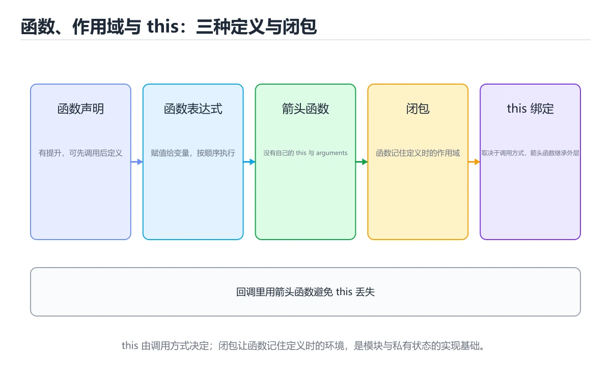
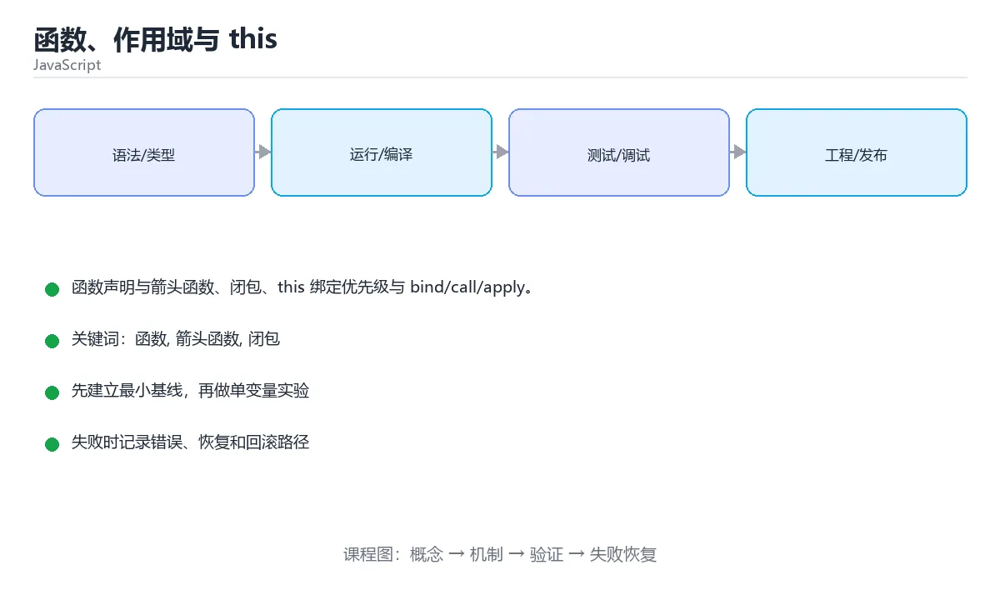

# 函数、作用域与 this

> 内容更新时间：2026-10-06 · 学习阶段：进阶 · 预计用时：55 分钟





## 本节知识框架

**课程定位**：所属分类 `javascript`（JavaScript），课程主题 `函数、作用域与 this`，学习阶段 进阶，建议用时 50 分钟。

本课主线：函数声明与箭头函数、闭包、this 绑定优先级与 bind/call/apply。

**学完本课应当能够**
- 说清 `this` 与 `new` 的含义与区别，并各举一个正例和一个反例。
- 用本课示例验证 `函数` 的行为，记录输入、输出与失败条件。
- 遇到「忘写 `return`」这类问题时，能说出触发条件与修复顺序。

### 从概念到验证的学习链条

1. `this`：先掌握 箭头函数没有自己的 `this` 和 `arguments`，不能当构造器，适合回调，再用它解释 `new` 为什么会出现。
2. `new`：先掌握 优先级：`new` > `bind` > `call/apply` > 对象方法 > 默认绑定；箭头函数不参与，取定义时外层的 `this`，再用它解释 `函数` 为什么会出现。
3. `函数`：先掌握 接收输入、执行确定逻辑并返回结果的代码单元，再用它解释 `闭包` 为什么会出现。
4. `闭包`：先掌握 函数与其定义时词法环境的组合，使函数离开原作用域后仍能访问捕获的变量，再用它解释 `作用域` 为什么会出现。
5. `作用域`：先掌握 程序中名字可见和可访问的范围，由词法结构或运行时上下文决定，再用它解释 本课示例的观察结果 为什么会出现。

**先修与衔接**：本课是「JavaScript」分类的第 9 课。先修内容：《运算符与控制流》。《运算符与控制流》里的 `break`、`循环` 是本课的前提。相关或后续课程：《对象、原型与类》、《函数》、《C 控制流、函数与作用域》、《Swift 函数、闭包与协议》。

### 完成判据

- **定义关**：不看正文也能说明 `this` 是 箭头函数没有自己的 `this` 和 `arguments`，不能当构造器，适合回调，并指出一个反例。
- **机制关**：能按“输入 → 转换 → 输出 → 验证”复述 `函数、作用域与 this`，而不是只背结论。
- **示例关**：能运行或推演 `函数、作用域与 this` 的 `javascript` 示例，并说明一个真实出现的标识符或字面量。
- **证据关**：能指出 `函数、作用域与 this` 示例里的 调用了 `add()`，并说明它支持或反驳了本课的哪一条结论。
- **排错关**：能复现 忘写 `return`，记录现象并按 检查所有分支 修复。
- **迁移关**：能把 `函数`、`箭头函数`、`闭包`、`this` 放进一个与 `函数、作用域与 this` 不同的项目场景，并保持输入与验证条件可追踪。
- **复盘关**：学完 `函数、作用域与 this` 后，用一句话写下仍然不确定的结论，并列出下一次验证需要的输入、环境和成功判据。

### 复习清单

- [ ] 能不看正文复述本课核心术语，并指出一个边界或反例。
- [ ] 能运行或推演本课示例，记录输入、输出与失败现象。
- [ ] 能完成一次自测，并把错题对照错误表定位原因。

## 核心概念定义

| 术语 | 操作性定义 | 常见边界与风险 |
| --- | --- | --- |
| this | 箭头函数没有自己的 this 和 arguments，不能当构造器，适合回调。 | 易错：`this` 指错；正确做法是用方法简写。 |
| new | 优先级：new > bind > call/apply > 对象方法 > 默认绑定；箭头函数不参与，取定义时外层的 this。 | 只在「优先级：new > bind > call/apply > 对象方法 > 默认绑定；箭头函数不参与，取定义时外层的 this」这一前提下成立，换输入或换环境要重新验证。 |
| 函数 | 接收输入、执行确定逻辑并返回结果的代码单元。 | 易错：`this` 指错；正确做法是用方法简写。 |
| 闭包 | 函数与其定义时词法环境的组合，使函数离开原作用域后仍能访问捕获的变量。 | 易错：所有闭包共享同一个变量；正确做法是改用 `let` 或把值作为参数传入。 |
| 作用域 | 程序中名字可见和可访问的范围，由词法结构或运行时上下文决定 | 易错：内存占用高；正确做法是用完置空引用或重构作用域。 |

## 原理与运行机制

### 机制总览

**教材衔接：版本与时效**

- 运行时要同时考虑浏览器基线与 Node LTS；函数 的降级策略要写清楚。
- 升级前确认 函数 的兼容范围，把不可回退的改动单独拆成一次提交。

### 升级检查清单

- 先固定当前版本，跑通全部示例与测验，再升级工具链。
- 只改 函数 的版本变量，记录编译、测试与产物体积的变化。
- 回归范围锁定 startWithArrow 的默认行为，并确认弃用警告是否出现在构建输出里。
- 升级完成后记录 函数 的新旧版本差异，并据此调整下次复核时间。

**失败路径（来自本课错误表）**
- 忘写 `return` → 得到 undefined → 检查所有分支。
- 箭头函数当方法 → `this` 指错 → 用方法简写。
- 循环里创建函数用 `var` → 全部拿到最后一个值 → 用 `let`。
- 忘写 `await` → 拿到 Promise 对象 → 在 `async` 函数里 await。
### 机制拆解：每一步的输入、动作与输出

#### 1. `this`
- 输入：`函数`；本步把 箭头函数没有自己的 `this` 和 `arguments`，不能当构造器，适合回调 当作判断规则。
- 动作：围绕 `this` 保留中间状态，并记录它与 `new` 的对应关系。
- 输出：`new`，它可以被下一段代码、测试或记录继续使用。
- `this` 的失败条件：当箭头函数当方法时，会出现`this` 指错。

#### 2. `new`
- 输入：`this`；本步把 优先级：`new` > `bind` > `call/apply` > 对象方法 > 默认绑定；箭头函数不参与，取定义时外层的 `this` 当作判断规则。
- 动作：围绕 `new` 保留中间状态，并记录它与 `函数` 的对应关系。
- 输出：`函数`，它可以被下一段代码、测试或记录继续使用。
- `new` 的失败条件：只在「优先级：`new` > `bind` > `call/apply` > 对象方法 > 默认绑定；箭头函数不参与，取定义时外层的 `this`」这一前提下成立，换输入或换环境要重新验证。

#### 3. `函数`
- 输入：`new`；本步把 接收输入、执行确定逻辑并返回结果的代码单元 当作判断规则。
- 动作：围绕 `函数` 保留中间状态，并记录它与 `闭包` 的对应关系。
- 输出：`闭包`，它可以被下一段代码、测试或记录继续使用。
- `函数` 的失败条件：当箭头函数当方法时，会出现`this` 指错。

#### 4. `闭包`
- 输入：`函数`；本步把 函数与其定义时词法环境的组合，使函数离开原作用域后仍能访问捕获的变量 当作判断规则。
- 动作：围绕 `闭包` 保留中间状态，并记录它与 `作用域` 的对应关系。
- 输出：`作用域`，它可以被下一段代码、测试或记录继续使用。
- `闭包` 的失败条件：当在循环里用 `var` 创建闭包时，会出现所有闭包共享同一个变量。

#### 5. `作用域`
- 输入：`闭包`；本步把 程序中名字可见和可访问的范围，由词法结构或运行时上下文决定 当作判断规则。
- 动作：围绕 `作用域` 保留中间状态，并记录它与 `add` 的对应关系。
- 输出：`add`，它可以被下一段代码、测试或记录继续使用。
- `作用域` 的失败条件：当闭包长期持有大对象时，会出现内存占用高。

### 示例中的可观察事实

1. 调用了 `add()`；它对应的课程主题是 `函数、作用域与 this`。
2. 调用了 `greet()`；它对应的课程主题是 `函数、作用域与 this`。
3. 调用了 `log()`；它对应的课程主题是 `函数、作用域与 this`。
4. 调用了 `sum()`；它对应的课程主题是 `函数、作用域与 this`。
5. 出现字面量 `陌生人`；它对应的课程主题是 `函数、作用域与 this`。

### 复现实验记录

- 环境：`函数、作用域与 this` 使用 `javascript` 示例，固定 `函数`、`箭头函数`、`闭包`、`this` 作为第一组条件。
- 首轮输入：先确认 调用了 `add()`，预测 `this` 会怎样变化。
- 基线观察：记录命令、输入、输出和错误原文，不用截图代替可复制的文本。
- 单变量修改：只改变 `函数`，观察 `作用域` 是否仍满足定义。
- 失败注入：复现 忘写 `return`，确认现象是 得到 undefined。
- 记录结论：把“修改前、修改后、预期变化、实际变化”写成四列表，这样复盘 `函数、作用域与 this` 时才能区分概念错误与实现错误。

## 典型应用场景

- **忘写 `return`**：典型现象是得到 undefined；正确做法是检查所有分支。
- **箭头函数当方法**：典型现象是`this` 指错；正确做法是用方法简写。
- **循环里创建函数用 `var`**：典型现象是全部拿到最后一个值；正确做法是用 `let`。
- **忘写 `await`**：典型现象是拿到 Promise 对象；正确做法是在 `async` 函数里 await。

### 最小验证场景

- 准备：保留 `javascript` 示例的原始输入，先记录 `函数、作用域与 this` 的基线输出和完整运行命令。
- 观察：先核对 调用了 `add()`，再改变一个与 `this` 相关的条件。
- 判定：新结果与 `函数、作用域与 this` 的基线不同不等于错误；只有当差异破坏了 `this` 的定义或错误表中的约束，才判定为失败。

### 选择与边界

- 使用 `this` 时，先满足它的定义：箭头函数没有自己的 `this` 和 `arguments`，不能当构造器，适合回调；易错：`this` 指错；正确做法是用方法简写。
- 使用 `new` 时，先满足它的定义：优先级：`new` > `bind` > `call/apply` > 对象方法 > 默认绑定；箭头函数不参与，取定义时外层的 `this`；只在「优先级：`new` > `bind` > `call/apply` > 对象方法 > 默认绑定；箭头函数不参与，取定义时外层的 `this`」这一前提下成立，换输入或换环境要重新验证。
- 使用 `函数` 时，先满足它的定义：接收输入、执行确定逻辑并返回结果的代码单元；易错：`this` 指错；正确做法是用方法简写。
- 使用 `闭包` 时，先满足它的定义：函数与其定义时词法环境的组合，使函数离开原作用域后仍能访问捕获的变量；易错：所有闭包共享同一个变量；正确做法是改用 `let` 或把值作为参数传入。
- 使用 `作用域` 时，先满足它的定义：程序中名字可见和可访问的范围，由词法结构或运行时上下文决定；易错：内存占用高；正确做法是用完置空引用或重构作用域。

## 代码/协议/SQL 示例

### 最小可验证示例

```javascript
function add(a, b) { return a + b; }        // 声明（有提升）
const mul = function (a, b) { return a * b; };  // 表达式
const div = (a, b) => a / b;                // 箭头函数
const obj = () => ({ value: 1 });           // 返回对象要加括号
```

**教材衔接：参数**

```javascript
function greet(name = '陌生人', ...others) {
  console.log(name, others);
}

function sum({ a, b }, [c, d]) { return a + b + c + d; }   // 参数解构
```

**教材衔接：作用域与闭包**

```javascript
function createCounter() {
  let count = 0;              // 外部无法直接访问
  return {
    increment: () => ++count,
    value: () => count,
  };
}

const counter = createCounter();
counter.increment();
console.log(counter.value());  // 1
```

闭包 = 函数 + 定义时捕获的词法环境。常用于私有状态、防抖节流和柯里化。

**教材衔接：this 的绑定**

```javascript
const user = {
  name: 'tom',
  say() { return this.name; },
};

user.say();                              // 'tom'：由调用方式决定
const fn = user.say.bind(user);          // bind 永久绑定
user.say.call({ name: 'alice' });         // 临时绑定
```

优先级：`new` > `bind` > `call/apply` > 对象方法 > 默认绑定；箭头函数不参与，取定义时外层的 `this`。

**教材衔接：this 绑定速查**

| 调用方式 | `this` 指向 | 示例 |
| --- | --- | --- |
| 普通函数直接调用 | 严格模式下是 `undefined`，否则是全局对象 | `f()` |
| 方法调用 | 调用它的对象 | `obj.f()` |
| 显式绑定 | 传入的对象 | `f.call(obj)`、`f.apply(obj)` |
| 硬绑定 | 永久绑定的对象 | `f.bind(obj)` |
| `new` 调用 | 新创建的实例 | `new F()` |
| 箭头函数 | 定义时外层作用域的 `this` | 不能被 `call` / `bind` 改变 |
| 回调传方法引用后 | 丢失原对象 | `setTimeout(obj.f, 0)` 里的 `this` 不是 `obj` |

```js
const counter = {
  count: 0,
  // 方法简写：this 指向调用者
  increment() {
    this.count += 1;
    return this;
  },
  // 箭头函数继承外层 this，这里的外层是模块作用域，不适合当方法
  // reset: () => { this.count = 0; },
};

// 回调中保持 this 的三种写法
class Timer {
  constructor() { this.seconds = 0; }

  startWithBind() { setInterval(this.tick.bind(this), 1000); }
  startWithArrow() { setInterval(() => this.tick(), 1000); }
  tick() { this.seconds += 1; }
}
```

**教材衔接：作用域与闭包速查**

| 概念 | 说明 |
| --- | --- |
| 函数作用域 | `var` 声明提升到函数顶部 |
| 块级作用域 | `let` / `const` 只在 `{}` 内有效 |
| 暂时性死区 | `let` 声明前访问会 `ReferenceError` |
| 闭包 | 内层函数持有外层变量，外层返回后仍可访问 |
| 提升 | 函数声明整体提升，`var` 只提升声明 |
| 模块作用域 | 模块内变量默认不泄漏到全局 |

```js
// 闭包：计数器工厂
function createCounter() {
  let count = 0;
  return {
    inc: () => ++count,
    value: () => count,
  };
}

// 循环中捕获变量：let 每次迭代都创建新绑定
const fns = [];
for (let i = 0; i < 3; i++) fns.push(() => i);
console.log(fns.map((f) => f()));   // [0, 1, 2]
```

**教材衔接：零基础详解：函数、作用域与闭包**

### 一句话说清它是什么

函数是「可以反复使用的代码块」。在 JavaScript 里函数是**一等公民**：
能赋给变量、当参数传、当返回值——这也是回调、Promise、React 的根基。

### 四种写法对照

```javascript
function add(a, b) { return a + b; }        // 函数声明，会被提升
const sub = function (a, b) { return a - b; };   // 函数表达式
const mul = (a, b) => a * b;                // 箭头函数（表达式体）

const obj = {
  value: 1,
  getValue() { return this.value; },        // 方法简写
};
```

| 写法 | `this` 绑定 | 能否当构造函数 | 提升 |
| --- | --- | --- | --- |
| 函数声明 | 调用时决定 | 能 | 是 |
| 函数表达式 | 调用时决定 | 能 | 否 |
| 箭头函数 | **继承外层** | 不能 | 否 |
| 方法简写 | 指向调用对象 | 不能 | —— |

### 箭头函数为什么不适合做对象方法

```javascript
const counter = {
  count: 0,
  bad() {
    setTimeout(() => this.count++, 10);   // 箭头函数继承外层 this：正确
  },
  wrong: () => {
    // 这里的 this 不是 counter，而是定义时的外层
  },
};
```

记忆：**箭头函数没有自己的 `this`，它借用外层的。** 该用它写回调，不该用它写对象方法。

### 参数的三件套

```javascript
function greet(name = "朋友", ...tags) {   // 默认值 + 剩余参数
  return `你好，${name}${tags.length ? "（" + tags.join("/") + "）" : ""}`;
}

greet();                     // 你好，朋友
greet("小明", "VIP", "新用户");   // 你好，小明（VIP/新用户）

// 解构参数：调用时传对象，顺序无关
function createUser({ name, age = 18 } = {}) {
  return { name, age };
}
createUser({ name: "小红" });   // { name: '小红', age: 18 }
```

### 作用域与闭包

```javascript
function makeCounter() {
  let count = 0;              // 外部访问不到
  return function () {
    count += 1;               // 但内部函数一直记得它
    return count;
  };
}

const next = makeCounter();
next();   // 1
next();   // 2
```

**闭包 = 函数 + 它出生时能看到的变量。** 哪怕外层函数已经执行完，
这些变量依然被保留。常见用途：计数器、缓存、防抖节流。

### 同步、回调与 Promise

```javascript
// 回调：容易嵌套过深
readFile("a.txt", (err, data) => {
  if (err) return console.error(err);
  console.log(data);
});

// Promise + async/await：像写同步代码一样
async function load() {
  try {
    const data = await readFileAsync("a.txt");
    console.log(data);
  } catch (error) {
    console.error("读取失败：", error);
  }
}
```

### 新手最容易踩的七个坑

| 坑 | 现象 | 正确做法 |
| --- | --- | --- |
| 忘写 `return` | 得到 undefined | 检查所有分支 |
| 箭头函数当方法 | `this` 指错 | 用方法简写 |
| 循环里创建函数用 `var` | 全部拿到最后一个值 | 用 `let` |
| 忘写 `await` | 拿到 Promise 对象 | 在 `async` 函数里 await |
| 参数顺序记错 | 传错值还查不出来 | 超过两个参数改用对象解构 |
| 以为对象赋值是复制 | 改副本影响原对象 | 展开拷贝 `{...obj}` |
| 递归无出口 | `RangeError: Maximum call stack size exceeded` | 先写终止条件 |

### 手把手练习：防抖函数

```javascript
function debounce(fn, delay = 300) {
  let timer = null;              // 闭包保存计时器
  return function (...args) {
    clearTimeout(timer);
    timer = setTimeout(() => fn.apply(this, args), delay);
  };
}

const search = debounce((keyword) => {
  console.log("搜索：", keyword);
}, 500);

search("a");
search("ab");
search("abc");   // 只有最后一次会被执行
```

### 学完自测

- [ ] 能说出箭头函数与普通函数在 `this` 上的区别。
- [ ] 能解释闭包为什么能「记住」外层变量。
- [ ] 能写出带默认值和剩余参数的函数。
- [ ] 能说出 `await` 用在非 `async` 函数里会发生什么。
- [ ] 能自己写出一个防抖或节流函数。

**运行方式**：运行 `函数、作用域与 this` 的示例时，保存为 `.js` 后用 `node 文件名.js` 运行；涉及浏览器 API 的示例要放到页面里执行。

### 示例精读：先找证据，再改一个条件

1. 调用了 `add()`；它出现在 `函数、作用域与 this` 的示例中，阅读时先确认它前后各发生了什么。
2. 调用了 `greet()`；它出现在 `函数、作用域与 this` 的示例中，阅读时先确认它前后各发生了什么。
3. 调用了 `log()`；它出现在 `函数、作用域与 this` 的示例中，阅读时先确认它前后各发生了什么。
4. 调用了 `sum()`；它出现在 `函数、作用域与 this` 的示例中，阅读时先确认它前后各发生了什么。
5. 出现字面量 `陌生人`；它出现在 `函数、作用域与 this` 的示例中，阅读时先确认它前后各发生了什么。
- 在 `函数、作用域与 this` 中与 `this` 对照：示例必须能支持 箭头函数没有自己的 `this` 和 `arguments`，不能当构造器，适合回调，否则说明这一段还缺少实现或验证步骤。
- 在 `函数、作用域与 this` 中与 `new` 对照：示例必须能支持 优先级：`new` > `bind` > `call/apply` > 对象方法 > 默认绑定；箭头函数不参与，取定义时外层的 `this`，否则说明这一段还缺少实现或验证步骤。
- 在 `函数、作用域与 this` 中与 `函数` 对照：示例必须能支持 接收输入、执行确定逻辑并返回结果的代码单元，否则说明这一段还缺少实现或验证步骤。
- 在 `函数、作用域与 this` 中与 `闭包` 对照：示例必须能支持 函数与其定义时词法环境的组合，使函数离开原作用域后仍能访问捕获的变量，否则说明这一段还缺少实现或验证步骤。

## 时间/空间复杂度或性能分析

**性能关注点（函数、作用域与 this）**：事件循环与 DOM 操作是瓶颈来源：记录脚本执行时间、长任务与主线程阻塞时长。

**测量方法**：以 `函数、作用域与 this` 的 `函数` 场景为对象，固定输入跑一遍记录基线，再把规模或并发度提高一个数量级复测；两次结果的差值与波动范围才是结论依据。

### 需要控制的变量与记录项

- `函数、作用域与 this` 的 `函数`：固定它的版本、输入范围和资源上限，分别记录速度、内存与失败率的变化。
- `函数、作用域与 this` 的 `箭头函数`：固定它的版本、输入范围和资源上限，分别记录速度、内存与失败率的变化。
- `函数、作用域与 this` 的 `闭包`：固定它的版本、输入范围和资源上限，分别记录速度、内存与失败率的变化。
- `函数、作用域与 this` 的 `this`：固定它的版本、输入范围和资源上限，分别记录速度、内存与失败率的变化。
- `函数、作用域与 this` 的 `bind`：固定它的版本、输入范围和资源上限，分别记录速度、内存与失败率的变化。
- `函数、作用域与 this` 中 `this` 的边界：易错：`this` 指错；正确做法是用方法简写。达到边界时不要外推，必须重新测量。
- `函数、作用域与 this` 中 `new` 的边界：只在「优先级：`new` > `bind` > `call/apply` > 对象方法 > 默认绑定；箭头函数不参与，取定义时外层的 `this`」这一前提下成立，换输入或换环境要重新验证。达到边界时不要外推，必须重新测量。
- `函数、作用域与 this` 中 `函数` 的边界：易错：`this` 指错；正确做法是用方法简写。达到边界时不要外推，必须重新测量。
- `函数、作用域与 this` 中 `闭包` 的边界：易错：所有闭包共享同一个变量；正确做法是改用 `let` 或把值作为参数传入。达到边界时不要外推，必须重新测量。
- `函数、作用域与 this` 中 `作用域` 的边界：易错：内存占用高；正确做法是用完置空引用或重构作用域。达到边界时不要外推，必须重新测量。
- `函数、作用域与 this` 的代码证据：先验证 调用了 `add()`，再记录该路径的输入规模与耗时；只看代码行数不能推出复杂度。

## 常见误区与易错点

| 容易写错的做法 | 实际现象 | 原因与正确做法 |
| --- | --- | --- |
| 忘写 `return` | 得到 undefined | 检查所有分支 |
| 箭头函数当方法 | `this` 指错 | 用方法简写 |
| 循环里创建函数用 `var` | 全部拿到最后一个值 | 用 `let` |
| 忘写 `await` | 拿到 Promise 对象 | 在 `async` 函数里 await |
| 参数顺序记错 | 传错值还查不出来 | 超过两个参数改用对象解构 |
| 以为对象赋值是复制 | 改副本影响原对象 | 展开拷贝 `{...obj}` |
| 递归无出口 | `RangeError: Maximum call stack size exceeded` | 先写终止条件 |
| 把对象方法当回调传递 | `this` 丢失，报 `undefined` | 用箭头函数包一层或 `bind` |
| 给箭头函数用 `call` / `bind` | 不生效 | 箭头函数的 `this` 由定义位置决定 |
| 用普通函数写对象方法却用 `this` | 取决于调用方式 | 用方法简写并确保以 `obj.f()` 调用 |
| 在循环里用 `var` 创建闭包 | 所有闭包共享同一个变量 | 改用 `let` 或把值作为参数传入 |
| 默认参数用了前面的参数但顺序写反 | 得到 `undefined` | 默认参数按从左到右求值，只能引用更靠前的参数 |
| 参数超过 3 个仍按位置传 | 调用处难以理解 | 改用对象参数并解构 |
| 忘记 `return` | 得到 `undefined` | 检查每个分支都有返回值 |
| 箭头函数返回对象漏括号 | `SyntaxError` 或返回 `undefined` | 写成 `() => ({ a: 1 })` |
| 递归函数没有终止条件 | 栈溢出 | 先写基准情形 |
| 闭包长期持有大对象 | 内存占用高 | 用完置空引用或重构作用域 |
| 用普通函数写对象方法却用 this | 取决于调用方式。 | 用方法简写并确保以 obj.f() 调用。 |
| 在循环里用 var 创建闭包 | 所有闭包共享同一个变量。 | 改用 let 或把值作为参数传入。 |

### 现场 1：忘写 `return`

**症状**：得到 undefined。

**根因与修复**：检查所有分支。

**自检**：在本课示例里复现「忘写 `return`」，改成检查所有分支后重跑；如果症状消失且失败路径按预期变化，说明定位正确。

### 现场 2：箭头函数当方法

**症状**：`this` 指错。

**根因与修复**：用方法简写。

**自检**：在本课示例里复现「箭头函数当方法」，改成用方法简写后重跑；如果症状消失且失败路径按预期变化，说明定位正确。

### 现场 3：循环里创建函数用 `var`

**症状**：全部拿到最后一个值。

**根因与修复**：用 `let`。

**自检**：在本课示例里复现「循环里创建函数用 `var`」，改成用 `let`后重跑；如果症状消失且失败路径按预期变化，说明定位正确。

### 现场 4：忘写 `await`

**症状**：拿到 Promise 对象。

**根因与修复**：在 `async` 函数里 await。

**自检**：在本课示例里复现「忘写 `await`」，改成在 `async` 函数里 await后重跑；如果症状消失且失败路径按预期变化，说明定位正确。

### 现场 5：参数顺序记错

**症状**：传错值还查不出来。

**根因与修复**：超过两个参数改用对象解构。

**自检**：在本课示例里复现「参数顺序记错」，改成超过两个参数改用对象解构后重跑；如果症状消失且失败路径按预期变化，说明定位正确。

### 现场 6：以为对象赋值是复制

**症状**：改副本影响原对象。

**根因与修复**：展开拷贝 `{...obj}`。

**自检**：在本课示例里复现「以为对象赋值是复制」，改成展开拷贝 `{...obj}`后重跑；如果症状消失且失败路径按预期变化，说明定位正确。

### 现场 7：递归无出口

**症状**：`RangeError: Maximum call stack size exceeded`。

**根因与修复**：先写终止条件。

**自检**：在本课示例里复现「递归无出口」，改成先写终止条件后重跑；如果症状消失且失败路径按预期变化，说明定位正确。

### 现场 8：把对象方法当回调传递

**症状**：`this` 丢失，报 `undefined`。

**根因与修复**：用箭头函数包一层或 `bind`。

**自检**：在本课示例里复现「把对象方法当回调传递」，改成用箭头函数包一层或 `bind`后重跑；如果症状消失且失败路径按预期变化，说明定位正确。

### 现场 9：给箭头函数用 `call` / `bind`

**症状**：不生效。

**根因与修复**：箭头函数的 `this` 由定义位置决定。

**自检**：在本课示例里复现「给箭头函数用 `call` / `bind`」，改成箭头函数的 `this` 由定义位置决定后重跑；如果症状消失且失败路径按预期变化，说明定位正确。

## 与其他知识点的关系

| 关系 | 课程 | 为什么 |
| --- | --- | --- |
| 先修 | 《运算符与控制流》 | 本课会直接使用它的概念或操作前提。 |
| 关联 | 《对象、原型与类》 | 用于横向比较或把本课结论迁移到相邻主题。 |
| 关联 | 《函数》 | 用于横向比较或把本课结论迁移到相邻主题。 |
| 关联 | 《C 控制流、函数与作用域》 | 用于横向比较或把本课结论迁移到相邻主题。 |
| 关联 | 《Swift 函数、闭包与协议》 | 用于横向比较或把本课结论迁移到相邻主题。 |
| 前置顺序 | 《运算符与控制流》 | 同分类中安排在本课之前，建议先完成其自测。 |
| 后续顺序 | 《对象、原型与类》 | 同分类中安排在本课之后，会继续使用本课术语。 |

- **先修**：`运算符与控制流`。本课默认这些内容已经掌握。
- **相关或后续**：`对象、原型与类`、`函数`、`C 控制流、函数与作用域`、`Swift 函数、闭包与协议`。本课术语会在这些课程里继续使用。
- **术语归属**：`this`、`new`、`函数` 的定义以本课「核心概念定义」为准，换到其他课程时先确认定义是否被改写。
- 同一分类的《JavaScript 执行上下文与闭包》也涉及 `闭包`；两课衔接时先确认这个术语的定义是否一致。

### 先修与后续术语接口

- `函数`：共享术语 `函数`，共同关键词 `函数`、`作用域`。
- `C 控制流、函数与作用域`：共享术语 `函数`、`作用域`，共同关键词 `函数`、`作用域`。
- `Swift 函数、闭包与协议`：共享术语 `函数`、`闭包`，共同关键词 `函数`、`闭包`。
- `运算符与控制流`：两者通过本分类的学习顺序衔接，阅读时重点比较各自的输入与失败条件。
- `对象、原型与类`：两者通过本分类的学习顺序衔接，阅读时重点比较各自的输入与失败条件。

### 容易混淆的相邻概念

- `this` 与 `new`：前者强调 箭头函数没有自己的 `this` 和 `arguments`，不能当构造器，适合回调；后者强调 优先级：`new` > `bind` > `call/apply` > 对象方法 > 默认绑定；箭头函数不参与，取定义时外层的 `this`。判断时分别检查两条定义的适用范围，不要只看名称相似就互换。
- `new` 与 `函数`：前者强调 优先级：`new` > `bind` > `call/apply` > 对象方法 > 默认绑定；箭头函数不参与，取定义时外层的 `this`；后者强调 接收输入、执行确定逻辑并返回结果的代码单元。判断时分别检查两条定义的适用范围，不要只看名称相似就互换。
- `函数` 与 `闭包`：前者强调 接收输入、执行确定逻辑并返回结果的代码单元；后者强调 函数与其定义时词法环境的组合，使函数离开原作用域后仍能访问捕获的变量。判断时分别检查两条定义的适用范围，不要只看名称相似就互换。
- `闭包` 与 `作用域`：前者强调 函数与其定义时词法环境的组合，使函数离开原作用域后仍能访问捕获的变量；后者强调 程序中名字可见和可访问的范围，由词法结构或运行时上下文决定。判断时分别检查两条定义的适用范围，不要只看名称相似就互换。

## 自测题与参考答案

> 先独立作答，再对照参考答案；答案都能在本课正文、术语表或错误表里找到依据。

### 自测 1（概念复述）

不看正文，写出 `this` 的操作性定义，并说明它与 `new` 的区别。

**参考答案**：箭头函数没有自己的 `this` 和 `arguments`，不能当构造器，适合回调。

`new` 的定位是：优先级：`new` > `bind` > `call/apply` > 对象方法 > 默认绑定；箭头函数不参与，取定义时外层的 `this`；两者的差别要从适用对象与失败模式上说明。

### 自测 2（排错）

本课错误表记录了「忘写 `return`」这类做法。请写出它会出现的现象、根因，以及修复顺序。

**参考答案**：现象是得到 undefined；正确做法是检查所有分支。修复时先复现现象并保留证据，再改动一处假设重跑，确认现象消失。

### 自测 3（动手验证）

运行本课的 `javascript` 示例，把其中的 `1` 换成一个边界值后重新运行，记录输出与错误信息。

**参考答案**：正常输入下 `javascript` 示例应当复现正文给出的结果；把 `1` 换成边界值后，如果结果改变或报错，先核对它是否满足 `函数、作用域与 this` 中`this` 的适用范围，再检查错误表里是否有同类现象。

### 自测 4（代码阅读）

阅读本课开头的 `javascript` 示例，说明它体现了`this` 的哪一条性质，并指出改动哪个输入会让这条性质不再成立。

**参考答案**：`this` 的定义是 箭头函数没有自己的 `this` 和 `arguments`，不能当构造器，适合回调，示例正是在实现这条定义。改动与 `this` 有关的一个输入后，如果结果不再符合 `函数、作用域与 this` 的正文描述，就说明该性质只在当前前提成立。

### 自测 5（迁移）

把 `函数、作用域与 this` 的方法迁移到自己的项目：围绕 `this` 写出一个与错误表同类的风险点，并说明触发条件和检验方式。

**参考答案**：例如「在循环里用 var 创建闭包」，它会导致所有闭包共享同一个变量；检验方式是按改用 let 或把值作为参数传入改一处再复现，确认现象消失且没有引入新的失败分支。

### 自测 6（对比）

用一个表格对比 `this` 与 `new`：各写一行适用场景、一行失败表现。

**参考答案**：`this` 的定义是箭头函数没有自己的 `this` 和 `arguments`，不能当构造器，适合回调；`new` 的定义是优先级：`new` > `bind` > `call/apply` > 对象方法 > 默认绑定；箭头函数不参与，取定义时外层的 `this`。两者的失败表现分别对应本课错误表里与本术语相关的行。

### 自测 7（排错顺序）

面对「忘写 `return`」引发的问题，请把“复现 得到 undefined → 保留证据 → 检查所有分支 → 回归验证”四步写成可执行的检查清单。

**参考答案**：第一步按得到 undefined复现；第二步记录输入、版本与完整报错；第三步按检查所有分支只改一处；第四步重跑并确认失败路径也按预期变化。

### 自测 8（边界判断）

针对 `作用域`，分别写出“可以使用”的条件和“结论不再成立”的条件。

**参考答案**：易错：内存占用高；正确做法是用完置空引用或重构作用域。 同时要把 `作用域` 的定义 程序中名字可见和可访问的范围，由词法结构或运行时上下文决定 与实际输入逐项对照。

### 自测 9（机制重建）

不看正文，按输入、转换、输出、验证四段重建 `this` → `new` → `函数` → `闭包` 的作用链。

**参考答案**：起点是 `this` 的定义 箭头函数没有自己的 `this` 和 `arguments`，不能当构造器，适合回调；中间每一步都保留可观察状态；终点由 `作用域` 检查，失败时回到错误表定位第一个偏离定义的步骤。

### 自测 10（综合排错）

在 `函数、作用域与 this` 中，现象是 所有闭包共享同一个变量。请围绕 在循环里用 var 创建闭包 写出最小复现、关键证据、修复动作和回归验证，并说明为什么不能只凭一次运行下结论。

**参考答案**：先复现 在循环里用 var 创建闭包，记录输入与完整错误；再按 改用 let 或把值作为参数传入 只改一处。回归时同时跑正常路径和边界路径，只有两次结果都可解释，才把修复视为完成。

### 自测 11（一分钟复述）

用每分钟约 200 字的速度复述 `函数、作用域与 this`：先给主问题，再按顺序说出 `this`、`new`、`函数`、`闭包`，最后给一个失败案例。

**自评标准**：主问题必须对应 函数声明与箭头函数、闭包、this 绑定优先级与 bind/call/apply；每个术语都要能接上一句定义或边界；失败案例必须写成可观察现象，不能用“可能有风险”代替证据。

## 术语速查

| 术语 | 一句话说明 |
| --- | --- |
| `this` | 箭头函数没有自己的 `this` 和 `arguments`，不能当构造器，适合回调。 |
| `new` | 优先级：`new` > `bind` > `call/apply` > 对象方法 > 默认绑定；箭头函数不参与，取定义时外层的 `this`。 |
| `函数` | 接收输入、执行确定逻辑并返回结果的代码单元。 |
| `闭包` | 函数与其定义时词法环境的组合，使函数离开原作用域后仍能访问捕获的变量。 |
| `作用域` | 程序中名字可见和可访问的范围，由词法结构或运行时上下文决定。 |

**术语关系**：`this`（箭头函数没有自己的 `this` 和 `arguments`） → `new`（优先级：`new` > `bind` > `call/apply` > 对象方法 > 默认绑定） → `函数`（接收输入、执行确定逻辑并返回结果的代码单元） → `闭包`（函数与其定义时词法环境的组合）。

## 考点精讲

`函数、作用域与 this` 的题库有 6 道题，下面逐题给出题干、正确项与判断依据：先自己作答，再核对正确项，最后回到正文对应小节复核。

### 考点 1：第 1 题

- **题目**：`函数、作用域与 this` 的示例代码用于验证 `this`，其背景是函数声明与箭头函数、闭包、this 绑定优先级与 bind/call/apply。代码的真实内容是下面哪一项？
- **正确项**：出现字面量 `陌生人`
- **判断依据**：这道题落在术语 `this` 上：箭头函数没有自己的 `this` 和 `arguments`，不能当构造器，适合回调。复习时把 `this` 的定义、适用边界和一个反例一起说清楚，再回到「核心概念定义」核对原文。

### 考点 2：第 2 题

- **题目**：关于闭包，以下哪组说法全部正确？
- **正确项**：闭包能访问定义时作用域中的变量
- **判断依据**：这道题落在术语 `闭包` 上：函数与其定义时词法环境的组合，使函数离开原作用域后仍能访问捕获的变量。复习时把 `闭包` 的定义、适用边界和一个反例一起说清楚，再回到「核心概念定义」核对原文。

### 考点 3：第 3 题

- **题目**：围绕“函数、作用域与 this”中的 函数、箭头函数、闭包，下列哪两项是本课强调的实践判断？
- **正确项**：学习 函数 时要同时说明输入、输出和失败路径，不能只看正常流程；验证 箭头函数 时要固定版本并覆盖边界输入，结论才可复现
- **判断依据**：这道题落在术语 `this` 上：箭头函数没有自己的 `this` 和 `arguments`，不能当构造器，适合回调。复习时把 `this` 的定义、适用边界和一个反例一起说清楚，再回到「核心概念定义」核对原文。

### 考点 4：第 4 题

- **题目**：函数声明与函数表达式在提升上的差别是？
- **正确项**：函数声明整体提升，可在定义前调用；函数表达式在赋值前不可用
- **判断依据**：这道题落在术语 `函数` 上：接收输入、执行确定逻辑并返回结果的代码单元。复习时把 `函数` 的定义、适用边界和一个反例一起说清楚，再回到「核心概念定义」核对原文。

### 考点 5：第 5 题

- **题目**：剩余参数 ...args 相比 arguments 的优势是？
- **正确项**：它是真正的数组，只收集剩余参数
- **判断依据**：这道题检验本课主问题：函数声明与箭头函数、闭包、this 绑定优先级与 bind/call/apply。复习时先复述本课主问题，再举一个会让结论失效的输入。

### 考点 6：第 6 题

- **题目**：填空：补齐下面这段术语说明中的空缺。课程 `函数声明与箭头函数、闭包、this 绑定优先级与 bind/call/apply。`，这段说明是：`____`：函数与其定义时词法环境的组合，使函数离开原作用域后仍能访问捕获的变量。空缺处应填哪个术语？
- **正确项**：闭包
- **判断依据**：这道题落在术语 `this` 上：箭头函数没有自己的 `this` 和 `arguments`，不能当构造器，适合回调。复习时把 `this` 的定义、适用边界和一个反例一起说清楚，再回到「核心概念定义」核对原文。

### 考点 7：`this`

- **要点**：箭头函数没有自己的 `this` 和 `arguments`，不能当构造器，适合回调。
- **this 的边界**：易错：`this` 指错；正确做法是用方法简写。

### 考点 8：`new`

- **要点**：优先级：`new` > `bind` > `call/apply` > 对象方法 > 默认绑定；箭头函数不参与，取定义时外层的 `this`。
- **new 的边界**：只在「优先级：`new` > `bind` > `call/apply` > 对象方法 > 默认绑定；箭头函数不参与，取定义时外层的 `this`」这一前提下成立，换输入或换环境要重新验证。

### 考点 9：`函数`

- **要点**：接收输入、执行确定逻辑并返回结果的代码单元。
- **函数 的边界**：易错：`this` 指错；正确做法是用方法简写。

### 考点 10：`闭包`

- **要点**：函数与其定义时词法环境的组合，使函数离开原作用域后仍能访问捕获的变量。
- **闭包 的边界**：易错：所有闭包共享同一个变量；正确做法是改用 `let` 或把值作为参数传入。

### 考点 11：`作用域`

- **要点**：程序中名字可见和可访问的范围，由词法结构或运行时上下文决定
- **作用域 的边界**：易错：内存占用高；正确做法是用完置空引用或重构作用域。

### 考点 12：排错——忘写 `return`

- **现象**：得到 undefined。
- **处理**：检查所有分支。

### 考点 13：排错——箭头函数当方法

- **现象**：`this` 指错。
- **处理**：用方法简写。

### 考点 14：综合辨析——`this` 与 `作用域`

- **辨析点**：`this` 的定义是 箭头函数没有自己的 `this` 和 `arguments`，不能当构造器，适合回调；`作用域` 的定义是 程序中名字可见和可访问的范围，由词法结构或运行时上下文决定。
- **答题要求**：面对 `函数、作用域与 this` 的题目，先判断描述的是 `this` 还是 `作用域`，再归到对应定义，最后写出一个会让该定义失效的边界输入。

### 考点 15：排错评分点

- **现象分**：能写出 得到 undefined，而不是只写“程序有错”。
- **证据分**：保留触发 忘写 `return` 的输入、版本和错误原文。
- **修复分**：按 检查所有分支 只改一处，并同时回归正常路径与边界路径。

## 内容元数据

- 内容版本：v2.0
- 最后更新：2026-10-06
- 学习阶段：进阶
- 适用环境：Node.js 22+ / 现代浏览器
；本课聚焦 函数。
- 内容来源：内置结构化课程与工程实践整理
- 相关主题：函数、箭头函数、闭包、this、bind、作用域
- 质量版本：P0 测验标准 + P1 覆盖扩展 + P2 体验补全

## 参考资料与复核

- 最后复核：2026-10-04
- 下次复核：2027-05-17
- 复核范围：版本兼容、API 行为、安全建议与工程实践
- 来源性质：官方文档、标准或权威教材；本课核对关键词：函数、箭头函数、闭包、this、bind、作用域。

| 参考资料 | 本课用途 |
| --- | --- |
| [MDN JavaScript 指南](https://developer.mozilla.org/docs/Web/JavaScript/Guide) | 语言基础与浏览器 API |
| [npm 文档](https://docs.npmjs.com/) | 包管理与发布 |
| [Jest 文档](https://jestjs.io/docs/getting-started) | JavaScript 测试与断言 |

| [本课术语索引：函数、作用域与 this](#核心概念定义) | 按本课输入、术语边界和错误表现逐项核对 |
> 「函数、作用域与 this」的链接用于离线阅读后的延伸核对；App 不会自动联网。