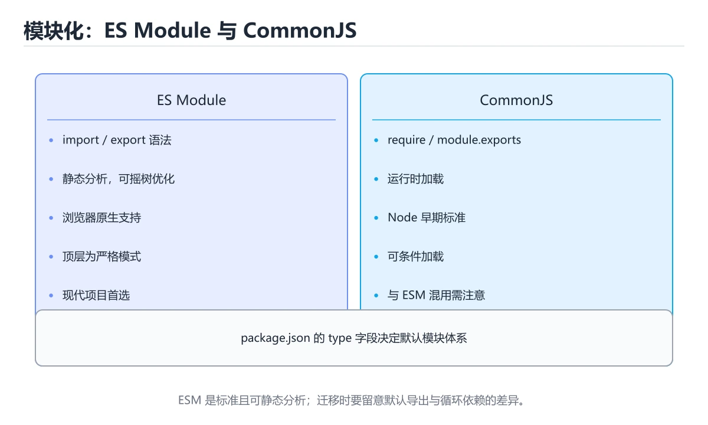

# 模块化与工程化

> 内容更新时间：2026-10-06 · 学习阶段：进阶 · 预计用时：50 分钟




## 本节知识框架

**课程定位**：所属分类为「JavaScript」，课程主题为「模块化与工程化」，学习阶段为「进阶」，建议用时 50 分钟。

**本课要解决的主问题**：ES Module、CommonJS、npm 与 package.json、常见构建工具。

| 学习层次 | 要回答的问题 | 完成判据 |
| --- | --- | --- |
| 概念层 | 「模块化与工程化」有哪些必须区分的对象与术语？ | 能用自己的话定义核心术语，并各举一个正例和一个反例。 |
| 机制层 | 这些对象按什么顺序发生作用，输入如何变成输出？ | 能画出或写出机制步骤，并说明每一步的失败条件。 |
| 应用层 | 什么场景适合使用「模块化与工程化」，什么场景不适合？ | 能给出一个真实场景、一个最小示例和一个边界案例。 |
| 性能层 | 时间、空间、吞吐或延迟受哪些量影响？ | 能说出复杂度或性能瓶颈的证据来源；没有证据时明确写“材料未提供”。 |
| 复习层 | 怎样确认自己不是只记住了结论？ | 能独立完成本课自测，并把错误定位到概念、机制、示例或边界。 |

### 阅读路线

1. 先读「核心概念定义」，建立「ESM」等对象的精确定义。
2. 再读「原理与运行机制」，把定义串成可重复的过程。
3. 用「代码/协议/SQL 示例」验证过程，并只改一个条件观察结果变化。
4. 最后检查性能、易错点、知识关系与自测题，形成可复习的证据链。

**前置知识**：《错误处理与调试》

**学习位置**：本课位于《错误处理与调试》之后；如果前一课的自测不能通过，应先回补再继续。

**后续衔接**：下一课《实战：Vite + React 待办应用》会继续使用本课术语，学完后建议立即完成一次自测。

**教材衔接：学习目标**

- 能用自己的话解释模块化与工程化解决了什么问题，而不是只背术语。
- 能说清 「ESM」、「import」、「export」、「npm」 之间的关系，并分别举出一个例子。
- 能把 ESM 放回「模块化与工程化」的知识体系，说明它和 import 的边界。
- 能完成本课练习，并用验收标准检查自己的结果。

> 一句话摘要：ES Module、CommonJS、npm 与 package.json、常见构建工具。

**教材衔接：前置知识**

- 先完成上一课《错误处理与调试》；如果已经掌握，可以直接用本课练习自测。
- 本课阶段：进阶。建议先完成「错误处理与调试」，或确认自己能独立跑通正文里的 devDependencies 示例。
- 开始前先复习：ESM、import、export。
- 卡在 ESM 上时不要跳过：把输入、预期和实际输出写成三行，再回头读正文。

**教材衔接：本课小结**

模块化解决「代码怎么组织」，npm 解决「依赖怎么管理」，打包工具解决「怎么在浏览器里高效运行」。三者构成现代 JS 工程的基础。

## 核心概念定义

> 阅读约定：本课先给「模块化与工程化」相关术语的操作性定义与适用边界；正文里的口语化说法与定义冲突时，以定义和可复现示例为准。

| 术语 | 操作性定义 | 本课中的边界 |
| --- | --- | --- |
| this | 模块特性：自动严格模式、顶层 this 是 undefined、同一模块只执行一次、静态分析可做摇树优化（tree shaking）。 | 仅在「模块化与工程化」明确给出的输入、版本与资源条件下成立。 |
| .mjs | Node 中 .mjs 或 package.json 里的 "type": "module" 表示使用 ESM；新项目一律优先 ESM。 | 仅在「模块化与工程化」明确给出的输入、版本与资源条件下成立。 |
| ESM | ECMAScript 模块：用 import/export 静态声明依赖，支持默认导出与命名导出。 | 仅在「模块化与工程化」明确给出的输入、版本与资源条件下成立。 |
| 具名导出与默认导出 | 具名导出要用同名导入，默认导出可以任意命名，两者混用最容易写错。 | 仅在「模块化与工程化」明确给出的输入、版本与资源条件下成立。 |

### 定义如何使用

在「模块化与工程化」中判断一个说法是否成立，先确认它使用的是哪个对象的定义，再检查输入规模、运行环境与失败路径。定义不是口号，而是后续推导、代码示例和自测题共享的约束。

## 原理与运行机制

### 机制总览

1. **建立输入**：把「this」按本课定义整理成可观察、可重复的输入条件。
2. **执行转换**：围绕「.mjs」执行本课的核心步骤；每一步都记录中间状态，避免只看最终输出。
3. **产生输出**：得到「ESM」后，用正文示例或协议/SQL 结果核对输出是否符合预期。
4. **改变一个条件**：只替换一个边界条件或环境参数，观察「模块化与工程化」的结论是否仍然成立。

| 阶段 | 关注对象 | 失败时应检查 |
| --- | --- | --- |
| 输入 | this | 类型、范围、编码、版本或前置状态是否满足定义。 |
| 处理 | .mjs | 顺序、可见性、锁、路由、事务或调度规则是否被破坏。 |
| 输出 | ESM | 结果是否可复现，错误是否被正确传播而不是被吞掉。 |

本课的机制结论要用「模块化与工程化」自己的示例验证。「模块化与工程化」没有给出某个数量级、吞吐或内存数据时，本课把该判断标为“材料未提供”，不从相邻主题外推。

**教材衔接：常见工具链**

| 工具 | 作用 |
| --- | --- |
| Vite / Webpack / esbuild | 打包与开发服务器 |
| Babel | 把新语法降级为旧浏览器可运行代码 |
| TypeScript | 给 JS 加静态类型 |
| ESLint / Prettier | 代码检查与格式化 |
| Vitest / Jest | 单元测试 |

**教材衔接：依赖与打包的实践要点**

| 场景 | 做法 |
| --- | --- |
| 区分依赖类型 | 运行时依赖放 dependencies，构建/测试工具放 devDependencies |
| 锁定版本 | 提交 lock 文件；CI 用 `npm ci` 而不是 `npm install` |
| 减少体积 | 按需引入（`import { x } from 'lib'`）、用打包分析器找大依赖、优先 ESM 以便 tree-shaking |
| 代码分割 | 路由级动态 `import()` 拆包，首屏只加载必要代码 |
| 兼容旧浏览器 | 由构建工具按 browserslist 生成 polyfill，而不是全量引入 |
| 供应链安全 | 定期 `npm audit`、锁定版本、谨慎新增依赖 |

常见坑：① 直接依赖与传递依赖版本冲突导致"本地能跑、CI 报错"（用 lock 文件与同一 Node 版本解决）；② 循环依赖使模块导出为 undefined（重构拆分或用延迟引用）；③ ESM 与 CommonJS 混用出现 `require is not defined`（检查 package.json 的 type 与构建输出格式）；④ 只在开发环境生效的 `process.env` 变量在生产未注入，导致运行时报错。

**教材衔接：package.json 关键字段速查**

| 字段 | 作用 | 示例 |
| --- | --- | --- |
| `type` | 决定 `.js` 按哪种模块解析 | `"type": "module"` |
| `main` | CommonJS 入口 | `"main": "./dist/index.cjs"` |
| `module` | ESM 入口（打包器识别） | `"module": "./dist/index.js"` |
| `exports` | 条件导出，控制外部可访问路径 | `"exports": { ".": { "import": "./esm/index.js" } }` |
| `scripts` | 常用命令 | `"test": "vitest run"` |
| `dependencies` | 运行时依赖 | 生产必需 |
| `devDependencies` | 开发依赖 | 测试、构建工具 |
| `engines` | 声明 Node 版本要求 | `"node": ">=20"` |
| `packageManager` | 锁定包管理器版本 | `"pnpm@9.0.0"` |

版本范围速查：

| 写法 | 允许升级范围 |
| --- | --- |
| `1.2.3` | 精确锁定 |
| `~1.2.3` | 补丁位可变（1.2.x） |
| `^1.2.3` | 主版本不变（1.x.x） |
| `>=1.2.3 <2` | 区间 |
| `*` 或 `latest` | 任意，禁止在生产使用 |

**教材衔接：版本与时效**

- devDependencies 依赖的新 API 必须有降级路径，否则老环境直接报错。
- 升级前确认 ESM 的兼容范围，把不可回退的改动单独拆成一次提交。

### 升级检查清单

- 先固定当前版本，跑通全部示例与测验，再升级工具链。
- 升级时只动一个依赖版本，用 devDependencies 记录构建与运行结果。
- 回归范围锁定 devDependencies 的默认行为，并确认弃用警告是否出现在构建输出里。
- 升级完成后更新本课「最后复核 / 下次复核」日期，并记录 ESM 的版本变化。

## 典型应用场景

| 场景 | 典型输入或前提 | 期望产物 |
| --- | --- | --- |
| 学习验证 | 使用本课最小示例和 ESM、import | 能复现正文结论，并解释每一步。 |
| 工程落地 | 把「模块化与工程化」放入真实模块或服务边界 | 输出可观测、失败可定位、参数可配置。 |
| 故障排查 | 只改一个版本、规模、输入或依赖条件 | 能区分概念错误、实现错误和环境差异。 |

判断「模块化与工程化」的场景是否成立，标准是能否写出输入、处理、输出和失败路径；材料中没有出现的数据在本课标注为“材料未提供”，不用推测替代证据。

**课程内置实验入口**：`sandbox:javascript`，用于动手验证《模块化与工程化》的机制；实验结论不替代概念定义与复杂度分析。

## 代码/协议/SQL 示例

### 最小可验证示例

下面保留《模块化与工程化》原文中的最小示例。先预测《模块化与工程化》示例的输出，再按正文步骤运行或推演；示例依赖外部环境时，同时记录版本与输入。

```javascript
// math.js
export const PI = 3.14;
export function add(a, b) { return a + b; }
export default function multiply(a, b) { return a * b; }

// main.js
import multiply, { PI, add as sum } from './math.js';
import * as math from './math.js';           // 命名空间导入

// 动态导入：按需加载，返回 Promise
const module = await import('./heavy.js');
```

**教材衔接：ES Module**

```javascript
// math.js
export const PI = 3.14;
export function add(a, b) { return a + b; }
export default function multiply(a, b) { return a * b; }

// main.js
import multiply, { PI, add as sum } from './math.js';
import * as math from './math.js';           // 命名空间导入

// 动态导入：按需加载，返回 Promise
const module = await import('./heavy.js');
```

模块特性：自动严格模式、顶层 `this` 是 `undefined`、同一模块只执行一次、静态分析可做摇树优化（tree shaking）。

**教材衔接：CommonJS（Node 旧标准）**

```javascript
// 导出
module.exports = { add };
// 导入
const { add } = require('./math');
```

Node 中 `.mjs` 或 `package.json` 里的 `"type": "module"` 表示使用 ESM；新项目一律优先 ESM。

**教材衔接：npm 与 package.json**

```bash
npm init -y
npm install lodash            # 生产依赖
npm install --save-dev vitest # 开发依赖
npm update
npm audit
npx vite                      # 执行本地依赖的命令
```

```json
{
  "name": "demo",
  "type": "module",
  "scripts": {
    "dev": "vite",
    "test": "vitest",
    "build": "vite build"
  },
  "dependencies": { "lodash": "^4.17.21" },
  "devDependencies": { "vitest": "^2.0.0" }
}
```

语义化版本 `^4.17.21`：允许升级次版本与修订版本，不跨主版本。`package-lock.json` 必须提交，保证依赖可复现。

**教材衔接：模块语法速查**

| 目的 | ESM | CommonJS |
| --- | --- | --- |
| 导出命名 | `export const a = 1;` | `module.exports.a = 1;` |
| 导出默认 | `export default fn;` | `module.exports = fn;` |
| 导入命名 | `import { a } from "./m.js";` | `const { a } = require("./m");` |
| 导入默认 | `import fn from "./m.js";` | `const fn = require("./m");` |
| 全部导入 | `import * as ns from "./m.js";` | `const ns = require("./m");` |
| 只导入类型 | `import type { T } from "./t.js";` | 不适用 |
| 动态导入 | `const m = await import("./m.js");` | `require()` 本身即动态 |
| 加载时机 | 静态分析、可 tree shaking | 运行时解析 |
| 顶层 await | 支持 | 不支持 |

注意：浏览器里引用相对模块必须写扩展名（`./util.js`），Node 的 ESM 同样要求完整路径。

**教材衔接：常用命令速查**

| 目的 | 命令 |
| --- | --- |
| 安装依赖（严格按 lock） | `npm ci` |
| 新增依赖 | `npm install lodash` |
| 新增开发依赖 | `npm install -D vitest` |
| 运行脚本 | `npm run build` |
| 检查过期依赖 | `npm outdated` |
| 审计漏洞 | `npm audit --production` |
| 查看依赖树 | `npm ls --depth=0` |
| 清理重装 | `rm -rf node_modules package-lock.json && npm install` |

**教材衔接：零基础详解：模块与工具链**

### 一句话说清它是什么

模块解决「代码怎么拆、怎么互相引用」，工具链解决「代码怎么写、怎么打包、怎么发布」。
现在的主流组合是：**ESM 语法 + 包管理器 + 打包器 + 代码检查**。

### 用生活比喻理解

| 概念 | 比喻 | 说明 |
| --- | --- | --- |
| 模块 | 独立房间 | 各自有进出口，互不打扰 |
| `export` | 出口 | 明确对外提供什么 |
| `import` | 进口 | 用多少引多少 |
| 包管理器 | 仓库 | 下载与管理第三方依赖 |
| 打包器 | 打包流水线 | 合并、压缩、拆分产物 |
| Linter | 质检员 | 提前发现可疑写法 |

### ESM 的四种导入导出

```javascript
// math.js —— 具名导出
export const PI = 3.14159;
export function add(a, b) { return a + b; }
export default function multiply(a, b) { return a * b; }

// main.js —— 具名导入
import { PI, add } from "./math.js";
import multiply from "./math.js";                 // 默认导入
import * as math from "./math.js";                // 整体导入
import { add as sum } from "./math.js";           // 改名
import "./setup.js";                              // 只执行副作用
```

| 对比 | 具名导出 | 默认导出 |
| --- | --- | --- |
| 数量 | 可以有多个 | 一个模块只能一个 |
| 导入名字 | 必须对应，可以改名 | 可以随意命名 |
| 工具支持 | 静态分析更好，利于 tree shaking | 稍差 |
| 建议 | **优先具名** | 只在单一主体时使用 |

### CommonJS 与 ESM 的差异

| 对比 | CommonJS（require） | ESM（import） |
| --- | --- | --- |
| 环境 | Node 传统写法 | 浏览器与 Node 现代写法 |
| 加载时机 | 运行时 | 编译期确定依赖 |
| 是否可动态 | `require` 可条件调用 | 用 `import()` 动态导入 |
| Tree shaking | 差 | 好 |
| 新项目建议 | 少用 | **首选** |

```javascript
// 动态导入：按需加载，减小首屏体积
button.addEventListener("click", async () => {
  const { openDialog } = await import("./dialog.js");
  openDialog();
});
```

### package.json 关键字段

```json
{
  "type": "module",
  "scripts": {
    "dev": "vite",
    "build": "tsc --noEmit && vite build",
    "lint": "eslint .",
    "test": "vitest run"
  },
  "dependencies": { "react": "^19.0.0" },
  "devDependencies": { "vite": "^7.0.0", "typescript": "^5.6.0" }
}
```

| 字段 | 作用 |
| --- | --- |
| `type: module` | 让 `.js` 按 ESM 解析 |
| `dependencies` | 运行时需要 |
| `devDependencies` | 只在开发或构建时需要 |
| `scripts` | 统一命令入口，避免各人敲不同命令 |
| `exports` / `main` / `module` | 发布库时告诉外界入口在哪 |

### 一条常见流水线

```bash
npm ci          # 按 lockfile 精确安装，CI 用这个
npm run lint    # 静态检查
npm test        # 单元测试
npm run build   # 类型检查 + 打包
```

### 新手最容易踩的八个坑

| 坑 | 现象 | 正确做法 |
| --- | --- | --- |
| 混用 `require` 与 `import` | 运行时报错 | 统一 ESM |
| 忘写扩展名 | 浏览器报找不到模块 | ESM 中写全 `.js` |
| 用相对路径跳太多层 | 难以维护 | 配路径别名 |
| 依赖装到 `dependencies` | 包体积变大 | 构建工具放 `devDependencies` |
| 忽略 lockfile | 不同机器装出不同版本 | 提交并 CI 用 `npm ci` |
| 循环依赖 | 拿到 undefined | 抽出公共模块打破环 |
| 全量引入大库 | 首屏变慢 | 按需导入或动态导入 |
| 生产公开 source map | 源码泄露 | 只上传到错误监控平台 |

### 手把手练习：拆分一个小项目

```text
src/
  main.js          入口：只负责组装
  api/user.js      数据访问
  utils/format.js  纯函数
  ui/list.js       渲染
```

```javascript
// utils/format.js
export const formatName = (user) => `${user.last}${user.first}`;

// api/user.js
export async function fetchUsers() {
  const res = await fetch("/api/users");
  if (!res.ok) throw new Error(`HTTP ${res.status}`);
  return res.json();
}

// ui/list.js
import { formatName } from "../utils/format.js";

export function renderUsers(container, users) {
  container.replaceChildren(
    ...users.map((u) => {
      const li = document.createElement("li");
      li.textContent = formatName(u);
      return li;
    }),
  );
}

// main.js
import { fetchUsers } from "./api/user.js";
import { renderUsers } from "./ui/list.js";

const list = document.querySelector("#users");
fetchUsers()
  .then((users) => renderUsers(list, users))
  .catch((error) => console.error("加载失败：", error));
```

### 学完自测

- [ ] 能说出具名导出与默认导出的区别。
- [ ] 知道 ESM 与 CommonJS 的三个差异。
- [ ] 能说出 `dependencies` 与 `devDependencies` 的划分依据。
- [ ] 知道动态 `import()` 能带来什么好处。
- [ ] 能在 CI 里按 lint、test、build 顺序跑完整流水线。

## 时间/空间复杂度或性能分析

**复杂度证据**：「模块化与工程化」的现有材料没有给出渐近时间或空间复杂度的明确结论，本课只做定性检查，不补写未经验证的 $O$ 记号。

| 维度 | 本课关注点 | 判断依据 |
| --- | --- | --- |
| 时间/延迟 | 「模块化与工程化」的主要步骤是否会随输入规模、并发度或网络往返增长。 | 以正文复杂度、基准数据或可重复测量为准。 |
| 空间/内存 | 中间状态、缓存、副本、连接或索引是否随规模增长。 | 记录峰值内存与数据副本，不只看最终结果。 |
| 吞吐/资源 | 版本、调度、锁、IO、序列化或协议开销是否成为瓶颈。 | 固定环境做对照实验，改变一个变量。 |

评估「模块化与工程化」时要区分“正确性成立”和“性能达标”两件事；材料没有给出基准时，本课只保留量级来源与测量方法，不写不可验证的绝对数字。

## 常见误区与易错点

> 复核《模块化与工程化》的易错点时，优先保留原文的错误表、故障现场与排错路径；每条修正都要能用本课示例复验。

| 易错点 | 常见表现 | 正确做法 |
| --- | --- | --- |
| 只背结论 | 能复述「模块化与工程化」的定义，却说不清输入、输出与边界。 | 回到机制步骤，用最小示例逐一验证。 |
| 混淆相邻概念 | 把本课对象与相邻主题的对象当成同一类。 | 先比较定义、资源归属、生命周期和失败模式。 |
| 忽略版本与环境 | 在开发机通过后直接外推到生产环境。 | 固定版本、输入和资源条件，再记录可复现结果。 |

**教材衔接：常见错误与排查**

| 报错或现象 | 原因 | 处理方式 |
| --- | --- | --- |
| `Cannot use import statement outside a module` | 未声明 ESM | 加 `"type": "module"` 或用 `.mjs` |
| `require is not defined` | 浏览器环境无 CommonJS | 改用 `import` |
| `ERR_MODULE_NOT_FOUND` | 相对路径缺少扩展名 | Node ESM 写完整文件名 |
| 循环导入导致某个值为 `undefined` | 模块互相依赖 | 抽出公共模块，或用动态 `import` 延迟加载 |
| 依赖版本在不同机器不一致 | 没提交 lock 文件 | 提交 `package-lock.json` / `pnpm-lock.yaml` |
| `npm install` 结果与 CI 不同 | install 会更新版本 | CI 用 `npm ci` |
| 把构建工具放进 `dependencies` | 生产镜像体积变大 | 移到 `devDependencies` |
| 导入整个工具库只用其中一个函数 | 打包体积暴涨 | 按需导入或用支持 tree shaking 的库 |
| 打包后 `process.env` 为 `undefined` | 环境变量未注入 | 在构建配置里定义（如 Vite 的 `define`） |
| 本地能用、线上报路径错误 | `base` 或 `publicPath` 未配置 | 配置部署子路径 |

**教材衔接：故障现场**

### 现场 1：Cannot use import statement outside a module

**症状**：在《模块化与工程化》的复现场景中，未声明 ESM。

**根因**：“未声明 ESM”只是表层结果。向上追溯会落到“Cannot use import statement outside a module”这一步，因为它省略了《模块化与工程化》的约束，使实现行为和预期模型发生了偏离。

**修复**：针对《模块化与工程化》的问题，加 "type": "module" 或用 .mjs。

**验证**：先在《模块化与工程化》中记录“Cannot use import statement outside a module”留下的失败证据，再执行“加 "type": "module" 或用 .mjs”并重放；确认错误路径变为明确结果，且修复没有掩盖同类故障。

### 现场 2：require is not defined

**症状**：在《模块化与工程化》的复现场景中，浏览器环境无 CommonJS。

**根因**：当出现“require is not defined”时，执行路径已经绕过了《模块化与工程化》的关键约束，最终以“浏览器环境无 CommonJS”暴露出来；修复前必须先确认约束在哪里失效。

**修复**：针对《模块化与工程化》的问题，改用 import。

**验证**：在《模块化与工程化》中按“改用 import”调整后，从“require is not defined”的触发条件重放同一条路径，确认“浏览器环境无 CommonJS”不再出现，并补一个相邻边界用例检查没有引入新问题。

### 现场 3：ERR_MODULE_NOT_FOUND

**症状**：在《模块化与工程化》的复现场景中，相对路径缺少扩展名。

**根因**：触发点是把“ERR_MODULE_NOT_FOUND”当成安全做法。它没有满足《模块化与工程化》要求的前提，因此先表现为“相对路径缺少扩展名”；排查时先完整复现这一段，再核对输入、配置与依赖。

**修复**：针对《模块化与工程化》的问题，Node ESM 写完整文件名。

**验证**：保留《模块化与工程化》里触发“相对路径缺少扩展名”的输入、版本和日志，按“Node ESM 写完整文件名”完成修改后原样重放；只有失败现象消失且相邻场景仍可解释，才保留改动。

## 与其他知识点的关系

| 关系 | 课程 | 为什么 |
| --- | --- | --- |
| 先修 | 《错误处理与调试》 | 本课会直接使用它的概念或操作前提。 |
| 关联 | 《实战：Vite + React 待办应用》 | 用于横向比较或把本课结论迁移到相邻主题。 |
| 前置顺序 | 《错误处理与调试》 | 同分类中安排在本课之前，建议先完成其自测。 |
| 后续顺序 | 《实战：Vite + React 待办应用》 | 同分类中安排在本课之后，会继续使用本课术语。 |

把「模块化与工程化」放回知识体系时，不只要记住“前面学过什么”，还要说明两个主题在输入、机制、资源边界和失败模式上的差异。这样才能把单课知识迁移到项目、排障和后续课程。

## 自测题与参考答案

> 先独立作答《模块化与工程化》的自测题，再对照答案与解析；每处判断都要能在本课正文或示例中找到依据。

### 自测 1

导出模块默认值的语法是？

A. export * from './a'，用于重导出模块
B. export default function {}
C. export const a = 1
D. module.exports = a

**参考答案**：export default function {}

**解析**：在「模块化与工程化」里，export default function {}。export default 导出默认成员，导入时不需要花括号且可以自定义名称。“导出模块默认值的语法是”与「模块化与工程化」的术语表相呼应，只有符合ESM、import、export约束的“export default funct”才是正文支持的结论。

### 自测 2

围绕“模块化与工程化”中的 ESM、import、export，下列哪两项是本课强调的实践判断？

A. 验证 import 时要固定版本并覆盖边界输入，结论才可复现
B. 把 import 的单次运行结果当成所有版本和规模都成立
C. 学习 ESM 时要同时说明输入、输出和失败路径，不能只看正常流程
D. 只要 ESM 的常规示例通过，就可以跳过边界与异常路径

**参考答案**：验证 import 时要固定版本并覆盖边界输入，结论才可复现；学习 ESM 时要同时说明输入、输出和失败路径，不能只看正常流程

**解析**：结论应落在验证 import 时要固定版本并覆盖边界输入。本课把模块化与工程化拆成概念、示例与故障现场三部分，因此判断 ESM 时必须同时交代输入、输出和失败路径，这使“学习 ESM 时要同时说明输入、输出和失败路径，不能只看正常流程”成立。在模块化与工程化里，判断 import 时要固定版本与边界输入，所以“验证 import 时要固定版本并覆盖边界输入，结论才可复现”才可复现。

### 自测 3

阅读「模块化与工程化」正文里的这段 JavaScript 代码，下面哪一项判断是正确的？

```javascript
// math.js
export const PI = 3.14;
export function add(a, b) { return a + b; }
export default function multiply(a, b) { return a * b; }

// main.js
import multiply, { PI, add as sum } from './math.js';
import * as math from './math.js';           // 命名空间导入

// 动态导入：按需加载，返回 Promise
const module = await import('./heavy.js');
```

A. 这段代码会读取外部输入，结果依赖传入的数据。
B. 这段代码把主要逻辑封装在函数或方法里，需要被调用才会执行。
C. 这段代码包含条件分支，不同输入会走不同的执行路径。
D. 这段代码包含异常处理分支，失败时会走专门的补救路径。

**参考答案**：这段代码把主要逻辑封装在函数或方法里，需要被调用才会执行。

**解析**：在「模块化与工程化」里，题干的正确项是这段代码把主要逻辑封装在函数或方法里，需要被调用才会执行，在「模块化与工程化」里封装边界决定ESM从哪一步开始生效。把输入或边界换成空值、极值或失败情况后，结论要以「模块化与工程化」的实际运行结果为准。把“这段代码把主要逻辑封装在函数或方法里”代回「模块化与工程化」里“阅读模块化与工程化正文里的这段 JavaScript 代码”的例子核对，条件一旦改变，结论就要用ESM、import、export重新推导。

**教材衔接：复习与自测**

- [ ] 项目声明了 `"type": "module"` 并统一使用 ESM。
- [ ] CI 使用 `npm ci`，并提交 lock 文件。
- [ ] 构建工具放在 `devDependencies`。
- [ ] 依赖版本用 `^` 或 `~` 并定期审计漏洞。
- [ ] 会用 `exports` 字段控制库的对外入口。

**教材衔接：动手练习**

> 本课练习重点：围绕「ESM、import、export」完成复述、实验和交付，每个结果都要能被别人检查。

先复现 import 的时序问题，再引入取消或超时机制。

### 练习 1：建立心智模型（10 分钟）

合上教程，用 3～5 句话回答：

1. 模块化与工程化解决了什么问题？
2. 如果没有它，会出现什么具体后果？
3. 它和「import」是什么关系？

验收标准：说明 ESM 与 import 的分工，并写出一个失效场景。

### 练习 2：做一次可控实验（20 分钟）

从正文中选一个最小示例，完成以下操作：

1. 先预测修改一个参数、输入或步骤后的结果。
2. 再实际执行或逐步推演，记录真实结果。
3. 如果结果与预测不同，写出差异原因。

**验收标准**：先原样跑通正文里的 `devDependencies`，再只改ESM相关的输入，按「原例 → 改动 → 预测 → 结果 → 原因」记录；预测必须写在实际运行之前。

### 练习 3：交付一个小结果（30 分钟）

在浏览器控制台或 Node.js 中写一个 ESM 的最小示例，列出 3 组输入输出。

任务要求：

- 结果必须能被别人检查，不能只写“我已经理解了”。
- 至少覆盖「ESM」和「import」两个关键词。
- 写出 1 个仍然不确定的问题，以及下一步如何验证。

> 提示：时间有限时优先做练习 1 和练习 2；练习 3 可以拆成两次完成。

**教材衔接：可运行练习**

### 任务 1：先跑通，再解释

```javascript
// math.js
export const PI = 3.14;
export function add(a, b) { return a + b; }
export default function multiply(a, b) { return a * b; }

// main.js
import multiply, { PI, add as sum } from './math.js';
import * as math from './math.js';           // 命名空间导入

// 动态导入：按需加载，返回 Promise
const module = await import('./heavy.js');
```

### 任务 2：只改一个条件

把「模块化与工程化」的最小示例复制一份，只改一个条件再跑一次：

- 改动点：只把 ESM 的输入换成空值、极值或错误输入，其余保持不变。
- 预测：先写下「模块化与工程化」在改动后的输出或错误信息，再运行。
- 记录：对照改动前后的结果，指出差异出在哪一步。
- 验收：换回原条件能复现原结果，改动只影响ESM。

### 任务 3：迁移到自己的数据

用同一套思路处理一组你自己的 ESM 数据，保持输出格式与任务 1 一致。

**教材衔接：本课复习清单**

离开本课前，逐项确认：

- [ ] 不看解析，能说出「导出模块默认值的语法是？」的判断依据。
- [ ] 不看解析，能说出「package-lock.json 的主要作用是？」的判断依据。
- [ ] 不看解析，能说出「版本号 ^4.17.21 表示允许升级到？」的判断依据。
- [ ] 不看解析，能说出「ESM 与 CommonJS 的主要区别是？」的判断依据。
- [ ] 不看解析，能说出「devDependencies 与 dependencies 的区别是？」的判断依据。
- [ ] 至少运行一次 devDependencies 的示例，记录输入、输出和 ESM 的边界情况。
- [ ] 把本课最容易混淆的两个概念写成一句话对照。

| 复盘项 | 记录 |
| --- | --- |
| 已经能独立解释的考点 |  |
| 仍然说不清的概念 |  |
| 下一步验证动作 |  |

---

## 术语速查

| 术语 | 一句话说明 |
| --- | --- |
| `this` | 模块特性：自动严格模式、顶层 `this` 是 `undefined`、同一模块只执行一次、静态分析可做摇树优化（tree shaking）。 |
| `.mjs` | Node 中 `.mjs` 或 `package.json` 里的 `"type": "module"` 表示使用 ESM；新项目一律优先 ESM。 |
| `ESM` | ECMAScript 模块：用 import/export 静态声明依赖，支持默认导出与命名导出。 |
| `具名导出与默认导出` | 具名导出要用同名导入，默认导出可以任意命名，两者混用最容易写错。 |

## 考点精讲

### 考点 1：概念判断·ESM

- **题目**：导出模块默认值的语法是？
- **判断依据**：在「模块化与工程化」里，export default function {}。export default 导出默认成员，导入时不需要花括号且可以自定义名称。“导出模块默认值的语法是”与「模块化与工程化」的术语表相呼应，只有符合ESM、import、export约束的“export default funct”才是正文支持的结论。

### 考点 2：概念判断·ESM

- **题目**：package-lock.json 的主要作用是？
- **判断依据**：在「模块化与工程化」里，锁定依赖的确切版本。lock 文件记录完整的依赖树与版本，团队与 CI 中应当提交它。回到「模块化与工程化」的正文示例，用“package-lock.json”走一遍ESM、import、export的完整流程，能复现的结论才可以保留。

### 考点 3：概念判断·ESM

- **题目**：版本号 ^4.17.21 表示允许升级到？
- **判断依据**：在「模块化与工程化」里，4.x.x 的最新版。^ 允许次版本与修订版本升级，主版本变化可能不兼容，因此被排除。这道题的关键在「模块化与工程化」的ESM、import、export：先确认题干“版本号 ^4.17.21 表示允许升”问的是哪一步，再排除偷换前提的选项。

### 考点 4：多选辨析·ESM

- **题目**：围绕“模块化与工程化”中的 ESM、import、export，下列哪两项是本课强调的实践判断？
- **判断依据**：结论应落在验证 import 时要固定版本并覆盖边界输入。本课把模块化与工程化拆成概念、示例与故障现场三部分，因此判断 ESM 时必须同时交代输入、输出和失败路径，这使“学习 ESM 时要同时说明输入、输出和失败路径，不能只看正常流程”成立。在模块化与工程化里，判断 import 时要固定版本与边界输入，所以“验证 import 时要固定版本并覆盖边界输入，结论才可复现”才可复现。

### 考点 5：代码补全·ESM

- **题目**：阅读「模块化与工程化」正文里的这段 JavaScript 代码，下面哪一项判断是正确的？
- **判断依据**：在「模块化与工程化」里，题干的正确项是这段代码把主要逻辑封装在函数或方法里，需要被调用才会执行，在「模块化与工程化」里封装边界决定ESM从哪一步开始生效。把输入或边界换成空值、极值或失败情况后，结论要以「模块化与工程化」的实际运行结果为准。把“这段代码把主要逻辑封装在函数或方法里”代回「模块化与工程化」里“阅读模块化与工程化正文里的这段 JavaScript 代码”的例子核对，条件一旦改变，结论就要用ESM、import、export重新推导。

### 考点 6：填空·ESM

- **题目**：补全代码：「模块化与工程化」示例中，下面这行代码缺少哪个关键字或函数名？请填入 ____。 `"____": { "vitest": "^2.0.0" }`
- **判断依据**：空格应填写「devDependencies」、「devdependencies」。回到「模块化与工程化」的正文示例，用“补全代码”走一遍ESM、import、export的完整流程，能复现的结论才可以保留。回到ESM、import、export本身再看一遍：只有“devDependencies”与题干“devDependencies”的前提一致，结论才成立。

## English Overview

**Title:** Modules & Tooling

**Summary:** ES modules, CommonJS, npm and build tooling.

**Category:** JavaScript
**Level:** 进阶
**Key terms:** ESM, import, export, npm, package.json, Vite

## 内容元数据

- 内容版本：v2.0
- 最后更新：2026-10-06
- 学习阶段：进阶
- 适用环境：Node.js 22+ / 现代浏览器
；本课聚焦 ESM。
- 内容来源：内置结构化课程与工程实践整理
- 相关主题：ESM、import、export、npm、package.json、Vite
- 质量版本：P0 测验标准 + P1 覆盖扩展 + P2 体验补全

## 参考资料与复核

- 最后复核：2026-10-04
- 下次复核：2027-05-17
- 复核范围：版本兼容、API 行为、安全建议与工程实践
- 来源性质：官方文档、标准或权威教材；正文为离线教学重组

| 参考资料 | 本课用途 |
| --- | --- |
| [MDN 模块](https://developer.mozilla.org/docs/Web/JavaScript/Guide/Modules) | ES Module 与依赖组织 |
| [npm 文档](https://docs.npmjs.com/) | 包管理与发布 |
| [MDN Promise](https://developer.mozilla.org/docs/Web/JavaScript/Reference/Global_Objects/Promise) | Promise 与异步链 |

> 「模块化与工程化」的链接用于离线阅读后的延伸核对；App 不会自动联网。
