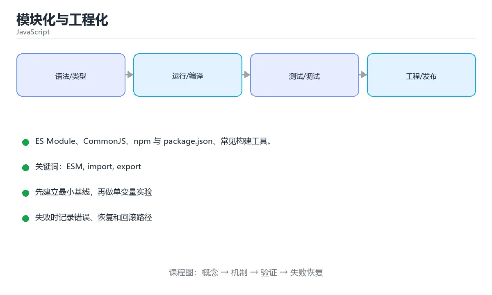

# 模块化与工程化



> 内容更新时间：2026-10-03 · 学习阶段：进阶 · 预计用时：15 分钟

## 学习目标

- 能用自己的话解释「模块化与工程化」解决了什么问题，而不是只背术语。
- 能说清 「ESM」、「import」、「export」、「npm」 之间的关系，并分别举出一个例子。
- 能把本课知识放回「JavaScript」的知识体系，说明它和相邻主题的边界。
- 能完成本课练习，并用验收标准检查自己的结果。

> 一句话摘要：ES Module、CommonJS、npm 与 package.json、常见构建工具。

## 前置知识

- 先完成上一课《错误处理与调试》；如果已经掌握，可以直接用本课练习自测。
- 本课阶段：进阶。建议先掌握同一分类的基础课程，并能独立运行正文中的最小示例。
- 开始前先复习：ESM、import、export。
- 如果某一步看不懂，先记录具体卡点，完成练习后再回头读一遍。


## ES Module

```javascript
// math.js
export const PI = 3.14;
export function add(a, b) { return a + b; }
export default function multiply(a, b) { return a * b; }

// main.js
import multiply, { PI, add as sum } from './math.js';
import * as math from './math.js';           // 命名空间导入

// 动态导入：按需加载，返回 Promise
const module = await import('./heavy.js');
```

模块特性：自动严格模式、顶层 `this` 是 `undefined`、同一模块只执行一次、静态分析可做摇树优化（tree shaking）。

## CommonJS（Node 旧标准）

```javascript
// 导出
module.exports = { add };
// 导入
const { add } = require('./math');
```

Node 中 `.mjs` 或 `package.json` 里的 `"type": "module"` 表示使用 ESM；新项目一律优先 ESM。

## npm 与 package.json

```bash
npm init -y
npm install lodash            # 生产依赖
npm install --save-dev vitest # 开发依赖
npm update
npm audit
npx vite                      # 执行本地依赖的命令
```

```json
{
  "name": "demo",
  "type": "module",
  "scripts": {
    "dev": "vite",
    "test": "vitest",
    "build": "vite build"
  },
  "dependencies": { "lodash": "^4.17.21" },
  "devDependencies": { "vitest": "^2.0.0" }
}
```

语义化版本 `^4.17.21`：允许升级次版本与修订版本，不跨主版本。`package-lock.json` 必须提交，保证依赖可复现。

## 常见工具链

| 工具 | 作用 |
| --- | --- |
| Vite / Webpack / esbuild | 打包与开发服务器 |
| Babel | 把新语法降级为旧浏览器可运行代码 |
| TypeScript | 给 JS 加静态类型 |
| ESLint / Prettier | 代码检查与格式化 |
| Vitest / Jest | 单元测试 |

## 依赖与打包的实践要点

| 场景 | 做法 |
| --- | --- |
| 区分依赖类型 | 运行时依赖放 dependencies，构建/测试工具放 devDependencies |
| 锁定版本 | 提交 lock 文件；CI 用 `npm ci` 而不是 `npm install` |
| 减少体积 | 按需引入（`import { x } from 'lib'`）、用打包分析器找大依赖、优先 ESM 以便 tree-shaking |
| 代码分割 | 路由级动态 `import()` 拆包，首屏只加载必要代码 |
| 兼容旧浏览器 | 由构建工具按 browserslist 生成 polyfill，而不是全量引入 |
| 供应链安全 | 定期 `npm audit`、锁定版本、谨慎新增依赖 |

常见坑：① 直接依赖与传递依赖版本冲突导致"本地能跑、CI 报错"（用 lock 文件与同一 Node 版本解决）；② 循环依赖使模块导出为 undefined（重构拆分或用延迟引用）；③ ESM 与 CommonJS 混用出现 `require is not defined`（检查 package.json 的 type 与构建输出格式）；④ 只在开发环境生效的 `process.env` 变量在生产未注入，导致运行时报错。

## 本课小结
模块化解决「代码怎么组织」，npm 解决「依赖怎么管理」，打包工具解决「怎么在浏览器里高效运行」。三者构成现代 JS 工程的基础。


## 模块语法速查

| 目的 | ESM | CommonJS |
| --- | --- | --- |
| 导出命名 | `export const a = 1;` | `module.exports.a = 1;` |
| 导出默认 | `export default fn;` | `module.exports = fn;` |
| 导入命名 | `import { a } from "./m.js";` | `const { a } = require("./m");` |
| 导入默认 | `import fn from "./m.js";` | `const fn = require("./m");` |
| 全部导入 | `import * as ns from "./m.js";` | `const ns = require("./m");` |
| 只导入类型 | `import type { T } from "./t.js";` | 不适用 |
| 动态导入 | `const m = await import("./m.js");` | `require()` 本身即动态 |
| 加载时机 | 静态分析、可 tree shaking | 运行时解析 |
| 顶层 await | 支持 | 不支持 |

注意：浏览器里引用相对模块必须写扩展名（`./util.js`），Node 的 ESM 同样要求完整路径。

## package.json 关键字段速查

| 字段 | 作用 | 示例 |
| --- | --- | --- |
| `type` | 决定 `.js` 按哪种模块解析 | `"type": "module"` |
| `main` | CommonJS 入口 | `"main": "./dist/index.cjs"` |
| `module` | ESM 入口（打包器识别） | `"module": "./dist/index.js"` |
| `exports` | 条件导出，控制外部可访问路径 | `"exports": { ".": { "import": "./esm/index.js" } }` |
| `scripts` | 常用命令 | `"test": "vitest run"` |
| `dependencies` | 运行时依赖 | 生产必需 |
| `devDependencies` | 开发依赖 | 测试、构建工具 |
| `engines` | 声明 Node 版本要求 | `"node": ">=20"` |
| `packageManager` | 锁定包管理器版本 | `"pnpm@9.0.0"` |

版本范围速查：

| 写法 | 允许升级范围 |
| --- | --- |
| `1.2.3` | 精确锁定 |
| `~1.2.3` | 补丁位可变（1.2.x） |
| `^1.2.3` | 主版本不变（1.x.x） |
| `>=1.2.3 <2` | 区间 |
| `*` 或 `latest` | 任意，禁止在生产使用 |

## 常见错误对照表

| 报错或现象 | 原因 | 处理方式 |
| --- | --- | --- |
| `Cannot use import statement outside a module` | 未声明 ESM | 加 `"type": "module"` 或用 `.mjs` |
| `require is not defined` | 浏览器环境无 CommonJS | 改用 `import` |
| `ERR_MODULE_NOT_FOUND` | 相对路径缺少扩展名 | Node ESM 写完整文件名 |
| 循环导入导致某个值为 `undefined` | 模块互相依赖 | 抽出公共模块，或用动态 `import` 延迟加载 |
| 依赖版本在不同机器不一致 | 没提交 lock 文件 | 提交 `package-lock.json` / `pnpm-lock.yaml` |
| `npm install` 结果与 CI 不同 | install 会更新版本 | CI 用 `npm ci` |
| 把构建工具放进 `dependencies` | 生产镜像体积变大 | 移到 `devDependencies` |
| 导入整个工具库只用其中一个函数 | 打包体积暴涨 | 按需导入或用支持 tree shaking 的库 |
| 打包后 `process.env` 为 `undefined` | 环境变量未注入 | 在构建配置里定义（如 Vite 的 `define`） |
| 本地能用、线上报路径错误 | `base` 或 `publicPath` 未配置 | 配置部署子路径 |

## 常用命令速查

| 目的 | 命令 |
| --- | --- |
| 安装依赖（严格按 lock） | `npm ci` |
| 新增依赖 | `npm install lodash` |
| 新增开发依赖 | `npm install -D vitest` |
| 运行脚本 | `npm run build` |
| 检查过期依赖 | `npm outdated` |
| 审计漏洞 | `npm audit --production` |
| 查看依赖树 | `npm ls --depth=0` |
| 清理重装 | `rm -rf node_modules package-lock.json && npm install` |

## 自测清单

- [ ] 项目声明了 `"type": "module"` 并统一使用 ESM。
- [ ] CI 使用 `npm ci`，并提交 lock 文件。
- [ ] 构建工具放在 `devDependencies`。
- [ ] 依赖版本用 `^` 或 `~` 并定期审计漏洞。
- [ ] 会用 `exports` 字段控制库的对外入口。


## 零基础详解：模块与工具链

### 一句话说清它是什么

模块解决「代码怎么拆、怎么互相引用」，工具链解决「代码怎么写、怎么打包、怎么发布」。
现在的主流组合是：**ESM 语法 + 包管理器 + 打包器 + 代码检查**。

### 用生活比喻理解

| 概念 | 比喻 | 说明 |
| --- | --- | --- |
| 模块 | 独立房间 | 各自有进出口，互不打扰 |
| `export` | 出口 | 明确对外提供什么 |
| `import` | 进口 | 用多少引多少 |
| 包管理器 | 仓库 | 下载与管理第三方依赖 |
| 打包器 | 打包流水线 | 合并、压缩、拆分产物 |
| Linter | 质检员 | 提前发现可疑写法 |

### ESM 的四种导入导出

```javascript
// math.js —— 具名导出
export const PI = 3.14159;
export function add(a, b) { return a + b; }
export default function multiply(a, b) { return a * b; }

// main.js —— 具名导入
import { PI, add } from "./math.js";
import multiply from "./math.js";                 // 默认导入
import * as math from "./math.js";                // 整体导入
import { add as sum } from "./math.js";           // 改名
import "./setup.js";                              // 只执行副作用
```

| 对比 | 具名导出 | 默认导出 |
| --- | --- | --- |
| 数量 | 可以有多个 | 一个模块只能一个 |
| 导入名字 | 必须对应，可以改名 | 可以随意命名 |
| 工具支持 | 静态分析更好，利于 tree shaking | 稍差 |
| 建议 | **优先具名** | 只在单一主体时使用 |

### CommonJS 与 ESM 的差异

| 对比 | CommonJS（require） | ESM（import） |
| --- | --- | --- |
| 环境 | Node 传统写法 | 浏览器与 Node 现代写法 |
| 加载时机 | 运行时 | 编译期确定依赖 |
| 是否可动态 | `require` 可条件调用 | 用 `import()` 动态导入 |
| Tree shaking | 差 | 好 |
| 新项目建议 | 少用 | **首选** |

```javascript
// 动态导入：按需加载，减小首屏体积
button.addEventListener("click", async () => {
  const { openDialog } = await import("./dialog.js");
  openDialog();
});
```

### package.json 关键字段

```json
{
  "type": "module",
  "scripts": {
    "dev": "vite",
    "build": "tsc --noEmit && vite build",
    "lint": "eslint .",
    "test": "vitest run"
  },
  "dependencies": { "react": "^19.0.0" },
  "devDependencies": { "vite": "^7.0.0", "typescript": "^5.6.0" }
}
```

| 字段 | 作用 |
| --- | --- |
| `type: module` | 让 `.js` 按 ESM 解析 |
| `dependencies` | 运行时需要 |
| `devDependencies` | 只在开发或构建时需要 |
| `scripts` | 统一命令入口，避免各人敲不同命令 |
| `exports` / `main` / `module` | 发布库时告诉外界入口在哪 |

### 一条常见流水线

```bash
npm ci          # 按 lockfile 精确安装，CI 用这个
npm run lint    # 静态检查
npm test        # 单元测试
npm run build   # 类型检查 + 打包
```

### 新手最容易踩的八个坑

| 坑 | 现象 | 正确做法 |
| --- | --- | --- |
| 混用 `require` 与 `import` | 运行时报错 | 统一 ESM |
| 忘写扩展名 | 浏览器报找不到模块 | ESM 中写全 `.js` |
| 用相对路径跳太多层 | 难以维护 | 配路径别名 |
| 依赖装到 `dependencies` | 包体积变大 | 构建工具放 `devDependencies` |
| 忽略 lockfile | 不同机器装出不同版本 | 提交并 CI 用 `npm ci` |
| 循环依赖 | 拿到 undefined | 抽出公共模块打破环 |
| 全量引入大库 | 首屏变慢 | 按需导入或动态导入 |
| 生产公开 source map | 源码泄露 | 只上传到错误监控平台 |

### 手把手练习：拆分一个小项目

```text
src/
  main.js          入口：只负责组装
  api/user.js      数据访问
  utils/format.js  纯函数
  ui/list.js       渲染
```

```javascript
// utils/format.js
export const formatName = (user) => `${user.last}${user.first}`;

// api/user.js
export async function fetchUsers() {
  const res = await fetch("/api/users");
  if (!res.ok) throw new Error(`HTTP ${res.status}`);
  return res.json();
}

// ui/list.js
import { formatName } from "../utils/format.js";

export function renderUsers(container, users) {
  container.replaceChildren(
    ...users.map((u) => {
      const li = document.createElement("li");
      li.textContent = formatName(u);
      return li;
    }),
  );
}

// main.js
import { fetchUsers } from "./api/user.js";
import { renderUsers } from "./ui/list.js";

const list = document.querySelector("#users");
fetchUsers()
  .then((users) => renderUsers(list, users))
  .catch((error) => console.error("加载失败：", error));
```

### 学完自测

- [ ] 能说出具名导出与默认导出的区别。
- [ ] 知道 ESM 与 CommonJS 的三个差异。
- [ ] 能说出 `dependencies` 与 `devDependencies` 的划分依据。
- [ ] 知道动态 `import()` 能带来什么好处。
- [ ] 能在 CI 里按 lint、test、build 顺序跑完整流水线。

## 动手练习


> 本课练习重点：围绕「ESM、import、export」完成复述、实验和交付，每个结果都要能被别人检查。

先在 Node 或浏览器复现行为，再改写异步与错误路径，最后补测试。

### 练习 1：建立心智模型（10 分钟）

合上教程，用 3～5 句话回答：

1. 「模块化与工程化」解决了什么问题？
2. 如果没有它，会出现什么具体后果？
3. 它和「import」是什么关系？

**验收标准**：至少出现一个本课关键词，并写出一个反例、边界条件或失效场景。

### 练习 2：做一次可控实验（20 分钟）

从正文中选一个最小示例，完成以下操作：

1. 先预测修改一个参数、输入或步骤后的结果。
2. 再实际执行或逐步推演，记录真实结果。
3. 如果结果与预测不同，写出差异原因。

**验收标准**：留下「原例 → 改动 → 预测 → 结果 → 原因」五步记录。

### 练习 3：交付一个小结果（30 分钟）

在浏览器控制台或 Node.js 中写一个最小示例，列出至少 3 组输入输出。

任务要求：

- 结果必须能被别人检查，不能只写“我已经理解了”。
- 至少覆盖「ESM」和「import」两个关键词。
- 写出 1 个仍然不确定的问题，以及下一步如何验证。

> 提示：时间有限时优先做练习 1 和练习 2；练习 3 可以拆成两次完成。


## 考点精讲：把测验题还原成判断过程

本课有 6 个判断点。先自己作答，再看「判断依据」；如果结论正确但理由不完整，回到正文对应章节补足概念。

### 考点 1：导出模块默认值的语法是？

- **正确判断**：export default function () {}
- **判断依据**：正确答案是「export default function () {}」，本课在「本课小结」中说明：模块化解决「代码怎么组织」，npm 解决「依赖怎么管理」，打包工具解决「怎么在浏览器里高效运行」。export default 导出默认成员，导入时不需要花括号且可以自定义名称。本课还在「依赖与打包的实践要点」中说明：② 循环依赖使模块导出为 undefined（重构拆分或用延迟引用）。本课还在「依赖与打包的实践要点」中说明：③ ESM 与 CommonJS 混用出现 require is not defined（检查 package.json 的 type 与构建输出格式）。
- **迁移检查**：把题干里的一个条件换成边界值，原来的结论还成立吗？写出判断过程。

### 考点 2：package-lock.json 的主要作用是？

- **正确判断**：锁定依赖的确切版本
- **判断依据**：正确答案是「锁定依赖的确切版本」，本课在「本课小结」中说明：模块化解决「代码怎么组织」，npm 解决「依赖怎么管理」，打包工具解决「怎么在浏览器里高效运行」。lock 文件记录完整的依赖树与版本，团队与 CI 中应当提交它。本课还在「npm 与 package.json」中说明：package-lock.json 必须提交，保证依赖可复现。本课还在「依赖与打包的实践要点」中说明：常见坑：① 直接依赖与传递依赖版本冲突导致"本地能跑、CI 报错"（用 lock 文件与同一 Node 版本解决）。
- **迁移检查**：如果给某个错误选项去掉一个限定词，它会不会变成正确？说明理由。

### 考点 3：版本号 ^4.17.21 表示允许升级到？

- **正确判断**：4.x.x 的最新版（不跨主版本）
- **判断依据**：正确答案是「4.x.x 的最新版（不跨主版本）」，本课在「npm 与 package.json」中说明：语义化版本 ^4.17.21：允许升级次版本与修订版本，不跨主版本。^ 允许次版本与修订版本升级，主版本变化可能不兼容，因此被排除。本课还在「CommonJS（Node 旧标准）」中说明：Node 中 .mjs 或 package.json 里的 "type": "module" 表示使用 ESM。
- **迁移检查**：遮住选项，只根据定义复述一次答案，再回来看哪个选项与复述一致。

### 考点 4：ESM 与 CommonJS 的主要区别是？

- **正确判断**：ESM 是静态的 import/export
- **判断依据**：正确答案是「ESM 是静态的 import/export」，本课在「模块语法速查」中说明：注意：浏览器里引用相对模块必须写扩展名（./util.js），Node 的 ESM 同样要求完整路径。静态结构让打包器能安全地删除未使用的导出，这是现代构建体积优化的基础。本课还在「ES Module」中说明：模块特性：自动严格模式、顶层 this 是 undefined、同一模块只执行一次、静态分析可做摇树优化（tree shaking）。
- **迁移检查**：把题干里的一个条件换成边界值，原来的结论还成立吗？写出判断过程。

### 考点 5：devDependencies 与 dependencies 的区别是？

- **正确判断**：只在开发，构建
- **判断依据**：正确答案是「只在开发，构建」，本课在「依赖与打包的实践要点」中说明：④ 只在开发环境生效的 process.env 变量在生产未注入，导致运行时报错。把测试框架、打包器放 devDependencies，能避免污染生产依赖树。本课还在「依赖与打包的实践要点」中说明：③ ESM 与 CommonJS 混用出现 require is not defined（检查 package.json 的 type 与构建输出格式）。
- **迁移检查**：把题干里的一个条件换成边界值，原来的结论还成立吗？写出判断过程。

### 考点 6：补全代码：「模块化与工程化」示例中，下面这行代码缺少哪个关键字或函数名？请填入 ____。 `"____": { "vitest": "^2.0.0" }`

- **正确判断**：devDependencies / devdependencies
- **判断依据**：正确答案是「devDependencies」，本课在「零基础详解：模块与工具链」中说明：能说出 dependencies 与 devDependencies 的划分依据。本课还在「零基础详解：模块与工具链」中说明：模块解决「代码怎么拆、怎么互相引用」，工具链解决「代码怎么写、怎么打包、怎么发布」。本课还在「零基础详解：模块与工具链」中说明：知道动态 import() 能带来什么好处。
- **迁移检查**：把答案换成另一种等价写法，是否仍然正确？说明依据。

## 本课复习清单

离开本课前，逐项确认：

- [ ] 不看解析，能说出「导出模块默认值的语法是？」的判断依据。
- [ ] 不看解析，能说出「package-lock.json 的主要作用是？」的判断依据。
- [ ] 不看解析，能说出「版本号 ^4.17.21 表示允许升级到？」的判断依据。
- [ ] 不看解析，能说出「ESM 与 CommonJS 的主要区别是？」的判断依据。
- [ ] 不看解析，能说出「devDependencies 与 dependencies 的区别是？」的判断依据。
- [ ] 不看解析，能说出「补全代码：「模块化与工程化」示例中，下面这行代码缺少哪个关键字或函数名？请填入 …」的判断依据。
- [ ] 至少运行一次本课示例，记录输入、输出和一个边界情况。
- [ ] 把本课最容易混淆的两个概念写成一句话对照。

| 复盘项 | 记录 |
| --- | --- |
| 已经能独立解释的考点 |  |
| 仍然说不清的概念 |  |
| 下一步验证动作 |  |

## 术语速查

把本课反复出现的术语集中放在一起。复习时先遮住右列，尝试用自己的话解释，再回到正文核对。

| 术语 | 本课语境 |
| --- | --- |
| `this` | 模块特性：自动严格模式、顶层 `this` 是 `undefined`、同一模块只执行一次、静态分析可做摇树优化（tree shaking）。 |
| `undefined` | 模块特性：自动严格模式、顶层 `this` 是 `undefined`、同一模块只执行一次、静态分析可做摇树优化（tree shaking）。 |
| `.mjs` | Node 中 `.mjs` 或 `package.json` 里的 `"type": "module"` 表示使用 ESM；新项目一律优先 ESM。 |
| `package.json` | Node 中 `.mjs` 或 `package.json` 里的 `"type": "module"` 表示使用 ESM；新项目一律优先 ESM。 |
| `"type": "module"` | Node 中 `.mjs` 或 `package.json` 里的 `"type": "module"` 表示使用 ESM；新项目一律优先 ESM。 |
| `^4.17.21` | 语义化版本 `^4.17.21`：允许升级次版本与修订版本，不跨主版本。`package-lock.json` 必须提交，保证依赖可复现。 |
| `package-lock.json` | 语义化版本 `^4.17.21`：允许升级次版本与修订版本，不跨主版本。`package-lock.json` 必须提交，保证依赖可复现。 |
| `npm ci` | \| 锁定版本 \| 提交 lock 文件；CI 用 `npm ci` 而不是 `npm install` \| |
| `npm install` | \| 锁定版本 \| 提交 lock 文件；CI 用 `npm ci` 而不是 `npm install` \| |
| `import { x } from 'lib'` | \| 减少体积 \| 按需引入（`import { x } from 'lib'`）、用打包分析器找大依赖、优先 ESM 以便 tree-shaking \| |
| `import()` | \| 代码分割 \| 路由级动态 `import()` 拆包，首屏只加载必要代码 \| |
| `npm audit` | \| 供应链安全 \| 定期 `npm audit`、锁定版本、谨慎新增依赖 \| |

## 面试问答与自测

下面把本课考点换成面试追问。先口述自己的答案，
再对照参考回答检查是否遗漏了前提、边界或失败路径。

### 追问 1：导出模块默认值的语法是？

**参考回答**：正确答案是「export default function () {}」，本课在「本课小结」中说明：模块化解决「代码怎么组织」，npm 解决「依赖怎么管理」，打包工具解决「怎么在浏览器里高效运行」。export default 导出默认成员，导入时不需要花括号且可以自定义名称。本课还在「依赖与打包的实践要点」中说明：② 循环依赖使模块导出为 undefined（重构拆分或用延迟引用）。本课还在「依赖与打包的实践要点」中说明：③ ESM 与 CommonJS 混用出现 require is not defined（检查 package.json 的 type 与构建输出格式）。

### 追问 2：package-lock.json 的主要作用是？

**参考回答**：正确答案是「锁定依赖的确切版本」，本课在「本课小结」中说明：模块化解决「代码怎么组织」，npm 解决「依赖怎么管理」，打包工具解决「怎么在浏览器里高效运行」。lock 文件记录完整的依赖树与版本，团队与 CI 中应当提交它。本课还在「npm 与 package.json」中说明：package-lock.json 必须提交，保证依赖可复现。本课还在「依赖与打包的实践要点」中说明：常见坑：① 直接依赖与传递依赖版本冲突导致"本地能跑、CI 报错"（用 lock 文件与同一 Node 版本解决）。

### 追问 3：版本号 ^4.17.21 表示允许升级到？

**参考回答**：正确答案是「4.x.x 的最新版（不跨主版本）」，本课在「npm 与 package.json」中说明：语义化版本 ^4.17.21：允许升级次版本与修订版本，不跨主版本。^ 允许次版本与修订版本升级，主版本变化可能不兼容，因此被排除。本课还在「CommonJS（Node 旧标准）」中说明：Node 中 .mjs 或 package.json 里的 "type": "module" 表示使用 ESM。

### 追问 4：ESM 与 CommonJS 的主要区别是？

**参考回答**：正确答案是「ESM 是静态的 import/export」，本课在「模块语法速查」中说明：注意：浏览器里引用相对模块必须写扩展名（./util.js），Node 的 ESM 同样要求完整路径。静态结构让打包器能安全地删除未使用的导出，这是现代构建体积优化的基础。本课还在「ES Module」中说明：模块特性：自动严格模式、顶层 this 是 undefined、同一模块只执行一次、静态分析可做摇树优化（tree shaking）。

### 追问 5：devDependencies 与 dependencies 的区别是？

**参考回答**：正确答案是「只在开发，构建」，本课在「依赖与打包的实践要点」中说明：④ 只在开发环境生效的 process.env 变量在生产未注入，导致运行时报错。把测试框架、打包器放 devDependencies，能避免污染生产依赖树。本课还在「依赖与打包的实践要点」中说明：③ ESM 与 CommonJS 混用出现 require is not defined（检查 package.json 的 type 与构建输出格式）。

## English Overview

**Title:** Modules & Tooling

**Summary:** ES modules, CommonJS, npm and build tooling.

**Category:** JavaScript  
**Level:** 进阶  
**Key terms:** ESM, import, export, npm, package.json, Vite

> The full tutorial is written in Chinese. This bilingual overview helps English readers identify the topic, scope and key terms before studying the detailed examples.

## 内容元数据

- 内容版本：v2.0
- 最后更新：2026-10-03
- 学习阶段：进阶
- 适用环境：Node.js 22+ / 现代浏览器
- 内容来源：内置结构化课程与工程实践整理
- 相关主题：ESM、import、export、npm、package.json、Vite
- 质量版本：P0 测验标准 + P1 覆盖扩展 + P2 体验补全


## 参考资料与复核

- 最后复核：2026-10-04
- 下次复核：2027-04-04
- 复核范围：版本兼容、API 行为、安全建议与工程实践
- 来源性质：官方文档与标准；本课正文为离线教学重组，不复制原文

| 参考资料 | 本课用途 |
| --- | --- |
| [MDN JavaScript](https://developer.mozilla.org/docs/Web/JavaScript) | 语言、DOM 与运行时 |
| [ECMAScript](https://ecma-international.org/publications-and-standards/standards/ecma-262/) | 语言标准 |

> 本课主题：ES Module、CommonJS、npm 与 package.json、常见构建工具。

> App 完全离线展示文字链接，不会自动联网；需要延伸阅读时可复制链接到浏览器。
