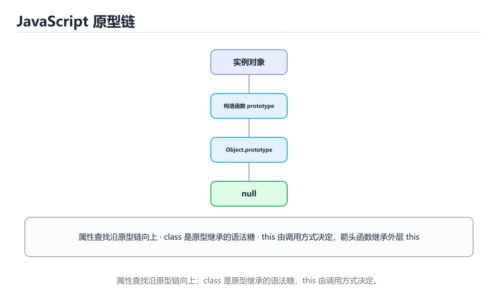

# 对象、原型与类

> 内容更新时间：2026-10-06 · 学习阶段：进阶 · 预计用时：50 分钟




## 本节知识框架

**课程定位**：所属分类为「JavaScript」，课程主题为「对象、原型与类」，学习阶段为「进阶」，建议用时 50 分钟。

**本课要解决的主问题**：对象操作、原型链、class 与继承、Map/Set 与 JSON。

| 学习层次 | 要回答的问题 | 完成判据 |
| --- | --- | --- |
| 概念层 | 「对象、原型与类」有哪些必须区分的对象与术语？ | 能用自己的话定义核心术语，并各举一个正例和一个反例。 |
| 机制层 | 这些对象按什么顺序发生作用，输入如何变成输出？ | 能画出或写出机制步骤，并说明每一步的失败条件。 |
| 应用层 | 什么场景适合使用「对象、原型与类」，什么场景不适合？ | 能给出一个真实场景、一个最小示例和一个边界案例。 |
| 性能层 | 时间、空间、吞吐或延迟受哪些量影响？ | 能说出复杂度或性能瓶颈的证据来源；没有证据时明确写“材料未提供”。 |
| 复习层 | 怎样确认自己不是只记住了结论？ | 能独立完成本课自测，并把错误定位到概念、机制、示例或边界。 |

### 阅读路线

1. 先读「核心概念定义」，建立「对象」等对象的精确定义。
2. 再读「原理与运行机制」，把定义串成可重复的过程。
3. 用「代码/协议/SQL 示例」验证过程，并只改一个条件观察结果变化。
4. 最后检查性能、易错点、知识关系与自测题，形成可复习的证据链。

**前置知识**：《函数、作用域与 this》

**学习位置**：本课位于《函数、作用域与 this》之后；如果前一课的自测不能通过，应先回补再继续。

**后续衔接**：下一课《数组与常用方法》会继续使用本课术语，学完后建议立即完成一次自测。

**教材衔接：学习目标**

- 能用自己的话解释对象、原型与类解决了什么问题，而不是只背术语。
- 能说清 「对象」、「原型」、「class」、「extends」 之间的关系，并分别举出一个例子。
- 能把 对象 放回「对象、原型与类」的知识体系，说明它和 原型 的边界。
- 能完成本课练习，并用验收标准检查自己的结果。

> 一句话摘要：对象操作、原型链、class 与继承、Map/Set 与 JSON。

**教材衔接：前置知识**

- 先完成上一课《函数、作用域与 this》；如果已经掌握，可以直接用本课练习自测。
- 本课阶段：进阶。建议先完成「函数、作用域与 this」，或确认自己能独立跑通正文里的 getPrototypeOf 示例。
- 开始前先复习：对象、原型、class。
- 看不懂就直接缩小例子：只保留 对象 相关的两行输入，跑通后再加回其余部分。

**教材衔接：本课小结**

对象是 JS 的核心结构，原型链决定属性查找。日常写 `class` + 解构 + 展开即可，遇到「属性从哪来」的问题再回想原型链。

## 核心概念定义

> 阅读约定：本课先给「对象、原型与类」相关术语的操作性定义与适用边界；正文里的口语化说法与定义冲突时，以定义和可复现示例为准。

| 术语 | 操作性定义 | 本课中的边界 |
| --- | --- | --- |
| Object.prototype | 访问属性时会沿原型链向上查找，直到 Object.prototype，仍找不到才返回 undefined。 | 仅在「对象、原型与类」明确给出的输入、版本与资源条件下成立。 |
| class | class 是原型继承的语法糖，但语义更清晰，extends 会自动维护原型链。 | 仅在「对象、原型与类」明确给出的输入、版本与资源条件下成立。 |
| JSON | 用对象、数组、字符串和数字等表示结构化数据的文本格式。 | 仅在「对象、原型与类」明确给出的输入、版本与资源条件下成立。 |
| 原型链 | 属性查找会沿原型向上追溯，class 只是原型继承的语法糖。 | 仅在「对象、原型与类」明确给出的输入、版本与资源条件下成立。 |

### 定义如何使用

在「对象、原型与类」中判断一个说法是否成立，先确认它使用的是哪个对象的定义，再检查输入规模、运行环境与失败路径。定义不是口号，而是后续推导、代码示例和自测题共享的约束。

**教材衔接：对象基础**

```javascript
const user = {
  name: 'tom',
  'favorite color': 'blue',
  greet() { return `你好 ${this.name}`; },
};

user.name;                      // 点号访问
user['favorite color'];         // 键含空格时用方括号
user.email = 'tom@example.com'; // 新增属性
delete user.email;              // 删除属性

Object.keys(user);              // 键数组
Object.entries(user);           // [[key, value], ...]
const copy = { ...user, city: '上海' };   // 浅拷贝 + 合并

const { name, age = 0 } = user;  // 解构 + 默认值
```

**教材衔接：对象操作速查**

| 目的 | 写法 | 说明 |
| --- | --- | --- |
| 读取可能不存在的属性 | `obj?.a?.b` | 短路返回 `undefined` |
| 取默认值 | `obj.a ?? "默认"` | 只有 `null` / `undefined` 才用默认值 |
| 解构并重命名 | `const { a: x, b = 1 } = obj` | 便于避免命名冲突 |
| 剩余属性 | `const { a, ...rest } = obj` | 常用于剔除字段 |
| 合并对象 | `{ ...a, ...b }` | 后面的同名字段覆盖前面 |
| 复制并改字段 | `{ ...user, name: "新名字" }` | 不可变更新的常用写法 |
| 安全修改嵌套字段 | `{ ...s, user: { ...s.user, age: 18 } }` | 逐层展开，避免直接改原对象 |
| 取键 / 值 / 键值对 | `Object.keys/values/entries` | 返回数组，可继续链式处理 |
| 转成 Map | `new Map(Object.entries(obj))` | 键可以是任意类型 |
| 冻结对象 | `Object.freeze(obj)` | 浅冻结，嵌套对象仍需处理 |
| 判断自有属性 | `Object.hasOwn(obj, "key")` | 比 `in` 更精确（不查原型链） |

**教材衔接：零基础详解：对象、原型与解构**

### 一句话说清它是什么

对象是「键值对的集合」，用来描述一个东西的多个属性。
JavaScript 的对象还很特别：**它通过原型链继承属性**，这是理解 `this`、`class`、继承的关键。

### 用生活比喻理解

| 概念 | 比喻 | 说明 |
| --- | --- | --- |
| 对象 | 一张信息卡 | 上面写着姓名、年龄等字段 |
| 属性 | 卡片上的条目 | `user.name` |
| 方法 | 卡片能做的事 | `user.greet()` |
| 原型 | 家族遗传 | 自己没有的属性，去祖先那里找 |
| 解构 | 按需摘取 | `const { name } = user` |

### 创建对象的四种写法

```javascript
// 1. 字面量：最常用
const user = { id: 1, name: "小明", greet() { return `你好，${this.name}`; } };

// 2. 构造函数
function Point(x, y) { this.x = x; this.y = y; }
const p = new Point(1, 2);

// 3. class 语法（本质仍是原型）
class Person {
  constructor(name) { this.name = name; }
  greet() { return `你好，${this.name}`; }
}

// 4. Object.create：显式指定原型
const base = { kind: "animal" };
const cat = Object.create(base);
```

### 属性访问与键的三种情况

```javascript
const user = { name: "小明", "user-id": 7 };

user.name;                  // 点号：键是合法标识符时用
user["user-id"];            // 方括号：键含横线、空格或来自变量
const key = "name";
user[key];                  // 动态键只能用方括号

user.age;                   // undefined，不报错
user.address?.city;         // 可选链，避免报错
user.age ?? 18;             // 空值合并给默认值
```

### 解构与展开

```javascript
const user = { id: 1, name: "小明", role: "admin" };

const { name, role = "guest" } = user;        // 解构 + 默认值
const { name: userName } = user;              // 改名
const { address: { city } = {} } = user;      // 嵌套解构并兜底

const copy = { ...user, role: "user" };       // 浅拷贝并覆盖字段
const merged = { ...defaults, ...options };   // 合并配置，后者优先
```

### 原型链：找不到就往上找

```javascript
const animal = { eats: true };
const rabbit = Object.create(animal);
rabbit.jumps = true;

console.log(rabbit.jumps);   // true，自己的属性
console.log(rabbit.eats);    // true，来自原型
console.log("eats" in rabbit);            // true，含原型链
console.log(Object.hasOwn(rabbit, "eats"));   // false，只查自己
```

属性查找顺序：。

### `this` 的四条规则

| 调用方式 | `this` 指向 |
| --- | --- |
| `obj.method()` | `obj` 本身 |
| `fn()` 直接调用 | 严格模式下是 `undefined` |
| `new Fn()` | 新建的对象 |
| 箭头函数 | 继承定义时的外层 `this`，不受调用方式影响 |

```javascript
const counter = {
  count: 0,
  inc() { this.count += 1; },                  // 正常：this 是 counter
};
counter.inc();

const bad = counter.inc;
// bad();   // 严格模式下报错，因为 this 丢了
const safe = counter.inc.bind(counter);        // 绑定后可以单独传
```

### 判断属性是否存在

| 写法 | 是否含原型 | 值为 0 或 "" 时的表现 |
| --- | --- | --- |
| `"k" in obj` | 含 | 正确返回 true |
| `Object.hasOwn(obj, "k")` | 只查自身 | 正确返回 true |
| `obj.k !== undefined` | 含（沿链） | 正确返回 true |
| `if (obj.k)` | 含 | **误判为 false** |

### 新手最容易踩的八个坑

| 坑 | 现象 | 正确做法 |
| --- | --- | --- |
| 用 `if (obj.k)` 判存在 | 0、空串被当成不存在 | 用 `in` 或 `Object.hasOwn` |
| 对象赋值当复制 | 改一处全变 | 用展开做浅拷贝 |
| 浅拷贝嵌套对象 | 内层仍互相影响 | 用 `structuredClone` |
| 方法被单独取出 | `this` 丢失 | 用 `bind` 或箭头函数 |
| 遍历时用 `for...in` | 拿到继承来的键 | 用 `Object.keys` 或 `entries` |
| 用对象当 Map | 键只能是字符串或 Symbol | 需要任意类型键就用 `Map` |
| 删除属性用 `= undefined` | 键还在 | 用 `delete obj.k` |
| 比较对象用 `===` | 比的是引用 | 逐字段比较或用 `JSON.stringify` |

### 手把手练习：合并配置与安全取值

```javascript
const defaults = { theme: "light", pageSize: 20, features: { dark: false } };
const userConfig = { pageSize: 50 };

const config = { ...defaults, ...userConfig };
console.log(config.pageSize);            // 50

// 嵌套合并要手动处理，展开是浅拷贝
const merged = {
  ...defaults,
  ...userConfig,
  features: { ...defaults.features, ...(userConfig.features ?? {}) },
};

// 安全取深层属性
const darkEnabled = merged?.features?.dark ?? false;
console.log(darkEnabled);

// 遍历并过滤
const entries = Object.entries(merged).filter(([, v]) => typeof v !== "object");
console.log(entries);
```

### 学完自测

- [ ] 能说出对象属性查找的顺序。
- [ ] 能解释 `in` 与 `Object.hasOwn` 的区别。
- [ ] 知道为什么展开运算符做的是浅拷贝。
- [ ] 能说出 `this` 在四种调用方式下的指向。
- [ ] 需要任意类型作键时，知道该用 `Map` 而不是对象。

## 原理与运行机制

### 机制总览

1. **建立输入**：把「Object.prototype」按本课定义整理成可观察、可重复的输入条件。
2. **执行转换**：围绕「class」执行本课的核心步骤；每一步都记录中间状态，避免只看最终输出。
3. **产生输出**：得到「JSON」后，用正文示例或协议/SQL 结果核对输出是否符合预期。
4. **改变一个条件**：只替换一个边界条件或环境参数，观察「对象、原型与类」的结论是否仍然成立。

| 阶段 | 关注对象 | 失败时应检查 |
| --- | --- | --- |
| 输入 | Object.prototype | 类型、范围、编码、版本或前置状态是否满足定义。 |
| 处理 | class | 顺序、可见性、锁、路由、事务或调度规则是否被破坏。 |
| 输出 | JSON | 结果是否可复现，错误是否被正确传播而不是被吞掉。 |

本课的机制结论要用「对象、原型与类」自己的示例验证。「对象、原型与类」没有给出某个数量级、吞吐或内存数据时，本课把该判断标为“材料未提供”，不从相邻主题外推。

**教材衔接：版本与时效**

- 运行时要同时考虑浏览器基线与 Node LTS；对象 的降级策略要写清楚。
- 升级「对象、原型与类」涉及的依赖前，先用 getPrototypeOf 复现当前行为，再逐项核对版本说明与破坏性变更。

### 升级检查清单

- 先固定当前版本，跑通全部示例与测验，再升级工具链。
- 一次只改一个版本条件，把 对象 相关的差异单独记成一条结论。
- 先回归 对象 与 原型 的默认行为和错误信息，再扩大测试范围。
- 升级完成后记录 对象 的新旧版本差异，并据此调整下次复核时间。

## 典型应用场景

| 场景 | 典型输入或前提 | 期望产物 |
| --- | --- | --- |
| 学习验证 | 使用本课最小示例和 对象、原型 | 能复现正文结论，并解释每一步。 |
| 工程落地 | 把「对象、原型与类」放入真实模块或服务边界 | 输出可观测、失败可定位、参数可配置。 |
| 故障排查 | 只改一个版本、规模、输入或依赖条件 | 能区分概念错误、实现错误和环境差异。 |

判断「对象、原型与类」的场景是否成立，标准是能否写出输入、处理、输出和失败路径；材料中没有出现的数据在本课标注为“材料未提供”，不用推测替代证据。

**课程内置实验入口**：`sandbox:javascript`，用于动手验证《对象、原型与类》的机制；实验结论不替代概念定义与复杂度分析。

## 代码/协议/SQL 示例

### 最小可验证示例

下面保留《对象、原型与类》原文中的最小示例。先预测《对象、原型与类》示例的输出，再按正文步骤运行或推演；示例依赖外部环境时，同时记录版本与输入。

```javascript
const user = {
  name: 'tom',
  'favorite color': 'blue',
  greet() { return `你好 ${this.name}`; },
};

user.name;                      // 点号访问
user['favorite color'];         // 键含空格时用方括号
user.email = 'tom@example.com'; // 新增属性
delete user.email;              // 删除属性

Object.keys(user);              // 键数组
Object.entries(user);           // [[key, value], ...]
const copy = { ...user, city: '上海' };   // 浅拷贝 + 合并

const { name, age = 0 } = user;  // 解构 + 默认值
```

**教材衔接：原型链**

```javascript
const animal = { speak() { return '...'; } };
const cat = Object.create(animal);

cat.speak();                       // 沿原型链找到 speak
Object.getPrototypeOf(cat) === animal;
cat.hasOwnProperty('speak');       // false：属性在原型上
```

访问属性时会沿原型链向上查找，直到 `Object.prototype`，仍找不到才返回 `undefined`。

**教材衔接：class 语法**

```javascript
class Animal {
  #secret = 'private';            // 私有字段
  static category = 'animal';

  constructor(name) { this.name = name; }
  speak() { return `${this.name} 发出声音`; }
  get label() { return this.name.toUpperCase(); }
}

class Dog extends Animal {
  constructor(name, breed) {
    super(name);                  // 必须先调用 super
    this.breed = breed;
  }
  speak() { return `${super.speak()}：汪`; }
}
```

`class` 是原型继承的语法糖，但语义更清晰，`extends` 会自动维护原型链。

**教材衔接：Map、Set 与 JSON**

```javascript
const map = new Map([['a', 1]]);   // 键可以是任意类型，保留插入顺序
const set = new Set([1, 1, 2]);    // 自动去重，size = 2

JSON.stringify({ a: 1 });          // 对象 → 字符串
JSON.parse('{"a":1}');             // 字符串 → 对象
Object.freeze(obj);                // 冻结对象
```

**教材衔接：class 与原型速查**

| 概念 | 说明 |
| --- | --- |
| `class Dog extends Animal` | 语法糖，底层仍是原型链 |
| `super()` | 子类构造器中必须先调用，才能使用 `this` |
| `#field` | 真正的私有字段，外部无法访问 |
| `static` | 挂在类本身而非实例上 |
| `get` / `set` | 属性访问器，可做校验 |
| `instanceof` | 沿原型链判断类型 |
| `Object.getPrototypeOf(obj)` | 查看原型对象 |
| `obj.hasOwnProperty(k)` | 是否为自身属性（推荐 `Object.hasOwn`） |

```js
class Counter {
  #count = 0;                       // 私有字段
  static created = 0;

  constructor() {
    Counter.created += 1;
  }

  increment() {
    this.#count += 1;
    return this;
  }

  get value() {
    return this.#count;
  }
}

new Counter().increment().increment().value;   // 2，支持链式调用
```

## 时间/空间复杂度或性能分析

**复杂度证据**：「对象、原型与类」的现有材料没有给出渐近时间或空间复杂度的明确结论，本课只做定性检查，不补写未经验证的 $O$ 记号。

| 维度 | 本课关注点 | 判断依据 |
| --- | --- | --- |
| 时间/延迟 | 「对象、原型与类」的主要步骤是否会随输入规模、并发度或网络往返增长。 | 以正文复杂度、基准数据或可重复测量为准。 |
| 空间/内存 | 中间状态、缓存、副本、连接或索引是否随规模增长。 | 记录峰值内存与数据副本，不只看最终结果。 |
| 吞吐/资源 | 版本、调度、锁、IO、序列化或协议开销是否成为瓶颈。 | 固定环境做对照实验，改变一个变量。 |

评估「对象、原型与类」时要区分“正确性成立”和“性能达标”两件事；材料没有给出基准时，本课只保留量级来源与测量方法，不写不可验证的绝对数字。

## 常见误区与易错点

> 复核《对象、原型与类》的易错点时，优先保留原文的错误表、故障现场与排错路径；每条修正都要能用本课示例复验。

| 易错点 | 常见表现 | 正确做法 |
| --- | --- | --- |
| 只背结论 | 能复述「对象、原型与类」的定义，却说不清输入、输出与边界。 | 回到机制步骤，用最小示例逐一验证。 |
| 混淆相邻概念 | 把本课对象与相邻主题的对象当成同一类。 | 先比较定义、资源归属、生命周期和失败模式。 |
| 忽略版本与环境 | 在开发机通过后直接外推到生产环境。 | 固定版本、输入和资源条件，再记录可复现结果。 |

**教材衔接：常见错误与排查**

| 容易写错的做法 | 实际现象 | 原因与正确做法 |
| --- | --- | --- |
| `{ a: 1 } + { b: 2 }` | `"[object Object][object Object]"` | 对象相加会转字符串，用 `{ ...a, ...b }` |
| `Object.keys(null)` | `TypeError` | 先判空：`obj ? Object.keys(obj) : []` |
| 用 `for...in` 遍历对象 | 会带上原型链上的可枚举属性 | 用 `Object.entries` 或 `Object.hasOwn` 过滤 |
| 直接改 `state.user.name` | 引用未变，React 不刷新 | 逐层展开生成新对象，或用不可变库 |
| `const obj = { a: 1 }; Object.freeze(obj); obj.a = 2` | 静默失败（严格模式抛错） | 冻结只作用于当前层，嵌套结构要递归处理 |
| 用对象当 Map | 键会被转成字符串，`1` 与 `"1"` 冲突 | 需要任意键类型时用 `new Map()` |
| `JSON.parse(JSON.stringify(obj))` 深拷贝 | 丢失 `Date`、`undefined`、函数 | 需要完整深拷贝时用 `structuredClone` |
| `obj.constructor` 判断类型 | 容易被伪造 | 用 `instanceof` 或 `Object.getPrototypeOf` |
| 展开运算符拷贝嵌套对象 | 内层仍是共享引用 | 浅拷贝只复制第一层，嵌套要另行处理 |

**教材衔接：故障现场**

### 现场 1：{ a: 1 } + { b: 2 }

**症状**：在《对象、原型与类》的复现场景中，"[object Object][object Object]"。

**根因**：触发点是把“{ a: 1 } + { b: 2 }”当成安全做法。它没有满足《对象、原型与类》要求的前提，因此先表现为“"[object Object][object Object]"”；排查时先完整复现这一段，再核对输入、配置与依赖。

**修复**：针对《对象、原型与类》的问题，对象相加会转字符串，用 { ...a, ...b }。

**验证**：在《对象、原型与类》中按“对象相加会转字符串，用 { ...a, ...b }”调整后，从“{ a: 1 } + { b: 2 }”的触发条件重放同一条路径，确认“"[object Object][object Object]"”不再出现，并补一个相邻边界用例检查没有引入新问题。

### 现场 2：Object.keys(null)

**症状**：在《对象、原型与类》的复现场景中，TypeError。

**根因**：触发点是把“Object.keys(null)”当成安全做法。它没有满足《对象、原型与类》要求的前提，因此先表现为“TypeError”；排查时先完整复现这一段，再核对输入、配置与依赖。

**修复**：针对《对象、原型与类》的问题，先判空：obj ? Object.keys(obj) : []。

**验证**：在《对象、原型与类》中按“先判空：obj ? Object.keys(obj) : []”调整后，从“Object.keys(null)”的触发条件重放同一条路径，确认“TypeError”不再出现，并补一个相邻边界用例检查没有引入新问题。

### 现场 3：用 for...in 遍历对象

**症状**：在《对象、原型与类》的复现场景中，会带上原型链上的可枚举属性。

**根因**：“会带上原型链上的可枚举属性”只是表层结果。向上追溯会落到“用 for...in 遍历对象”这一步，因为它省略了《对象、原型与类》的约束，使实现行为和预期模型发生了偏离。

**修复**：针对《对象、原型与类》的问题，用 Object.entries 或 Object.hasOwn 过滤。

**验证**：在《对象、原型与类》中按“用 Object.entries 或 Object.hasOwn 过滤”调整后，从“用 for...in 遍历对象”的触发条件重放同一条路径，确认“会带上原型链上的可枚举属性”不再出现，并补一个相邻边界用例检查没有引入新问题。

## 与其他知识点的关系

| 关系 | 课程 | 为什么 |
| --- | --- | --- |
| 先修 | 《函数、作用域与 this》 | 本课会直接使用它的概念或操作前提。 |
| 关联 | 《数组与常用方法》 | 用于横向比较或把本课结论迁移到相邻主题。 |
| 关联 | 《类与对象》 | 用于横向比较或把本课结论迁移到相邻主题。 |
| 前置顺序 | 《函数、作用域与 this》 | 同分类中安排在本课之前，建议先完成其自测。 |
| 后续顺序 | 《数组与常用方法》 | 同分类中安排在本课之后，会继续使用本课术语。 |

把「对象、原型与类」放回知识体系时，不只要记住“前面学过什么”，还要说明两个主题在输入、机制、资源边界和失败模式上的差异。这样才能把单课知识迁移到项目、排障和后续课程。

## 自测题与参考答案

> 先独立作答《对象、原型与类》的自测题，再对照答案与解析；每处判断都要能在本课正文或示例中找到依据。

### 自测 1

围绕“对象、原型与类”中的 对象、原型、class，下列哪两项是本课强调的实践判断？

A. 学习 对象 时要同时说明输入、输出和失败路径，不能只看正常流程
B. 只要 对象 的常规示例通过，就可以跳过边界与异常路径
C. 验证 原型 时要固定版本并覆盖边界输入，结论才可复现
D. 把 原型 的单次运行结果当成所有版本和规模都成立

**参考答案**：学习 对象 时要同时说明输入、输出和失败路径，不能只看正常流程；验证 原型 时要固定版本并覆盖边界输入，结论才可复现

**解析**：本课把对象、原型与类拆成概念、示例与故障现场三部分，因此判断 对象 时必须同时交代输入、输出和失败路径，这使“学习 对象 时要同时说明输入、输出和失败路径，不能只看正常流程”成立。在对象、原型与类里，判断 原型 时要固定版本与边界输入，所以“验证 原型 时要固定版本并覆盖边界输入，结论才可复现”才可复现。

### 自测 2

访问对象不存在的属性时，JS 会？

A. 返回 null
B. 自动创建属性
C. 立即报错
D. 沿原型链向上查找

**参考答案**：沿原型链向上查找

**解析**：在「对象、原型与类」里，沿原型链向上查找。属性查找会沿原型链一直到 Object.prototype，这也是原型继承的核心机制。在「对象、原型与类」里判断这道题，要把对象、原型、class的条件、过程与失败路径逐项对齐，换成“访问对象不存在的属性时”这个场景，只有满足前提的结论才成立。

### 自测 3

这段 JavaScript 代码是「对象、原型与类」的示例片段，下面哪一项描述与它一致？

```javascript
const map = new Map([['a', 1]]);   // 键可以是任意类型，保留插入顺序
const set = new Set([1, 1, 2]);    // 自动去重，size = 2

JSON.stringify({ a: 1 });          // 对象 → 字符串
JSON.parse('{"a":1}');             // 字符串 → 对象
Object.freeze(obj);                // 冻结对象
```

A. 这段代码包含异常处理分支，失败时会走专门的补救路径。
B. 这段代码会读取外部输入，结果依赖传入的数据。
C. 这段代码只做静态声明，没有循环、分支或可观察输出。
D. 这段代码把主要逻辑封装在函数或方法里，需要被调用才会执行。

**参考答案**：这段代码只做静态声明，没有循环、分支或可观察输出。

**解析**：在「对象、原型与类」里，题干的正确项是这段代码只做静态声明，没有循环、分支或可观察输出，在「对象、原型与类」里它只能证明对象相关约束存在，不能替代真实运行证据。把输入或边界换成空值、极值或失败情况后，结论要以「对象、原型与类」的实际运行结果为准。「对象、原型与类」要求先交代对象、原型、class的前提再下结论，所以“这段代码只做静态声明，没有循环”只在题干“这段 JavaScript 代码是对象、原型与类的示例片段”给定的条件下成立。

**教材衔接：复习与自测**

- [ ] 会用可选链与 `??` 处理缺失字段。
- [ ] 知道展开运算符是浅拷贝，能写出不可变更新的写法。
- [ ] 需要任意类型键时使用 `Map` 而不是普通对象。
- [ ] 记得子类构造器中先调用 `super()`。
- [ ] 用 `Object.hasOwn` 判断自有属性，避免原型链干扰。

**教材衔接：动手练习**

> 本课练习重点：围绕「对象、原型、class」完成复述、实验和交付，每个结果都要能被别人检查。

先复现 原型 的时序问题，再引入取消或超时机制。

### 练习 1：建立心智模型（10 分钟）

合上教程，用 3～5 句话回答：

1. 对象、原型与类解决了什么问题？
2. 如果没有它，会出现什么具体后果？
3. 它和「原型」是什么关系？

验收标准：说明 对象 与 原型 的分工，并写出一个失效场景。

### 练习 2：做一次可控实验（20 分钟）

从正文中选一个最小示例，完成以下操作：

1. 先预测修改一个参数、输入或步骤后的结果。
2. 再实际执行或逐步推演，记录真实结果。
3. 如果结果与预测不同，写出差异原因。

**验收标准**：先在「对象基础」里找一个可运行的最小输入，再按五步法记录对象的影响；预测与结果不一致时补写被忽略的前提。

### 练习 3：交付一个小结果（30 分钟）

在浏览器控制台或 Node.js 中写一个 对象 的最小示例，列出 3 组输入输出。

任务要求：

- 结果必须能被别人检查，不能只写“我已经理解了”。
- 至少覆盖「对象」和「原型」两个关键词。
- 写出 1 个仍然不确定的问题，以及下一步如何验证。

> 提示：时间有限时优先做练习 1 和练习 2；练习 3 可以拆成两次完成。

**教材衔接：可运行练习**

### 任务 1：先跑通，再解释

```javascript
const animal = { eats: true };
const rabbit = Object.create(animal);
rabbit.jumps = true;

console.log(rabbit.jumps);   // true，自己的属性
console.log(rabbit.eats);    // true，来自原型
console.log("eats" in rabbit);            // true，含原型链
console.log(Object.hasOwn(rabbit, "eats"));   // false，只查自己
```

### 任务 2：只改一个条件

把「对象、原型与类」的最小示例复制一份，只改一个条件再跑一次：

- 改动点：只调整 getPrototypeOf 的一个参数，其余条件一律不动。
- 预测：先写下「对象、原型与类」在改动后的输出或错误信息，再运行。
- 记录：对照改动前后的结果，指出差异出在哪一步。
- 验收：换回原条件能复现原结果，改动只影响对象。

### 任务 3：迁移到自己的数据

换一个 原型 场景重做一次，确认结论不是只对示例数据成立。

**教材衔接：本课复习清单**

离开本课前，逐项确认：

- [ ] 不看解析，能说出「class 子类构造器中必须先调用？」的判断依据。
- [ ] 不看解析，能说出「访问对象不存在的属性时，JS 会？」的判断依据。
- [ ] 不看解析，能说出「相比普通对象，Map 的优势是？」的判断依据。
- [ ] 不看解析，能说出「Object.freeze(obj) 与 const obj 的区别是？」的判断依据。
- [ ] 用 对象 构造一个正常输入和一个边界输入，分别记录输出与判断依据。
- [ ] 把本课最容易混淆的两个概念写成一句话对照。

| 复盘项 | 记录 |
| --- | --- |
| 已经能独立解释的考点 |  |
| 仍然说不清的概念 |  |
| 下一步验证动作 |  |

---

## 术语速查

| 术语 | 一句话说明 |
| --- | --- |
| `Object.prototype` | 访问属性时会沿原型链向上查找，直到 `Object.prototype`，仍找不到才返回 `undefined`。 |
| `class` | `class` 是原型继承的语法糖，但语义更清晰，`extends` 会自动维护原型链。 |
| `JSON` | 用对象、数组、字符串和数字等表示结构化数据的文本格式。 |
| `原型链` | 属性查找会沿原型向上追溯，class 只是原型继承的语法糖。 |

## 考点精讲

### 考点 1：多选辨析·对象

- **题目**：围绕“对象、原型与类”中的 对象、原型、class，下列哪两项是本课强调的实践判断？
- **判断依据**：本课把对象、原型与类拆成概念、示例与故障现场三部分，因此判断 对象 时必须同时交代输入、输出和失败路径，这使“学习 对象 时要同时说明输入、输出和失败路径，不能只看正常流程”成立。在对象、原型与类里，判断 原型 时要固定版本与边界输入，所以“验证 原型 时要固定版本并覆盖边界输入，结论才可复现”才可复现。

### 考点 2：概念判断·对象

- **题目**：访问对象不存在的属性时，JS 会？
- **判断依据**：在「对象、原型与类」里，沿原型链向上查找。属性查找会沿原型链一直到 Object.prototype，这也是原型继承的核心机制。在「对象、原型与类」里判断这道题，要把对象、原型、class的条件、过程与失败路径逐项对齐，换成“访问对象不存在的属性时”这个场景，只有满足前提的结论才成立。

### 考点 3：概念判断·对象

- **题目**：相比普通对象，Map 的优势是？
- **判断依据**：在「对象、原型与类」里，键可以是任意类型且提供 size 与迭代。普通对象的键只能是字符串或 Symbol。这道题的关键在「对象、原型与类」的对象、原型、class：先确认题干“相比普通对象”问的是哪一步，再排除偷换前提的选项。在「对象、原型与类」里，回到对象、原型、class本身再看一遍：只有“键可以是任意类型且提供 size 与迭代”与题干“相比普通对象”的前提一致，结论才成立。

### 考点 4：代码补全·对象

- **题目**：这段 JavaScript 代码是「对象、原型与类」的示例片段，下面哪一项描述与它一致？
- **判断依据**：在「对象、原型与类」里，题干的正确项是这段代码只做静态声明，没有循环、分支或可观察输出，在「对象、原型与类」里它只能证明对象相关约束存在，不能替代真实运行证据。把输入或边界换成空值、极值或失败情况后，结论要以「对象、原型与类」的实际运行结果为准。「对象、原型与类」要求先交代对象、原型、class的前提再下结论，所以“这段代码只做静态声明，没有循环”只在题干“这段 JavaScript 代码是对象、原型与类的示例片段”给定的条件下成立。

### 考点 5：概念判断·对象

- **题目**：const { a = 1 } = { a: undefined } 之后 a 的值是？
- **判断依据**：在「对象、原型与类」里，1，只有 undefined 才触发默认值；解构默认值在取到的值为 undefined（属性缺失也算）时生效，取到 null 不会触发默认值。把输入换成 null、0 或缺失属性各跑一次，就能确认只有 undefined 会走到默认值这条分支。“const”与「对象、原型与类」的术语表相呼应，只有符合对象、原型、class 约束的结论才由正文支持。

### 考点 6：填空·对象

- **题目**：补全代码：「对象、原型与类」示例中，下面这行代码缺少哪个关键字或函数名？请填入 ____。 `Object.____(cat) === animal;`
- **判断依据**：空格应填写「getPrototypeOf」、「getprototypeof」。在「对象、原型与类」里判断这道题，要把对象、原型、class的条件、过程与失败路径逐项对齐，换成“补全代码”这个场景，只有满足前提的结论才成立。回到「对象、原型与类」的正文示例，用“补全代码”走一遍对象、原型、class的完整流程，能复现的结论才可以保留。

## English Overview

**Title:** Objects, Prototypes & Classes

**Summary:** Objects, prototype chain, classes, Map/Set and JSON.

**Category:** JavaScript
**Level:** 进阶
**Key terms:** 对象, 原型, class, extends, Map, JSON

## 内容元数据

- 内容版本：v2.0
- 最后更新：2026-10-06
- 学习阶段：进阶
- 适用环境：Node.js 22+ / 现代浏览器
；本课聚焦 对象。
- 内容来源：内置结构化课程与工程实践整理
- 相关主题：对象、原型、class、extends、Map、JSON
- 质量版本：P0 测验标准 + P1 覆盖扩展 + P2 体验补全

## 参考资料与复核

- 最后复核：2026-10-04
- 下次复核：2027-05-17
- 复核范围：版本兼容、API 行为、安全建议与工程实践
- 来源性质：官方文档、标准或权威教材；正文为离线教学重组

| 参考资料 | 本课用途 |
| --- | --- |
| [MDN JavaScript 指南](https://developer.mozilla.org/docs/Web/JavaScript/Guide) | 语言基础与浏览器 API |
| [MDN Fetch API](https://developer.mozilla.org/docs/Web/API/Fetch_API) | 网络请求与响应处理 |
| [Node 事件循环](https://nodejs.org/en/learn/asynchronous-work/event-loop-timers-and-nexttick) | 事件循环与异步顺序 |

> 「对象、原型与类」的链接用于离线阅读后的延伸核对；App 不会自动联网。
