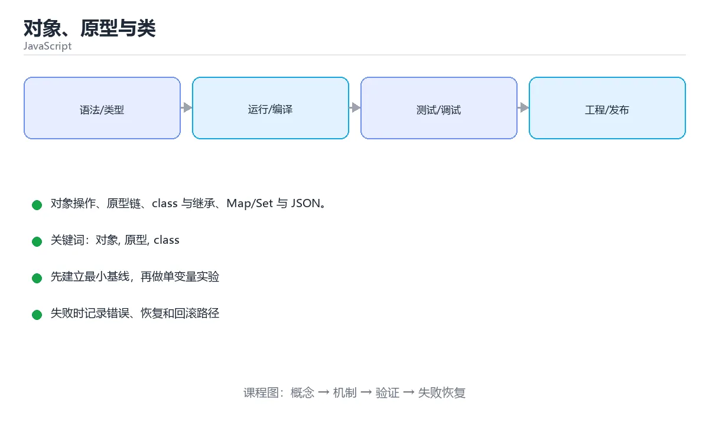

# 对象、原型与类



> 内容更新时间：2026-10-03 · 学习阶段：进阶 · 预计用时：15 分钟

## 学习目标

- 能用自己的话解释「对象、原型与类」解决了什么问题，而不是只背术语。
- 能说清 「对象」、「原型」、「class」、「extends」 之间的关系，并分别举出一个例子。
- 能把本课知识放回「JavaScript」的知识体系，说明它和相邻主题的边界。
- 能完成本课练习，并用验收标准检查自己的结果。

> 一句话摘要：对象操作、原型链、class 与继承、Map/Set 与 JSON。

## 前置知识

- 先完成上一课《函数、作用域与 this》；如果已经掌握，可以直接用本课练习自测。
- 本课阶段：进阶。建议先掌握同一分类的基础课程，并能独立运行正文中的最小示例。
- 开始前先复习：对象、原型、class。
- 如果某一步看不懂，先记录具体卡点，完成练习后再回头读一遍。


## 对象基础

```javascript
const user = {
  name: 'tom',
  'favorite color': 'blue',
  greet() { return `你好 ${this.name}`; },
};

user.name;                      // 点号访问
user['favorite color'];         // 键含空格时用方括号
user.email = 'tom@example.com'; // 新增属性
delete user.email;              // 删除属性

Object.keys(user);              // 键数组
Object.entries(user);           // [[key, value], ...]
const copy = { ...user, city: '上海' };   // 浅拷贝 + 合并

const { name, age = 0 } = user;  // 解构 + 默认值
```

## 原型链

```javascript
const animal = { speak() { return '...'; } };
const cat = Object.create(animal);

cat.speak();                       // 沿原型链找到 speak
Object.getPrototypeOf(cat) === animal;
cat.hasOwnProperty('speak');       // false：属性在原型上
```

访问属性时会沿原型链向上查找，直到 `Object.prototype`，仍找不到才返回 `undefined`。

## class 语法

```javascript
class Animal {
  #secret = 'private';            // 私有字段
  static category = 'animal';

  constructor(name) { this.name = name; }
  speak() { return `${this.name} 发出声音`; }
  get label() { return this.name.toUpperCase(); }
}

class Dog extends Animal {
  constructor(name, breed) {
    super(name);                  // 必须先调用 super
    this.breed = breed;
  }
  speak() { return `${super.speak()}：汪`; }
}
```

`class` 是原型继承的语法糖，但语义更清晰，`extends` 会自动维护原型链。

## Map、Set 与 JSON

```javascript
const map = new Map([['a', 1]]);   // 键可以是任意类型，保留插入顺序
const set = new Set([1, 1, 2]);    // 自动去重，size = 2

JSON.stringify({ a: 1 });          // 对象 → 字符串
JSON.parse('{"a":1}');             // 字符串 → 对象
Object.freeze(obj);                // 冻结对象
```

## 本课小结
对象是 JS 的核心结构，原型链决定属性查找。日常写 `class` + 解构 + 展开即可，遇到「属性从哪来」的问题再回想原型链。


## 对象操作速查

| 目的 | 写法 | 说明 |
| --- | --- | --- |
| 读取可能不存在的属性 | `obj?.a?.b` | 短路返回 `undefined` |
| 取默认值 | `obj.a ?? "默认"` | 只有 `null` / `undefined` 才用默认值 |
| 解构并重命名 | `const { a: x, b = 1 } = obj` | 便于避免命名冲突 |
| 剩余属性 | `const { a, ...rest } = obj` | 常用于剔除字段 |
| 合并对象 | `{ ...a, ...b }` | 后面的同名字段覆盖前面 |
| 复制并改字段 | `{ ...user, name: "新名字" }` | 不可变更新的常用写法 |
| 安全修改嵌套字段 | `{ ...s, user: { ...s.user, age: 18 } }` | 逐层展开，避免直接改原对象 |
| 取键 / 值 / 键值对 | `Object.keys/values/entries` | 返回数组，可继续链式处理 |
| 转成 Map | `new Map(Object.entries(obj))` | 键可以是任意类型 |
| 冻结对象 | `Object.freeze(obj)` | 浅冻结，嵌套对象仍需处理 |
| 判断自有属性 | `Object.hasOwn(obj, "key")` | 比 `in` 更精确（不查原型链） |

## class 与原型速查

| 概念 | 说明 |
| --- | --- |
| `class Dog extends Animal` | 语法糖，底层仍是原型链 |
| `super()` | 子类构造器中必须先调用，才能使用 `this` |
| `#field` | 真正的私有字段，外部无法访问 |
| `static` | 挂在类本身而非实例上 |
| `get` / `set` | 属性访问器，可做校验 |
| `instanceof` | 沿原型链判断类型 |
| `Object.getPrototypeOf(obj)` | 查看原型对象 |
| `obj.hasOwnProperty(k)` | 是否为自身属性（推荐 `Object.hasOwn`） |

```js
class Counter {
  #count = 0;                       // 私有字段
  static created = 0;

  constructor() {
    Counter.created += 1;
  }

  increment() {
    this.#count += 1;
    return this;
  }

  get value() {
    return this.#count;
  }
}

new Counter().increment().increment().value;   // 2，支持链式调用
```

## 常见错误对照表

| 容易写错的做法 | 实际现象 | 原因与正确做法 |
| --- | --- | --- |
| `{ a: 1 } + { b: 2 }` | `"[object Object][object Object]"` | 对象相加会转字符串，用 `{ ...a, ...b }` |
| `Object.keys(null)` | `TypeError` | 先判空：`obj ? Object.keys(obj) : []` |
| 用 `for...in` 遍历对象 | 会带上原型链上的可枚举属性 | 用 `Object.entries` 或 `Object.hasOwn` 过滤 |
| 直接改 `state.user.name` | 引用未变，React 不刷新 | 逐层展开生成新对象，或用不可变库 |
| `const obj = { a: 1 }; Object.freeze(obj); obj.a = 2` | 静默失败（严格模式抛错） | 冻结只作用于当前层，嵌套结构要递归处理 |
| 用对象当 Map | 键会被转成字符串，`1` 与 `"1"` 冲突 | 需要任意键类型时用 `new Map()` |
| `JSON.parse(JSON.stringify(obj))` 深拷贝 | 丢失 `Date`、`undefined`、函数 | 需要完整深拷贝时用 `structuredClone` |
| `obj.constructor` 判断类型 | 容易被伪造 | 用 `instanceof` 或 `Object.getPrototypeOf` |
| 展开运算符拷贝嵌套对象 | 内层仍是共享引用 | 浅拷贝只复制第一层，嵌套要另行处理 |

## 自测清单

- [ ] 会用可选链与 `??` 处理缺失字段。
- [ ] 知道展开运算符是浅拷贝，能写出不可变更新的写法。
- [ ] 需要任意类型键时使用 `Map` 而不是普通对象。
- [ ] 记得子类构造器中先调用 `super()`。
- [ ] 用 `Object.hasOwn` 判断自有属性，避免原型链干扰。


## 零基础详解：对象、原型与解构

### 一句话说清它是什么

对象是「键值对的集合」，用来描述一个东西的多个属性。
JavaScript 的对象还很特别：**它通过原型链继承属性**，这是理解 `this`、`class`、继承的关键。

### 用生活比喻理解

| 概念 | 比喻 | 说明 |
| --- | --- | --- |
| 对象 | 一张信息卡 | 上面写着姓名、年龄等字段 |
| 属性 | 卡片上的条目 | `user.name` |
| 方法 | 卡片能做的事 | `user.greet()` |
| 原型 | 家族遗传 | 自己没有的属性，去祖先那里找 |
| 解构 | 按需摘取 | `const { name } = user` |

### 创建对象的四种写法

```javascript
// 1. 字面量：最常用
const user = { id: 1, name: "小明", greet() { return `你好，${this.name}`; } };

// 2. 构造函数
function Point(x, y) { this.x = x; this.y = y; }
const p = new Point(1, 2);

// 3. class 语法（本质仍是原型）
class Person {
  constructor(name) { this.name = name; }
  greet() { return `你好，${this.name}`; }
}

// 4. Object.create：显式指定原型
const base = { kind: "animal" };
const cat = Object.create(base);
```

### 属性访问与键的三种情况

```javascript
const user = { name: "小明", "user-id": 7 };

user.name;                  // 点号：键是合法标识符时用
user["user-id"];            // 方括号：键含横线、空格或来自变量
const key = "name";
user[key];                  // 动态键只能用方括号

user.age;                   // undefined，不报错
user.address?.city;         // 可选链，避免报错
user.age ?? 18;             // 空值合并给默认值
```

### 解构与展开

```javascript
const user = { id: 1, name: "小明", role: "admin" };

const { name, role = "guest" } = user;        // 解构 + 默认值
const { name: userName } = user;              // 改名
const { address: { city } = {} } = user;      // 嵌套解构并兜底

const copy = { ...user, role: "user" };       // 浅拷贝并覆盖字段
const merged = { ...defaults, ...options };   // 合并配置，后者优先
```

### 原型链：找不到就往上找

```javascript
const animal = { eats: true };
const rabbit = Object.create(animal);
rabbit.jumps = true;

console.log(rabbit.jumps);   // true，自己的属性
console.log(rabbit.eats);    // true，来自原型
console.log("eats" in rabbit);            // true，含原型链
console.log(Object.hasOwn(rabbit, "eats"));   // false，只查自己
```

属性查找顺序：**自己 → 原型 → 原型的原型 → … → null**。

### `this` 的四条规则

| 调用方式 | `this` 指向 |
| --- | --- |
| `obj.method()` | `obj` 本身 |
| `fn()` 直接调用 | 严格模式下是 `undefined` |
| `new Fn()` | 新建的对象 |
| 箭头函数 | 继承定义时的外层 `this`，不受调用方式影响 |

```javascript
const counter = {
  count: 0,
  inc() { this.count += 1; },                  // 正常：this 是 counter
};
counter.inc();

const bad = counter.inc;
// bad();   // 严格模式下报错，因为 this 丢了
const safe = counter.inc.bind(counter);        // 绑定后可以单独传
```

### 判断属性是否存在

| 写法 | 是否含原型 | 值为 0 或 "" 时的表现 |
| --- | --- | --- |
| `"k" in obj` | 含 | 正确返回 true |
| `Object.hasOwn(obj, "k")` | 只查自身 | 正确返回 true |
| `obj.k !== undefined` | 含（沿链） | 正确返回 true |
| `if (obj.k)` | 含 | **误判为 false** |

### 新手最容易踩的八个坑

| 坑 | 现象 | 正确做法 |
| --- | --- | --- |
| 用 `if (obj.k)` 判存在 | 0、空串被当成不存在 | 用 `in` 或 `Object.hasOwn` |
| 对象赋值当复制 | 改一处全变 | 用展开做浅拷贝 |
| 浅拷贝嵌套对象 | 内层仍互相影响 | 用 `structuredClone` |
| 方法被单独取出 | `this` 丢失 | 用 `bind` 或箭头函数 |
| 遍历时用 `for...in` | 拿到继承来的键 | 用 `Object.keys` 或 `entries` |
| 用对象当 Map | 键只能是字符串或 Symbol | 需要任意类型键就用 `Map` |
| 删除属性用 `= undefined` | 键还在 | 用 `delete obj.k` |
| 比较对象用 `===` | 比的是引用 | 逐字段比较或用 `JSON.stringify` |

### 手把手练习：合并配置与安全取值

```javascript
const defaults = { theme: "light", pageSize: 20, features: { dark: false } };
const userConfig = { pageSize: 50 };

const config = { ...defaults, ...userConfig };
console.log(config.pageSize);            // 50

// 嵌套合并要手动处理，展开是浅拷贝
const merged = {
  ...defaults,
  ...userConfig,
  features: { ...defaults.features, ...(userConfig.features ?? {}) },
};

// 安全取深层属性
const darkEnabled = merged?.features?.dark ?? false;
console.log(darkEnabled);

// 遍历并过滤
const entries = Object.entries(merged).filter(([, v]) => typeof v !== "object");
console.log(entries);
```

### 学完自测

- [ ] 能说出对象属性查找的顺序。
- [ ] 能解释 `in` 与 `Object.hasOwn` 的区别。
- [ ] 知道为什么展开运算符做的是浅拷贝。
- [ ] 能说出 `this` 在四种调用方式下的指向。
- [ ] 需要任意类型作键时，知道该用 `Map` 而不是对象。

## 动手练习


> 本课练习重点：围绕「对象、原型、class」完成复述、实验和交付，每个结果都要能被别人检查。

先在 Node 或浏览器复现行为，再改写异步与错误路径，最后补测试。

### 练习 1：建立心智模型（10 分钟）

合上教程，用 3～5 句话回答：

1. 「对象、原型与类」解决了什么问题？
2. 如果没有它，会出现什么具体后果？
3. 它和「原型」是什么关系？

**验收标准**：至少出现一个本课关键词，并写出一个反例、边界条件或失效场景。

### 练习 2：做一次可控实验（20 分钟）

从正文中选一个最小示例，完成以下操作：

1. 先预测修改一个参数、输入或步骤后的结果。
2. 再实际执行或逐步推演，记录真实结果。
3. 如果结果与预测不同，写出差异原因。

**验收标准**：留下「原例 → 改动 → 预测 → 结果 → 原因」五步记录。

### 练习 3：交付一个小结果（30 分钟）

在浏览器控制台或 Node.js 中写一个最小示例，列出至少 3 组输入输出。

任务要求：

- 结果必须能被别人检查，不能只写“我已经理解了”。
- 至少覆盖「对象」和「原型」两个关键词。
- 写出 1 个仍然不确定的问题，以及下一步如何验证。

> 提示：时间有限时优先做练习 1 和练习 2；练习 3 可以拆成两次完成。


## 考点精讲：把测验题还原成判断过程

本课有 5 个判断点。先自己作答，再看「判断依据」；如果结论正确但理由不完整，回到正文对应章节补足概念。

### 考点 1：class 子类构造器中必须先调用？

- **正确判断**：super()
- **判断依据**：在调用 super() 之前不能使用 this，因为父类尚未初始化实例。其他选项：派生类必须先调用 super() 才能使用 this，否则会抛 ReferenceError。正确项「super()」描述正确，能够解释题干场景中的现象与结果。错误项「this.init()」与课程给出的定义相冲突，不能回答题目所问。错误项「Object.create()」只看到了表面现象，没有解释题干真正考查的机制。错误项「new.target()」适用于其他场景，但与本题的前提不匹配。把题干「class 子类构造器中必须先调用？」放回《对象、原型与类》的「对象操作、原型链、class 与继承、Map/Set 与 JSON」语境，逐项对照定义与边界条件，就能排除其余说法。
- **迁移检查**：把题干里的一个条件换成边界值，原来的结论还成立吗？写出判断过程。

### 考点 2：访问对象不存在的属性时，JS 会？

- **正确判断**：沿原型链向上查找
- **判断依据**：属性查找会沿原型链一直到 Object.prototype，这也是原型继承的核心机制。其他选项：读取不存在的属性会沿原型链查找，最终返回 undefined。只有读取未声明的变量才会报错。正确项「沿原型链向上查找」与本课示例和结论一致，可以直接用于实际编码。错误项「立即报错」只看到了表面现象，没有解释题干真正考查的机制。错误项「返回 null」适用于其他场景，但与本题的前提不匹配。错误项「自动创建属性」把因果关系颠倒了，不能作为正确结论。把题干「访问对象不存在的属性时，JS 会？」放回《对象、原型与类》的「对象操作、原型链、class 与继承、Map/Set 与 JSON」语境，逐项对照定义与边界条件，就能排除其余说法。
- **迁移检查**：如果给某个错误选项去掉一个限定词，它会不会变成正确？说明理由。

### 考点 3：相比普通对象，Map 的优势是？

- **正确判断**：键可以是任意类型且提供 size 与迭代
- **判断依据**：普通对象的键只能是字符串或 Symbol。Map 支持任意键、保留插入顺序并可直接迭代。其他选项：Map 的键可以是任意类型并自带 size 与迭代器。正确项「键可以是任意类型且提供 size 与迭代」抓住了题干的核心条件，是经得起边界检验的表述。错误项「自动序列化为 JSON（仅部分场景成立）」把不同概念混在一起，缺少题干限定的前提。错误项「语法更短」与课程给出的定义相冲突，不能回答题目所问。错误项「支持继承」在边界或失败路径上会得出错误结果。把题干「相比普通对象，Map 的优势是？」放回《对象、原型与类》的「对象操作、原型链、class 与继承、Map/Set 与 JSON」语境，逐项对照定义与边界条件，就能排除其余说法。
- **迁移检查**：遮住选项，只根据定义复述一次答案，再回来看哪个选项与复述一致。

### 考点 4：Object.freeze(obj) 与 const obj 的区别是？

- **正确判断**：const 只限制变量不能重新赋值
- **判断依据**：需要深冻结要递归处理每个属性，常见于配置对象与常量表。其他选项：const 只防止重新赋值，freeze 才禁止修改属性，而且默认浅冻结，嵌套对象仍可改。两者的关键区别是：const 只限制变量不能重新赋值 直接描述了定义差异。正确项「const 只限制变量不能重新赋值」与题干要求一致，是本课知识点的准确定义。错误项「freeze 能冻结嵌套的所有层级」忽略了题目中的限制条件，因此不成立。错误项「两者完全等价」属于相邻主题的说法，范围与本题要求不一致。错误项「const 会阻止修改属性」把不同概念混在一起，缺少题干限定的前提。把题干「Object.freeze(obj) 与 const obj 的区别是？」放回《对象、原型与类》的「对象操作、原型链、class 与继承、Map/Set 与 JSON」语境，逐项对照定义与边界条件，就能排除其余说法。
- **迁移检查**：遮住选项，只根据定义复述一次答案，再回来看哪个选项与复述一致。

### 考点 5：const { a = 1 } = { a: undefined } 之后 a 的值是？

- **正确判断**：1，只有 undefined 才触发默认值
- **判断依据**：解构默认值只在对应值为 undefined（仅部分场景成立） 时生效，传 null 不会用默认值。其他选项：解构默认值只在值为 undefined（仅部分场景成立） 时生效。传 null 不会触发默认值，这是常见误判。正确项「1，只有 undefined 才触发默认值」既符合定义也满足题干限定的场景，因此应当选择。错误项「报错」忽略了题目中的限制条件，因此不成立。把题干「const { a = 1 } = { a: undefined } 之后 a 的值是？」放回《对象、原型与类》的「对象操作、原型链、class 与继承、Map/Set 与 JSON」语境，逐项对照定义与边界条件，就能排除其余说法。
- **迁移检查**：遮住选项，只根据定义复述一次答案，再回来看哪个选项与复述一致。

## 本课复习清单

离开本课前，逐项确认：

- [ ] 不看解析，能说出「class 子类构造器中必须先调用？」的判断依据。
- [ ] 不看解析，能说出「访问对象不存在的属性时，JS 会？」的判断依据。
- [ ] 不看解析，能说出「相比普通对象，Map 的优势是？」的判断依据。
- [ ] 不看解析，能说出「Object.freeze(obj) 与 const obj 的区别是？」的判断依据。
- [ ] 不看解析，能说出「const { a = 1 } = { a: undefined } 之后 a …」的判断依据。
- [ ] 至少运行一次本课示例，记录输入、输出和一个边界情况。
- [ ] 把本课最容易混淆的两个概念写成一句话对照。

| 复盘项 | 记录 |
| --- | --- |
| 已经能独立解释的考点 |  |
| 仍然说不清的概念 |  |
| 下一步验证动作 |  |

## English Overview

**Title:** Objects, Prototypes & Classes

**Summary:** Objects, prototype chain, classes, Map/Set and JSON.

**Category:** JavaScript  
**Level:** 进阶  
**Key terms:** 对象, 原型, class, extends, Map, JSON

> The full tutorial is written in Chinese. This bilingual overview helps English readers identify the topic, scope and key terms before studying the detailed examples.

## 内容元数据

- 内容版本：v2.0
- 最后更新：2026-10-03
- 学习阶段：进阶
- 适用环境：Node.js 22+ / 现代浏览器
- 内容来源：内置结构化课程与工程实践整理
- 相关主题：对象、原型、class、extends、Map、JSON
- 质量版本：P0 测验标准 + P1 覆盖扩展 + P2 体验补全


## 参考资料与复核

- 最后复核：2026-10-04
- 下次复核：2027-04-04
- 复核范围：版本兼容、API 行为、安全建议与工程实践
- 来源性质：官方文档与标准；本课正文为离线教学重组，不复制原文

| 参考资料 | 本课用途 |
| --- | --- |
| [MDN JavaScript](https://developer.mozilla.org/docs/Web/JavaScript) | 语言、DOM 与运行时 |
| [ECMAScript](https://ecma-international.org/publications-and-standards/standards/ecma-262/) | 语言标准 |

> 本课主题：对象操作、原型链、class 与继承、Map/Set 与 JSON。

> App 完全离线展示文字链接，不会自动联网；需要延伸阅读时可复制链接到浏览器。

