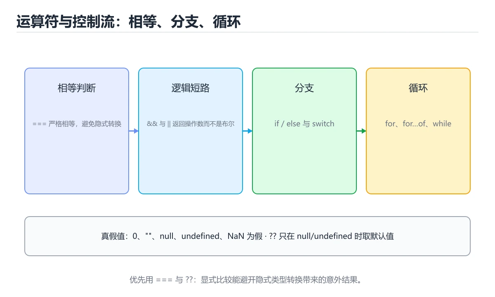

# 运算符与控制流




> 内容更新时间：2026-10-06 · 学习阶段：基础 · 预计用时：50 分钟

## 本节知识框架

**课程定位**：所属分类 `javascript`（JavaScript），课程主题 `运算符与控制流`，学习阶段 基础，建议用时 45 分钟。

本课主线：短路运算、空值合并、可选链、分支与各种循环。

**学完本课应当能够**
- 说清 `break` 与 `循环` 的含义与区别，并各举一个正例和一个反例。
- 用本课示例验证 `六个常用运算符` 的行为，记录输入、输出与失败条件。
- 遇到「`0 \」这类问题时，能说出触发条件与修复顺序。

### 从概念到验证的学习链条

1. `break`：先掌握 `break` 结束循环，`continue` 跳过本轮；`forEach` 中不能用 `break`，需要提前退出就用 `for...of`，再用它解释 `循环` 为什么会出现。
2. `循环`：先掌握 break 结束循环，continue 跳过本轮；forEach 中不能用 break，需要提前退出就用 for...of，再用它解释 `六个常用运算符` 为什么会出现。
3. `六个常用运算符`：先掌握 const name = input ?? "匿名"; // input 为 null/undefined 时才用默认值，再用它解释 `短路求值` 为什么会出现。
4. `短路求值`：先掌握 与、或运算符在结果已经确定时不再计算右侧，常用它写默认值与条件调用，再用它解释 本课示例的观察结果 为什么会出现。

**先修与衔接**：本课是「JavaScript」分类的第 8 课。先修内容：《变量、类型与类型转换》。《变量、类型与类型转换》里的 `与`、`类型` 是本课的前提。相关或后续课程：《函数、作用域与 this》。

### 完成判据

- **定义关**：不看正文也能说明 `break` 是 `break` 结束循环，`continue` 跳过本轮，`forEach` 中不能用 `break`，需要提前退出就用 `for...of`，并指出一个反例。
- **机制关**：能按“输入 → 转换 → 输出 → 验证”复述 `运算符与控制流`，而不是只背结论。
- **示例关**：能运行或推演 `运算符与控制流` 的 `javascript` 示例，并说明一个真实出现的标识符或字面量。
- **证据关**：能指出 `运算符与控制流` 示例里的 调用了 `add()`，并说明它支持或反驳了本课的哪一条结论。
- **排错关**：能复现 `0 \，记录现象并按 5` 得 5 修复。
- **迁移关**：能把 `运算符`、`??`、`?.`、`switch` 放进一个与 `运算符与控制流` 不同的项目场景，并保持输入与验证条件可追踪。
- **复盘关**：学完 `运算符与控制流` 后，用一句话写下仍然不确定的结论，并列出下一次验证需要的输入、环境和成功判据。

### 复习清单

- [ ] 能不看正文复述本课核心术语，并指出一个边界或反例。
- [ ] 能运行或推演本课示例，记录输入、输出与失败现象。
- [ ] 能完成一次自测，并把错题对照错误表定位原因。

## 核心概念定义

| 术语 | 操作性定义 | 常见边界与风险 |
| --- | --- | --- |
| break | break 结束循环，continue 跳过本轮；forEach 中不能用 break，需要提前退出就用 for...of。 | 易错：报错或无效；正确做法是改 `for...of`。 |
| 循环 | break 结束循环，continue 跳过本轮；forEach 中不能用 break，需要提前退出就用 for...of。 | 只在「break 结束循环，continue 跳过本轮；forEach 中不能用 break，需要提前退出就用 for...of」这一前提下成立，换输入或换环境要重新验证。 |
| 六个常用运算符 | const name = input ?? "匿名"; // input 为 null/undefined 时才用默认值。 | 只在「const name = input ?? "匿名"; // input 为 null/undefined 时才用默认值」这一前提下成立，换输入或换环境要重新验证。 |
| 短路求值 | 与、或运算符在结果已经确定时不再计算右侧，常用它写默认值与条件调用。 | 只在「与、或运算符在结果已经确定时不再计算右侧，常用它写默认值与条件调用」这一前提下成立，换输入或换环境要重新验证。 |

## 原理与运行机制

### 机制总览

**教材衔接：运算符速查**

| 运算符 | 含义 | 注意点 |
| --- | --- | --- |
| `+` | 加法或字符串拼接 | 有字符串就拼接，`"1" + 1 === "11"` |
| `-` `*` `/` `%` `**` | 算术运算 | 都会把操作数转成数字 |
| `==` / `!=` | 宽松相等 | 会做隐式转换，规则复杂 |
| `===` / `!==` | 严格相等 | **默认一律使用** |
| `??` | 空值合并 | 只在 `null` / `undefined` 时取右值 |
| `\|\|` | 逻辑或 | `0`、`""`、`false` 也会触发右值 |
| `?.` | 可选链 | 中途为空则短路返回 `undefined` |
| `??=` | 空值赋值 | 仅当左侧为 `null` / `undefined` 时赋值 |
| `? :` | 三元表达式 | 嵌套过深请改 `if` 或查表 |
| `**` | 幂运算 | 右结合：`2 ** 3 ** 2 === 512` |
| `in` | 属性是否存在 | 会查原型链 |
| `typeof` | 类型判断 | 见类型章节的陷阱 |

假值速查（只有这 7 个为假）：`false`、`0`、`-0`、`0n`、`""`、`null`、`undefined`、`NaN`。

**教材衔接：版本与时效**

- forEach 依赖的新 API 必须有降级路径，否则老环境直接报错。
- 升级「运算符与控制流」涉及的依赖前，先用 forEach 复现当前行为，再逐项核对版本说明与破坏性变更。

### 升级检查清单

- 先固定当前版本，跑通全部示例与测验，再升级工具链。
- 只改 运算符 的版本变量，记录编译、测试与产物体积的变化。
- 回归范围锁定 forEach 的默认行为，并确认弃用警告是否出现在构建输出里。
- 升级完成后记录 运算符 的新旧版本差异，并据此调整下次复核时间。

### 机制拆解：每一步的输入、动作与输出

#### 1. `break`
- 输入：`运算符`；本步把 `break` 结束循环，`continue` 跳过本轮；`forEach` 中不能用 `break`，需要提前退出就用 `for...of` 当作判断规则。
- 动作：围绕 `break` 保留中间状态，并记录它与 `循环` 的对应关系。
- 输出：`循环`，它可以被下一段代码、测试或记录继续使用。
- `break` 的失败条件：当`forEach` 里 `break`时，会出现报错或无效。

#### 2. `循环`
- 输入：`break`；本步把 break 结束循环，continue 跳过本轮；forEach 中不能用 break，需要提前退出就用 for...of 当作判断规则。
- 动作：围绕 `循环` 保留中间状态，并记录它与 `六个常用运算符` 的对应关系。
- 输出：`六个常用运算符`，它可以被下一段代码、测试或记录继续使用。
- `循环` 的失败条件：只在「break 结束循环，continue 跳过本轮；forEach 中不能用 break，需要提前退出就用 for...of」这一前提下成立，换输入或换环境要重新验证。

#### 3. `六个常用运算符`
- 输入：`循环`；本步把 const name = input ?? "匿名"; // input 为 null/undefined 时才用默认值 当作判断规则。
- 动作：围绕 `六个常用运算符` 保留中间状态，并记录它与 `短路求值` 的对应关系。
- 输出：`短路求值`，它可以被下一段代码、测试或记录继续使用。
- `六个常用运算符` 的失败条件：只在「const name = input ?? "匿名"; // input 为 null/undefined 时才用默认值」这一前提下成立，换输入或换环境要重新验证。

#### 4. `短路求值`
- 输入：`六个常用运算符`；本步把 与、或运算符在结果已经确定时不再计算右侧，常用它写默认值与条件调用 当作判断规则。
- 动作：围绕 `短路求值` 保留中间状态，并记录它与 `add` 的对应关系。
- 输出：`add`，它可以被下一段代码、测试或记录继续使用。
- `短路求值` 的失败条件：只在「与、或运算符在结果已经确定时不再计算右侧，常用它写默认值与条件调用」这一前提下成立，换输入或换环境要重新验证。

### 示例中的可观察事实

1. 调用了 `add()`；它对应的课程主题是 `运算符与控制流`。
2. 出现字面量 `add`；它对应的课程主题是 `运算符与控制流`。
3. 出现字面量 ` : `；它对应的课程主题是 `运算符与控制流`。

### 复现实验记录

- 环境：`运算符与控制流` 使用 `javascript` 示例，固定 `运算符`、`??`、`?.`、`switch` 作为第一组条件。
- 首轮输入：先确认 调用了 `add()`，预测 `break` 会怎样变化。
- 基线观察：记录命令、输入、输出和错误原文，不用截图代替可复制的文本。
- 单变量修改：只改变 `运算符`，观察 `短路求值` 是否仍满足定义。
- 失败注入：复现 `0 \，确认现象是 \。
- 记录结论：把“修改前、修改后、预期变化、实际变化”写成四列表，这样复盘 `运算符与控制流` 时才能区分概念错误与实现错误。

## 典型应用场景

- **`0 \**：典型现象是\；正确做法是5` 得 5。
- **`forEach` 里 `break`**：典型现象是报错或无效；正确做法是改 `for...of`。
- **忘写 `break`**：典型现象是多个 case 都执行；正确做法是用映射表或补 `break`。
- **用 `for...in` 遍历数组**：典型现象是拿到字符串下标；正确做法是数组用 `for...of`。

### 最小验证场景

- 准备：保留 `javascript` 示例的原始输入，先记录 `运算符与控制流` 的基线输出和完整运行命令。
- 观察：先核对 调用了 `add()`，再改变一个与 `break` 相关的条件。
- 判定：新结果与 `运算符与控制流` 的基线不同不等于错误；只有当差异破坏了 `break` 的定义或错误表中的约束，才判定为失败。

### 选择与边界

- 使用 `break` 时，先满足它的定义：`break` 结束循环，`continue` 跳过本轮；`forEach` 中不能用 `break`，需要提前退出就用 `for...of`；易错：报错或无效；正确做法是改 `for...of`。
- 使用 `循环` 时，先满足它的定义：break 结束循环，continue 跳过本轮；forEach 中不能用 break，需要提前退出就用 for...of；只在「break 结束循环，continue 跳过本轮；forEach 中不能用 break，需要提前退出就用 for...of」这一前提下成立，换输入或换环境要重新验证。
- 使用 `六个常用运算符` 时，先满足它的定义：const name = input ?? "匿名"; // input 为 null/undefined 时才用默认值；只在「const name = input ?? "匿名"; // input 为 null/undefined 时才用默认值」这一前提下成立，换输入或换环境要重新验证。
- 使用 `短路求值` 时，先满足它的定义：与、或运算符在结果已经确定时不再计算右侧，常用它写默认值与条件调用；只在「与、或运算符在结果已经确定时不再计算右侧，常用它写默认值与条件调用」这一前提下成立，换输入或换环境要重新验证。

## 代码/协议/SQL 示例

### 最小可验证示例

```javascript
7 / 2;              // 3.5，没有整数除法
7 % 2;              // 1
2 ** 10;            // 1024

const name = user && user.name;      // 短路运算
const limit = options.limit ?? 10;   // 空值合并
const city = user?.address?.city;    // 可选链

const merged = { ...defaults, ...options };   // 展开合并
const [a, ...rest] = [1, 2, 3];               // rest = [2, 3]
```

**教材衔接：运算符要点**

**教材衔接：分支**

```javascript
if (score >= 90) {
  grade = 'A';
} else if (score >= 60) {
  grade = 'B';
} else {
  grade = 'C';
}

switch (kind) {
  case 'add':
    add();
    break;              // 忘记 break 会贯穿到下一个 case
  default:
    break;
}

const label = score >= 60 ? '通过' : '未通过';
```

**教材衔接：循环**

```javascript
for (let i = 0; i < 3; i++) { }

for (const item of items) { }            // 遍历值：数组、字符串、Map、Set
for (const key in object) { }            // 遍历键，慎用（含原型属性）
for (const [k, v] of Object.entries(obj)) { }

items.forEach((item, index) => { });     // 数组方法
while (condition) { }
do { } while (condition);                // 至少执行一次
```

`break` 结束循环，`continue` 跳过本轮；`forEach` 中不能用 `break`，需要提前退出就用 `for...of`。

**教材衔接：控制流速查**

| 结构 | 写法 | 适用 |
| --- | --- | --- |
| `if / else if / else` | 条件分支 | 区间判断、复杂条件 |
| `switch` | 多等值分支 | 字符串或数字枚举，记得 `break` |
| `for` | 计次循环 | 需要下标或步长 |
| `for...of` | 遍历可迭代对象 | 数组、字符串、Map、Set |
| `for...in` | 遍历可枚举属性 | 对象键（注意原型链） |
| `while` / `do...while` | 条件循环 | 直到满足条件 |
| `break` / `continue` | 跳出 / 跳过 | 配合标签可跳出多层 |
| `try / catch / finally` | 异常处理 | `finally` 一定执行 |

```js
// 用查表替代多层 if，可读性更好
const handler = {
  create: () => createItem(),
  update: () => updateItem(),
};
const action = handler[type] ?? (() => { throw new Error(`未知类型：${type}`); });
action();

// 可选链 + 空值合并：安全取值并给默认值
const city = user?.address?.city ?? "未知";
```

**教材衔接：零基础详解：运算符、判断与循环**

### 一句话说清它是什么

运算符决定「怎么算」，判断决定「走哪条路」，循环决定「重复几次」。
JavaScript 在这三块有几个**独有又好用**的语法，值得专门记住。

### 六个常用运算符

| 运算符 | 名称 | 例子 | 说明 |
| --- | --- | --- | --- |
| `===` | 严格相等 | `a === b` | 类型和值都要相同 |
| `??` | 空值合并 | `a ?? b` | 只在 `null`/`undefined` 时取 b |
| `?.` | 可选链 | `a?.b` | a 为空时直接返回 undefined，不报错 |
| `**` | 幂 | `2 ** 10` | 1024 |
| `...` | 展开/收集 | `[...arr]`、`(...args)` | 复制或收集 |
| `? :` | 三元 | `n > 0 ? "正" : "负"` | 简洁的二分判断 |

```javascript
const name = input ?? "匿名";        // input 为 null/undefined 时才用默认值
const len = user?.profile?.bio?.length ?? 0;   // 逐层安全访问
const [first, ...rest] = [1, 2, 3];   // first=1, rest=[2,3]
```

`??` 与 `||` 的区别很重要：`0 || 5` 得 5，而 `0 ?? 5` 得 0。
**只要 0 和空串是合法值，就必须用 `??`。**

### 判断写法对照

```javascript
// 普通分支
if (score >= 90) {
  level = "优秀";
} else if (score >= 60) {
  level = "及格";
} else {
  level = "不及格";
}

// 单个值分流：switch
switch (status) {
  case "pending":
    handlePending();
    break;                 // 忘了 break 会继续往下执行
  case "done":
    handleDone();
    break;
  default:
    handleUnknown();
}

// 值 → 结果：用映射表更清晰
const LABELS = { pending: "待处理", done: "已完成" };
const label = LABELS[status] ?? "未知";
```

### 四种循环

| 循环 | 适合 | 注意 |
| --- | --- | --- |
| `for` | 需要下标或次数 | 最灵活 |
| `for...of` | 遍历数组、字符串、Map | 拿到的是值 |
| `for...in` | 遍历对象的键 | 谨慎，会包含继承属性 |
| `while` | 条件驱动 | 别忘更新条件 |

```javascript
for (const ch of "abc") console.log(ch);      // a b c

for (const key in { a: 1, b: 2 }) console.log(key);   // a b

// 并行遍历：同时拿下标和值
for (const [i, v] of ["x", "y"].entries()) console.log(i, v);
```

`forEach` 不能 `break`，要提前退出就用 `for...of` 或 `some`。

### 数组三大金刚：map / filter / reduce

```javascript
const nums = [1, 2, 3, 4, 5];

const doubled = nums.map((n) => n * 2);          // [2,4,6,8,10]
const evens = nums.filter((n) => n % 2 === 0);   // [2,4]
const total = nums.reduce((sum, n) => sum + n, 0);   // 15
```

| 方法 | 一句话 | 返回 |
| --- | --- | --- |
| `map` | 每个元素变一个 | 等长新数组 |
| `filter` | 挑出符合条件的 | 可能更短的数组 |
| `reduce` | 把数组压成一个值 | 任意类型的结果 |
| `find` | 找第一个符合条件的 | 元素或 undefined |
| `some` / `every` | 是否存在 / 是否全部 | 布尔值 |

### 新手最容易踩的七个坑

| 坑 | 现象 | 正确做法 |
| --- | --- | --- |
| `0 \|\| 5` 得 5 | 0 被当成空值 | 改用 `??` |
| `forEach` 里 `break` | 报错或无效 | 改 `for...of` |
| 忘写 `break` | 多个 case 都执行 | 用映射表或补 `break` |
| 用 `for...in` 遍历数组 | 拿到字符串下标 | 数组用 `for...of` |
| `map` 里忘 `return` | 得到一堆 undefined | 用表达式体箭头函数或补 `return` |
| 比较浮点 | 精度问题 | 用误差范围 |
| 修改原数组 | 副作用难排查 | 用 `toSorted`、`toReversed` 或先复制 |

### 手把手练习：统计一段文本

```javascript
const text = "the quick brown fox jumps over the lazy dog";

const words = text.split(" ");
const longWords = words.filter((w) => w.length > 3);
const lengths = words.map((w) => w.length);
const maxLen = Math.max(...lengths);
const totalChars = lengths.reduce((sum, n) => sum + n, 0);

console.log(`共 ${words.length} 个词，最长 ${maxLen} 个字母，总字母数 ${totalChars}`);
console.log(`长度超过 3 的词：${longWords.join(", ")}`);
```

### 学完自测

- [ ] 能说出 `??` 与 `||` 的区别，并举例。
- [ ] 能解释 `user?.profile?.name` 为什么不会报错。
- [ ] 知道 `for...of` 与 `for...in` 分别遍历什么。
- [ ] 能写出用 `map` + `filter` + `reduce` 的一段统计代码。
- [ ] 知道 `forEach` 不能 `break`，该用什么替代。

**运行方式**：运行 `运算符与控制流` 的示例时，保存为 `.js` 后用 `node 文件名.js` 运行；涉及浏览器 API 的示例要放到页面里执行。

### 示例精读：先找证据，再改一个条件

1. 调用了 `add()`；它出现在 `运算符与控制流` 的示例中，阅读时先确认它前后各发生了什么。
2. 出现字面量 `add`；它出现在 `运算符与控制流` 的示例中，阅读时先确认它前后各发生了什么。
3. 出现字面量 ` : `；它出现在 `运算符与控制流` 的示例中，阅读时先确认它前后各发生了什么。
- 在 `运算符与控制流` 中与 `break` 对照：示例必须能支持 `break` 结束循环，`continue` 跳过本轮；`forEach` 中不能用 `break`，需要提前退出就用 `for...of`，否则说明这一段还缺少实现或验证步骤。
- 在 `运算符与控制流` 中与 `循环` 对照：示例必须能支持 break 结束循环，continue 跳过本轮；forEach 中不能用 break，需要提前退出就用 for...of，否则说明这一段还缺少实现或验证步骤。
- 在 `运算符与控制流` 中与 `六个常用运算符` 对照：示例必须能支持 const name = input ?? "匿名"; // input 为 null/undefined 时才用默认值，否则说明这一段还缺少实现或验证步骤。
- 在 `运算符与控制流` 中与 `短路求值` 对照：示例必须能支持 与、或运算符在结果已经确定时不再计算右侧，常用它写默认值与条件调用，否则说明这一段还缺少实现或验证步骤。

## 时间/空间复杂度或性能分析

**性能关注点（运算符与控制流）**：事件循环与 DOM 操作是瓶颈来源：记录脚本执行时间、长任务与主线程阻塞时长。

**测量方法**：以 `运算符与控制流` 的 `运算符` 场景为对象，固定输入跑一遍记录基线，再把规模或并发度提高一个数量级复测；两次结果的差值与波动范围才是结论依据。

### 需要控制的变量与记录项

- `运算符与控制流` 的 `运算符`：固定它的版本、输入范围和资源上限，分别记录速度、内存与失败率的变化。
- `运算符与控制流` 的 `??`：固定它的版本、输入范围和资源上限，分别记录速度、内存与失败率的变化。
- `运算符与控制流` 的 `?.`：固定它的版本、输入范围和资源上限，分别记录速度、内存与失败率的变化。
- `运算符与控制流` 的 `switch`：固定它的版本、输入范围和资源上限，分别记录速度、内存与失败率的变化。
- `运算符与控制流` 的 `for-of`：固定它的版本、输入范围和资源上限，分别记录速度、内存与失败率的变化。
- `运算符与控制流` 中 `break` 的边界：易错：报错或无效；正确做法是改 `for...of`。达到边界时不要外推，必须重新测量。
- `运算符与控制流` 中 `循环` 的边界：只在「break 结束循环，continue 跳过本轮；forEach 中不能用 break，需要提前退出就用 for...of」这一前提下成立，换输入或换环境要重新验证。达到边界时不要外推，必须重新测量。
- `运算符与控制流` 中 `六个常用运算符` 的边界：只在「const name = input ?? "匿名"; // input 为 null/undefined 时才用默认值」这一前提下成立，换输入或换环境要重新验证。达到边界时不要外推，必须重新测量。
- `运算符与控制流` 中 `短路求值` 的边界：只在「与、或运算符在结果已经确定时不再计算右侧，常用它写默认值与条件调用」这一前提下成立，换输入或换环境要重新验证。达到边界时不要外推，必须重新测量。
- `运算符与控制流` 的代码证据：先验证 调用了 `add()`，再记录该路径的输入规模与耗时；只看代码行数不能推出复杂度。

## 常见误区与易错点

| 容易写错的做法 | 实际现象 | 原因与正确做法 |
| --- | --- | --- |
| `0 \ | \ | 5` 得 5 |
| `forEach` 里 `break` | 报错或无效 | 改 `for...of` |
| 忘写 `break` | 多个 case 都执行 | 用映射表或补 `break` |
| 用 `for...in` 遍历数组 | 拿到字符串下标 | 数组用 `for...of` |
| `map` 里忘 `return` | 得到一堆 undefined | 用表达式体箭头函数或补 `return` |
| 比较浮点 | 精度问题 | 用误差范围 |
| 修改原数组 | 副作用难排查 | 用 `toSorted`、`toReversed` 或先复制 |
| `if (count = 1)` | 条件恒为真，还改了值 | 比较用 `===` |
| `if (name == "a" \ | \ | "b")` |
| 用 `??` 与 `\ | \ | ` 混着写不加括号 |
| `0 \ | \ | 默认值` |
| `for...in` 遍历数组 | 得到字符串下标 | 数组用 `for...of` |
| `switch` 忘记 `break` | 穿透执行多个分支 | 用 `return` 或改写为查表 |
| `0.1 + 0.2 === 0.3` | `false` | 用误差范围比较 |
| `"5" * "2"` | `10`（隐式转换） | 显式 `Number()`，避免依赖隐式规则 |
| `NaN === NaN` | `false` | 用 `Number.isNaN(x)` |
| `typeof x === "object"` 判数组 | 数组也是 `"object"` | 用 `Array.isArray(x)` |
| if (count = 1) | 条件恒为真，还改了值。 | 比较用 ===。 |
| 0 \|\| 默认值 | 0 被替换掉。 | 需要保留 0 时用 ??。 |
| for...in 遍历数组 | 得到字符串下标。 | 数组用 for...of。 |

### 现场 1：`0 \

**症状**：\。

**根因与修复**：5` 得 5。

**自检**：在本课示例里复现「`0 \」，改成5` 得 5后重跑；如果症状消失且失败路径按预期变化，说明定位正确。

### 现场 2：`forEach` 里 `break`

**症状**：报错或无效。

**根因与修复**：改 `for...of`。

**自检**：在本课示例里复现「`forEach` 里 `break`」，改成改 `for...of`后重跑；如果症状消失且失败路径按预期变化，说明定位正确。

### 现场 3：忘写 `break`

**症状**：多个 case 都执行。

**根因与修复**：用映射表或补 `break`。

**自检**：在本课示例里复现「忘写 `break`」，改成用映射表或补 `break`后重跑；如果症状消失且失败路径按预期变化，说明定位正确。

### 现场 4：用 `for...in` 遍历数组

**症状**：拿到字符串下标。

**根因与修复**：数组用 `for...of`。

**自检**：在本课示例里复现「用 `for...in` 遍历数组」，改成数组用 `for...of`后重跑；如果症状消失且失败路径按预期变化，说明定位正确。

### 现场 5：`map` 里忘 `return`

**症状**：得到一堆 undefined。

**根因与修复**：用表达式体箭头函数或补 `return`。

**自检**：在本课示例里复现「`map` 里忘 `return`」，改成用表达式体箭头函数或补 `return`后重跑；如果症状消失且失败路径按预期变化，说明定位正确。

### 现场 6：比较浮点

**症状**：精度问题。

**根因与修复**：用误差范围。

**自检**：在本课示例里复现「比较浮点」，改成用误差范围后重跑；如果症状消失且失败路径按预期变化，说明定位正确。

### 现场 7：修改原数组

**症状**：副作用难排查。

**根因与修复**：用 `toSorted`、`toReversed` 或先复制。

**自检**：在本课示例里复现「修改原数组」，改成用 `toSorted`、`toReversed` 或先复制后重跑；如果症状消失且失败路径按预期变化，说明定位正确。

### 现场 8：`if (count = 1)`

**症状**：条件恒为真，还改了值。

**根因与修复**：比较用 `===`。

**自检**：在本课示例里复现「`if (count = 1)`」，改成比较用 `===`后重跑；如果症状消失且失败路径按预期变化，说明定位正确。

### 现场 9：`if (name == "a" \

**症状**：\。

**根因与修复**："b")`。

**自检**：在本课示例里复现「`if (name == "a" \」，改成"b")`后重跑；如果症状消失且失败路径按预期变化，说明定位正确。

## 与其他知识点的关系

- **先修**：`变量、类型与类型转换`。本课默认这些内容已经掌握。
- **相关或后续**：`函数、作用域与 this`。本课术语会在这些课程里继续使用。
- **术语归属**：`break`、`循环`、`六个常用运算符` 的定义以本课「核心概念定义」为准，换到其他课程时先确认定义是否被改写。

### 先修与后续术语接口

- `变量、类型与类型转换`：两者通过本分类的学习顺序衔接，阅读时重点比较各自的输入与失败条件。
- `函数、作用域与 this`：两者通过本分类的学习顺序衔接，阅读时重点比较各自的输入与失败条件。

### 容易混淆的相邻概念

- `break` 与 `循环`：前者强调 `break` 结束循环，`continue` 跳过本轮；`forEach` 中不能用 `break`，需要提前退出就用 `for...of`；后者强调 break 结束循环，continue 跳过本轮；forEach 中不能用 break，需要提前退出就用 for...of。判断时分别检查两条定义的适用范围，不要只看名称相似就互换。
- `循环` 与 `六个常用运算符`：前者强调 break 结束循环，continue 跳过本轮；forEach 中不能用 break，需要提前退出就用 for...of；后者强调 const name = input ?? "匿名"; // input 为 null/undefined 时才用默认值。判断时分别检查两条定义的适用范围，不要只看名称相似就互换。
- `六个常用运算符` 与 `短路求值`：前者强调 const name = input ?? "匿名"; // input 为 null/undefined 时才用默认值；后者强调 与、或运算符在结果已经确定时不再计算右侧，常用它写默认值与条件调用。判断时分别检查两条定义的适用范围，不要只看名称相似就互换。

## 自测题与参考答案

> 先独立作答，再对照参考答案；答案都能在本课正文、术语表或错误表里找到依据。

### 自测 1（概念复述）

不看正文，写出 `break` 的操作性定义，并说明它与 `循环` 的区别。

**参考答案**：`break` 结束循环，`continue` 跳过本轮；`forEach` 中不能用 `break`，需要提前退出就用 `for...of`。

`循环` 的定位是：break 结束循环，continue 跳过本轮；forEach 中不能用 break，需要提前退出就用 for...of；两者的差别要从适用对象与失败模式上说明。

### 自测 2（排错）

本课错误表记录了「`0 \」这类做法。请写出它会出现的现象、根因，以及修复顺序。

**参考答案**：现象是\；正确做法是5` 得 5。修复时先复现现象并保留证据，再改动一处假设重跑，确认现象消失。

### 自测 3（动手验证）

运行本课的 `javascript` 示例，把其中的 `7` 换成一个边界值后重新运行，记录输出与错误信息。

**参考答案**：正常输入下 `javascript` 示例应当复现正文给出的结果；把 `7` 换成边界值后，如果结果改变或报错，先核对它是否满足 `运算符与控制流` 中`break` 的适用范围，再检查错误表里是否有同类现象。

### 自测 4（代码阅读）

阅读本课开头的 `javascript` 示例，说明它体现了`break` 的哪一条性质，并指出改动哪个输入会让这条性质不再成立。

**参考答案**：`break` 的定义是 `break` 结束循环，`continue` 跳过本轮，`forEach` 中不能用 `break`，需要提前退出就用 `for...of`，示例正是在实现这条定义。改动与 `break` 有关的一个输入后，如果结果不再符合 `运算符与控制流` 的正文描述，就说明该性质只在当前前提成立。

### 自测 5（迁移）

把 `运算符与控制流` 的方法迁移到自己的项目：围绕 `break` 写出一个与错误表同类的风险点，并说明触发条件和检验方式。

**参考答案**：例如「for...in 遍历数组」，它会导致得到字符串下标；检验方式是按数组用 for...of改一处再复现，确认现象消失且没有引入新的失败分支。

### 自测 6（对比）

用一个表格对比 `break` 与 `循环`：各写一行适用场景、一行失败表现。

**参考答案**：`break` 的定义是`break` 结束循环，`continue` 跳过本轮；`forEach` 中不能用 `break`，需要提前退出就用 `for...of`；`循环` 的定义是break 结束循环，continue 跳过本轮；forEach 中不能用 break，需要提前退出就用 for...of。两者的失败表现分别对应本课错误表里与本术语相关的行。

### 自测 7（排错顺序）

面对「`0 \」引发的问题，请把“复现 \ → 保留证据 → 5` 得 5 → 回归验证”四步写成可执行的检查清单。

**参考答案**：第一步按\复现；第二步记录输入、版本与完整报错；第三步按5` 得 5只改一处；第四步重跑并确认失败路径也按预期变化。

### 自测 8（边界判断）

针对 `短路求值`，分别写出“可以使用”的条件和“结论不再成立”的条件。

**参考答案**：只在「与、或运算符在结果已经确定时不再计算右侧，常用它写默认值与条件调用」这一前提下成立，换输入或换环境要重新验证。 同时要把 `短路求值` 的定义 与、或运算符在结果已经确定时不再计算右侧，常用它写默认值与条件调用 与实际输入逐项对照。

### 自测 9（机制重建）

不看正文，按输入、转换、输出、验证四段重建 `break` → `循环` → `六个常用运算符` → `短路求值` 的作用链。

**参考答案**：起点是 `break` 的定义 `break` 结束循环，`continue` 跳过本轮；`forEach` 中不能用 `break`，需要提前退出就用 `for...of`；中间每一步都保留可观察状态；终点由 `短路求值` 检查，失败时回到错误表定位第一个偏离定义的步骤。

### 自测 10（综合排错）

在 `运算符与控制流` 中，现象是 得到字符串下标。请围绕 for...in 遍历数组 写出最小复现、关键证据、修复动作和回归验证，并说明为什么不能只凭一次运行下结论。

**参考答案**：先复现 for...in 遍历数组，记录输入与完整错误；再按 数组用 for...of 只改一处。回归时同时跑正常路径和边界路径，只有两次结果都可解释，才把修复视为完成。

### 自测 11（一分钟复述）

用每分钟约 200 字的速度复述 `运算符与控制流`：先给主问题，再按顺序说出 `break`、`循环`、`六个常用运算符`、`短路求值`，最后给一个失败案例。

**自评标准**：主问题必须对应 短路运算、空值合并、可选链、分支与各种循环；每个术语都要能接上一句定义或边界；失败案例必须写成可观察现象，不能用“可能有风险”代替证据。

## 术语速查

| 术语 | 一句话说明 |
| --- | --- |
| `break` | `break` 结束循环，`continue` 跳过本轮；`forEach` 中不能用 `break`，需要提前退出就用 `for...of`。 |
| `循环` | break 结束循环，continue 跳过本轮；forEach 中不能用 break，需要提前退出就用 for...of。 |
| `六个常用运算符` | const name = input ?? "匿名"; // input 为 null/undefined 时才用默认值。 |
| `短路求值` | 与、或运算符在结果已经确定时不再计算右侧，常用它写默认值与条件调用。 |

**术语关系**：`break`（`break` 结束循环） → `循环`（break 结束循环） → `六个常用运算符`（const name = input ?? "匿名"; // input 为 null/undefined 时才用默认值） → `短路求值`（与、或运算符在结果已经确定时不再计算右侧）。

## 考点精讲

`运算符与控制流` 的题库有 6 道题，下面逐题给出题干、正确项与判断依据：先自己作答，再核对正确项，最后回到正文对应小节复核。

### 考点 1：第 1 题

- **题目**：?? 与 || 的关键区别是？
- **正确项**：?? 只在 null/undefined 时取默认值
- **判断依据**：这道题检验本课主问题：短路运算、空值合并、可选链、分支与各种循环。复习时先复述本课主问题，再举一个会让结论失效的输入。

### 考点 2：第 2 题

- **题目**：for...of 遍历的是？
- **正确项**：可迭代对象的值
- **判断依据**：这道题检验本课主问题：短路运算、空值合并、可选链、分支与各种循环。复习时先复述本课主问题，再举一个会让结论失效的输入。

### 考点 3：第 3 题

- **题目**：围绕“运算符与控制流”中的 运算符、??、?.，下列哪两项是本课强调的实践判断？
- **正确项**：验证 ?? 时要固定版本并覆盖边界输入，结论才可复现；学习 运算符 时要同时说明输入、输出和失败路径，不能只看正常流程
- **判断依据**：这道题检验本课主问题：短路运算、空值合并、可选链、分支与各种循环。复习时先复述本课主问题，再举一个会让结论失效的输入。

### 考点 4：第 4 题

- **题目**：阅读 `运算符与控制流` 的 `break` 示例。它服务于短路运算、空值合并、可选链、分支与各种循环。代码中实际包含下列哪一项？
- **正确项**：出现字面量 ` : `
- **判断依据**：这道题落在术语 `break` 上：`break` 结束循环，`continue` 跳过本轮，`forEach` 中不能用 `break`，需要提前退出就用 `for...of`。复习时把 `break` 的定义、适用边界和一个反例一起说清楚，再回到「核心概念定义」核对原文。

### 考点 5：第 5 题

- **题目**：for...in 遍历的是？
- **正确项**：对象的可枚举属性名
- **判断依据**：这道题检验本课主问题：短路运算、空值合并、可选链、分支与各种循环。复习时先复述本课主问题，再举一个会让结论失效的输入。

### 考点 6：第 6 题

- **题目**：填空：补齐下面这段术语说明中的空缺。课程 `短路运算、空值合并、可选链、分支与各种循环。`，这段说明是：`____`：const name = input ?? "匿名"; // input 为 null/undefined 时才用默认值。空缺处应填哪个术语？
- **正确项**：六个常用运算符
- **判断依据**：这道题落在术语 `循环` 上：break 结束循环，continue 跳过本轮，forEach 中不能用 break，需要提前退出就用 for...of。复习时把 `循环` 的定义、适用边界和一个反例一起说清楚，再回到「核心概念定义」核对原文。

### 考点 7：`break`

- **要点**：`break` 结束循环，`continue` 跳过本轮；`forEach` 中不能用 `break`，需要提前退出就用 `for...of`。
- **break 的边界**：易错：报错或无效；正确做法是改 `for...of`。

### 考点 8：`循环`

- **要点**：break 结束循环，continue 跳过本轮；forEach 中不能用 break，需要提前退出就用 for...of。
- **循环 的边界**：只在「break 结束循环，continue 跳过本轮；forEach 中不能用 break，需要提前退出就用 for...of」这一前提下成立，换输入或换环境要重新验证。

### 考点 9：`六个常用运算符`

- **要点**：const name = input ?? "匿名"; // input 为 null/undefined 时才用默认值。
- **六个常用运算符 的边界**：只在「const name = input ?? "匿名"; // input 为 null/undefined 时才用默认值」这一前提下成立，换输入或换环境要重新验证。

### 考点 10：`短路求值`

- **要点**：与、或运算符在结果已经确定时不再计算右侧，常用它写默认值与条件调用。
- **短路求值 的边界**：只在「与、或运算符在结果已经确定时不再计算右侧，常用它写默认值与条件调用」这一前提下成立，换输入或换环境要重新验证。

### 考点 11：排错——`0 \

- **现象**：\。
- **处理**：5` 得 5。

### 考点 12：排错——`forEach` 里 `break`

- **现象**：报错或无效。
- **处理**：改 `for...of`。

### 考点 13：综合辨析——`break` 与 `短路求值`

- **辨析点**：`break` 的定义是 `break` 结束循环，`continue` 跳过本轮；`forEach` 中不能用 `break`，需要提前退出就用 `for...of`；`短路求值` 的定义是 与、或运算符在结果已经确定时不再计算右侧，常用它写默认值与条件调用。
- **答题要求**：面对 `运算符与控制流` 的题目，先判断描述的是 `break` 还是 `短路求值`，再归到对应定义，最后写出一个会让该定义失效的边界输入。

### 考点 14：排错评分点

- **现象分**：能写出 \，而不是只写“程序有错”。
- **证据分**：保留触发 `0 \ 的输入、版本和错误原文。
- **修复分**：按 5` 得 5 只改一处，并同时回归正常路径与边界路径。

## 内容元数据

- 内容版本：v2.0
- 最后更新：2026-10-06
- 学习阶段：基础
- 适用环境：Node.js 22+ / 现代浏览器
；本课聚焦 运算符。
- 内容来源：内置结构化课程与工程实践整理
- 相关主题：运算符、??、?.、switch、for-of、循环
- 质量版本：P0 测验标准 + P1 覆盖扩展 + P2 体验补全

## 参考资料与复核

- 最后复核：2026-10-04
- 下次复核：2027-05-17
- 复核范围：版本兼容、API 行为、安全建议与工程实践
- 来源性质：官方文档、标准或权威教材；本课核对关键词：运算符、??、?.、switch、for-of、循环。

| 参考资料 | 本课用途 |
| --- | --- |
| [MDN JavaScript 指南](https://developer.mozilla.org/docs/Web/JavaScript/Guide) | 语言基础与浏览器 API |
| [MDN Fetch API](https://developer.mozilla.org/docs/Web/API/Fetch_API) | 网络请求与响应处理 |
| [npm 文档](https://docs.npmjs.com/) | 包管理与发布 |

| [本课术语索引：运算符与控制流](#核心概念定义) | 按本课输入、术语边界和错误表现逐项核对 |
> 「运算符与控制流」的链接用于离线阅读后的延伸核对；App 不会自动联网。