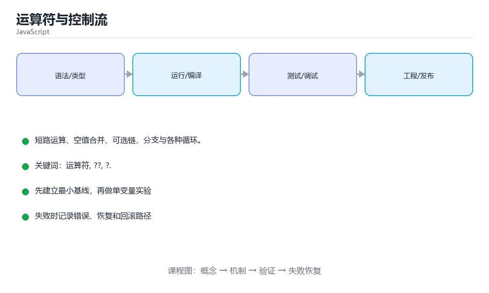

# 运算符与控制流



> 内容更新时间：2026-10-03 · 学习阶段：基础 · 预计用时：13 分钟

## 学习目标

- 能用自己的话解释「运算符与控制流」解决了什么问题，而不是只背术语。
- 能说清 「运算符」、「??」、「?.」、「switch」 之间的关系，并分别举出一个例子。
- 能把本课知识放回「JavaScript」的知识体系，说明它和相邻主题的边界。
- 能完成本课练习，并用验收标准检查自己的结果。

> 一句话摘要：短路运算、空值合并、可选链、分支与各种循环。

## 前置知识

- 先完成上一课《变量、类型与类型转换》；如果已经掌握，可以直接用本课练习自测。
- 本课阶段：基础。建议会读写简单代码或命令，并理解变量、输入输出等基本概念。
- 开始前先复习：运算符、??、?.。
- 如果某一步看不懂，先记录具体卡点，完成练习后再回头读一遍。


## 运算符要点

```javascript
7 / 2;              // 3.5，没有整数除法
7 % 2;              // 1
2 ** 10;            // 1024

const name = user && user.name;      // 短路运算
const limit = options.limit ?? 10;   // 空值合并
const city = user?.address?.city;    // 可选链

const merged = { ...defaults, ...options };   // 展开合并
const [a, ...rest] = [1, 2, 3];               // rest = [2, 3]
```

## 分支

```javascript
if (score >= 90) {
  grade = 'A';
} else if (score >= 60) {
  grade = 'B';
} else {
  grade = 'C';
}

switch (kind) {
  case 'add':
    add();
    break;              // 忘记 break 会贯穿到下一个 case
  default:
    break;
}

const label = score >= 60 ? '通过' : '未通过';
```

## 循环

```javascript
for (let i = 0; i < 3; i++) { }

for (const item of items) { }            // 遍历值：数组、字符串、Map、Set
for (const key in object) { }            // 遍历键，慎用（含原型属性）
for (const [k, v] of Object.entries(obj)) { }

items.forEach((item, index) => { });     // 数组方法
while (condition) { }
do { } while (condition);                // 至少执行一次
```

`break` 结束循环，`continue` 跳过本轮；`forEach` 中不能用 `break`，需要提前退出就用 `for...of`。

## 本课小结
现代写法：`===` 代替 `==`、`??` 代替 `||` 兜底、`?.` 避免层层判空、遍历数组优先 `for...of`。


## 运算符速查

| 运算符 | 含义 | 注意点 |
| --- | --- | --- |
| `+` | 加法或字符串拼接 | 有字符串就拼接，`"1" + 1 === "11"` |
| `-` `*` `/` `%` `**` | 算术运算 | 都会把操作数转成数字 |
| `==` / `!=` | 宽松相等 | 会做隐式转换，规则复杂 |
| `===` / `!==` | 严格相等 | **默认一律使用** |
| `??` | 空值合并 | 只在 `null` / `undefined` 时取右值 |
| `\|\|` | 逻辑或 | `0`、`""`、`false` 也会触发右值 |
| `?.` | 可选链 | 中途为空则短路返回 `undefined` |
| `??=` | 空值赋值 | 仅当左侧为 `null` / `undefined` 时赋值 |
| `? :` | 三元表达式 | 嵌套过深请改 `if` 或查表 |
| `**` | 幂运算 | 右结合：`2 ** 3 ** 2 === 512` |
| `in` | 属性是否存在 | 会查原型链 |
| `typeof` | 类型判断 | 见类型章节的陷阱 |

假值速查（只有这 7 个为假）：`false`、`0`、`-0`、`0n`、`""`、`null`、`undefined`、`NaN`。

## 控制流速查

| 结构 | 写法 | 适用 |
| --- | --- | --- |
| `if / else if / else` | 条件分支 | 区间判断、复杂条件 |
| `switch` | 多等值分支 | 字符串或数字枚举，记得 `break` |
| `for` | 计次循环 | 需要下标或步长 |
| `for...of` | 遍历可迭代对象 | 数组、字符串、Map、Set |
| `for...in` | 遍历可枚举属性 | 对象键（注意原型链） |
| `while` / `do...while` | 条件循环 | 直到满足条件 |
| `break` / `continue` | 跳出 / 跳过 | 配合标签可跳出多层 |
| `try / catch / finally` | 异常处理 | `finally` 一定执行 |

```js
// 用查表替代多层 if，可读性更好
const handler = {
  create: () => createItem(),
  update: () => updateItem(),
};
const action = handler[type] ?? (() => { throw new Error(`未知类型：${type}`); });
action();

// 可选链 + 空值合并：安全取值并给默认值
const city = user?.address?.city ?? "未知";
```

## 常见错误对照表

| 容易写错的做法 | 实际现象 | 原因与正确做法 |
| --- | --- | --- |
| `if (count = 1)` | 条件恒为真，还改了值 | 比较用 `===` |
| `if (name == "a" \|\| "b")` | 恒为真 | 写成 `name === "a" \|\| name === "b"` 或 `["a","b"].includes(name)` |
| 用 `??` 与 `\|\|` 混着写不加括号 | 语法错误 | 明确加括号表达意图 |
| `0 \|\| 默认值` | `0` 被替换掉 | 需要保留 `0` 时用 `??` |
| `for...in` 遍历数组 | 得到字符串下标 | 数组用 `for...of` |
| `switch` 忘记 `break` | 穿透执行多个分支 | 用 `return` 或改写为查表 |
| `0.1 + 0.2 === 0.3` | `false` | 用误差范围比较 |
| `"5" * "2"` | `10`（隐式转换） | 显式 `Number()`，避免依赖隐式规则 |
| `NaN === NaN` | `false` | 用 `Number.isNaN(x)` |
| `typeof x === "object"` 判数组 | 数组也是 `"object"` | 用 `Array.isArray(x)` |

## 自测清单

- [ ] 默认使用 `===` / `!==`，能说出 `??` 与 `\|\|` 的区别。
- [ ] 记得七个假值，知道 `[]` 与 `"0"` 都是真值。
- [ ] 数组遍历用 `for...of`，对象遍历用 `Object.entries`。
- [ ] 多层 `if` 会改写成查表或提前返回。
- [ ] 判断 `NaN` 与数组分别用 `Number.isNaN` 和 `Array.isArray`。


## 零基础详解：运算符、判断与循环

### 一句话说清它是什么

运算符决定「怎么算」，判断决定「走哪条路」，循环决定「重复几次」。
JavaScript 在这三块有几个**独有又好用**的语法，值得专门记住。

### 六个常用运算符

| 运算符 | 名称 | 例子 | 说明 |
| --- | --- | --- | --- |
| `===` | 严格相等 | `a === b` | 类型和值都要相同 |
| `??` | 空值合并 | `a ?? b` | 只在 `null`/`undefined` 时取 b |
| `?.` | 可选链 | `a?.b` | a 为空时直接返回 undefined，不报错 |
| `**` | 幂 | `2 ** 10` | 1024 |
| `...` | 展开/收集 | `[...arr]`、`(...args)` | 复制或收集 |
| `? :` | 三元 | `n > 0 ? "正" : "负"` | 简洁的二分判断 |

```javascript
const name = input ?? "匿名";        // input 为 null/undefined 时才用默认值
const len = user?.profile?.bio?.length ?? 0;   // 逐层安全访问
const [first, ...rest] = [1, 2, 3];   // first=1, rest=[2,3]
```

`??` 与 `||` 的区别很重要：`0 || 5` 得 5，而 `0 ?? 5` 得 0。
**只要 0 和空串是合法值，就必须用 `??`。**

### 判断写法对照

```javascript
// 普通分支
if (score >= 90) {
  level = "优秀";
} else if (score >= 60) {
  level = "及格";
} else {
  level = "不及格";
}

// 单个值分流：switch
switch (status) {
  case "pending":
    handlePending();
    break;                 // 忘了 break 会继续往下执行
  case "done":
    handleDone();
    break;
  default:
    handleUnknown();
}

// 值 → 结果：用映射表更清晰
const LABELS = { pending: "待处理", done: "已完成" };
const label = LABELS[status] ?? "未知";
```

### 四种循环

| 循环 | 适合 | 注意 |
| --- | --- | --- |
| `for` | 需要下标或次数 | 最灵活 |
| `for...of` | 遍历数组、字符串、Map | 拿到的是值 |
| `for...in` | 遍历对象的键 | 谨慎，会包含继承属性 |
| `while` | 条件驱动 | 别忘更新条件 |

```javascript
for (const ch of "abc") console.log(ch);      // a b c

for (const key in { a: 1, b: 2 }) console.log(key);   // a b

// 并行遍历：同时拿下标和值
for (const [i, v] of ["x", "y"].entries()) console.log(i, v);
```

`forEach` 不能 `break`，要提前退出就用 `for...of` 或 `some`。

### 数组三大金刚：map / filter / reduce

```javascript
const nums = [1, 2, 3, 4, 5];

const doubled = nums.map((n) => n * 2);          // [2,4,6,8,10]
const evens = nums.filter((n) => n % 2 === 0);   // [2,4]
const total = nums.reduce((sum, n) => sum + n, 0);   // 15
```

| 方法 | 一句话 | 返回 |
| --- | --- | --- |
| `map` | 每个元素变一个 | 等长新数组 |
| `filter` | 挑出符合条件的 | 可能更短的数组 |
| `reduce` | 把数组压成一个值 | 任意类型的结果 |
| `find` | 找第一个符合条件的 | 元素或 undefined |
| `some` / `every` | 是否存在 / 是否全部 | 布尔值 |

### 新手最容易踩的七个坑

| 坑 | 现象 | 正确做法 |
| --- | --- | --- |
| `0 \|\| 5` 得 5 | 0 被当成空值 | 改用 `??` |
| `forEach` 里 `break` | 报错或无效 | 改 `for...of` |
| 忘写 `break` | 多个 case 都执行 | 用映射表或补 `break` |
| 用 `for...in` 遍历数组 | 拿到字符串下标 | 数组用 `for...of` |
| `map` 里忘 `return` | 得到一堆 undefined | 用表达式体箭头函数或补 `return` |
| 比较浮点 | 精度问题 | 用误差范围 |
| 修改原数组 | 副作用难排查 | 用 `toSorted`、`toReversed` 或先复制 |

### 手把手练习：统计一段文本

```javascript
const text = "the quick brown fox jumps over the lazy dog";

const words = text.split(" ");
const longWords = words.filter((w) => w.length > 3);
const lengths = words.map((w) => w.length);
const maxLen = Math.max(...lengths);
const totalChars = lengths.reduce((sum, n) => sum + n, 0);

console.log(`共 ${words.length} 个词，最长 ${maxLen} 个字母，总字母数 ${totalChars}`);
console.log(`长度超过 3 的词：${longWords.join(", ")}`);
```

### 学完自测

- [ ] 能说出 `??` 与 `||` 的区别，并举例。
- [ ] 能解释 `user?.profile?.name` 为什么不会报错。
- [ ] 知道 `for...of` 与 `for...in` 分别遍历什么。
- [ ] 能写出用 `map` + `filter` + `reduce` 的一段统计代码。
- [ ] 知道 `forEach` 不能 `break`，该用什么替代。

## 动手练习


> 本课练习重点：围绕「运算符、??、?.」完成复述、实验和交付，每个结果都要能被别人检查。

先在 Node 或浏览器复现行为，再改写异步与错误路径，最后补测试。

### 练习 1：建立心智模型（10 分钟）

合上教程，用 3～5 句话回答：

1. 「运算符与控制流」解决了什么问题？
2. 如果没有它，会出现什么具体后果？
3. 它和「??」是什么关系？

**验收标准**：至少出现一个本课关键词，并写出一个反例、边界条件或失效场景。

### 练习 2：做一次可控实验（20 分钟）

从正文中选一个最小示例，完成以下操作：

1. 先预测修改一个参数、输入或步骤后的结果。
2. 再实际执行或逐步推演，记录真实结果。
3. 如果结果与预测不同，写出差异原因。

**验收标准**：留下「原例 → 改动 → 预测 → 结果 → 原因」五步记录。

### 练习 3：交付一个小结果（30 分钟）

在浏览器控制台或 Node.js 中写一个最小示例，列出至少 3 组输入输出。

任务要求：

- 结果必须能被别人检查，不能只写“我已经理解了”。
- 至少覆盖「运算符」和「??」两个关键词。
- 写出 1 个仍然不确定的问题，以及下一步如何验证。

> 提示：时间有限时优先做练习 1 和练习 2；练习 3 可以拆成两次完成。


## 考点精讲：把测验题还原成判断过程

本课有 6 个判断点。先自己作答，再看「判断依据」；如果结论正确但理由不完整，回到正文对应章节补足概念。

### 考点 1：?? 与 || 的关键区别是？

- **正确判断**：?? 只在 null/undefined 时取默认值
- **判断依据**：正确答案是「?? 只在 null/undefined 时取默认值」，本课在「零基础详解：运算符、判断与循环」中说明：运算符决定「怎么算」，判断决定「走哪条路」，循环决定「重复几次」。|| 会把 0、'' 等假值也替换掉，?? 只处理 null 和 undefined，兜底更精确。本课还在「运算符速查」中说明：假值速查（只有这 7 个为假）：false、0、-0、0n、""、null、undefined、NaN。
- **迁移检查**：如果给某个错误选项去掉一个限定词，它会不会变成正确？说明理由。

### 考点 2：for...of 遍历的是？

- **正确判断**：可迭代对象的值
- **判断依据**：正确答案是「可迭代对象的值」，本课在「本课小结」中说明：现代写法：=== 代替 ==、?? 代替 || 兜底、?. 避免层层判空、遍历数组优先 for...of。for...of 遍历数组、字符串、Map、Set 等的值。本课还在「零基础详解：运算符、判断与循环」中说明：知道 for...of 与 for...in 分别遍历什么。本课还在「零基础详解：运算符、判断与循环」中说明：运算符决定「怎么算」，判断决定「走哪条路」，循环决定「重复几次」。
- **迁移检查**：把题干里的一个条件换成边界值，原来的结论还成立吗？写出判断过程。

### 考点 3：switch 中忘记写 break 会怎样？

- **正确判断**：继续执行后面的 case（贯穿）
- **判断依据**：正确答案是「继续执行后面的 case（贯穿）」，本课在「循环」中说明：break 结束循环，continue 跳过本轮。没有 break 会发生贯穿，继续执行后续分支，有时是刻意为之但多数情况下是 bug。本课还在「循环」中说明：forEach 中不能用 break，需要提前退出就用 for...of。本课还在「零基础详解：运算符、判断与循环」中说明：forEach 不能 break，要提前退出就用 for...of 或 some。
- **迁移检查**：把题干里的一个条件换成边界值，原来的结论还成立吗？写出判断过程。

### 考点 4：obj?.a?.b 这种可选链的作用是？

- **正确判断**：中途遇到 null/undefined 时短路返回 undefined，而不是抛错
- **判断依据**：正确答案是「中途遇到 null/undefined 时短路返回 undefined，而不是抛错」，本课在「运算符速查」中说明：假值速查（只有这 7 个为假）：false、0、-0、0n、""、null、undefined、NaN。可选链适合处理可能缺失的接口字段，但过度使用会掩盖数据结构问题。本课还在「零基础详解：运算符、判断与循环」中说明：知道 forEach 不能 break，该用什么替代。
- **迁移检查**：遮住选项，只根据定义复述一次答案，再回来看哪个选项与复述一致。

### 考点 5：for...in 遍历的是？

- **正确判断**：对象的可枚举属性名（包含原型链上的）
- **判断依据**：正确答案是「对象的可枚举属性名（包含原型链上的）」，本课在「零基础详解：运算符、判断与循环」中说明：能写出用 map + filter + reduce 的一段统计代码。遍历对象自身属性更推荐 Object.keys / Object.entries，遍历值用 for...of。本课还在「零基础详解：运算符、判断与循环」中说明：知道 for...of 与 for...in 分别遍历什么。
- **迁移检查**：把题干里的一个条件换成边界值，原来的结论还成立吗？写出判断过程。

### 考点 6：补全代码：「运算符与控制流」示例中，下面这行代码缺少哪个关键字或函数名？请填入 ____。 `items.____((item, index) => { }); // 数组方法`

- **正确判断**：forEach / foreach
- **判断依据**：正确答案是「forEach」，本课在「循环」中说明：forEach 中不能用 break，需要提前退出就用 for...of。本课还在「零基础详解：运算符、判断与循环」中说明：forEach 不能 break，要提前退出就用 for...of 或 some。本课还在「零基础详解：运算符、判断与循环」中说明：知道 forEach 不能 break，该用什么替代。
- **迁移检查**：把答案换成另一种等价写法，是否仍然正确？说明依据。

## 本课复习清单

离开本课前，逐项确认：

- [ ] 不看解析，能说出「?? 与 || 的关键区别是？」的判断依据。
- [ ] 不看解析，能说出「for...of 遍历的是？」的判断依据。
- [ ] 不看解析，能说出「switch 中忘记写 break 会怎样？」的判断依据。
- [ ] 不看解析，能说出「obj?.a?.b 这种可选链的作用是？」的判断依据。
- [ ] 不看解析，能说出「for...in 遍历的是？」的判断依据。
- [ ] 不看解析，能说出「补全代码：「运算符与控制流」示例中，下面这行代码缺少哪个关键字或函数名？请填入 …」的判断依据。
- [ ] 至少运行一次本课示例，记录输入、输出和一个边界情况。
- [ ] 把本课最容易混淆的两个概念写成一句话对照。

| 复盘项 | 记录 |
| --- | --- |
| 已经能独立解释的考点 |  |
| 仍然说不清的概念 |  |
| 下一步验证动作 |  |

## English Overview

**Title:** Operators & Control Flow

**Summary:** Short-circuiting, nullish coalescing, optional chaining and loops.

**Category:** JavaScript  
**Level:** 基础  
**Key terms:** 运算符, ??, ?., switch, for-of, 循环

> The full tutorial is written in Chinese. This bilingual overview helps English readers identify the topic, scope and key terms before studying the detailed examples.

## 内容元数据

- 内容版本：v2.0
- 最后更新：2026-10-03
- 学习阶段：基础
- 适用环境：Node.js 22+ / 现代浏览器
- 内容来源：内置结构化课程与工程实践整理
- 相关主题：运算符、??、?.、switch、for-of、循环
- 质量版本：P0 测验标准 + P1 覆盖扩展 + P2 体验补全


## 参考资料与复核

- 最后复核：2026-10-04
- 下次复核：2027-04-04
- 复核范围：版本兼容、API 行为、安全建议与工程实践
- 来源性质：官方文档与标准；本课正文为离线教学重组，不复制原文

| 参考资料 | 本课用途 |
| --- | --- |
| [MDN JavaScript](https://developer.mozilla.org/docs/Web/JavaScript) | 语言、DOM 与运行时 |
| [ECMAScript](https://ecma-international.org/publications-and-standards/standards/ecma-262/) | 语言标准 |

> 本课主题：短路运算、空值合并、可选链、分支与各种循环。

> App 完全离线展示文字链接，不会自动联网；需要延伸阅读时可复制链接到浏览器。

