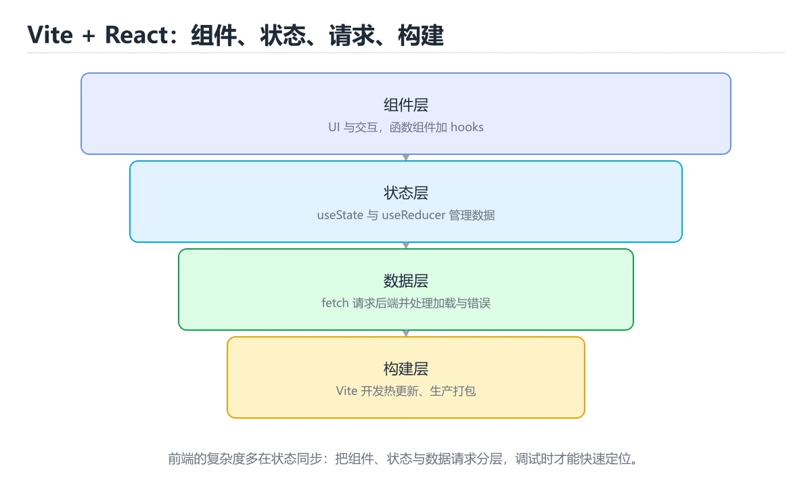
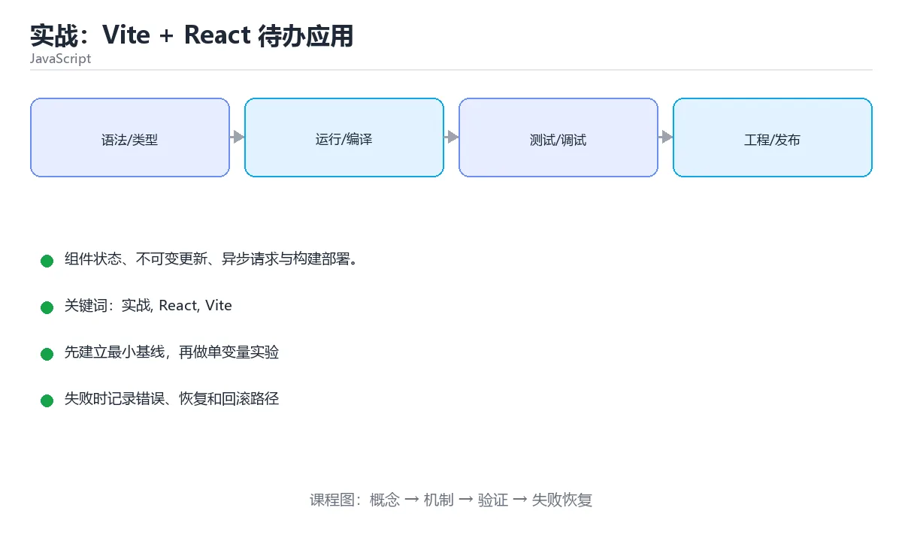

# 实战：Vite + React 待办应用





> 内容更新时间：2026-10-06 · 学习阶段：高级 · 预计用时：110 分钟

## 学习目标

- 能用自己的话解释实战：Vite + React 待办应用解决了什么问题，而不是只背术语。
- 能说清 「实战」、「React」、「Vite」、「useState」 之间的关系，并分别举出一个例子。
- 能把本课知识放回「JavaScript」的知识体系，说明它和相邻主题的边界。
- 能完成本课练习，并用验收标准检查自己的结果。

> 一句话摘要：组件状态、不可变更新、异步请求与构建部署。

## 前置知识

- 先完成上一课《模块化与工程化》；如果已经掌握，可以直接用本课练习自测。
- 开始前先复习：实战、React、Vite。
- 如果某一步看不懂，先记录具体卡点，完成练习后再回头读一遍。

## 初始化

```bash
npm create vite@latest todo-app -- --template react-ts
cd todo-app
npm install
npm run dev          # 本地开发服务器，支持热更新
npm run build        # 产出 dist/ 静态文件
npm run preview      # 本地预览构建结果
```

选 TypeScript 模板的理由：组件 props 与接口数据都有类型提示，重构更安全。

## 组件与状态

```tsx
import { useState } from 'react';
type Todo = { id: number; text: string; done: boolean };
export default function App() {
  const [todos, setTodos] = useState<Todo[]>([]);
  const [text, setText] = useState('');
  function addTodo() {
    const trimmed = text.trim();
    if (!trimmed) return;
    setTodos(prev => [...prev, { id: Date.now(), text: trimmed, done: false }]);
    setText('');
  }
  function toggle(id: number) {
    setTodos(prev => prev.map(t => (t.id === id ? { ...t, done: !t.done } : t)));
  }
  return (
    <main>
      <h1>待办清单</h1>
      <input value={text} onChange={e => setText(e.target.value)} placeholder="输入任务" />
      <button onClick={addTodo}>添加</button>
      <ul>
        {todos.map(todo => (
          <li key={todo.id} onClick={() => toggle(todo.id)}
              style={{ textDecoration: todo.done ? 'line-through' : 'none' }}>
            {todo.text}
          </li>
        ))}
      </ul>
    </main>
  );
}
```

关键点：状态用不可变更新（`[...prev]`、`prev.map`），不要直接 `push`；列表必须有稳定 `key`；事件处理用箭头函数避免 `this` 问题。

## 请求后端数据

```tsx
import { useEffect, useState } from 'react';
function useTodos() {
  const [todos, setTodos] = useState<Todo[]>([]);
  const [loading, setLoading] = useState(true);
  const [error, setError] = useState<string | null>(null);
  useEffect(() => {
    const controller = new AbortController();
    fetch('/api/todos', { signal: controller.signal })
      .then(res => {
        if (!res.ok) throw new Error(`HTTP ${res.status}`);
        return res.json();
      })
      .then(setTodos)
      .catch(err => { if (err.name !== 'AbortError') setError(err.message); })
      .finally(() => setLoading(false));
    return () => controller.abort();
  }, []);
  return { todos, loading, error };
}
```

## 工程配置

```json
{
  "scripts": {
    "dev": "vite",
    "build": "tsc -b && vite build",
    "lint": "eslint .",
    "test": "vitest"
  }
}
```

用代理避免跨域：

```ts
export default defineConfig({
  server: { proxy: { '/api': 'http://localhost:8080' } },
});
```

## 上线清单

1. `npm run build` 产物是纯静态文件，可放 Nginx 或 CDN。
2. 接口地址用 `import.meta.env` 注入，不要硬编码。
3. 提交 `package-lock.json`，CI 用 `npm ci`。
4. 先做打包体积分析，再考虑代码分割。

## 本课小结

前端工程 = **组件化 UI + 不可变状态 + 异步数据获取 + 构建工具**。把这个小应用跑通，再学 React/Vue 的进阶概念会顺畅很多。

## React 核心速查

| 概念 | 说明 | 常见写法 |
| --- | --- | --- |
| 组件 | 返回 UI 的函数 | `function Item({ id }) { ... }` |
| Props | 父传子的只读数据 | 解构使用，避免直接修改 |
| State | 组件内部状态 | `const [list, setList] = useState([])` |
| 派生值 | 能从 state 算出来的值 | 直接计算，不要额外存 state |
| 副作用 | 请求、订阅、定时器 | `useEffect(() => { ... }, [deps])` |
| 引用 | 存 DOM 或可变值 | `useRef(null)` |
| 记忆化值 | 昂贵计算缓存 | `useMemo(() => compute(a), [a])` |
| 记忆化函数 | 传给子组件的稳定函数 | `useCallback(fn, [deps])` |
| 上下文 | 跨层级共享 | `createContext` + `useContext` |
| 列表渲染 | 渲染数组 | `list.map((item) => <Item key={item.id} />)` |
| 条件渲染 | 按条件显示 | `{loading ? <Spinner /> : <List />}` |

## 状态更新速查（不可变）

```jsx
// 数组：增、删、改都返回新数组
setTodos((prev) => [...prev, newTodo]);
setTodos((prev) => prev.filter((t) => t.id !== id));
setTodos((prev) => prev.map((t) => (t.id === id ? { ...t, done: !t.done } : t)));

// 对象：展开后覆盖字段
setUser((prev) => ({ ...prev, name: "新名字" }));

// 嵌套结构：逐层展开，避免直接改原对象
setState((prev) => ({
  ...prev,
  profile: { ...prev.profile, age: 18 },
}));
```

## 常见错误与排查

| 容易写错的做法 | 实际现象 | 原因与正确做法 |
| --- | --- | --- |
| `list.push(item)` 后 `setList(list)` | 引用没变，界面不刷新 | 用 `[...list, item]` 生成新数组 |
| 直接改 `user.name = "x"` | 组件不重渲染 | 用展开或不可变工具生成新对象 |
| 用数组下标当 `key` | 删除中间项后状态错位 | 用稳定唯一 ID 作 key |
| `useEffect` 依赖数组漏写变量 | 读到过期闭包值 | 写全依赖，或用函数式更新 |
| `useEffect` 里 `async` 直接回调 | 返回 Promise，React 报警告 | 内部再定义 async 函数并调用 |
| 忘记清理订阅或定时器 | 内存泄漏、重复请求 | `useEffect` 返回清理函数 |
| 在渲染函数里发请求 | 每次渲染都请求 | 放进 `useEffect` |
| 派生数据也存 state | 两份数据不同步 | 直接计算派生值 |
| `setCount(count + 1)` 连续调用两次 | 只加 1 | 用函数式更新 `setCount((c) => c + 1)` |
| 把 `useMemo` 当性能万能药 | 代码更复杂但没有收益 | 先测量，只在确有开销时使用 |

## 工程化速查

| 目的 | 命令 / 做法 |
| --- | --- |
| 开发调试 | `npm run dev`（Vite 热更新） |
| 生产构建 | `npm run build` |
| 本地预览产物 | `npm run preview` |
| 代码规范 | ESLint + Prettier，接入 CI |
| 单元测试 | Vitest + Testing Library |
| 端到端测试 | Playwright |
| 环境变量 | `.env` 中 `VITE_` 前缀才会暴露给前端 |

## 复习与自测

- [ ] 状态更新一律使用不可变写法。
- [ ] 列表渲染使用稳定唯一 key。
- [ ] `useEffect` 依赖写全，并有清理逻辑。
- [ ] 派生数据不额外存 state。
- [ ] 提交前跑 lint 与测试，环境变量不写进代码。

## 零基础详解：从零做一个前端小项目

### 一句话说清它是什么

一个能交付的前端项目要有：**能跑起来的开发环境、清晰的分层、可打包的构建、可验证的测试**。
下面用一个「图书检索页」把这些串起来。

### 用生活比喻理解

| 目录 | 比喻 | 说明 |
| --- | --- | --- |
| `src/api/` | 采购通道 | 只负责取数据 |
| `src/ui/` | 装修队 | 只负责渲染 |
| `src/state/` | 公告栏 | 共享状态 |
| `src/utils/` | 工具箱 | 纯函数 |
| `public/` | 门面 | 静态资源与入口 HTML |

### 推荐目录结构

```text
bookfinder/
  index.html
  package.json
  vite.config.js
  src/
    main.js          入口：只做组装
    api/books.js     数据获取
    state/store.js   状态与订阅
    ui/list.js       列表渲染
    ui/search.js     搜索框
    utils/format.js  纯函数
  tests/
    format.test.js
```

### 状态与视图分离

```javascript
// state/store.js
export function createStore(initial) {
  let state = initial;
  const listeners = new Set();

  return {
    get state() {
      return state;
    },
    setState(patch) {
      state = { ...state, ...patch };
      listeners.forEach((fn) => fn(state));
    },
    subscribe(fn) {
      listeners.add(fn);
      return () => listeners.delete(fn);      // 返回取消订阅
    },
  };
}
```

```javascript
// main.js —— 只做组装，不写业务细节
import { searchBooks } from "./api/books.js";
import { createStore } from "./state/store.js";
import { renderList } from "./ui/list.js";
import { bindSearch } from "./ui/search.js";

const store = createStore({ status: "idle", keyword: "", items: [], error: null });

store.subscribe((state) => renderList(document.querySelector("#list"), state));

bindSearch(document.querySelector("#search"), async (keyword) => {
  store.setState({ status: "loading", keyword, error: null });
  try {
    const items = await searchBooks(keyword);
    store.setState({ status: "success", items });
  } catch (error) {
    store.setState({ status: "error", error: error.message });
  }
});
```

### 四态渲染：别让页面白屏

```javascript
// ui/list.js
export function renderList(container, state) {
  switch (state.status) {
    case "idle":
      container.replaceChildren(text("输入关键词开始搜索"));
      return;
    case "loading":
      container.replaceChildren(text("加载中……"));
      return;
    case "error":
      container.replaceChildren(text(`出错了：${state.error}`));
      return;
    case "success":
      if (state.items.length === 0) {
        container.replaceChildren(text("没有找到相关书籍"));
        return;
      }
      container.replaceChildren(
        ...state.items.map((book) => {
          const li = document.createElement("li");
          li.textContent = `${book.title} — ${book.author}`;
          li.dataset.id = book.id;
          return li;
        }),
      );
  }
}

function text(message) {
  const p = document.createElement("p");
  p.textContent = message;
  return p;
}
```

**用 `textContent` 而不是 `innerHTML`**：数据来自接口，必须当作不可信内容。

### 数据请求：超时 + 错误归一化

```javascript
// api/books.js
export async function searchBooks(keyword, { timeout = 8000 } = {}) {
  const controller = new AbortController();
  const timer = setTimeout(() => controller.abort(), timeout);

  try {
    const res = await fetch(`/api/books?q=${encodeURIComponent(keyword)}`, {
      signal: controller.signal,
    });
    if (!res.ok) throw new Error(`服务返回 ${res.status}`);
    const data = await res.json();
    if (!Array.isArray(data.items)) throw new Error("返回结构不符合预期");
    return data.items;
  } catch (error) {
    if (error.name === "AbortError") throw new Error("请求超时");
    throw error;
  } finally {
    clearTimeout(timer);
  }
}
```

### 纯函数与测试

```javascript
// utils/format.js
export const formatAuthors = (authors = []) =>
  authors.length > 2 ? `${authors[0]} 等 ${authors.length} 人` : authors.join("、");

export const truncate = (s, max = 40) =>
  s.length <= max ? s : `${s.slice(0, max - 1)}…`;
```

```javascript
// tests/format.test.js（vitest）
import { describe, expect, it } from "vitest";
import { formatAuthors, truncate } from "../src/utils/format.js";

describe("formatAuthors", () => {
  it("两位作者用顿号连接", () => {
    expect(formatAuthors(["A", "B"])).toBe("A、B");
  });

  it("超过两位显示等几人", () => {
    expect(formatAuthors(["A", "B", "C"])).toBe("A 等 3 人");
  });

  it("空数组返回空串", () => {
    expect(formatAuthors([])).toBe("");
  });
});

describe("truncate", () => {
  it("超长文本截断并加省略号", () => {
    expect(truncate("a".repeat(50), 10)).toHaveLength(10);
  });
});
```

### 构建与检查

```bash
npm ci
npm run lint
npm test -- --run
npm run build          # 产出 dist/
npm run preview        # 本地预览产物，而不是只看 dev
```

**务必预览 `dist`**：很多问题（相对路径、环境变量）只在产物里出现。

### 新手最容易踩的八个坑

| 坑 | 现象 | 正确做法 |
| --- | --- | --- |
| 入口文件写满业务 | 无法维护 | 入口只做组装 |
| 用 `innerHTML` 渲染接口数据 | XSS 风险 | 用 `textContent` |
| 没有四态 | 出错时白屏 | 加载、成功、空、失败都写 |
| 请求没有超时 | 一直转圈 | `AbortController` 加超时 |
| 只在 dev 测 | 上线才发现问题 | 预览 `dist` 产物 |
| 状态直接改对象 | 视图不更新 | 用统一的 `setState` |
| 忘记清理定时器 | 报错与内存泄漏 | `finally` 里 `clearTimeout` |
| 只测工具函数 | 交互出错没人发现 | 补组件或 E2E 测试 |

### 学完自测

- [ ] 能说出 api、state、ui、utils 各自的职责。
- [ ] 知道四态渲染为什么能消除白屏。
- [ ] 能说出请求超时的实现方式。
- [ ] 知道为什么必须预览构建产物。
- [ ] 能说出纯函数为什么最容易测试。

## 动手练习

> 本课练习重点：围绕「实战、React、Vite」完成复述、实验和交付，每个结果都要能被别人检查。

先在 Node 或浏览器复现行为，再改写异步与错误路径，最后补测试。

### 练习 1：建立心智模型（10 分钟）

合上教程，用 3～5 句话回答：

1. 实战：Vite + React 待办应用解决了什么问题？
2. 如果没有它，会出现什么具体后果？
3. 它和「React」是什么关系？

**验收标准**：至少出现一个本课关键词，并写出一个反例、边界条件或失效场景。

### 练习 2：做一次可控实验（20 分钟）

从正文中选一个最小示例，完成以下操作：

1. 先预测修改一个参数、输入或步骤后的结果。
2. 再实际执行或逐步推演，记录真实结果。
3. 如果结果与预测不同，写出差异原因。

**验收标准**：留下「原例 → 改动 → 预测 → 结果 → 原因」五步记录。

### 练习 3：交付一个小结果（30 分钟）

在浏览器控制台或 Node.js 中写一个最小示例，列出至少 3 组输入输出。

任务要求：

- 结果必须能被别人检查，不能只写“我已经理解了”。
- 至少覆盖「实战」和「React」两个关键词。
- 写出 1 个仍然不确定的问题，以及下一步如何验证。

> 提示：时间有限时优先做练习 1 和练习 2；练习 3 可以拆成两次完成。

## 验证命令与预期输出

项目代码不能只看“能编译”，还要能按固定命令复现结果。下表给出最低验证集：

| 阶段 | 命令 | 预期输出 |
| --- | --- | --- |
| 安装依赖 | `npm ci` | 按锁文件安装，无缺失依赖 |
| 运行测试 | `npm test` | 测试全部通过 |
| 构建 | `npm run build` | 生成 dist 目录且没有构建错误 |

### 验收证据

- [ ] 保存依赖安装和启动命令的完整输出。
- [ ] 至少运行 3 条测试，其中包含一条非法输入或失败路径。
- [ ] 重复执行同一操作两次，确认没有重复写入或副作用。
- [ ] 记录一次失败状态码、错误日志和恢复步骤。
- [ ] 在 README 中写明环境版本、启动方式和回滚方式。

### 回归与回滚

1. 先在一个可丢弃的目录或临时数据库执行，避免污染真实数据。
2. 修改一处逻辑后重跑全部验证命令，确认没有回归。
3. 若失败，回滚到上一个可运行版本并保留失败日志。
4. 定位原因后补一条自动化测试，再重新执行发布流程。
5. 把教训写入项目复盘或本课笔记，形成下一次的检查项。

## 可运行练习

### 任务 1：先跑通，再解释

```typescript
export default defineConfig({
  server: { proxy: { '/api': 'http://localhost:8080' } },
});
```

### 任务 2：只改一个条件

把「实战：Vite + React 待办应用」的最小示例复制一份，只改一个条件再跑一次：

- 改动点：只把实战的输入换成空值、极值或错误输入，其余保持不变。
- 预测：先写下「实战：Vite + React 待办应用」在改动后的输出或错误信息，再运行。
- 记录：对照改动前后的结果，指出差异出在哪一步。
- 验收：换回原条件能复现原结果，改动只影响实战。

### 任务 3：迁移到自己的数据

用同一套思路处理一组你自己的数据或场景，保持输出格式与任务 1 一致。

## 故障现场

### 现场 1：本课的 实战 常规用例通过，但边界用例失败

**症状**：在本课的练习或生产场景里出现“本课的 实战 常规用例通过，但边界用例失败”。

**复现**：准备一组最小输入，只保留触发“本课的 实战 常规用例通过，但边界用例失败”的必要条件，连续运行两次确认结果稳定。

**定位**：围绕“实战 的前置条件与取值边界没有写进代码，默认值掩盖了空值和极值”检查调用链、输入数据和环境配置，先验证假设再改代码。

**预防**：把“本课的 实战 常规用例通过，但边界用例失败”写成一条自动化用例，并在本课的验收清单里保留对应检查项。

### 现场 2：本课的 React 结果在两次运行之间不一致

**症状**：在本课的练习或生产场景里出现“本课的 React 结果在两次运行之间不一致”。

**复现**：准备一组最小输入，只保留触发“本课的 React 结果在两次运行之间不一致”的必要条件，连续运行两次确认结果稳定。

**定位**：围绕“React 依赖了当前版本、执行顺序或共享状态，单次运行无法暴露差异”检查调用链、输入数据和环境配置，先验证假设再改代码。

**预防**：把“本课的 React 结果在两次运行之间不一致”写成一条自动化用例，并在本课的验收清单里保留对应检查项。

### 现场 3：本课的验证只在开发机通过

**症状**：在本课的练习或生产场景里出现“本课的验证只在开发机通过”。

**定位**：围绕“环境版本、配置和输入规模与目标环境不同，实战 缺少可重复的验证记录”检查调用链、输入数据和环境配置，先验证假设再改代码。

## 版本与时效

- 运行时要同时考虑浏览器基线、Node LTS 与打包工具的降级策略
- 升级前用特性检测和构建目标矩阵验证，不要只在本机浏览器测试

### 升级检查清单

- 先固定当前版本，跑通全部示例与测验，再升级工具链。
- 只改一个版本变量，记录编译、测试、性能与产物体积的变化。
- 重点回归默认值、弃用警告、序列化格式、并发语义和错误信息。
- 升级完成后更新本课的“最后复核 / 下次复核”日期与版本说明。

## 本课复习清单

离开本课前，逐项确认：

- [ ] 不看解析，能说出「React 中更新数组状态为什么不能直接 push？」的判断依据。
- [ ] 不看解析，能说出「列表渲染时 key 的作用是？」的判断依据。
- [ ] 不看解析，能说出「npm run build 之后产物是什么？」的判断依据。
- [ ] 不看解析，能说出「React 中 useEffect 的依赖数组传空数组表示？」的判断依据。
- [ ] 不看解析，能说出「Vite 相比传统打包器在开发时的优势是？」的判断依据。
- [ ] 不看解析，能说出的判断依据。
- [ ] 至少运行一次本课示例，记录输入、输出和一个边界情况。
- [ ] 把本课最容易混淆的两个概念写成一句话对照。

| 复盘项 | 记录 |
| --- | --- |
| 已经能独立解释的考点 |  |
| 仍然说不清的概念 |  |
| 下一步验证动作 |  |

## 术语速查

| 术语 | 一句话说明 |
| --- | --- |
| `[...prev]` | 关键点：状态用不可变更新（`[...prev]`、`prev.map`），不要直接 `push`；列表必须有稳定 `key`；事件处理用箭头函数避免 `this` 问题。 |
| `prev.map` | 关键点：状态用不可变更新（`[...prev]`、`prev.map`），不要直接 `push`；列表必须有稳定 `key`；事件处理用箭头函数避免 `this` 问题。 |
| `push` | 关键点：状态用不可变更新（`[...prev]`、`prev.map`），不要直接 `push`；列表必须有稳定 `key`；事件处理用箭头函数避免 `this` 问题。 |
| `key` | 关键点：状态用不可变更新（`[...prev]`、`prev.map`），不要直接 `push`；列表必须有稳定 `key`；事件处理用箭头函数避免 `this` 问题。 |
| `this` | 关键点：状态用不可变更新（`[...prev]`、`prev.map`），不要直接 `push`；列表必须有稳定 `key`；事件处理用箭头函数避免 `this` 问题。 |
| `npm run build` | `npm run build` 产物是纯静态文件，可放 Nginx 或 CDN。 |

## 考点精讲

### 考点 1：代码补全·实战

- **题目**：这段 JavaScript 代码是「实战：Vite + React 待办应用」的示例片段，下面哪一项描述与它一致？
- **判断依据**：在「实战：Vite + React 待办应用」里，这段代码把主要逻辑封装在函数或方法里，需要被调用才会执行。这段代码出自「实战：Vite + React 待办应用」的正文示例，围绕实战、React、Vite展开；把输入或边界换成空值、极值或失败情况后，结论要以「实战：Vite + React 待办应用」的实际运行结果为准。

### 考点 2：概念判断·实战

- **题目**：列表渲染时 key 的作用是？
- **判断依据**：在「实战：Vite + React 待办应用」里，帮助 diff 算法识别元素，避免复用错位。稳定唯一的 key 能让 React 正确复用节点，使用下标会在增删时出问题。把“帮助 diff 算法识别元素”代回「实战：Vite + React 待办应用」里“列表渲染时 key 的作用是”的例子核对，条件一旦改变，结论就要用实战、React、Vite重新推导。

### 考点 3：概念判断·实战

- **题目**：npm run build 之后产物是什么？
- **判断依据**：在「实战：Vite + React 待办应用」里，静态 HTML/CSS/JS 文件。Vite 产出 dist/ 静态资源，可直接部署到 Nginx 或 CDN。把“静态 HTML/CSS/JS 文件”代回「实战：Vite + React 待办应用」里“npm run build 之后产物是什么”的例子核对，条件一旦改变，结论就要用实战、React、Vite重新推导。

### 考点 4：多选辨析·实战

- **题目**：围绕“实战：Vite + React 待办应用”中的 实战、React、Vite，下列哪两项是本课强调的实践判断？
- **判断依据**：在「实战：Vite + React 待办应用」里，学习 实战 时要同时说明输入、输出和失败路径，不能只看正常流程。结论应落在验证 React 时要固定版本并覆盖边界输入。在实战：Vite + React 待办应用里，判断 React 时要固定版本与边界输入，所以“验证 React 时要固定版本并覆盖边界输入，结论才可复现”才可复现。在「实战：Vite + React 待办应用」里，这道题要求区分概念与边界，验证 React 时要固定版本并覆盖边界输入，结论才可复现。

### 考点 5：概念判断·实战

- **题目**：Vite 相比传统打包器在开发时的优势是？
- **判断依据**：在「实战：Vite + React 待办应用」里，基于浏览器原生 ESM 按需编译。开发阶段不整体打包，生产构建仍使用 Rollup 做优化打包。回到「实战：Vite + React 待办应用」的正文示例，用“Vite 相比传统打包器在开发时的优”走一遍实战、React、Vite的完整流程，能复现的结论才可以保留。

### 考点 6：填空·实战

- **题目**：补全代码：「实战：Vite + React 待办应用」示例中，下面这行代码缺少哪个关键字或函数名？请填入 ____。 `const controller = new ____;`
- **判断依据**：空格应填写「AbortController」、「abortcontroller」。回到「实战：Vite + React 待办应用」的正文示例，用“补全代码”走一遍实战、React、Vite的完整流程，能复现的结论才可以保留。回到实战、React、Vite本身再看一遍：只有“AbortController”与题干“Vite”的前提一致，结论才成立。

## English Overview

**Title:** Project: React Todo App

**Summary:** Components, immutable state, async data and build.

**Category:** JavaScript
**Level:** 高级
**Key terms:** 实战, React, Vite, useState, useEffect

## 内容元数据

- 内容版本：v2.0
- 最后更新：2026-10-06
- 学习阶段：高级
- 适用环境：Node.js 22+ / 现代浏览器
- 内容来源：内置结构化课程与工程实践整理
- 相关主题：实战、React、Vite、useState、useEffect
- 质量版本：P0 测验标准 + P1 覆盖扩展 + P2 体验补全

## 项目专属规格：实战：Vite + React 待办应用

### 核心场景

组件状态、不可变更新、异步请求与构建部署。 项目目标是把「实战、React、Vite、useState、useEffect」落实为可运行、可测试、可回滚的交付物。

### 架构与数据流

```text
用户/输入 → 接口或命令 → 领域逻辑 → 存储/外部依赖 → 输出与监控
                         ↘ 失败分类 → 重试/补偿 → 回滚
```

### 最小数据模型

| 对象 | 关键字段 | 约束 |
| --- | --- | --- |
| 输入实体 | 实战、时间、来源 | 必填校验、长度限制、幂等键 |
| 任务实体 | 状态、优先级、创建时间 | 状态迁移合法、不可重复执行 |
| 结果实体 | 输出、错误码、耗时 | 可序列化、错误可解释 |
| 审计记录 | 操作者、动作、结果、时间 | 不可篡改、可查询、脱敏 |

### 验收场景

1. 正常路径：最小输入得到预期输出，并留下日志与指标。
2. 边界路径：空值、最大值、重复数据和超长内容得到明确处理。
3. 失败路径：依赖超时或不可用时能快速失败、重试或降级。
4. 幂等路径：同一请求执行两次不会产生重复副作用。
5. 回滚路径：回滚后数据一致，且能说明恢复时间和影响范围。

## 项目交付物

### 建议仓库结构

```text
src/
  routes/
  services/
  repositories/
tests/
package.json
```

### 测试矩阵

| 层级 | 覆盖内容 | 最低数量 | 通过标准 |
| --- | --- | ---: | --- |
| 单元测试 | 领域规则、边界和错误分类 | 8 | 正常、边界、失败路径全部通过 |
| 集成测试 | 数据库、网络、文件或平台边界 | 3 | 使用真实边界且可重复运行 |
| 端到端测试 | 核心用户路径 | 1 | 从输入到输出完整跑通 |
| 手动验收 | 文档中列出的 5 个场景 | 5 | 有命令、输出和结论记录 |

### 验收数据

```json
{
  "project": "js_project",
  "input": {"case": "normal", "value": 5},
  "expected": {"ok": true, "result": 5},
  "failure_case": {"value": -1, "error": "validation_error"},
  "idempotency_key": "demo-001"
}
```

### 复盘模板

| 问题 | 记录 |
| --- | --- |
| 原目标是什么？ | 用一句话描述可验收目标 |
| 实际发生了什么？ | 时间线、指标和关键日志 |
| 哪个假设被推翻？ | 根因与促成因素 |
| 如何回滚？ | 步骤、耗时和数据校验 |
| 下一步做什么？ | 负责人、期限和验证方式 |

> 项目验收围绕「实战、React、Vite」：至少完成一次正常路径、一次边界输入、一次失败恢复和一次幂等检查。

## Full English Study Guide

### Overview

**Project: React Todo App** focuses on Components, immutable state, async data and build.

### Learning Outcomes

- Explain what **Project: React Todo App** solves and when it should be used.

### Glossary

- Topic: **Project: React Todo App**
- Related terms: 实战, React, Vite, useState

## Bilingual Section Outline

| 中文小节 | English section |
| --- | --- |
| 学习目标 | Learning objectives |
| 前置知识 | Prerequisites |
| 初始化 | 初始化 |
| 组件与状态 | 组件与状态 |
| 请求后端数据 | 请求后端数据 |
| 工程配置 | 工程配置 |
| 上线清单 | 上线清单 |
| 本课小结 | Summary |
| React 核心速查 | React 核心速查 |
| 状态更新速查（不可变） | 状态更新速查（不可变） |

## 参考资料与复核

- 最后复核：2026-10-04
- 下次复核：2027-04-04
- 复核范围：版本兼容、API 行为、安全建议与工程实践
- 来源性质：官方文档、标准或权威教材；正文为离线教学重组

| 参考资料 | 本课用途 |
| --- | --- |
| [MDN Promise](https://developer.mozilla.org/docs/Web/JavaScript/Reference/Global_Objects/Promise) | Promise 与异步链 |
| [MDN JavaScript 指南](https://developer.mozilla.org/docs/Web/JavaScript/Guide) | 语言基础与浏览器 API |
| [Jest 文档](https://jestjs.io/docs/getting-started) | JavaScript 测试与断言 |

> 「实战：Vite + React 待办应用」的链接用于离线阅读后的延伸核对；App 不会自动联网。
