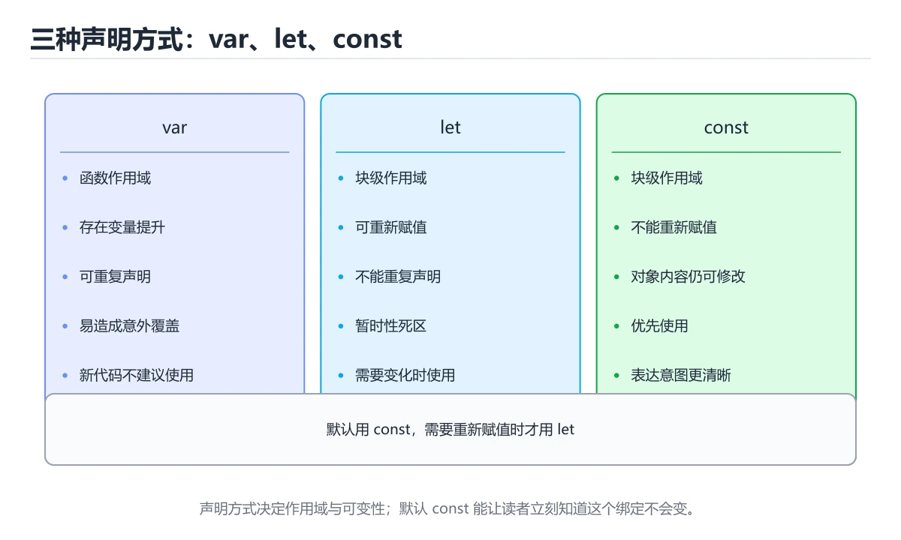
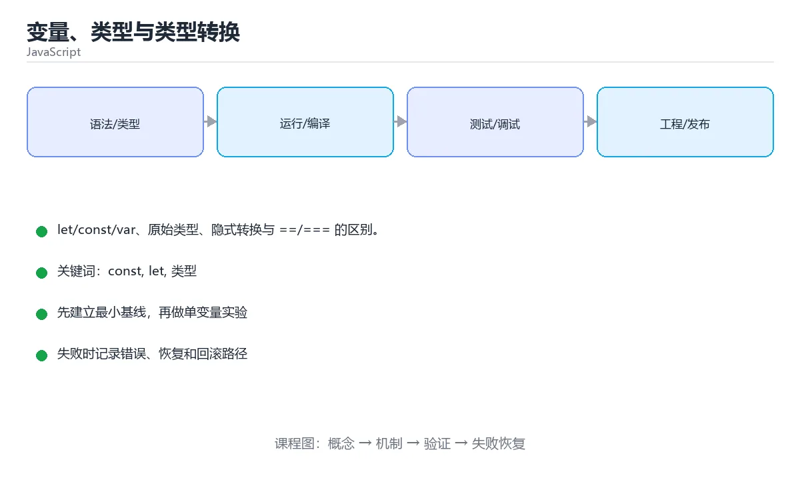

# 变量、类型与类型转换





> 内容更新时间：2026-10-03 · 学习阶段：基础 · 预计用时：14 分钟

## 学习目标

- 能用自己的话解释本课主题解决了什么问题，而不是只背术语。
- 能说清 「const」、「let」、「类型」、「类型转换」 之间的关系，并分别举出一个例子。
- 能把本课知识放回「JavaScript」的知识体系，说明它和相邻主题的边界。
- 能完成本课练习，并用验收标准检查自己的结果。

> 一句话摘要：let/const/var、原始类型、隐式转换与 ==/=== 的区别。

## 前置知识

- 先完成上一课《JavaScript 与运行环境》；如果已经掌握，可以直接用本课练习自测。
- 本课阶段：基础。建议会读写简单代码或命令，并理解变量、输入输出等基本概念。
- 开始前先复习：const、let、类型。
- 如果某一步看不懂，先记录具体卡点，完成练习后再回头读一遍。

## 三种声明方式

```javascript
const PI = 3.14;    // 常量，不能重新赋值（默认选择）
let count = 0;      // 块级作用域变量
var old = 1;        // 函数作用域 + 提升，旧代码才用

const user = { name: 'tom' };
user.name = 'alice';   // const 只限制重新赋值，不限制修改内容
```

## 数据类型

```javascript
// 原始类型
'text'            // string
42                // number（整数与小数共用双精度浮点）
9007199254740993n // bigint
true              // boolean
null              // 有意置空
undefined         // 未赋值
Symbol('id')      // 唯一标识

// 引用类型
{ a: 1 }          // object
[1, 2, 3]         // array
() => {}          // function

typeof null;      // 'object'：历史遗留 bug
Array.isArray([]); // true
```

## 类型转换

```javascript
Number('42');          // 42
Number('abc');         // NaN
parseInt('42px', 10);  // 42
String(42);            // '42'
Boolean(0);            // false

'1' + 2;               // '12'：+ 遇到字符串会拼接
'1' - 2;               // -1：减法强制转数字
1 == '1';              // true：宽松相等会转换类型
1 === '1';             // false：严格相等，推荐
Number.isNaN(NaN);     // true，判断 NaN 的正确方式
```

## 判空与默认值

```javascript
value ?? 'default';        // 只有 null/undefined 才用默认值
0 || 'default';            // 'default'：|| 会把 0 也当成假值
user?.address?.city;       // 可选链，中间为空返回 undefined
if (value == null) {}      // 同时判断 null 与 undefined
```

## 本课小结
三条铁律：**默认 const、比较用 ===、空值判断用 ?? 或 == null**。理解 `+` 与 `-` 的隐式转换差异，能解释多数「诡异」行为。

## 类型判断速查

| 表达式 | 结果 | 说明 |
| --- | --- | --- |
| `typeof "a"` | `"string"` | 原始类型判断可靠 |
| `typeof 1` | `"number"` | 整数与小数同一类型 |
| `typeof 1n` | `"bigint"` | 大整数 |
| `typeof true` | `"boolean"` |  |
| `typeof undefined` | `"undefined"` | 变量未赋值 |
| `typeof null` | `"object"` | 历史遗留问题，判空用 `x === null` |
| `typeof []` | `"object"` | 数组要 `Array.isArray(x)` |
| `typeof function(){}` | `"function"` |  |
| `typeof Symbol()` | `"symbol"` |  |
| `Number.isNaN(NaN)` | `true` | 判 NaN 用 `Number.isNaN`，别用 `x === NaN` |
| `Array.isArray([])` | `true` | 判断数组的标准写法 |
| `x instanceof Date` | 布尔值 | 判断对象的类，跨 iframe 可能失效 |

## 类型转换速查

| 写法 | 结果 | 备注 |
| --- | --- | --- |
| `Number("12")` | `12` | 空字符串是 `0`，非法字符是 `NaN` |
| `parseInt("12px", 10)` | `12` | 从头解析到非法字符为止，务必带基数 |
| `parseFloat("3.14abc")` | `3.14` | 同上 |
| `String(12)` | `"12"` | 显式转换，推荐 |
| `Boolean("")` | `false` | 假值：`""`、`0`、`-0`、`NaN`、`null`、`undefined`、`false` |
| `Boolean("0")` | `true` | 非空字符串一律为真，表单校验常踩 |
| `[1, 2] + ""` | `"1,2"` | 隐式转换，可读性差 |
| `0.1 + 0.2` | `0.30000000000000004` | 浮点误差，比较用 `Math.abs(a - b) < 1e-9` |
| `null == undefined` | `true` | 两者互相宽松相等，其他都为假 |
| `null === undefined` | `false` | `===` 不做类型转换，推荐始终使用 |
| `"5" - 1` | `4` | `-` 会转数字，而 `"5" + 1` 是 `"51"` |

## 常见错误对照表

| 容易写错的写法 | 实际现象 | 原因与正确做法 |
| --- | --- | --- |
| `if (obj.name)` | 空字符串或 0 被当成缺失 | 明确判断：`obj.name !== undefined && obj.name !== null` 或 `obj.name ?? ""` |
| `const obj = {}; obj.a = 1` | 正常，能改属性 | `const` 只锁变量绑定，不改对象内容；要冻结用 `Object.freeze(obj)` |
| `{ a: 1 } === { a: 1 }` | `false` | 对象比较的是引用；比较内容要逐字段或用深比较函数 |
| `JSON.parse(undefined)` | `SyntaxError` | 先判断空值：`text ? JSON.parse(text) : null` |
| `Number("")` | `0` | 空输入要先校验，别直接转换 |
| `[] == false` | `true` | 宽松相等会做隐式转换，规则复杂，统一用 `===` |
| `let x; x.toFixed(2)` | `TypeError` | `let` 声明未赋值是 `undefined`，先赋数字 |
| 用 `==` 比较 `null` 与 `0` | `false`，但 `0 == ""` 是 `true` | 宽松相等陷阱多，直接上 `===` |

## 自测清单

- [ ] 能用 `typeof` 正确判断六种原始类型，知道 `typeof null` 是 `"object"`。
- [ ] 判断数组用 `Array.isArray()` 而不是 `typeof`。
- [ ] 判断 `NaN` 用 `Number.isNaN()` 而不是 `=== NaN`。
- [ ] 记住七个假值，知道 `"0"` 和 `[]` 都是真值。
- [ ] 默认使用 `===` / `!==`，除非明确需要宽松相等。

## 零基础详解：JavaScript 的类型与「隐式转换」

### 一句话说清它是什么

JavaScript 有 7 种**原始类型**和 1 种**引用类型**（Object）。
它既灵活又容易出错，因为运算时会自动做类型转换——**看懂转换规则，就躲开了大半的坑**。

### 类型总览

| 类型 | 例子 | `typeof` 结果 | 说明 |
| --- | --- | --- | --- |
| number | `1`、`3.14`、`NaN` | `"number"` | 不分整数和小数 |
| string | `"hi"`、`` `hi` `` | `"string"` | 不可变 |
| boolean | `true` / `false` | `"boolean"` | 真假值 |
| undefined | `let x;` | `"undefined"` | 声明了但没赋值 |
| null | `let y = null;` | `"object"` | **历史遗留 bug**，表示「空」 |
| symbol | `Symbol("id")` | `"symbol"` | 唯一标识 |
| bigint | `10n` | `"bigint"` | 超大整数 |
| object | `{}`、`[]`、函数 | `"object"` / `"function"` | 引用类型 |

### `null` 与 `undefined` 怎么区分

| 对比 | undefined | null |
| --- | --- | --- |
| 含义 | 还没有值 | 有意置空 |
| 谁产生的 | JS 引擎自动 | 程序员手动 |
| 典型场景 | 未赋值、函数无返回、属性不存在 | 主动清空、接口约定为空 |

```javascript
let a;
console.log(a);                 // undefined
let b = null;
console.log(b);                 // null
console.log(a == b, a === b);   // true false
```

### 真假值：哪些东西是 false

只有这 8 个值是「假」的：`false`、`0`、`-0`、`0n`、`""`、`null`、`undefined`、`NaN`。
其它一切（包括 `[]`、`{}`、`"0"`）都是真。

```javascript
if ([]) console.log("空数组也是真");   // 会打印
if ("0") console.log("字符串 0 也是真");
```

### `==` 与 `===` 的转换规则

```javascript
0 == ""            // true    两边都转成数字
0 == false         // true
null == undefined  // true    规定如此
NaN == NaN         // false   判断 NaN 要用 Number.isNaN()
"1" == 1           // true    字符串被转成数字

"1" === 1          // false   类型不同，直接不相等
```

**规则：日常一律用 `===`；只有判断「null 或 undefined」时，`== null` 可以当作简写。**

### 常见转换速查

| 表达式 | 结果 | 说明 |
| --- | --- | --- |
| `Number("12")` | `12` | 转数字，失败得 `NaN` |
| `Number("")` | `0` | 空串转成 0 |
| `parseInt("12px")` | `12` | 从头解析，遇到非数字停 |
| `String(12)` | `"12"` | 转字符串 |
| `Boolean("")` | `false` | 空串为假 |
| `Boolean("false")` | `true` | 非空字符串都为真 |
| `"1" + 2` | `"12"` | `+` 遇到字符串就拼接 |
| `"3" * 2` | `6` | 其它运算符会转数字 |

### 新手最容易踩的七个坑

| 坑 | 现象 | 正确做法 |
| --- | --- | --- |
| 用 `==` | 结果反直觉 | 用 `===` |
| 把 `NaN` 当相等 | `NaN === NaN` 是 false | 用 `Number.isNaN(x)` |
| 直接调 `parseInt` 忘传进制 | 老浏览器把 `08` 当八进制 | 写 `parseInt(s, 10)` |
| 数字精度 | `0.1 + 0.2 !== 0.3` | 用误差比较，金额用整数分 |
| 字符串拼数字 | `"1" + 2` 得到 `"12"` | 先 `Number()` 转 |
| 判断属性是否存在 | `if (obj.name)` 漏掉 0 和 "" | 用 `"name" in obj` 或 `??` |
| 引用赋值当复制 | 改一处全变 | 用展开运算符浅拷贝 |

### 手把手练习：安全地处理用户输入

```javascript
function toPositiveInt(raw) {
  const n = Number.parseInt(String(raw ?? "").trim(), 10);
  if (!Number.isFinite(n) || n <= 0) {
    throw new Error("请输入一个正整数");
  }
  return n;
}

try {
  console.log(toPositiveInt(" 42 "));   // 42
  console.log(toPositiveInt("abc"));    // 抛错
} catch (error) {
  console.log("捕获到：", error.message);
}
```

### 学完自测

- [ ] 能说出 7 种原始类型。
- [ ] 能解释 `null == undefined` 为 true、`===` 为 false。
- [ ] 能说出 8 个假值。
- [ ] 知道为什么要用 `Number.isNaN` 而不是 `=== NaN`。
- [ ] 能解释 `"1" + 2` 和 `"3" * 2` 为什么结果不同。

## 动手练习

> 本课练习重点：围绕「const、let、类型」完成复述、实验和交付，每个结果都要能被别人检查。

先在 Node 或浏览器复现行为，再改写异步与错误路径，最后补测试。

### 练习 1：建立心智模型（10 分钟）

合上教程，用 3～5 句话回答：

1. 本课主题解决了什么问题？
2. 如果没有它，会出现什么具体后果？
3. 它和「let」是什么关系？

**验收标准**：至少出现一个本课关键词，并写出一个反例、边界条件或失效场景。

### 练习 2：做一次可控实验（20 分钟）

从正文中选一个最小示例，完成以下操作：

1. 先预测修改一个参数、输入或步骤后的结果。
2. 再实际执行或逐步推演，记录真实结果。
3. 如果结果与预测不同，写出差异原因。

**验收标准**：留下「原例 → 改动 → 预测 → 结果 → 原因」五步记录。

### 练习 3：交付一个小结果（30 分钟）

在浏览器控制台或 Node.js 中写一个最小示例，列出至少 3 组输入输出。

任务要求：

- 结果必须能被别人检查，不能只写“我已经理解了”。
- 至少覆盖「const」和「let」两个关键词。
- 写出 1 个仍然不确定的问题，以及下一步如何验证。

> 提示：时间有限时优先做练习 1 和练习 2；练习 3 可以拆成两次完成。

## 可运行练习

### 任务 1：先跑通，再解释

```javascript
let a;
console.log(a);                 // undefined
let b = null;
console.log(b);                 // null
console.log(a == b, a === b);   // true false
```

### 任务 2：只改一个条件

### 任务 3：迁移到自己的数据

用同一套思路处理一组你自己的数据或场景，保持输出格式与任务 1 一致。

## 故障现场

### 现场 1：本课的 const 常规用例通过，但边界用例失败

**症状**：在本课的练习或生产场景里出现“本课的 const 常规用例通过，但边界用例失败”。

**复现**：准备一组最小输入，只保留触发“本课的 const 常规用例通过，但边界用例失败”的必要条件，连续运行两次确认结果稳定。

**定位**：围绕“const 的前置条件与取值边界没有写进代码，默认值掩盖了空值和极值”检查调用链、输入数据和环境配置，先验证假设再改代码。

**预防**：把“本课的 const 常规用例通过，但边界用例失败”写成一条自动化用例，并在本课的验收清单里保留对应检查项。

### 现场 2：本课的 let 结果在两次运行之间不一致

**症状**：在本课的练习或生产场景里出现“本课的 let 结果在两次运行之间不一致”。

**复现**：准备一组最小输入，只保留触发“本课的 let 结果在两次运行之间不一致”的必要条件，连续运行两次确认结果稳定。

**定位**：围绕“let 依赖了当前版本、执行顺序或共享状态，单次运行无法暴露差异”检查调用链、输入数据和环境配置，先验证假设再改代码。

**预防**：把“本课的 let 结果在两次运行之间不一致”写成一条自动化用例，并在本课的验收清单里保留对应检查项。

### 现场 3：本课的验证只在开发机通过

**症状**：在本课的练习或生产场景里出现“本课的验证只在开发机通过”。

**定位**：围绕“环境版本、配置和输入规模与目标环境不同，const 缺少可重复的验证记录”检查调用链、输入数据和环境配置，先验证假设再改代码。

## 版本与时效

- 运行时要同时考虑浏览器基线、Node LTS 与打包工具的降级策略
- 升级前用特性检测和构建目标矩阵验证，不要只在本机浏览器测试

### 升级检查清单

- 先固定当前版本，跑通全部示例与测验，再升级工具链。
- 只改一个版本变量，记录编译、测试、性能与产物体积的变化。
- 重点回归默认值、弃用警告、序列化格式、并发语义和错误信息。
- 升级完成后更新本课的“最后复核 / 下次复核”日期与版本说明。

## 本课复习清单

离开本课前，逐项确认：

- [ ] 不看解析，能说出「const 声明的对象，能否修改它的属性？」的判断依据。
- [ ] 不看解析，能说出「1 === '1' 的结果是？」的判断依据。
- [ ] 不看解析，能说出「判断一个值是否为 NaN，正确做法是？」的判断依据。
- [ ] 不看解析，能说出「typeof null 的结果是？」的判断依据。
- [ ] 不看解析，能说出「下列哪些属于 JavaScript 的原始类型？请选择所有正确答案。」的判断依据。
- [ ] 至少运行一次本课示例，记录输入、输出和一个边界情况。
- [ ] 把本课最容易混淆的两个概念写成一句话对照。

| 复盘项 | 记录 |
| --- | --- |
| 已经能独立解释的考点 |  |
| 仍然说不清的概念 |  |
| 下一步验证动作 |  |

## 术语速查

| 术语 | 本课语境 |
| --- | --- |
| `与` | 三条铁律：**默认 const、比较用 ===、空值判断用 ?? 或 == null**。理解 `+` 与 `-` 的隐式转换差异，能解释多数「诡异」行为。 |
| `typeof "a"` | \| `typeof "a"` \| `"string"` \| 原始类型判断可靠 \| |
| `"string"` | \| `typeof "a"` \| `"string"` \| 原始类型判断可靠 \| |
| `typeof 1` | \| `typeof 1` \| `"number"` \| 整数与小数同一类型 \| |
| `"number"` | \| `typeof 1` \| `"number"` \| 整数与小数同一类型 \| |
| `typeof 1n` | \| `typeof 1n` \| `"bigint"` \| 大整数 \| |
| `"bigint"` | \| `typeof 1n` \| `"bigint"` \| 大整数 \| |
| `typeof true` | \| `typeof true` \| `"boolean"` \|  \| |
| `"boolean"` | \| `typeof true` \| `"boolean"` \|  \| |
| `typeof undefined` | \| `typeof undefined` \| `"undefined"` \| 变量未赋值 \| |
| `"undefined"` | \| `typeof undefined` \| `"undefined"` \| 变量未赋值 \| |
| `typeof null` | \| `typeof null` \| `"object"` \| 历史遗留问题，判空用 `x === null` \| |

## 考点精讲

### 考点 1：const 声明的对象，能否修改它的属性？

- **判断依据**：正确答案是「可以，const 只禁止重新赋值」。const 约束的是绑定不能重新指向，对象内容仍可变。判断这类题时，要把「可以，const 只禁止重新赋值」放回题干限定的对象、输入和边界，「只能读不能写」、「不能，会报错」 等说法虽然包含相关术语，但范围或前提与本题不一致。

### 考点 2：1 === '1' 的结果是？

- **判断依据**：=== 不做类型转换，类型不同直接为 false。作答时，先用const建立输入与输出的基线，再把false代入边界条件核对，结论才能复现。解题的关键不是记住孤立术语，而是确认「false」是否完整覆盖题干的输入、输出和失败路径，并排除「抛异常」、「undefined」这类相邻概念。

### 考点 3：下面这段 JavaScript 代码复现了“变量、类型与类型转换”中 const、let、类型 相关的一个常见故障，哪一项最准确地解释了问题？

- **判断依据**：符合题干条件的是「var 声明的 i 是函数级作用域，三个闭包最终都读到循环结束后的同一个值」。符合题干条件的是var 声明的 i 是函数级作用域，三个闭包最终都读到循环结束后的同一个值。var 在循环结束后仍然保留最后一个值，在这个复现里三个闭包引用的是同一个 const。在这个复现里，把 let 对应的 var 换成 let，每次迭代都会创建新的绑定，闭包就能分别捕获正确的值。

### 考点 4：typeof null 的结果是？

- **判断依据**：这是 JS 早期的历史遗留问题，判断 null 应该用 value === null。其他选项：typeof null 返回 'object' 是历史遗留问题，判空应使用 === null。这道题要求区分概念与边界，「'object'」只有在题干给出的前提下才成立，而「'undefined'」、「'number'」缺少同一组条件。

### 考点 5：下列哪些属于 JavaScript 的原始类型？请选择所有正确答案。

- **判断依据**：正确答案包括「string」、「number」、「symbol」。JavaScript 的原始类型包括 string、number、boolean、undefined、null、bigint 和 symbol，它们不是对象，也没有可变的自有属性。symbol放回题干限定的对象、输入和边界，string、object 等说法虽然包含相关术语，但范围或前提与本题不一致。

### 考点 6：按照「变量、类型与类型转换」从概念到实践的讲解顺序排列下列主题。

- **判断依据**：正确的执行顺序是「三种声明方式」 → 「数据类型」 → 「类型转换」 → 「判空与默认值」。在本课中，正确顺序是：1. 三种声明方式 → 2. 数据类型 → 3. 类型转换 → 4. 判空与默认值。本课围绕let/const/var、原始类型、隐式转换与 ==/=== 的区别。

## English Overview

**Title:** Variables & Types

**Summary:** let/const/var, primitives, coercion and strict equality.

**Category:** JavaScript
**Level:** 基础
**Key terms:** const, let, 类型, 类型转换, ===, null

## 内容元数据

- 内容版本：v2.0
- 最后更新：2026-10-03
- 学习阶段：基础
- 适用环境：Node.js 22+ / 现代浏览器
- 内容来源：内置结构化课程与工程实践整理
- 相关主题：const、let、类型、类型转换、===、null
- 质量版本：P0 测验标准 + P1 覆盖扩展 + P2 体验补全


## 参考资料与复核

- 最后复核：2026-10-04
- 下次复核：2027-04-04
- 复核范围：版本兼容、API 行为、安全建议与工程实践
- 来源性质：官方文档、标准或权威教材；正文为离线教学重组

| 参考资料 | 本课用途 |
| --- | --- |
| [MDN JavaScript 指南](https://developer.mozilla.org/docs/Web/JavaScript/Guide) | 语言基础与浏览器 API |
| [MDN Fetch API](https://developer.mozilla.org/docs/Web/API/Fetch_API) | 网络请求与响应处理 |
| [MDN Promise](https://developer.mozilla.org/docs/Web/JavaScript/Reference/Global_Objects/Promise) | Promise 与异步链 |

> 「变量、类型与类型转换」的链接用于离线阅读后的延伸核对；App 不会自动联网。
