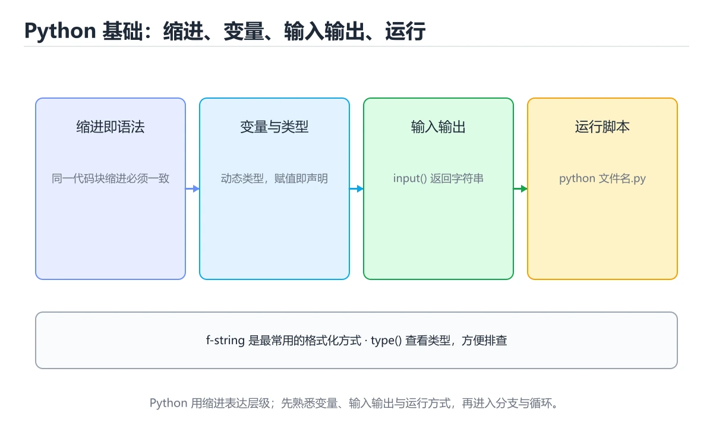
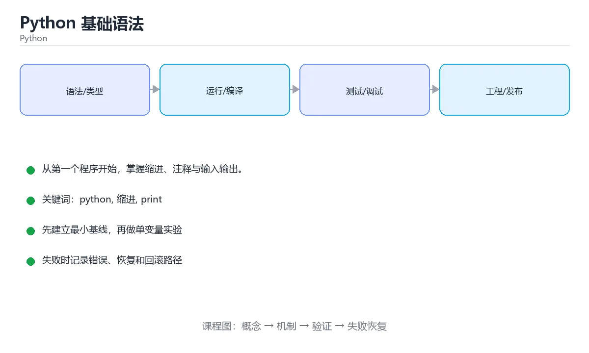

# Python 基础语法





> 内容更新时间：2026-10-06 · 学习阶段：基础 · 预计用时：40 分钟

## 学习目标

- 能用自己的话解释Python 基础语法解决了什么问题，而不是只背术语。
- 能说清 「python」、「缩进」、「print」、「input」 之间的关系，并分别举出一个例子。
- 能把 python 放回「Python 基础语法」的知识体系，说明它和 缩进 的边界。
- 能完成本课练习，并用验收标准检查自己的结果。

> 一句话摘要：从第一个程序开始，掌握缩进、注释与输入输出。

## 前置知识

- 能独立打开与保存文件即可；缩进 会在正文中从零解释。
- 本课阶段：基础。建议先掌握同一分类的基础课程，并能独立运行正文里的 year_text 示例。
- 开始前先复习：python、缩进、print。
- 如果 为什么先学 Python 这一步看不懂，先记录具体卡点，再用 year_text 复现一遍。

## 为什么先学 Python

Python 语法接近自然语言，缩进即结构，能让你把注意力放在「解决问题」而不是「讨好编译器」上。它被广泛用于数据分析、人工智能、后端服务和自动化脚本。

## 第一段程序

```python
# 第一个 Python 程序
print("Hello, World!")

name = input("请输入你的名字：")
print(f"你好，{name}！")
```

要点：

- `print()` 负责向屏幕输出内容。
- `input()` 读取用户输入，**返回的永远是字符串**。
- `#` 开头的行是注释，不会被执行。

## 缩进就是语法

Python 用缩进表示代码块，同一代码块必须使用相同数量的空格。官方推荐 **4 个空格**，不要混用 Tab 和空格。

```python
score = 85

if score >= 60:
    print("及格")   # 缩进的这行属于 if 分支
else:
    print("不及格")

print("程序结束")   # 没有缩进，无论条件是否成立都会执行
```

## 基本输入输出

```python
# input 返回字符串，需要数字时要显式转换
age_text = input("请输入年龄：")
age = int(age_text)

print("明年你", age + 1, "岁")
print(f"类型是 {type(age).__name__}")
```

常见错误：直接对 `input()` 的结果做加法会得到字符串拼接，`"18" + 1` 会抛出 `TypeError`。

## 代码风格建议

1. 变量名用小写字母加下划线，例如 `user_name`。
2. 每行尽量不超过 79~100 个字符，方便阅读。
3. 用空行分隔逻辑段落。
4. 给复杂的判断写注释，解释「为什么」而不是「做了什么」。

## 常见错误与排查

| 现象 | 原因 | 修正 |
| --- | --- | --- |
| `IndentationError` | 混用 Tab 与空格、缩进不一致 | 统一 4 个空格，编辑器显示空白符 |
| `"18" + 1` 报 TypeError | input 返回字符串 | 先用 `int()` 转换 |
| 函数默认值在多次调用间"记住了"旧数据 | 可变对象作默认参数 | 用 `None` 占位并在函数内创建 |
| 判断相等结果不符预期 | 用了 `is` 比较值 | 值比较用 `==`，`is` 只判断同一对象 |
| 循环里删元素漏项 | 遍历时修改列表 | 遍历副本 `for x in nums[:]` |
| 容易写错的做法 | 实际现象 | 原因与正确做法 |
| Tab 与空格混用缩进 | `TabError: inconsistent use of tabs and spaces` | 统一用 4 个空格，编辑器设置「Tab 转空格」 |
| 忘了冒号 | `SyntaxError: expected ':'` | `if`、`for`、`while`、`def`、`class` 行末都要冒号 |
| 用中文标点 | `SyntaxError: invalid character '：'` | 代码里的括号、引号、冒号必须用英文半角 |
| `input()` 直接参与算术 | `TypeError: can only concatenate str` | `input()` 返回字符串，先 `int()` / `float()` |
| `print "hello"` | `SyntaxError` | Python 3 中 `print` 是函数，必须加括号 |
| 变量未定义就使用 | `NameError: name 'x' is not defined` | 先赋值再使用，注意拼写一致 |
| 使用保留字作变量名 | `SyntaxError` | 避开 `class`、`def`、`lambda`、`None` 等关键字 |
| 用 `=` 做比较 | `SyntaxError` | 比较相等用 `==` |
| 字符串里出现未转义的引号 | `SyntaxError: unterminated string literal` | 用另一种引号包裹，或写 `\'` |
| 代码块下没有内容 | `IndentationError: expected an indented block` | 至少写 `pass` 或实际语句 |

## 本课小结

Python 的三大基础是：**缩进、变量、输入输出**。掌握它们之后，就可以开始写带分支和循环的小程序了。

## 语法速查

| 语法 | 写法 | 说明 |
| --- | --- | --- |
| 缩进 | 4 个空格 | 同一代码块必须一致，禁止 Tab 与空格混用 |
| 单行注释 | `# 说明` | 解释「为什么」，而不是复述代码 |
| 多行注释 | `"""说明"""` | 实际是字符串，放在函数首行即文档字符串 |
| 变量赋值 | `x = 10` | 等号两边加空格更易读 |
| 多重赋值 | `a, b = 1, 2` | 一行初始化多个变量 |
| 交换变量 | `a, b = b, a` | 不需要临时变量 |
| 输入 | `input("提示：")` | 返回值永远是 `str` |
| 输出 | `print(a, b, sep="-")` | `sep` 控制分隔符，`end` 控制结尾 |

字符串格式化速查：

| 方式 | 写法 | 建议 |
| --- | --- | --- |
| f-string | `f"{name} 今年 {age} 岁"` | **首选**，直观且性能好 |
| 格式控制 | `f"{pi:.2f}"`、`f"{n:04d}"` | 保留小数、补零 |
| `str.format` | `"{} {}".format(a, b)` | 老代码常见，可读性略差 |
| `%` 格式化 | `"%s %d" % (a, b)` | 已过时，仅用于阅读旧代码 |

```python
name = input("姓名：").strip()
age = 18
print(f"{name} 今年 {age} 岁")
print(f"圆周率约等于 {3.14159:.2f}")     # 3.14
print(f"编号 {7:04d}")                   # 编号 0007
print("a", "b", sep="-", end="!\n")      # a-b!
```

## 入门第一周练习清单

- [ ] 写一个「输入姓名与年龄，输出问候语」的小程序。
- [ ] 用 f-string 输出保留两位小数的金额。
- [ ] 能解释 `input()` 为什么必须做类型转换。
- [ ] 遇到报错先看最后一行，再定位行号与类型。
- [ ] 代码里不出现 Tab 与中文标点。

## 零基础详解：把 Python 当成「写给电脑的菜谱」

### 一句话说清它是什么

Python 是一门**把想法直接写成代码**的语言：它用缩进划分层次、不需要分号结尾、
不需要先声明类型。你写的一行代码，几乎就是你想让电脑做的那件事。

### 用生活比喻理解四个词

| 代码里的词 | 生活里的对应物 | 一句话解释 |
| --- | --- | --- |
| 变量 | 贴了标签的盒子 | 起个名字，把数据放进去，之后用名字取 |
| 语句 | 菜谱里的一步 | 电脑会按顺序一步一步做 |
| 缩进 | 步骤属于哪道菜 | 缩进相同的行属于同一个代码块 |
| 注释 | 给未来的自己留的便签 | 电脑完全不理它，只给人看 |

### 逐行拆解第一段程序

```python
# 第一个 Python 程序
print("Hello, World!")

name = input("请输入你的名字：")
print(f"你好，{name}！")
```

| 行 | 代码 | 在做什么 | 为什么这么写 |
| --- | --- | --- | --- |
| 1 | `# 第一个 Python 程序` | 写给人看的说明 | `#` 之后的内容电脑直接跳过 |
| 2 | `print("Hello, World!")` | 把括号里的内容显示到屏幕 | 文字要用引号包起来，表示「这是一段文本」 |
| 3 | 空行 | 让代码分段 | Python 允许空行，可读性更好 |
| 4 | `name = input("请输入你的名字：")` | 先弹出提示，等用户敲字并回车 | `input()` 的返回值是用户输入的内容 |
| 5 | `print(f"你好，{name}！")` | 把变量嵌进字符串后输出 | f-string 里的 `{}` 会被替换成变量的值 |

### 三件必须刻进肌肉记忆的事

1. **缩进是语法，不是排版。** 少一个空格、多一个 Tab，程序可能直接报错或逻辑完全不同。
2. **`input()` 拿回来的永远是字符串。** 想要数字必须自己 `int()` 或 `float()` 转换。
3. **报错不可怕，先看最后一行。** 最后一行写着错误类型和原因，上面几行写着出错位置。

### 把程序跑起来的三个动作

```text
1. 写代码        → 在编辑器里输入代码
2. 存成文件      → 文件名用英文与下划线，保存为 hello.py
3. 运行          → 终端里执行 python hello.py
```

> 文件名千万不要叫 `random.py`、`string.py` 这类标准库同名文件，
> 否则 Python 会优先导入你的文件，出现莫名其妙的报错。

### 新手最容易混淆的八组概念

| 容易混的两件事 | 一句话区别 |
| --- | --- |
| `print` 和 `return` | `print` 只是显示给人看；`return` 是把结果交给调用者使用 |
| `=` 和 `==` | `=` 是赋值（放进去）；`==` 是比较（问是否相等） |
| 变量名和字符串 | `name` 是变量；`"name"` 是一段文本，两回事 |
| 单引号与双引号 | 在 Python 里作用完全相同，选一种保持统一即可 |
| 注释与字符串 | `# 说明` 是注释；`"说明"` 是真实的字符串数据 |
| 语句与表达式 | `x = 1` 是语句（做动作）；`x + 1` 是表达式（产出值） |
| 函数与函数调用 | `input` 是函数本身；`input()` 才是调用它并拿到结果 |
| 报错与警告 | 报错会中断程序；警告只是提醒，程序还能继续跑 |

### 常见报错的人话翻译

| 屏幕上的英文 | 人话 | 怎么改 |
| --- | --- | --- |
| `SyntaxError: invalid syntax` | 这行的写法不合语法 | 检查括号、引号、冒号是否配对，是否用了中文标点 |
| `IndentationError` | 缩进乱了 | 统一用 4 个空格，别混 Tab |
| `NameError: name 'x' is not defined` | 这个名字还没被赋值 | 先赋值再使用，并检查拼写 |
| `TypeError: can only concatenate str` | 字符串和数字硬拼在一起了 | 先 `int()` 转换，或用 f-string 拼接 |
| `ValueError: invalid literal for int()` | 想转数字，但内容不是数字 | 判断输入是否合法，或用 `try/except` 兜底 |
| `ModuleNotFoundError` | 找不到这个模块 | 检查名字拼写、是否装了库、文件是否同名冲突 |

### 手把手练习：问候小程序

要求：问用户姓名与出生年份，输出「你好，XX，你大约 XX 岁」。

```python
name = input("请输入你的名字：").strip()
year_text = input("请输入你的出生年份（如 2005）：").strip()

if not year_text.isdigit():
    print("年份只能是数字哦")
else:
    age = 2026 - int(year_text)
    print(f"你好，{name}，你大约 {age} 岁")
```

逐点说明：

- `.strip()` 去掉用户不小心输入的首尾空格。
- `.isdigit()` 先判断「是不是纯数字」，避免程序直接崩掉。
- `2026 - int(year_text)` 先转换再运算，顺序不能反。
- f-string 里的 `{}` 可以直接写变量名，比用 `+` 拼接更清楚。

### 学完自测

- [ ] 能说出为什么 Python 用缩进而不是大括号。
- [ ] 能解释 `input()` 为什么要做类型转换。
- [ ] 看到报错时，知道先看最后一行、再定位行号。
- [ ] 能独立写出「输入两个数字，输出它们的和」。
- [ ] 知道变量名不能以数字开头、不能与关键字重名。

## 动手练习

### 练习 1：概念复述（10 分钟）

合上教程，用 3～5 句话解释Python 基础语法解决什么问题，并写出一个边界条件。

**验收标准**：至少使用一个本课关键词，并给出一个反例。

### 练习 2：示例改写（20 分钟）

从正文选一个 python 的最小示例，先预测修改后的结果，再验证并记录差异。

**验收标准**：先在「为什么先学 Python」里找一个可运行的最小输入，再按五步法记录python的影响；预测与结果不一致时补写被忽略的前提。

### 练习 3：迁移任务（30 分钟）

用 year_text 解析一份自己的数据，输出统计结果并核对一条记录。

- 至少覆盖「python」和「缩进」两个关键词。
- 产出一个别人可以检查的结果。
- 写出一个仍不确定的问题和验证方法。

## 可运行练习

### 任务 1：先跑通，再解释

```python
score = 85

if score >= 60:
    print("及格")   # 缩进的这行属于 if 分支
else:
    print("不及格")

print("程序结束")   # 没有缩进，无论条件是否成立都会执行
```

**预期输出**：程序结束

### 任务 2：只改一个条件

把「Python 基础语法」的最小示例复制一份，只改一个条件再跑一次：

- 改动点：只把 python 的输入换成空值、极值或错误输入，其余保持不变。
- 预测：先写下「Python 基础语法」在改动后的输出或错误信息，再运行。
- 记录：对照改动前后的结果，指出差异出在哪一步。
- 验收：换回原条件能复现原结果，改动只影响python。

### 任务 3：迁移到自己的数据

用同一套思路处理一组你自己的 python 数据，保持输出格式与任务 1 一致。

## 故障现场

### 现场 1：IndentationError

**症状**：在《Python 基础语法》的复现场景中，混用 Tab 与空格、缩进不一致。

**根因**：触发点是把“IndentationError”当成安全做法。它没有满足《Python 基础语法》要求的前提，因此先表现为“混用 Tab 与空格、缩进不一致”；排查时先完整复现这一段，再核对输入、配置与依赖。

**修复**：针对《Python 基础语法》的问题，统一 4 个空格，编辑器显示空白符。

**验证**：先在《Python 基础语法》中记录“IndentationError”留下的失败证据，再执行“统一 4 个空格，编辑器显示空白符”并重放；确认错误路径变为明确结果，且修复没有掩盖同类故障。

### 现场 2："18" + 1 报 TypeError

**症状**：在《Python 基础语法》的复现场景中，input 返回字符串。

**根因**：“input 返回字符串”只是表层结果。向上追溯会落到“"18" + 1 报 TypeError”这一步，因为它省略了《Python 基础语法》的约束，使实现行为和预期模型发生了偏离。

**修复**：针对《Python 基础语法》的问题，先用 int() 转换。

**验证**：先在《Python 基础语法》中记录“"18" + 1 报 TypeError”留下的失败证据，再执行“先用 int() 转换”并重放；确认错误路径变为明确结果，且修复没有掩盖同类故障。

### 现场 3：函数默认值在多次调用间"记住了"旧数据

**症状**：在《Python 基础语法》的复现场景中，可变对象作默认参数。

**根因**：触发点是把“函数默认值在多次调用间"记住了"旧数据”当成安全做法。它没有满足《Python 基础语法》要求的前提，因此先表现为“可变对象作默认参数”；排查时先完整复现这一段，再核对输入、配置与依赖。

**修复**：针对《Python 基础语法》的问题，用 None 占位并在函数内创建。

**验证**：保留《Python 基础语法》里触发“可变对象作默认参数”的输入、版本和日志，按“用 None 占位并在函数内创建”完成修改后原样重放；只有失败现象消失且相邻场景仍可解释，才保留改动。

## 版本与时效

### 升级检查清单

- 先固定当前版本，跑通全部示例与测验，再升级工具链。
- 一次只改一个版本条件，把 python 相关的差异单独记成一条结论。
- 先回归 python 与 缩进 的默认行为和错误信息，再扩大测试范围。
- 升级完成后记录 python 的新旧版本差异，并据此调整下次复核时间。

## 本课复习清单

离开本课前，逐项确认：

- [ ] 不看解析，能说出「Python 中 input() 函数的返回值是什么类型？」的判断依据。
- [ ] 不看解析，能说出「以下哪组类型全部是不可变类型？」的判断依据。
- [ ] 不看解析，能说出「下面哪个是 Python 的单行注释写法？」的判断依据。
- [ ] 不看解析，能说出「同一次缩进中混用 Tab 和空格，Python 会报什么错？」的判断依据。
- [ ] 不看解析，能说出「下列哪些是 Python 的内置不可变类型？请选择所有正确答案。」的判断依据。
- [ ] 用 python 构造一个正常输入和一个边界输入，分别记录输出与判断依据。
- [ ] 把本课最容易混淆的两个概念写成一句话对照。

| 复盘项 | 记录 |
| --- | --- |
| 已经能独立解释的考点 |  |
| 仍然说不清的概念 |  |
| 下一步验证动作 |  |

## 术语速查

| 术语 | 一句话说明 |
| --- | --- |
| `TypeError` | 常见错误：直接对 `input()` 的结果做加法会得到字符串拼接，`"18" + 1` 会抛出 `TypeError`。 |
| `user_name` | 变量名用小写字母加下划线，例如 `user_name`。 |
| `缩进` | Python 用缩进表示代码块，同一代码块必须使用相同数量的空格。官方推荐 4 个空格，不要混用 Tab 和空格。 |
| `动态类型` | 变量的类型由运行时的值决定，类型错误只有在执行到那一行时才会暴露。 |
| `Python` | 一种解释型通用编程语言，用缩进划分代码块，标准库覆盖面广 |

## 考点精讲

### 考点 1：代码补全·python

- **题目**：这段 Python 代码是「Python 基础语法」的示例片段，下面哪一项描述与它一致？
- **判断依据**：在「Python 基础语法」里，题干的正确项是这段代码会读取外部输入，结果依赖传入的数据。把输入或边界换成空值、极值或失败情况后，结论要以「Python 基础语法」的实际运行结果为准。把“这段代码会读取外部输入”代回「Python 基础语法」里“这段 Python 代码是Python 基础语法的示例片段”的例子核对，条件一旦改变，结论就要用python、缩进、print重新推导。

### 考点 2：顺序排列·python

- **题目**：按“Python 基础语法”中 python、缩进、print 的实践顺序，把四个步骤排成从准备到复盘的合理顺序。
- **判断依据**：题干的正确项是固定版本与证据，把“Python 基础语法”的结论写成可复现记录。在「Python 基础语法」里，在本课的练习里，顺序应当是：先明确 python 的输入、输出与约束 → 写出最小示例并核对 缩进 的基线结果 → 只改一个变量，记录边界与失败路径的变化 → 固定版本与证据，把本课的结论写成可复现记录。这个顺序把 python 的输入、输出和约束放在最前面，在Python 基础语法里避免概念没对齐就开始调参。第二步用 缩进 建立可核对的基线，在Python 基础语法里第三步才允许改变一个变量并观察失败路径。

### 考点 3：概念判断·python

- **题目**：下面哪个是 Python 的单行注释写法？
- **判断依据**：Python 使用 # 作为单行注释。如果只凭关键词作答，很容易把「/$1/」、「// 注释」与「# 注释」混在一起；回到「Python 基础语法」的正文示例，用“下面哪个是 Python 的单行注释”走一遍python、缩进、print的完整流程，能复现的结论才可以保留。

### 考点 4：概念判断·python

- **题目**：同一次缩进中混用 Tab 和空格，Python 会报什么错？
- **判断依据**：在「Python 基础语法」里，缩进不一致会抛 IndentationError，规范要求统一使用 4 个空格。在「Python 基础语法」里，其他选项：抛出 SyntaxError 只是笼统说法，缩进不一致会报更具体的 IndentationError；TypeError 指类型不匹配。在「Python 基础语法」里，这道题要求区分概念与边界，「IndentationError」只有在题干给出的前提下才成立，而「抛出 SyntaxError」、「TypeError」缺少同一组条件。

### 考点 5：多选辨析·python

- **题目**：下列哪些是 Python 的内置不可变类型？请选择所有正确答案。
- **判断依据**：在「Python 基础语法」里，int；tuple。不可变表示对象创建后不能原地改变自身内容，因此可以作为字典键或集合元素。这道题的关键在「Python 基础语法」的python、缩进、print：先确认题干“下列哪些是 Python 的内置不可”问的是哪一步，再排除偷换前提的选项。

### 考点 6：多选辨析·python

- **题目**：关于「Python 基础语法」，下列哪些说法是正确的？（多选）
- **判断依据**：从第一个程序开始，掌握缩进、注释与输入输出。在「Python 基础语法」里，字符串 str」是否完整覆盖题干的输入、输出和失败路径，并排除「根据输入自动推断」、「int、str、tuple」这类相邻概念。「Python 基础语法」要求先交代python、缩进、print的前提再下结论，所以“int、str、tuple”只在题干“Python 基础语法”给定的条件下成立。

## 复习与自测

- [ ] 能用自己的话复述「为什么先学 Python」，并各举一个正例和反例。
- [ ] 能解释「第一段程序」里最容易混淆的两个概念。
- [ ] 能不看正文写出「缩进就是语法」的关键步骤。
- [ ] 能用一句话说明「基本输入输出」解决什么问题。
- [ ] 能把「代码风格建议」的判断标准套到一个新例子上。
- [ ] 能说清「语法速查」的结论，并说出它的适用边界。

## English Overview

**Title:** Python Syntax

**Summary:** Start from the first program and master indentation, comments, I/O.

**Category:** Python
**Level:** 基础
**Key terms:** python, 缩进, print, input, 注释

## 内容元数据

- 内容版本：v2.0
- 最后更新：2026-10-06
- 学习阶段：基础
- 适用环境：Python 3.12+；本课聚焦 python。
- 内容来源：内置结构化课程与工程实践整理
- 相关主题：python、缩进、print、input、注释
- 质量版本：P0 测验标准 + P1 覆盖扩展 + P2 体验补全

## Full English Study Guide

### Overview

**Python Syntax** focuses on Start from the first program and master indentation, comments, I/O.

### Learning Outcomes

- Explain what **Python Syntax** solves and when it should be used.

### Glossary

- Topic: **Python Syntax**
- Related terms: python, 缩进, print, input

## Bilingual Section Outline

| 中文小节 | English section |
| --- | --- |
| 学习目标 | Learning objectives |
| 前置知识 | Prerequisites |
| 为什么先学 Python | 为什么先学 Python |
| 第一段程序 | 第一段程序 |
| 缩进就是语法 | 缩进就是语法 |
| 基本输入输出 | 基本输入输出 |
| 代码风格建议 | 代码风格建议 |
| 常见错误速查 | Common mistakes速查 |
| 本课小结 | Summary |
| 语法速查 | 语法速查 |

## 参考资料与复核

- 最后复核：2026-10-04
- 下次复核：2026-11-10
- 复核范围：版本兼容、API 行为、安全建议与工程实践
- 来源性质：官方文档、标准或权威教材；正文为离线教学重组

| 参考资料 | 本课用途 |
| --- | --- |
| [Python 教程](https://docs.python.org/3/tutorial/) | 语法、数据类型与控制流 |
| [Python 标准库](https://docs.python.org/3/library/) | 标准库 API 与模块 |
| [asyncio 文档](https://docs.python.org/3/library/asyncio.html) | 异步 I/O 与并发任务 |

> 「Python 基础语法」的链接用于离线阅读后的延伸核对；App 不会自动联网。

## 工程化精练：决策、失败与验证

这一章把「Python 基础语法」从“看懂”推进到“能判断、能验证、能排错”。所有判断都围绕python、缩进与print展开，并与前文的示例、测验和失败现场互相对照。

### 一、python 的判断算法

| 步骤 | 要回答的问题 | 判断依据 | 记录什么 |
| --- | --- | --- | --- |
| 1. 定目标 | 「Python 基础语法」这一步要解决什么问题？ | 把python的目标写成一句可验证的结论 | 输入、约束、成功标准 |
| 2. 找边界 | 缩进在什么条件下失效？ | 先列空值、极值、重复和失败路径 | 反例与触发条件 |
| 3. 跑基线 | 原始示例的真实输出是什么？ | 命令、版本和环境必须可复现 | 命令、输出、耗时 |
| 4. 只改一处 | 把print换成另一种取值会怎样？ | 预测写在运行之前 | 预测与实际的差异 |
| 5. 回写结论 | 结论能否被他人复现？ | 把判断写成清单或测试 | 结论、证据、遗留问题 |

这张表的用法不是从上到下浏览，而是每次只填一行：先用「Python 基础语法」前文的示例验证第 3 行，再故意破坏一个条件验证第 2 行。当你能在不看解析的情况下说出python的判断依据，才算真正掌握本课。

- 先从python入手：把它写成“输入是什么、输出是什么、哪一步最容易出错”。如果这三句话中有一句说不清，说明对「Python 基础语法」的理解还停留在术语层面，需要回到正文的最小示例重新观察一次。

- 再把缩进当成对照实验的变量：固定其他条件，只改变它的取值，记录输出是否变化。结论“变”或“不变”都要写出理由，并说明这个理由能否被他人独立复现。

- 针对print做一次失败演练：故意给出空值、极值或错误类型，观察「Python 基础语法」的报错位置和处理方式。错误信息只是入口，真正要定位的是哪一层假设被破坏。

- 把「Python 基础语法」的结论压缩成一条可执行清单：先检查输入，再检查版本与环境，然后跑最小用例，最后才扩大规模。顺序颠倒会让排错范围成倍增加。

- 如果结论依赖时间或规模，就把数据量提高一个数量级再跑一次。在「Python 基础语法」里，小样本成立不代表大样本成立，复杂度、资源占用和失败率都要重新记录。

- 如果结论依赖并发或共享状态，就固定输入并连续运行多次。结果不一致时，优先怀疑「Python 基础语法」中python相关步骤的隐藏状态，而不是先改代码。

- 把「Python 基础语法」的判断写成测试：一个正常用例、一个边界用例、一个失败用例。测试通过只是起点，还要确认失败用例确实以预期方式失败。

- 把本课与相邻主题连起来：python解决的是“怎么做”，缩进回答“什么时候不适用”。两者都答得出来，迁移才算完成。

> 第 2 轮复核「Python 基础语法」：把上面的结论逐条改写为可验证的问题，并记录仍不确定的部分。

- 先从python入手：把它写成“输入是什么、输出是什么、哪一步最容易出错”。如果这三句话中有一句说不清，说明对「Python 基础语法」的理解还停留在术语层面，需要回到正文的最小示例重新观察一次。

- 再把缩进当成对照实验的变量：固定其他条件，只改变它的取值，记录输出是否变化。结论“变”或“不变”都要写出理由，并说明这个理由能否被他人独立复现。

- 针对print做一次失败演练：故意给出空值、极值或错误类型，观察「Python 基础语法」的报错位置和处理方式。错误信息只是入口，真正要定位的是哪一层假设被破坏。

- 把「Python 基础语法」的结论压缩成一条可执行清单：先检查输入，再检查版本与环境，然后跑最小用例，最后才扩大规模。顺序颠倒会让排错范围成倍增加。

### 二、Python 基础语法 的机制拆解与自测

把本课考点还原成可回答的问题，再逐题写出依据：

**问题 1**：这段 Python 代码是「Python 基础语法」的示例片段，下面哪一项描述与它一致？

- 关联术语：python
- 判断依据：回到「Python 基础语法」正文对应小节，先用最小示例验证再下结论。
- 追问：如果把python的条件换成边界值，这个结论是否仍然成立？

**问题 2**：按“Python 基础语法”中 python、缩进、print 的实践顺序，把四个步骤排成从准备到复盘的合理顺序。

- 关联术语：缩进
- 判断依据：固定版本与证据，把“Python 基础语法”的结论写成可复现记录
- 追问：如果把缩进的条件换成边界值，这个结论是否仍然成立？

**问题 3**：下面哪个是 Python 的单行注释写法？

- 关联术语：print
- 判断依据：回到「Python 基础语法」正文对应小节，先用最小示例验证再下结论。
- 追问：如果把print的条件换成边界值，这个结论是否仍然成立？

**问题 4**：同一次缩进中混用 Tab 和空格，Python 会报什么错？

- 关联术语：input
- 判断依据：IndentationError
- 追问：如果把input的条件换成边界值，这个结论是否仍然成立？

**问题 5**：下列哪些是 Python 的内置不可变类型？请选择所有正确答案。

- 关联术语：注释
- 判断依据：回到「Python 基础语法」正文对应小节，先用最小示例验证再下结论。
- 追问：如果把注释的条件换成边界值，这个结论是否仍然成立？

**问题 6**：关于「Python 基础语法」，下列哪些说法是正确的？（多选）

- 关联术语：python
- 判断依据：int、str、tuple
- 追问：如果把python的条件换成边界值，这个结论是否仍然成立？

### 三、失败模式与修复顺序

| 失败信号 | 常见根因 | 先做什么 | 修复后如何确认 |
| --- | --- | --- | --- |
| 「Python 基础语法」中 python 相关步骤报错 | 输入、版本或前置条件与示例不一致 | 保留第一条错误信息，回到最小输入 | 用固定版本与证据，把“Python 基础语法”的结论写成可复现记录复跑，确认输出可复现 |
| 「Python 基础语法」中 缩进 相关步骤报错 | 输入、版本或前置条件与示例不一致 | 保留第一条错误信息，回到最小输入 | 用IndentationError复跑，确认输出可复现 |
| 「Python 基础语法」中 print 相关步骤报错 | 输入、版本或前置条件与示例不一致 | 保留第一条错误信息，回到最小输入 | 用int、str、tuple复跑，确认输出可复现 |
- 检查点：固定版本与输入重跑《Python 基础语法》，记录两次差异并定位不稳定条件。
| 单次结果正确但规模一大就失效 | 只测了正常路径，没有覆盖边界 | 把数据量或并发度提高一个数量级 | 记录边界值、耗时与失败率 |

排错顺序固定为：先复现，再缩小输入，然后只改一个条件，最后把结论写成回归用例。对「Python 基础语法」来说，任何不能复现的“修好了”都不算完成。

### 四、离开本课前的验证清单

| 检查项 | 通过标准 | 证据 |
| --- | --- | --- |
| 能复述 | 用三句话说明「Python 基础语法」解决什么问题、边界在哪 | 不看解析写出的结论 |
| 能运行 | 最小示例在本机跑通 | 命令、输出与版本 |
| 能改条件 | 只改一个输入并解释差异 | 预测与实际的对照 |
| 能排错 | 至少制造并修复一个失败 | 错误信息与修复步骤 |
| 能迁移 | 把python、缩进、print、input、注释用到新场景 | 一个自选练习的结论 |

完成标准：能不看解析说清「Python 基础语法」全部自测题的依据，并且至少有一条python相关的结论经过真实运行验证。如果某一步只停留在“感觉懂了”，就把它写成下一轮针对「Python 基础语法」的最小验证任务。

### 五、把结论写成可检查的证据

学习「Python 基础语法」时，最容易出现的情况是“听过、看懂了，但换一个输入就说不清”。下面把python与缩进放进一条可检查的证据链：每一句结论都要能回答“从哪里来、在什么条件下成立、失败时怎么发现”。

| 证据类型 | 本课要求 | 不合格的表现 |
| --- | --- | --- |
| 概念证据 | 用一句话说明python的定义与适用场景 | 只背术语，说不出它解决什么问题 |
| 运行证据 | 能复现「Python 基础语法」的最小示例 | 输出与记录对不上，或换机器就不一致 |
| 对照证据 | 只改一个条件，说明差异来自哪里 | 一次改多个变量，无法归因 |
| 失败证据 | 故意制造错误并记录恢复步骤 | 只测正常路径，失败时靠猜 |
| 迁移证据 | 把缩进用到自选场景 | 换一个例子就完全套不上 |

举例：固定版本与证据，把“Python 基础语法”的结论写成可复现记录。把这个结论代回「Python 基础语法」的正文，找出它对应的输入、处理步骤与输出；再换掉其中一个条件，观察结论是否仍然成立。能完成这一步，才说明这条知识已经从“记忆”变成“可用的判断”。

最后留一个自检问题：如果只能保留三条笔记，你会写下哪三句？把答案限定为「Python 基础语法」中的可验证结论，并给每条结论配一个反例。这三句加上对应反例，就是本课最值得带入后续课程的复习材料。

