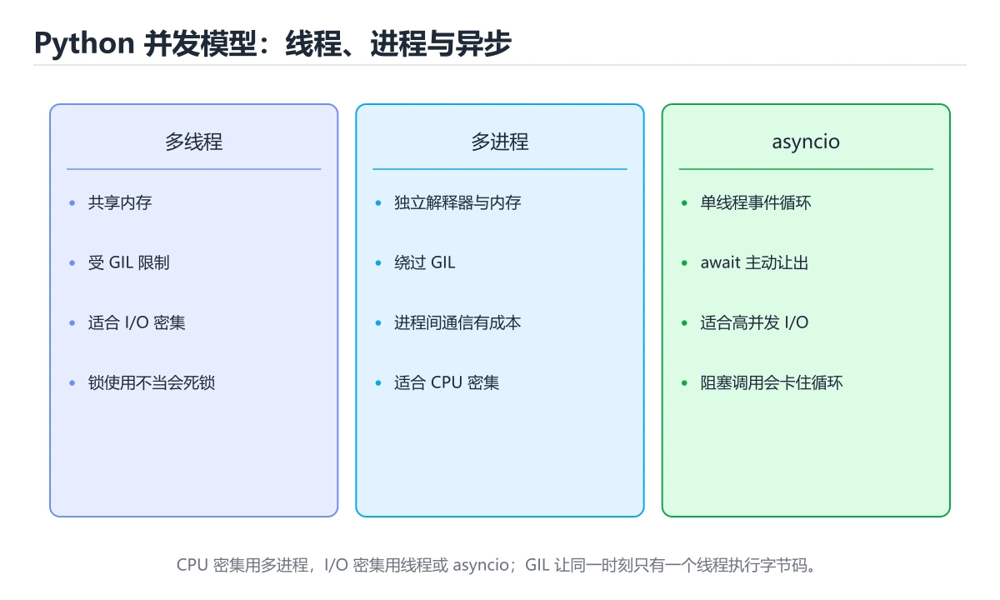
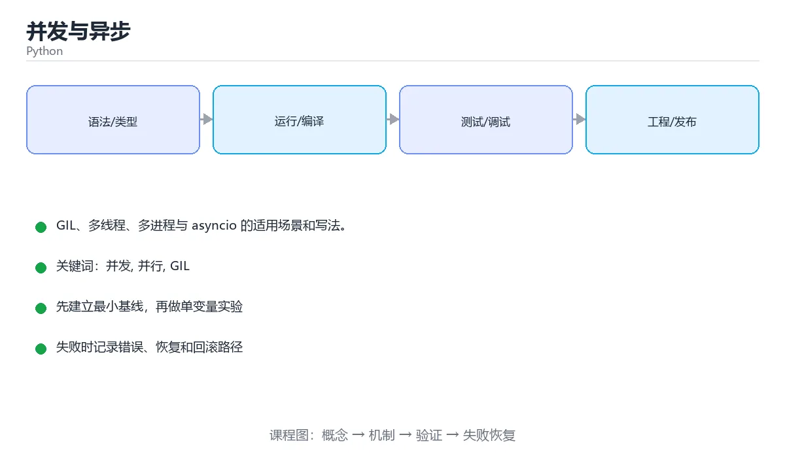

# 并发与异步





> 内容更新时间：2026-10-03 · 学习阶段：高级 · 预计用时：16 分钟

## 学习目标

- 能用自己的话解释「并发与异步」解决了什么问题，而不是只背术语。
- 能说清 「并发」、「并行」、「GIL」、「threading」 之间的关系，并分别举出一个例子。
- 能把本课知识放回「Python」的知识体系，说明它和相邻主题的边界。
- 能完成本课练习，并用验收标准检查自己的结果。

> 一句话摘要：GIL、多线程、多进程与 asyncio 的适用场景和写法。

## 前置知识

- 先完成上一课《类型注解与测试》；如果已经掌握，可以直接用本课练习自测。
- 本课阶段：高级。建议具备同一方向的完整基础，能阅读较长的代码、配置或系统设计说明。
- 开始前先复习：并发、并行、GIL。
- 如果某一步看不懂，先记录具体卡点，完成练习后再回头读一遍。


## GIL：Python 并发的关键前提

CPython 有全局解释器锁（GIL），同一时刻只有一个线程执行字节码。因此：

- **CPU 密集型**任务用多线程无法提速，应该用多进程。
- **IO 密集型**任务在等待时会释放 GIL，多线程和异步都能显著提速。

## 多线程 threading

```python
import threading
import time

def download(name):
    time.sleep(1)              # 模拟网络等待
    print(f"{name} 下载完成")

threads = [threading.Thread(target=download, args=(f"文件{i}",)) for i in range(3)]
for t in threads:
    t.start()
for t in threads:
    t.join()                   # 等待全部结束
```

共享数据要加锁：

```python
lock = threading.Lock()
count = 0

def increase():
    global count
    for _ in range(100000):
        with lock:
            count += 1
```

## 多进程 multiprocessing

```python
from concurrent.futures import ProcessPoolExecutor

def cpu_heavy(n):
    return sum(i * i for i in range(n))

if __name__ == "__main__":
    with ProcessPoolExecutor() as pool:
        results = list(pool.map(cpu_heavy, [10**6, 10**6, 10**6]))
    print(results)
```

线程池同理，把 `ProcessPoolExecutor` 换成 `ThreadPoolExecutor` 即可，适合 IO 密集场景。

## 异步 asyncio

异步是单线程内的事件循环协作：遇到 `await` 就让出控制权，适合高并发网络请求。

```python
import asyncio

async def fetch(name):
    await asyncio.sleep(1)         # 模拟网络请求
    return f"{name} 完成"

async def main():
    results = await asyncio.gather(
        fetch("A"), fetch("B"), fetch("C")
    )
    print(results)                 # 三个任务并发，总耗时约 1 秒

asyncio.run(main())
```

注意：**异步函数里不能写阻塞调用**（如 `time.sleep`、同步 requests），否则整个事件循环被卡住，应改用 `asyncio.sleep`、`aiohttp` 等异步库。

## 怎么选

| 场景 | 推荐方案 |
| --- | --- |
| 大量网络 / 文件 IO | `asyncio` 或线程池 |
| 少量并发、代码简单 | `threading` |
| CPU 密集计算 | `multiprocessing` |
| 需要进程间通信 | `multiprocessing.Queue` / `Pipe` |

## 本课小结
记住一句话：**IO 用异步或线程，计算用多进程**；异步代码最怕混入阻塞调用。


## 并发方案选型速查

| 场景 | 推荐方案 | 理由 | 关键 API |
| --- | --- | --- | --- |
| 大量网络 / 文件 IO | `asyncio` | 单线程事件循环，开销最小 | `async def`、`await`、`asyncio.gather` |
| 少量并发、用同步库 | `ThreadPoolExecutor` | 等待 IO 时会释放 GIL | `executor.map`、`submit` |
| CPU 密集计算 | `ProcessPoolExecutor` | 绕开 GIL，真正并行 | `ProcessPoolExecutor`、`multiprocessing` |
| 需要共享状态的多线程 | 线程 + 锁 | 保证复合操作原子性 | `threading.Lock`、`RLock` |
| 生产消费模型 | `queue.Queue` | 天然线程安全 | `put`、`get`、`task_done` |
| 定时 / 延迟任务 | `asyncio.sleep` 或调度库 | 不阻塞线程 | 避免 `time.sleep` 出现在协程里 |

GIL 速查：

| 问题 | 结论 |
| --- | --- |
| GIL 是什么 | CPython 解释器级别的互斥锁，保证同一时刻只有一个线程执行字节码 |
| 影响 CPU 密集吗 | 有影响，多线程难以提速，应使用多进程 |
| 影响 IO 密集吗 | 影响很小，等待 IO 时会释放 GIL |
| 多线程还需要锁吗 | 需要，`count += 1` 这类复合操作不是原子的 |
| 未来会移除吗 | 已有可选的无 GIL 构建，但生态兼容仍在推进 |

```python
import asyncio

async def fetch(name, delay):
    await asyncio.sleep(delay)      # 模拟网络等待，注意不是 time.sleep
    return f"{name} 完成"

async def main():
    # 并发执行，总耗时约等于最慢的那个（0.3 秒）
    results = await asyncio.gather(fetch("a", 0.3), fetch("b", 0.1))
    print(results)

asyncio.run(main())
```

## 常见错误对照表

| 容易写错的做法 | 实际现象 | 原因与正确做法 |
| --- | --- | --- |
| 在协程里调用 `time.sleep()` | 整个事件循环被卡住 | 改 `await asyncio.sleep()`；同步阻塞库用 `run_in_executor` |
| 在协程里直接 `requests.get()` | 其他任务全部等待 | 用 `httpx` / `aiohttp` 等异步客户端 |
| 忘了 `await` 协程 | `RuntimeWarning: coroutine was never awaited` | 调用协程函数必须 `await` 或交给 `create_task` |
| 多线程共享计数变量直接 `+=` | 结果偏小 | 加锁或用 `queue` 汇总 |
| 用多线程跑 CPU 密集任务 | 速度没有提升甚至更慢 | 改多进程或原生扩展 |
| `ProcessPoolExecutor` 里传不可序列化对象 | `PicklingError` | 传简单数据或可序列化对象 |
| 无限制创建线程 / 协程 | 内存暴涨、调度开销大 | 用线程池与信号量（`asyncio.Semaphore`）限制并发 |
| 忘记关闭线程池 | 进程无法退出 | `with ThreadPoolExecutor() as ex:` 或显式 `shutdown` |
| 多进程直接改全局变量 | 父进程看不到变化 | 进程内存独立，用返回值或共享内存 / 队列 |
| 用 `asyncio.run` 嵌套调用 | `RuntimeError: asyncio.run() cannot be called from a running event loop` | 顶层只调用一次，内部用 `await` 或 `create_task` |

## 自测清单

- [ ] 能按「IO 密集 / CPU 密集」正确选择 asyncio、多线程、多进程。
- [ ] 知道 GIL 会释放的时机，以及为什么共享计数要加锁。
- [ ] 协程里绝不出现阻塞调用。
- [ ] 用信号量或线程池限制并发规模。
- [ ] 用 `asyncio.gather` 并发等待多个协程，而不是逐个 `await`。


## 零基础详解：GIL、线程、进程与 asyncio

### 一句话说清它是什么

Python 有 GIL（全局解释器锁），所以**多线程不能并行跑 CPU 密集任务**，但非常适合 IO 等待；
想真正并行算东西要用多进程；想处理成千上万条网络连接就用 asyncio。

### 用生活比喻理解

| 方案 | 比喻 | 适合 |
| --- | --- | --- |
| 多线程 | 一个收银台，多个人轮流用 | IO 等待（下载、读写文件） |
| 多进程 | 开几家分店 | CPU 密集（计算、图像处理） |
| asyncio | 一个服务员同时照看多桌 | 高并发网络请求 |
| GIL | 只有一把话筒 | 同一时刻只允许一个线程执行字节码 |

### 决策表：先看任务是 IO 还是 CPU

| 任务类型 | 首选方案 | 例子 |
| --- | --- | --- |
| IO 密集，任务数不多 | `ThreadPoolExecutor` | 下载文件、读写磁盘 |
| IO 密集，任务数极多 | `asyncio` | 上万条 HTTP 请求 |
| CPU 密集 | `ProcessPoolExecutor` | 数值计算、图像处理 |
| 简单并行循环 | `concurrent.futures` | 批量处理 |

### 三种写法的对比

```python
# 1. 多线程：适合 IO
from concurrent.futures import ThreadPoolExecutor

def download(url: str) -> int:
    ...                       # 假设这里是网络请求
    return len(url)

with ThreadPoolExecutor(max_workers=8) as pool:
    sizes = list(pool.map(download, urls))

# 2. 多进程：适合 CPU
from concurrent.futures import ProcessPoolExecutor

def heavy(n: int) -> int:
    return sum(i * i for i in range(n))

with ProcessPoolExecutor() as pool:
    results = list(pool.map(heavy, [10**6, 10**6, 10**6]))

# 3. asyncio：适合高并发 IO
import asyncio
import httpx

async def fetch(client: httpx.AsyncClient, url: str) -> int:
    resp = await client.get(url)
    return resp.status_code

async def main() -> None:
    async with httpx.AsyncClient() as client:
        tasks = [fetch(client, url) for url in urls]
        statuses = await asyncio.gather(*tasks)
    print(statuses)

asyncio.run(main())
```

### 加锁：共享数据才需要

```python
import threading

counter = 0
lock = threading.Lock()

def increase() -> None:
    global counter
    for _ in range(1000):
        with lock:                 # 只有这一小段需要保护
            counter += 1
```

多进程之间不共享内存，所以**进程不需要锁，但需要能序列化的数据**。

### asyncio 的三条纪律

1. **不要在协程里写阻塞调用**（`time.sleep`、`requests`），它会卡住整个事件循环。
2. 用 `asyncio.sleep`、`httpx.AsyncClient`、`aiofiles` 这类异步库。
3. CPU 密集的工作丢给 `run_in_executor` 或进程池。

```python
import asyncio

async def main() -> None:
    await asyncio.sleep(1)                 # 正确：异步睡眠
    # time.sleep(1)                        # 错误：会阻塞整个事件循环
```

### 新手最容易踩的八个坑

| 坑 | 现象 | 正确做法 |
| --- | --- | --- |
| 用多线程跑 CPU 密集 | 比单线程还慢 | 改多进程 |
| 在协程里做阻塞调用 | 并发全部退化成串行 | 用异步库或线程池 |
| 忘了加锁 | 计数结果偏小 | 共享变量加锁或换原子方案 |
| 用进程池传 lambda | 无法序列化，报错 | 用模块级函数 |
| 线程里异常被吞掉 | 任务静默失败 | 收集 `future.exception()` |
| 无限制创建线程 | 内存暴涨 | 用线程池控制并发数 |
| 忘了 `asyncio.run` | 协程没有执行 | 用 `asyncio.run(main())` |
| 在 Jupyter 里用 `asyncio.run` | 事件循环冲突 | 用 `await main()` 或 nest_asyncio |

### 手把手练习：并发抓取并统计

```python
import asyncio
import time

import httpx


async def fetch(client: httpx.AsyncClient, url: str) -> tuple[str, int | str]:
    try:
        resp = await client.get(url, timeout=5)
        return url, resp.status_code
    except httpx.HTTPError as exc:
        return url, f"失败：{exc.__class__.__name__}"


async def main(urls: list[str]) -> None:
    start = time.perf_counter()
    async with httpx.AsyncClient() as client:
        results = await asyncio.gather(*(fetch(client, u) for u in urls))
    for url, status in results:
        print(f"{status}  {url}")
    print(f"耗时 {time.perf_counter() - start:.2f} 秒")


if __name__ == "__main__":
    asyncio.run(main(["https://example.com"] * 5))
```

### 学完自测

- [ ] 能用一句话解释 GIL 的影响。
- [ ] 能判断一个任务是 IO 密集还是 CPU 密集，并选对方案。
- [ ] 知道为什么协程里不能写阻塞调用。
- [ ] 知道多进程与多线程在数据共享上的差别。
- [ ] 能说出线程池 `max_workers` 为什么要设上限。

## 动手练习


> 本课练习重点：围绕「并发、并行、GIL」完成复述、实验和交付，每个结果都要能被别人检查。

先写可运行脚本，再用类型注解与测试保护核心函数，最后处理真实输入。

### 练习 1：建立心智模型（10 分钟）

合上教程，用 3～5 句话回答：

1. 「并发与异步」解决了什么问题？
2. 如果没有它，会出现什么具体后果？
3. 它和「并行」是什么关系？

**验收标准**：至少出现一个本课关键词，并写出一个反例、边界条件或失效场景。

### 练习 2：做一次可控实验（20 分钟）

从正文中选一个最小示例，完成以下操作：

1. 先预测修改一个参数、输入或步骤后的结果。
2. 再实际执行或逐步推演，记录真实结果。
3. 如果结果与预测不同，写出差异原因。

**验收标准**：留下「原例 → 改动 → 预测 → 结果 → 原因」五步记录。

### 练习 3：交付一个小结果（30 分钟）

写一个 20 行以内的小脚本，把本课概念用于处理一份真实文本或列表数据。

任务要求：

- 结果必须能被别人检查，不能只写“我已经理解了”。
- 至少覆盖「并发」和「并行」两个关键词。
- 写出 1 个仍然不确定的问题，以及下一步如何验证。

> 提示：时间有限时优先做练习 1 和练习 2；练习 3 可以拆成两次完成。


## 考点精讲：把测验题还原成判断过程

本课有 6 个判断点。先自己作答，再看「判断依据」；如果结论正确但理由不完整，回到正文对应章节补足概念。

### 考点 1：CPython 中 CPU 密集型任务最适合用？

- **正确判断**：多进程
- **判断依据**：GIL 使多线程无法并行执行字节码，CPU 密集任务应该用多进程绕开 GIL。其他选项：GIL 让多线程在 CPU 密集场景无法并行，asyncio 与线程池同样受限。针对「CPython 中 CPU 密集型任务最适合用，」，本课在「GIL：Python 并发的关键前提」中说明：CPU 密集型任务用多线程无法提速，应该用多进程。本课还在「GIL：Python 并发的关键前提」中说明：IO 密集型任务在等待时会释放 GIL，多线程和异步都能显著提速。
- **迁移检查**：如果给某个错误选项去掉一个限定词，它会不会变成正确？说明理由。

### 考点 2：asyncio 中最危险的做法是？

- **正确判断**：在协程中调用阻塞函数如 time.sleep
- **判断依据**：正确答案是「在协程中调用阻塞函数如 time.sleep」，本课在「异步 asyncio」中说明：注意：异步函数里不能写阻塞调用（如 time.sleep、同步 requests），否则整个事件循环被卡住，应改用 asyncio.sleep、aiohttp 等异步库。阻塞调用会占住事件循环，导致所有协程都无法推进，应改用异步库。本课还在「零基础详解：GIL、线程、进程与 asyncio」中说明：不要在协程里写阻塞调用（time.sleep、requests），它会卡住整个事件循环。
- **迁移检查**：遮住选项，只根据定义复述一次答案，再回来看哪个选项与复述一致。

### 考点 3：多线程共享计数变量时出现结果偏小，解决办法是？

- **正确判断**：用 Lock 保护读-改-写过程
- **判断依据**：正确答案是「用 Lock 保护读-改-写过程」，本课在「本课小结」中说明：记住一句话：IO 用异步或线程，计算用多进程。count += 1 不是原子操作，需要加锁或使用原子/线程安全的数据结构。本课还在「GIL：Python 并发的关键前提」中说明：CPU 密集型任务用多线程无法提速，应该用多进程。本课还在「零基础详解：GIL、线程、进程与 asyncio」中说明：Python 有 GIL（全局解释器锁），所以多线程不能并行跑 CPU 密集任务，但非常适合 IO 等待。
- **迁移检查**：如果给某个错误选项去掉一个限定词，它会不会变成正确？说明理由。

### 考点 4：GIL 带来的实际影响是？

- **正确判断**：多线程无法并行执行 Python 字节码，CPU 密集任务难以提速
- **判断依据**：正确答案是「多线程无法并行执行 Python 字节码，CPU 密集任务难以提速」，本课在「零基础详解：GIL、线程、进程与 asyncio」中说明：Python 有 GIL（全局解释器锁），所以多线程不能并行跑 CPU 密集任务，但非常适合 IO 等待。IO 等待时会释放 GIL，所以多线程适合 IO 密集。本课还在「零基础详解：GIL、线程、进程与 asyncio」中说明：多进程之间不共享内存，所以进程不需要锁，但需要能序列化的数据。
- **迁移检查**：如果给某个错误选项去掉一个限定词，它会不会变成正确？说明理由。

### 考点 5：asyncio.gather 的作用是？

- **正确判断**：并发调度并等待多个协程，按顺序返回结果
- **判断依据**：正确答案是「并发调度并等待多个协程，按顺序返回结果」，本课在「本课小结」中说明：记住一句话：IO 用异步或线程，计算用多进程。gather 让多个协程在同一事件循环内并发执行，是并发请求聚合的常用写法。本课还在「零基础详解：GIL、线程、进程与 asyncio」中说明：CPU 密集的工作丢给 runinexecutor 或进程池。本课还在「多进程 multiprocessing」中说明：线程池同理，把 ProcessPoolExecutor 换成 ThreadPoolExecutor 即可，适合 IO 密集场景。
- **迁移检查**：遮住选项，只根据定义复述一次答案，再回来看哪个选项与复述一致。

### 考点 6：补全代码：「并发与异步」示例中，下面这行代码缺少哪个关键字或函数名？请填入 ____。 `with ____() as pool:`

- **正确判断**：ProcessPoolExecutor / processpoolexecutor
- **判断依据**：正确答案是「ProcessPoolExecutor」，本课在「零基础详解：GIL、线程、进程与 asyncio」中说明：用 asyncio.sleep、httpx.AsyncClient、aiofiles 这类异步库。本课还在「多进程 multiprocessing」中说明：线程池同理，把 ProcessPoolExecutor 换成 ThreadPoolExecutor 即可，适合 IO 密集场景。
- **迁移检查**：把答案换成另一种等价写法，是否仍然正确？说明依据。

## 本课复习清单

离开本课前，逐项确认：

- [ ] 不看解析，能说出「CPython 中 CPU 密集型任务最适合用？」的判断依据。
- [ ] 不看解析，能说出「asyncio 中最危险的做法是？」的判断依据。
- [ ] 不看解析，能说出「多线程共享计数变量时出现结果偏小，解决办法是？」的判断依据。
- [ ] 不看解析，能说出「GIL 带来的实际影响是？」的判断依据。
- [ ] 不看解析，能说出「asyncio.gather 的作用是？」的判断依据。
- [ ] 不看解析，能说出「补全代码：「并发与异步」示例中，下面这行代码缺少哪个关键字或函数名？请填入 __…」的判断依据。
- [ ] 至少运行一次本课示例，记录输入、输出和一个边界情况。
- [ ] 把本课最容易混淆的两个概念写成一句话对照。

| 复盘项 | 记录 |
| --- | --- |
| 已经能独立解释的考点 |  |
| 仍然说不清的概念 |  |
| 下一步验证动作 |  |

## 术语速查

把本课反复出现的术语集中放在一起。复习时先遮住右列，尝试用自己的话解释，再回到正文核对。

| 术语 | 本课语境 |
| --- | --- |
| `ProcessPoolExecutor` | 线程池同理，把 `ProcessPoolExecutor` 换成 `ThreadPoolExecutor` 即可，适合 IO 密集场景。 |
| `ThreadPoolExecutor` | 线程池同理，把 `ProcessPoolExecutor` 换成 `ThreadPoolExecutor` 即可，适合 IO 密集场景。 |
| `await` | 异步是单线程内的事件循环协作：遇到 `await` 就让出控制权，适合高并发网络请求。 |
| `time.sleep` | 注意：**异步函数里不能写阻塞调用**（如 `time.sleep`、同步 requests），否则整个事件循环被卡住，应改用 `asyncio.sleep`、`aiohttp` 等异步库。 |
| `asyncio.sleep` | 注意：**异步函数里不能写阻塞调用**（如 `time.sleep`、同步 requests），否则整个事件循环被卡住，应改用 `asyncio.sleep`、`aiohttp` 等异步库。 |
| `aiohttp` | 注意：**异步函数里不能写阻塞调用**（如 `time.sleep`、同步 requests），否则整个事件循环被卡住，应改用 `asyncio.sleep`、`aiohttp` 等异步库。 |
| `asyncio` | \| 大量网络 / 文件 IO \| `asyncio` 或线程池 \| |
| `threading` | \| 少量并发、代码简单 \| `threading` \| |
| `multiprocessing` | \| CPU 密集计算 \| `multiprocessing` \| |
| `multiprocessing.Queue` | \| 需要进程间通信 \| `multiprocessing.Queue` / `Pipe` \| |
| `Pipe` | \| 需要进程间通信 \| `multiprocessing.Queue` / `Pipe` \| |
| `async def` | \| 大量网络 / 文件 IO \| `asyncio` \| 单线程事件循环，开销最小 \| `async def`、`await`、`asyncio.gather` \| |

## 面试问答与自测

下面把本课考点换成面试追问。先口述自己的答案，
再对照参考回答检查是否遗漏了前提、边界或失败路径。

### 追问 1：CPython 中 CPU 密集型任务最适合用？

**参考回答**：GIL 使多线程无法并行执行字节码，CPU 密集任务应该用多进程绕开 GIL。其他选项：GIL 让多线程在 CPU 密集场景无法并行，asyncio 与线程池同样受限。针对「CPython 中 CPU 密集型任务最适合用，」，本课在「GIL·Python 并发的关键前提」中说明：CPU 密集型任务用多线程无法提速，应该用多进程。本课还在「GIL·Python 并发的关键前提」中说明：IO 密集型任务在等待时会释放 GIL，多线程和异步都能显著提速。

### 追问 2：asyncio 中最危险的做法是？

**参考回答**：正确答案是「在协程中调用阻塞函数如 time.sleep」，本课在「异步 asyncio」中说明：注意：异步函数里不能写阻塞调用（如 time.sleep、同步 requests），否则整个事件循环被卡住，应改用 asyncio.sleep、aiohttp 等异步库。阻塞调用会占住事件循环，导致所有协程都无法推进，应改用异步库。本课还在「零基础详解·GIL、线程、进程与 asyncio」中说明：不要在协程里写阻塞调用（time.sleep、requests），它会卡住整个事件循环。

### 追问 3：多线程共享计数变量时出现结果偏小，解决办法是？

**参考回答**：正确答案是「用 Lock 保护读-改-写过程」，本课在「本课小结」中说明：记住一句话：IO 用异步或线程，计算用多进程。count += 1 不是原子操作，需要加锁或使用原子/线程安全的数据结构。本课还在「GIL·Python 并发的关键前提」中说明：CPU 密集型任务用多线程无法提速，应该用多进程。本课还在「零基础详解·GIL、线程、进程与 asyncio」中说明：Python 有 GIL（全局解释器锁），所以多线程不能并行跑 CPU 密集任务，但非常适合 IO 等待。

### 追问 4：GIL 带来的实际影响是？

**参考回答**：正确答案是「多线程无法并行执行 Python 字节码，CPU 密集任务难以提速」，本课在「零基础详解·GIL、线程、进程与 asyncio」中说明：Python 有 GIL（全局解释器锁），所以多线程不能并行跑 CPU 密集任务，但非常适合 IO 等待。IO 等待时会释放 GIL，所以多线程适合 IO 密集。本课还在「零基础详解·GIL、线程、进程与 asyncio」中说明：多进程之间不共享内存，所以进程不需要锁，但需要能序列化的数据。

### 追问 5：asyncio.gather 的作用是？

**参考回答**：正确答案是「并发调度并等待多个协程，按顺序返回结果」，本课在「本课小结」中说明：记住一句话：IO 用异步或线程，计算用多进程。gather 让多个协程在同一事件循环内并发执行，是并发请求聚合的常用写法。本课还在「零基础详解·GIL、线程、进程与 asyncio」中说明：CPU 密集的工作丢给 runinexecutor 或进程池。本课还在「多进程 multiprocessing」中说明：线程池同理，把 ProcessPoolExecutor 换成 ThreadPoolExecutor 即可，适合 IO 密集场景。

## English Overview

**Title:** Concurrency & Async

**Summary:** GIL, threading, multiprocessing and asyncio.

**Category:** Python  
**Level:** 高级  
**Key terms:** 并发, 并行, GIL, threading, asyncio, 多进程

> The full tutorial is written in Chinese. This bilingual overview helps English readers identify the topic, scope and key terms before studying the detailed examples.

## 内容元数据

- 内容版本：v2.0
- 最后更新：2026-10-03
- 学习阶段：高级
- 适用环境：Python 3.12+
- 内容来源：内置结构化课程与工程实践整理
- 相关主题：并发、并行、GIL、threading、asyncio、多进程
- 质量版本：P0 测验标准 + P1 覆盖扩展 + P2 体验补全


## Full English Study Guide

### Overview

**Concurrency & Async** focuses on GIL, threading, multiprocessing and asyncio.

### Learning Outcomes

- Explain what **Concurrency & Async** solves and when it should be used.
- Identify inputs, outputs, state and failure boundaries.
- Build a minimal reproducible example and observe the real result.
- Test normal, boundary and failure paths.
- Measure performance, resource cost or security impact before optimizing.
- Document the decision, rollback path and remaining uncertainty.

### Core Mental Model

1. **Problem first:** define the exact problem before choosing a tool or pattern.
2. **Smallest example:** reduce the system to one input and one observable output.
3. **State and flow:** trace how data, control or responsibility moves through the system.
4. **Boundaries:** identify invalid input, resource limits, timeouts and permission edges.
5. **Evidence:** use tests, logs, metrics or reproductions instead of intuition.
6. **Trade-offs:** compare correctness, latency, cost, complexity and operability.

### Step-by-step Study Plan

1. Read the Chinese lesson once and write down the main problem in one sentence.
2. Run the smallest example and save the exact command and output.
3. Change only one input or parameter and predict the result before running it.
4. Introduce one failure and record how the system detects, reports and recovers.
5. Write one test or checklist item for the normal, boundary and failure paths.
6. Complete the quiz and explain every wrong answer in your own words.

### Practice Tasks

- Rebuild the minimal example from an empty directory.
- Add one boundary test and one failure test.
- Produce a short report containing the baseline, change, result and rollback.

### Common Failure Modes

- Treating a happy-path demo as production readiness.
- Skipping boundary values and invalid inputs.
- Optimizing before establishing a measurable baseline.
- Hiding errors, permissions or resource limits.

### Self-check Questions

1. What is the smallest observable result that proves this lesson works?
2. What input or state is most likely to break it?
3. Which metric or test would reveal a regression?
4. What is the rollback path?
5. What is the cost of using this approach at 10x scale?
6. Which adjacent topic is most often confused with this one?

### Glossary

- Topic: **Concurrency & Async**
- Related terms: 并发, 并行, GIL, threading
- Primary evidence: command output, tests, logs, metrics or reproductions

> This guide is an English study companion for the detailed Chinese lesson. It covers the learning path, mental model and acceptance questions; code examples and engineering details remain in the main tutorial.


## Bilingual Section Outline

| 中文小节 | English section |
| --- | --- |
| 学习目标 | Learning objectives |
| 前置知识 | Prerequisites |
| GIL：Python 并发的关键前提 | GIL：Python Concurrency的关键前提 |
| 多线程 threading | 多线程 threading |
| 多进程 multiprocessing | 多进程 multiprocessing |
| 异步 asyncio | Async asyncio |
| 怎么选 | 怎么选 |
| 本课小结 | Summary |
| 并发方案选型速查 | Concurrency方案选型速查 |
| 常见错误对照表 | Common mistakes对照表 |

> 该大纲把每个中文小节映射为英文标题，配合 Full English Study Guide 使用。


## 参考资料与复核

- 最后复核：2026-10-04
- 下次复核：2027-04-04
- 复核范围：版本兼容、API 行为、安全建议与工程实践
- 来源性质：官方文档与标准；本课正文为离线教学重组，不复制原文

| 参考资料 | 本课用途 |
| --- | --- |
| [Python 官方文档](https://docs.python.org/3/) | 语言、标准库与版本行为 |
| [Python Packaging](https://packaging.python.org/) | 包管理与发布 |

> 本课主题：GIL、多线程、多进程与 asyncio 的适用场景和写法。

> App 完全离线展示文字链接，不会自动联网；需要延伸阅读时可复制链接到浏览器。
