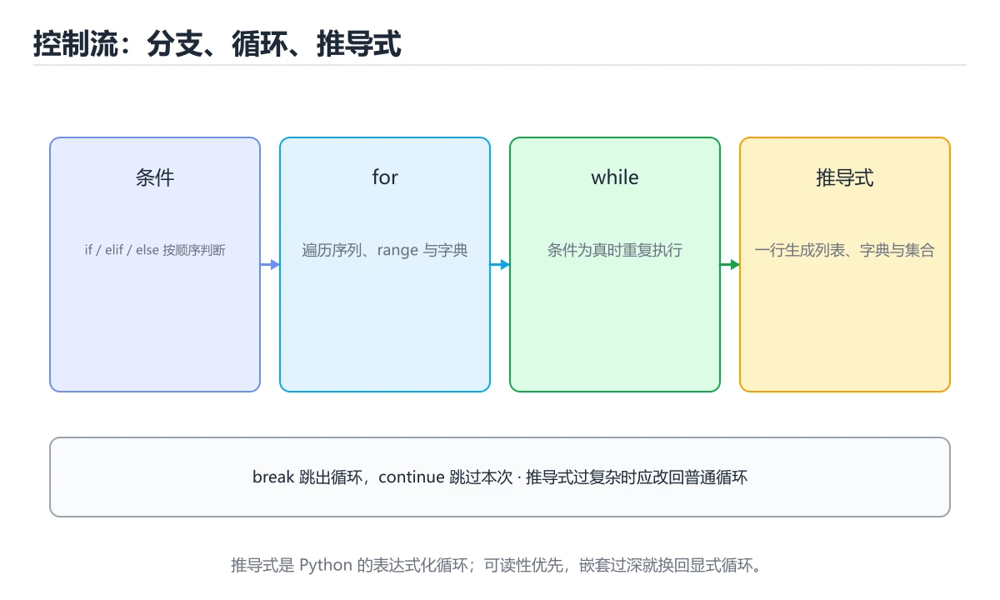
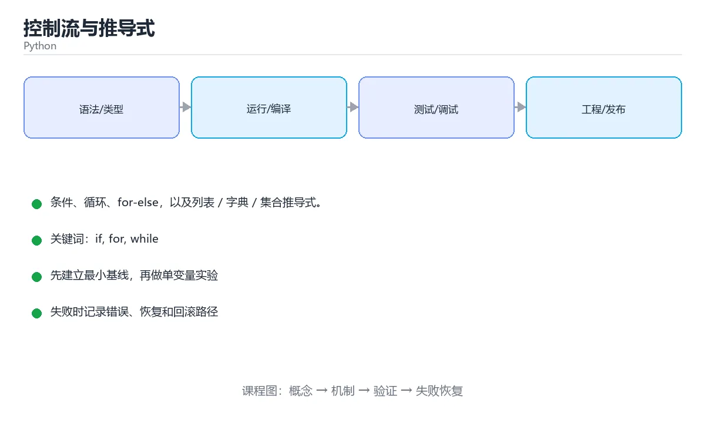

# 控制流与推导式





> 内容更新时间：2026-10-03 · 学习阶段：基础 · 预计用时：14 分钟

## 学习目标

- 能用自己的话解释控制流与推导式解决了什么问题，而不是只背术语。
- 能说清 「if」、「for」、「while」、「推导式」 之间的关系，并分别举出一个例子。
- 能把本课知识放回「Python」的知识体系，说明它和相邻主题的边界。
- 能完成本课练习，并用验收标准检查自己的结果。

> 一句话摘要：条件、循环、for-else，以及列表 / 字典 / 集合推导式。

## 前置知识

- 先完成上一课《函数》；如果已经掌握，可以直接用本课练习自测。
- 本课阶段：基础。建议会读写简单代码或命令，并理解变量、输入输出等基本概念。
- 开始前先复习：if、for、while。
- 如果某一步看不懂，先记录具体卡点，完成练习后再回头读一遍。

## 条件判断

```python
score = 78

if score >= 90:
    grade = "优秀"
elif score >= 60:
    grade = "及格"
else:
    grade = "不及格"

print(grade)
```

Python 中一切「空」的值都视为假：`0`、`""`、`[]`、`{}`、`None`、`False`。写判断时优先利用这一点：

```python
names = []
if not names:            # 比 len(names) == 0 更 Pythonic
    print("列表为空")
```

## 循环

```python
for i in range(3):          # 0 1 2
    print(i)

fruits = ["apple", "pear"]
for index, fruit in enumerate(fruits, start=1):
    print(index, fruit)

count = 0
while count < 3:
    count += 1
```

`break` 提前结束循环，`continue` 跳过本轮，`for ... else` 在循环「没有被 break」时执行：

```python
for n in [2, 4, 6, 7]:
    if n % 2 == 1:
        print("找到奇数", n)
        break
else:
    print("全部是偶数")
```

## 推导式

推导式用一行完成「生成新序列」的工作，通常比 for 循环更快也更易读。

```python
squares = [x * x for x in range(5)]              # [0, 1, 4, 9, 16]
evens = [x for x in range(10) if x % 2 == 0]     # 带条件
lengths = {word: len(word) for word in ["hi", "hello"]}
unique = {x % 3 for x in range(10)}
```

嵌套推导式要慎用，超过两层就应该改回普通循环。

## 常见陷阱

1. 循环中修改正在遍历的列表会漏元素，应遍历副本：`for x in nums[:]`。
2. `range(5)` 不包含 5，左闭右开。
3. 浮点数不要用 `==` 比较，改用 `abs(a - b) < 1e-9`。

## 本课小结
条件、循环、推导式构成 Python 的流程控制骨架：**判断用真值、遍历用 enumerate、生成序列用推导式**。

## 常见错误对照表

| 容易写错的写法 | 实际现象 | 原因与正确做法 |
| --- | --- | --- |
| `for name in names: names.remove(name)` | 元素被跳过，删不干净 | 遍历时修改长度；改成推导式 `names = [n for n in names if 条件]` 或倒序删除 |
| `while x > 0:` 但循环体没改 `x` | 死循环，CPU 跑满 | 确认循环变量每轮都在向终止条件靠近 |
| `if x = 1:` | `SyntaxError` | 赋值与比较不同，条件应该写 `==` |
| `if 0.1 + 0.2 == 0.3:` | 条件永远不成立 | 浮点比较用 `math.isclose()` |
| `if name == "a" or "b":` | 条件恒为真 | `or` 两边是独立表达式，正确写法 `name in ("a", "b")` |
| `for i in range(len(items)):` 只为取值 | 可读性差、容易越界 | 直接迭代元素；确实需要下标再用 `enumerate(items)` |
| 循环里用 `+=` 拼字符串 | 数据量大时越来越慢 | 先收集到列表，最后 `"".join(parts)` |
| `try: ... except:` 吞掉所有异常 | 真正的 bug 被隐藏，排查困难 | 只捕获预期异常类型，并至少 `logging.exception(...)` 记录 |
| 忘记 `break` 导致 `else` 没执行 | `for...else` 行为与直觉相反 | `else` 只在循环**正常结束**（没有 `break`）时执行 |

## 循环控制速查

| 关键词 | 作用 | 典型场景 |
| --- | --- | --- |
| `break` | 立刻结束整个循环 | 找到目标就收工 |
| `continue` | 跳过本次，进入下一次 | 过滤不符合条件的元素 |
| `else`（配合循环） | 没有触发 `break` 时执行 | 判断「一个都没找到」 |
| `enumerate` | 同时拿到下标与元素 | 需要序号或就地修改列表 |
| `zip` | 并行遍历多个序列 | 对齐两份数据 |
| `reversed` | 反向遍历 | 倒序删除时避免下标错位 |
| `sorted(key=...)` | 按指定规则排序 | 复杂对象排序，不修改原列表 |

常用推导式与生成器速查：

```python
squares = [x * x for x in range(10)]                    # 列表推导式
even = [x for x in range(20) if x % 2 == 0]             # 带条件
pairs = {k: v for k, v in items if v > 0}               # 字典推导式
unique = {len(w) for w in words}                        # 集合推导式
lazy = (x * x for x in range(10 ** 7))                  # 生成器，不占内存
flat = [n for row in matrix for n in row]               # 嵌套展平，顺序与嵌套循环一致
```

`for...else` 的实战写法：

```python
for user in users:
    if user.id == target:
        print("找到了")
        break
else:
    print("没找到，走兜底逻辑")   # 只有循环没被 break 才执行
```

## 自测清单

- [ ] 知道 `range(5)` 不含 5，`range(1, 10, 2)` 步长为 2。
- [ ] 遍历中需要删除元素时，改用推导式或倒序遍历。
- [ ] 能用 `enumerate` 替代 `range(len(...))`。
- [ ] 分得清 `break` 与 `continue`，并记得 `for...else` 的触发条件。
- [ ] 知道生成器表达式不立即求值，适合超大数据量。

## 零基础详解：让程序学会「做判断」和「重复干活」

### 一句话说清它是什么

控制流就是程序的三条基本走法：**顺序执行、条件分支、循环重复**。
任何复杂的程序，拆开来看都是这三件事的组合。

### 用生活比喻理解

| 结构 | 生活比喻 | 代码写法 |
| --- | --- | --- |
| 顺序 | 按菜谱一步步做 | 一行接一行 |
| 分支 | 下雨就带伞，否则不带 | `if / elif / else` |
| 循环 | 每个鸡蛋都敲一次 | `for`、`while` |
| 提前结束 | 发现坏了就整锅倒掉 | `break`、`return` |
| 跳过这一个 | 这个鸡蛋坏了，换下一个 | `continue` |

### 判断语句：从上往下，命中即停

```python
score = 85

if score >= 90:
    level = "优秀"
elif score >= 80:
    level = "良好"      # 85 命中这里，后面的分支不再判断
elif score >= 60:
    level = "及格"
else:
    level = "不及格"
```

关键点：

- `elif` 是「否则如果」，可以写很多个。
- 命中一个分支后，其余分支**全部跳过**，所以顺序要从严格到宽松。
- 条件后面必须有冒号，下一行必须有缩进。

### `for` 与 `while` 怎么选

| 场景 | 用哪个 | 例子 |
| --- | --- | --- |
| 已知要遍历一批数据 | `for` | 遍历列表、字符串、字典、range |
| 知道重复次数 | `for` + `range` | 重复 10 次 |
| 不知道要循环几次，靠条件停 | `while` | 猜数字直到猜对 |
| 死循环 + 中途退出 | `while True` + `break` | 菜单循环：输入 q 才退出 |

```python
# for：次数明确
for i in range(3):
    print("第", i + 1, "次")

# while：条件驱动
secret = 7
guess = 0
while guess != secret:
    guess = int(input("猜一个 1~10 的数字："))
    if guess < secret:
        print("小了")
    elif guess > secret:
        print("大了")
print("猜对了！")
```

### `break`、`continue`、`else` 的三点区别

| 关键字 | 作用 | 常见用途 |
| --- | --- | --- |
| `break` | 立刻跳出整个循环 | 找到了就停、用户输入 q 就退出 |
| `continue` | 跳过本轮剩余代码，进入下一轮 | 过滤掉不合格的数据 |
| `for ... else` | 循环**没有被 break** 时执行 | 判断「是否找到」 |

```python
for n in nums:
    if n < 0:
        print("发现负数，停止")
        break
else:
    print("全部都是非负数")   # 只有一次都没 break 才会执行
```

### 新手最容易踩的六个坑

| 坑 | 现象 | 正确做法 |
| --- | --- | --- |
| 遍历列表时删元素 | 有些元素被跳过 | 遍历副本 `for x in nums[:]`，或倒序删 |
| 用 `=` 做比较 | `SyntaxError` | 比较用 `==` |
| 浮点数直接判等 | 条件几乎不成立 | 用范围或误差判断 |
| `while` 忘了改变量 | 程序卡死不退出 | 循环体内更新条件变量，或加 `break` |
| 分支顺序写反 | 宽条件先命中，后面的永远进不去 | 从严格到宽松排序 |
| 循环里拼字符串 | 数据量大时非常慢 | 先收集到列表，最后 `"".join()` |

### 让代码更好读的三个习惯

1. 条件里的魔法数字起个名字：`if age >= ADULT_AGE:` 比 `if age >= 18:` 更清楚。
2. 嵌套超过三层就拆函数，把「先判断什么」写进函数名。
3. 复杂条件用括号分组：`if (a and b) or c:`，别让读者自己猜优先级。

### 手把手练习：九九乘法表 + 素数判断

```python
# 1. 打印九九乘法表（只打印下三角）
for i in range(1, 10):
    row = []
    for j in range(1, i + 1):
        row.append(f"{j}×{i}={i * j}")
    print("  ".join(row))

# 2. 判断素数
n = 97
is_prime = n > 1
for d in range(2, int(n ** 0.5) + 1):
    if n % d == 0:
        is_prime = False
        break
print(n, "是素数" if is_prime else "不是素数")
```

### 学完自测

- [ ] 能说出 `elif` 与连续多个 `if` 的区别。
- [ ] 能解释 `break` 和 `continue` 的差别。
- [ ] 能写出「用户输入 q 才退出」的菜单循环。
- [ ] 能说明为什么遍历时不能直接删列表元素。
- [ ] 能把一个三层嵌套的判断拆成两个函数。

## 动手练习

> 本课练习重点：围绕「if、for、while」完成复述、实验和交付，每个结果都要能被别人检查。

先写可运行脚本，再用类型注解与测试保护核心函数，最后处理真实输入。

### 练习 1：建立心智模型（10 分钟）

合上教程，用 3～5 句话回答：

1. 控制流与推导式解决了什么问题？
2. 如果没有它，会出现什么具体后果？
3. 它和「for」是什么关系？

**验收标准**：至少出现一个本课关键词，并写出一个反例、边界条件或失效场景。

### 练习 2：做一次可控实验（20 分钟）

从正文中选一个最小示例，完成以下操作：

1. 先预测修改一个参数、输入或步骤后的结果。
2. 再实际执行或逐步推演，记录真实结果。
3. 如果结果与预测不同，写出差异原因。

**验收标准**：留下「原例 → 改动 → 预测 → 结果 → 原因」五步记录。

### 练习 3：交付一个小结果（30 分钟）

写一个 20 行以内的小脚本，把本课概念用于处理一份真实文本或列表数据。

任务要求：

- 结果必须能被别人检查，不能只写“我已经理解了”。
- 至少覆盖「if」和「for」两个关键词。
- 写出 1 个仍然不确定的问题，以及下一步如何验证。

> 提示：时间有限时优先做练习 1 和练习 2；练习 3 可以拆成两次完成。

## 可运行练习

### 任务 1：先跑通，再解释

```python
score = 78

if score >= 90:
    grade = "优秀"
elif score >= 60:
    grade = "及格"
else:
    grade = "不及格"

print(grade)
```

### 任务 2：只改一个条件

### 任务 3：迁移到自己的数据

用同一套思路处理一组你自己的数据或场景，保持输出格式与任务 1 一致。

## 故障现场

### 现场 1：本课的 if 常规用例通过，但边界用例失败

**症状**：在本课的练习或生产场景里出现“本课的 if 常规用例通过，但边界用例失败”。

**复现**：准备一组最小输入，只保留触发“本课的 if 常规用例通过，但边界用例失败”的必要条件，连续运行两次确认结果稳定。

**定位**：围绕“if 的前置条件与取值边界没有写进代码，默认值掩盖了空值和极值”检查调用链、输入数据和环境配置，先验证假设再改代码。

**预防**：把“本课的 if 常规用例通过，但边界用例失败”写成一条自动化用例，并在本课的验收清单里保留对应检查项。

### 现场 2：本课的 for 结果在两次运行之间不一致

**症状**：在本课的练习或生产场景里出现“本课的 for 结果在两次运行之间不一致”。

**复现**：准备一组最小输入，只保留触发“本课的 for 结果在两次运行之间不一致”的必要条件，连续运行两次确认结果稳定。

**定位**：围绕“for 依赖了当前版本、执行顺序或共享状态，单次运行无法暴露差异”检查调用链、输入数据和环境配置，先验证假设再改代码。

**预防**：把“本课的 for 结果在两次运行之间不一致”写成一条自动化用例，并在本课的验收清单里保留对应检查项。

### 现场 3：本课的验证只在开发机通过

**症状**：在本课的练习或生产场景里出现“本课的验证只在开发机通过”。

**定位**：围绕“环境版本、配置和输入规模与目标环境不同，if 缺少可重复的验证记录”检查调用链、输入数据和环境配置，先验证假设再改代码。

## 版本与时效

### 升级检查清单

- 先固定当前版本，跑通全部示例与测验，再升级工具链。
- 只改一个版本变量，记录编译、测试、性能与产物体积的变化。
- 重点回归默认值、弃用警告、序列化格式、并发语义和错误信息。
- 升级完成后更新本课的“最后复核 / 下次复核”日期与版本说明。

## 本课复习清单

离开本课前，逐项确认：

- [ ] 不看解析，能说出「[x * x for x in range(4)] 的结果是什么？」的判断依据。
- [ ] 不看解析，能说出「for ... else 中的 else 什么时候执行？」的判断依据。
- [ ] 不看解析，能说出「遍历列表时删除元素导致漏掉元素，正确的做法是？」的判断依据。
- [ ] 不看解析，能说出「range(1, 10, 2) 生成的序列是？」的判断依据。
- [ ] 不看解析，能说出「break 与 continue 的区别是？」的判断依据。
- [ ] 至少运行一次本课示例，记录输入、输出和一个边界情况。
- [ ] 把本课最容易混淆的两个概念写成一句话对照。

| 复盘项 | 记录 |
| --- | --- |
| 已经能独立解释的考点 |  |
| 仍然说不清的概念 |  |
| 下一步验证动作 |  |

## 术语速查

| 术语 | 本课语境 |
| --- | --- |
| `""` | Python 中一切「空」的值都视为假：`0`、`""`、`[]`、`{}`、`None`、`False`。写判断时优先利用这一点： |
| `[]` | Python 中一切「空」的值都视为假：`0`、`""`、`[]`、`{}`、`None`、`False`。写判断时优先利用这一点： |
| `{}` | Python 中一切「空」的值都视为假：`0`、`""`、`[]`、`{}`、`None`、`False`。写判断时优先利用这一点： |
| `None` | Python 中一切「空」的值都视为假：`0`、`""`、`[]`、`{}`、`None`、`False`。写判断时优先利用这一点： |
| `False` | Python 中一切「空」的值都视为假：`0`、`""`、`[]`、`{}`、`None`、`False`。写判断时优先利用这一点： |
| `break` | `break` 提前结束循环，`continue` 跳过本轮，`for ... else` 在循环「没有被 break」时执行： |
| `continue` | `break` 提前结束循环，`continue` 跳过本轮，`for ... else` 在循环「没有被 break」时执行： |
| `for ... else` | `break` 提前结束循环，`continue` 跳过本轮，`for ... else` 在循环「没有被 break」时执行： |
| `for x in nums[:]` | 循环中修改正在遍历的列表会漏元素，应遍历副本：`for x in nums[:]`。 |
| `range(5)` | `range(5)` 不包含 5，左闭右开。 |
| `==` | 浮点数不要用 `==` 比较，改用 `abs(a - b) < 1e-9`。 |
| `abs(a - b) < 1e-9` | 浮点数不要用 `==` 比较，改用 `abs(a - b) < 1e-9`。 |

## 考点精讲

### 考点 1：围绕“控制流与推导式”中的 if、for、while，下列哪两项是本课强调的实践判断？

- **判断依据**：本课把控制流与推导式拆成概念、示例与故障现场三部分，因此判断 if 时必须同时交代输入、输出和失败路径，这使“学习 if 时要同时说明输入、输出和失败路径，不能只看正常流程”成立。在控制流与推导式里，判断 for 时要固定版本与边界输入，所以“验证 for 时要固定版本并覆盖边界输入，结论才可复现”才可复现。

### 考点 2：这段 Python 代码是「控制流与推导式」的示例片段，下面哪一项描述与它一致？

- **判断依据**：在「控制流与推导式」里，这段代码包含条件分支，不同输入会走不同的执行路径。这段代码出自「控制流与推导式」的正文示例，围绕if、for、while展开；把输入或边界换成空值、极值或失败情况后，结论要以「控制流与推导式」的实际运行结果为准。把“这段代码包含条件分支”代回「控制流与推导式」里“这段 Python 代码是控制流与推导式的示例片段”的例子核对，条件一旦改变，结论就要用if、for、while重新推导。

### 考点 3：遍历列表时删除元素导致漏掉元素，正确的做法是？

- **判断依据**：删除会改变下标，遍历副本可以避免漏元素。围绕 遍历列表时删除元素导致漏掉元素，正确的做法是。如果只凭关键词作答，很容易把「先排序再删除」、「把列表转成字典」与「遍历列表副本」混在一起；这道题的关键在「控制流与推导式」的if、for、while：先确认题干“遍历列表时删除元素导致漏掉元素”问的是哪一步，再排除偷换前提的选项。

### 考点 4：range(1, 10, 2) 生成的序列是？

- **判断依据**：结论应落在「1, 3, 5, 7, 9」。range(start, stop, step) 不包含 stop，所以到 9 结束。回到「控制流与推导式」的正文示例，用“range(1”走一遍if、for、while的完整流程，能复现的结论才可以保留。回到「控制流与推导式」的正文示例，用“range(1”走一遍if、for、while的完整流程，能复现的结论才可以保留。

### 考点 5：break 与 continue 的区别是？

- **判断依据**：在「控制流与推导式」里，break 结束整个循环，continue 跳过本次进入下一次。循环里做筛选用 continue，命中条件要收工用 break。这道题的关键在「控制流与推导式」的if、for、while：先确认题干“break 与 continue 的”问的是哪一步，再排除偷换前提的选项。

### 考点 6：补全代码：「控制流与推导式」示例中，下面这行代码缺少哪个关键字或函数名？请填入 ____。

`for index, fruit in ____(fruits, start=1):`

- **判断依据**：在「控制流与推导式」里，enumerate。「控制流与推导式」要求先交代if、for、while的前提再下结论，所以“enumerate”只在题干“控制流与推导式示例中”给定的条件下成立。把“enumerate”代回「控制流与推导式」里“控制流与推导式示例中”的例子核对，条件一旦改变，结论就要用if、for、while重新推导。

## English Overview

**Title:** Control Flow & Comprehensions

**Summary:** Conditions, loops, for-else and comprehensions.

**Category:** Python
**Level:** 基础
**Key terms:** if, for, while, 推导式, break, range

## 内容元数据

- 内容版本：v2.0
- 最后更新：2026-10-03
- 学习阶段：基础
- 适用环境：Python 3.12+
- 内容来源：内置结构化课程与工程实践整理
- 相关主题：if、for、while、推导式、break、range
- 质量版本：P0 测验标准 + P1 覆盖扩展 + P2 体验补全

## 参考资料与复核

- 最后复核：2026-10-04
- 下次复核：2027-04-04
- 复核范围：版本兼容、API 行为、安全建议与工程实践
- 来源性质：官方文档、标准或权威教材；正文为离线教学重组

| 参考资料 | 本课用途 |
| --- | --- |
| [Python 教程](https://docs.python.org/3/tutorial/) | 语法、数据类型与控制流 |
| [Python 标准库](https://docs.python.org/3/library/) | 标准库 API 与模块 |
| [typing 文档](https://docs.python.org/3/library/typing.html) | 类型标注与泛型 |

> 「控制流与推导式」的链接用于离线阅读后的延伸核对；App 不会自动联网。
