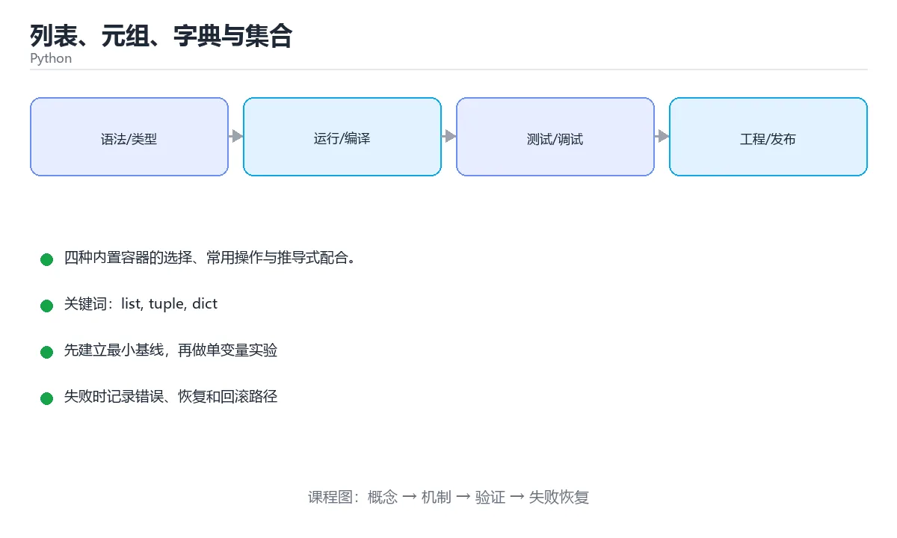

# 列表、元组、字典与集合



> 内容更新时间：2026-10-03 · 学习阶段：基础 · 预计用时：16 分钟

## 学习目标

- 能用自己的话解释「列表、元组、字典与集合」解决了什么问题，而不是只背术语。
- 能说清 「list」、「tuple」、「dict」、「set」 之间的关系，并分别举出一个例子。
- 能把本课知识放回「Python」的知识体系，说明它和相邻主题的边界。
- 能完成本课练习，并用验收标准检查自己的结果。

> 一句话摘要：四种内置容器的选择、常用操作与推导式配合。

## 前置知识

- 先完成上一课《控制流与推导式》；如果已经掌握，可以直接用本课练习自测。
- 本课阶段：基础。建议会读写简单代码或命令，并理解变量、输入输出等基本概念。
- 开始前先复习：list、tuple、dict。
- 如果某一步看不懂，先记录具体卡点，完成练习后再回头读一遍。


## 四种内置容器

| 类型 | 是否有序 | 是否可变 | 是否允许重复 | 典型用途 |
| --- | --- | --- | --- | --- |
| `list` | 有序 | 可变 | 允许 | 有序集合、队列 |
| `tuple` | 有序 | 不可变 | 允许 | 固定结构、函数多返回值 |
| `dict` | 有序（3.7+） | 可变 | 键唯一 | 映射、缓存 |
| `set` | 无序 | 可变 | 不允许 | 去重、集合运算 |

## 列表

```python
nums = [3, 1, 2]
nums.append(4)          # 末尾追加
nums.insert(0, 9)       # 指定位置插入
nums.sort()             # 原地排序
print(nums[1:3])        # 切片，左闭右开
print(sorted(nums, reverse=True))   # 返回新列表
```

切片会产生新列表：`nums[:]` 是浅拷贝，`nums2 = nums` 只是多了一个名字。

## 元组与解包

```python
point = (3, 5)
x, y = point            # 解包

def min_max(nums):
    return min(nums), max(nums)   # 实际返回元组

low, high = min_max([4, 1, 9])
```

## 字典

```python
user = {"name": "小明", "age": 18}
user["city"] = "上海"                 # 新增或修改
print(user.get("email", "未填写"))     # 取不到时用默认值，不会报错

for key, value in user.items():
    print(key, value)
```

用 `collections.Counter` 做词频统计：

```python
from collections import Counter

words = "the cat the dog the".split()
print(Counter(words).most_common(2))   # [('the', 3), ('cat', 1)]
```

## 集合

```python
a = {1, 2, 3}
b = {3, 4}

print(a & b)     # 交集 {3}
print(a | b)     # 并集 {1, 2, 3, 4}
print(a - b)     # 差集 {1, 2}
print(list(set([1, 1, 2, 2, 3])))   # 去重
```

## 选择建议

- 需要顺序和下标 → `list`
- 需要不可变、可作字典键 → `tuple`
- 需要按键查找 → `dict`
- 需要去重或集合运算 → `set`

## 本课小结
选对容器，代码往往能少写一半。记住：**列表管顺序、字典管映射、集合管去重**。


## 容器选型速查

| 需求 | 首选 | 理由 | 常用写法 |
| --- | --- | --- | --- |
| 有序、可重复、频繁按下标访问 | `list` | 数组实现，下标访问 O(1) | `items[0]`、`items[-1]` |
| 数据不重复、只判存在性 | `set` | 哈希实现，判断 `in` 平均 O(1) | `if x in seen:` |
| 键值映射、按 key 查找 | `dict` | 哈希实现，平均 O(1) | `count[word] += 1` |
| 数据固定不变、可作字典键 | `tuple` | 不可变、可哈希 | `point = (3, 4)` |
| 需要先进先出队列 | `collections.deque` | 两端操作 O(1) | `q.append(x)`、`q.popleft()` |
| 需要计数 | `collections.Counter` | 自带 `most_common` | `Counter(words)` |
| 需要带默认值的字典 | `collections.defaultdict` | 免去初始化判断 | `d[k].append(v)` |

## 常用操作对照

| 操作 | 列表 | 字典 | 集合 |
| --- | --- | --- | --- |
| 添加元素 | `append` / `insert` / `extend` | `d[k] = v` / `setdefault` | `add` / `update` |
| 删除元素 | `pop(i)` / `remove(v)` | `pop(k)` / `del d[k]` | `remove` / `discard` |
| 安全取值 | `items[i]`（越界报错） | `d.get(k, 默认值)` | 无下标，用 `in` 判断 |
| 判断存在 | `v in items`（O(n)） | `k in d`（平均 O(1)） | `v in s`（平均 O(1)） |
| 合并 | `a + b` / `a.extend(b)` | `a.update(b)` / `{**a, **b}` | `a \| b` |
| 排序 | `items.sort()`（原地） | 按键排序 `sorted(d.items())` | `sorted(s)` 返回列表 |
| 浅拷贝 | `items.copy()` / `items[:]` | `d.copy()` | `s.copy()` |

## 常见错误对照表

| 容易写错的写法 | 实际现象 | 原因与正确做法 |
| --- | --- | --- |
| `d["missing"]` | `KeyError` | 不确定键存在时用 `d.get("missing", 0)` |
| `d.get("k") + 1` 首次统计 | `TypeError: NoneType + int` | 给默认值：`d.get("k", 0) + 1`，或用 `Counter` |
| `[[]] * 3` | 三个元素是同一个列表 | 改成 `[[] for _ in range(3)]` |
| `s = {}` 想建集合 | 实际建了空字典 | 空集合要写 `set()` |
| 把列表放进集合 | `TypeError: unhashable type: 'list'` | 先转元组：`{(x, y) for x, y in points}` |
| `list.sort()` 后写 `x = list.sort()` | `x` 是 `None` | 原地方法返回 `None`；需要新列表用 `sorted(list)` |
| `d.items()` 遍历中删除 | `RuntimeError: dictionary changed size` | 先收集要删的键，再统一删除；或用推导式重建 |
| 用 `list.pop(0)` 当队列 | 数据量大时越来越慢 | 改用 `collections.deque` 的 `popleft()` |
| 切片赋值给原列表想改副本 | 原列表被改 | `b = a` 是同一对象，要副本写 `b = a[:]` 或 `a.copy()` |

## 复杂度速查

| 操作 | list | dict / set | deque |
| --- | --- | --- | --- |
| 按下标访问 | O(1) | 不适用 | O(n) |
| 查找 `in` | O(n) | 平均 O(1) | O(n) |
| 尾部追加 | 均摊 O(1) | 平均 O(1) | O(1) |
| 头部插入/删除 | O(n) | 不适用 | O(1) |
| 中间插入/删除 | O(n) | 不适用 | O(n) |
| 有序遍历 | O(n) | O(n)（无序） | O(n) |

## 自测清单

- [ ] 能用 `set` 给一批数据去重，并说明为什么比列表快。
- [ ] 统计词频时优先想到 `Counter` 或 `defaultdict(int)`。
- [ ] 知道字典的键必须是可哈希（不可变）对象。
- [ ] 需要队列时用 `deque`，不会用 `list.pop(0)`。
- [ ] 分得清 `sort()`（原地、返回 `None`）与 `sorted()`（返回新列表）。


## 零基础详解：四种容器怎么选

### 一句话说清它是什么

Python 的四种主力容器分工明确：**列表管顺序、元组管固定、字典管查找、集合管去重**。
选错容器，代码不会报错，但会又慢又难读。

### 用生活比喻理解

| 容器 | 比喻 | 什么时候用 |
| --- | --- | --- |
| `list` | 一排带编号的抽屉 | 有顺序、会增删、允许重复 |
| `tuple` | 刻好字的石板 | 一旦确定不再改，例如坐标、配置项 |
| `dict` | 字典 / 通讯录 | 用名字快速查内容 |
| `set` | 一筐不重复的球 | 去重、判断是否存在、集合运算 |

### 四种容器横向对比

| 对比项 | list | tuple | dict | set |
| --- | --- | --- | --- | --- |
| 写法 | `[1, 2]` | `(1, 2)` | `{"a": 1}` | `{1, 2}` |
| 有序 | 是 | 是 | 是（3.7+） | 否 |
| 可修改 | 是 | 否 | 是 | 是 |
| 允许重复 | 是 | 是 | 键不能重复 | 否 |
| 能否作字典键 | 否 | 是（元素不可变时） | 否 | 否（要用 frozenset） |
| 查找速度 | O(n) | O(n) | O(1) | O(1) |

### 按「问题」选容器

| 你要做的事 | 选它 | 示例 |
| --- | --- | --- |
| 按顺序保存、后面还要改 | `list` | 待办清单 |
| 一次返回多个固定值 | `tuple` | `return (x, y)` |
| 用 ID 查找对象 | `dict` | `users[user_id]` |
| 快速判断「有没有」 | `set` 或 `dict` | 黑名单、已访问集合 |
| 去掉重复项 | `set` | `set(names)` |
| 保持顺序去重 | `dict.fromkeys` | `list(dict.fromkeys(seq))` |

```python
# 去重且保持原顺序（最常用的写法）
names = ["a", "b", "a", "c"]
unique = list(dict.fromkeys(names))     # ['a', 'b', 'c']

# 用字典做计数，比 list.count 快得多
counter = {}
for ch in "banana":
    counter[ch] = counter.get(ch, 0) + 1
```

### 常用操作速查

```python
nums = [3, 1, 2]
nums.append(4)          # 尾部添加
nums.insert(0, 0)       # 指定位置插入
nums.remove(1)          # 按值删第一个
last = nums.pop()       # 弹出尾部
nums.sort()             # 原地排序
sorted_copy = sorted(nums)   # 返回新列表

point = (3, 4)
x, y = point            # 解包

user = {"id": 1, "name": "小明"}
user.get("age", 0)      # 取不到时给默认值，比 user["age"] 安全
for k, v in user.items():
    print(k, v)

tags = {"py", "db"}
tags.add("ai")
"py" in tags            # True，O(1)
```

### 复杂度直觉：为什么查找要用字典

| 操作 | list | dict / set |
| --- | --- | --- |
| 按下标取 | O(1) | —— |
| 按值查找 | O(n) | O(1) |
| 判断存在 | O(n) | O(1) |
| 尾部追加 | O(1) | O(1) |
| 中间插入或删除 | O(n) | —— |

数据量一万时差别不明显，一百万时就是「瞬间」和「等几秒」的区别。

### 新手最容易踩的七个坑

| 坑 | 现象 | 正确做法 |
| --- | --- | --- |
| 用 `list` 判存在 | 数据量大时极慢 | 换成 `set` |
| 遍历时删元素 | 漏掉若干项 | 遍历副本或倒序删 |
| 用下标取不存在的键 | 抛 `KeyError` | 用 `.get(key, 默认值)` |
| 用 list 当字典键 | `TypeError: unhashable` | 换成 tuple |
| 直接改 tuple | `TypeError` | 需要可变就换 list |
| 以为 `{}` 是空集合 | 其实是空字典 | 空集合写 `set()` |
| 浅拷贝嵌套结构 | 改内层互相影响 | 用 `copy.deepcopy()` |

### 手把手练习：词频统计前三名

```python
text = "the quick brown fox jumps over the lazy dog the fox"

counts = {}
for word in text.split():
    counts[word] = counts.get(word, 0) + 1

top3 = sorted(counts.items(), key=lambda kv: (-kv[1], kv[0]))[:3]
for word, n in top3:
    print(f"{word}: {n} 次")

print("不同单词数：", len(set(text.split())))
```

### 学完自测

- [ ] 能说出四种容器各自最适合的场景。
- [ ] 知道为什么判断存在性要用 set 而不是 list。
- [ ] 能写出「去重且保持原顺序」的一行代码。
- [ ] 知道 `{}` 是空字典，空集合要写 `set()`。
- [ ] 能解释浅拷贝与深拷贝的区别。

## 动手练习


> 本课练习重点：围绕「list、tuple、dict」完成复述、实验和交付，每个结果都要能被别人检查。

先写可运行脚本，再用类型注解与测试保护核心函数，最后处理真实输入。

### 练习 1：建立心智模型（10 分钟）

合上教程，用 3～5 句话回答：

1. 「列表、元组、字典与集合」解决了什么问题？
2. 如果没有它，会出现什么具体后果？
3. 它和「tuple」是什么关系？

**验收标准**：至少出现一个本课关键词，并写出一个反例、边界条件或失效场景。

### 练习 2：做一次可控实验（20 分钟）

从正文中选一个最小示例，完成以下操作：

1. 先预测修改一个参数、输入或步骤后的结果。
2. 再实际执行或逐步推演，记录真实结果。
3. 如果结果与预测不同，写出差异原因。

**验收标准**：留下「原例 → 改动 → 预测 → 结果 → 原因」五步记录。

### 练习 3：交付一个小结果（30 分钟）

写一个 20 行以内的小脚本，把本课概念用于处理一份真实文本或列表数据。

任务要求：

- 结果必须能被别人检查，不能只写“我已经理解了”。
- 至少覆盖「list」和「tuple」两个关键词。
- 写出 1 个仍然不确定的问题，以及下一步如何验证。

> 提示：时间有限时优先做练习 1 和练习 2；练习 3 可以拆成两次完成。


## 考点精讲：把测验题还原成判断过程

本课有 6 个判断点。先自己作答，再看「判断依据」；如果结论正确但理由不完整，回到正文对应章节补足概念。

### 考点 1：下面哪种类型是不可变的？

- **正确判断**：tuple
- **判断依据**：tuple 创建后不能修改，因此可以作为字典的键。其他选项：list、dict、set 都能原地修改，只有 tuple 不可变，因此它还能作为字典的键。针对「下面哪种类型是不可变的，」，本课在「零基础详解：四种容器怎么选」中说明：Python 的四种主力容器分工明确：列表管顺序、元组管固定、字典管查找、集合管去重。本课还在「零基础详解：四种容器怎么选」中说明：知道为什么判断存在性要用 set 而不是 list。
- **迁移检查**：把题干里的一个条件换成边界值，原来的结论还成立吗？写出判断过程。

### 考点 2：读取字典中可能不存在的键，且不想抛异常，应该用？

- **正确判断**：user.get('email', '默认值')
- **判断依据**：正确答案是「user.get('email', '默认值')」，本课在「零基础详解：四种容器怎么选」中说明：知道 {} 是空字典，空集合要写 set()。dict.get() 在键不存在时返回默认值，不会抛 KeyError。本课还在「本课小结」中说明：记住：列表管顺序、字典管映射、集合管去重。本课还在「零基础详解：四种容器怎么选」中说明：知道为什么判断存在性要用 set 而不是 list。
- **迁移检查**：如果给某个错误选项去掉一个限定词，它会不会变成正确？说明理由。

### 考点 3：对一批数据去重，最合适的容器是？

- **正确判断**：set
- **判断依据**：set 不允许重复元素，set(数据) 即可完成去重。其他选项：list、tuple 允许重复，str 会把数据拼成一个字符串。针对「对一批数据去重，最合适的容器是，」，本课在「零基础详解：四种容器怎么选」中说明：知道 {} 是空字典，空集合要写 set()。本课还在「零基础详解：四种容器怎么选」中说明：Python 的四种主力容器分工明确：列表管顺序、元组管固定、字典管查找、集合管去重。本课还在「列表」中说明：切片会产生新列表：nums[:] 是浅拷贝，nums2 = nums 只是多了一个名字。
- **迁移检查**：把题干里的一个条件换成边界值，原来的结论还成立吗？写出判断过程。

### 考点 4：a = [0, 1, 2, 3, 4] 时 a[1:4] 的结果是？

- **正确判断**：[1, 2, 3]
- **判断依据**：正确答案是「[1, 2, 3]」，本课在「本课小结」中说明：记住：列表管顺序、字典管映射、集合管去重。切片左闭右开，包含起始索引、不包含结束索引。课程摘要指出四种内置容器的选择，常用操作与推导式配合，本课要判断的正是a=[0,1,2,3,4]时a[1:4]的结果是。
- **迁移检查**：如果给某个错误选项去掉一个限定词，它会不会变成正确？说明理由。

### 考点 5：作为字典键的对象必须满足？

- **正确判断**：可哈希（通常是不可变类型，如 str、int、tuple）
- **判断依据**：正确答案是「可哈希（通常是不可变类型，如 str、int、tuple）」，这道题在问作为字典键的对象必须满足，判断时要把题干限定的输入、边界与目标逐项对齐。字典用哈希值定位键，列表、字典这类可变对象不可哈希，不能当键。课程摘要指出四种内置容器的选择，常用操作与推导式配合，本课要判断的正是作为字典键的对象必须满足。
- **迁移检查**：遮住选项，只根据定义复述一次答案，再回来看哪个选项与复述一致。

### 考点 6：补全代码：「列表、元组、字典与集合」示例中，下面这行代码缺少哪个关键字或函数名？请填入 ____。 `print(Counter(words).____(2)) # [('the', 3), ('cat', 1)]`

- **正确判断**：most_common
- **判断依据**：正确答案是「most_common」，这道题在问补全代码：列表、元组、字典与集合示例中，下面这行代码…'the',3),('cat',1)]`，判断时要把题干限定的输入、边界与目标逐项对齐。请填… # [('the', 3), ('cat', 1)] 限定的语境来判断。
- **迁移检查**：如果填成相近的另一个函数或关键字，程序会在哪一步出错？

## 本课复习清单

离开本课前，逐项确认：

- [ ] 不看解析，能说出「下面哪种类型是不可变的？」的判断依据。
- [ ] 不看解析，能说出「读取字典中可能不存在的键，且不想抛异常，应该用？」的判断依据。
- [ ] 不看解析，能说出「对一批数据去重，最合适的容器是？」的判断依据。
- [ ] 不看解析，能说出「a = [0, 1, 2, 3, 4] 时 a[1:4] 的结果是？」的判断依据。
- [ ] 不看解析，能说出「作为字典键的对象必须满足？」的判断依据。
- [ ] 不看解析，能说出「补全代码：「列表、元组、字典与集合」示例中，下面这行代码缺少哪个关键字或函数名？…」的判断依据。
- [ ] 至少运行一次本课示例，记录输入、输出和一个边界情况。
- [ ] 把本课最容易混淆的两个概念写成一句话对照。

| 复盘项 | 记录 |
| --- | --- |
| 已经能独立解释的考点 |  |
| 仍然说不清的概念 |  |
| 下一步验证动作 |  |

## English Overview

**Title:** Core Data Structures

**Summary:** Choose and use list, tuple, dict and set correctly.

**Category:** Python  
**Level:** 基础  
**Key terms:** list, tuple, dict, set, 切片, Counter

> The full tutorial is written in Chinese. This bilingual overview helps English readers identify the topic, scope and key terms before studying the detailed examples.

## 内容元数据

- 内容版本：v2.0
- 最后更新：2026-10-03
- 学习阶段：基础
- 适用环境：Python 3.12+
- 内容来源：内置结构化课程与工程实践整理
- 相关主题：list、tuple、dict、set、切片、Counter
- 质量版本：P0 测验标准 + P1 覆盖扩展 + P2 体验补全


## 参考资料与复核

- 最后复核：2026-10-04
- 下次复核：2027-04-04
- 复核范围：版本兼容、API 行为、安全建议与工程实践
- 来源性质：官方文档与标准；本课正文为离线教学重组，不复制原文

| 参考资料 | 本课用途 |
| --- | --- |
| [Python 官方文档](https://docs.python.org/3/) | 语言、标准库与版本行为 |
| [Python Packaging](https://packaging.python.org/) | 包管理与发布 |

> 本课主题：四种内置容器的选择、常用操作与推导式配合。

> App 完全离线展示文字链接，不会自动联网；需要延伸阅读时可复制链接到浏览器。

