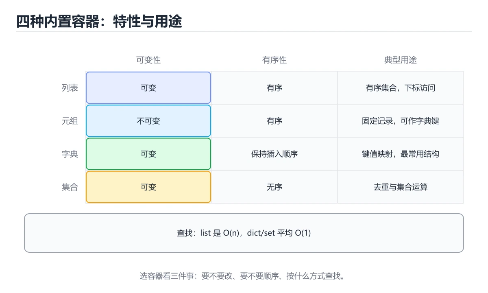

# 列表、元组、字典与集合




> 内容更新时间：2026-10-06 · 学习阶段：基础 · 预计用时：50 分钟

## 本节知识框架

**课程定位**：所属分类 `python`（Python），课程主题 `列表、元组、字典与集合`，学习阶段 基础，建议用时 45 分钟。

本课主线：四种内置容器的选择、常用操作与推导式配合。

**学完本课应当能够**
- 说清 `切片` 与 `列表推导式` 的含义与区别，并各举一个正例和一个反例。
- 用本课示例验证 `字典` 的行为，记录输入、输出与失败条件。
- 遇到「用 `list` 判存在」这类问题时，能说出触发条件与修复顺序。

### 从概念到验证的学习链条

1. `切片`：先掌握 切片会产生新列表：nums[:] 是浅拷贝，nums2 = nums 只是多了一个名字，再用它解释 `列表推导式` 为什么会出现。
2. `列表推导式`：先掌握 用一行表达式生成新列表，比循环加 append 更简洁，通常也更快，再用它解释 `字典` 为什么会出现。
3. `字典`：先掌握 按键值对存储的哈希表，查找是常数时间，键必须是可哈希对象，再用它解释 `可变与不可变` 为什么会出现。
4. `可变与不可变`：先掌握 列表可变，元组与字符串不可变；默认参数用可变对象会在多次调用之间共享状态，再用它解释 本课示例的观察结果 为什么会出现。

**先修与衔接**：本课是「Python」分类的第 10 课。先修内容：《控制流与推导式》。《控制流与推导式》里的 `None`、`break` 是本课的前提。相关或后续课程：《类与对象》。

### 完成判据

- **定义关**：不看正文也能说明 `切片` 是 切片会产生新列表：nums[:] 是浅拷贝，nums2 = nums 只是多了一个名字，并指出一个反例。
- **机制关**：能按“输入 → 转换 → 输出 → 验证”复述 `列表、元组、字典与集合`，而不是只背结论。
- **示例关**：能运行或推演 `列表、元组、字典与集合` 的 `python` 示例，并说明一个真实出现的标识符或字面量。
- **证据关**：能指出 `列表、元组、字典与集合` 示例里的 调用了 `append()`，并说明它支持或反驳了本课的哪一条结论。
- **排错关**：能复现 用 `list` 判存在，记录现象并按 换成 `set` 修复。
- **迁移关**：能把 `list`、`tuple`、`dict`、`set` 放进一个与 `列表、元组、字典与集合` 不同的项目场景，并保持输入与验证条件可追踪。
- **复盘关**：学完 `列表、元组、字典与集合` 后，用一句话写下仍然不确定的结论，并列出下一次验证需要的输入、环境和成功判据。

### 复习清单

- [ ] 能不看正文复述本课核心术语，并指出一个边界或反例。
- [ ] 能运行或推演本课示例，记录输入、输出与失败现象。
- [ ] 能完成一次自测，并把错题对照错误表定位原因。

## 核心概念定义

| 术语 | 操作性定义 | 常见边界与风险 |
| --- | --- | --- |
| 切片 | 切片会产生新列表：nums[:] 是浅拷贝，nums2 = nums 只是多了一个名字。 | 易错：原列表被改；正确做法是`b = a` 是同一对象，要副本写 `b = a[:]` 或 `a.copy()`。 |
| 列表推导式 | 用一行表达式生成新列表，比循环加 append 更简洁，通常也更快。 | 只在「用一行表达式生成新列表，比循环加 append 更简洁，通常也更快」这一前提下成立，换输入或换环境要重新验证。 |
| 字典 | 按键值对存储的哈希表，查找是常数时间，键必须是可哈希对象。 | 易错：`TypeError: unhashable`；正确做法是换成 tuple。 |
| 可变与不可变 | 列表可变，元组与字符串不可变；默认参数用可变对象会在多次调用之间共享状态。 | 共享状态与调度顺序会改变结论，单线程或串行测试通过不等于并发下成立。 |

## 原理与运行机制

### 机制总览

**教材衔接：四种内置容器**

| 类型 | 是否有序 | 是否可变 | 是否允许重复 | 典型用途 |
| --- | --- | --- | --- | --- |
| `list` | 有序 | 可变 | 允许 | 有序集合、队列 |
| `tuple` | 有序 | 不可变 | 允许 | 固定结构、函数多返回值 |
| `dict` | 有序（3.7+） | 可变 | 键唯一 | 映射、缓存 |
| `set` | 无序 | 可变 | 不允许 | 去重、集合运算 |

**教材衔接：选择建议**

- 需要顺序和下标 → `list`
- 需要不可变、可作字典键 → `tuple`
- 需要按键查找 → `dict`
- 需要去重或集合运算 → `set`

**教材衔接：容器选型速查**

| 需求 | 首选 | 理由 | 常用写法 |
| --- | --- | --- | --- |
| 有序、可重复、频繁按下标访问 | `list` | 数组实现，下标访问 O(1) | `items[0]`、`items[-1]` |
| 数据不重复、只判存在性 | `set` | 哈希实现，判断 `in` 平均 O(1) | `if x in seen:` |
| 键值映射、按 key 查找 | `dict` | 哈希实现，平均 O(1) | `count[word] += 1` |
| 数据固定不变、可作字典键 | `tuple` | 不可变、可哈希 | `point = (3, 4)` |
| 需要先进先出队列 | `collections.deque` | 两端操作 O(1) | `q.append(x)`、`q.popleft()` |
| 需要计数 | `collections.Counter` | 自带 `most_common` | `Counter(words)` |
| 需要带默认值的字典 | `collections.defaultdict` | 免去初始化判断 | `d[k].append(v)` |

**教材衔接：版本与时效**

### 升级检查清单

- 先固定当前版本，跑通全部示例与测验，再升级工具链。
- 升级时只动一个依赖版本，用 most_common 记录构建与运行结果。
- 升级后重点回归 list 的默认值、警告信息与错误格式。
- 升级完成后记录 list 的新旧版本差异，并据此调整下次复核时间。

### 机制拆解：每一步的输入、动作与输出

#### 1. `切片`
- 输入：`list`；本步把 切片会产生新列表：nums[:] 是浅拷贝，nums2 = nums 只是多了一个名字 当作判断规则。
- 动作：围绕 `切片` 保留中间状态，并记录它与 `列表推导式` 的对应关系。
- 输出：`列表推导式`，它可以被下一段代码、测试或记录继续使用。
- `切片` 的失败条件：当切片赋值给原列表想改副本时，会出现原列表被改。

#### 2. `列表推导式`
- 输入：`切片`；本步把 用一行表达式生成新列表，比循环加 append 更简洁，通常也更快 当作判断规则。
- 动作：围绕 `列表推导式` 保留中间状态，并记录它与 `字典` 的对应关系。
- 输出：`字典`，它可以被下一段代码、测试或记录继续使用。
- `列表推导式` 的失败条件：只在「用一行表达式生成新列表，比循环加 append 更简洁，通常也更快」这一前提下成立，换输入或换环境要重新验证。

#### 3. `字典`
- 输入：`列表推导式`；本步把 按键值对存储的哈希表，查找是常数时间，键必须是可哈希对象 当作判断规则。
- 动作：围绕 `字典` 保留中间状态，并记录它与 `可变与不可变` 的对应关系。
- 输出：`可变与不可变`，它可以被下一段代码、测试或记录继续使用。
- `字典` 的失败条件：当用 list 当字典键时，会出现`TypeError: unhashable`。

#### 4. `可变与不可变`
- 输入：`字典`；本步把 列表可变，元组与字符串不可变；默认参数用可变对象会在多次调用之间共享状态 当作判断规则。
- 动作：围绕 `可变与不可变` 保留中间状态，并记录它与 `append` 的对应关系。
- 输出：`append`，它可以被下一段代码、测试或记录继续使用。
- `可变与不可变` 的失败条件：共享状态与调度顺序会改变结论，单线程或串行测试通过不等于并发下成立。

### 示例中的可观察事实

1. 调用了 `append()`；它对应的课程主题是 `列表、元组、字典与集合`。
2. 调用了 `insert()`；它对应的课程主题是 `列表、元组、字典与集合`。
3. 调用了 `sort()`；它对应的课程主题是 `列表、元组、字典与集合`。
4. 调用了 `print()`；它对应的课程主题是 `列表、元组、字典与集合`。
5. 调用了 `sorted()`；它对应的课程主题是 `列表、元组、字典与集合`。
6. 调用了 `min_max()`；它对应的课程主题是 `列表、元组、字典与集合`。
7. 调用了 `min()`；它对应的课程主题是 `列表、元组、字典与集合`。
8. 调用了 `max()`；它对应的课程主题是 `列表、元组、字典与集合`。

### 复现实验记录

- 环境：`列表、元组、字典与集合` 使用 `python` 示例，固定 `list`、`tuple`、`dict`、`set` 作为第一组条件。
- 首轮输入：先确认 调用了 `append()`，预测 `切片` 会怎样变化。
- 基线观察：记录命令、输入、输出和错误原文，不用截图代替可复制的文本。
- 单变量修改：只改变 `list`，观察 `可变与不可变` 是否仍满足定义。
- 失败注入：复现 用 `list` 判存在，确认现象是 数据量大时极慢。
- 记录结论：把“修改前、修改后、预期变化、实际变化”写成四列表，这样复盘 `列表、元组、字典与集合` 时才能区分概念错误与实现错误。

## 典型应用场景

- **用 `list` 判存在**：典型现象是数据量大时极慢；正确做法是换成 `set`。
- **遍历时删元素**：典型现象是漏掉若干项；正确做法是遍历副本或倒序删。
- **用下标取不存在的键**：典型现象是抛 `KeyError`；正确做法是用 `.get(key, 默认值)`。
- **用 list 当字典键**：典型现象是`TypeError: unhashable`；正确做法是换成 tuple。

### 最小验证场景

- 准备：保留 `python` 示例的原始输入，先记录 `列表、元组、字典与集合` 的基线输出和完整运行命令。
- 观察：先核对 调用了 `append()`，再改变一个与 `切片` 相关的条件。
- 判定：新结果与 `列表、元组、字典与集合` 的基线不同不等于错误；只有当差异破坏了 `切片` 的定义或错误表中的约束，才判定为失败。

### 选择与边界

- 使用 `切片` 时，先满足它的定义：切片会产生新列表：nums[:] 是浅拷贝，nums2 = nums 只是多了一个名字；易错：原列表被改；正确做法是`b = a` 是同一对象，要副本写 `b = a[:]` 或 `a.copy()`。
- 使用 `列表推导式` 时，先满足它的定义：用一行表达式生成新列表，比循环加 append 更简洁，通常也更快；只在「用一行表达式生成新列表，比循环加 append 更简洁，通常也更快」这一前提下成立，换输入或换环境要重新验证。
- 使用 `字典` 时，先满足它的定义：按键值对存储的哈希表，查找是常数时间，键必须是可哈希对象；易错：`TypeError: unhashable`；正确做法是换成 tuple。
- 使用 `可变与不可变` 时，先满足它的定义：列表可变，元组与字符串不可变；默认参数用可变对象会在多次调用之间共享状态；共享状态与调度顺序会改变结论，单线程或串行测试通过不等于并发下成立。

## 代码/协议/SQL 示例

### 最小可验证示例

```python
nums = [3, 1, 2]
nums.append(4)          # 末尾追加
nums.insert(0, 9)       # 指定位置插入
nums.sort()             # 原地排序
print(nums[1:3])        # 切片，左闭右开
print(sorted(nums, reverse=True))   # 返回新列表
```

**教材衔接：列表**

切片会产生新列表：`nums[:]` 是浅拷贝，`nums2 = nums` 只是多了一个名字。

**教材衔接：元组与解包**

```python
point = (3, 5)
x, y = point            # 解包

def min_max(nums):
    return min(nums), max(nums)   # 实际返回元组

low, high = min_max([4, 1, 9])
```

**教材衔接：字典**

```python
user = {"name": "小明", "age": 18}
user["city"] = "上海"                 # 新增或修改
print(user.get("email", "未填写"))     # 取不到时用默认值，不会报错

for key, value in user.items():
    print(key, value)
```

用 `collections.Counter` 做词频统计：

```python
from collections import Counter

words = "the cat the dog the".split()
print(Counter(words).most_common(2))   # [('the', 3), ('cat', 1)]
```

**教材衔接：集合**

```python
a = {1, 2, 3}
b = {3, 4}

print(a & b)     # 交集 {3}
print(a | b)     # 并集 {1, 2, 3, 4}
print(a - b)     # 差集 {1, 2}
print(list(set([1, 1, 2, 2, 3])))   # 去重
```

**教材衔接：零基础详解：四种容器怎么选**

### 一句话说清它是什么

Python 的四种主力容器分工明确：**列表管顺序、元组管固定、字典管查找、集合管去重**。
选错容器，代码不会报错，但会又慢又难读。

### 用生活比喻理解

| 容器 | 比喻 | 什么时候用 |
| --- | --- | --- |
| `list` | 一排带编号的抽屉 | 有顺序、会增删、允许重复 |
| `tuple` | 刻好字的石板 | 一旦确定不再改，例如坐标、配置项 |
| `dict` | 字典 / 通讯录 | 用名字快速查内容 |
| `set` | 一筐不重复的球 | 去重、判断是否存在、集合运算 |

### 四种容器横向对比

| 对比项 | list | tuple | dict | set |
| --- | --- | --- | --- | --- |
| 写法 | `[1, 2]` | `(1, 2)` | `{"a": 1}` | `{1, 2}` |
| 有序 | 是 | 是 | 是（3.7+） | 否 |
| 可修改 | 是 | 否 | 是 | 是 |
| 允许重复 | 是 | 是 | 键不能重复 | 否 |
| 能否作字典键 | 否 | 是（元素不可变时） | 否 | 否（要用 frozenset） |
| 查找速度 | O(n) | O(n) | O(1) | O(1) |

### 按「问题」选容器

| 你要做的事 | 选它 | 示例 |
| --- | --- | --- |
| 按顺序保存、后面还要改 | `list` | 待办清单 |
| 一次返回多个固定值 | `tuple` | `return (x, y)` |
| 用 ID 查找对象 | `dict` | `users[user_id]` |
| 快速判断「有没有」 | `set` 或 `dict` | 黑名单、已访问集合 |
| 去掉重复项 | `set` | `set(names)` |
| 保持顺序去重 | `dict.fromkeys` | `list(dict.fromkeys(seq))` |

```python
# 去重且保持原顺序（最常用的写法）
names = ["a", "b", "a", "c"]
unique = list(dict.fromkeys(names))     # ['a', 'b', 'c']

# 用字典做计数，比 list.count 快得多
counter = {}
for ch in "banana":
    counter[ch] = counter.get(ch, 0) + 1
```

### 常用操作速查

```python
nums = [3, 1, 2]
nums.append(4)          # 尾部添加
nums.insert(0, 0)       # 指定位置插入
nums.remove(1)          # 按值删第一个
last = nums.pop()       # 弹出尾部
nums.sort()             # 原地排序
sorted_copy = sorted(nums)   # 返回新列表

point = (3, 4)
x, y = point            # 解包

user = {"id": 1, "name": "小明"}
user.get("age", 0)      # 取不到时给默认值，比 user["age"] 安全
for k, v in user.items():
    print(k, v)

tags = {"py", "db"}
tags.add("ai")
"py" in tags            # True，O(1)
```

### 复杂度直觉：为什么查找要用字典

| 操作 | list | dict / set |
| --- | --- | --- |
| 按下标取 | O(1) | —— |
| 按值查找 | O(n) | O(1) |
| 判断存在 | O(n) | O(1) |
| 尾部追加 | O(1) | O(1) |
| 中间插入或删除 | O(n) | —— |

数据量一万时差别不明显，一百万时就是「瞬间」和「等几秒」的区别。

### 新手最容易踩的七个坑

| 坑 | 现象 | 正确做法 |
| --- | --- | --- |
| 用 `list` 判存在 | 数据量大时极慢 | 换成 `set` |
| 遍历时删元素 | 漏掉若干项 | 遍历副本或倒序删 |
| 用下标取不存在的键 | 抛 `KeyError` | 用 `.get(key, 默认值)` |
| 用 list 当字典键 | `TypeError: unhashable` | 换成 tuple |
| 直接改 tuple | `TypeError` | 需要可变就换 list |
| 以为 `{}` 是空集合 | 其实是空字典 | 空集合写 `set()` |
| 浅拷贝嵌套结构 | 改内层互相影响 | 用 `copy.deepcopy()` |

### 手把手练习：词频统计前三名

```python
text = "the quick brown fox jumps over the lazy dog the fox"

counts = {}
for word in text.split():
    counts[word] = counts.get(word, 0) + 1

top3 = sorted(counts.items(), key=lambda kv: (-kv[1], kv[0]))[:3]
for word, n in top3:
    print(f"{word}: {n} 次")

print("不同单词数：", len(set(text.split())))
```

### 学完自测

- [ ] 能说出四种容器各自最适合的场景。
- [ ] 知道为什么判断存在性要用 set 而不是 list。
- [ ] 能写出「去重且保持原顺序」的一行代码。
- [ ] 知道 `{}` 是空字典，空集合要写 `set()`。
- [ ] 能解释浅拷贝与深拷贝的区别。

**运行方式**：运行 `列表、元组、字典与集合` 的示例时，保存为 `.py` 文件后用 `python 文件名.py` 运行；第三方依赖先在虚拟环境里安装。

### 示例精读：先找证据，再改一个条件

1. 调用了 `append()`；它出现在 `列表、元组、字典与集合` 的示例中，阅读时先确认它前后各发生了什么。
2. 调用了 `insert()`；它出现在 `列表、元组、字典与集合` 的示例中，阅读时先确认它前后各发生了什么。
3. 调用了 `sort()`；它出现在 `列表、元组、字典与集合` 的示例中，阅读时先确认它前后各发生了什么。
4. 调用了 `print()`；它出现在 `列表、元组、字典与集合` 的示例中，阅读时先确认它前后各发生了什么。
5. 调用了 `sorted()`；它出现在 `列表、元组、字典与集合` 的示例中，阅读时先确认它前后各发生了什么。
6. 调用了 `min_max()`；它出现在 `列表、元组、字典与集合` 的示例中，阅读时先确认它前后各发生了什么。
7. 调用了 `min()`；它出现在 `列表、元组、字典与集合` 的示例中，阅读时先确认它前后各发生了什么。
8. 调用了 `max()`；它出现在 `列表、元组、字典与集合` 的示例中，阅读时先确认它前后各发生了什么。
- 在 `列表、元组、字典与集合` 中与 `切片` 对照：示例必须能支持 切片会产生新列表：nums[:] 是浅拷贝，nums2 = nums 只是多了一个名字，否则说明这一段还缺少实现或验证步骤。
- 在 `列表、元组、字典与集合` 中与 `列表推导式` 对照：示例必须能支持 用一行表达式生成新列表，比循环加 append 更简洁，通常也更快，否则说明这一段还缺少实现或验证步骤。
- 在 `列表、元组、字典与集合` 中与 `字典` 对照：示例必须能支持 按键值对存储的哈希表，查找是常数时间，键必须是可哈希对象，否则说明这一段还缺少实现或验证步骤。
- 在 `列表、元组、字典与集合` 中与 `可变与不可变` 对照：示例必须能支持 列表可变，元组与字符串不可变；默认参数用可变对象会在多次调用之间共享状态，否则说明这一段还缺少实现或验证步骤。

## 时间/空间复杂度或性能分析

**复杂度证据**：本课正文出现 `O(1)`、`O(n)` 等量级表达式；使用前要同时确认输入规模、最好/平均/最坏情况以及常数项来源。

**教材衔接：复杂度速查**

| 操作 | list | dict / set | deque |
| --- | --- | --- | --- |
| 按下标访问 | O(1) | 不适用 | O(n) |
| 查找 `in` | O(n) | 平均 O(1) | O(n) |
| 尾部追加 | 均摊 O(1) | 平均 O(1) | O(1) |
| 头部插入/删除 | O(n) | 不适用 | O(1) |
| 中间插入/删除 | O(n) | 不适用 | O(n) |
| 有序遍历 | O(n) | O(n)（无序） | O(n) |

**测量方法**：以 `列表、元组、字典与集合` 的 `list` 场景为对象，固定输入跑一遍记录基线，再把规模或并发度提高一个数量级复测；两次结果的差值与波动范围才是结论依据。

### 需要控制的变量与记录项

- `列表、元组、字典与集合` 的 `list`：固定它的版本、输入范围和资源上限，分别记录速度、内存与失败率的变化。
- `列表、元组、字典与集合` 的 `tuple`：固定它的版本、输入范围和资源上限，分别记录速度、内存与失败率的变化。
- `列表、元组、字典与集合` 的 `dict`：固定它的版本、输入范围和资源上限，分别记录速度、内存与失败率的变化。
- `列表、元组、字典与集合` 的 `set`：固定它的版本、输入范围和资源上限，分别记录速度、内存与失败率的变化。
- `列表、元组、字典与集合` 的 `切片`：固定它的版本、输入范围和资源上限，分别记录速度、内存与失败率的变化。
- `列表、元组、字典与集合` 中 `切片` 的边界：易错：原列表被改；正确做法是`b = a` 是同一对象，要副本写 `b = a[:]` 或 `a.copy()`。达到边界时不要外推，必须重新测量。
- `列表、元组、字典与集合` 中 `列表推导式` 的边界：只在「用一行表达式生成新列表，比循环加 append 更简洁，通常也更快」这一前提下成立，换输入或换环境要重新验证。达到边界时不要外推，必须重新测量。
- `列表、元组、字典与集合` 中 `字典` 的边界：易错：`TypeError: unhashable`；正确做法是换成 tuple。达到边界时不要外推，必须重新测量。
- `列表、元组、字典与集合` 中 `可变与不可变` 的边界：共享状态与调度顺序会改变结论，单线程或串行测试通过不等于并发下成立。达到边界时不要外推，必须重新测量。
- `列表、元组、字典与集合` 的代码证据：先验证 调用了 `append()`，再记录该路径的输入规模与耗时；只看代码行数不能推出复杂度。

## 常见误区与易错点

| 容易写错的做法 | 实际现象 | 原因与正确做法 |
| --- | --- | --- |
| 用 `list` 判存在 | 数据量大时极慢 | 换成 `set` |
| 遍历时删元素 | 漏掉若干项 | 遍历副本或倒序删 |
| 用下标取不存在的键 | 抛 `KeyError` | 用 `.get(key, 默认值)` |
| 用 list 当字典键 | `TypeError: unhashable` | 换成 tuple |
| 直接改 tuple | `TypeError` | 需要可变就换 list |
| 以为 `{}` 是空集合 | 其实是空字典 | 空集合写 `set()` |
| 浅拷贝嵌套结构 | 改内层互相影响 | 用 `copy.deepcopy()` |
| `d["missing"]` | `KeyError` | 不确定键存在时用 `d.get("missing", 0)` |
| `d.get("k") + 1` 首次统计 | `TypeError: NoneType + int` | 给默认值：`d.get("k", 0) + 1`，或用 `Counter` |
| `[[]] * 3` | 三个元素是同一个列表 | 改成 `[[] for _ in range(3)]` |
| `s = {}` 想建集合 | 实际建了空字典 | 空集合要写 `set()` |
| 把列表放进集合 | `TypeError: unhashable type: 'list'` | 先转元组：`{(x, y) for x, y in points}` |
| `list.sort()` 后写 `x = list.sort()` | `x` 是 `None` | 原地方法返回 `None`；需要新列表用 `sorted(list)` |
| `d.items()` 遍历中删除 | `RuntimeError: dictionary changed size` | 先收集要删的键，再统一删除；或用推导式重建 |
| 用 `list.pop(0)` 当队列 | 数据量大时越来越慢 | 改用 `collections.deque` 的 `popleft()` |
| 切片赋值给原列表想改副本 | 原列表被改 | `b = a` 是同一对象，要副本写 `b = a[:]` 或 `a.copy()` |
| d["missing"] | KeyError。 | 不确定键存在时用 d.get("missing", 0)。 |
| d.get("k") + 1 首次统计 | TypeError: NoneType + int。 | 给默认值：d.get("k", 0) + 1，或用 Counter。 |
| [[]] * 3 | 三个元素是同一个列表。 | 改成 [[] for _ in range(3)]。 |

### 现场 1：用 `list` 判存在

**症状**：数据量大时极慢。

**根因与修复**：换成 `set`。

**自检**：在本课示例里复现「用 `list` 判存在」，改成换成 `set`后重跑；如果症状消失且失败路径按预期变化，说明定位正确。

### 现场 2：遍历时删元素

**症状**：漏掉若干项。

**根因与修复**：遍历副本或倒序删。

**自检**：在本课示例里复现「遍历时删元素」，改成遍历副本或倒序删后重跑；如果症状消失且失败路径按预期变化，说明定位正确。

### 现场 3：用下标取不存在的键

**症状**：抛 `KeyError`。

**根因与修复**：用 `.get(key, 默认值)`。

**自检**：在本课示例里复现「用下标取不存在的键」，改成用 `.get(key, 默认值)`后重跑；如果症状消失且失败路径按预期变化，说明定位正确。

### 现场 4：用 list 当字典键

**症状**：`TypeError: unhashable`。

**根因与修复**：换成 tuple。

**自检**：在本课示例里复现「用 list 当字典键」，改成换成 tuple后重跑；如果症状消失且失败路径按预期变化，说明定位正确。

### 现场 5：直接改 tuple

**症状**：`TypeError`。

**根因与修复**：需要可变就换 list。

**自检**：在本课示例里复现「直接改 tuple」，改成需要可变就换 list后重跑；如果症状消失且失败路径按预期变化，说明定位正确。

### 现场 6：以为 `{}` 是空集合

**症状**：其实是空字典。

**根因与修复**：空集合写 `set()`。

**自检**：在本课示例里复现「以为 `{}` 是空集合」，改成空集合写 `set()`后重跑；如果症状消失且失败路径按预期变化，说明定位正确。

### 现场 7：浅拷贝嵌套结构

**症状**：改内层互相影响。

**根因与修复**：用 `copy.deepcopy()`。

**自检**：在本课示例里复现「浅拷贝嵌套结构」，改成用 `copy.deepcopy()`后重跑；如果症状消失且失败路径按预期变化，说明定位正确。

### 现场 8：`d["missing"]`

**症状**：`KeyError`。

**根因与修复**：不确定键存在时用 `d.get("missing", 0)`。

**自检**：在本课示例里复现「`d["missing"]`」，改成不确定键存在时用 `d.get("missing", 0)`后重跑；如果症状消失且失败路径按预期变化，说明定位正确。

### 现场 9：`d.get("k") + 1` 首次统计

**症状**：`TypeError: NoneType + int`。

**根因与修复**：给默认值：`d.get("k", 0) + 1`，或用 `Counter`。

**自检**：在本课示例里复现「`d.get("k") + 1` 首次统计」，改成给默认值：`d.get("k", 0) + 1`，或用 `Counter`后重跑；如果症状消失且失败路径按预期变化，说明定位正确。

## 与其他知识点的关系

**教材衔接：常用操作对照**

| 操作 | 列表 | 字典 | 集合 |
| --- | --- | --- | --- |
| 添加元素 | `append` / `insert` / `extend` | `d[k] = v` / `setdefault` | `add` / `update` |
| 删除元素 | `pop(i)` / `remove(v)` | `pop(k)` / `del d[k]` | `remove` / `discard` |
| 安全取值 | `items[i]`（越界报错） | `d.get(k, 默认值)` | 无下标，用 `in` 判断 |
| 判断存在 | `v in items`（O(n)） | `k in d`（平均 O(1)） | `v in s`（平均 O(1)） |
| 合并 | `a + b` / `a.extend(b)` | `a.update(b)` / `{**a, **b}` | `a \| b` |
| 排序 | `items.sort()`（原地） | 按键排序 `sorted(d.items())` | `sorted(s)` 返回列表 |
| 浅拷贝 | `items.copy()` / `items[:]` | `d.copy()` | `s.copy()` |

- **先修**：`控制流与推导式`。本课默认这些内容已经掌握。
- **相关或后续**：`类与对象`。本课术语会在这些课程里继续使用。
- **术语归属**：`切片`、`列表推导式`、`字典` 的定义以本课「核心概念定义」为准，换到其他课程时先确认定义是否被改写。

### 先修与后续术语接口

- `控制流与推导式`：两者通过本分类的学习顺序衔接，阅读时重点比较各自的输入与失败条件。
- `类与对象`：两者通过本分类的学习顺序衔接，阅读时重点比较各自的输入与失败条件。

### 容易混淆的相邻概念

- `切片` 与 `列表推导式`：前者强调 切片会产生新列表：nums[:] 是浅拷贝，nums2 = nums 只是多了一个名字；后者强调 用一行表达式生成新列表，比循环加 append 更简洁，通常也更快。判断时分别检查两条定义的适用范围，不要只看名称相似就互换。
- `列表推导式` 与 `字典`：前者强调 用一行表达式生成新列表，比循环加 append 更简洁，通常也更快；后者强调 按键值对存储的哈希表，查找是常数时间，键必须是可哈希对象。判断时分别检查两条定义的适用范围，不要只看名称相似就互换。
- `字典` 与 `可变与不可变`：前者强调 按键值对存储的哈希表，查找是常数时间，键必须是可哈希对象；后者强调 列表可变，元组与字符串不可变；默认参数用可变对象会在多次调用之间共享状态。判断时分别检查两条定义的适用范围，不要只看名称相似就互换。

## 自测题与参考答案

> 先独立作答，再对照参考答案；答案都能在本课正文、术语表或错误表里找到依据。

### 自测 1（概念复述）

不看正文，写出 `切片` 的操作性定义，并说明它与 `列表推导式` 的区别。

**参考答案**：切片会产生新列表：nums[:] 是浅拷贝，nums2 = nums 只是多了一个名字。

`列表推导式` 的定位是：用一行表达式生成新列表，比循环加 append 更简洁，通常也更快；两者的差别要从适用对象与失败模式上说明。

### 自测 2（排错）

本课错误表记录了「用 `list` 判存在」这类做法。请写出它会出现的现象、根因，以及修复顺序。

**参考答案**：现象是数据量大时极慢；正确做法是换成 `set`。修复时先复现现象并保留证据，再改动一处假设重跑，确认现象消失。

### 自测 3（动手验证）

运行本课的 `python` 示例，把其中的 `3` 换成一个边界值后重新运行，记录输出与错误信息。

**参考答案**：正常输入下 `python` 示例应当复现正文给出的结果；把 `3` 换成边界值后，如果结果改变或报错，先核对它是否满足 `列表、元组、字典与集合` 中`切片` 的适用范围，再检查错误表里是否有同类现象。

### 自测 4（代码阅读）

阅读本课开头的 `python` 示例，说明它体现了`切片` 的哪一条性质，并指出改动哪个输入会让这条性质不再成立。

**参考答案**：`切片` 的定义是 切片会产生新列表：nums[:] 是浅拷贝，nums2 = nums 只是多了一个名字，示例正是在实现这条定义。改动与 `切片` 有关的一个输入后，如果结果不再符合 `列表、元组、字典与集合` 的正文描述，就说明该性质只在当前前提成立。

### 自测 5（迁移）

把 `列表、元组、字典与集合` 的方法迁移到自己的项目：围绕 `切片` 写出一个与错误表同类的风险点，并说明触发条件和检验方式。

**参考答案**：例如「[[]] * 3」，它会导致三个元素是同一个列表；检验方式是按改成 [[] for _ in range(3)]改一处再复现，确认现象消失且没有引入新的失败分支。

### 自测 6（对比）

用一个表格对比 `切片` 与 `列表推导式`：各写一行适用场景、一行失败表现。

**参考答案**：`切片` 的定义是切片会产生新列表：nums[:] 是浅拷贝，nums2 = nums 只是多了一个名字；`列表推导式` 的定义是用一行表达式生成新列表，比循环加 append 更简洁，通常也更快。两者的失败表现分别对应本课错误表里与本术语相关的行。

### 自测 7（排错顺序）

面对「用 `list` 判存在」引发的问题，请把“复现 数据量大时极慢 → 保留证据 → 换成 `set` → 回归验证”四步写成可执行的检查清单。

**参考答案**：第一步按数据量大时极慢复现；第二步记录输入、版本与完整报错；第三步按换成 `set`只改一处；第四步重跑并确认失败路径也按预期变化。

### 自测 8（边界判断）

针对 `可变与不可变`，分别写出“可以使用”的条件和“结论不再成立”的条件。

**参考答案**：共享状态与调度顺序会改变结论，单线程或串行测试通过不等于并发下成立。 同时要把 `可变与不可变` 的定义 列表可变，元组与字符串不可变；默认参数用可变对象会在多次调用之间共享状态 与实际输入逐项对照。

### 自测 9（机制重建）

不看正文，按输入、转换、输出、验证四段重建 `切片` → `列表推导式` → `字典` → `可变与不可变` 的作用链。

**参考答案**：起点是 `切片` 的定义 切片会产生新列表：nums[:] 是浅拷贝，nums2 = nums 只是多了一个名字；中间每一步都保留可观察状态；终点由 `可变与不可变` 检查，失败时回到错误表定位第一个偏离定义的步骤。

### 自测 10（综合排错）

在 `列表、元组、字典与集合` 中，现象是 三个元素是同一个列表。请围绕 [[]] * 3 写出最小复现、关键证据、修复动作和回归验证，并说明为什么不能只凭一次运行下结论。

**参考答案**：先复现 [[]] * 3，记录输入与完整错误；再按 改成 [[] for _ in range(3)] 只改一处。回归时同时跑正常路径和边界路径，只有两次结果都可解释，才把修复视为完成。

### 自测 11（一分钟复述）

用每分钟约 200 字的速度复述 `列表、元组、字典与集合`：先给主问题，再按顺序说出 `切片`、`列表推导式`、`字典`、`可变与不可变`，最后给一个失败案例。

**自评标准**：主问题必须对应 四种内置容器的选择、常用操作与推导式配合；每个术语都要能接上一句定义或边界；失败案例必须写成可观察现象，不能用“可能有风险”代替证据。

## 术语速查

| 术语 | 一句话说明 |
| --- | --- |
| `切片` | 切片会产生新列表：nums[:] 是浅拷贝，nums2 = nums 只是多了一个名字。 |
| `列表推导式` | 用一行表达式生成新列表，比循环加 append 更简洁，通常也更快。 |
| `字典` | 按键值对存储的哈希表，查找是常数时间，键必须是可哈希对象。 |
| `可变与不可变` | 列表可变，元组与字符串不可变；默认参数用可变对象会在多次调用之间共享状态。 |

**术语关系**：`切片`（切片会产生新列表：nums[:] 是浅拷贝） → `列表推导式`（用一行表达式生成新列表） → `字典`（按键值对存储的哈希表） → `可变与不可变`（列表可变）。

## 考点精讲

`列表、元组、字典与集合` 的题库有 6 道题，下面逐题给出题干、正确项与判断依据：先自己作答，再核对正确项，最后回到正文对应小节复核。

### 考点 1：第 1 题

- **题目**：这段 `python` 代码对应 `列表、元组、字典与集合` 的 `切片`。课程要解决的是四种内置容器的选择、常用操作与推导式配合。关于代码内容，哪一项说法准确？
- **正确项**：调用了 `min_max()`
- **判断依据**：这道题落在术语 `切片` 上：切片会产生新列表：nums[:] 是浅拷贝，nums2 = nums 只是多了一个名字。复习时把 `切片` 的定义、适用边界和一个反例一起说清楚，再回到「核心概念定义」核对原文。

### 考点 2：第 2 题

- **题目**：读取字典中可能不存在的键，且不想抛异常，应该用？
- **正确项**：user.get
- **判断依据**：这道题落在术语 `字典` 上：按键值对存储的哈希表，查找是常数时间，键必须是可哈希对象。复习时把 `字典` 的定义、适用边界和一个反例一起说清楚，再回到「核心概念定义」核对原文。

### 考点 3：第 3 题

- **题目**：围绕“列表、元组、字典与集合”中的 list、tuple、dict，下列哪两项是本课强调的实践判断？
- **正确项**：学习 list 时要同时说明输入、输出和失败路径，不能只看正常流程；验证 tuple 时要固定版本并覆盖边界输入，结论才可复现
- **判断依据**：这道题落在术语 `字典` 上：按键值对存储的哈希表，查找是常数时间，键必须是可哈希对象。复习时把 `字典` 的定义、适用边界和一个反例一起说清楚，再回到「核心概念定义」核对原文。

### 考点 4：第 4 题

- **题目**：a = [0, 1, 2, 3, 4] 时 a[1:4] 的结果是？
- **正确项**：[1, 2, 3]
- **判断依据**：这道题检验本课主问题：四种内置容器的选择、常用操作与推导式配合。复习时先复述本课主问题，再举一个会让结论失效的输入。

### 考点 5：第 5 题

- **题目**：作为字典键的对象必须满足？
- **正确项**：可哈希
- **判断依据**：这道题落在术语 `字典` 上：按键值对存储的哈希表，查找是常数时间，键必须是可哈希对象。复习时把 `字典` 的定义、适用边界和一个反例一起说清楚，再回到「核心概念定义」核对原文。

### 考点 6：第 6 题

- **题目**：填空：补齐下面这段术语说明中的空缺。课程 `四种内置容器的选择、常用操作与推导式配合。`，这段说明是：`____`会产生新列表：nums[:] 是浅拷贝，nums2 = nums 只是多了一个名字。空缺处应填哪个术语？
- **正确项**：切片
- **判断依据**：这道题落在术语 `切片` 上：切片会产生新列表：nums[:] 是浅拷贝，nums2 = nums 只是多了一个名字。复习时把 `切片` 的定义、适用边界和一个反例一起说清楚，再回到「核心概念定义」核对原文。

### 考点 7：`切片`

- **要点**：切片会产生新列表：nums[:] 是浅拷贝，nums2 = nums 只是多了一个名字。
- **切片 的边界**：易错：原列表被改；正确做法是`b = a` 是同一对象，要副本写 `b = a[:]` 或 `a.copy()`。

### 考点 8：`列表推导式`

- **要点**：用一行表达式生成新列表，比循环加 append 更简洁，通常也更快。
- **列表推导式 的边界**：只在「用一行表达式生成新列表，比循环加 append 更简洁，通常也更快」这一前提下成立，换输入或换环境要重新验证。

### 考点 9：`字典`

- **要点**：按键值对存储的哈希表，查找是常数时间，键必须是可哈希对象。
- **字典 的边界**：易错：`TypeError: unhashable`；正确做法是换成 tuple。

### 考点 10：`可变与不可变`

- **要点**：列表可变，元组与字符串不可变；默认参数用可变对象会在多次调用之间共享状态。
- **可变与不可变 的边界**：共享状态与调度顺序会改变结论，单线程或串行测试通过不等于并发下成立。

### 考点 11：排错——用 `list` 判存在

- **现象**：数据量大时极慢。
- **处理**：换成 `set`。

### 考点 12：排错——遍历时删元素

- **现象**：漏掉若干项。
- **处理**：遍历副本或倒序删。

### 考点 13：综合辨析——`切片` 与 `可变与不可变`

- **辨析点**：`切片` 的定义是 切片会产生新列表：nums[:] 是浅拷贝，nums2 = nums 只是多了一个名字；`可变与不可变` 的定义是 列表可变，元组与字符串不可变；默认参数用可变对象会在多次调用之间共享状态。
- **答题要求**：面对 `列表、元组、字典与集合` 的题目，先判断描述的是 `切片` 还是 `可变与不可变`，再归到对应定义，最后写出一个会让该定义失效的边界输入。

### 考点 14：排错评分点

- **现象分**：能写出 数据量大时极慢，而不是只写“程序有错”。
- **证据分**：保留触发 用 `list` 判存在 的输入、版本和错误原文。
- **修复分**：按 换成 `set` 只改一处，并同时回归正常路径与边界路径。

## 内容元数据

- 内容版本：v2.0
- 最后更新：2026-10-06
- 学习阶段：基础
- 适用环境：Python 3.12+
；本课聚焦 list。
- 内容来源：内置结构化课程与工程实践整理
- 相关主题：list、tuple、dict、set、切片、Counter
- 质量版本：P0 测验标准 + P1 覆盖扩展 + P2 体验补全

## 参考资料与复核

- 最后复核：2026-10-04
- 下次复核：2026-11-10
- 复核范围：版本兼容、API 行为、安全建议与工程实践
- 来源性质：官方文档、标准或权威教材；本课核对关键词：list、tuple、dict、set、切片、Counter。

| 参考资料 | 本课用途 |
| --- | --- |
| [Python 标准库](https://docs.python.org/3/library/) | 标准库 API 与模块 |
| [Python 性能分析](https://docs.python.org/3/library/profile.html) | cProfile 与性能分析 |
| [sqlite3 文档](https://docs.python.org/3/library/sqlite3.html) | SQLite 持久化与事务 |

| [本课术语索引：列表、元组、字典与集合](#核心概念定义) | 按本课输入、术语边界和错误表现逐项核对 |
> 「列表、元组、字典与集合」的链接用于离线阅读后的延伸核对；App 不会自动联网。