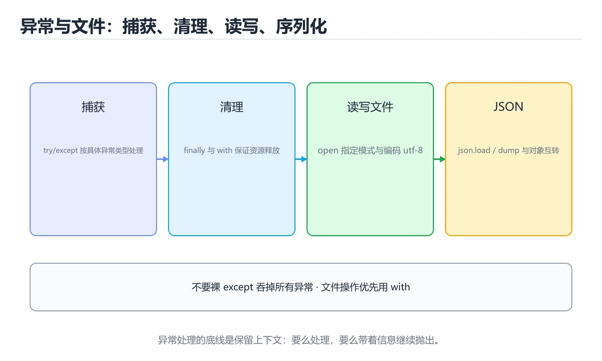

# 异常处理与文件操作

> 内容更新时间：2026-10-06 · 学习阶段：进阶 · 预计用时：60 分钟




## 本节知识框架

**课程定位**：所属分类 `python`（Python），课程主题 `异常处理与文件操作`，学习阶段 进阶，建议用时 55 分钟。

本课主线：try/except/else/finally、自定义异常、with 读写文件与 pathlib。

**学完本课应当能够**
- 说清 `ValueError` 与 `异常` 的含义与区别，并各举一个正例和一个反例。
- 用本课示例验证 `上下文管理器` 的行为，记录输入、输出与失败条件。
- 遇到「用裸 `except:`」这类问题时，能说出触发条件与修复顺序。

### 从概念到验证的学习链条

1. `ValueError`：先掌握 常见异常：`ValueError` 值不合法、`TypeError` 类型不匹配、`KeyError` 字典键不存在、`IndexError` 下标越界、`FileNotFoundError` 文件不存在，再用它解释 `异常` 为什么会出现。
2. `异常`：先掌握 程序执行中偏离正常控制流的错误事件，需要捕获、传播或转换，再用它解释 `上下文管理器` 为什么会出现。
3. `上下文管理器`：先掌握 with 语句在进入与退出时自动获取和释放资源，文件与锁都靠它保证释放，再用它解释 `异常链` 为什么会出现。
4. `异常链`：先掌握 用 raise ... from 保留原始异常，traceback 里才能看到真正的起因，再用它解释 本课示例的观察结果 为什么会出现。

**先修与衔接**：本课是「Python」分类的第 13 课。先修内容：《类与对象》。《类与对象》里的 `__init__`、`class` 是本课的前提。相关或后续课程：《模块、包与虚拟环境》、《异常处理与文件 IO》、《错误处理与调试》。

### 完成判据

- **定义关**：不看正文也能说明 `ValueError` 是 常见异常：`ValueError` 值不合法、`TypeError` 类型不匹配、`KeyError` 字典键不存在、`IndexError` 下标越界、`FileNotFoundError` 文件不存在，并指出一个反例。
- **机制关**：能按“输入 → 转换 → 输出 → 验证”复述 `异常处理与文件操作`，而不是只背结论。
- **示例关**：能运行或推演 `异常处理与文件操作` 的 `python` 示例，并说明一个真实出现的标识符或字面量。
- **证据关**：能指出 `异常处理与文件操作` 示例里的 调用了 `int()`，并说明它支持或反驳了本课的哪一条结论。
- **排错关**：能复现 用裸 `except:`，记录现象并按 指明具体异常类型 修复。
- **迁移关**：能把 `异常`、`try`、`except`、`with` 放进一个与 `异常处理与文件操作` 不同的项目场景，并保持输入与验证条件可追踪。
- **复盘关**：学完 `异常处理与文件操作` 后，用一句话写下仍然不确定的结论，并列出下一次验证需要的输入、环境和成功判据。

### 复习清单

- [ ] 能不看正文复述本课核心术语，并指出一个边界或反例。
- [ ] 能运行或推演本课示例，记录输入、输出与失败现象。
- [ ] 能完成一次自测，并把错题对照错误表定位原因。

## 核心概念定义

| 术语 | 操作性定义 | 常见边界与风险 |
| --- | --- | --- |
| ValueError | 常见异常：ValueError 值不合法、TypeError 类型不匹配、KeyError 字典键不存在、IndexError 下标越界、FileNotFoundError 文件不存在。 | 静态检查只在编译期成立，运行期输入仍需校验。 |
| 异常 | 程序执行中偏离正常控制流的错误事件，需要捕获、传播或转换。 | 易错：连 Ctrl+C 都吞掉，问题被掩盖；正确做法是指明具体异常类型。 |
| 上下文管理器 | with 语句在进入与退出时自动获取和释放资源，文件与锁都靠它保证释放。 | 共享状态与调度顺序会改变结论，单线程或串行测试通过不等于并发下成立。 |
| 异常链 | 用 raise ... from 保留原始异常，traceback 里才能看到真正的起因。 | 只在「用 raise ... from 保留原始异常，traceback 里才能看到真正的起因」这一前提下成立，换输入或换环境要重新验证。 |

## 原理与运行机制

### 机制总览

**教材衔接：版本与时效**

### 升级检查清单

- 先固定当前版本，跑通全部示例与测验，再升级工具链。
- 只改 异常 的版本变量，记录编译、测试与产物体积的变化。
- 先回归 异常 与 try 的默认行为和错误信息，再扩大测试范围。
- 升级完成后记录 异常 的新旧版本差异，并据此调整下次复核时间。

**失败路径（来自本课错误表）**
- 用裸 `except:` → 连 Ctrl+C 都吞掉，问题被掩盖 → 指明具体异常类型。
- 用异常代替判断 → 逻辑绕、性能差 → 能用 `if` 判断就判断。
- 忘写 `encoding` → 中文乱码 → 一律写 `utf-8`。
- 用 `"w"` 追加 → 原文件被清空 → 追加用 `"a"`。
### 机制拆解：每一步的输入、动作与输出

#### 1. `ValueError`
- 输入：`异常`；本步把 常见异常：`ValueError` 值不合法、`TypeError` 类型不匹配、`KeyError` 字典键不存在、`IndexError` 下标越界、`FileNotFoundError` 文件不存在 当作判断规则。
- 动作：围绕 `ValueError` 保留中间状态，并记录它与 `异常` 的对应关系。
- 输出：`异常`，它可以被下一段代码、测试或记录继续使用。
- `ValueError` 的失败条件：静态检查只在编译期成立，运行期输入仍需校验。

#### 2. `异常`
- 输入：`ValueError`；本步把 程序执行中偏离正常控制流的错误事件，需要捕获、传播或转换 当作判断规则。
- 动作：围绕 `异常` 保留中间状态，并记录它与 `上下文管理器` 的对应关系。
- 输出：`上下文管理器`，它可以被下一段代码、测试或记录继续使用。
- `异常` 的失败条件：当用裸 `except:`时，会出现连 Ctrl+C 都吞掉，问题被掩盖。

#### 3. `上下文管理器`
- 输入：`异常`；本步把 with 语句在进入与退出时自动获取和释放资源，文件与锁都靠它保证释放 当作判断规则。
- 动作：围绕 `上下文管理器` 保留中间状态，并记录它与 `异常链` 的对应关系。
- 输出：`异常链`，它可以被下一段代码、测试或记录继续使用。
- `上下文管理器` 的失败条件：共享状态与调度顺序会改变结论，单线程或串行测试通过不等于并发下成立。

#### 4. `异常链`
- 输入：`上下文管理器`；本步把 用 raise ... from 保留原始异常，traceback 里才能看到真正的起因 当作判断规则。
- 动作：围绕 `异常链` 保留中间状态，并记录它与 `int` 的对应关系。
- 输出：`int`，它可以被下一段代码、测试或记录继续使用。
- `异常链` 的失败条件：只在「用 raise ... from 保留原始异常，traceback 里才能看到真正的起因」这一前提下成立，换输入或换环境要重新验证。

### 示例中的可观察事实

1. 调用了 `int()`；它对应的课程主题是 `异常处理与文件操作`。
2. 调用了 `print()`；它对应的课程主题是 `异常处理与文件操作`。
3. 调用了 `except()`；它对应的课程主题是 `异常处理与文件操作`。
4. 出现字面量 `abc`；它对应的课程主题是 `异常处理与文件操作`。
5. 出现字面量 `格式错误：`；它对应的课程主题是 `异常处理与文件操作`。
6. 出现字面量 `类型或键错误`；它对应的课程主题是 `异常处理与文件操作`。
7. 出现字面量 `没有异常时执行`；它对应的课程主题是 `异常处理与文件操作`。
8. 出现字面量 `无论如何都会执行，用于释放资源`；它对应的课程主题是 `异常处理与文件操作`。

### 复现实验记录

- 环境：`异常处理与文件操作` 使用 `python` 示例，固定 `异常`、`try`、`except`、`with` 作为第一组条件。
- 首轮输入：先确认 调用了 `int()`，预测 `ValueError` 会怎样变化。
- 基线观察：记录命令、输入、输出和错误原文，不用截图代替可复制的文本。
- 单变量修改：只改变 `异常`，观察 `异常链` 是否仍满足定义。
- 失败注入：复现 用裸 `except:`，确认现象是 连 Ctrl+C 都吞掉，问题被掩盖。
- 记录结论：把“修改前、修改后、预期变化、实际变化”写成四列表，这样复盘 `异常处理与文件操作` 时才能区分概念错误与实现错误。

## 典型应用场景

- **用裸 `except:`**：典型现象是连 Ctrl+C 都吞掉，问题被掩盖；正确做法是指明具体异常类型。
- **用异常代替判断**：典型现象是逻辑绕、性能差；正确做法是能用 `if` 判断就判断。
- **忘写 `encoding`**：典型现象是中文乱码；正确做法是一律写 `utf-8`。
- **用 `"w"` 追加**：典型现象是原文件被清空；正确做法是追加用 `"a"`。

### 最小验证场景

- 准备：保留 `python` 示例的原始输入，先记录 `异常处理与文件操作` 的基线输出和完整运行命令。
- 观察：先核对 调用了 `int()`，再改变一个与 `ValueError` 相关的条件。
- 判定：新结果与 `异常处理与文件操作` 的基线不同不等于错误；只有当差异破坏了 `ValueError` 的定义或错误表中的约束，才判定为失败。

### 选择与边界

- 使用 `ValueError` 时，先满足它的定义：常见异常：`ValueError` 值不合法、`TypeError` 类型不匹配、`KeyError` 字典键不存在、`IndexError` 下标越界、`FileNotFoundError` 文件不存在；静态检查只在编译期成立，运行期输入仍需校验。
- 使用 `异常` 时，先满足它的定义：程序执行中偏离正常控制流的错误事件，需要捕获、传播或转换；易错：连 Ctrl+C 都吞掉，问题被掩盖；正确做法是指明具体异常类型。
- 使用 `上下文管理器` 时，先满足它的定义：with 语句在进入与退出时自动获取和释放资源，文件与锁都靠它保证释放；共享状态与调度顺序会改变结论，单线程或串行测试通过不等于并发下成立。
- 使用 `异常链` 时，先满足它的定义：用 raise ... from 保留原始异常，traceback 里才能看到真正的起因；只在「用 raise ... from 保留原始异常，traceback 里才能看到真正的起因」这一前提下成立，换输入或换环境要重新验证。

## 代码/协议/SQL 示例

### 最小可验证示例

```python
try:
    number = int("abc")
except ValueError as error:
    print("格式错误：", error)
except (TypeError, KeyError):
    print("类型或键错误")
else:
    print("没有异常时执行")
finally:
    print("无论如何都会执行，用于释放资源")
```

**教材衔接：捕获异常**

常见异常：`ValueError` 值不合法、`TypeError` 类型不匹配、`KeyError` 字典键不存在、`IndexError` 下标越界、`FileNotFoundError` 文件不存在。

原则：**只捕获你真正能处理的异常**，不要写 `except Exception: pass` 把问题吞掉。

**教材衔接：抛出异常**

```python
def set_age(age):
    if age < 0:
        raise ValueError(f"年龄不能为负：{age}")
    return age

class BalanceError(Exception):
    """自定义异常：余额不足。"""

try:
    raise BalanceError("余额不足")
except BalanceError as error:
    print(error)
```

**教材衔接：读写文件**

用 `with` 打开文件，离开代码块会自动关闭，即使发生异常也安全。

```python
# 写文件（覆盖）
with open("notes.txt", "w", encoding="utf-8") as file:
    file.write("第一行\n")

# 追加
with open("notes.txt", "a", encoding="utf-8") as file:
    file.write("第二行\n")

# 读文件
with open("notes.txt", "r", encoding="utf-8") as file:
    for line in file:
        print(line.rstrip())
```

常用模式：`r` 读、`w` 覆盖写、`a` 追加、`rb` 二进制读。**处理文本时始终显式指定 `encoding="utf-8"`**。

**教材衔接：路径与 JSON**

```python
from pathlib import Path
import json

path = Path("data") / "config.json"
path.parent.mkdir(parents=True, exist_ok=True)

path.write_text(json.dumps({"debug": True}, ensure_ascii=False), encoding="utf-8")
config = json.loads(path.read_text(encoding="utf-8"))
print(config["debug"])
```

**教材衔接：常见异常速查**

| 异常 | 典型触发 | 处理建议 |
| --- | --- | --- |
| `ValueError` | `int("abc")` | 校验输入或用 `try/except` 提示用户 |
| `TypeError` | `"a" + 1` | 修类型，而不是靠捕获掩盖 |
| `KeyError` | 访问不存在的字典键 | 用 `get()` / `setdefault()` |
| `IndexError` | 列表下标越界 | 先判断长度或捕获 |
| `AttributeError` | 对象没有该属性 | 检查拼写与空值 |
| `FileNotFoundError` | 打开不存在的文件 | 判断存在或用 `try/except` |
| `PermissionError` | 没有读写权限 | 检查路径与运行用户 |
| `ZeroDivisionError` | 除以 0 | 先判断分母 |
| `UnicodeDecodeError` | 以错误编码读文件 | 明确 `encoding="utf-8"` |
| `ModuleNotFoundError` | 模块未安装或路径不对 | 检查虚拟环境与依赖 |
| `RecursionError` | 递归过深 | 加终止条件，或改写成迭代 |

异常处理写法对照：

| 目的 | 推荐写法 |
| --- | --- |
| 兜住指定异常 | `except ValueError as exc:` |
| 多个异常同一处理 | `except (ValueError, TypeError):` |
| 无论是否异常都要清理 | `finally:` 或 `with` |
| 无异常时执行 | `try` 的 `else:` 分支 |
| 重新抛出并保留堆栈 | `raise`（不带参数）或 `raise NewError(...) from exc` |
| 记录完整堆栈 | `logging.exception("上下文")` |

```python
import logging

try:
    value = int(raw)
except ValueError as exc:
    logging.exception("解析失败：%s", raw)   # 保留堆栈，便于排查
    raise
else:
    print("解析成功", value)
finally:
    print("无论成功失败都会执行")
```

**教材衔接：文件操作速查**

| 模式 | 含义 | 文件不存在时 | 是否清空 |
| --- | --- | --- | --- |
| `r` | 只读 | 报错 | 否 |
| `w` | 只写 | 新建 | **是** |
| `a` | 追加 | 新建 | 否 |
| `x` | 独占创建 | 报错 | 新建 |
| `r+` | 读写 | 报错 | 否 |
| `rb` / `wb` | 二进制读写 | 同上 | 同上 |

```python
from pathlib import Path

path = Path("data") / "notes.txt"
path.parent.mkdir(parents=True, exist_ok=True)   # 确保目录存在
path.write_text("你好\n", encoding="utf-8")      # 一步写完
print(path.read_text(encoding="utf-8"))          # 一步读完

with path.open("a", encoding="utf-8") as file:   # 追加并自动关闭
    file.write("第二行\n")

for line in path.read_text(encoding="utf-8").splitlines():
    print(line.strip())
```

**教材衔接：零基础详解：异常处理与文件读写**

### 一句话说清它是什么

异常处理让程序**出错时不崩溃**，而是走另一条路；文件读写解决「数据要存下来」的问题。
两者经常一起用：读文件最容易出错，所以要用 `try` 包住。

### 用生活比喻理解

| 概念 | 比喻 | 说明 |
| --- | --- | --- |
| `try` | 试着做一件事 | 可能出错的代码 |
| `except` | 出问题时的备用方案 | 按异常类型分别处理 |
| `else` | 顺利做完才做的事 | 没有异常时执行 |
| `finally` | 无论怎样都要做的收尾 | 关闭资源、清理临时文件 |
| `with` | 自动收尾的托管 | 离开代码块自动关闭文件 |

### 异常处理的完整结构

```python
try:
    raw = input("请输入除数：")
    divisor = int(raw)
    result = 100 / divisor
except ValueError:
    print("这不是一个整数")
except ZeroDivisionError:
    print("除数不能为 0")
else:
    print("结果是", result)      # 没出错才执行
finally:
    print("计算结束")            # 无论如何都执行
```

### 常见异常类型速查

| 异常 | 什么时候出现 | 典型修法 |
| --- | --- | --- |
| `ValueError` | 类型对但值不对，如 `int("abc")` | 先校验输入 |
| `TypeError` | 类型不对，如 `"1" + 1` | 显式转换 |
| `KeyError` | 字典键不存在 | 用 `.get()` 或先判断 |
| `IndexError` | 下标越界 | 检查长度 |
| `FileNotFoundError` | 文件不存在 | 检查路径或先创建 |
| `PermissionError` | 没有权限 | 换路径或以合适身份运行 |
| `ZeroDivisionError` | 除以 0 | 先判断分母 |
| `AttributeError` | 对象没有这个属性 | 检查拼写与类型 |

### 文件读写的三种写法

```python
# 1. 一次读全部（小文件）
with open("data.txt", encoding="utf-8") as f:
    content = f.read()

# 2. 按行读（大文件，内存友好）
with open("data.txt", encoding="utf-8") as f:
    for line in f:
        print(line.rstrip())

# 3. 写入与追加
with open("out.txt", "w", encoding="utf-8") as f:
    f.write("第一行\n")

with open("out.txt", "a", encoding="utf-8") as f:
    f.write("追加一行\n")
```

| 模式 | 含义 | 注意 |
| --- | --- | --- |
| `"r"` | 只读（默认） | 文件不存在会报错 |
| `"w"` | 覆盖写 | **会清空原内容** |
| `"a"` | 追加 | 不会清空 |
| `"x"` | 只在文件不存在时创建 | 已存在则报错 |
| `"rb"` / `"wb"` | 二进制读写 | 图片、压缩包用 |

**`encoding="utf-8"` 一定要写**，否则在中文 Windows 上容易乱码。

### 读 JSON / CSV 的规范写法

```python
import csv
import json

with open("config.json", encoding="utf-8") as f:
    config = json.load(f)          # 读：文件 -> 字典

with open("out.json", "w", encoding="utf-8") as f:
    json.dump(config, f, ensure_ascii=False, indent=2)

with open("users.csv", encoding="utf-8", newline="") as f:
    for row in csv.DictReader(f):
        print(row["name"])
```

### 新手最容易踩的八个坑

| 坑 | 现象 | 正确做法 |
| --- | --- | --- |
| 用裸 `except:` | 连 Ctrl+C 都吞掉，问题被掩盖 | 指明具体异常类型 |
| 用异常代替判断 | 逻辑绕、性能差 | 能用 `if` 判断就判断 |
| 忘写 `encoding` | 中文乱码 | 一律写 `utf-8` |
| 用 `"w"` 追加 | 原文件被清空 | 追加用 `"a"` |
| 不用 `with` | 异常时文件句柄不释放 | 始终用 `with` |
| 路径写死绝对路径 | 换机器就跑不了 | 用 `pathlib.Path` 拼接 |
| 读大文件用 `read()` | 内存爆掉 | 逐行迭代 |
| 在 `finally` 里返回 | 覆盖掉真正的返回值 | 别在 `finally` 中返回 |

### 用 `pathlib` 写更现代的路径处理

```python
from pathlib import Path

base = Path("data")
base.mkdir(exist_ok=True)              # 目录存在也不报错
target = base / "notes.txt"            # 用 / 拼路径，跨平台

target.write_text("你好", encoding="utf-8")
print(target.read_text(encoding="utf-8"))
print(target.exists(), target.stat().st_size)
```

### 手把手练习：安全读取配置

```python
import json
from pathlib import Path

def load_config(path: str) -> dict:
    file = Path(path)
    if not file.exists():
        raise FileNotFoundError(f"配置文件不存在：{file}")

    try:
        data = json.loads(file.read_text(encoding="utf-8"))
    except json.JSONDecodeError as exc:
        raise ValueError(f"配置不是合法 JSON：{exc}") from exc

    if not isinstance(data, dict):
        raise ValueError("配置顶层必须是对象")
    return data

try:
    print(load_config("config.json"))
except (FileNotFoundError, ValueError) as err:
    print("加载失败：", err)
```

### 学完自测

- [ ] 能说出 `try / except / else / finally` 各自的执行时机。
- [ ] 知道为什么不该写裸 `except:`。
- [ ] 能说出 `"w"`、`"a"`、`"x"` 三种模式的区别。
- [ ] 会用 `with open(..., encoding="utf-8")` 读写文本。
- [ ] 能用 `pathlib` 拼接路径并判断文件是否存在。

**运行方式**：运行 `异常处理与文件操作` 的示例时，保存为 `.py` 文件后用 `python 文件名.py` 运行；第三方依赖先在虚拟环境里安装。

### 示例精读：先找证据，再改一个条件

1. 调用了 `int()`；它出现在 `异常处理与文件操作` 的示例中，阅读时先确认它前后各发生了什么。
2. 调用了 `print()`；它出现在 `异常处理与文件操作` 的示例中，阅读时先确认它前后各发生了什么。
3. 调用了 `except()`；它出现在 `异常处理与文件操作` 的示例中，阅读时先确认它前后各发生了什么。
4. 出现字面量 `abc`；它出现在 `异常处理与文件操作` 的示例中，阅读时先确认它前后各发生了什么。
5. 出现字面量 `格式错误：`；它出现在 `异常处理与文件操作` 的示例中，阅读时先确认它前后各发生了什么。
6. 出现字面量 `类型或键错误`；它出现在 `异常处理与文件操作` 的示例中，阅读时先确认它前后各发生了什么。
7. 出现字面量 `没有异常时执行`；它出现在 `异常处理与文件操作` 的示例中，阅读时先确认它前后各发生了什么。
8. 出现字面量 `无论如何都会执行，用于释放资源`；它出现在 `异常处理与文件操作` 的示例中，阅读时先确认它前后各发生了什么。
- 在 `异常处理与文件操作` 中与 `ValueError` 对照：示例必须能支持 常见异常：`ValueError` 值不合法、`TypeError` 类型不匹配、`KeyError` 字典键不存在、`IndexError` 下标越界、`FileNotFoundError` 文件不存在，否则说明这一段还缺少实现或验证步骤。
- 在 `异常处理与文件操作` 中与 `异常` 对照：示例必须能支持 程序执行中偏离正常控制流的错误事件，需要捕获、传播或转换，否则说明这一段还缺少实现或验证步骤。
- 在 `异常处理与文件操作` 中与 `上下文管理器` 对照：示例必须能支持 with 语句在进入与退出时自动获取和释放资源，文件与锁都靠它保证释放，否则说明这一段还缺少实现或验证步骤。
- 在 `异常处理与文件操作` 中与 `异常链` 对照：示例必须能支持 用 raise ... from 保留原始异常，traceback 里才能看到真正的起因，否则说明这一段还缺少实现或验证步骤。

## 时间/空间复杂度或性能分析

**性能关注点（异常处理与文件操作）**：解释执行与对象分配是主要成本：记录执行时间、内存峰值与 GC 次数，必要时对比其他实现。

**本课特有开销（异常处理与文件操作 · 异常）**：小文件看元数据开销，大文件看吞吐，两者要分别测量。

**测量方法**：以 `异常处理与文件操作` 的 `异常` 场景为对象，固定输入跑一遍记录基线，再把规模或并发度提高一个数量级复测；两次结果的差值与波动范围才是结论依据。

### 需要控制的变量与记录项

- `异常处理与文件操作` 的 `异常`：固定它的版本、输入范围和资源上限，分别记录速度、内存与失败率的变化。
- `异常处理与文件操作` 的 `try`：固定它的版本、输入范围和资源上限，分别记录速度、内存与失败率的变化。
- `异常处理与文件操作` 的 `except`：固定它的版本、输入范围和资源上限，分别记录速度、内存与失败率的变化。
- `异常处理与文件操作` 的 `with`：固定它的版本、输入范围和资源上限，分别记录速度、内存与失败率的变化。
- `异常处理与文件操作` 的 `文件`：固定它的版本、输入范围和资源上限，分别记录速度、内存与失败率的变化。
- `异常处理与文件操作` 中 `ValueError` 的边界：静态检查只在编译期成立，运行期输入仍需校验。达到边界时不要外推，必须重新测量。
- `异常处理与文件操作` 中 `异常` 的边界：易错：连 Ctrl+C 都吞掉，问题被掩盖；正确做法是指明具体异常类型。达到边界时不要外推，必须重新测量。
- `异常处理与文件操作` 中 `上下文管理器` 的边界：共享状态与调度顺序会改变结论，单线程或串行测试通过不等于并发下成立。达到边界时不要外推，必须重新测量。
- `异常处理与文件操作` 中 `异常链` 的边界：只在「用 raise ... from 保留原始异常，traceback 里才能看到真正的起因」这一前提下成立，换输入或换环境要重新验证。达到边界时不要外推，必须重新测量。
- `异常处理与文件操作` 的代码证据：先验证 调用了 `int()`，再记录该路径的输入规模与耗时；只看代码行数不能推出复杂度。

## 常见误区与易错点

| 容易写错的做法 | 实际现象 | 原因与正确做法 |
| --- | --- | --- |
| 用裸 `except:` | 连 Ctrl+C 都吞掉，问题被掩盖 | 指明具体异常类型 |
| 用异常代替判断 | 逻辑绕、性能差 | 能用 `if` 判断就判断 |
| 忘写 `encoding` | 中文乱码 | 一律写 `utf-8` |
| 用 `"w"` 追加 | 原文件被清空 | 追加用 `"a"` |
| 不用 `with` | 异常时文件句柄不释放 | 始终用 `with` |
| 路径写死绝对路径 | 换机器就跑不了 | 用 `pathlib.Path` 拼接 |
| 读大文件用 `read()` | 内存爆掉 | 逐行迭代 |
| 在 `finally` 里返回 | 覆盖掉真正的返回值 | 别在 `finally` 中返回 |
| `open(...)` 不写 `encoding` | 在 Windows 上按 GBK 解码，出现乱码或 `UnicodeDecodeError` | 显式写 `encoding="utf-8"` |
| 用 `open` 后忘记 `close` | 文件被占用、内容未落盘 | 用 `with` 语句自动关闭 |
| `except Exception: pass` | 真实 bug 被吞掉 | 至少记录日志；只捕获预期异常 |
| 把 `try` 包住一大段代码 | 定位困难，还可能误捕无关错误 | 只包住可能失败的最小片段 |
| `json.loads("")` | `JSONDecodeError` | 先判断空字符串，或用 `try/except` |
| 用 `+` 拼路径 | 跨平台分隔符出错 | 用 `pathlib.Path` 的 `/` 运算 |
| `readlines()` 读超大文件 | 内存爆掉 | 逐行迭代文件对象或分块读取 |
| 写入时忘了 `flush` / 关闭 | 进程被杀导致内容丢失 | 用 `with`，必要时 `file.flush()` + `os.fsync()` |
| 捕获异常后返回 `None` | 调用方继续用空值出错 | 明确抛出或返回统一的结果对象 |
| open(...) 不写 encoding | 在 Windows 上按 GBK 解码，出现乱码或 UnicodeDecodeError。 | 显式写 encoding="utf-8"。 |
| 用 open 后忘记 close | 文件被占用、内容未落盘。 | 用 with 语句自动关闭。 |
| except Exception: pass | 真实 bug 被吞掉。 | 至少记录日志；只捕获预期异常。 |

### 现场 1：用裸 `except:`

**症状**：连 Ctrl+C 都吞掉，问题被掩盖。

**根因与修复**：指明具体异常类型。

**自检**：在本课示例里复现「用裸 `except:`」，改成指明具体异常类型后重跑；如果症状消失且失败路径按预期变化，说明定位正确。

### 现场 2：用异常代替判断

**症状**：逻辑绕、性能差。

**根因与修复**：能用 `if` 判断就判断。

**自检**：在本课示例里复现「用异常代替判断」，改成能用 `if` 判断就判断后重跑；如果症状消失且失败路径按预期变化，说明定位正确。

### 现场 3：忘写 `encoding`

**症状**：中文乱码。

**根因与修复**：一律写 `utf-8`。

**自检**：在本课示例里复现「忘写 `encoding`」，改成一律写 `utf-8`后重跑；如果症状消失且失败路径按预期变化，说明定位正确。

### 现场 4：用 `"w"` 追加

**症状**：原文件被清空。

**根因与修复**：追加用 `"a"`。

**自检**：在本课示例里复现「用 `"w"` 追加」，改成追加用 `"a"`后重跑；如果症状消失且失败路径按预期变化，说明定位正确。

### 现场 5：不用 `with`

**症状**：异常时文件句柄不释放。

**根因与修复**：始终用 `with`。

**自检**：在本课示例里复现「不用 `with`」，改成始终用 `with`后重跑；如果症状消失且失败路径按预期变化，说明定位正确。

### 现场 6：路径写死绝对路径

**症状**：换机器就跑不了。

**根因与修复**：用 `pathlib.Path` 拼接。

**自检**：在本课示例里复现「路径写死绝对路径」，改成用 `pathlib.Path` 拼接后重跑；如果症状消失且失败路径按预期变化，说明定位正确。

### 现场 7：读大文件用 `read()`

**症状**：内存爆掉。

**根因与修复**：逐行迭代。

**自检**：在本课示例里复现「读大文件用 `read()`」，改成逐行迭代后重跑；如果症状消失且失败路径按预期变化，说明定位正确。

### 现场 8：在 `finally` 里返回

**症状**：覆盖掉真正的返回值。

**根因与修复**：别在 `finally` 中返回。

**自检**：在本课示例里复现「在 `finally` 里返回」，改成别在 `finally` 中返回后重跑；如果症状消失且失败路径按预期变化，说明定位正确。

### 现场 9：`open(...)` 不写 `encoding`

**症状**：在 Windows 上按 GBK 解码，出现乱码或 `UnicodeDecodeError`。

**根因与修复**：显式写 `encoding="utf-8"`。

**自检**：在本课示例里复现「`open(...)` 不写 `encoding`」，改成显式写 `encoding="utf-8"`后重跑；如果症状消失且失败路径按预期变化，说明定位正确。

## 与其他知识点的关系

- **先修**：`类与对象`。本课默认这些内容已经掌握。
- **相关或后续**：`模块、包与虚拟环境`、`异常处理与文件 IO`、`错误处理与调试`。本课术语会在这些课程里继续使用。
- **术语归属**：`ValueError`、`异常`、`上下文管理器` 的定义以本课「核心概念定义」为准，换到其他课程时先确认定义是否被改写。
- 同一分类的《Python 标准库实战工具箱》也涉及 `pathlib`；两课衔接时先确认这个术语的定义是否一致。
- 同一分类的《Python 上下文管理器与迭代器协议》也涉及 `with`；两课衔接时先确认这个术语的定义是否一致。

### 先修与后续术语接口

- `类与对象`：两者通过本分类的学习顺序衔接，阅读时重点比较各自的输入与失败条件。
- `模块、包与虚拟环境`：两者通过本分类的学习顺序衔接，阅读时重点比较各自的输入与失败条件。
- `异常处理与文件 IO`：共享术语 `异常`，共同关键词 `异常`、`try`。
- `错误处理与调试`：共享术语 `异常`，共同关键词 `异常`、`try`。

### 容易混淆的相邻概念

- `ValueError` 与 `异常`：前者强调 常见异常：`ValueError` 值不合法、`TypeError` 类型不匹配、`KeyError` 字典键不存在、`IndexError` 下标越界、`FileNotFoundError` 文件不存在；后者强调 程序执行中偏离正常控制流的错误事件，需要捕获、传播或转换。判断时分别检查两条定义的适用范围，不要只看名称相似就互换。
- `异常` 与 `上下文管理器`：前者强调 程序执行中偏离正常控制流的错误事件，需要捕获、传播或转换；后者强调 with 语句在进入与退出时自动获取和释放资源，文件与锁都靠它保证释放。判断时分别检查两条定义的适用范围，不要只看名称相似就互换。
- `上下文管理器` 与 `异常链`：前者强调 with 语句在进入与退出时自动获取和释放资源，文件与锁都靠它保证释放；后者强调 用 raise ... from 保留原始异常，traceback 里才能看到真正的起因。判断时分别检查两条定义的适用范围，不要只看名称相似就互换。

## 自测题与参考答案

> 先独立作答，再对照参考答案；答案都能在本课正文、术语表或错误表里找到依据。

### 自测 1（概念复述）

不看正文，写出 `ValueError` 的操作性定义，并说明它与 `异常` 的区别。

**参考答案**：常见异常：`ValueError` 值不合法、`TypeError` 类型不匹配、`KeyError` 字典键不存在、`IndexError` 下标越界、`FileNotFoundError` 文件不存在。

`异常` 的定位是：程序执行中偏离正常控制流的错误事件，需要捕获、传播或转换；两者的差别要从适用对象与失败模式上说明。

### 自测 2（排错）

本课错误表记录了「用裸 `except:`」这类做法。请写出它会出现的现象、根因，以及修复顺序。

**参考答案**：现象是连 Ctrl+C 都吞掉，问题被掩盖；正确做法是指明具体异常类型。修复时先复现现象并保留证据，再改动一处假设重跑，确认现象消失。

### 自测 3（动手验证）

运行本课的 `python` 示例，把其中的 `"abc"` 换成一个边界值后重新运行，记录输出与错误信息。

**参考答案**：正常输入下 `python` 示例应当复现正文给出的结果；把 `"abc"` 换成边界值后，如果结果改变或报错，先核对它是否满足 `异常处理与文件操作` 中`ValueError` 的适用范围，再检查错误表里是否有同类现象。

### 自测 4（代码阅读）

阅读本课开头的 `python` 示例，说明它体现了`ValueError` 的哪一条性质，并指出改动哪个输入会让这条性质不再成立。

**参考答案**：`ValueError` 的定义是 常见异常：`ValueError` 值不合法、`TypeError` 类型不匹配、`KeyError` 字典键不存在、`IndexError` 下标越界、`FileNotFoundError` 文件不存在，示例正是在实现这条定义。改动与 `ValueError` 有关的一个输入后，如果结果不再符合 `异常处理与文件操作` 的正文描述，就说明该性质只在当前前提成立。

### 自测 5（迁移）

把 `异常处理与文件操作` 的方法迁移到自己的项目：围绕 `ValueError` 写出一个与错误表同类的风险点，并说明触发条件和检验方式。

**参考答案**：例如「except Exception: pass」，它会导致真实 bug 被吞掉；检验方式是按至少记录日志；只捕获预期异常改一处再复现，确认现象消失且没有引入新的失败分支。

### 自测 6（对比）

用一个表格对比 `ValueError` 与 `异常`：各写一行适用场景、一行失败表现。

**参考答案**：`ValueError` 的定义是常见异常：`ValueError` 值不合法、`TypeError` 类型不匹配、`KeyError` 字典键不存在、`IndexError` 下标越界、`FileNotFoundError` 文件不存在；`异常` 的定义是程序执行中偏离正常控制流的错误事件，需要捕获、传播或转换。两者的失败表现分别对应本课错误表里与本术语相关的行。

### 自测 7（排错顺序）

面对「用裸 `except:`」引发的问题，请把“复现 连 Ctrl+C 都吞掉，问题被掩盖 → 保留证据 → 指明具体异常类型 → 回归验证”四步写成可执行的检查清单。

**参考答案**：第一步按连 Ctrl+C 都吞掉，问题被掩盖复现；第二步记录输入、版本与完整报错；第三步按指明具体异常类型只改一处；第四步重跑并确认失败路径也按预期变化。

### 自测 8（边界判断）

针对 `异常链`，分别写出“可以使用”的条件和“结论不再成立”的条件。

**参考答案**：只在「用 raise ... from 保留原始异常，traceback 里才能看到真正的起因」这一前提下成立，换输入或换环境要重新验证。 同时要把 `异常链` 的定义 用 raise ... from 保留原始异常，traceback 里才能看到真正的起因 与实际输入逐项对照。

### 自测 9（机制重建）

不看正文，按输入、转换、输出、验证四段重建 `ValueError` → `异常` → `上下文管理器` → `异常链` 的作用链。

**参考答案**：起点是 `ValueError` 的定义 常见异常：`ValueError` 值不合法、`TypeError` 类型不匹配、`KeyError` 字典键不存在、`IndexError` 下标越界、`FileNotFoundError` 文件不存在；中间每一步都保留可观察状态；终点由 `异常链` 检查，失败时回到错误表定位第一个偏离定义的步骤。

### 自测 10（综合排错）

在 `异常处理与文件操作` 中，现象是 真实 bug 被吞掉。请围绕 except Exception: pass 写出最小复现、关键证据、修复动作和回归验证，并说明为什么不能只凭一次运行下结论。

**参考答案**：先复现 except Exception: pass，记录输入与完整错误；再按 至少记录日志；只捕获预期异常 只改一处。回归时同时跑正常路径和边界路径，只有两次结果都可解释，才把修复视为完成。

### 自测 11（一分钟复述）

用每分钟约 200 字的速度复述 `异常处理与文件操作`：先给主问题，再按顺序说出 `ValueError`、`异常`、`上下文管理器`、`异常链`，最后给一个失败案例。

**自评标准**：主问题必须对应 try/except/else/finally、自定义异常、with 读写文件与 pathlib；每个术语都要能接上一句定义或边界；失败案例必须写成可观察现象，不能用“可能有风险”代替证据。

## 术语速查

| 术语 | 一句话说明 |
| --- | --- |
| `ValueError` | 常见异常：`ValueError` 值不合法、`TypeError` 类型不匹配、`KeyError` 字典键不存在、`IndexError` 下标越界、`FileNotFoundError` 文件不存在。 |
| `异常` | 程序执行中偏离正常控制流的错误事件，需要捕获、传播或转换。 |
| `上下文管理器` | with 语句在进入与退出时自动获取和释放资源，文件与锁都靠它保证释放。 |
| `异常链` | 用 raise ... from 保留原始异常，traceback 里才能看到真正的起因。 |

**术语关系**：`ValueError`（常见异常：`ValueError` 值不合法、`TypeError` 类型不匹配、`KeyError` 字典键不存在、`IndexError` 下标越界、`FileNotFoundError` 文件不存在） → `异常`（程序执行中偏离正常控制流的错误事件） → `上下文管理器`（with 语句在进入与退出时自动获取和释放资源） → `异常链`（用 raise ... from 保留原始异常）。

## 考点精讲

`异常处理与文件操作` 的题库有 6 道题，下面逐题给出题干、正确项与判断依据：先自己作答，再核对正确项，最后回到正文对应小节复核。

### 考点 1：第 1 题

- **题目**：围绕“异常处理与文件操作”中的 异常、try、except，下列哪两项是本课强调的实践判断？
- **正确项**：学习 异常 时要同时说明输入、输出和失败路径，不能只看正常流程；验证 try 时要固定版本并覆盖边界输入，结论才可复现
- **判断依据**：这道题落在术语 `异常` 上：程序执行中偏离正常控制流的错误事件，需要捕获、传播或转换。复习时把 `异常` 的定义、适用边界和一个反例一起说清楚，再回到「核心概念定义」核对原文。

### 考点 2：第 2 题

- **题目**：这段 `python` 代码对应 `异常处理与文件操作` 的 `ValueError`。课程要解决的是try/except/else/finally、自定义异常、with 读写文件与 pathlib。关于代码内容，哪一项说法准确？
- **正确项**：出现字面量 `无论如何都会执行，用于释放资源`
- **判断依据**：这道题落在术语 `ValueError` 上：常见异常：`ValueError` 值不合法、`TypeError` 类型不匹配、`KeyError` 字典键不存在、`IndexError` 下标越界、`FileNotFoundError` 文件不存在。复习时把 `ValueError` 的定义、适用边界和一个反例一起说清楚，再回到「核心概念定义」核对原文。

### 考点 3：第 3 题

- **题目**：下面哪种异常处理方式最不推荐？
- **正确项**：except Exception: pass 静默吞掉所有异常
- **判断依据**：这道题落在术语 `异常` 上：程序执行中偏离正常控制流的错误事件，需要捕获、传播或转换。若写成 except Exception: pass 就会真实 bug 被吞掉，应按 至少记录日志，只捕获预期异常 处理。

### 考点 4：第 4 题

- **题目**：读取一个不存在的文件，会抛出哪个异常？
- **正确项**：FileNotFoundError
- **判断依据**：这道题落在术语 `异常` 上：程序执行中偏离正常控制流的错误事件，需要捕获、传播或转换。复习时把 `异常` 的定义、适用边界和一个反例一起说清楚，再回到「核心概念定义」核对原文。

### 考点 5：第 5 题

- **题目**：自定义异常类通常继承自？
- **正确项**：Exception
- **判断依据**：这道题落在术语 `异常` 上：程序执行中偏离正常控制流的错误事件，需要捕获、传播或转换。复习时把 `异常` 的定义、适用边界和一个反例一起说清楚，再回到「核心概念定义」核对原文。

### 考点 6：第 6 题

- **题目**：填空：补齐下面这段术语说明中的空缺。课程 `try/except/else/finally、自定义异常、with 读写文件与 pathlib。`，这段说明是：`____`：用 raise ... from 保留原始异常，traceback 里才能看到真正的起因。空缺处应填哪个术语？
- **正确项**：异常链
- **判断依据**：这道题落在术语 `异常` 上：程序执行中偏离正常控制流的错误事件，需要捕获、传播或转换。复习时把 `异常` 的定义、适用边界和一个反例一起说清楚，再回到「核心概念定义」核对原文。

### 考点 7：`ValueError`

- **要点**：常见异常：`ValueError` 值不合法、`TypeError` 类型不匹配、`KeyError` 字典键不存在、`IndexError` 下标越界、`FileNotFoundError` 文件不存在。
- **ValueError 的边界**：静态检查只在编译期成立，运行期输入仍需校验。

### 考点 8：`异常`

- **要点**：程序执行中偏离正常控制流的错误事件，需要捕获、传播或转换。
- **异常 的边界**：易错：连 Ctrl+C 都吞掉，问题被掩盖；正确做法是指明具体异常类型。

### 考点 9：`上下文管理器`

- **要点**：with 语句在进入与退出时自动获取和释放资源，文件与锁都靠它保证释放。
- **上下文管理器 的边界**：共享状态与调度顺序会改变结论，单线程或串行测试通过不等于并发下成立。

### 考点 10：`异常链`

- **要点**：用 raise ... from 保留原始异常，traceback 里才能看到真正的起因。
- **异常链 的边界**：只在「用 raise ... from 保留原始异常，traceback 里才能看到真正的起因」这一前提下成立，换输入或换环境要重新验证。

### 考点 11：排错——用裸 `except:`

- **现象**：连 Ctrl+C 都吞掉，问题被掩盖。
- **处理**：指明具体异常类型。

### 考点 12：排错——用异常代替判断

- **现象**：逻辑绕、性能差。
- **处理**：能用 `if` 判断就判断。

### 考点 13：综合辨析——`ValueError` 与 `异常链`

- **辨析点**：`ValueError` 的定义是 常见异常：`ValueError` 值不合法、`TypeError` 类型不匹配、`KeyError` 字典键不存在、`IndexError` 下标越界、`FileNotFoundError` 文件不存在；`异常链` 的定义是 用 raise ... from 保留原始异常，traceback 里才能看到真正的起因。
- **答题要求**：面对 `异常处理与文件操作` 的题目，先判断描述的是 `ValueError` 还是 `异常链`，再归到对应定义，最后写出一个会让该定义失效的边界输入。

### 考点 14：排错评分点

- **现象分**：能写出 连 Ctrl+C 都吞掉，问题被掩盖，而不是只写“程序有错”。
- **证据分**：保留触发 用裸 `except:` 的输入、版本和错误原文。
- **修复分**：按 指明具体异常类型 只改一处，并同时回归正常路径与边界路径。

## 内容元数据

- 内容版本：v2.0
- 最后更新：2026-10-06
- 学习阶段：进阶
- 适用环境：Python 3.12+
；本课聚焦 异常。
- 内容来源：内置结构化课程与工程实践整理
- 相关主题：异常、try、except、with、文件、pathlib
- 质量版本：P0 测验标准 + P1 覆盖扩展 + P2 体验补全

## 参考资料与复核

- 最后复核：2026-10-04
- 下次复核：2026-11-10
- 复核范围：版本兼容、API 行为、安全建议与工程实践
- 来源性质：官方文档、标准或权威教材；本课核对关键词：异常、try、except、with、文件、pathlib。

| 参考资料 | 本课用途 |
| --- | --- |
| [Python 标准库](https://docs.python.org/3/library/) | 标准库 API 与模块 |
| [Python 性能分析](https://docs.python.org/3/library/profile.html) | cProfile 与性能分析 |
| [unittest 文档](https://docs.python.org/3/library/unittest.html) | 测试组织与断言 |

| [本课术语索引：异常处理与文件操作](#核心概念定义) | 按本课输入、术语边界和错误表现逐项核对 |
> 「异常处理与文件操作」的链接用于离线阅读后的延伸核对；App 不会自动联网。