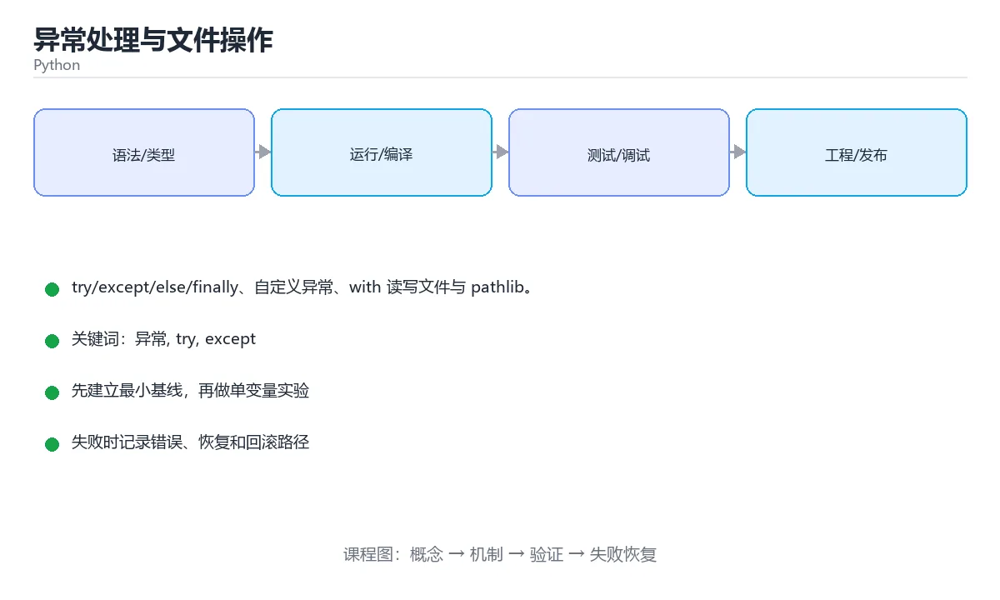

# 异常处理与文件操作



> 内容更新时间：2026-10-03 · 学习阶段：进阶 · 预计用时：15 分钟

## 学习目标

- 能用自己的话解释「异常处理与文件操作」解决了什么问题，而不是只背术语。
- 能说清 「异常」、「try」、「except」、「with」 之间的关系，并分别举出一个例子。
- 能把本课知识放回「Python」的知识体系，说明它和相邻主题的边界。
- 能完成本课练习，并用验收标准检查自己的结果。

> 一句话摘要：try/except/else/finally、自定义异常、with 读写文件与 pathlib。

## 前置知识

- 先完成上一课《类与对象》；如果已经掌握，可以直接用本课练习自测。
- 本课阶段：进阶。建议先掌握同一分类的基础课程，并能独立运行正文中的最小示例。
- 开始前先复习：异常、try、except。
- 如果某一步看不懂，先记录具体卡点，完成练习后再回头读一遍。


## 捕获异常

```python
try:
    number = int("abc")
except ValueError as error:
    print("格式错误：", error)
except (TypeError, KeyError):
    print("类型或键错误")
else:
    print("没有异常时执行")
finally:
    print("无论如何都会执行，用于释放资源")
```

常见异常：`ValueError` 值不合法、`TypeError` 类型不匹配、`KeyError` 字典键不存在、`IndexError` 下标越界、`FileNotFoundError` 文件不存在。

原则：**只捕获你真正能处理的异常**，不要写 `except Exception: pass` 把问题吞掉。

## 抛出异常

```python
def set_age(age):
    if age < 0:
        raise ValueError(f"年龄不能为负：{age}")
    return age

class BalanceError(Exception):
    """自定义异常：余额不足。"""

try:
    raise BalanceError("余额不足")
except BalanceError as error:
    print(error)
```

## 读写文件

用 `with` 打开文件，离开代码块会自动关闭，即使发生异常也安全。

```python
# 写文件（覆盖）
with open("notes.txt", "w", encoding="utf-8") as file:
    file.write("第一行\n")

# 追加
with open("notes.txt", "a", encoding="utf-8") as file:
    file.write("第二行\n")

# 读文件
with open("notes.txt", "r", encoding="utf-8") as file:
    for line in file:
        print(line.rstrip())
```

常用模式：`r` 读、`w` 覆盖写、`a` 追加、`rb` 二进制读。**处理文本时始终显式指定 `encoding="utf-8"`**。

## 路径与 JSON

```python
from pathlib import Path
import json

path = Path("data") / "config.json"
path.parent.mkdir(parents=True, exist_ok=True)

path.write_text(json.dumps({"debug": True}, ensure_ascii=False), encoding="utf-8")
config = json.loads(path.read_text(encoding="utf-8"))
print(config["debug"])
```

## 本课小结
异常用来处理「可预期的失败」，`with` 用来管理资源，`pathlib` 用来处理跨平台路径。


## 常见异常速查

| 异常 | 典型触发 | 处理建议 |
| --- | --- | --- |
| `ValueError` | `int("abc")` | 校验输入或用 `try/except` 提示用户 |
| `TypeError` | `"a" + 1` | 修类型，而不是靠捕获掩盖 |
| `KeyError` | 访问不存在的字典键 | 用 `get()` / `setdefault()` |
| `IndexError` | 列表下标越界 | 先判断长度或捕获 |
| `AttributeError` | 对象没有该属性 | 检查拼写与空值 |
| `FileNotFoundError` | 打开不存在的文件 | 判断存在或用 `try/except` |
| `PermissionError` | 没有读写权限 | 检查路径与运行用户 |
| `ZeroDivisionError` | 除以 0 | 先判断分母 |
| `UnicodeDecodeError` | 以错误编码读文件 | 明确 `encoding="utf-8"` |
| `ModuleNotFoundError` | 模块未安装或路径不对 | 检查虚拟环境与依赖 |
| `RecursionError` | 递归过深 | 加终止条件，或改写成迭代 |

异常处理写法对照：

| 目的 | 推荐写法 |
| --- | --- |
| 兜住指定异常 | `except ValueError as exc:` |
| 多个异常同一处理 | `except (ValueError, TypeError):` |
| 无论是否异常都要清理 | `finally:` 或 `with` |
| 无异常时执行 | `try` 的 `else:` 分支 |
| 重新抛出并保留堆栈 | `raise`（不带参数）或 `raise NewError(...) from exc` |
| 记录完整堆栈 | `logging.exception("上下文")` |

```python
import logging

try:
    value = int(raw)
except ValueError as exc:
    logging.exception("解析失败：%s", raw)   # 保留堆栈，便于排查
    raise
else:
    print("解析成功", value)
finally:
    print("无论成功失败都会执行")
```

## 文件操作速查

| 模式 | 含义 | 文件不存在时 | 是否清空 |
| --- | --- | --- | --- |
| `r` | 只读 | 报错 | 否 |
| `w` | 只写 | 新建 | **是** |
| `a` | 追加 | 新建 | 否 |
| `x` | 独占创建 | 报错 | 新建 |
| `r+` | 读写 | 报错 | 否 |
| `rb` / `wb` | 二进制读写 | 同上 | 同上 |

```python
from pathlib import Path

path = Path("data") / "notes.txt"
path.parent.mkdir(parents=True, exist_ok=True)   # 确保目录存在
path.write_text("你好\n", encoding="utf-8")      # 一步写完
print(path.read_text(encoding="utf-8"))          # 一步读完

with path.open("a", encoding="utf-8") as file:   # 追加并自动关闭
    file.write("第二行\n")

for line in path.read_text(encoding="utf-8").splitlines():
    print(line.strip())
```

## 常见错误对照表

| 容易写错的做法 | 实际现象 | 原因与正确做法 |
| --- | --- | --- |
| `open(...)` 不写 `encoding` | 在 Windows 上按 GBK 解码，出现乱码或 `UnicodeDecodeError` | 显式写 `encoding="utf-8"` |
| 用 `open` 后忘记 `close` | 文件被占用、内容未落盘 | 用 `with` 语句自动关闭 |
| `except Exception: pass` | 真实 bug 被吞掉 | 至少记录日志；只捕获预期异常 |
| 把 `try` 包住一大段代码 | 定位困难，还可能误捕无关错误 | 只包住可能失败的最小片段 |
| `json.loads("")` | `JSONDecodeError` | 先判断空字符串，或用 `try/except` |
| 用 `+` 拼路径 | 跨平台分隔符出错 | 用 `pathlib.Path` 的 `/` 运算 |
| `readlines()` 读超大文件 | 内存爆掉 | 逐行迭代文件对象或分块读取 |
| 写入时忘了 `flush` / 关闭 | 进程被杀导致内容丢失 | 用 `with`，必要时 `file.flush()` + `os.fsync()` |
| 捕获异常后返回 `None` | 调用方继续用空值出错 | 明确抛出或返回统一的结果对象 |

## 自测清单

- [ ] 能列出五个以上常见异常并知道触发条件。
- [ ] 处理文件一定写 `encoding="utf-8"` 并用 `with`。
- [ ] 知道 `finally` 一定执行，`else` 只在无异常时执行。
- [ ] 重新抛出异常时保留原始堆栈（`raise` 或 `from`）。
- [ ] 会用 `pathlib` 读写文本文件。


## 零基础详解：异常处理与文件读写

### 一句话说清它是什么

异常处理让程序**出错时不崩溃**，而是走另一条路；文件读写解决「数据要存下来」的问题。
两者经常一起用：读文件最容易出错，所以要用 `try` 包住。

### 用生活比喻理解

| 概念 | 比喻 | 说明 |
| --- | --- | --- |
| `try` | 试着做一件事 | 可能出错的代码 |
| `except` | 出问题时的备用方案 | 按异常类型分别处理 |
| `else` | 顺利做完才做的事 | 没有异常时执行 |
| `finally` | 无论怎样都要做的收尾 | 关闭资源、清理临时文件 |
| `with` | 自动收尾的托管 | 离开代码块自动关闭文件 |

### 异常处理的完整结构

```python
try:
    raw = input("请输入除数：")
    divisor = int(raw)
    result = 100 / divisor
except ValueError:
    print("这不是一个整数")
except ZeroDivisionError:
    print("除数不能为 0")
else:
    print("结果是", result)      # 没出错才执行
finally:
    print("计算结束")            # 无论如何都执行
```

### 常见异常类型速查

| 异常 | 什么时候出现 | 典型修法 |
| --- | --- | --- |
| `ValueError` | 类型对但值不对，如 `int("abc")` | 先校验输入 |
| `TypeError` | 类型不对，如 `"1" + 1` | 显式转换 |
| `KeyError` | 字典键不存在 | 用 `.get()` 或先判断 |
| `IndexError` | 下标越界 | 检查长度 |
| `FileNotFoundError` | 文件不存在 | 检查路径或先创建 |
| `PermissionError` | 没有权限 | 换路径或以合适身份运行 |
| `ZeroDivisionError` | 除以 0 | 先判断分母 |
| `AttributeError` | 对象没有这个属性 | 检查拼写与类型 |

### 文件读写的三种写法

```python
# 1. 一次读全部（小文件）
with open("data.txt", encoding="utf-8") as f:
    content = f.read()

# 2. 按行读（大文件，内存友好）
with open("data.txt", encoding="utf-8") as f:
    for line in f:
        print(line.rstrip())

# 3. 写入与追加
with open("out.txt", "w", encoding="utf-8") as f:
    f.write("第一行\n")

with open("out.txt", "a", encoding="utf-8") as f:
    f.write("追加一行\n")
```

| 模式 | 含义 | 注意 |
| --- | --- | --- |
| `"r"` | 只读（默认） | 文件不存在会报错 |
| `"w"` | 覆盖写 | **会清空原内容** |
| `"a"` | 追加 | 不会清空 |
| `"x"` | 只在文件不存在时创建 | 已存在则报错 |
| `"rb"` / `"wb"` | 二进制读写 | 图片、压缩包用 |

**`encoding="utf-8"` 一定要写**，否则在中文 Windows 上容易乱码。

### 读 JSON / CSV 的规范写法

```python
import csv
import json

with open("config.json", encoding="utf-8") as f:
    config = json.load(f)          # 读：文件 -> 字典

with open("out.json", "w", encoding="utf-8") as f:
    json.dump(config, f, ensure_ascii=False, indent=2)

with open("users.csv", encoding="utf-8", newline="") as f:
    for row in csv.DictReader(f):
        print(row["name"])
```

### 新手最容易踩的八个坑

| 坑 | 现象 | 正确做法 |
| --- | --- | --- |
| 用裸 `except:` | 连 Ctrl+C 都吞掉，问题被掩盖 | 指明具体异常类型 |
| 用异常代替判断 | 逻辑绕、性能差 | 能用 `if` 判断就判断 |
| 忘写 `encoding` | 中文乱码 | 一律写 `utf-8` |
| 用 `"w"` 追加 | 原文件被清空 | 追加用 `"a"` |
| 不用 `with` | 异常时文件句柄不释放 | 始终用 `with` |
| 路径写死绝对路径 | 换机器就跑不了 | 用 `pathlib.Path` 拼接 |
| 读大文件用 `read()` | 内存爆掉 | 逐行迭代 |
| 在 `finally` 里返回 | 覆盖掉真正的返回值 | 别在 `finally` 中返回 |

### 用 `pathlib` 写更现代的路径处理

```python
from pathlib import Path

base = Path("data")
base.mkdir(exist_ok=True)              # 目录存在也不报错
target = base / "notes.txt"            # 用 / 拼路径，跨平台

target.write_text("你好", encoding="utf-8")
print(target.read_text(encoding="utf-8"))
print(target.exists(), target.stat().st_size)
```

### 手把手练习：安全读取配置

```python
import json
from pathlib import Path


def load_config(path: str) -> dict:
    file = Path(path)
    if not file.exists():
        raise FileNotFoundError(f"配置文件不存在：{file}")

    try:
        data = json.loads(file.read_text(encoding="utf-8"))
    except json.JSONDecodeError as exc:
        raise ValueError(f"配置不是合法 JSON：{exc}") from exc

    if not isinstance(data, dict):
        raise ValueError("配置顶层必须是对象")
    return data


try:
    print(load_config("config.json"))
except (FileNotFoundError, ValueError) as err:
    print("加载失败：", err)
```

### 学完自测

- [ ] 能说出 `try / except / else / finally` 各自的执行时机。
- [ ] 知道为什么不该写裸 `except:`。
- [ ] 能说出 `"w"`、`"a"`、`"x"` 三种模式的区别。
- [ ] 会用 `with open(..., encoding="utf-8")` 读写文本。
- [ ] 能用 `pathlib` 拼接路径并判断文件是否存在。

## 动手练习


> 本课练习重点：围绕「异常、try、except」完成复述、实验和交付，每个结果都要能被别人检查。

先写可运行脚本，再用类型注解与测试保护核心函数，最后处理真实输入。

### 练习 1：建立心智模型（10 分钟）

合上教程，用 3～5 句话回答：

1. 「异常处理与文件操作」解决了什么问题？
2. 如果没有它，会出现什么具体后果？
3. 它和「try」是什么关系？

**验收标准**：至少出现一个本课关键词，并写出一个反例、边界条件或失效场景。

### 练习 2：做一次可控实验（20 分钟）

从正文中选一个最小示例，完成以下操作：

1. 先预测修改一个参数、输入或步骤后的结果。
2. 再实际执行或逐步推演，记录真实结果。
3. 如果结果与预测不同，写出差异原因。

**验收标准**：留下「原例 → 改动 → 预测 → 结果 → 原因」五步记录。

### 练习 3：交付一个小结果（30 分钟）

写一个 20 行以内的小脚本，把本课概念用于处理一份真实文本或列表数据。

任务要求：

- 结果必须能被别人检查，不能只写“我已经理解了”。
- 至少覆盖「异常」和「try」两个关键词。
- 写出 1 个仍然不确定的问题，以及下一步如何验证。

> 提示：时间有限时优先做练习 1 和练习 2；练习 3 可以拆成两次完成。


## 考点精讲：把测验题还原成判断过程

本课有 6 个判断点。先自己作答，再看「判断依据」；如果结论正确但理由不完整，回到正文对应章节补足概念。

### 考点 1：try/except/finally 中的 finally 什么时候执行？

- **正确判断**：无论是否发生异常都会执行
- **判断依据**：正确答案是「无论是否发生异常都会执行」，本课在「读写文件」中说明：用 with 打开文件，离开代码块会自动关闭，即使发生异常也安全。finally 用于释放资源，无论是否出现异常都会执行。本课还在「零基础详解：异常处理与文件读写」中说明：异常处理让程序出错时不崩溃，而是走另一条路。本课还在「零基础详解：异常处理与文件读写」中说明：能说出 try / except / else / finally 各自的执行时机。
- **迁移检查**：如果给某个错误选项去掉一个限定词，它会不会变成正确？说明理由。

### 考点 2：读写文件推荐的写法是？

- **正确判断**：使用 with open(...) as file
- **判断依据**：正确答案是「使用 with open(...) as file」，本课在「零基础详解：异常处理与文件读写」中说明：异常处理让程序出错时不崩溃，而是走另一条路。with 会在离开代码块时自动关闭文件，异常情况下也不会泄漏资源。本课还在「零基础详解：异常处理与文件读写」中说明：会用 with open(..., encoding="utf-8") 读写文本。本课还在「捕获异常」中说明：原则：只捕获你真正能处理的异常，不要写 except Exception: pass 把问题吞掉。
- **迁移检查**：遮住选项，只根据定义复述一次答案，再回来看哪个选项与复述一致。

### 考点 3：下面哪种异常处理方式最不推荐？

- **正确判断**：except Exception: pass 静默吞掉所有异常
- **判断依据**：正确答案是「except Exception: pass 静默吞掉所有异常」，本课在「捕获异常」中说明：原则：只捕获你真正能处理的异常，不要写 except Exception: pass 把问题吞掉。静默吞异常会掩盖真实缺陷，应当只捕获能处理的异常并保留上下文。本课还在「本课小结」中说明：异常用来处理「可预期的失败」，with 用来管理资源，pathlib 用来处理跨平台路径。本课还在「零基础详解：异常处理与文件读写」中说明：能说出 try / except / else / finally 各自的执行时机。
- **迁移检查**：遮住选项，只根据定义复述一次答案，再回来看哪个选项与复述一致。

### 考点 4：读取一个不存在的文件，会抛出哪个异常？

- **正确判断**：FileNotFoundError
- **判断依据**：FileNotFoundError 是 OSError 的子类，捕获时也可以按 OSError 处理。其他选项：IndexError 是下标越界、KeyError 是字典缺键、TypeError 是类型不匹配。针对「读取一个不存在的文件，会抛出哪个异常，」，本课在「捕获异常」中说明：常见异常：ValueError 值不合法、TypeError 类型不匹配、KeyError 字典键不存在、IndexError 下标越界、FileNotFoundError 文件不存在。
- **迁移检查**：把题干里的一个条件换成边界值，原来的结论还成立吗？写出判断过程。

### 考点 5：自定义异常类通常继承自？

- **正确判断**：Exception
- **判断依据**：继承 Exception 可被常规 except 捕获，也便于按业务分层定义异常体系。其他选项：BaseException 是包含 KeyboardInterrupt 在内的顶层基类。针对「自定义异常类通常继承自，」，本课在「零基础详解：异常处理与文件读写」中说明：能用 pathlib 拼接路径并判断文件是否存在。本课还在「零基础详解：异常处理与文件读写」中说明：两者经常一起用：读文件最容易出错，所以要用 try 包住。
- **迁移检查**：遮住选项，只根据定义复述一次答案，再回来看哪个选项与复述一致。

### 考点 6：补全代码：「异常处理与文件操作」示例中，下面这行代码缺少哪个关键字或函数名？请填入 ____。 `raise ____(f"配置文件不存在：{file}")`

- **正确判断**：FileNotFoundError / filenotfounderror
- **判断依据**：正确答案是「FileNotFoundError」，本课在「捕获异常」中说明：常见异常：ValueError 值不合法、TypeError 类型不匹配、KeyError 字典键不存在、IndexError 下标越界、FileNotFoundError 文件不存在。本课还在「本课小结」中说明：异常用来处理「可预期的失败」，with 用来管理资源，pathlib 用来处理跨平台路径。本课还在「零基础详解：异常处理与文件读写」中说明：能用 pathlib 拼接路径并判断文件是否存在。
- **迁移检查**：把答案换成另一种等价写法，是否仍然正确？说明依据。

## 本课复习清单

离开本课前，逐项确认：

- [ ] 不看解析，能说出「try/except/finally 中的 finally 什么时候执行？」的判断依据。
- [ ] 不看解析，能说出「读写文件推荐的写法是？」的判断依据。
- [ ] 不看解析，能说出「下面哪种异常处理方式最不推荐？」的判断依据。
- [ ] 不看解析，能说出「读取一个不存在的文件，会抛出哪个异常？」的判断依据。
- [ ] 不看解析，能说出「自定义异常类通常继承自？」的判断依据。
- [ ] 不看解析，能说出「补全代码：「异常处理与文件操作」示例中，下面这行代码缺少哪个关键字或函数名？请填…」的判断依据。
- [ ] 至少运行一次本课示例，记录输入、输出和一个边界情况。
- [ ] 把本课最容易混淆的两个概念写成一句话对照。

| 复盘项 | 记录 |
| --- | --- |
| 已经能独立解释的考点 |  |
| 仍然说不清的概念 |  |
| 下一步验证动作 |  |

## 术语速查

把本课反复出现的术语集中放在一起。复习时先遮住右列，尝试用自己的话解释，再回到正文核对。

| 术语 | 本课语境 |
| --- | --- |
| `ValueError` | 常见异常：`ValueError` 值不合法、`TypeError` 类型不匹配、`KeyError` 字典键不存在、`IndexError` 下标越界、`FileNotFoundError` 文件不存在。 |
| `TypeError` | 常见异常：`ValueError` 值不合法、`TypeError` 类型不匹配、`KeyError` 字典键不存在、`IndexError` 下标越界、`FileNotFoundError` 文件不存在。 |
| `KeyError` | 常见异常：`ValueError` 值不合法、`TypeError` 类型不匹配、`KeyError` 字典键不存在、`IndexError` 下标越界、`FileNotFoundError` 文件不存在。 |
| `IndexError` | 常见异常：`ValueError` 值不合法、`TypeError` 类型不匹配、`KeyError` 字典键不存在、`IndexError` 下标越界、`FileNotFoundError` 文件不存在。 |
| `FileNotFoundError` | 常见异常：`ValueError` 值不合法、`TypeError` 类型不匹配、`KeyError` 字典键不存在、`IndexError` 下标越界、`FileNotFoundError` 文件不存在。 |
| `except Exception: pass` | 原则：**只捕获你真正能处理的异常**，不要写 `except Exception: pass` 把问题吞掉。 |
| `with` | 用 `with` 打开文件，离开代码块会自动关闭，即使发生异常也安全。 |
| `读、` | 常用模式：`r` 读、`w` 覆盖写、`a` 追加、`rb` 二进制读。**处理文本时始终显式指定 `encoding="utf-8"`**。 |
| `覆盖写、` | 常用模式：`r` 读、`w` 覆盖写、`a` 追加、`rb` 二进制读。**处理文本时始终显式指定 `encoding="utf-8"`**。 |
| `追加、` | 常用模式：`r` 读、`w` 覆盖写、`a` 追加、`rb` 二进制读。**处理文本时始终显式指定 `encoding="utf-8"`**。 |
| `二进制读。**处理文本时始终显式指定` | 常用模式：`r` 读、`w` 覆盖写、`a` 追加、`rb` 二进制读。**处理文本时始终显式指定 `encoding="utf-8"`**。 |
| `pathlib` | 异常用来处理「可预期的失败」，`with` 用来管理资源，`pathlib` 用来处理跨平台路径。 |

## 面试问答与自测

下面把本课考点换成面试追问。先口述自己的答案，
再对照参考回答检查是否遗漏了前提、边界或失败路径。

### 追问 1：try/except/finally 中的 finally 什么时候执行？

**参考回答**：正确答案是「无论是否发生异常都会执行」，本课在「读写文件」中说明：用 with 打开文件，离开代码块会自动关闭，即使发生异常也安全。finally 用于释放资源，无论是否出现异常都会执行。本课还在「零基础详解·异常处理与文件读写」中说明：异常处理让程序出错时不崩溃，而是走另一条路。本课还在「零基础详解·异常处理与文件读写」中说明：能说出 try / except / else / finally 各自的执行时机。

### 追问 2：读写文件推荐的写法是？

**参考回答**：正确答案是「使用 with open(...) as file」，本课在「零基础详解·异常处理与文件读写」中说明：异常处理让程序出错时不崩溃，而是走另一条路。with 会在离开代码块时自动关闭文件，异常情况下也不会泄漏资源。本课还在「零基础详解·异常处理与文件读写」中说明：会用 with open(..., encoding="utf-8") 读写文本。本课还在「捕获异常」中说明：原则：只捕获你真正能处理的异常，不要写 except Exception: pass 把问题吞掉。

### 追问 3：下面哪种异常处理方式最不推荐？

**参考回答**：正确答案是「except Exception: pass 静默吞掉所有异常」，本课在「捕获异常」中说明：原则：只捕获你真正能处理的异常，不要写 except Exception: pass 把问题吞掉。静默吞异常会掩盖真实缺陷，应当只捕获能处理的异常并保留上下文。本课还在「本课小结」中说明：异常用来处理「可预期的失败」，with 用来管理资源，pathlib 用来处理跨平台路径。本课还在「零基础详解·异常处理与文件读写」中说明：能说出 try / except / else / finally 各自的执行时机。

### 追问 4：读取一个不存在的文件，会抛出哪个异常？

**参考回答**：FileNotFoundError 是 OSError 的子类，捕获时也可以按 OSError 处理。其他选项：IndexError 是下标越界、KeyError 是字典缺键、TypeError 是类型不匹配。针对「读取一个不存在的文件，会抛出哪个异常，」，本课在「捕获异常」中说明：常见异常：ValueError 值不合法、TypeError 类型不匹配、KeyError 字典键不存在、IndexError 下标越界、FileNotFoundError 文件不存在。

### 追问 5：自定义异常类通常继承自？

**参考回答**：继承 Exception 可被常规 except 捕获，也便于按业务分层定义异常体系。其他选项：BaseException 是包含 KeyboardInterrupt 在内的顶层基类。针对「自定义异常类通常继承自，」，本课在「零基础详解·异常处理与文件读写」中说明：能用 pathlib 拼接路径并判断文件是否存在。本课还在「零基础详解·异常处理与文件读写」中说明：两者经常一起用：读文件最容易出错，所以要用 try 包住。

## English Overview

**Title:** Exceptions & Files

**Summary:** Exception handling, custom errors, file IO and pathlib.

**Category:** Python  
**Level:** 进阶  
**Key terms:** 异常, try, except, with, 文件, pathlib

> The full tutorial is written in Chinese. This bilingual overview helps English readers identify the topic, scope and key terms before studying the detailed examples.

## 内容元数据

- 内容版本：v2.0
- 最后更新：2026-10-03
- 学习阶段：进阶
- 适用环境：Python 3.12+
- 内容来源：内置结构化课程与工程实践整理
- 相关主题：异常、try、except、with、文件、pathlib
- 质量版本：P0 测验标准 + P1 覆盖扩展 + P2 体验补全


## 参考资料与复核

- 最后复核：2026-10-04
- 下次复核：2027-04-04
- 复核范围：版本兼容、API 行为、安全建议与工程实践
- 来源性质：官方文档与标准；本课正文为离线教学重组，不复制原文

| 参考资料 | 本课用途 |
| --- | --- |
| [Python 官方文档](https://docs.python.org/3/) | 语言、标准库与版本行为 |
| [Python Packaging](https://packaging.python.org/) | 包管理与发布 |

> 本课主题：try/except/else/finally、自定义异常、with 读写文件与 pathlib。

> App 完全离线展示文字链接，不会自动联网；需要延伸阅读时可复制链接到浏览器。
