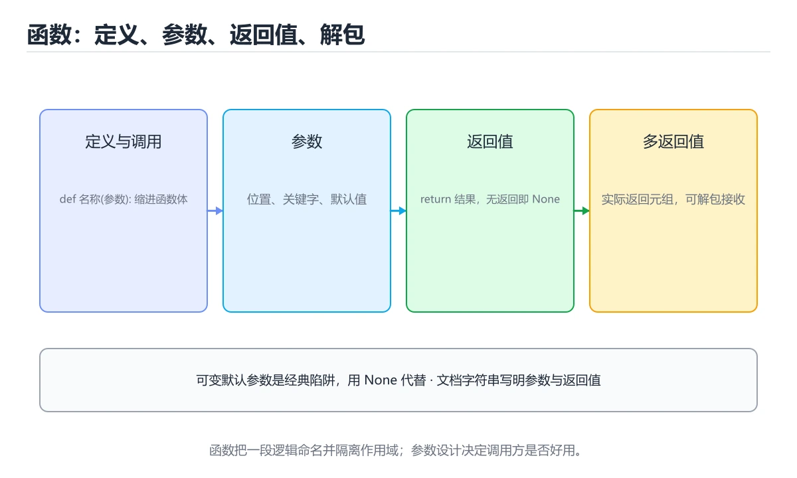
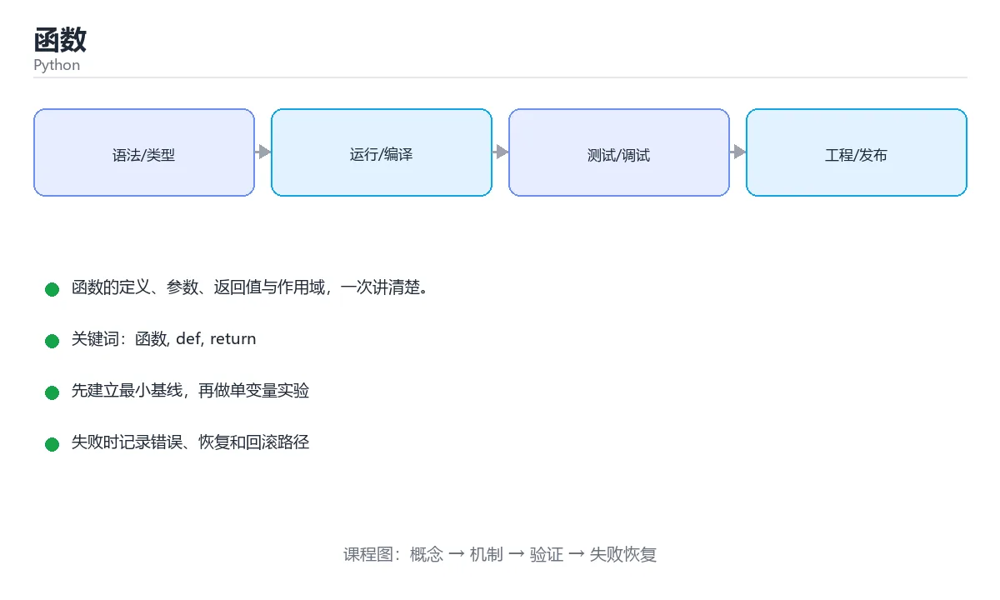

# 函数





> 内容更新时间：2026-10-03 · 学习阶段：基础 · 预计用时：15 分钟

## 学习目标

- 能用自己的话解释「函数」解决了什么问题，而不是只背术语。
- 能说清 「函数」、「def」、「return」、「参数」 之间的关系，并分别举出一个例子。
- 能把本课知识放回「Python」的知识体系，说明它和相邻主题的边界。
- 能完成本课练习，并用验收标准检查自己的结果。

> 一句话摘要：函数的定义、参数、返回值与作用域，一次讲清楚。

## 前置知识

- 先完成上一课《变量与数据类型》；如果已经掌握，可以直接用本课练习自测。
- 本课阶段：基础。建议会读写简单代码或命令，并理解变量、输入输出等基本概念。
- 开始前先复习：函数、def、return。
- 如果某一步看不懂，先记录具体卡点，完成练习后再回头读一遍。


## 为什么需要函数

函数把一段可复用的逻辑封装起来，起一个名字。好处是：**减少重复、便于测试、方便修改**。

## 定义与调用

```python
def greet(name):
    """返回一句问候语。"""
    return f"你好，{name}！"

message = greet("小明")
print(message)
```

要点：

- `def` 定义函数，函数体必须缩进。
- `return` 把结果交回调用方；没有 `return` 时函数返回 `None`。
- 三引号字符串是文档字符串（docstring），可以用 `help(greet)` 查看。

## 参数：位置、关键字、默认值

```python
def area(width, height=1):
    return width * height

print(area(3, 4))              # 位置参数
print(area(width=3, height=4)) # 关键字参数
print(area(5))                 # 使用默认值 height=1
```

默认参数只在定义时求值一次，因此**不要用可变对象当默认值**：

```python
def bad(items=[]):     # 错误示范
    items.append(1)
    return items

def good(items=None):  # 正确写法
    if items is None:
        items = []
    items.append(1)
    return items
```

## 返回值与多返回值

```python
def divide(a, b):
    if b == 0:
        return None, "除数不能为 0"
    return a / b, None

result, error = divide(10, 2)
```

Python 用元组实现「多返回值」，本质仍是一个返回值。

## 作用域

函数内部赋值会创建局部变量，不会影响外部同名变量。

```python
count = 1

def increase():
    count = 2      # 这是新的局部变量

increase()
print(count)       # 仍然输出 1
```

确实需要修改外部变量时用 `global`，但更好的做法是通过参数传入、用返回值传出。

## 闭包与装饰器实战

**闭包：函数记住了定义时的环境**

| 用途 | 说明 |
| --- | --- |
| 计数器/累加器 | 用外层变量保存状态，返回内层函数操作它 |
| 工厂函数 | 根据参数生成不同行为的函数（如 `make_multiplier(n)`） |
| 防抖与限流 | 记录上次调用时间，决定是否真正执行 |
| 缓存 | 用字典保存参数到结果的映射（`functools.lru_cache` 即此思路） |

注意闭包的延迟绑定陷阱：在循环里创建闭包并在之后调用，取到的会是最后一次的值；需要立即绑定就用默认参数固定（`lambda x=i: x`）。

**装饰器：在不修改原函数的前提下增强行为**

常见用途：计时、日志、重试、鉴权、缓存、参数校验。要点：

1. 装饰器本质是「接收函数、返回函数」的高阶函数。
2. 用 `functools.wraps` 保留原函数的名称与文档，否则调试与文档工具会失灵。
3. 带参数的装饰器要多包一层（三层嵌套）。
4. 标准库现成方案优先：`functools.lru_cache`（缓存）、`functools.cached_property`、`contextlib.contextmanager`。

选择建议：**能用标准库装饰器就不自己写**；需要横切关注点（日志、计时、重试）时才自定义，且用 `@wraps` 与类型注解保持可维护性。

## 本课小结
定义函数时先想清楚三件事：**需要什么输入、返回什么结果、出现异常怎么办**。


## 参数写法速查

| 写法 | 含义 | 调用示例 | 注意点 |
| --- | --- | --- | --- |
| `def f(a, b):` | 必填位置参数 | `f(1, 2)` | 顺序敏感 |
| `def f(a, b=1):` | 默认参数 | `f(1)`、`f(1, 5)` | 默认值只在定义时求值一次 |
| `def f(*args):` | 收集位置参数为元组 | `f(1, 2, 3)` | 只能有一个，放在普通参数之后 |
| `def f(**kwargs):` | 收集关键字参数为字典 | `f(x=1)` | 只能有一个，放在最后 |
| `def f(a, *, b):` | `b` 只能是关键字参数 | `f(1, b=2)` | `*` 之后强制关键字传参 |
| `def f(a, /, b):` | `a` 只能是位置参数 | `f(1, 2)` | `/` 之前禁止写成关键字 |
| `f(*nums)` | 解包序列成位置参数 | `f(*[1, 2])` | 与 `def f(*args)` 配对使用 |
| `f(**cfg)` | 解包字典成关键字参数 | `f(**{"x": 1})` | 键必须是字符串 |

参数顺序的固定规则：位置参数 → 默认参数 → `*args` → 仅关键字参数 → `**kwargs`。

## 常见错误对照表

| 容易写错的写法 | 实际现象 | 原因与正确做法 |
| --- | --- | --- |
| `def add(x, items=[]):` | 多次调用共享同一个列表，数据越攒越多 | 可变对象默认值在定义时创建一次；改成 `items=None` 再在函数内 `items = items or []` |
| 函数里写 `count = 1` 想修改全局 | 只创建了局部变量，外部没变 | 显式声明 `global count`；更好的做法是把值 `return` 出去 |
| 返回列表后调用方直接 `append` | 调用方的改动影响所有持有者 | 需要隔离时返回 `list(result)` 或 `copy.deepcopy()` |
| `def f(a, b=1, c):` | `SyntaxError: non-default argument follows default argument` | 有默认值的参数后面不能再出现无默认值的位置参数 |
| 在函数内修改传入的 `tuple` | `TypeError: 'tuple' object does not support item assignment` | 元组不可变，需要新对象：`t = t[:1] + (9,) + t[2:]` |
| 用 `return` 返回多个值却忘了打包顺序 | 调用方解包错位 | `return a, b` 实际是元组，解包时数量必须一致 |
| 函数名与变量名相同 | 后续调用报 `TypeError: 'int' object is not callable` | 函数名与变量名分开命名 |
| 递归函数忘记写终止条件 | `RecursionError: maximum recursion depth exceeded` | 先写基准情形，并确认每次递归规模在缩小 |

## 速查：返回值与作用域

```python
def stats(nums):
    """返回最小值、最大值、平均值，一次打包返回。"""
    if not nums:
        return None, None, None      # 早返回比层层缩进更清晰
    return min(nums), max(nums), sum(nums) / len(nums)

low, high, avg = stats([3, 5, 9])

def add_item(item, items=None):
    items = items if items is not None else []   # 避免可变默认值的经典写法
    items.append(item)
    return items
```

| 概念 | 说明 |
| --- | --- |
| 局部变量 | 函数内赋值即创建，函数结束销毁 |
| 闭包 | 内层函数引用了外层变量，外层返回后仍可访问 |
| `nonlocal` | 在内层函数中修改外层（非全局）变量 |
| `global` | 直接修改模块级变量，可读性差，能不用就不用 |
| 文档字符串 | 函数第一行的字符串，`help(f)` 与 `f.__doc__` 可查看 |

## 自测清单

- [ ] 能写出「位置 → 默认 → `*args` → 仅关键字 → `**kwargs`」的顺序。
- [ ] 记得默认参数不要用列表、字典这类可变对象。
- [ ] 知道函数没有 `return` 时返回 `None`。
- [ ] 会用 `*` 强制某些参数必须以关键字传入，提升调用可读性。
- [ ] 递归函数里先写基准情形，并验证规模确实在缩小。


## 零基础详解：函数是「给一段代码起名字」

### 一句话说清它是什么

函数就是把一段会重复用到的代码打包起来、起个名字，之后**用名字加括号**就能执行。
它的三个价值：复用、拆分、命名（让读者一眼知道这段在干什么）。

### 用生活比喻理解

| 概念 | 比喻 | 代码 |
| --- | --- | --- |
| 定义函数 | 写一张操作说明书 | `def greet():` |
| 调用函数 | 照着说明做一次 | `greet()` |
| 参数 | 说明书里留的空格 | `def greet(name):` |
| 返回值 | 做完之后递给你的成品 | `return f"你好，{name}"` |
| 默认参数 | 没人指定时用的默认值 | `def greet(name="朋友")` |

### 从「不用函数」到「用函数」

```python
# 不用函数：重复、容易改漏
print("你好，小明，欢迎回来")
print("你好，小红，欢迎回来")

# 用函数：改一次就够了
def greet(name):
    return f"你好，{name}，欢迎回来"

print(greet("小明"))
print(greet("小红"))
```

### 四个必须分清的概念

| 概念 | 含义 | 例子 |
| --- | --- | --- |
| 形参 | 定义时写的占位名 | `def add(a, b)` 里的 `a`、`b` |
| 实参 | 调用时真正传进去的值 | `add(1, 2)` 里的 `1`、`2` |
| 返回值 | 函数交给调用者的结果 | `return a + b` |
| 副作用 | 除了返回值之外做的事 | 打印、写文件、改全局变量 |

**`print` 和 `return` 的区别**是新手第一大坑：
`print` 只是给人看，`return` 才是把结果交出去给程序继续用。

```python
def bad_add(a, b):
    print(a + b)      # 只显示，调用者拿不到值

def good_add(a, b):
    return a + b      # 调用者可以继续计算

print(good_add(1, 2) * 10)   # 30
```

### 参数写法的五种花样

```python
def f(a, b=10, *args, **kwargs):
    ...

f(1)                      # a=1, b=10
f(1, 2)                   # a=1, b=2
f(1, 2, 3, 4)             # 多余的按位置进入 args=(3, 4)
f(1, 2, x=1, y=2)         # 关键字参数进入 kwargs={"x": 1, "y": 2}
f(b=5, a=1)               # 关键字传参可以不按顺序
```

| 写法 | 名称 | 作用 |
| --- | --- | --- |
| `b=10` | 默认参数 | 不传时用默认值 |
| `*args` | 可变位置参数 | 接收任意多个位置参数，得到元组 |
| `**kwargs` | 可变关键字参数 | 接收任意多个关键字参数，得到字典 |
| `*,` | 关键字限定 | 后面的参数必须用关键字传 |
| `a: int` | 类型注解 | 只是提示，运行时不强制 |

### 作用域：函数里的变量走不出去

```python
count = 0

def increase():
    global count      # 声明要修改外层的 count
    count += 1

increase()
print(count)          # 1
```

| 规则 | 说明 |
| --- | --- |
| 函数内新赋值的名字 | 默认是局部的，函数结束就消失 |
| 读取外层变量 | 可以直接读 |
| 修改外层变量 | 需要 `global`（模块级）或 `nonlocal`（嵌套函数） |
| 最佳实践 | 尽量用参数传入、用返回值传出，少用全局变量 |

### 新手最容易踩的六个坑

| 坑 | 现象 | 正确做法 |
| --- | --- | --- |
| 可变对象作默认值 | 多次调用共享同一个列表 | `def f(items=None):` 内部再 `items = items or []` |
| 忘了 `return` | 拿到的是 `None` | 检查是否有返回值 |
| `return` 写错缩进 | 循环第一轮就返回 | 确认它在循环外 |
| 函数名与内置同名 | 覆盖 `list`、`sum` 等 | 换个名字，如 `calc_sum` |
| 改全局变量 | 到处互相影响，难调试 | 改为传参 + 返回 |
| 参数顺序混乱 | 传错值还很难发现 | 超过两个参数时优先用关键字传参 |

### 手把手练习：写一个成绩统计函数

```python
def summarize(scores):
    """返回总分、平均分与等级。"""
    if not scores:
        return 0, 0.0, "无数据"

    total = sum(scores)
    average = total / len(scores)
    if average >= 90:
        level = "优秀"
    elif average >= 60:
        level = "及格"
    else:
        level = "不及格"
    return total, round(average, 1), level

total, avg, level = summarize([88, 92, 79])
print(f"总分 {total}，平均 {avg}，等级 {level}")
```

要点：一个函数返回多个值，本质是返回一个元组；调用处可以直接解包。

### 学完自测

- [ ] 能说出形参和实参的区别。
- [ ] 能解释为什么用 `print` 代替 `return` 是错的。
- [ ] 能写一个带默认参数的函数，并解释默认值只在定义时求值一次。
- [ ] 知道 `*args` 得到元组、`**kwargs` 得到字典。
- [ ] 能把一段重复三遍的代码重构成函数。

## 动手练习


> 本课练习重点：围绕「函数、def、return」完成复述、实验和交付，每个结果都要能被别人检查。

先写可运行脚本，再用类型注解与测试保护核心函数，最后处理真实输入。

### 练习 1：建立心智模型（10 分钟）

合上教程，用 3～5 句话回答：

1. 「函数」解决了什么问题？
2. 如果没有它，会出现什么具体后果？
3. 它和「def」是什么关系？

**验收标准**：至少出现一个本课关键词，并写出一个反例、边界条件或失效场景。

### 练习 2：做一次可控实验（20 分钟）

从正文中选一个最小示例，完成以下操作：

1. 先预测修改一个参数、输入或步骤后的结果。
2. 再实际执行或逐步推演，记录真实结果。
3. 如果结果与预测不同，写出差异原因。

**验收标准**：留下「原例 → 改动 → 预测 → 结果 → 原因」五步记录。

### 练习 3：交付一个小结果（30 分钟）

写一个 20 行以内的小脚本，把本课概念用于处理一份真实文本或列表数据。

任务要求：

- 结果必须能被别人检查，不能只写“我已经理解了”。
- 至少覆盖「函数」和「def」两个关键词。
- 写出 1 个仍然不确定的问题，以及下一步如何验证。

> 提示：时间有限时优先做练习 1 和练习 2；练习 3 可以拆成两次完成。


## 考点精讲：把测验题还原成判断过程

本课有 6 个判断点。先自己作答，再看「判断依据」；如果结论正确但理由不完整，回到正文对应章节补足概念。

### 考点 1：一个函数没有写 return 语句，调用后返回什么？

- **正确判断**：None
- **判断依据**：没有 return 的函数默认返回 None，这是很多「结果为空」问题的来源。其他选项：没有 return 时返回 None，而不是 0 或空字符串。针对「一个函数没有写 return 语句，调用后返回什么，」，本课在「定义与调用」中说明：没有 return 时函数返回 None。本课还在「本课小结」中说明：定义函数时先想清楚三件事：需要什么输入、返回什么结果、出现异常怎么办。本课还在「零基础详解：函数是「给一段代码起名字」」中说明：要点：一个函数返回多个值，本质是返回一个元组。
- **迁移检查**：如果给某个错误选项去掉一个限定词，它会不会变成正确？说明理由。

### 考点 2：为什么不建议把列表当作函数默认参数的值？

- **正确判断**：默认值只在定义时求值一次
- **判断依据**：正确答案是「默认值只在定义时求值一次」，本课在「零基础详解：函数是「给一段代码起名字」」中说明：能写一个带默认参数的函数，并解释默认值只在定义时求值一次。默认参数只在函数定义时求值一次，可变默认值会被所有调用共享，推荐用 None 代替。本课还在「参数：位置、关键字、默认值」中说明：默认参数只在定义时求值一次，因此不要用可变对象当默认值。本课还在「闭包与装饰器实战」中说明：需要立即绑定就用默认参数固定（lambda x=i: x）。
- **迁移检查**：如果给某个错误选项去掉一个限定词，它会不会变成正确？说明理由。

### 考点 3：函数内部给外部同名变量赋值，会发生什么？

- **正确判断**：创建局部变量，外部变量不变
- **判断依据**：正确答案是「创建局部变量，外部变量不变」，本课在「作用域」中说明：函数内部赋值会创建局部变量，不会影响外部同名变量。函数内的赋值会创建局部变量。本课还在「作用域」中说明：确实需要修改外部变量时用 global，但更好的做法是通过参数传入、用返回值传出。本课还在「为什么需要函数」中说明：函数把一段可复用的逻辑封装起来，起一个名字。
- **迁移检查**：把题干里的一个条件换成边界值，原来的结论还成立吗？写出判断过程。

### 考点 4：*args 与 **kwargs 的区别是？

- **正确判断**：*args 收集位置参数成元组
- **判断依据**：正确答案是「*args 收集位置参数成元组」，本课在「参数写法速查」中说明：参数顺序的固定规则：位置参数 → 默认参数 → args → 仅关键字参数 → kwargs。顺序固定为普通参数 → args → 默认参数 → kwargs。本课还在「零基础详解：函数是「给一段代码起名字」」中说明：print 和 return 的区别是新手第一大坑。本课还在「零基础详解：函数是「给一段代码起名字」」中说明：知道 args 得到元组、kwargs 得到字典。
- **迁移检查**：遮住选项，只根据定义复述一次答案，再回来看哪个选项与复述一致。

### 考点 5：lambda 最典型的使用场景是？

- **正确判断**：作为 sorted(key=...)、map 等只需要一次的小函数
- **判断依据**：正确答案是「作为 sorted(key=...)、map 等只需要一次的小函数」，本课在「闭包与装饰器实战」中说明：注意闭包的延迟绑定陷阱：在循环里创建闭包并在之后调用，取到的会是最后一次的值。lambda 只能写单个表达式，复杂逻辑应改用 def，保持可读性。本课还在「零基础详解：函数是「给一段代码起名字」」中说明：能写一个带默认参数的函数，并解释默认值只在定义时求值一次。本课还在「参数：位置、关键字、默认值」中说明：默认参数只在定义时求值一次，因此不要用可变对象当默认值。
- **迁移检查**：把题干里的一个条件换成边界值，原来的结论还成立吗？写出判断过程。

### 考点 6：补全代码：「函数」示例中，下面这行代码缺少哪个关键字或函数名？请填入 ____。 `items.____(item)`

- **正确判断**：append
- **判断依据**：正确答案是「append」，本课在「参数写法速查」中说明：参数顺序的固定规则：位置参数 → 默认参数 → args → 仅关键字参数 → kwargs。本课还在「闭包与装饰器实战」中说明：常见用途：计时、日志、重试、鉴权、缓存、参数校验。本课还在「闭包与装饰器实战」中说明：装饰器本质是「接收函数、返回函数」的高阶函数。
- **迁移检查**：把答案换成另一种等价写法，是否仍然正确？说明依据。

## 本课复习清单

离开本课前，逐项确认：

- [ ] 不看解析，能说出「一个函数没有写 return 语句，调用后返回什么？」的判断依据。
- [ ] 不看解析，能说出「为什么不建议把列表当作函数默认参数的值？」的判断依据。
- [ ] 不看解析，能说出「函数内部给外部同名变量赋值，会发生什么？」的判断依据。
- [ ] 不看解析，能说出「*args 与 **kwargs 的区别是？」的判断依据。
- [ ] 不看解析，能说出「lambda 最典型的使用场景是？」的判断依据。
- [ ] 不看解析，能说出「补全代码：「函数」示例中，下面这行代码缺少哪个关键字或函数名？请填入 ____。…」的判断依据。
- [ ] 至少运行一次本课示例，记录输入、输出和一个边界情况。
- [ ] 把本课最容易混淆的两个概念写成一句话对照。

| 复盘项 | 记录 |
| --- | --- |
| 已经能独立解释的考点 |  |
| 仍然说不清的概念 |  |
| 下一步验证动作 |  |

## 术语速查

把本课反复出现的术语集中放在一起。复习时先遮住右列，尝试用自己的话解释，再回到正文核对。

| 术语 | 本课语境 |
| --- | --- |
| `def` | `def` 定义函数，函数体必须缩进。 |
| `return` | `return` 把结果交回调用方；没有 `return` 时函数返回 `None`。 |
| `None` | `return` 把结果交回调用方；没有 `return` 时函数返回 `None`。 |
| `help(greet)` | 三引号字符串是文档字符串（docstring），可以用 `help(greet)` 查看。 |
| `global` | 确实需要修改外部变量时用 `global`，但更好的做法是通过参数传入、用返回值传出。 |
| `make_multiplier(n)` | \| 工厂函数 \| 根据参数生成不同行为的函数（如 `make_multiplier(n)`） \| |
| `functools.lru_cache` | \| 缓存 \| 用字典保存参数到结果的映射（`functools.lru_cache` 即此思路） \| |
| `lambda x=i: x` | 注意闭包的延迟绑定陷阱：在循环里创建闭包并在之后调用，取到的会是最后一次的值；需要立即绑定就用默认参数固定（`lambda x=i: x`）。 |
| `functools.wraps` | 用 `functools.wraps` 保留原函数的名称与文档，否则调试与文档工具会失灵。 |
| `functools.cached_property` | 标准库现成方案优先：`functools.lru_cache`（缓存）、`functools.cached_property`、`contextlib.contextmanager`。 |
| `contextlib.contextmanager` | 标准库现成方案优先：`functools.lru_cache`（缓存）、`functools.cached_property`、`contextlib.contextmanager`。 |
| `@wraps` | 选择建议：**能用标准库装饰器就不自己写**；需要横切关注点（日志、计时、重试）时才自定义，且用 `@wraps` 与类型注解保持可维护性。 |

## 面试问答与自测

下面把本课考点换成面试追问。先口述自己的答案，
再对照参考回答检查是否遗漏了前提、边界或失败路径。

### 追问 1：一个函数没有写 return 语句，调用后返回什么？

**参考回答**：没有 return 的函数默认返回 None，这是很多「结果为空」问题的来源。其他选项：没有 return 时返回 None，而不是 0 或空字符串。针对「一个函数没有写 return 语句，调用后返回什么，」，本课在「定义与调用」中说明：没有 return 时函数返回 None。本课还在「本课小结」中说明：定义函数时先想清楚三件事：需要什么输入、返回什么结果、出现异常怎么办。本课还在「零基础详解·函数是「给一段代码起名字」」中说明：要点：一个函数返回多个值，本质是返回一个元组。

### 追问 2：为什么不建议把列表当作函数默认参数的值？

**参考回答**：正确答案是「默认值只在定义时求值一次」，本课在「零基础详解·函数是「给一段代码起名字」」中说明：能写一个带默认参数的函数，并解释默认值只在定义时求值一次。默认参数只在函数定义时求值一次，可变默认值会被所有调用共享，推荐用 None 代替。本课还在「参数·位置、关键字、默认值」中说明：默认参数只在定义时求值一次，因此不要用可变对象当默认值。本课还在「闭包与装饰器实战」中说明：需要立即绑定就用默认参数固定（lambda x=i: x）。

### 追问 3：函数内部给外部同名变量赋值，会发生什么？

**参考回答**：正确答案是「创建局部变量，外部变量不变」，本课在「作用域」中说明：函数内部赋值会创建局部变量，不会影响外部同名变量。函数内的赋值会创建局部变量。本课还在「作用域」中说明：确实需要修改外部变量时用 global，但更好的做法是通过参数传入、用返回值传出。本课还在「为什么需要函数」中说明：函数把一段可复用的逻辑封装起来，起一个名字。

### 追问 4：*args 与 **kwargs 的区别是？

**参考回答**：正确答案是「*args 收集位置参数成元组」，本课在「参数写法速查」中说明：参数顺序的固定规则：位置参数 → 默认参数 → args → 仅关键字参数 → kwargs。顺序固定为普通参数 → args → 默认参数 → kwargs。本课还在「零基础详解·函数是「给一段代码起名字」」中说明：print 和 return 的区别是新手第一大坑。本课还在「零基础详解·函数是「给一段代码起名字」」中说明：知道 args 得到元组、kwargs 得到字典。

### 追问 5：lambda 最典型的使用场景是？

**参考回答**：正确答案是「作为 sorted(key=...)、map 等只需要一次的小函数」，本课在「闭包与装饰器实战」中说明：注意闭包的延迟绑定陷阱：在循环里创建闭包并在之后调用，取到的会是最后一次的值。lambda 只能写单个表达式，复杂逻辑应改用 def，保持可读性。本课还在「零基础详解·函数是「给一段代码起名字」」中说明：能写一个带默认参数的函数，并解释默认值只在定义时求值一次。本课还在「参数·位置、关键字、默认值」中说明：默认参数只在定义时求值一次，因此不要用可变对象当默认值。

## English Overview

**Title:** Functions

**Summary:** Definition, parameters, return values and scope.

**Category:** Python  
**Level:** 基础  
**Key terms:** 函数, def, return, 参数, 作用域

> The full tutorial is written in Chinese. This bilingual overview helps English readers identify the topic, scope and key terms before studying the detailed examples.

## 内容元数据

- 内容版本：v2.0
- 最后更新：2026-10-03
- 学习阶段：基础
- 适用环境：Python 3.12+
- 内容来源：内置结构化课程与工程实践整理
- 相关主题：函数、def、return、参数、作用域
- 质量版本：P0 测验标准 + P1 覆盖扩展 + P2 体验补全


## 参考资料与复核

- 最后复核：2026-10-04
- 下次复核：2027-04-04
- 复核范围：版本兼容、API 行为、安全建议与工程实践
- 来源性质：官方文档与标准；本课正文为离线教学重组，不复制原文

| 参考资料 | 本课用途 |
| --- | --- |
| [Python 官方文档](https://docs.python.org/3/) | 语言、标准库与版本行为 |
| [Python Packaging](https://packaging.python.org/) | 包管理与发布 |

> 本课主题：函数的定义、参数、返回值与作用域，一次讲清楚。

> App 完全离线展示文字链接，不会自动联网；需要延伸阅读时可复制链接到浏览器。

<!-- code-practice:v1:start -->

## 代码练习（6 题）

下面题目与课程测验同源：覆盖代码输出、排错与场景判断。建议先自己写出答案，再到「测验」里核对成绩。

### 练习 1 · 代码输出

在 Python 课程“函数”的循环实验里，这段代码运行后输出什么？

```python
def double(value):
    return value * 2

print(double(5))
```

- A. 11
- B. 9
- C. 20
- D. 10

**参考答案**：D. 10
**参考输出**：`10`

**解析**

在 Python 课程“函数”的循环代码实验里，程序先完成赋值、循环或函数调用，再把结果写到标准输出，因此正确结果是 10。
判断 Python 课程“函数”的代码输出时，要把“源码写了什么”和“运行时实际打印什么”分开；变量值和循环边界都会直接改变最终结果。
把 10 当作基线后，可以只改一个输入或一个边界，再观察 Python 课程“函数”的输出如何变化，这就是验证掌握程度的方法。

### 练习 2 · 代码输出

在 Python 课程“函数”的边界实验里，这段代码运行后输出什么？

```python
x = 4
print(x)
```

- A. 5
- B. 4
- C. 3
- D. 8

**参考答案**：B. 4
**参考输出**：`4`

**解析**

在 Python 课程“函数”的边界代码实验里，程序先完成赋值、循环或函数调用，再把结果写到标准输出，因此正确结果是 4。
判断 Python 课程“函数”的代码输出时，要把“源码写了什么”和“运行时实际打印什么”分开；变量值和循环边界都会直接改变最终结果。
把 4 当作基线后，可以只改一个输入或一个边界，再观察 Python 课程“函数”的输出如何变化，这就是验证掌握程度的方法。

### 练习 3 · 代码输出

在 Python 课程“函数”的变量实验里，这段代码运行后输出什么？

```python
total = 0
for i in range(1, 6):
    total += i
print(total)
```

- A. 15
- B. 14
- C. 30
- D. 16

**参考答案**：A. 15
**参考输出**：`15`

**解析**

在 Python 课程“函数”的变量代码实验里，程序先完成赋值、循环或函数调用，再把结果写到标准输出，因此正确结果是 15。
判断 Python 课程“函数”的代码输出时，要把“源码写了什么”和“运行时实际打印什么”分开；变量值和循环边界都会直接改变最终结果。
把 15 当作基线后，可以只改一个输入或一个边界，再观察 Python 课程“函数”的输出如何变化，这就是验证掌握程度的方法。

### 练习 4 · 代码排错

Python 课程“函数”的下面这段代码无法运行，最可能的修复是什么？

```python
score = 4
if score > 0
    print("positive")
```

- A. 把变量名改成另一个单词即可
- B. 把输出语句整段删除，代码就会自动修复
- C. 在 if 条件行末尾补上冒号
- D. 重新安装运行时并清空所有缓存

**参考答案**：C. 在 if 条件行末尾补上冒号

**解析**

Python 课程“函数”里的这段代码无法通过编译或解析，关键原因是缺少了必要语法结构，正确修复是在 if 条件行末尾补上冒号。
在 Python 课程“函数”中，错误信息通常会指出出错行和期望符号；先读第一条错误，再检查这一行的括号、冒号、分号或花括号。
修复后还要重新运行 Python 课程“函数”的最小示例，确认输出恢复，并记录这次问题属于语法错误而不是逻辑错误。

### 练习 5 · 代码排错

Python 课程“函数”的这段代码结果偏小，应该怎样修改？

```python
total = 0
for i in range(1, 5):
    total += i
print(total)
```

- A. 把输出语句移到循环体内部
- B. 把循环变量从 1 改成 0，其余保持不变
- C. 把 range(1, 5) 改成 range(1, 6)
- D. 把累加操作改成减法操作

**参考答案**：C. 把 range(1, 5) 改成 range(1, 6)
**修复后输出**：`15`

**解析**

Python 课程“函数”里的循环边界少算了最后一项，当前输出是 10，而完整求和应为 15。
正确修复是把 range(1, 5) 改成 range(1, 6)；这类错误属于边界问题，代码能运行但结果偏离，所以比语法错误更隐蔽。
验证 Python 课程“函数”时至少选择首项、中间值和末尾值三个输入，比较手算结果与程序输出，才能发现类似偏差。

### 练习 6 · 概念判断

在 Python 课程“函数”的学习或项目场景中，哪种做法最有助于得到可验证、可迁移的结果？

- A. 跳过错误信息，直接复制另一段代码直到能运行
- B. 一次改完所有变量和依赖，再统一观察是否报错
- C. 只背下「函数」的结论，遇到新输入时凭感觉修改代码
- D. 先围绕「函数」写最小可运行示例，再用边界输入验证“函数”的结果

**参考答案**：D. 先围绕「函数」写最小可运行示例，再用边界输入验证“函数”的结果

**解析**

在 Python 课程“函数”里，函数不是孤立的名词，而是一组可以用输入、过程、输出和边界验证的行为。
对 Python 课程“函数”来说，先写最小可运行示例，再逐步增加边界输入，能把“感觉会了”转化成可以重复的证据。
如果只背结论或一次改很多变量，出错时就无法判断是哪一步破坏了 Python 课程“函数”的预期；先把变化隔离出来才容易定位。

<!-- code-practice:v1:end -->
