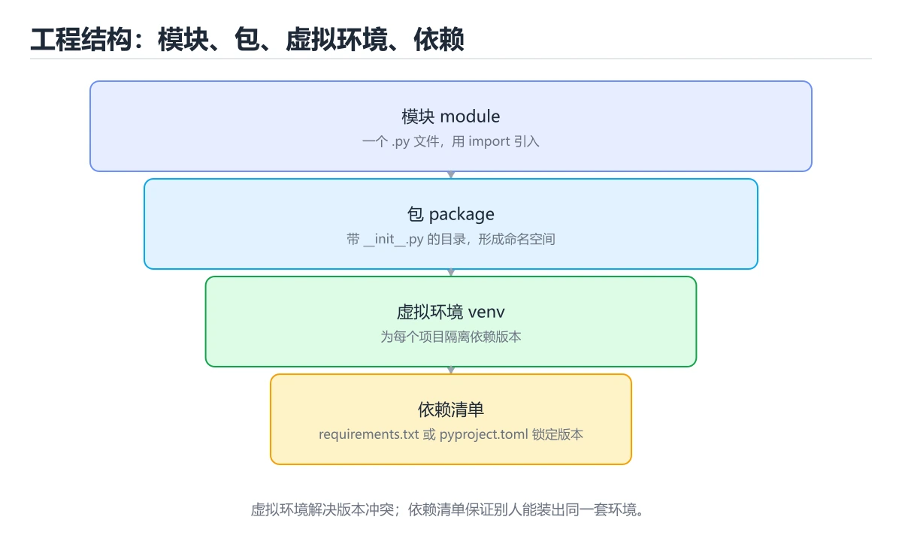
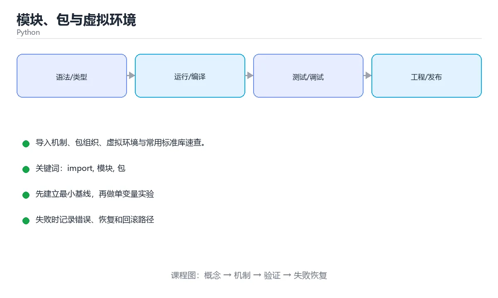

# 模块、包与虚拟环境





> 内容更新时间：2026-10-06 · 学习阶段：进阶 · 预计用时：60 分钟

## 本节知识框架

**课程定位**：所属分类 `python`（Python），课程主题 `模块、包与虚拟环境`，学习阶段 进阶，建议用时 55 分钟。

本课主线：导入机制、包组织、虚拟环境与常用标准库速查。

**学完本课应当能够**
- 说清 `from .text import slugify` 与 `模块` 的含义与区别，并各举一个正例和一个反例。
- 用本课示例验证 `包` 的行为，记录输入、输出与失败条件。
- 遇到「文件名与标准库重名」这类问题时，能说出触发条件与修复顺序。

### 从概念到验证的学习链条

1. `from .text import slugify`：先掌握 包内推荐使用绝对导入；相对导入（`from .text import slugify`）只在包内部使用，再用它解释 `模块` 为什么会出现。
2. `模块`：先掌握 把相关代码、资源和接口封装成可独立复用与维护的单元，再用它解释 `包` 为什么会出现。
3. `包`：先掌握 把一组相关类型、函数或模块组织在一起的命名空间单元，再用它解释 `相对导入` 为什么会出现。
4. `相对导入`：先掌握 用点号表示包内层级，只在包被导入时可用，直接运行脚本会失败，再用它解释 本课示例的观察结果 为什么会出现。

**先修与衔接**：本课是「Python」分类的第 14 课。先修内容：《异常处理与文件操作》。《异常处理与文件操作》里的 `ValueError`、`异常` 是本课的前提。相关或后续课程：《类型注解与测试》。

### 完成判据

- **定义关**：不看正文也能说明 `from .text import slugify` 是 包内推荐使用绝对导入，相对导入（`from .text import slugify`）只在包内部使用，并指出一个反例。
- **机制关**：能按“输入 → 转换 → 输出 → 验证”复述 `模块、包与虚拟环境`，而不是只背结论。
- **示例关**：能运行或推演 `模块、包与虚拟环境` 的 `python` 示例，并说明一个真实出现的标识符或字面量。
- **证据关**：能指出 `模块、包与虚拟环境` 示例里的 调用了 `print()`，并说明它支持或反驳了本课的哪一条结论。
- **排错关**：能复现 文件名与标准库重名，记录现象并按 别用 `json.py`、`re.py` 这类名字 修复。
- **迁移关**：能把 `import`、`模块`、`包`、`venv` 放进一个与 `模块、包与虚拟环境` 不同的项目场景，并保持输入与验证条件可追踪。
- **复盘关**：学完 `模块、包与虚拟环境` 后，用一句话写下仍然不确定的结论，并列出下一次验证需要的输入、环境和成功判据。

### 复习清单

- [ ] 能不看正文复述本课核心术语，并指出一个边界或反例。
- [ ] 能运行或推演本课示例，记录输入、输出与失败现象。
- [ ] 能完成一次自测，并把错题对照错误表定位原因。

## 核心概念定义

| 术语 | 操作性定义 | 常见边界与风险 |
| --- | --- | --- |
| from .text import slugify | 包内推荐使用绝对导入；相对导入（from .text import slugify）只在包内部使用。 | 只在「包内推荐使用绝对导入；相对导入（from .text import slugify）只在包内部使用」这一前提下成立，换输入或换环境要重新验证。 |
| 模块 | 把相关代码、资源和接口封装成可独立复用与维护的单元。 | 易错：`ImportError` 或半初始化模块；正确做法是拆出公共模块或用函数内导入。 |
| 包 | 把一组相关类型、函数或模块组织在一起的命名空间单元。 | 静态检查只在编译期成立，运行期输入仍需校验。 |
| 相对导入 | 用点号表示包内层级，只在包被导入时可用，直接运行脚本会失败。 | 易错：`ImportError: attempted relative import`；正确做法是用 `python -m 包名.模块` 运行。 |

## 原理与运行机制

### 机制总览

| 阶段 | 关注对象 | 失败时应检查 |
| --- | --- | --- |
| 输入 | from .text import slugify | 类型、范围、编码、版本或前置状态是否满足定义。 |
| 处理 | 模块 | 顺序、可见性、锁、路由、事务或调度规则是否被破坏。 |
| 输出 | 包 | 结果是否可复现，错误是否被正确传播而不是被吞掉。 |

**教材衔接：虚拟环境与依赖速查**

| 目的 | 命令 |
| --- | --- |
| 创建虚拟环境 | `python -m venv .venv` |
| 激活（Windows） | `.venv\Scripts\activate` |
| 激活（macOS / Linux） | `source .venv/bin/activate` |
| 退出 | `deactivate` |
| 导出依赖 | `pip freeze > requirements.txt` |
| 安装依赖 | `pip install -r requirements.txt` |
| 以脚本方式运行模块 | `python -m http.server 8000` |

**教材衔接：版本与时效**

### 升级检查清单

- 先固定当前版本，跑通全部示例与测验，再升级工具链。
- 升级时只动一个依赖版本，用 math_utils 记录构建与运行结果。
- 回归范围锁定 math_utils 的默认行为，并确认弃用警告是否出现在构建输出里。
- 升级后把 math_utils 的实测版本写进「内容元数据」，再更新复核日期。

### 机制拆解：每一步的输入、动作与输出

#### 1. `from .text import slugify`
- 输入：`import`；本步把 包内推荐使用绝对导入；相对导入（`from .text import slugify`）只在包内部使用 当作判断规则。
- 动作：围绕 `from .text import slugify` 保留中间状态，并记录它与 `模块` 的对应关系。
- 输出：`模块`，它可以被下一段代码、测试或记录继续使用。
- `from .text import slugify` 的失败条件：只在「包内推荐使用绝对导入；相对导入（`from .text import slugify`）只在包内部使用」这一前提下成立，换输入或换环境要重新验证。

#### 2. `模块`
- 输入：`from .text import slugify`；本步把 把相关代码、资源和接口封装成可独立复用与维护的单元 当作判断规则。
- 动作：围绕 `模块` 保留中间状态，并记录它与 `包` 的对应关系。
- 输出：`包`，它可以被下一段代码、测试或记录继续使用。
- `模块` 的失败条件：当循环导入时，会出现`ImportError` 或半初始化模块。

#### 3. `包`
- 输入：`模块`；本步把 把一组相关类型、函数或模块组织在一起的命名空间单元 当作判断规则。
- 动作：围绕 `包` 保留中间状态，并记录它与 `相对导入` 的对应关系。
- 输出：`相对导入`，它可以被下一段代码、测试或记录继续使用。
- `包` 的失败条件：当在包内使用相对导入直接运行文件时，会出现`ImportError: attempted relative import`。

#### 4. `相对导入`
- 输入：`包`；本步把 用点号表示包内层级，只在包被导入时可用，直接运行脚本会失败 当作判断规则。
- 动作：围绕 `相对导入` 保留中间状态，并记录它与 `print` 的对应关系。
- 输出：`print`，它可以被下一段代码、测试或记录继续使用。
- `相对导入` 的失败条件：当在包内使用相对导入直接运行文件时，会出现`ImportError: attempted relative import`。

### 示例中的可观察事实

1. 调用了 `print()`；它对应的课程主题是 `模块、包与虚拟环境`。
2. 调用了 `floor()`；它对应的课程主题是 `模块、包与虚拟环境`。
3. 调用了 `sqrt()`；它对应的课程主题是 `模块、包与虚拟环境`。
4. 调用了 `main()`；它对应的课程主题是 `模块、包与虚拟环境`。
5. 出现字面量 `程序入口`；它对应的课程主题是 `模块、包与虚拟环境`。
6. 出现字面量 `__main__`；它对应的课程主题是 `模块、包与虚拟环境`。

### 复现实验记录

- 环境：`模块、包与虚拟环境` 使用 `python` 示例，固定 `import`、`模块`、`包`、`venv` 作为第一组条件。
- 首轮输入：先确认 调用了 `print()`，预测 `from .text import slugify` 会怎样变化。
- 基线观察：记录命令、输入、输出和错误原文，不用截图代替可复制的文本。
- 单变量修改：只改变 `import`，观察 `相对导入` 是否仍满足定义。
- 失败注入：复现 文件名与标准库重名，确认现象是 `random.py` 导致导入错乱。
- 记录结论：把“修改前、修改后、预期变化、实际变化”写成四列表，这样复盘 `模块、包与虚拟环境` 时才能区分概念错误与实现错误。

## 典型应用场景

| 场景 | 典型输入或前提 | 期望产物 |
| --- | --- | --- |
| 学习验证 | 使用本课最小示例和 import、模块 | 能复现正文结论，并解释每一步。 |
| 工程落地 | 把「模块、包与虚拟环境」放入真实模块或服务边界 | 输出可观测、失败可定位、参数可配置。 |
| 故障排查 | 只改一个版本、规模、输入或依赖条件 | 能区分概念错误、实现错误和环境差异。 |

**教材衔接：依赖管理与项目布局实践**

| 工具 | 定位 | 特点 |
| --- | --- | --- |
| venv + pip | 标准库方案 | 无额外依赖，requirements.txt 记录版本 |
| pip-tools | 编译式依赖管理 | 从 requirements.in 生成锁定版本 |
| Poetry | 一体化工具 | 依赖解析 + 打包 + 发布 |
| uv | 极快的现代工具 | Rust 实现，兼容 pip 生态 |

**推荐项目布局**：`src/包名/`（源码）、`tests/`（测试）、`pyproject.toml`（配置与依赖）、`README.md`。把源码放 src 可避免"本地能导入、安装后不能"的问题（因为导入路径与安装路径不同）。

**常见坑**：① 忘记激活虚拟环境导致装到全局；② requirements.txt 不锁版本导致半年后无法复现；③ 用 `import *` 污染命名空间；④ 包内用相对导入却直接运行模块（应通过 `python -m 包.模块`）；⑤ 把敏感配置写进代码（应用环境变量或 .env 并在 .gitignore 排除）。

- **文件名与标准库重名**：典型现象是`random.py` 导致导入错乱；正确做法是别用 `json.py`、`re.py` 这类名字。
- **循环导入**：典型现象是`ImportError` 或半初始化模块；正确做法是拆出公共模块或用函数内导入。
- **忘了 `encoding="utf-8"`**：典型现象是中文乱码；正确做法是读写文本一律指定。
- **用 `os.path` 拼字符串**：典型现象是跨平台出错；正确做法是用 `pathlib`。

### 最小验证场景

- 准备：保留 `python` 示例的原始输入，先记录 `模块、包与虚拟环境` 的基线输出和完整运行命令。
- 观察：先核对 调用了 `print()`，再改变一个与 `from .text import slugify` 相关的条件。
- 判定：新结果与 `模块、包与虚拟环境` 的基线不同不等于错误；只有当差异破坏了 `from .text import slugify` 的定义或错误表中的约束，才判定为失败。

### 选择与边界

- 使用 `from .text import slugify` 时，先满足它的定义：包内推荐使用绝对导入；相对导入（`from .text import slugify`）只在包内部使用；只在「包内推荐使用绝对导入；相对导入（`from .text import slugify`）只在包内部使用」这一前提下成立，换输入或换环境要重新验证。
- 使用 `模块` 时，先满足它的定义：把相关代码、资源和接口封装成可独立复用与维护的单元；易错：`ImportError` 或半初始化模块；正确做法是拆出公共模块或用函数内导入。
- 使用 `包` 时，先满足它的定义：把一组相关类型、函数或模块组织在一起的命名空间单元；静态检查只在编译期成立，运行期输入仍需校验。
- 使用 `相对导入` 时，先满足它的定义：用点号表示包内层级，只在包被导入时可用，直接运行脚本会失败；易错：`ImportError: attempted relative import`；正确做法是用 `python -m 包名.模块` 运行。

## 代码/协议/SQL 示例

### 最小可验证示例

```python
import math                     # 导入整个模块
from math import sqrt, pi       # 只导入需要的名字
from pathlib import Path as P   # 起别名

print(math.floor(3.7), sqrt(16), pi)
```

**教材衔接：导入模块**

`if __name__ == "__main__":` 里的代码只在直接运行该文件时执行，被导入时不执行：

```python
def main():
    print("程序入口")

if __name__ == "__main__":
    main()
```

**教材衔接：组织成包**

```text
project/
├── main.py
└── utils/
    ├── __init__.py
    ├── text.py
    └── math_utils.py
```

```python
# main.py
from utils.text import slugify

print(slugify("Hello World"))
```

包内推荐使用绝对导入；相对导入（`from .text import slugify`）只在包内部使用。

**教材衔接：虚拟环境与依赖**

每个项目使用独立环境，避免依赖互相污染。

```bash
python -m venv .venv                  # 创建虚拟环境

# Windows
.venv\Scripts\activate
# macOS / Linux
source .venv/bin/activate

pip install requests                  # 安装依赖
pip freeze > requirements.txt         # 导出依赖清单
pip install -r requirements.txt       # 还原环境
deactivate                            # 退出环境
```

**教材衔接：常用标准库**

| 模块 | 用途 |
| --- | --- |
| `os` / `pathlib` | 文件与路径操作 |
| `json` / `csv` | 数据读写 |
| `datetime` | 日期时间 |
| `re` | 正则表达式 |
| `random` | 随机数 |
| `collections` | Counter、defaultdict、deque |
| `itertools` | 排列组合、分组 |
| `subprocess` | 调用外部命令 |
| `threading` / `asyncio` | 并发与异步 |

```python
from collections import defaultdict, deque
from datetime import datetime, timedelta

groups = defaultdict(list)
groups["a"].append(1)

queue = deque([1, 2, 3])
queue.appendleft(0)

print(datetime.now() + timedelta(days=7))
```

**教材衔接：常用标准库速查**

| 模块 | 用途 | 高频 API |
| --- | --- | --- |
| `pathlib` | 路径与文件 | `Path("a") / "b"`、`read_text`、`write_text`、`exists` |
| `os` | 环境与目录 | `os.environ`、`os.getenv`、`os.makedirs` |
| `sys` | 解释器信息 | `sys.argv`、`sys.exit`、`sys.path` |
| `json` | JSON 读写 | `json.loads`、`json.dumps(ensure_ascii=False)` |
| `datetime` | 日期时间 | `datetime.now()`、`timedelta`、`strftime` |
| `collections` | 专用容器 | `Counter`、`defaultdict`、`deque`、`namedtuple` |
| `itertools` | 迭代工具 | `chain`、`groupby`、`combinations`、`islice` |
| `functools` | 函数工具 | `lru_cache`、`partial`、`reduce` |
| `re` | 正则表达式 | `re.findall`、`re.sub`、`re.compile` |
| `random` | 随机 | `random.choice`、`shuffle`、`randint` |
| `statistics` | 统计 | `mean`、`median`、`stdev` |
| `csv` | CSV 读写 | `csv.reader`、`DictReader`、`DictWriter` |
| `logging` | 日志 | `logging.basicConfig`、`logger.exception` |
| `subprocess` | 调用外部命令 | `subprocess.run([...], check=True)` |
| `timeit` | 计时 | `timeit.timeit`、`-m timeit` 命令行 |

```python
from collections import Counter, defaultdict
from pathlib import Path
import json
import logging

logging.basicConfig(level=logging.INFO, format="%(asctime)s %(levelname)s %(message)s")

words = ["a", "b", "a", "c", "a"]
print(Counter(words).most_common(2))          # [('a', 3), ('b', 1)]

groups = defaultdict(list)
for word in words:
    groups[len(word)].append(word)            # 不需要先判断 key 是否存在

Path("out").mkdir(exist_ok=True)
Path("out/data.json").write_text(
    json.dumps({"count": len(words)}, ensure_ascii=False), encoding="utf-8"
)
logging.info("写入完成")
```

**教材衔接：零基础详解：模块、包与标准库**

### 一句话说清它是什么

模块就是一个 `.py` 文件，包就是「带 `__init__.py` 或命名空间的目录」。
Python 自带一整套标准库，能把文件、时间、正则、命令行这些常见需求直接解决，**不用装第三方包**。

### 用生活比喻理解

| 概念 | 比喻 | 说明 |
| --- | --- | --- |
| 模块 | 一本工具手册 | 一个 `.py` 文件 |
| 包 | 一排书柜 | 目录下放多个模块 |
| `import` | 从书柜取书 | 用到才取 |
| 虚拟环境 | 独立工作间 | 各项目依赖互不干扰 |
| 标准库 | 出厂自带工具箱 | `pathlib`、`json`、`datetime` 等 |

### 四种导入写法

```python
import json                      # 导入整个模块
from pathlib import Path         # 只导入需要的名字
from collections import defaultdict as dd   # 改名，避免冲突
from .utils import helper        # 包内相对导入

data = json.loads('{"a": 1}')
p = Path("data") / "a.txt"
```

**建议**：优先「用到什么导什么」，但 `import json` 这种短名字也完全可以。

### 最值得先掌握的十个标准库

| 模块 | 解决什么问题 | 典型用法 |
| --- | --- | --- |
| `pathlib` | 路径拼接、读写文件 | `Path("a") / "b.txt"` |
| `json` | 读写 JSON | `json.loads` / `dumps` |
| `datetime` | 日期时间与时区 | `datetime.now(tz)` |
| `re` | 正则匹配与替换 | `re.findall` |
| `collections` | 专用容器 | `Counter`、`defaultdict`、`deque` |
| `itertools` | 组合迭代器 | `chain`、`groupby`、`islice` |
| `functools` | 高阶函数工具 | `lru_cache`、`partial` |
| `os` / `sys` | 环境、参数、退出 | `sys.argv`、`os.environ` |
| `subprocess` | 调用外部命令 | `subprocess.run` |
| `argparse` | 命令行参数解析 | `add_argument` |

### 一段代码展示高频用法

```python
import json
import re
from collections import Counter, defaultdict
from datetime import datetime, timezone
from functools import lru_cache
from pathlib import Path

# 1. pathlib：路径操作不再是字符串拼接
base = Path("data")
base.mkdir(exist_ok=True)
(base / "note.txt").write_text("你好", encoding="utf-8")

# 2. json：序列化与反序列化
payload = {"id": 1, "tags": ["py", "db"]}
(base / "config.json").write_text(
    json.dumps(payload, ensure_ascii=False, indent=2), encoding="utf-8"
)

# 3. Counter：一行做词频
words = "a b a c a".split()
print(Counter(words).most_common(2))          # [('a', 3), ('b', 1)]

# 4. defaultdict：免去判空
groups = defaultdict(list)
for name in ["小明", "小红", "小刚"]:
    groups[name[0]].append(name)

# 5. re：提取与校验
print(re.findall(r"\d+", "订单 12 号，金额 88 元"))

# 6. datetime：带时区的时间
print(datetime.now(timezone.utc).isoformat())

# 7. lru_cache：把重复计算缓存起来
@lru_cache(maxsize=None)
def fib(n: int) -> int:
    return n if n < 2 else fib(n - 1) + fib(n - 2)
```

### 虚拟环境与依赖管理

```bash
python -m venv .venv              # 创建虚拟环境
source .venv/bin/activate         # Linux / macOS 激活
.venv\Scripts\activate            # Windows 激活

pip install requests              # 安装
pip freeze > requirements.txt     # 导出依赖
pip install -r requirements.txt   # 按清单安装
```

**每个项目一个虚拟环境**，否则不同项目的依赖版本会互相打架。

### 新手最容易踩的八个坑

| 坑 | 现象 | 正确做法 |
| --- | --- | --- |
| 文件名与标准库重名 | `random.py` 导致导入错乱 | 别用 `json.py`、`re.py` 这类名字 |
| 循环导入 | `ImportError` 或半初始化模块 | 拆出公共模块或用函数内导入 |
| 忘了 `encoding="utf-8"` | 中文乱码 | 读写文本一律指定 |
| 用 `os.path` 拼字符串 | 跨平台出错 | 用 `pathlib` |
| 不用虚拟环境 | 依赖冲突 | 每项目独立 `.venv` |
| 用 `eval` 解析 JSON | 安全漏洞 | 用 `json.loads` |
| 用 `datetime.now()` 存时间 | 时区混乱 | 存 UTC，展示再转本地 |
| 把密码写进代码 | 泄露 | 用环境变量或配置外置 |

### 手把手练习：统计日志目录

```python
import json
import re
from collections import Counter
from pathlib import Path

def summarize(log_dir: str) -> dict:
    levels = Counter()
    total_lines = 0
    for file in Path(log_dir).glob("*.log"):
        for line in file.read_text(encoding="utf-8").splitlines():
            total_lines += 1
            match = re.search(r"\b(INFO|WARN|ERROR)\b", line)
            if match:
                levels[match.group(1)] += 1
    return {"files": len(list(Path(log_dir).glob("*.log"))),
            "lines": total_lines,
            "levels": dict(levels)}

if __name__ == "__main__":
    print(json.dumps(summarize("logs"), ensure_ascii=False, indent=2))
```

### 学完自测

- [ ] 能说出模块与包的区别。
- [ ] 能列出至少六个标准库及其用途。
- [ ] 知道为什么要为每个项目建虚拟环境。
- [ ] 会用 `pathlib` 与 `json` 完成一次读写。
- [ ] 知道为什么不能用 `eval` 解析外部数据。

**运行方式**：运行 `模块、包与虚拟环境` 的示例时，保存为 `.py` 文件后用 `python 文件名.py` 运行；第三方依赖先在虚拟环境里安装。

### 示例精读：先找证据，再改一个条件

1. 调用了 `print()`；它出现在 `模块、包与虚拟环境` 的示例中，阅读时先确认它前后各发生了什么。
2. 调用了 `floor()`；它出现在 `模块、包与虚拟环境` 的示例中，阅读时先确认它前后各发生了什么。
3. 调用了 `sqrt()`；它出现在 `模块、包与虚拟环境` 的示例中，阅读时先确认它前后各发生了什么。
4. 调用了 `main()`；它出现在 `模块、包与虚拟环境` 的示例中，阅读时先确认它前后各发生了什么。
5. 出现字面量 `程序入口`；它出现在 `模块、包与虚拟环境` 的示例中，阅读时先确认它前后各发生了什么。
6. 出现字面量 `__main__`；它出现在 `模块、包与虚拟环境` 的示例中，阅读时先确认它前后各发生了什么。
- 在 `模块、包与虚拟环境` 中与 `from .text import slugify` 对照：示例必须能支持 包内推荐使用绝对导入；相对导入（`from .text import slugify`）只在包内部使用，否则说明这一段还缺少实现或验证步骤。
- 在 `模块、包与虚拟环境` 中与 `模块` 对照：示例必须能支持 把相关代码、资源和接口封装成可独立复用与维护的单元，否则说明这一段还缺少实现或验证步骤。
- 在 `模块、包与虚拟环境` 中与 `包` 对照：示例必须能支持 把一组相关类型、函数或模块组织在一起的命名空间单元，否则说明这一段还缺少实现或验证步骤。
- 在 `模块、包与虚拟环境` 中与 `相对导入` 对照：示例必须能支持 用点号表示包内层级，只在包被导入时可用，直接运行脚本会失败，否则说明这一段还缺少实现或验证步骤。

## 时间/空间复杂度或性能分析

**性能关注点（模块、包与虚拟环境）**：解释执行与对象分配是主要成本：记录执行时间、内存峰值与 GC 次数，必要时对比其他实现。

**本课特有开销（模块、包与虚拟环境 · import）**：小文件看元数据开销，大文件看吞吐，两者要分别测量。

**测量方法**：以 `模块、包与虚拟环境` 的 `import` 场景为对象，固定输入跑一遍记录基线，再把规模或并发度提高一个数量级复测；两次结果的差值与波动范围才是结论依据。

### 需要控制的变量与记录项

- `模块、包与虚拟环境` 的 `import`：固定它的版本、输入范围和资源上限，分别记录速度、内存与失败率的变化。
- `模块、包与虚拟环境` 的 `模块`：固定它的版本、输入范围和资源上限，分别记录速度、内存与失败率的变化。
- `模块、包与虚拟环境` 的 `包`：固定它的版本、输入范围和资源上限，分别记录速度、内存与失败率的变化。
- `模块、包与虚拟环境` 的 `venv`：固定它的版本、输入范围和资源上限，分别记录速度、内存与失败率的变化。
- `模块、包与虚拟环境` 的 `pip`：固定它的版本、输入范围和资源上限，分别记录速度、内存与失败率的变化。
- `模块、包与虚拟环境` 中 `from .text import slugify` 的边界：只在「包内推荐使用绝对导入；相对导入（`from .text import slugify`）只在包内部使用」这一前提下成立，换输入或换环境要重新验证。达到边界时不要外推，必须重新测量。
- `模块、包与虚拟环境` 中 `模块` 的边界：易错：`ImportError` 或半初始化模块；正确做法是拆出公共模块或用函数内导入。达到边界时不要外推，必须重新测量。
- `模块、包与虚拟环境` 中 `包` 的边界：静态检查只在编译期成立，运行期输入仍需校验。达到边界时不要外推，必须重新测量。
- `模块、包与虚拟环境` 中 `相对导入` 的边界：易错：`ImportError: attempted relative import`；正确做法是用 `python -m 包名.模块` 运行。达到边界时不要外推，必须重新测量。
- `模块、包与虚拟环境` 的代码证据：先验证 调用了 `print()`，再记录该路径的输入规模与耗时；只看代码行数不能推出复杂度。

## 常见误区与易错点

| 容易写错的做法 | 实际现象 | 原因与正确做法 |
| --- | --- | --- |
| 文件名与标准库重名 | `random.py` 导致导入错乱 | 别用 `json.py`、`re.py` 这类名字 |
| 循环导入 | `ImportError` 或半初始化模块 | 拆出公共模块或用函数内导入 |
| 忘了 `encoding="utf-8"` | 中文乱码 | 读写文本一律指定 |
| 用 `os.path` 拼字符串 | 跨平台出错 | 用 `pathlib` |
| 不用虚拟环境 | 依赖冲突 | 每项目独立 `.venv` |
| 用 `eval` 解析 JSON | 安全漏洞 | 用 `json.loads` |
| 用 `datetime.now()` 存时间 | 时区混乱 | 存 UTC，展示再转本地 |
| 把密码写进代码 | 泄露 | 用环境变量或配置外置 |
| `from os import *` | 名字冲突，来源不清 | 显式导入需要的名字 |
| `import json` 后写 `loads(...)` | `NameError` | 要写 `json.loads(...)`，或用 `from json import loads` |
| 模块名与标准库同名 | 导入到自己的文件 | 例如别把文件命名为 `json.py`、`random.py` |
| 在包内使用相对导入直接运行文件 | `ImportError: attempted relative import` | 用 `python -m 包名.模块` 运行 |
| `json.dumps` 中文变 `\uXXXX` | 输出难以阅读 | 加 `ensure_ascii=False` |
| 用 `datetime.now()` 存时间却不带时区 | 跨时区出现偏差 | 统一用 UTC 存储，展示时再转本地时区 |
| `open` 不指定编码 | 平台差异导致乱码 | 一律 `encoding="utf-8"` |
| `subprocess.run("ls -l")` | `FileNotFoundError` | 传参数列表：`subprocess.run(["ls", "-l"])` |
| 用 `re.match` 想匹配任意位置 | 匹配不到 | `match` 只从开头匹配，任意位置用 `re.search` |
| 在循环里用 `+=` 拼字符串 | 数据量大时变慢 | 收集到列表后用 `"".join()` |
| from os import * | 名字冲突，来源不清。 | 显式导入需要的名字。 |
| import json 后写 loads(...) | NameError。 | 要写 json.loads(...)，或用 from json import loads。 |

### 现场 1：文件名与标准库重名

**症状**：`random.py` 导致导入错乱。

**根因与修复**：别用 `json.py`、`re.py` 这类名字。

**自检**：在本课示例里复现「文件名与标准库重名」，改成别用 `json.py`、`re.py` 这类名字后重跑；如果症状消失且失败路径按预期变化，说明定位正确。

### 现场 2：循环导入

**症状**：`ImportError` 或半初始化模块。

**根因与修复**：拆出公共模块或用函数内导入。

**自检**：在本课示例里复现「循环导入」，改成拆出公共模块或用函数内导入后重跑；如果症状消失且失败路径按预期变化，说明定位正确。

### 现场 3：忘了 `encoding="utf-8"`

**症状**：中文乱码。

**根因与修复**：读写文本一律指定。

**自检**：在本课示例里复现「忘了 `encoding="utf-8"`」，改成读写文本一律指定后重跑；如果症状消失且失败路径按预期变化，说明定位正确。

### 现场 4：用 `os.path` 拼字符串

**症状**：跨平台出错。

**根因与修复**：用 `pathlib`。

**自检**：在本课示例里复现「用 `os.path` 拼字符串」，改成用 `pathlib`后重跑；如果症状消失且失败路径按预期变化，说明定位正确。

### 现场 5：不用虚拟环境

**症状**：依赖冲突。

**根因与修复**：每项目独立 `.venv`。

**自检**：在本课示例里复现「不用虚拟环境」，改成每项目独立 `.venv`后重跑；如果症状消失且失败路径按预期变化，说明定位正确。

### 现场 6：用 `eval` 解析 JSON

**症状**：安全漏洞。

**根因与修复**：用 `json.loads`。

**自检**：在本课示例里复现「用 `eval` 解析 JSON」，改成用 `json.loads`后重跑；如果症状消失且失败路径按预期变化，说明定位正确。

### 现场 7：用 `datetime.now()` 存时间

**症状**：时区混乱。

**根因与修复**：存 UTC，展示再转本地。

**自检**：在本课示例里复现「用 `datetime.now()` 存时间」，改成存 UTC，展示再转本地后重跑；如果症状消失且失败路径按预期变化，说明定位正确。

### 现场 8：把密码写进代码

**症状**：泄露。

**根因与修复**：用环境变量或配置外置。

**自检**：在本课示例里复现「把密码写进代码」，改成用环境变量或配置外置后重跑；如果症状消失且失败路径按预期变化，说明定位正确。

### 现场 9：`from os import *`

**症状**：名字冲突，来源不清。

**根因与修复**：显式导入需要的名字。

**自检**：在本课示例里复现「`from os import *`」，改成显式导入需要的名字后重跑；如果症状消失且失败路径按预期变化，说明定位正确。

## 与其他知识点的关系

- **先修**：`异常处理与文件操作`。本课默认这些内容已经掌握。
- **相关或后续**：`类型注解与测试`。本课术语会在这些课程里继续使用。
- **术语归属**：`from .text import slugify`、`模块`、`包` 的定义以本课「核心概念定义」为准，换到其他课程时先确认定义是否被改写。

### 先修与后续术语接口

- `异常处理与文件操作`：两者通过本分类的学习顺序衔接，阅读时重点比较各自的输入与失败条件。
- `类型注解与测试`：两者通过本分类的学习顺序衔接，阅读时重点比较各自的输入与失败条件。

### 容易混淆的相邻概念

- `from .text import slugify` 与 `模块`：前者强调 包内推荐使用绝对导入；相对导入（`from .text import slugify`）只在包内部使用；后者强调 把相关代码、资源和接口封装成可独立复用与维护的单元。判断时分别检查两条定义的适用范围，不要只看名称相似就互换。
- `模块` 与 `包`：前者强调 把相关代码、资源和接口封装成可独立复用与维护的单元；后者强调 把一组相关类型、函数或模块组织在一起的命名空间单元。判断时分别检查两条定义的适用范围，不要只看名称相似就互换。
- `包` 与 `相对导入`：前者强调 把一组相关类型、函数或模块组织在一起的命名空间单元；后者强调 用点号表示包内层级，只在包被导入时可用，直接运行脚本会失败。判断时分别检查两条定义的适用范围，不要只看名称相似就互换。

## 自测题与参考答案

> 先独立作答，再对照参考答案；答案都能在本课正文、术语表或错误表里找到依据。

### 自测 1（概念复述）

不看正文，写出 `from .text import slugify` 的操作性定义，并说明它与 `模块` 的区别。

**参考答案**：包内推荐使用绝对导入；相对导入（`from .text import slugify`）只在包内部使用。

`模块` 的定位是：把相关代码、资源和接口封装成可独立复用与维护的单元；两者的差别要从适用对象与失败模式上说明。

### 自测 2（排错）

本课错误表记录了「文件名与标准库重名」这类做法。请写出它会出现的现象、根因，以及修复顺序。

**参考答案**：现象是`random.py` 导致导入错乱；正确做法是别用 `json.py`、`re.py` 这类名字。修复时先复现现象并保留证据，再改动一处假设重跑，确认现象消失。

### 自测 3（动手验证）

运行本课的 `python` 示例，把其中的 `3` 换成一个边界值后重新运行，记录输出与错误信息。

**参考答案**：正常输入下 `python` 示例应当复现正文给出的结果；把 `3` 换成边界值后，如果结果改变或报错，先核对它是否满足 `模块、包与虚拟环境` 中`from .text import slugify` 的适用范围，再检查错误表里是否有同类现象。

### 自测 4（代码阅读）

阅读本课开头的 `python` 示例，说明它体现了`from .text import slugify` 的哪一条性质，并指出改动哪个输入会让这条性质不再成立。

**参考答案**：`from .text import slugify` 的定义是 包内推荐使用绝对导入，相对导入（`from .text import slugify`）只在包内部使用，示例正是在实现这条定义。改动与 `from .text import slugify` 有关的一个输入后，如果结果不再符合 `模块、包与虚拟环境` 的正文描述，就说明该性质只在当前前提成立。

### 自测 5（迁移）

把 `模块、包与虚拟环境` 的方法迁移到自己的项目：围绕 `from .text import slugify` 写出一个与错误表同类的风险点，并说明触发条件和检验方式。

**参考答案**：例如「import json 后写 loads(...)」，它会导致NameError；检验方式是按要写 json.loads(...)，或用 from json import loads改一处再复现，确认现象消失且没有引入新的失败分支。

### 自测 6（对比）

用一个表格对比 `from .text import slugify` 与 `模块`：各写一行适用场景、一行失败表现。

**参考答案**：`from .text import slugify` 的定义是包内推荐使用绝对导入；相对导入（`from .text import slugify`）只在包内部使用；`模块` 的定义是把相关代码、资源和接口封装成可独立复用与维护的单元。两者的失败表现分别对应本课错误表里与本术语相关的行。

### 自测 7（排错顺序）

面对「文件名与标准库重名」引发的问题，请把“复现 `random.py` 导致导入错乱 → 保留证据 → 别用 `json.py`、`re.py` 这类名字 → 回归验证”四步写成可执行的检查清单。

**参考答案**：第一步按`random.py` 导致导入错乱复现；第二步记录输入、版本与完整报错；第三步按别用 `json.py`、`re.py` 这类名字只改一处；第四步重跑并确认失败路径也按预期变化。

### 自测 8（边界判断）

针对 `相对导入`，分别写出“可以使用”的条件和“结论不再成立”的条件。

**参考答案**：易错：`ImportError: attempted relative import`；正确做法是用 `python -m 包名.模块` 运行。 同时要把 `相对导入` 的定义 用点号表示包内层级，只在包被导入时可用，直接运行脚本会失败 与实际输入逐项对照。

### 自测 9（机制重建）

不看正文，按输入、转换、输出、验证四段重建 `from .text import slugify` → `模块` → `包` → `相对导入` 的作用链。

**参考答案**：起点是 `from .text import slugify` 的定义 包内推荐使用绝对导入；相对导入（`from .text import slugify`）只在包内部使用；中间每一步都保留可观察状态；终点由 `相对导入` 检查，失败时回到错误表定位第一个偏离定义的步骤。

### 自测 10（综合排错）

在 `模块、包与虚拟环境` 中，现象是 NameError。请围绕 import json 后写 loads(...) 写出最小复现、关键证据、修复动作和回归验证，并说明为什么不能只凭一次运行下结论。

**参考答案**：先复现 import json 后写 loads(...)，记录输入与完整错误；再按 要写 json.loads(...)，或用 from json import loads 只改一处。回归时同时跑正常路径和边界路径，只有两次结果都可解释，才把修复视为完成。

### 自测 11（一分钟复述）

用每分钟约 200 字的速度复述 `模块、包与虚拟环境`：先给主问题，再按顺序说出 `from .text import slugify`、`模块`、`包`、`相对导入`，最后给一个失败案例。

**自评标准**：主问题必须对应 导入机制、包组织、虚拟环境与常用标准库速查；每个术语都要能接上一句定义或边界；失败案例必须写成可观察现象，不能用“可能有风险”代替证据。

## 术语速查

| 术语 | 一句话说明 |
| --- | --- |
| `from .text import slugify` | 包内推荐使用绝对导入；相对导入（`from .text import slugify`）只在包内部使用。 |
| `模块` | 把相关代码、资源和接口封装成可独立复用与维护的单元。 |
| `包` | 把一组相关类型、函数或模块组织在一起的命名空间单元。 |
| `相对导入` | 用点号表示包内层级，只在包被导入时可用，直接运行脚本会失败。 |

**术语关系**：`from .text import slugify`（包内推荐使用绝对导入） → `模块`（把相关代码、资源和接口封装成可独立复用与维护的单元） → `包`（把一组相关类型、函数或模块组织在一起的命名空间单元） → `相对导入`（用点号表示包内层级）。

## 考点精讲

`模块、包与虚拟环境` 的题库有 6 道题，下面逐题给出题干、正确项与判断依据：先自己作答，再核对正确项，最后回到正文对应小节复核。

### 考点 1：第 1 题

- **题目**：围绕“模块、包与虚拟环境”中的 import、模块、包，下列哪两项是本课强调的实践判断？
- **正确项**：学习 import 时要同时说明输入、输出和失败路径，不能只看正常流程；验证 模块 时要固定版本并覆盖边界输入，结论才可复现
- **判断依据**：这道题落在术语 `模块` 上：把相关代码、资源和接口封装成可独立复用与维护的单元。复习时把 `模块` 的定义、适用边界和一个反例一起说清楚，再回到「核心概念定义」核对原文。

### 考点 2：第 2 题

- **题目**：为每个项目创建虚拟环境的主要目的是？
- **正确项**：隔离项目依赖，避免版本冲突
- **判断依据**：这道题检验本课主问题：导入机制、包组织、虚拟环境与常用标准库速查。复习时先复述本课主问题，再举一个会让结论失效的输入。

### 考点 3：第 3 题

- **题目**：统计词频最方便的标准库是？
- **正确项**：collections.Counter
- **判断依据**：这道题检验本课主问题：导入机制、包组织、虚拟环境与常用标准库速查。复习时先复述本课主问题，再举一个会让结论失效的输入。

### 考点 4：第 4 题

- **题目**：下面这段 `python` 代码来自 `模块、包与虚拟环境`。课程主线是导入机制、包组织、虚拟环境与常用标准库速查。代码与 `from .text import slugify` 有关。哪一项是代码里真实出现的内容？
- **正确项**：调用了 `floor()`
- **判断依据**：这道题落在术语 `from .text import slugify` 上：包内推荐使用绝对导入，相对导入（`from .text import slugify`）只在包内部使用。复习时把 `from .text import slugify` 的定义、适用边界和一个反例一起说清楚，再回到「核心概念定义」核对原文。

### 考点 5：第 5 题

- **题目**：pathlib.Path 相比手写字符串拼接路径的优势是？
- **正确项**：跨平台分隔符自动处理
- **判断依据**：这道题检验本课主问题：导入机制、包组织、虚拟环境与常用标准库速查。复习时先复述本课主问题，再举一个会让结论失效的输入。

### 考点 6：第 6 题

- **题目**：填空：补齐下面这段术语说明中的空缺。课程 `导入机制、包组织、虚拟环境与常用标准库速查。`，这段说明是：`____`：把一组相关类型、函数或模块组织在一起的命名空间单元。空缺处应填哪个术语？
- **正确项**：包
- **判断依据**：这道题落在术语 `模块` 上：把相关代码、资源和接口封装成可独立复用与维护的单元。复习时把 `模块` 的定义、适用边界和一个反例一起说清楚，再回到「核心概念定义」核对原文。

### 考点 7：`from .text import slugify`

- **要点**：包内推荐使用绝对导入；相对导入（`from .text import slugify`）只在包内部使用。
- **from .text import slugify 的边界**：只在「包内推荐使用绝对导入；相对导入（`from .text import slugify`）只在包内部使用」这一前提下成立，换输入或换环境要重新验证。

### 考点 8：`模块`

- **要点**：把相关代码、资源和接口封装成可独立复用与维护的单元。
- **模块 的边界**：易错：`ImportError` 或半初始化模块；正确做法是拆出公共模块或用函数内导入。

### 考点 9：`包`

- **要点**：把一组相关类型、函数或模块组织在一起的命名空间单元。
- **包 的边界**：静态检查只在编译期成立，运行期输入仍需校验。

### 考点 10：`相对导入`

- **要点**：用点号表示包内层级，只在包被导入时可用，直接运行脚本会失败。
- **相对导入 的边界**：易错：`ImportError: attempted relative import`；正确做法是用 `python -m 包名.模块` 运行。

### 考点 11：排错——文件名与标准库重名

- **现象**：`random.py` 导致导入错乱。
- **处理**：别用 `json.py`、`re.py` 这类名字。

### 考点 12：排错——循环导入

- **现象**：`ImportError` 或半初始化模块。
- **处理**：拆出公共模块或用函数内导入。

### 考点 13：综合辨析——`from .text import slugify` 与 `相对导入`

- **辨析点**：`from .text import slugify` 的定义是 包内推荐使用绝对导入；相对导入（`from .text import slugify`）只在包内部使用；`相对导入` 的定义是 用点号表示包内层级，只在包被导入时可用，直接运行脚本会失败。
- **答题要求**：面对 `模块、包与虚拟环境` 的题目，先判断描述的是 `from .text import slugify` 还是 `相对导入`，再归到对应定义，最后写出一个会让该定义失效的边界输入。

### 考点 14：排错评分点

- **现象分**：能写出 `random.py` 导致导入错乱，而不是只写“程序有错”。
- **证据分**：保留触发 文件名与标准库重名 的输入、版本和错误原文。
- **修复分**：按 别用 `json.py`、`re.py` 这类名字 只改一处，并同时回归正常路径与边界路径。

## 内容元数据

- 内容版本：v2.0
- 最后更新：2026-10-06
- 学习阶段：进阶
- 适用环境：Python 3.12+
；本课聚焦 import。
- 内容来源：内置结构化课程与工程实践整理
- 相关主题：import、模块、包、venv、pip、标准库
- 质量版本：P0 测验标准 + P1 覆盖扩展 + P2 体验补全

## 参考资料与复核

- 最后复核：2026-10-04
- 下次复核：2026-12-10
- 复核范围：版本兼容、API 行为、安全建议与工程实践
- 来源性质：官方文档、标准或权威教材；本课核对关键词：import、模块、包、venv、pip、标准库。

| 参考资料 | 本课用途 |
| --- | --- |
| [Python 打包指南](https://packaging.python.org/) | 依赖、构建与发布 |
| [Python 标准库](https://docs.python.org/3/library/) | 标准库 API 与模块 |
| [PEP 索引](https://peps.python.org/) | 语言提案与版本演进 |

| [本课术语索引：模块、包与虚拟环境](#核心概念定义) | 按本课输入、术语边界和错误表现逐项核对 |
> 「模块、包与虚拟环境」的链接用于离线阅读后的延伸核对；App 不会自动联网。