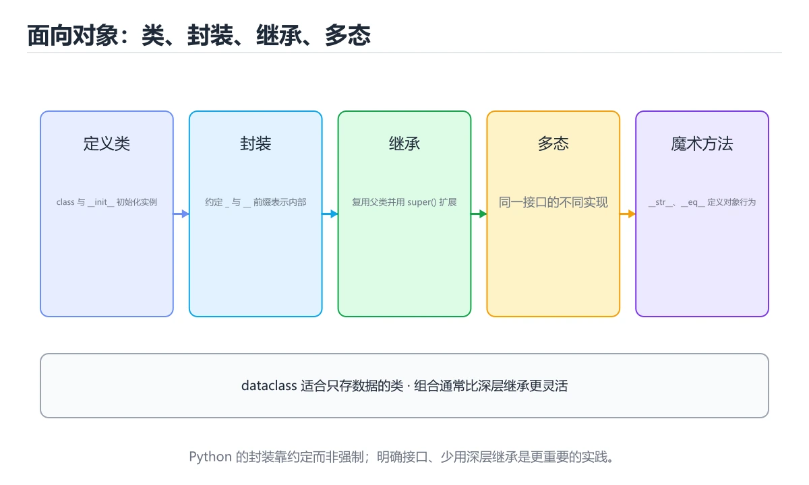
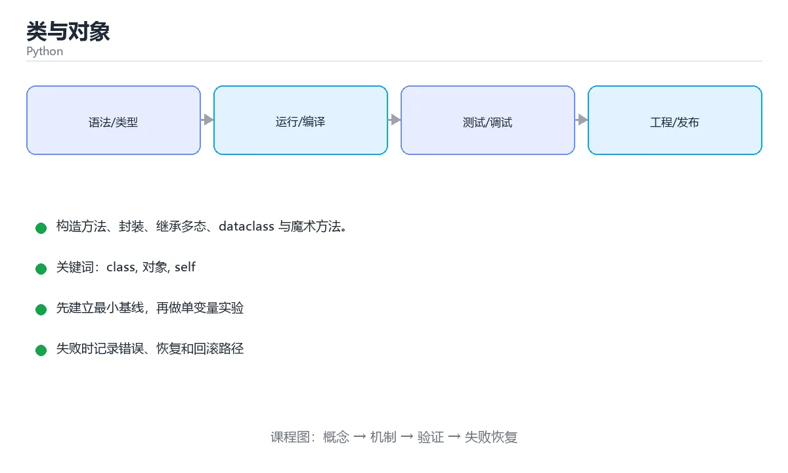

# 类与对象

> 内容更新时间：2026-10-06 · 学习阶段：进阶 · 预计用时：50 分钟





## 本节知识框架

**课程定位**：所属分类为「Python」，课程主题为「类与对象」，学习阶段为「进阶」，建议用时 50 分钟。

**本课要解决的主问题**：构造方法、封装、继承多态、dataclass 与魔术方法。

| 学习层次 | 要回答的问题 | 完成判据 |
| --- | --- | --- |
| 概念层 | 「类与对象」有哪些必须区分的对象与术语？ | 能用自己的话定义核心术语，并各举一个正例和一个反例。 |
| 机制层 | 这些对象按什么顺序发生作用，输入如何变成输出？ | 能画出或写出机制步骤，并说明每一步的失败条件。 |
| 应用层 | 什么场景适合使用「类与对象」，什么场景不适合？ | 能给出一个真实场景、一个最小示例和一个边界案例。 |
| 性能层 | 时间、空间、吞吐或延迟受哪些量影响？ | 能说出复杂度或性能瓶颈的证据来源；没有证据时明确写“材料未提供”。 |
| 复习层 | 怎样确认自己不是只记住了结论？ | 能独立完成本课自测，并把错误定位到概念、机制、示例或边界。 |

### 阅读路线

1. 先读「核心概念定义」，建立「class」等对象的精确定义。
2. 再读「原理与运行机制」，把定义串成可重复的过程。
3. 用「代码/协议/SQL 示例」验证过程，并只改一个条件观察结果变化。
4. 最后检查性能、易错点、知识关系与自测题，形成可复习的证据链。

**前置知识**：《列表、元组、字典与集合》

**学习位置**：本课位于《Python 字符串、Unicode 与格式化》之后；如果前一课的自测不能通过，应先回补再继续。

**后续衔接**：下一课《异常处理与文件操作》会继续使用本课术语，学完后建议立即完成一次自测。

**教材衔接：学习目标**

- 能用自己的话解释类与对象解决了什么问题，而不是只背术语。
- 能说清 「class」、「对象」、「self」、「继承」 之间的关系，并分别举出一个例子。
- 能把 class 放回「类与对象」的知识体系，说明它和 对象 的边界。
- 能完成本课练习，并用验收标准检查自己的结果。

> 一句话摘要：构造方法、封装、继承多态、dataclass 与魔术方法。

**教材衔接：前置知识**

- 先完成上一课《列表、元组、字典与集合》；如果已经掌握，可以直接用本课练习自测。
- 本课阶段：进阶。建议先完成「列表、元组、字典与集合」，或确认自己能独立跑通正文里的 NotImplementedError 示例。
- 开始前先复习：class、对象、self。
- 如果 定义类 这一步看不懂，先记录具体卡点，再用 NotImplementedError 复现一遍。

**教材衔接：本课小结**

面向对象的核心是**把数据和操作数据的方法放在一起**，用继承和多态让调用方只依赖抽象。

## 核心概念定义

> 阅读约定：本课先给「类与对象」相关术语的操作性定义与适用边界；正文里的口语化说法与定义冲突时，以定义和可复现示例为准。

| 术语 | 操作性定义 | 本课中的边界 |
| --- | --- | --- |
| __init__ | __init__ 是构造方法，self 指向实例本身，必须作为第一个参数。 | 仅在「类与对象」明确给出的输入、版本与资源条件下成立。 |
| class | 定义对象属性与行为的类型模板，实例化后得到具体对象。 | 仅在「类与对象」明确给出的输入、版本与资源条件下成立。 |
| 对象 | 类是一张模板，对象是按模板造出来的实例。 | 仅在「类与对象」明确给出的输入、版本与资源条件下成立。 |
| 实例属性与类属性 | 实例属性存在各自对象里，类属性被所有实例共享，可变的类属性最容易被误改。 | 仅在「类与对象」明确给出的输入、版本与资源条件下成立。 |

### 定义如何使用

在「类与对象」中判断一个说法是否成立，先确认它使用的是哪个对象的定义，再检查输入规模、运行环境与失败路径。定义不是口号，而是后续推导、代码示例和自测题共享的约束。

**教材衔接：定义类**

```python
class Dog:
    species = "犬科"          # 类属性，所有实例共享

    def __init__(self, name, age):
        self.name = name      # 实例属性
        self.age = age

    def bark(self):
        return f"{self.name} 在叫"

    def __str__(self):        # 打印对象时的显示内容
        return f"Dog({self.name}, {self.age})"

dog = Dog("旺财", 3)
print(dog.bark(), dog.species)
```

`__init__` 是构造方法，`self` 指向实例本身，必须作为第一个参数。

**教材衔接：面向对象速查**

| 概念 | 写法 | 说明 |
| --- | --- | --- |
| 实例属性 | `self.name = name` | 每个实例独立 |
| 类属性 | 类中直接赋值 | 所有实例共享，改它要谨慎 |
| 私有约定 | `self._x` / `self.__x` | 单下划线是约定，双下划线会改名 |
| 类方法 | `@classmethod` + `cls` | 常用于替代构造器 `from_xxx` |
| 静态方法 | `@staticmethod` | 逻辑相关但不需要实例或类 |
| 属性 | `@property` / `@x.setter` | 访问像字段，内部可做校验 |
| 继承 | `class Dog(Animal):` | 用 `super().__init__(...)` 初始化父类 |
| 抽象基类 | `class Base(ABC):` + `@abstractmethod` | 强制子类实现 |
| 数据类 | `@dataclass` | 自动生成 `__init__`、`__repr__`、`__eq__` |
| 槽位 | `__slots__` | 限制属性、减少内存占用 |

```python
from dataclasses import dataclass, field

@dataclass(frozen=True)          # 不可变，可安全当字典键
class Point:
    x: int
    y: int
    tags: tuple[str, ...] = field(default_factory=tuple)

print(Point(1, 2) == Point(1, 2))   # True，自动生成 __eq__
```

**教材衔接：零基础详解：类与对象，把数据和行为打包**

### 一句话说清它是什么

类是一张**模板**，对象是按模板造出来的**实例**。
类的价值是把「一堆相关的数据」和「操作这些数据的方法」放在一起，让代码有边界。

### 用生活比喻理解

| 概念 | 比喻 | 代码 |
| --- | --- | --- |
| 类 | 图纸 | `class Dog:` |
| 实例 | 按图纸造出来的狗 | `d = Dog("旺财")` |
| 属性 | 这条狗的信息 | `d.name` |
| 方法 | 这条狗会做的事 | `d.bark()` |
| `self` | 「这条狗自己」 | 方法第一个参数 |
| 继承 | 在图纸基础上改 | `class Puppy(Dog):` |

### 逐行拆解第一个类

```python
class Dog:
    species = "犬科"                 # 类属性：所有实例共享

    def __init__(self, name: str):   # 构造方法，创建实例时自动调用
        self.name = name             # 实例属性：每条狗各自一份
        self._energy = 100           # 下划线开头表示「内部使用」

    def bark(self) -> str:           # 实例方法，第一个参数是 self
        self._energy -= 5
        return f"{self.name}：汪！剩余体力 {self._energy}"

    def __str__(self) -> str:        # 打印对象时显示的内容
        return f"Dog({self.name})"

d = Dog("旺财")
print(d.bark())
print(d)          # Dog(旺财)，因为定义了 __str__
```

| 语法点 | 说明 |
| --- | --- |
| `__init__` | 构造方法，`Dog("旺财")` 时自动执行 |
| `self` | 指向当前实例，调用时不用手动传 |
| 类属性 vs 实例属性 | 共享配置写类属性，各实例独有数据写实例属性 |
| `__str__` | 让对象有可读的打印效果 |

### 三个「下划线」的含义

| 写法 | 名称 | 含义 |
| --- | --- | --- |
| `name` | 公开 | 谁都能访问 |
| `_energy` | 约定内部 | 「请别直接改」，但语法上仍可访问 |
| `__secret` | 名称改写 | 会被改名为 `_Dog__secret`，用于避免子类冲突 |
| `__str__` | 魔术方法 | 由 Python 在特定场景自动调用 |

Python 没有强制私有，靠约定和自觉。

### 继承与多态

```python
class Animal:
    def __init__(self, name: str):
        self.name = name

    def speak(self) -> str:
        raise NotImplementedError       # 子类必须实现

class Cat(Animal):
    def speak(self) -> str:
        return f"{self.name}：喵"

class Dog(Animal):
    def speak(self) -> str:
        return f"{self.name}：汪"

for animal in (Cat("咪咪"), Dog("旺财")):
    print(animal.speak())               # 同一个调用，不同结果：多态
```

写继承前先问一句：**子类真的是「是一种」父类吗？** 不是的话，用组合（把对象当属性）更合适。

### 常用魔术方法速查

| 方法 | 触发时机 | 例子 |
| --- | --- | --- |
| `__init__` | 创建实例 | `Dog("旺财")` |
| `__str__` | `str(obj)`、`print(obj)` | 给人看的文本 |
| `__repr__` | 调试、列表里显示 | `Dog(name='旺财')` |
| `__eq__` | `==` 比较 | 按业务键判断相等 |
| `__len__` | `len(obj)` | 自定义长度 |
| `__iter__` | `for x in obj` | 让对象可遍历 |

### 用 `@property` 做只读与校验

```python
class Account:
    def __init__(self, balance: float = 0):
        self._balance = balance

    @property
    def balance(self) -> float:        # 像属性一样读取
        return self._balance

    def deposit(self, amount: float) -> None:
        if amount <= 0:
            raise ValueError("金额必须为正")
        self._balance += amount
```

### 新手最容易踩的七个坑

| 坑 | 现象 | 正确做法 |
| --- | --- | --- |
| 忘了写 `self` | `TypeError: takes 1 positional argument but 2 were given` | 实例方法第一个参数必须是 `self` |
| 用可变对象作类属性 | 所有实例共享同一个列表 | 在 `__init__` 里创建实例属性 |
| 直接改 `_` 属性 | 绕过校验，数据不一致 | 提供方法或 `@property` |
| 继承层次过深 | 改一处牵动全身 | 优先组合，继承不超过两层 |
| 忘了调用 `super()` | 父类初始化没执行 | `super().__init__(...)` |
| 用 `is` 比较对象值 | 结果不符预期 | 实现 `__eq__` 并用 `==` |
| 把类当函数用 | 忘了加括号 | `Dog("旺财")` 才是实例 |

### 手把手练习：购物车

```python
from dataclasses import dataclass

@dataclass
class Item:
    name: str
    price: float
    quantity: int = 1

    @property
    def subtotal(self) -> float:
        return round(self.price * self.quantity, 2)

class Cart:
    def __init__(self) -> None:
        self.items: list[Item] = []

    def add(self, item: Item) -> None:
        self.items.append(item)

    @property
    def total(self) -> float:
        return round(sum(i.subtotal for i in self.items), 2)

    def __len__(self) -> int:
        return len(self.items)

    def __str__(self) -> str:
        return f"购物车({len(self)} 件，合计 {self.total} 元)"

cart = Cart()
cart.add(Item("键盘", 199.0))
cart.add(Item("鼠标", 89.5, 2))
print(cart)
```

### 学完自测

- [ ] 能说出类与实例的区别。
- [ ] 知道类属性与实例属性在什么时候会「串数据」。
- [ ] 能解释 `self` 是什么、为什么不用手动传。
- [ ] 能写一个带 `@property` 的只读属性。
- [ ] 能判断一个场景该用继承还是组合。

## 原理与运行机制

### 机制总览

1. **建立输入**：把「__init__」按本课定义整理成可观察、可重复的输入条件。
2. **执行转换**：围绕「class」执行本课的核心步骤；每一步都记录中间状态，避免只看最终输出。
3. **产生输出**：得到「对象」后，用正文示例或协议/SQL 结果核对输出是否符合预期。
4. **改变一个条件**：只替换一个边界条件或环境参数，观察「类与对象」的结论是否仍然成立。

| 阶段 | 关注对象 | 失败时应检查 |
| --- | --- | --- |
| 输入 | __init__ | 类型、范围、编码、版本或前置状态是否满足定义。 |
| 处理 | class | 顺序、可见性、锁、路由、事务或调度规则是否被破坏。 |
| 输出 | 对象 | 结果是否可复现，错误是否被正确传播而不是被吞掉。 |

本课的机制结论要用「类与对象」自己的示例验证。「类与对象」没有给出某个数量级、吞吐或内存数据时，本课把该判断标为“材料未提供”，不从相邻主题外推。

**教材衔接：三条设计建议**

1. 一个类只做一件事，方法围绕同一份数据。
2. 优先组合（把对象作为属性）而不是深层继承。
3. 数据简单时用 `@dataclass`，不要手写一堆样板代码。

**教材衔接：魔术方法速查**

| 魔术方法 | 触发时机 | 常见用途 |
| --- | --- | --- |
| `__init__` | 创建实例后 | 初始化属性 |
| `__repr__` | `repr()`、调试器、容器展示 | 给开发者看的精确描述 |
| `__str__` | `print()`、`str()` | 给用户看的友好文本 |
| `__eq__` | `==` | 定义相等语义（记得同时定义 `__hash__`） |
| `__hash__` | `hash()`、放进 `set`/`dict` 键 | 不可变对象才适合哈希 |
| `__lt__` 等 | `<`、`>`、排序 | 配合 `functools.total_ordering` 省事 |
| `__len__` | `len(obj)` | 容器类语义 |
| `__getitem__` | `obj[key]` | 支持下标与切片 |
| `__iter__` | `for x in obj` | 定义可迭代行为 |
| `__enter__` / `__exit__` | `with obj:` | 上下文管理（自动释放资源） |
| `__call__` | `obj()` | 让实例像函数一样被调用 |

**教材衔接：版本与时效**

### 升级检查清单

- 先固定当前版本，跑通全部示例与测验，再升级工具链。
- 升级时只动一个依赖版本，用 NotImplementedError 记录构建与运行结果。
- 回归范围锁定 NotImplementedError 的默认行为，并确认弃用警告是否出现在构建输出里。
- 升级完成后更新本课「最后复核 / 下次复核」日期，并记录 class 的版本变化。

## 典型应用场景

| 场景 | 典型输入或前提 | 期望产物 |
| --- | --- | --- |
| 学习验证 | 使用本课最小示例和 class、对象 | 能复现正文结论，并解释每一步。 |
| 工程落地 | 把「类与对象」放入真实模块或服务边界 | 输出可观测、失败可定位、参数可配置。 |
| 故障排查 | 只改一个版本、规模、输入或依赖条件 | 能区分概念错误、实现错误和环境差异。 |

判断「类与对象」的场景是否成立，标准是能否写出输入、处理、输出和失败路径；材料中没有出现的数据在本课标注为“材料未提供”，不用推测替代证据。

**课程内置实验入口**：`sandbox:python`，用于动手验证《类与对象》的机制；实验结论不替代概念定义与复杂度分析。

## 代码/协议/SQL 示例

### 最小可验证示例

下面保留《类与对象》原文中的最小示例。先预测《类与对象》示例的输出，再按正文步骤运行或推演；示例依赖外部环境时，同时记录版本与输入。

```python
class Dog:
    species = "犬科"          # 类属性，所有实例共享

    def __init__(self, name, age):
        self.name = name      # 实例属性
        self.age = age

    def bark(self):
        return f"{self.name} 在叫"

    def __str__(self):        # 打印对象时的显示内容
        return f"Dog({self.name}, {self.age})"

dog = Dog("旺财", 3)
print(dog.bark(), dog.species)
```

**教材衔接：封装与私有属性**

Python 没有强制的访问控制，用命名约定表达意图：

```python
class Account:
    def __init__(self, balance=0):
        self._balance = balance      # 单下划线：内部使用

    @property
    def balance(self):               # 只读属性
        return self._balance

    def deposit(self, amount):
        if amount <= 0:
            raise ValueError("金额必须为正")
        self._balance += amount

account = Account()
account.deposit(100)
print(account.balance)               # 像属性一样访问，实际调用方法
```

**教材衔接：继承与多态**

```python
class Animal:
    def speak(self):
        raise NotImplementedError

class Cat(Animal):
    def speak(self):
        return "喵"

class Duck(Animal):
    def speak(self):
        return "嘎"

for animal in [Cat(), Duck()]:
    print(animal.speak())     # 同一个方法名，行为不同
```

子类用 `super().__init__(...)` 调用父类构造方法。

**教材衔接：数据类与魔术方法**

```python
from dataclasses import dataclass

@dataclass
class Point:
    x: int
    y: int

a = Point(1, 2)
b = Point(1, 2)
print(a == b)          # True，dataclass 自动生成 __eq__
```

## 时间/空间复杂度或性能分析

**复杂度证据**：「类与对象」的现有材料没有给出渐近时间或空间复杂度的明确结论，本课只做定性检查，不补写未经验证的 $O$ 记号。

| 维度 | 本课关注点 | 判断依据 |
| --- | --- | --- |
| 时间/延迟 | 「类与对象」的主要步骤是否会随输入规模、并发度或网络往返增长。 | 以正文复杂度、基准数据或可重复测量为准。 |
| 空间/内存 | 中间状态、缓存、副本、连接或索引是否随规模增长。 | 记录峰值内存与数据副本，不只看最终结果。 |
| 吞吐/资源 | 版本、调度、锁、IO、序列化或协议开销是否成为瓶颈。 | 固定环境做对照实验，改变一个变量。 |

评估「类与对象」时要区分“正确性成立”和“性能达标”两件事；材料没有给出基准时，本课只保留量级来源与测量方法，不写不可验证的绝对数字。

## 常见误区与易错点

> 复核《类与对象》的易错点时，优先保留原文的错误表、故障现场与排错路径；每条修正都要能用本课示例复验。

| 易错点 | 常见表现 | 正确做法 |
| --- | --- | --- |
| 只背结论 | 能复述「类与对象」的定义，却说不清输入、输出与边界。 | 回到机制步骤，用最小示例逐一验证。 |
| 混淆相邻概念 | 把本课对象与相邻主题的对象当成同一类。 | 先比较定义、资源归属、生命周期和失败模式。 |
| 忽略版本与环境 | 在开发机通过后直接外推到生产环境。 | 固定版本、输入和资源条件，再记录可复现结果。 |

**教材衔接：常见错误与排查**

| 容易写错的做法 | 实际现象 | 原因与正确做法 |
| --- | --- | --- |
| 忘记写 `self` 参数 | `TypeError: f() takes 0 positional arguments but 1 was given` | 实例方法第一个参数必须是 `self` |
| 在类里写 `def __init__(self, name)` 却用 `Dog()` 调用 | `TypeError: missing 1 required positional argument` | 构造函数需要参数，或给默认值 |
| 类属性用可变对象 | 所有实例共享，互相污染 | 可变默认值放 `__init__`，或 `field(default_factory=list)` |
| 只用 `__eq__` 不写 `__hash__` | 类变成不可哈希，无法放进 `set` | 定义了 `__eq__` 后 `__hash__` 会被置空，需要显式实现 |
| 直接访问 `self.__x` | `AttributeError` | 双下划线会被改名成 `_类名__x`，这是刻意的保护 |
| 用 `isinstance` 判断后硬编码子类行为 | 新增子类要改多处 | 用多态重写方法替代类型判断 |
| 多重继承随意 `super()` | 初始化顺序混乱 | 明确 MRO（`Class.__mro__`），协作式继承统一用 `super()` |
| `@property` 里写耗时 IO | 访问属性变慢且难察觉 | 属性应是廉价操作，耗时逻辑用显式方法 |
| 忘记在 `__exit__` 返回 False | 误吞异常 | 正常释放资源时返回 `None` / `False` |

**教材衔接：故障现场**

### 现场 1：忘记写 self 参数

**症状**：在《类与对象》的复现场景中，TypeError: f() takes 0 positional arguments but 1 was given。

**根因**：当出现“忘记写 self 参数”时，执行路径已经绕过了《类与对象》的关键约束，最终以“TypeError: f() takes 0 positional arguments but 1 was given”暴露出来；修复前必须先确认约束在哪里失效。

**修复**：针对《类与对象》的问题，实例方法第一个参数必须是 self。

**验证**：先在《类与对象》中记录“忘记写 self 参数”留下的失败证据，再执行“实例方法第一个参数必须是 self”并重放；确认错误路径变为明确结果，且修复没有掩盖同类故障。

### 现场 2：在类里写 def __init__(self, name) 却用 Dog() 调用

**症状**：在《类与对象》的复现场景中，TypeError: missing 1 required positional argument。

**根因**：触发点是把“在类里写 def __init__(self, name) 却用 Dog() 调用”当成安全做法。它没有满足《类与对象》要求的前提，因此先表现为“TypeError: missing 1 required positional argument”；排查时先完整复现这一段，再核对输入、配置与依赖。

**修复**：针对《类与对象》的问题，构造函数需要参数，或给默认值。

**验证**：保留《类与对象》里触发“TypeError: missing 1 required positional argument”的输入、版本和日志，按“构造函数需要参数，或给默认值”完成修改后原样重放；只有失败现象消失且相邻场景仍可解释，才保留改动。

### 现场 3：类属性用可变对象

**症状**：在《类与对象》的复现场景中，所有实例共享，互相污染。

**根因**：当出现“类属性用可变对象”时，执行路径已经绕过了《类与对象》的关键约束，最终以“所有实例共享，互相污染”暴露出来；修复前必须先确认约束在哪里失效。

**修复**：针对《类与对象》的问题，可变默认值放 __init__，或 field(default_factory=list)。

**验证**：在《类与对象》中按“可变默认值放 __init__，或 field(default_factory=list)”调整后，从“类属性用可变对象”的触发条件重放同一条路径，确认“所有实例共享，互相污染”不再出现，并补一个相邻边界用例检查没有引入新问题。

## 与其他知识点的关系

| 关系 | 课程 | 为什么 |
| --- | --- | --- |
| 先修 | 《列表、元组、字典与集合》 | 本课会直接使用它的概念或操作前提。 |
| 关联 | 《异常处理与文件操作》 | 用于横向比较或把本课结论迁移到相邻主题。 |
| 关联 | 《类与面向对象》 | 用于横向比较或把本课结论迁移到相邻主题。 |
| 关联 | 《继承、接口与多态》 | 用于横向比较或把本课结论迁移到相邻主题。 |
| 关联 | 《对象、原型与类》 | 用于横向比较或把本课结论迁移到相邻主题。 |
| 前置顺序 | 《Python 字符串、Unicode 与格式化》 | 同分类中安排在本课之前，建议先完成其自测。 |
| 后续顺序 | 《异常处理与文件操作》 | 同分类中安排在本课之后，会继续使用本课术语。 |

把「类与对象」放回知识体系时，不只要记住“前面学过什么”，还要说明两个主题在输入、机制、资源边界和失败模式上的差异。这样才能把单课知识迁移到项目、排障和后续课程。

## 自测题与参考答案

> 先独立作答《类与对象》的自测题，再对照答案与解析；每处判断都要能在本课正文或示例中找到依据。

### 自测 1

围绕“类与对象”中的 class、对象、self，下列哪两项是本课强调的实践判断？

A. 把 对象 的单次运行结果当成所有版本和规模都成立
B. 学习 class 时要同时说明输入、输出和失败路径，不能只看正常流程
C. 只要 class 的常规示例通过，就可以跳过边界与异常路径
D. 验证 对象 时要固定版本并覆盖边界输入，结论才可复现

**参考答案**：学习 class 时要同时说明输入、输出和失败路径，不能只看正常流程；验证 对象 时要固定版本并覆盖边界输入，结论才可复现

**解析**：本课把类与对象拆成概念、示例与故障现场三部分，因此判断 class 时必须同时交代输入、输出和失败路径，这使“学习 class 时要同时说明输入、输出和失败路径，不能只看正常流程”成立。在类与对象里，判断 对象 时要固定版本与边界输入，所以“验证 对象 时要固定版本并覆盖边界输入，结论才可复现”才可复现。

### 自测 2

子类构造方法中调用父类构造方法的写法是？

A. super.__init__
B. this.__init__
C. base
D. parent.__init__

**参考答案**：super.__init__

**解析**：在「类与对象」里，super.__init__。super.init(...) 按 MRO 调用父类构造方法，是推荐写法。「类与对象」要求先交代class、对象、self的前提再下结论，所以“super.init”只在题干“子类构造方法中调用父类构造方法的写法是”给定的条件下成立。

### 自测 3

阅读「类与对象」正文里的这段 Python 代码，下面哪一项判断是正确的？

```python
class Dog:
    species = "犬科"          # 类属性，所有实例共享

    def __init__(self, name, age):
        self.name = name      # 实例属性
        self.age = age

    def bark(self):
        return f"{self.name} 在叫"

    def __str__(self):        # 打印对象时的显示内容
        return f"Dog({self.name}, {self.age})"

dog = Dog("旺财", 3)
print(dog.bark(), dog.species)
```

A. 这段代码会读取外部输入，结果依赖传入的数据。
B. 这段代码会产生可观察的输出，运行后能看到结果。
C. 这段代码包含条件分支，不同输入会走不同的执行路径。
D. 这段代码包含异常处理分支，失败时会走专门的补救路径。

**参考答案**：这段代码会产生可观察的输出，运行后能看到结果。

**解析**：在「类与对象」里，题干的正确项是这段代码会产生可观察的输出，运行后能看到结果，在「类与对象」里要结合class核对输出是否符合预期。把输入或边界换成空值、极值或失败情况后，结论要以「类与对象」的实际运行结果为准。这道题的关键在「类与对象」的class、对象、self：先确认题干“阅读类与对象正文里的这段 Pytho”问的是哪一步，再排除偷换前提的选项。

**教材衔接：复习与自测**

- [ ] 能说清 `self`、`cls`、`@staticmethod` 的区别。
- [ ] 会写 `__repr__` 方便调试，并知道它与 `__str__` 的区别。
- [ ] 知道定义了 `__eq__` 后要一并考虑 `__hash__`。
- [ ] 用 `@dataclass` 减少样板代码，需要不可变时用 `frozen=True`。
- [ ] 用 `super().__init__(...)` 而不是直接写父类名。

**教材衔接：动手练习**

> 本课练习重点：围绕「class、对象、self」完成复述、实验和交付，每个结果都要能被别人检查。

把 NotImplementedError 抽成函数并补类型标注，最后换成真实输入验证。

### 练习 1：建立心智模型（10 分钟）

合上教程，用 3～5 句话回答：

1. 类与对象解决了什么问题？
2. 如果没有它，会出现什么具体后果？
3. 它和「对象」是什么关系？

验收标准：回答里必须出现 class，并写出一个让结论失效的边界条件。

### 练习 2：做一次可控实验（20 分钟）

从正文中选一个最小示例，完成以下操作：

1. 先预测修改一个参数、输入或步骤后的结果。
2. 再实际执行或逐步推演，记录真实结果。
3. 如果结果与预测不同，写出差异原因。

**验收标准**：五步记录要写进笔记——原例是 NotImplementedError，改动落在class上，结论必须能被他人在同一环境里复现。

### 练习 3：交付一个小结果（30 分钟）

把 对象 应用到真实样本上，记录输入规模与输出。

任务要求：

- 结果必须能被别人检查，不能只写“我已经理解了”。
- 至少覆盖「class」和「对象」两个关键词。
- 写出 1 个仍然不确定的问题，以及下一步如何验证。

> 提示：时间有限时优先做练习 1 和练习 2；练习 3 可以拆成两次完成。

**教材衔接：可运行练习**

### 任务 1：先跑通，再解释

```python
class Dog:
    species = "犬科"          # 类属性，所有实例共享

    def __init__(self, name, age):
        self.name = name      # 实例属性
        self.age = age

    def bark(self):
        return f"{self.name} 在叫"

    def __str__(self):        # 打印对象时的显示内容
        return f"Dog({self.name}, {self.age})"

dog = Dog("旺财", 3)
print(dog.bark(), dog.species)
```

### 任务 2：只改一个条件

把「类与对象」的最小示例复制一份，只改一个条件再跑一次：

- 改动点：只把 class 的输入换成空值、极值或错误输入，其余保持不变。
- 预测：先写下「类与对象」在改动后的输出或错误信息，再运行。
- 记录：对照改动前后的结果，指出差异出在哪一步。
- 验收：换回原条件能复现原结果，改动只影响class。

### 任务 3：迁移到自己的数据

用同一套思路处理一组你自己的 class 数据，保持输出格式与任务 1 一致。

**教材衔接：本课复习清单**

离开本课前，逐项确认：

- [ ] 不看解析，能说出「实例方法中的 self 表示什么？」的判断依据。
- [ ] 不看解析，能说出「子类构造方法中调用父类构造方法的写法是？」的判断依据。
- [ ] 不看解析，能说出「@property 装饰器的作用是？」的判断依据。
- [ ] 不看解析，能说出「__str__ 与 __repr__ 的区别是？」的判断依据。
- [ ] 不看解析，能说出「@classmethod 与 @staticmethod 的区别是？」的判断依据。
- [ ] 至少运行一次 NotImplementedError 的示例，记录输入、输出和 class 的边界情况。
- [ ] 把本课最容易混淆的两个概念写成一句话对照。

| 复盘项 | 记录 |
| --- | --- |
| 已经能独立解释的考点 |  |
| 仍然说不清的概念 |  |
| 下一步验证动作 |  |

---

## 术语速查

| 术语 | 一句话说明 |
| --- | --- |
| `__init__` | `__init__` 是构造方法，`self` 指向实例本身，必须作为第一个参数。 |
| `class` | 定义对象属性与行为的类型模板，实例化后得到具体对象。 |
| `对象` | 类是一张模板，对象是按模板造出来的实例。 |
| `实例属性与类属性` | 实例属性存在各自对象里，类属性被所有实例共享，可变的类属性最容易被误改。 |

## 考点精讲

### 考点 1：多选辨析·class

- **题目**：围绕“类与对象”中的 class、对象、self，下列哪两项是本课强调的实践判断？
- **判断依据**：本课把类与对象拆成概念、示例与故障现场三部分，因此判断 class 时必须同时交代输入、输出和失败路径，这使“学习 class 时要同时说明输入、输出和失败路径，不能只看正常流程”成立。在类与对象里，判断 对象 时要固定版本与边界输入，所以“验证 对象 时要固定版本并覆盖边界输入，结论才可复现”才可复现。

### 考点 2：概念判断·class

- **题目**：子类构造方法中调用父类构造方法的写法是？
- **判断依据**：在「类与对象」里，super.__init__。super.init(...) 按 MRO 调用父类构造方法，是推荐写法。「类与对象」要求先交代class、对象、self的前提再下结论，所以“super.init”只在题干“子类构造方法中调用父类构造方法的写法是”给定的条件下成立。

### 考点 3：概念判断·class

- **题目**：@property 装饰器的作用是？
- **判断依据**：在「类与对象」里，让方法可以像属性一样访问。@property 在保持 object.attr 访问方式的同时执行校验或计算逻辑。「类与对象」要求先交代class、对象、self的前提再下结论，所以“让方法可以像属性一样访问”只在题干“@property 装饰器的作用是”给定的条件下成立。

### 考点 4：代码补全·class

- **题目**：阅读「类与对象」正文里的这段 Python 代码，下面哪一项判断是正确的？
- **判断依据**：在「类与对象」里，题干的正确项是这段代码会产生可观察的输出，运行后能看到结果，在「类与对象」里要结合class核对输出是否符合预期。把输入或边界换成空值、极值或失败情况后，结论要以「类与对象」的实际运行结果为准。这道题的关键在「类与对象」的class、对象、self：先确认题干“阅读类与对象正文里的这段 Pytho”问的是哪一步，再排除偷换前提的选项。

### 考点 5：概念判断·class

- **题目**：@classmethod 与 @staticmethod 的区别是？
- **判断依据**：在「类与对象」里，classmethod 第一个参数是 cls 可访问类本身，staticmethod 不接收自动参数。classmethod 常用于替代构造器（fromxxx），staticmethod 只是放在类命名空间里的普通函数。“@classmethod”与「类与对象」的术语表相呼应，只有符合class、对象、self约束的“classmethod 第一个参数是 c”才是正文支持的结论。

### 考点 6：填空·class

- **题目**：补全代码：「类与对象」示例中，下面这行代码缺少哪个关键字或函数名？请填入 ____。 `tags: tuple[str, ...] = field(____=tuple)`
- **判断依据**：空格应填写「default_factory」。这道题的关键在「类与对象」的class、对象、self：先确认题干“补全代码”问的是哪一步，再排除偷换前提的选项。把“defaultfactory”代回「类与对象」里“类与对象示例中”的例子核对，条件一旦改变，结论就要用class、对象、self重新推导。

## English Overview

**Title:** Classes & Objects

**Summary:** Constructors, encapsulation, inheritance and dataclasses.

**Category:** Python
**Level:** 进阶
**Key terms:** class, 对象, self, 继承, 多态, dataclass

## 内容元数据

- 内容版本：v2.0
- 最后更新：2026-10-06
- 学习阶段：进阶
- 适用环境：Python 3.12+
；本课聚焦 class。
- 内容来源：内置结构化课程与工程实践整理
- 相关主题：class、对象、self、继承、多态、dataclass
- 质量版本：P0 测验标准 + P1 覆盖扩展 + P2 体验补全

## 参考资料与复核

- 最后复核：2026-10-04
- 下次复核：2026-12-10
- 复核范围：版本兼容、API 行为、安全建议与工程实践
- 来源性质：官方文档、标准或权威教材；正文为离线教学重组

| 参考资料 | 本课用途 |
| --- | --- |
| [Python 语言参考](https://docs.python.org/3/reference/) | 语言语义与数据模型 |
| [asyncio 文档](https://docs.python.org/3/library/asyncio.html) | 异步 I/O 与并发任务 |
| [typing 文档](https://docs.python.org/3/library/typing.html) | 类型标注与泛型 |

> 「类与对象」的链接用于离线阅读后的延伸核对；App 不会自动联网。
