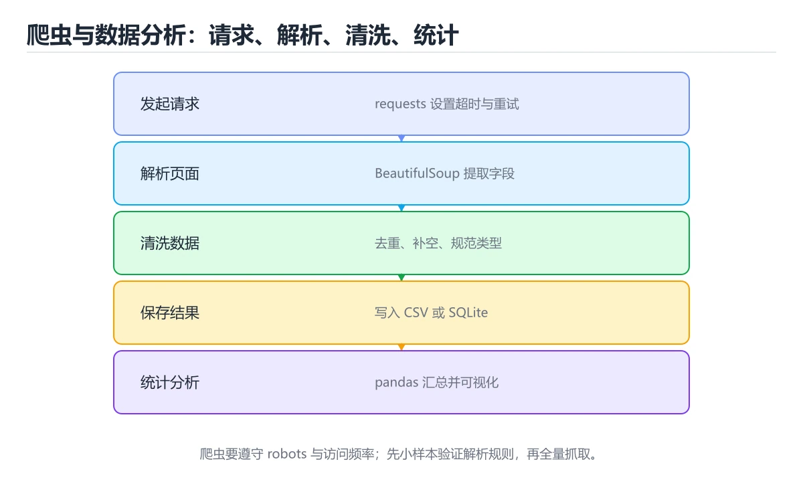
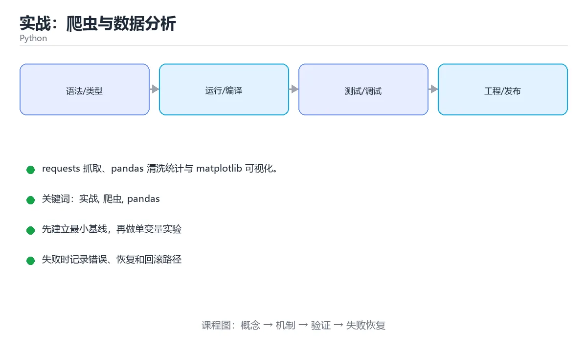

# 实战：爬虫与数据分析





> 内容更新时间：2026-10-03 · 学习阶段：高级 · 预计用时：18 分钟

## 学习目标

- 能用自己的话解释「实战：爬虫与数据分析」解决了什么问题，而不是只背术语。
- 能说清 「实战」、「爬虫」、「pandas」、「requests」 之间的关系，并分别举出一个例子。
- 能把本课知识放回「Python」的知识体系，说明它和相邻主题的边界。
- 能完成本课练习，并用验收标准检查自己的结果。

> 一句话摘要：requests 抓取、pandas 清洗统计与 matplotlib 可视化。

## 前置知识

- 先完成上一课《并发与异步》；如果已经掌握，可以直接用本课练习自测。
- 本课阶段：高级。建议具备同一方向的完整基础，能阅读较长的代码、配置或系统设计说明。
- 开始前先复习：实战、爬虫、pandas。
- 如果某一步看不懂，先记录具体卡点，完成练习后再回头读一遍。


## 项目目标

抓取公开数据 → 清洗成表格 → 统计与可视化。这是 Python 最常见的落地场景，涉及网络请求、数据处理与文件读写。

## 环境准备

```bash
python -m venv .venv
.venv\Scripts\activate
pip install requests beautifulsoup4 pandas matplotlib
pip freeze > requirements.txt
```

## 抓取与解析

```python
import requests
from bs4 import BeautifulSoup

def fetch_quotes(page=1):
    url = f"https://quotes.toscrape.com/page/{page}/"
    response = requests.get(url, timeout=10)
    response.raise_for_status()               # 4xx/5xx 直接抛异常
    soup = BeautifulSoup(response.text, "html.parser")
    items = []
    for quote in soup.select(".quote"):
        items.append({
            "text": quote.select_one(".text").get_text(strip=True),
            "author": quote.select_one(".author").get_text(strip=True),
            "tags": [tag.get_text(strip=True) for tag in quote.select(".tag")],
        })
    return items
```

要点：`timeout` 必填，`raise_for_status()` 检查状态码，选择器优先用稳定的 class 或 data 属性。

## 清洗与统计

```python
import pandas as pd

rows = [item for page in range(1, 4) for item in fetch_quotes(page)]
df = pd.DataFrame(rows)
df["quote_length"] = df["text"].str.len()
df["author"] = df["author"].str.strip()

print(df.head())
print(df.groupby("author")["quote_length"].mean().sort_values(ascending=False).head())

tags = df.explode("tags")
print(tags["tags"].value_counts().head(10))

df.to_csv("quotes.csv", index=False, encoding="utf-8-sig")   # Excel 友好
```

常见清洗动作：去空白、统一大小写、类型转换、缺失值处理（`fillna` / `dropna`）、去重（`drop_duplicates`）。

## 可视化

```python
import matplotlib.pyplot as plt

plt.rcParams["font.sans-serif"] = ["SimHei"]
plt.rcParams["axes.unicode_minus"] = False

top = tags["tags"].value_counts().head(10)
top.plot(kind="barh")
plt.title("出现最多的标签")
plt.tight_layout()
plt.savefig("tags.png", dpi=120)
```

## 工程化建议

1. 抓取遵守 robots.txt 与服务条款，控制频率、加 `User-Agent`。
2. 把「抓取 / 清洗 / 分析 / 输出」拆成独立函数，便于测试与复用。
3. 长任务加日志与断点续跑（把已抓数据落盘）。
4. 用 Jupyter Notebook 探索，定型后沉淀为 `.py` 模块。

## 本课小结
这个项目的价值在于把**请求、解析、DataFrame、可视化**串成完整链路。把它跑通，Python 的数据处理能力就入门了。


## requests 速查

| 目的 | 写法 |
| --- | --- |
| GET 请求 | `requests.get(url, params={"q": "x"}, timeout=5)` |
| POST JSON | `requests.post(url, json=payload, timeout=5)` |
| 表单提交 | `requests.post(url, data={"k": "v"})` |
| 自定义头 | `headers={"User-Agent": "..."}` |
| 检查状态 | `resp.raise_for_status()` |
| 解析 JSON | `resp.json()` |
| 读取文本 | `resp.text`（配合 `resp.encoding`） |
| 重试 | `HTTPAdapter` + `Retry` |
| 会话复用 | `with requests.Session() as s:` |
| 超时设置 | 元组 `(连接超时, 读取超时)` |

```python
import requests
from requests.adapters import HTTPAdapter
from urllib3.util.retry import Retry

session = requests.Session()
session.mount("https://", HTTPAdapter(max_retries=Retry(
    total=3, backoff_factor=0.5,
    status_forcelist=[429, 500, 502, 503, 504],
)))

try:
    resp = session.get("https://example.com/api/items",
                       params={"page": 1}, timeout=(3, 10))
    resp.raise_for_status()
    items = resp.json()["data"]
except requests.RequestException as exc:
    print("请求失败：", exc)
```

## pandas 速查

| 目的 | 写法 |
| --- | --- |
| 读 CSV / Excel | `pd.read_csv("a.csv")` / `pd.read_excel("a.xlsx")` |
| 查看概览 | `df.head()`、`df.info()`、`df.describe()` |
| 选列 | `df[["name", "price"]]` |
| 条件过滤 | `df[df["price"] > 100]` |
| 多条件 | `df[(df.a > 1) & (df.b == "x")]` |
| 分组聚合 | `df.groupby("category")["price"].mean()` |
| 透视表 | `df.pivot_table(index="cat", columns="month", values="price", aggfunc="sum")` |
| 排序 | `df.sort_values("price", ascending=False)` |
| 去重 | `df.drop_duplicates(subset=["id"])` |
| 缺失值 | `df.isna().sum()`、`df.fillna(0)`、`df.dropna()` |
| 新增列 | `df["total"] = df.price * df.qty` |
| 合并 | `df.merge(other, on="id", how="left")` |
| 应用函数 | `df["c"] = df.a.apply(lambda v: v * 2)` |
| 时间处理 | `pd.to_datetime(df.created_at)` |
| 导出 | `df.to_csv("out.csv", index=False, encoding="utf-8-sig")` |

## 常见错误对照表

| 容易写错的做法 | 实际现象 | 原因与正确做法 |
| --- | --- | --- |
| `requests.get` 不设超时 | 请求可能永久挂起 | 一律设置 `timeout=(连接, 读取)` |
| 忽略 `raise_for_status()` | 4xx/5xx 当成正常数据处理 | 显式检查状态码 |
| 频繁创建新连接 | 慢且容易被限流 | 复用 `Session` 并配置重试 |
| 高频请求不控制速率 | 被封 IP | 加延时与并发上限，遵守 robots 与条款 |
| `df["a"] > 1 and df["b"] == 2` | `ValueError: truth value is ambiguous` | 用 `&` 并给每个条件加括号 |
| 链式赋值 `df[df.a > 1]["b"] = 0` | `SettingWithCopyWarning`，改动可能丢失 | 用 `.loc[df.a > 1, "b"] = 0` |
| 逐行 `for` 遍历 DataFrame | 慢几十倍 | 用向量化或 `apply`，必要时 `numpy` |
| 忘记 `index=False` 导出 | CSV 多出一列索引 | 导出时显式指定 |
| 日期字段当字符串比较 | 排序与筛选结果错误 | 先 `pd.to_datetime` |
| 中文 CSV 在 Excel 打开乱码 | 编码不匹配 | 导出用 `utf-8-sig` |

## 自测清单

- [ ] 所有网络请求都设超时、重试与状态检查。
- [ ] 抓取前确认目标站点的 robots 与使用条款。
- [ ] 数据清洗优先向量化，避免逐行循环。
- [ ] 分组统计用 `groupby` + 聚合函数。
- [ ] 导出 CSV 指定编码与 `index=False`。


## 零基础详解：从零做一个 Python 小项目

### 一句话说清它是什么

一个能交付的 Python 项目，除了能跑，还要有：**清晰目录、依赖声明、配置外置、日志、测试、一键运行**。
下面用一个「日志分析 CLI」把这几件事串起来。

### 用生活比喻理解

| 目录 | 比喻 | 说明 |
| --- | --- | --- |
| `src/` | 车间 | 真正的代码 |
| `tests/` | 验收区 | 自动化测试 |
| `pyproject.toml` | 产品说明书 | 依赖、脚本、构建配置 |
| `.env.example` | 样例表单 | 告诉别人要配哪些变量 |
| `README.md` | 使用手册 | 怎么装、怎么跑 |

### 推荐目录结构

```text
loganalyzer/
  pyproject.toml
  README.md
  .env.example
  src/loganalyzer/
    __init__.py
    cli.py           命令行入口
    config.py        配置读取与校验
    parser.py        纯函数：解析日志行
    report.py        生成报表
  tests/
    test_parser.py
    test_report.py
```

### 依赖与入口声明

```toml
[project]
name = "loganalyzer"
version = "0.1.0"
requires-python = ">=3.11"
dependencies = ["httpx>=0.27"]

[project.optional-dependencies]
dev = ["pytest>=8", "pytest-cov>=6", "mypy>=1.11", "ruff>=0.6"]

[project.scripts]
loganalyzer = "loganalyzer.cli:main"

[tool.ruff]
line-length = 100
target-version = "py311"

[tool.pytest.ini_options]
addopts = "-q --cov=loganalyzer --cov-report=term-missing"
```

装完就能用命令行的 `loganalyzer` 命令，不用记 `python -m ...`。

### 把纯逻辑和 IO 分开

```python
# parser.py —— 纯函数，最容易测
import re
from dataclasses import dataclass
from datetime import datetime

LINE = re.compile(
    r"(?P<ts>\d{4}-\d{2}-\d{2} \d{2}:\d{2}:\d{2})\s+"
    r"(?P<level>INFO|WARN|ERROR)\s+(?P<msg>.*)"
)


@dataclass(frozen=True)
class Entry:
    ts: datetime
    level: str
    message: str


def parse_line(line: str) -> Entry | None:
    match = LINE.match(line.strip())
    if not match:
        return None
    return Entry(
        ts=datetime.strptime(match["ts"], "%Y-%m-%d %H:%M:%S"),
        level=match["level"],
        message=match["msg"],
    )
```

```python
# report.py —— 只做统计，不碰文件
from collections import Counter
from collections.abc import Iterable

from .parser import Entry


def summarize(entries: Iterable[Entry]) -> dict[str, object]:
    levels = Counter(e.level for e in entries)
    return {
        "total": sum(levels.values()),
        "levels": dict(levels),
    }
```

### 命令行入口

```python
# cli.py
import argparse
import logging
import sys
from pathlib import Path

from .parser import parse_line
from .report import summarize


def build_parser() -> argparse.ArgumentParser:
    parser = argparse.ArgumentParser(prog="loganalyzer", description="日志统计工具")
    parser.add_argument("path", type=Path, help="日志文件路径")
    parser.add_argument("-v", "--verbose", action="store_true", help="输出调试日志")
    return parser


def main(argv: list[str] | None = None) -> int:
    args = build_parser().parse_args(argv)
    logging.basicConfig(
        level=logging.DEBUG if args.verbose else logging.INFO,
        format="%(asctime)s %(levelname)s %(message)s",
    )

    if not args.path.is_file():
        logging.error("文件不存在：%s", args.path)
        return 2

    entries = []
    for lineno, line in enumerate(args.path.read_text(encoding="utf-8").splitlines(), 1):
        entry = parse_line(line)
        if entry is None:
            logging.debug("第 %d 行格式不符，已跳过", lineno)
            continue
        entries.append(entry)

    report = summarize(entries)
    print(f"总条数：{report['total']}")
    for level, count in sorted(report["levels"].items()):
        print(f"  {level}: {count}")
    return 0


if __name__ == "__main__":
    sys.exit(main())
```

**返回退出码而不是 `sys.exit()` 到处写**，这样测试可以直接调用 `main([...])`。

### 测试：先测纯函数

```python
# tests/test_parser.py
from loganalyzer.parser import parse_line


def test_parse_valid_line() -> None:
    entry = parse_line("2026-01-01 10:00:00 ERROR 数据库连接失败")
    assert entry is not None
    assert entry.level == "ERROR"
    assert entry.message == "数据库连接失败"


def test_invalid_line_returns_none() -> None:
    assert parse_line("这不是日志") is None


def test_trailing_space_is_tolerated() -> None:
    assert parse_line("2026-01-01 10:00:00 INFO  启动完成  ") is not None
```

### 一键质量检查

```bash
python -m venv .venv && source .venv/bin/activate
pip install -e ".[dev]"

ruff check src tests
ruff format --check src tests
mypy src
pytest
```

把这四条写进 `Makefile` 或 CI，团队里每个人跑的命令就一致了。

### 新手最容易踩的八个坑

| 坑 | 现象 | 正确做法 |
| --- | --- | --- |
| 代码放在仓库根目录 | 导入混乱 | 用 `src/` 布局 |
| 逻辑与 IO 混在一起 | 无法单测 | 抽出纯函数 |
| 依赖写在 requirements 但没版本 | 环境不可复现 | 用 pyproject 或锁定版本 |
| 用 print 当日志 | 无法分级与开关 | 用 logging |
| 出错只抛异常不给退出码 | CI 判断不了 | 返回明确的退出码 |
| 路径用字符串拼接 | 跨平台出错 | 用 `pathlib` |
| 忘记 `encoding` | 中文乱码 | 一律 utf-8 |
| 只跑一次手工测试 | 改了就坏 | 加 pytest 用例 |

### 学完自测

- [ ] 能说出 `src/` 布局的好处。
- [ ] 知道为什么要把解析函数与文件读取分开。
- [ ] 能说出 `[project.scripts]` 的作用。
- [ ] 知道为什么 `main` 要返回退出码而不是直接退出。
- [ ] 能列出提交前要跑的至少三条检查命令。

## 动手练习


> 本课练习重点：围绕「实战、爬虫、pandas」完成复述、实验和交付，每个结果都要能被别人检查。

先写可运行脚本，再用类型注解与测试保护核心函数，最后处理真实输入。

### 练习 1：建立心智模型（10 分钟）

合上教程，用 3～5 句话回答：

1. 「实战：爬虫与数据分析」解决了什么问题？
2. 如果没有它，会出现什么具体后果？
3. 它和「爬虫」是什么关系？

**验收标准**：至少出现一个本课关键词，并写出一个反例、边界条件或失效场景。

### 练习 2：做一次可控实验（20 分钟）

从正文中选一个最小示例，完成以下操作：

1. 先预测修改一个参数、输入或步骤后的结果。
2. 再实际执行或逐步推演，记录真实结果。
3. 如果结果与预测不同，写出差异原因。

**验收标准**：留下「原例 → 改动 → 预测 → 结果 → 原因」五步记录。

### 练习 3：交付一个小结果（30 分钟）

写一个 20 行以内的小脚本，把本课概念用于处理一份真实文本或列表数据。

任务要求：

- 结果必须能被别人检查，不能只写“我已经理解了”。
- 至少覆盖「实战」和「爬虫」两个关键词。
- 写出 1 个仍然不确定的问题，以及下一步如何验证。

> 提示：时间有限时优先做练习 1 和练习 2；练习 3 可以拆成两次完成。


## 验证命令与预期输出

项目代码不能只看“能编译”，还要能按固定命令复现结果。下表给出最低验证集：

| 阶段 | 命令 | 预期输出 |
| --- | --- | --- |
| 安装依赖 | `python -m pip install -r requirements.txt` | 依赖安装完成，没有版本冲突 |
| 语法检查 | `python -m compileall .` | 所有模块编译通过 |
| 运行测试 | `python -m pytest -q` | 测试全部通过，失败用例数为 0 |
| 启动示例 | `python main.py` | 服务启动并输出监听地址 |

### 验收证据

- [ ] 保存依赖安装和启动命令的完整输出。
- [ ] 至少运行 3 条测试，其中包含一条非法输入或失败路径。
- [ ] 重复执行同一操作两次，确认没有重复写入或副作用。
- [ ] 记录一次失败状态码、错误日志和恢复步骤。
- [ ] 在 README 中写明环境版本、启动方式和回滚方式。

### 回归与回滚

1. 先在一个可丢弃的目录或临时数据库执行，避免污染真实数据。
2. 修改一处逻辑后重跑全部验证命令，确认没有回归。
3. 若失败，回滚到上一个可运行版本并保留失败日志。
4. 定位原因后补一条自动化测试，再重新执行发布流程。
5. 把教训写入项目复盘或本课笔记，形成下一次的检查项。


## 可运行练习

下面 3 个任务围绕“实战：爬虫与数据分析”展开，代码可以直接粘贴到 App 的离线沙箱里运行；如果示例会读取标准输入，请按代码注释在沙箱的 stdin 区域填入同样格式的数据。

### 任务 1：先跑通，再解释

```python
import requests
from bs4 import BeautifulSoup

def fetch_quotes(page=1):
    url = f"https://quotes.toscrape.com/page/{page}/"
    response = requests.get(url, timeout=10)
    response.raise_for_status()               # 4xx/5xx 直接抛异常
    soup = BeautifulSoup(response.text, "html.parser")
    items = []
    for quote in soup.select(".quote"):
        items.append({
            "text": quote.select_one(".text").get_text(strip=True),
            "author": quote.select_one(".author").get_text(strip=True),
            "tags": [tag.get_text(strip=True) for tag in quote.select(".tag")],
        })
    return items
```

**预期输出**：运行后会输出与“实战：爬虫与数据分析”相关的关键结果；请重点核对输出行数、最后一个数值和异常提示。

**验收标准**：代码能正常运行；逐行解释每个变量的值如何变化，并指出哪一行决定了最终结果。

### 任务 2：只改一个条件

复制上面的代码，只修改一个输入、边界或参数（例如空值、最大值、循环次数、过滤条件），先写出你的预测，再实际运行。

**验收标准**：留下“原结果 → 改动 → 预测 → 实际结果 → 差异原因”五步记录；如果预测错误，要写出修正后的心智模型。

### 任务 3：迁移到自己的数据

用同一套思路处理一组你自己的数据或场景，保持输出格式与任务 1 一致。

**验收标准**：代码不少于 10 行，至少包含 1 个边界检查；把代码和运行结果保存到笔记或片段库。


## 故障现场

这一节把“实战：爬虫与数据分析”最常见的失败方式还原成现场记录，练习时按“症状 → 复现 → 定位 → 修复 → 预防”的顺序排查。

### 现场 1：“实战：爬虫与数据分析”的 实战 常规用例通过，但边界用例失败

**症状**：在“实战：爬虫与数据分析”的练习或生产场景里出现““实战：爬虫与数据分析”的 实战 常规用例通过，但边界用例失败”。

**复现**：准备一组最小输入，只保留触发““实战：爬虫与数据分析”的 实战 常规用例通过，但边界用例失败”的必要条件，连续运行两次确认结果稳定。

**定位**：围绕“实战 的前置条件与取值边界没有写进代码，默认值掩盖了空值和极值”检查调用链、输入数据和环境配置，先验证假设再改代码。

**修复**：为“实战：爬虫与数据分析”补一条空值或极值用例，把前置条件写成断言，并让失败信息直接指出是哪个输入越界

**预防**：把““实战：爬虫与数据分析”的 实战 常规用例通过，但边界用例失败”写成一条自动化用例，并在“实战：爬虫与数据分析”的验收清单里保留对应检查项。


### 现场 2：“实战：爬虫与数据分析”的 爬虫 结果在两次运行之间不一致

**症状**：在“实战：爬虫与数据分析”的练习或生产场景里出现““实战：爬虫与数据分析”的 爬虫 结果在两次运行之间不一致”。

**复现**：准备一组最小输入，只保留触发““实战：爬虫与数据分析”的 爬虫 结果在两次运行之间不一致”的必要条件，连续运行两次确认结果稳定。

**定位**：围绕“爬虫 依赖了当前版本、执行顺序或共享状态，单次运行无法暴露差异”检查调用链、输入数据和环境配置，先验证假设再改代码。

**修复**：固定“实战：爬虫与数据分析”使用的版本与随机种子，记录两次运行的完整输入和输出，再逐项消除非确定性来源

**预防**：把““实战：爬虫与数据分析”的 爬虫 结果在两次运行之间不一致”写成一条自动化用例，并在“实战：爬虫与数据分析”的验收清单里保留对应检查项。


### 现场 3：“实战：爬虫与数据分析”的验证只在开发机通过

**症状**：在“实战：爬虫与数据分析”的练习或生产场景里出现““实战：爬虫与数据分析”的验证只在开发机通过”。

**复现**：准备一组最小输入，只保留触发““实战：爬虫与数据分析”的验证只在开发机通过”的必要条件，连续运行两次确认结果稳定。

**定位**：围绕“环境版本、配置和输入规模与目标环境不同，实战 缺少可重复的验证记录”检查调用链、输入数据和环境配置，先验证假设再改代码。

**修复**：把“实战：爬虫与数据分析”的运行环境、输入样本和预期输出写成清单，并在另一套环境复跑同一条命令

**预防**：把““实战：爬虫与数据分析”的验证只在开发机通过”写成一条自动化用例，并在“实战：爬虫与数据分析”的验收清单里保留对应检查项。


## 版本与时效

这一节记录“实战：爬虫与数据分析”涉及的版本基线与升级检查点，避免把某个版本的默认行为当成永久结论。

- Python 3.14 为当前主线，3.15 处于预发布阶段；生产环境锁定 3.13/3.14 的补丁版本
- 自由线程（no-GIL）与实验性 JIT 仍在演进，升级前先跑并发与 C 扩展兼容测试
- 类型标注、tomllib、pathlib 与 asyncio 是近年变化最集中的区域
- 官方发布说明：https://docs.python.org/3/whatsnew/

### 升级检查清单

- 先固定当前版本，跑通全部示例与测验，再升级工具链。
- 只改一个版本变量，记录编译、测试、性能与产物体积的变化。
- 重点回归默认值、弃用警告、序列化格式、并发语义和错误信息。
- 升级完成后更新本课的“最后复核 / 下次复核”日期与版本说明。


## 考点精讲：把测验题还原成判断过程

本课有 6 个判断点。先自己作答，再看「判断依据」；如果结论正确但理由不完整，回到正文对应章节补足概念。

### 考点 1：用 requests 发起请求时，下面哪项是必须的？

- **正确判断**：设置 timeout 并检查状态码
- **判断依据**：正确答案是「设置 timeout 并检查状态码」，本课在「抓取与解析」中说明：要点：timeout 必填，raiseforstatus() 检查状态码，选择器优先用稳定的 class 或 data 属性。timeout 防止请求悬挂，raiseforstatus() 让 4xx/5xx 立刻暴露。本课还在「项目专属规格：实战：爬虫与数据分析」中说明：requests 抓取、pandas 清洗统计与 matplotlib 可视化。
- **迁移检查**：把题干里的一个条件换成边界值，原来的结论还成立吗？写出判断过程。

### 考点 2：pandas 中按作者分组求均值应使用？

- **正确判断**：df.groupby('author')['x'].mean()
- **判断依据**：正确答案是「df.groupby('author')['x'].mean()」，本课在「项目专属规格：实战：爬虫与数据分析」中说明：requests 抓取、pandas 清洗统计与 matplotlib 可视化。groupby 用于分组聚合，是数据分析最常用的操作。本课还在「项目目标」中说明：抓取公开数据 → 清洗成表格 → 统计与可视化。本课还在「本课小结」中说明：这个项目的价值在于把请求、解析、DataFrame、可视化串成完整链路。
- **迁移检查**：遮住选项，只根据定义复述一次答案，再回来看哪个选项与复述一致。

### 考点 3：编写爬虫时最应该遵守的是？

- **正确判断**：遵守 robots.txt
- **判断依据**：正确答案是「遵守 robots.txt」，本课在「工程化建议」中说明：抓取遵守 robots.txt 与服务条款，控制频率、加 User-Agent。合法合规与不过度施压是爬虫的基本要求。本课还在「项目目标」中说明：抓取公开数据 → 清洗成表格 → 统计与可视化。本课还在「项目目标」中说明：这是 Python 最常见的落地场景，涉及网络请求、数据处理与文件读写。
- **迁移检查**：如果给某个错误选项去掉一个限定词，它会不会变成正确？说明理由。

### 考点 4：给 requests 请求设置 timeout 的意义是？

- **正确判断**：避免网络异常时请求无限期挂起
- **判断依据**：正确答案是「避免网络异常时请求无限期挂起」，本课在「本课小结」中说明：这个项目的价值在于把请求、解析、DataFrame、可视化串成完整链路。生产脚本必须设置超时与重试，否则一个慢请求就可能卡住整个任务。本课还在「项目目标」中说明：这是 Python 最常见的落地场景，涉及网络请求、数据处理与文件读写。本课还在「工程化建议」中说明：把「抓取 / 清洗 / 分析 / 输出」拆成独立函数，便于测试与复用。
- **迁移检查**：把题干里的一个条件换成边界值，原来的结论还成立吗？写出判断过程。

### 考点 5：pandas 中把 DataFrame 保存成 CSV 的方法是？

- **正确判断**：df.to_csv('out.csv', index=False)
- **判断依据**：正确答案是「df.to_csv('out.csv', index=False)」，本课在「工程化建议」中说明：长任务加日志与断点续跑（把已抓数据落盘）。tocsv 是写出方法，index=False 可避免多出一列行号。本课还在「本课小结」中说明：把它跑通，Python 的数据处理能力就入门了。本课还在「零基础详解：从零做一个 Python 小项目」中说明：一个能交付的 Python 项目，除了能跑，还要有：清晰目录、依赖声明、配置外置、日志、测试、一键运行。
- **迁移检查**：如果给某个错误选项去掉一个限定词，它会不会变成正确？说明理由。

### 考点 6：补全代码：「实战：爬虫与数据分析」示例中，下面这行代码缺少哪个关键字或函数名？请填入 ____。 `response.____() # 4xx/5xx 直接抛异常`

- **正确判断**：raise_for_status
- **判断依据**：正确答案是「raise_for_status」，本课在「零基础详解：从零做一个 Python 小项目」中说明：返回退出码而不是 sys.exit() 到处写，这样测试可以直接调用 main([...])。本课还在「零基础详解：从零做一个 Python 小项目」中说明：知道为什么 main 要返回退出码而不是直接退出。本课还在「零基础详解：从零做一个 Python 小项目」中说明：装完就能用命令行的 loganalyzer 命令，不用记 python -m ...。
- **迁移检查**：把答案换成另一种等价写法，是否仍然正确？说明依据。

### 补充自测（2 题）

1. 围绕“实战：爬虫与数据分析”中的 实战、爬虫、pandas，下列哪两项是本课强调的实践判断？
2. 下面这段 Python 代码复现了“实战：爬虫与数据分析”中 实战、爬虫、pandas 相关的一个常见故障，哪一项最准确地解释了问题？

这些题按“先定位概念、再排除边界错误、最后核对答案”的顺序作答；每题解析都给出了判断依据。


## 本课复习清单

离开本课前，逐项确认：

- [ ] 不看解析，能说出「用 requests 发起请求时，下面哪项是必须的？」的判断依据。
- [ ] 不看解析，能说出「pandas 中按作者分组求均值应使用？」的判断依据。
- [ ] 不看解析，能说出「编写爬虫时最应该遵守的是？」的判断依据。
- [ ] 不看解析，能说出「给 requests 请求设置 timeout 的意义是？」的判断依据。
- [ ] 不看解析，能说出「pandas 中把 DataFrame 保存成 CSV 的方法是？」的判断依据。
- [ ] 不看解析，能说出「补全代码：「实战：爬虫与数据分析」示例中，下面这行代码缺少哪个关键字或函数名？请…」的判断依据。
- [ ] 至少运行一次本课示例，记录输入、输出和一个边界情况。
- [ ] 把本课最容易混淆的两个概念写成一句话对照。

| 复盘项 | 记录 |
| --- | --- |
| 已经能独立解释的考点 |  |
| 仍然说不清的概念 |  |
| 下一步验证动作 |  |

## 术语速查

把本课反复出现的术语集中放在一起。复习时先遮住右列，尝试用自己的话解释，再回到正文核对。

| 术语 | 本课语境 |
| --- | --- |
| `timeout` | 要点：`timeout` 必填，`raise_for_status()` 检查状态码，选择器优先用稳定的 class 或 data 属性。 |
| `raise_for_status()` | 要点：`timeout` 必填，`raise_for_status()` 检查状态码，选择器优先用稳定的 class 或 data 属性。 |
| `fillna` | 常见清洗动作：去空白、统一大小写、类型转换、缺失值处理（`fillna` / `dropna`）、去重（`drop_duplicates`）。 |
| `dropna` | 常见清洗动作：去空白、统一大小写、类型转换、缺失值处理（`fillna` / `dropna`）、去重（`drop_duplicates`）。 |
| `drop_duplicates` | 常见清洗动作：去空白、统一大小写、类型转换、缺失值处理（`fillna` / `dropna`）、去重（`drop_duplicates`）。 |
| `User-Agent` | 抓取遵守 robots.txt 与服务条款，控制频率、加 `User-Agent`。 |
| `.py` | 用 Jupyter Notebook 探索，定型后沉淀为 `.py` 模块。 |
| `requests.post(url, data={"k": "v"})` | \| 表单提交 \| `requests.post(url, data={"k": "v"})` \| |
| `headers={"User-Agent": "..."}` | \| 自定义头 \| `headers={"User-Agent": "..."}` \| |
| `resp.raise_for_status()` | \| 检查状态 \| `resp.raise_for_status()` \| |
| `resp.json()` | \| 解析 JSON \| `resp.json()` \| |
| `resp.text` | \| 读取文本 \| `resp.text`（配合 `resp.encoding`） \| |

## 面试问答与自测

下面把本课考点换成面试追问。先口述自己的答案，
再对照参考回答检查是否遗漏了前提、边界或失败路径。

### 追问 1：用 requests 发起请求时，下面哪项是必须的？

**参考回答**：正确答案是「设置 timeout 并检查状态码」，本课在「抓取与解析」中说明：要点：timeout 必填，raiseforstatus() 检查状态码，选择器优先用稳定的 class 或 data 属性。timeout 防止请求悬挂，raiseforstatus() 让 4xx/5xx 立刻暴露。本课还在「项目专属规格·实战·爬虫与数据分析」中说明：requests 抓取、pandas 清洗统计与 matplotlib 可视化。

### 追问 2：pandas 中按作者分组求均值应使用？

**参考回答**：正确答案是「df.groupby('author')['x'].mean()」，本课在「项目专属规格·实战·爬虫与数据分析」中说明：requests 抓取、pandas 清洗统计与 matplotlib 可视化。groupby 用于分组聚合，是数据分析最常用的操作。本课还在「项目目标」中说明：抓取公开数据 → 清洗成表格 → 统计与可视化。本课还在「本课小结」中说明：这个项目的价值在于把请求、解析、DataFrame、可视化串成完整链路。

### 追问 3：编写爬虫时最应该遵守的是？

**参考回答**：正确答案是「遵守 robots.txt」，本课在「工程化建议」中说明：抓取遵守 robots.txt 与服务条款，控制频率、加 User-Agent。合法合规与不过度施压是爬虫的基本要求。本课还在「项目目标」中说明：抓取公开数据 → 清洗成表格 → 统计与可视化。本课还在「项目目标」中说明：这是 Python 最常见的落地场景，涉及网络请求、数据处理与文件读写。

### 追问 4：给 requests 请求设置 timeout 的意义是？

**参考回答**：正确答案是「避免网络异常时请求无限期挂起」，本课在「本课小结」中说明：这个项目的价值在于把请求、解析、DataFrame、可视化串成完整链路。生产脚本必须设置超时与重试，否则一个慢请求就可能卡住整个任务。本课还在「项目目标」中说明：这是 Python 最常见的落地场景，涉及网络请求、数据处理与文件读写。本课还在「工程化建议」中说明：把「抓取 / 清洗 / 分析 / 输出」拆成独立函数，便于测试与复用。

### 追问 5：pandas 中把 DataFrame 保存成 CSV 的方法是？

**参考回答**：正确答案是「df.to_csv('out.csv', index=False)」，本课在「工程化建议」中说明：长任务加日志与断点续跑（把已抓数据落盘）。tocsv 是写出方法，index=False 可避免多出一列行号。本课还在「本课小结」中说明：把它跑通，Python 的数据处理能力就入门了。本课还在「零基础详解·从零做一个 Python 小项目」中说明：一个能交付的 Python 项目，除了能跑，还要有：清晰目录、依赖声明、配置外置、日志、测试、一键运行。

## English Overview

**Title:** Project: Scraping & Data

**Summary:** Scrape, clean, analyze and visualize data.

**Category:** Python  
**Level:** 高级  
**Key terms:** 实战, 爬虫, pandas, requests, 可视化

> The full tutorial is written in Chinese. This bilingual overview helps English readers identify the topic, scope and key terms before studying the detailed examples.

## 内容元数据

- 内容版本：v2.0
- 最后更新：2026-10-03
- 学习阶段：高级
- 适用环境：Python 3.12+
- 内容来源：内置结构化课程与工程实践整理
- 相关主题：实战、爬虫、pandas、requests、可视化
- 质量版本：P0 测验标准 + P1 覆盖扩展 + P2 体验补全

## 项目专属规格：实战：爬虫与数据分析

### 核心场景

requests 抓取、pandas 清洗统计与 matplotlib 可视化。 项目目标是把「实战、爬虫、pandas、requests、可视化」落实为可运行、可测试、可回滚的交付物。

### 架构与数据流

```text
用户/输入 → 接口或命令 → 领域逻辑 → 存储/外部依赖 → 输出与监控
                         ↘ 失败分类 → 重试/补偿 → 回滚
```

### 最小数据模型

| 对象 | 关键字段 | 约束 |
| --- | --- | --- |
| 输入实体 | 实战、时间、来源 | 必填校验、长度限制、幂等键 |
| 任务实体 | 状态、优先级、创建时间 | 状态迁移合法、不可重复执行 |
| 结果实体 | 输出、错误码、耗时 | 可序列化、错误可解释 |
| 审计记录 | 操作者、动作、结果、时间 | 不可篡改、可查询、脱敏 |

### 验收场景

1. 正常路径：最小输入得到预期输出，并留下日志与指标。
2. 边界路径：空值、最大值、重复数据和超长内容得到明确处理。
3. 失败路径：依赖超时或不可用时能快速失败、重试或降级。
4. 幂等路径：同一请求执行两次不会产生重复副作用。
5. 回滚路径：回滚后数据一致，且能说明恢复时间和影响范围。


## 项目交付物

### 建议仓库结构

```text
app/
  api/
  domain/
  infra/
tests/
README.md
```

### 测试矩阵

| 层级 | 覆盖内容 | 最低数量 | 通过标准 |
| --- | --- | ---: | --- |
| 单元测试 | 领域规则、边界和错误分类 | 8 | 正常、边界、失败路径全部通过 |
| 集成测试 | 数据库、网络、文件或平台边界 | 3 | 使用真实边界且可重复运行 |
| 端到端测试 | 核心用户路径 | 1 | 从输入到输出完整跑通 |
| 手动验收 | 文档中列出的 5 个场景 | 5 | 有命令、输出和结论记录 |

### 验收数据

```json
{
  "project": "python_project",
  "input": {"case": "normal", "value": 5},
  "expected": {"ok": true, "result": 5},
  "failure_case": {"value": -1, "error": "validation_error"},
  "idempotency_key": "demo-001"
}
```

### 复盘模板

| 问题 | 记录 |
| --- | --- |
| 原目标是什么？ | 用一句话描述可验收目标 |
| 实际发生了什么？ | 时间线、指标和关键日志 |
| 哪个假设被推翻？ | 根因与促成因素 |
| 如何回滚？ | 步骤、耗时和数据校验 |
| 下一步做什么？ | 负责人、期限和验证方式 |

> 项目验收围绕「实战、爬虫、pandas」：至少完成一次正常路径、一次边界输入、一次失败恢复和一次幂等检查。


## Full English Study Guide

### Overview

**Project: Scraping & Data** focuses on Scrape, clean, analyze and visualize data.

### Learning Outcomes

- Explain what **Project: Scraping & Data** solves and when it should be used.
- Identify inputs, outputs, state and failure boundaries.
- Build a minimal reproducible example and observe the real result.
- Test normal, boundary and failure paths.
- Measure performance, resource cost or security impact before optimizing.
- Document the decision, rollback path and remaining uncertainty.

### Core Mental Model

1. **Problem first:** define the exact problem before choosing a tool or pattern.
2. **Smallest example:** reduce the system to one input and one observable output.
3. **State and flow:** trace how data, control or responsibility moves through the system.
4. **Boundaries:** identify invalid input, resource limits, timeouts and permission edges.
5. **Evidence:** use tests, logs, metrics or reproductions instead of intuition.
6. **Trade-offs:** compare correctness, latency, cost, complexity and operability.

### Step-by-step Study Plan

1. Read the Chinese lesson once and write down the main problem in one sentence.
2. Run the smallest example and save the exact command and output.
3. Change only one input or parameter and predict the result before running it.
4. Introduce one failure and record how the system detects, reports and recovers.
5. Write one test or checklist item for the normal, boundary and failure paths.
6. Complete the quiz and explain every wrong answer in your own words.

### Practice Tasks

- Rebuild the minimal example from an empty directory.
- Add one boundary test and one failure test.
- Produce a short report containing the baseline, change, result and rollback.

### Common Failure Modes

- Treating a happy-path demo as production readiness.
- Skipping boundary values and invalid inputs.
- Optimizing before establishing a measurable baseline.
- Hiding errors, permissions or resource limits.

### Self-check Questions

1. What is the smallest observable result that proves this lesson works?
2. What input or state is most likely to break it?
3. Which metric or test would reveal a regression?
4. What is the rollback path?
5. What is the cost of using this approach at 10x scale?
6. Which adjacent topic is most often confused with this one?

### Glossary

- Topic: **Project: Scraping & Data**
- Related terms: 实战, 爬虫, pandas, requests
- Primary evidence: command output, tests, logs, metrics or reproductions

> This guide is an English study companion for the detailed Chinese lesson. It covers the learning path, mental model and acceptance questions; code examples and engineering details remain in the main tutorial.


## Bilingual Section Outline

| 中文小节 | English section |
| --- | --- |
| 学习目标 | Learning objectives |
| 前置知识 | Prerequisites |
| 项目目标 | 项目目标 |
| 环境准备 | 环境准备 |
| 抓取与解析 | 抓取与解析 |
| 清洗与统计 | 清洗与统计 |
| 可视化 | 可视化 |
| 工程化建议 | 工程化建议 |
| 本课小结 | Summary |
| requests 速查 | requests 速查 |

> 该大纲把每个中文小节映射为英文标题，配合 Full English Study Guide 使用。


## 参考资料与复核

- 最后复核：2026-10-04
- 下次复核：2027-04-04
- 复核范围：版本兼容、API 行为、安全建议与工程实践
- 来源性质：官方文档与标准；本课正文为离线教学重组，不复制原文

| 参考资料 | 本课用途 |
| --- | --- |
| [Python 官方文档](https://docs.python.org/3/) | 语言、标准库与版本行为 |
| [Python Packaging](https://packaging.python.org/) | 包管理与发布 |

> 本课主题：requests 抓取、pandas 清洗统计与 matplotlib 可视化。

> App 完全离线展示文字链接，不会自动联网；需要延伸阅读时可复制链接到浏览器。
