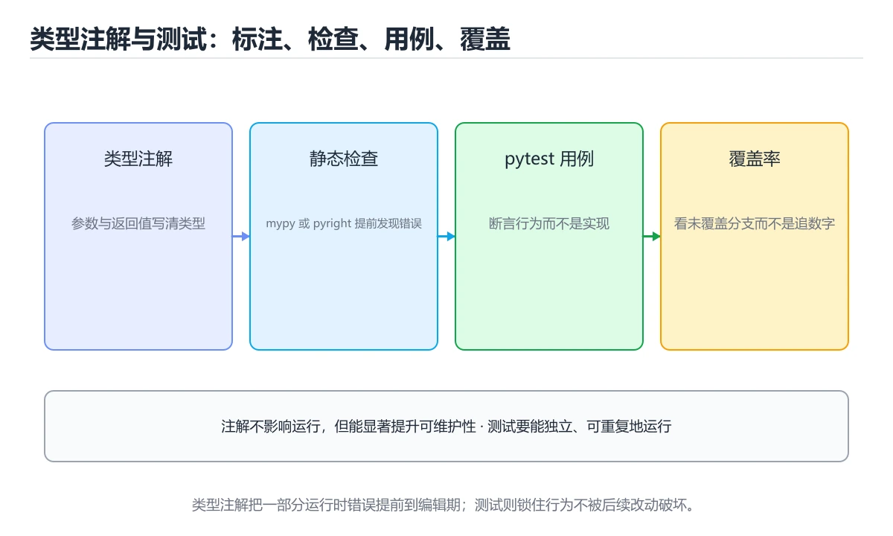
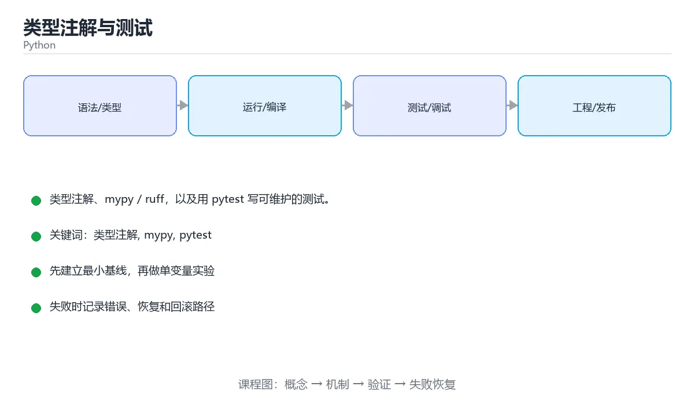

# 类型注解与测试

> 内容更新时间：2026-10-06





## 学习目标

- 能用自己的话解释类型注解与测试解决了什么问题，而不是只背术语。
- 能说清 「类型注解」、「mypy」、「pytest」、「ruff」 之间的关系，并分别举出一个例子。
- 能把本课知识放回「Python」的知识体系，说明它和相邻主题的边界。
- 能完成本课练习，并用验收标准检查自己的结果。

> 一句话摘要：类型注解、mypy / ruff，以及用 pytest 写可维护的测试。

## 前置知识

- 先完成上一课《模块、包与虚拟环境》；如果已经掌握，可以直接用本课练习自测。
- 本课阶段：进阶。建议先掌握同一分类的基础课程，并能独立运行正文中的最小示例。
- 开始前先复习：类型注解、mypy、pytest。
- 如果某一步看不懂，先记录具体卡点，完成练习后再回头读一遍。

## 为什么要类型注解

Python 是动态类型语言，但可以写类型注解让 IDE 和静态检查工具提前发现问题。注解**不影响运行**，只是给人和工具看的契约。

```python
def greet(name: str, times: int = 1) -> str:
    return f"你好，{name}！" * times

age: int = 18
scores: list[float] = [90.5, 88.0]
user: dict[str, str] = {"name": "小明"}
maybe: str | None = None      # Python 3.10+ 的联合类型写法
```

复杂类型用 `typing` 模块：

```python
from typing import Callable, Iterable, Protocol

def apply(func: Callable[[int], int], items: Iterable[int]) -> list[int]:
    return [func(x) for x in items]

class Reader(Protocol):        # 结构化类型：只要实现了 read 就算
    def read(self) -> str: ...
```

## 静态检查工具

```bash
pip install mypy
mypy app.py                    # 类型检查

pip install ruff
ruff check .                   # 代码检查 + 导入排序
ruff format .                  # 格式化（也可用 black）
```

建议在 `pyproject.toml` 中统一配置：

```toml
[tool.ruff]
line-length = 100
target-version = "py311"

[tool.mypy]
python_version = "3.11"
strict = true
```

## 用 pytest 写测试

```python
# calculator.py
def divide(a: float, b: float) -> float:
    if b == 0:
        raise ZeroDivisionError("除数不能为 0")
    return a / b
```

```python
# test_calculator.py
import pytest
from calculator import divide

def test_divide():
    assert divide(10, 2) == 5

def test_divide_by_zero():
    with pytest.raises(ZeroDivisionError):
        divide(1, 0)

@pytest.mark.parametrize("a, b, expected", [(6, 3, 2), (5, 2, 2.5)])
def test_divide_cases(a, b, expected):
    assert divide(a, b) == expected
```

```bash
pip install pytest
pytest -q                      # 运行测试
pytest --cov=. --cov-report=term    # 覆盖率
```

标准库的 `unittest` 也能用，语法更啰嗦但无需第三方依赖；`doctest` 则可以直接运行文档字符串里的示例。

## 本课小结
类型注解 + mypy 让错误在运行前暴露，pytest 让改动有回归保障。这两件事是 Python 项目从脚本走向工程的分界线。

## 类型注解速查

| 写法 | 含义 |
| --- | --- |
| `def f(x: int) -> str:` | 参数与返回值注解 |
| `list[int]` / `dict[str, int]` | 内置泛型（Python 3.9+） |
| `int \| None` | 可空类型（Python 3.10+） |
| `Optional[int]` | 等价写法，需 `from typing import Optional` |
| `Union[int, str]` | 联合类型 |
| `Literal["a", "b"]` | 只能是给定字面量之一 |
| `TypedDict` | 描述字典的键与值类型 |
| `Protocol` | 结构化子类型（鸭子类型检查） |
| `TypeVar` | 泛型参数 |
| `Callable[[int], str]` | 函数类型 |
| `Any` | 关闭类型检查，尽量少用 |
| `cast(int, x)` | 显式断言类型，不做运行时校验 |

```python
from dataclasses import dataclass

@dataclass
class User:
    id: int
    name: str
    tags: list[str]

def find_user(users: list[User], user_id: int) -> User | None:
    return next((u for u in users if u.id == user_id), None)
```

## pytest 速查

| 目的 | 写法 |
| --- | --- |
| 断言 | `assert result == expected` |
| 断言异常 | `with pytest.raises(ValueError): ...` |
| 断言近似相等 | `assert value == pytest.approx(0.1 + 0.2)` |
| 参数化 | `@pytest.mark.parametrize("a,b,expected", [(1, 2, 3)])` |
| 夹具 | `@pytest.fixture` + 测试函数同名参数 |
| 夹具清理 | 夹具内 `yield` 之后写清理逻辑 |
| 临时目录 | 使用内置夹具 `tmp_path` |
| 跳过用例 | `@pytest.mark.skip(reason="待实现")` |
| 条件跳过 | `@pytest.mark.skipif(sys.version_info < (3, 11), ...)` |
| 预期失败 | `@pytest.mark.xfail(reason="已知问题")` |
| 分组标记 | `@pytest.mark.slow`，运行 `pytest -m slow` |
| 只看失败 | `pytest -x` 或 `pytest --lf` |
| 覆盖率 | `pytest --cov=myapp --cov-report=term-missing` |

```python
import pytest

@pytest.fixture
def users(tmp_path):
    db = {"u1": {"name": "小明"}}
    yield db
    db.clear()                     # 测试结束后清理

@pytest.mark.parametrize(
    "raw,expected",
    [("1", 1), (" 42 ", 42), ("0", 0)],
)
def test_parse_int(raw, expected):
    assert int(raw) == expected

def test_missing_key_raises(users):
    with pytest.raises(KeyError):
        users["nobody"]
```

## 常见错误对照表

| 容易写错的做法 | 实际现象 | 原因与正确做法 |
| --- | --- | --- |
| 以为注解会做运行时校验 | 传错类型也不报错 | 注解只是给类型检查器，运行时校验用 pydantic 或手写断言 |
| `list[int]` 用在 Python 3.8 | `TypeError` | 用 `from __future__ import annotations` 或 `List[int]` |
| `def f(x: int = None)` | 类型检查告警 | 应写 `int \| None = None` |
| 一个测试里断言十件事 | 失败后不知道哪一步出问题 | 一个测试聚焦一个行为 |
| 测试之间共享可变状态 | 用例顺序一换就失败 | 每个用例自建数据，夹具内清理 |
| 用 `print` 调试测试 | 默认不显示输出 | 用 `pytest -s` 或断言失败信息 |
| 只测正常路径 | 边界与异常没人管 | 补空输入、边界值与异常路径 |
| 覆盖率 100% 就放心 | 断言可能没检查关键结果 | 关注断言质量，必要时做变异测试 |
| 测试依赖真实网络或数据库 | 不稳定、慢 | 用假实现或本地容器，测试保持离线 |
| 忘记装开发依赖 | `ModuleNotFoundError: pytest` | 用 `requirements-dev.txt` 或 `pyproject` 分组声明 |

## 自测清单

- [ ] 公开函数都写了参数与返回值注解。
- [ ] 会用 `pytest.raises` 与 `pytest.approx`。
- [ ] 参数化替代重复的测试函数。
- [ ] 测试之间互不影响，可任意顺序执行。
- [ ] 本地跑 `mypy` / `ruff` 与 `pytest` 后再提交。

## 零基础详解：类型注解与自动化测试

### 一句话说清它是什么

类型注解是**写给工具和同事看的说明书**，运行时不强制，但能让编辑器提前报错；
自动化测试则是**写给未来的自己**的安全网，改代码时立刻知道有没有弄坏别的东西。

### 用生活比喻理解

| 概念 | 比喻 | 说明 |
| --- | --- | --- |
| 类型注解 | 货物标签 | 标明里面装什么，便于检查 |
| mypy / pyright | 质检员 | 静态检查类型是否自相矛盾 |
| dataclass | 标准表格模板 | 少写一堆样板代码 |
| pytest | 自动化验收员 | 一条命令跑完全部断言 |
| fixture | 公共准备工作 | 复用测试前置条件 |

### 类型注解速查

```python
from collections.abc import Iterable, Sequence
from typing import Optional, Union

def greet(name: str, times: int = 1) -> str:
    return f"你好，{name}！" * times

def total(nums: Sequence[float]) -> float:
    return sum(nums)

def find_user(uid: int) -> Optional[dict[str, str]]:    # 可能返回 None
    return None

Number = Union[int, float]        # Python 3.10+ 可写 int | float
def twice(n: Number) -> Number:
    return n * 2

def names(users: Iterable[dict[str, str]]) -> list[str]:
    return [u["name"] for u in users]
```

| 写法 | 含义 |
| --- | --- |
| `list[str]` | 字符串列表 |
| `dict[str, int]` | 键字符串、值整数的字典 |
| `Optional[X]` 或 `X \| None` | 可能是 X 或 None |
| `Sequence[X]` | 只读序列，列表元组都行 |
| `Callable[[int], str]` | 输入 int、返回 str 的函数 |
| `TypeVar("T")` | 泛型占位 |

### dataclass：数据类少写样板

```python
from dataclasses import dataclass, field

@dataclass(frozen=True)                 # 不可变，可作字典键
class Point:
    x: float
    y: float

@dataclass
class Order:
    customer: str
    items: list[str] = field(default_factory=list)   # 可变默认值必须这样写
    paid: bool = False

    @property
    def item_count(self) -> int:
        return len(self.items)

print(Point(1, 2) == Point(1, 2))       # True，自动实现按值比较
print(Order("小明").item_count)         # 0
```

### pytest 的四件必备

```python
# test_order.py
import pytest
from myapp import Order

@pytest.fixture
def order() -> Order:
    return Order("小明", ["键盘", "鼠标"])

def test_item_count(order: Order) -> None:
    assert order.item_count == 2

@pytest.mark.parametrize(
    ("items", "expected"),
    [([], 0), (["a"], 1), (["a", "b"], 2)],
)
def test_counts(items: list[str], expected: int) -> None:
    assert Order("小红", items).item_count == expected

def test_invalid_customer() -> None:
    with pytest.raises(ValueError):
        Order("", [])
```

| 概念 | 作用 |
| --- | --- |
| `assert` | 断言，失败即测试失败 |
| `fixture` | 复用的前置数据或环境 |
| `parametrize` | 一份逻辑跑多组数据 |
| `raises` | 断言会抛指定异常 |
| `-k` / `-m` | 按名字或标记筛选用例 |

常用命令：

```bash
pytest -q                       # 安静模式
pytest -k "order"               # 只跑名字含 order 的用例
pytest --cov=myapp --cov-report=term-missing   # 覆盖率
mypy src                        # 类型检查
```

### 新手最容易踩的八个坑

| 坑 | 现象 | 正确做法 |
| --- | --- | --- |
| 注解与实现不一致 | 工具报错 | 让 mypy 在 CI 里跑 |
| 忘记 `from __future__ import annotations` | 老版本语法受限 | 3.10+ 可直接用 `X \| None` |
| dataclass 用可变默认值 | `ValueError` | 用 `field(default_factory=list)` |
| 用 `Any` 图省事 | 类型检查失效 | 用 `object` 加收窄 |
| 测试依赖执行顺序 | 单独跑就失败 | 每个用例自带准备与清理 |
| 只测正常路径 | 异常分支无人管 | 补 `raises` 与边界用例 |
| 断言太弱 | 出错也通过 | 断言具体值而不是「不为 None」 |
| 用 `print` 调试测试 | 输出难读 | 用 `pytest -vv` 或断点 |

### 手把手练习：给购物车写测试

```python
# cart.py
class Cart:
    def __init__(self) -> None:
        self._items: dict[str, float] = {}

    def add(self, name: str, price: float) -> None:
        if price < 0:
            raise ValueError("价格不能为负")
        self._items[name] = price

    def total(self) -> float:
        return round(sum(self._items.values()), 2)

# test_cart.py
import pytest
from cart import Cart

def test_empty_total() -> None:
    assert Cart().total() == 0

def test_add_and_total() -> None:
    cart = Cart()
    cart.add("键盘", 199.0)
    cart.add("鼠标", 89.5)
    assert cart.total() == 288.5

@pytest.mark.parametrize("bad_price", [-1, -0.01])
def test_negative_price_raises(bad_price: float) -> None:
    with pytest.raises(ValueError, match="不能为负"):
        Cart().add("测试", bad_price)
```

### 学完自测

- [ ] 能说出类型注解为什么在运行时不做检查。
- [ ] 知道 `Optional[X]` 的含义。
- [ ] 能写出一个 `@dataclass` 并处理可变默认值。
- [ ] 能说出 fixture 与 parametrize 的用途。
- [ ] 知道为什么测试不能依赖执行顺序。

## 动手练习

> 本课练习重点：围绕「类型注解、mypy、pytest」完成复述、实验和交付，每个结果都要能被别人检查。

先写可运行脚本，再用类型注解与测试保护核心函数，最后处理真实输入。

### 练习 1：建立心智模型（10 分钟）

合上教程，用 3～5 句话回答：

1. 类型注解与测试解决了什么问题？
2. 如果没有它，会出现什么具体后果？
3. 它和「mypy」是什么关系？

**验收标准**：至少出现一个本课关键词，并写出一个反例、边界条件或失效场景。

### 练习 2：做一次可控实验（20 分钟）

从正文中选一个最小示例，完成以下操作：

1. 先预测修改一个参数、输入或步骤后的结果。
2. 再实际执行或逐步推演，记录真实结果。
3. 如果结果与预测不同，写出差异原因。

**验收标准**：留下「原例 → 改动 → 预测 → 结果 → 原因」五步记录。

### 练习 3：交付一个小结果（30 分钟）

写一个 20 行以内的小脚本，把本课概念用于处理一份真实文本或列表数据。

任务要求：

- 结果必须能被别人检查，不能只写“我已经理解了”。
- 至少覆盖「类型注解」和「mypy」两个关键词。
- 写出 1 个仍然不确定的问题，以及下一步如何验证。

> 提示：时间有限时优先做练习 1 和练习 2；练习 3 可以拆成两次完成。

## 可运行练习

### 任务 1：先跑通，再解释

```python
from dataclasses import dataclass, field

@dataclass(frozen=True)                 # 不可变，可作字典键
class Point:
    x: float
    y: float

@dataclass
class Order:
    customer: str
    items: list[str] = field(default_factory=list)   # 可变默认值必须这样写
    paid: bool = False

    @property
    def item_count(self) -> int:
        return len(self.items)

print(Point(1, 2) == Point(1, 2))       # True，自动实现按值比较
print(Order("小明").item_count)         # 0
```

### 任务 2：只改一个条件

把「类型注解与测试」的最小示例复制一份，只改一个条件再跑一次：

- 改动点：只把类型注解的输入换成空值、极值或错误输入，其余保持不变。
- 预测：先写下「类型注解与测试」在改动后的输出或错误信息，再运行。
- 记录：对照改动前后的结果，指出差异出在哪一步。
- 验收：换回原条件能复现原结果，改动只影响类型注解。

### 任务 3：迁移到自己的数据

用同一套思路处理一组你自己的数据或场景，保持输出格式与任务 1 一致。

## 故障现场

### 现场 1：本课的 类型注解 常规用例通过，但边界用例失败

**症状**：在本课的练习或生产场景里出现“本课的 类型注解 常规用例通过，但边界用例失败”。

**复现**：准备一组最小输入，只保留触发“本课的 类型注解 常规用例通过，但边界用例失败”的必要条件，连续运行两次确认结果稳定。

**定位**：围绕“类型注解 的前置条件与取值边界没有写进代码，默认值掩盖了空值和极值”检查调用链、输入数据和环境配置，先验证假设再改代码。

**预防**：把“本课的 类型注解 常规用例通过，但边界用例失败”写成一条自动化用例，并在本课的验收清单里保留对应检查项。

### 现场 2：本课的 mypy 结果在两次运行之间不一致

**症状**：在本课的练习或生产场景里出现“本课的 mypy 结果在两次运行之间不一致”。

**复现**：准备一组最小输入，只保留触发“本课的 mypy 结果在两次运行之间不一致”的必要条件，连续运行两次确认结果稳定。

**定位**：围绕“mypy 依赖了当前版本、执行顺序或共享状态，单次运行无法暴露差异”检查调用链、输入数据和环境配置，先验证假设再改代码。

**预防**：把“本课的 mypy 结果在两次运行之间不一致”写成一条自动化用例，并在本课的验收清单里保留对应检查项。

### 现场 3：本课的验证只在开发机通过

**症状**：在本课的练习或生产场景里出现“本课的验证只在开发机通过”。

**定位**：围绕“环境版本、配置和输入规模与目标环境不同，类型注解 缺少可重复的验证记录”检查调用链、输入数据和环境配置，先验证假设再改代码。

## 版本与时效

### 升级检查清单

- 先固定当前版本，跑通全部示例与测验，再升级工具链。
- 只改一个版本变量，记录编译、测试、性能与产物体积的变化。
- 重点回归默认值、弃用警告、序列化格式、并发语义和错误信息。
- 升级完成后更新本课的“最后复核 / 下次复核”日期与版本说明。

## 本课复习清单

离开本课前，逐项确认：

- [ ] 不看解析，能说出「Python 的类型注解在运行时的作用是？」的判断依据。
- [ ] 不看解析，能说出「用 pytest 断言「抛出指定异常」的正确写法是？」的判断依据。
- [ ] 不看解析，能说出「str | None 这种写法表示？」的判断依据。
- [ ] 不看解析，能说出「mypy 这类工具的作用是？」的判断依据。
- [ ] 不看解析，能说出「pytest 中 fixture 的主要用途是？」的判断依据。
- [ ] 至少运行一次本课示例，记录输入、输出和一个边界情况。
- [ ] 把本课最容易混淆的两个概念写成一句话对照。

| 复盘项 | 记录 |
| --- | --- |
| 已经能独立解释的考点 |  |
| 仍然说不清的概念 |  |
| 下一步验证动作 |  |

## 术语速查

| 术语 | 本课语境 |
| --- | --- |
| `typing` | 复杂类型用 `typing` 模块： |
| `pyproject.toml` | 建议在 `pyproject.toml` 中统一配置： |
| `unittest` | 标准库的 `unittest` 也能用，语法更啰嗦但无需第三方依赖；`doctest` 则可以直接运行文档字符串里的示例。 |
| `doctest` | 标准库的 `unittest` 也能用，语法更啰嗦但无需第三方依赖；`doctest` 则可以直接运行文档字符串里的示例。 |
| `def f(x: int) -> str:` | \| `def f(x: int) -> str:` \| 参数与返回值注解 \| |
| `list[int]` | \| `list[int]` / `dict[str, int]` \| 内置泛型（Python 3.9+） \| |

## 考点精讲

### 考点 1：概念判断·类型注解

- **题目**：Python 的类型注解在运行时的作用是？
- **判断依据**：在「类型注解与测试」里，不影响运行，只供工具和阅读使用。注解默认不参与运行，需要 mypy 等静态检查工具才能发现类型问题。在「类型注解与测试」里判断这道题，要把类型注解、mypy、pytest的条件、过程与失败路径逐项对齐，换成“Python 的类型注解在运行时的作”这个场景，只有满足前提的结论才成立。

### 考点 2：多选辨析·类型注解

- **题目**：围绕“类型注解与测试”中的 类型注解、mypy、pytest，下列哪两项是本课强调的实践判断？
- **判断依据**：本课把类型注解与测试拆成概念、示例与故障现场三部分，因此判断 类型注解 时必须同时交代输入、输出和失败路径，这使“学习 类型注解 时要同时说明输入、输出和失败路径，不能只看正常流程”成立。在类型注解与测试里，判断 mypy 时要固定版本与边界输入，所以“验证 mypy 时要固定版本并覆盖边界输入，结论才可复现”才可复现。

### 考点 3：概念判断·类型注解

- **题目**：str | None 这种写法表示？
- **判断依据**：在「类型注解与测试」里，字符串或空值。它是联合类型，表示值可能是 str，也可能是 None，Python 3.10+ 支持这种写法。「类型注解与测试」要求先交代类型注解、mypy、pytest的前提再下结论，所以“字符串或空值”只在题干“str | None 这种写法表示”给定的条件下成立。

### 考点 4：代码补全·类型注解

- **题目**：阅读「类型注解与测试」正文里的这段 Python 代码，下面哪一项判断是正确的？
- **判断依据**：在「类型注解与测试」里，题干的正确项是这段代码把主要逻辑封装在函数或方法里，需要被调用才会执行，在「类型注解与测试」里封装边界决定类型注解从哪一步开始生效。把输入或边界换成空值、极值或失败情况后，结论要以「类型注解与测试」的实际运行结果为准。这道题的关键在「类型注解与测试」的类型注解、mypy、pytest：先确认题干“阅读类型注解与测试正文里的这段 Py”问的是哪一步，再排除偷换前提的选项。

### 考点 5：概念判断·类型注解

- **题目**：pytest 中 fixture 的主要用途是？
- **判断依据**：在「类型注解与测试」里，提供可复用的测试前置准备与清理逻辑。fixture 通过依赖注入复用资源（数据库连接、临时目录），yield 之前准备、之后清理。“pytest”与「类型注解与测试」的术语表相呼应，只有符合类型注解、mypy、pytest约束的“提供可复用的测试前置准备与清理逻辑”才是正文支持的结论。

### 考点 6：填空·类型注解

- **题目**：补全代码：「类型注解与测试」示例中，下面这行代码缺少哪个关键字或函数名？请填入 ____。 `raise ____("除数不能为 0")`
- **判断依据**：空格应填写「ZeroDivisionError」、「zerodivisionerror」。在「类型注解与测试」里判断这道题，要把类型注解、mypy、pytest的条件、过程与失败路径逐项对齐，换成“补全代码”这个场景，只有满足前提的结论才成立。“类型注解与测试示例中”与「类型注解与测试」的术语表相呼应，只有符合类型注解、mypy、pytest约束的“ZeroDivisionError”才是正文支持的结论。

## English Overview

**Title:** Typing & Testing

**Summary:** Type hints, mypy/ruff and testing with pytest.

**Category:** Python
**Level:** 进阶
**Key terms:** 类型注解, mypy, pytest, ruff, 单元测试, unittest

## 内容元数据

- 内容版本：v2.0
- 最后更新：2026-10-06
- 学习阶段：进阶
- 适用环境：Python 3.12+
- 内容来源：内置结构化课程与工程实践整理
- 相关主题：类型注解、mypy、pytest、ruff、单元测试、unittest
- 质量版本：P0 测验标准 + P1 覆盖扩展 + P2 体验补全

## 参考资料与复核

- 最后复核：2026-10-04
- 下次复核：2027-04-04
- 复核范围：版本兼容、API 行为、安全建议与工程实践
- 来源性质：官方文档、标准或权威教材；正文为离线教学重组

| 参考资料 | 本课用途 |
| --- | --- |
| [typing 文档](https://docs.python.org/3/library/typing.html) | 类型标注与泛型 |
| [Python 教程](https://docs.python.org/3/tutorial/) | 语法、数据类型与控制流 |
| [Python 语言参考](https://docs.python.org/3/reference/) | 语言语义与数据模型 |

> 「类型注解与测试」的链接用于离线阅读后的延伸核对；App 不会自动联网。
