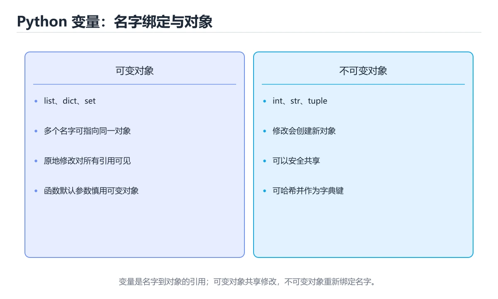
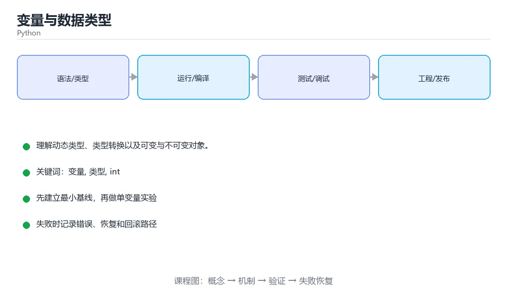

# 变量与数据类型





> 内容更新时间：2026-10-03 · 学习阶段：基础 · 预计用时：14 分钟

## 学习目标

- 能用自己的话解释变量与数据类型解决了什么问题，而不是只背术语。
- 能说清 「变量」、「类型」、「int」、「float」 之间的关系，并分别举出一个例子。
- 能把本课知识放回「Python」的知识体系，说明它和相邻主题的边界。
- 能完成本课练习，并用验收标准检查自己的结果。

> 一句话摘要：理解动态类型、类型转换以及可变与不可变对象。

## 前置知识

- 先完成上一课《Python 基础语法》；如果已经掌握，可以直接用本课练习自测。
- 本课阶段：基础。建议会读写简单代码或命令，并理解变量、输入输出等基本概念。
- 开始前先复习：变量、类型、int。
- 如果某一步看不懂，先记录具体卡点，完成练习后再回头读一遍。

## 变量是什么

变量是给数据起的一个名字。Python 是动态类型语言：变量本身没有类型，**值才有类型**，同一个变量可以先后指向不同类型的值。

```python
count = 10          # 整数 int
price = 19.9        # 浮点数 float
name = "小明"       # 字符串 str
is_ok = True        # 布尔值 bool

count = "十"        # 合法，但会让后续代码更易出错
```

## 四种最常用的类型

| 类型 | 说明 | 示例 |
| --- | --- | --- |
| `int` | 整数，长度不限 | `42`、`-7` |
| `float` | 浮点数，存在精度误差 | `3.14`、`0.1` |
| `str` | 字符串，用引号包裹 | `"hello"` |
| `bool` | 布尔值，只有真假 | `True`、`False` |

```python
print(0.1 + 0.2)          # 0.30000000000000004，浮点误差
print(7 // 2, 7 % 2)      # 3 1，整除与取余
print(2 ** 10)            # 1024，幂运算
```

## 类型转换

```python
text = "123"
number = int(text)        # 字符串 -> 整数
pi = float("3.14")        # 字符串 -> 浮点数
message = str(2024)       # 数字 -> 字符串

print(int("abc"))         # 报错：ValueError
```

转换失败会抛出 `ValueError`，所以处理用户输入时通常要配合 `try / except`。

```python
try:
    age = int(input("年龄："))
    print("明年", age + 1, "岁")
except ValueError:
    print("请输入数字")
```

## 可变与不可变

- 不可变类型：`int`、`float`、`str`、`bool`、`tuple`。
- 可变类型：`list`、`dict`、`set`。

```python
names = ["张三", "李四"]
names.append("王五")      # 原地修改，names 本身变了

text = "abc"
text.upper()              # 返回新字符串，原字符串不变
```

理解这一点，可以避免「函数内改列表影响了外部」这类隐蔽 bug。

## 本课小结
记住三句话：值有类型、类型可转换、列表字典可原地修改。

## 常见错误对照表

| 容易写错的写法 | 实际现象 | 原因与正确做法 |
| --- | --- | --- |
| `if flag == True:` | 能跑，但啰嗦且容易漏判 | 直接写 `if flag:`；只有需要区分 `0` 和 `False` 时才显式比较 |
| `"10" + 1` | `TypeError: can only concatenate str` | 类型不匹配，先转换：`int("10") + 1` |
| `int("3.5")` | `ValueError: invalid literal for int()` | 小数要先 `float("3.5")`，再 `int(...)`；注意 `int()` 是**截断**不是四舍五入 |
| `0.1 + 0.2 == 0.3` | 得到 `False` | 二进制浮点无法精确表示十进制小数，用 `math.isclose(a, b)` 或换算成整数（以分为单位） |
| `a = b = []` 之后 `a.append(1)` | `b` 也跟着变了 | 两个名字指向同一个列表；要各自独立写 `a, b = [], []` |
| `a = 1000; b = 1000; a is b` | 结果可能是 `False` | `is` 比较的是对象身份，比较值一律用 `==`，判断空值才用 `is None` |
| 变量名叫 `list`、`str`、`id` | 之后调用内置类型报错 | 避开内置名，改用 `items`、`text`、`user_id` |
| `name = None` 后直接 `name.upper()` | `AttributeError` | 空值要先判断：`if name:` 或 `if name is not None:` |
| 用 `+=` 拼接大量字符串 | 数据量大时明显变慢 | 用 `"".join(parts)`，字符串不可变，`+=` 每次都新建对象 |

## 速查卡：四种基本类型

| 类型 | 写法示例 | 可变性 | 常用转换 | 典型坑 |
| --- | --- | --- | --- | --- |
| `int` | `42`、`-7`、`0b1010` | 不可变 | `int("42")`、`int(3.9)` | 从浮点转换是截断 |
| `float` | `3.14`、`1e-3` | 不可变 | `float("3.14")` | 精度误差、`NaN != NaN` |
| `str` | `"hi"`、`'hi'`、`f"{x}"` | 不可变 | `str(2024)` | 拼接不同类新对象 |
| `bool` | `True`、`False` | 不可变 | `bool(0)` → `False` | `bool("False")` 是 `True`（非空字符串） |

进制与常用运算速查：

```python
print(0b1010, 0o17, 0xFF)   # 10 15 255
print(bin(10), hex(255))    # 0b1010 0xff
print(7 / 2, 7 // 2, 7 % 2) # 3.5 3 1（真正除、整除、取余）
print(divmod(7, 2))         # (3, 1) 一次拿到商和余数
print(round(2.675, 2))      # 2.67，浮点存储导致，不是 2.68
```

## 自测清单

- [ ] 能说清「变量没有类型、值才有类型」的含义。
- [ ] 知道 `int`、`float`、`str`、`bool`、`tuple` 不可变，`list`、`dict`、`set` 可变。
- [ ] 处理用户输入时会用 `try/except ValueError` 兜住转换失败。
- [ ] 比较浮点数时不会直接用 `==`。
- [ ] 赋值「多个变量同一个列表」时能意识到共享引用。

## 零基础详解：变量是「贴标签的盒子」，类型是「盒子里的东西」

### 一句话说清它是什么

变量是给数据起的一个名字。类型决定这份数据**能做什么、不能做什么**。
Python 不需要你提前声明类型，但它并没有「没有类型」，只是类型跟着值走。

### 用生活比喻理解

| 概念 | 比喻 | 说明 |
| --- | --- | --- |
| 变量 | 贴着标签的盒子 | 标签就是名字，盒子内容可以换 |
| 值 | 盒子里装的东西 | 数字、文字、列表、对象 |
| 类型 | 东西的种类 | 决定能用什么操作，例如数字能加减、文字能拼接 |
| 动态类型 | 同一个盒子改放别的东西 | 同一个名字可以先后指向不同类型 |

### 先看清「值」和「名字」是两回事

```python
a = [1, 2, 3]
b = a          # b 和 a 指向同一个列表，不是复制
b.append(4)

print(a)       # [1, 2, 3, 4]
print(a is b)  # True
```

画成图就是：

```text
a ──┐
    ├──► [1, 2, 3, 4]     （同一个列表对象）
b ──┘
```

想要真的复制一份，要用 `b = a.copy()` 或 `b = a[:]`。

### 常用类型速览

| 类型 | 写法示例 | 常用操作 | 易错点 |
| --- | --- | --- | --- |
| `int` | `age = 18` | `+ - * // % **` | 除法 `/` 的结果永远是 `float` |
| `float` | `price = 9.9` | 同上，另有 `round()` | `0.1 + 0.2 != 0.3`，比较要设误差 |
| `str` | `name = "Tom"` | 拼接、切片、`upper()` | 字符串不可原地修改 |
| `bool` | `ok = True` | `and or not` | 首字母必须大写 |
| `None` | `result = None` | 表示「还没有值」 | 判断用 `is None`，不是 `== None` |
| `list` | `nums = [1, 2]` | 增删改、索引、切片 | 可变，赋值不复制 |
| `tuple` | `point = (1, 2)` | 索引、解包 | 不可变，能作为字典键 |
| `dict` | `user = {"id": 1}` | 按下标取、遍历 | 键必须可哈希 |
| `set` | `tags = {"a", "b"}` | 去重、交并差 | 无序，不能按下标取 |

### 类型转换的四种常见写法

```python
age = int("18")         # 字符串 -> 整数
price = float("9.9")    # 字符串 -> 小数
text = str(100)         # 数字 -> 字符串
flag = bool("")         # 空字符串 -> False，其它非空字符串 -> True
```

转换失败会抛 `ValueError`，所以处理用户输入时通常要先判断：

```python
raw = input("请输入年龄：").strip()
if raw.isdigit():
    age = int(raw)
else:
    print("请只输入数字")
```

### 新手最容易踩的六个坑

| 坑 | 现象 | 正确做法 |
| --- | --- | --- |
| 用 `is` 比较值 | 小整数有时对、有时错 | 值比较用 `==`，`is` 只判断是不是同一个对象 |
| 浮点数直接比相等 | `0.1 + 0.2 == 0.3` 是 `False` | 用 `abs(a - b) < 1e-9` 判断 |
| 可变对象当默认参数 | 多次调用「记住了」上次的数据 | 用 `None` 占位，进函数再创建 |
| 字符串以为能改 | `s[0] = "A"` 报错 | 用 `s = "A" + s[1:]` 之类生成新串 |
| 列表赋值当复制 | 改 `b` 影响了 `a` | 用 `copy()`、`[:]` 或 `deepcopy()` |
| 变量名与关键字重名 | 语法错误或行为异常 | 避开 `list`、`dict`、`type`、`sum` 等内置名 |

### 命名规范对照

| 场景 | 推荐写法 | 例子 |
| --- | --- | --- |
| 普通变量与函数 | 全小写 + 下划线 | `user_name`、`calc_total()` |
| 常量 | 全大写 + 下划线 | `MAX_RETRY`、`BASE_URL` |
| 类名 | 每个单词首字母大写 | `UserProfile` |
| 私有含义 | 前面加一个下划线 | `_cache` |
| 避免的写法 | 单字母、拼音、无意义缩写 | `a`、`shuju`、`tmp2` |

### 手把手练习：温度转换器

要求：摄氏温度转华氏温度，公式 `F = C × 9 / 5 + 32`，输入非法时给出提示。

```python
raw = input("请输入摄氏温度：").strip()

try:
    celsius = float(raw)
    fahrenheit = celsius * 9 / 5 + 32
    print(f"{celsius:.1f}℃ = {fahrenheit:.1f}℉")
except ValueError:
    print("请输入一个数字，例如 25 或 36.5")
```

### 学完自测

- [ ] 能说出 `==` 与 `is` 的区别。
- [ ] 能解释为什么 `b = a` 之后改 `b` 会影响 `a`。
- [ ] 知道 `/` 与 `//` 分别得到什么。
- [ ] 能写出「安全地把用户输入转成整数」的代码。
- [ ] 能说出列表、元组、集合的三点区别。

## 动手练习

> 本课练习重点：围绕「变量、类型、int」完成复述、实验和交付，每个结果都要能被别人检查。

先写可运行脚本，再用类型注解与测试保护核心函数，最后处理真实输入。

### 练习 1：建立心智模型（10 分钟）

合上教程，用 3～5 句话回答：

1. 变量与数据类型解决了什么问题？
2. 如果没有它，会出现什么具体后果？
3. 它和「类型」是什么关系？

**验收标准**：至少出现一个本课关键词，并写出一个反例、边界条件或失效场景。

### 练习 2：做一次可控实验（20 分钟）

从正文中选一个最小示例，完成以下操作：

1. 先预测修改一个参数、输入或步骤后的结果。
2. 再实际执行或逐步推演，记录真实结果。
3. 如果结果与预测不同，写出差异原因。

**验收标准**：留下「原例 → 改动 → 预测 → 结果 → 原因」五步记录。

### 练习 3：交付一个小结果（30 分钟）

写一个 20 行以内的小脚本，把本课概念用于处理一份真实文本或列表数据。

任务要求：

- 结果必须能被别人检查，不能只写“我已经理解了”。
- 至少覆盖「变量」和「类型」两个关键词。
- 写出 1 个仍然不确定的问题，以及下一步如何验证。

> 提示：时间有限时优先做练习 1 和练习 2；练习 3 可以拆成两次完成。

## 可运行练习

### 任务 1：先跑通，再解释

```python
print(0.1 + 0.2)          # 0.30000000000000004，浮点误差
print(7 // 2, 7 % 2)      # 3 1，整除与取余
print(2 ** 10)            # 1024，幂运算
```

### 任务 2：只改一个条件

### 任务 3：迁移到自己的数据

用同一套思路处理一组你自己的数据或场景，保持输出格式与任务 1 一致。

## 故障现场

### 现场 1：本课的 变量 常规用例通过，但边界用例失败

**症状**：在本课的练习或生产场景里出现“本课的 变量 常规用例通过，但边界用例失败”。

**复现**：准备一组最小输入，只保留触发“本课的 变量 常规用例通过，但边界用例失败”的必要条件，连续运行两次确认结果稳定。

**定位**：围绕“变量 的前置条件与取值边界没有写进代码，默认值掩盖了空值和极值”检查调用链、输入数据和环境配置，先验证假设再改代码。

**预防**：把“本课的 变量 常规用例通过，但边界用例失败”写成一条自动化用例，并在本课的验收清单里保留对应检查项。

### 现场 2：本课的 类型 结果在两次运行之间不一致

**症状**：在本课的练习或生产场景里出现“本课的 类型 结果在两次运行之间不一致”。

**复现**：准备一组最小输入，只保留触发“本课的 类型 结果在两次运行之间不一致”的必要条件，连续运行两次确认结果稳定。

**定位**：围绕“类型 依赖了当前版本、执行顺序或共享状态，单次运行无法暴露差异”检查调用链、输入数据和环境配置，先验证假设再改代码。

**预防**：把“本课的 类型 结果在两次运行之间不一致”写成一条自动化用例，并在本课的验收清单里保留对应检查项。

### 现场 3：本课的验证只在开发机通过

**症状**：在本课的练习或生产场景里出现“本课的验证只在开发机通过”。

**定位**：围绕“环境版本、配置和输入规模与目标环境不同，变量 缺少可重复的验证记录”检查调用链、输入数据和环境配置，先验证假设再改代码。

## 版本与时效

### 升级检查清单

- 先固定当前版本，跑通全部示例与测验，再升级工具链。
- 只改一个版本变量，记录编译、测试、性能与产物体积的变化。
- 重点回归默认值、弃用警告、序列化格式、并发语义和错误信息。
- 升级完成后更新本课的“最后复核 / 下次复核”日期与版本说明。

## 本课复习清单

离开本课前，逐项确认：

- [ ] 不看解析，能说出「在 Python 中执行 print(0.1 + 0.2) 会输出什么？」的判断依据。
- [ ] 不看解析，能说出「下面哪一组全部属于可变类型？」的判断依据。
- [ ] 不看解析，能说出「执行 int("abc") 会发生什么？」的判断依据。
- [ ] 不看解析，能说出「Python 中 is 与 == 的区别是？」的判断依据。
- [ ] 不看解析，能说出「a = [1, 2]; b = a; b.append(3) 之后 a 是？」的判断依据。
- [ ] 至少运行一次本课示例，记录输入、输出和一个边界情况。
- [ ] 把本课最容易混淆的两个概念写成一句话对照。

| 复盘项 | 记录 |
| --- | --- |
| 已经能独立解释的考点 |  |
| 仍然说不清的概念 |  |
| 下一步验证动作 |  |

## 术语速查

| 术语 | 本课语境 |
| --- | --- |
| `int` | \| `int` \| 整数，长度不限 \| `42`、`-7` \| |
| `-7` | \| `int` \| 整数，长度不限 \| `42`、`-7` \| |
| `float` | \| `float` \| 浮点数，存在精度误差 \| `3.14`、`0.1` \| |
| `3.14` | \| `float` \| 浮点数，存在精度误差 \| `3.14`、`0.1` \| |
| `0.1` | \| `float` \| 浮点数，存在精度误差 \| `3.14`、`0.1` \| |
| `str` | \| `str` \| 字符串，用引号包裹 \| `"hello"` \| |
| `"hello"` | \| `str` \| 字符串，用引号包裹 \| `"hello"` \| |
| `bool` | \| `bool` \| 布尔值，只有真假 \| `True`、`False` \| |
| `True` | \| `bool` \| 布尔值，只有真假 \| `True`、`False` \| |
| `False` | \| `bool` \| 布尔值，只有真假 \| `True`、`False` \| |
| `ValueError` | 转换失败会抛出 `ValueError`，所以处理用户输入时通常要配合 `try / except`。 |
| `try / except` | 转换失败会抛出 `ValueError`，所以处理用户输入时通常要配合 `try / except`。 |

## 考点精讲

### 考点 1：下面这段 Python 代码摘自「变量与数据类型」的正文示例。关于这段代码，下面哪一项说法与实际内容相符？

- **判断依据**：在「变量与数据类型」里，这段代码只做静态声明，没有循环、分支或可观察输出。这段代码出自「变量与数据类型」的正文示例，围绕变量、类型、int展开；把输入或边界换成空值、极值或失败情况后，结论要以「变量与数据类型」的实际运行结果为准。把“这段代码只做静态声明，没有循环”代回「变量与数据类型」里“下面这段 Python 代码摘自变量与数据类型的正文示例关于”的例子核对，条件一旦改变，结论就要用变量、类型、int重新推导。

### 考点 2：围绕“变量与数据类型”中的 变量、类型、int，下列哪两项是本课强调的实践判断？

- **判断依据**：本课把变量与数据类型拆成概念、示例与故障现场三部分，因此判断 变量 时必须同时交代输入、输出和失败路径，这使“学习 变量 时要同时说明输入、输出和失败路径，不能只看正常流程”成立。在变量与数据类型里，判断 类型 时要固定版本与边界输入，所以“验证 类型 时要固定版本并覆盖边界输入，结论才可复现”才可复现。

### 考点 3：执行 int("abc") 会发生什么？

- **判断依据**：在「变量与数据类型」里，转换失败会抛出 ValueError，所以处理用户输入时通常用 try / except 包裹。其他选项：int("abc") 不会返回 0 或 None，也不会原样返回字符串。“int("abc")”与「变量与数据类型」的术语表相呼应，只有符合变量、类型、int约束的“抛出 ValueError”才是正文支持的结论。

### 考点 4：Python 中 is 与 == 的区别是？

- **判断依据**：在「变量与数据类型」里，结论应落在「== 比较值是否相等」。小整数有缓存容易让人误会，判断 None 才应该用 is None。在「变量与数据类型」里，这道题要求区分概念与边界，「== 比较值是否相等」只有在题干给出的前提下才成立，而「两者完全等价」、「is 比较值，== 比较地址」缺少同一组条件。

### 考点 5：a = [1, 2]; b = a; b.append(3) 之后 a 是？

- **判断依据**：在「变量与数据类型」里，[1, 2, 3]。b 与 a 指向同一个列表对象，就地修改会影响双方。在「变量与数据类型」里判断这道题，要把变量、类型、int的条件、过程与失败路径逐项对齐，换成“a = [1”这个场景，只有满足前提的结论才成立。回到「变量与数据类型」的正文示例，用“a = [1”走一遍变量、类型、int的完整流程，能复现的结论才可以保留。

### 考点 6：补全代码：「变量与数据类型」示例中，下面这行代码缺少哪个关键字或函数名？请填入 ____。

`names.____("王五") # 原地修改，names 本身变了`

- **判断依据**：在「变量与数据类型」里，append。这道题的关键在「变量与数据类型」的变量、类型、int：先确认题干“补全代码”问的是哪一步，再排除偷换前提的选项。把“append”代回「变量与数据类型」里“变量与数据类型示例中”的例子核对，条件一旦改变，结论就要用变量、类型、int重新推导。

## English Overview

**Title:** Variables & Types

**Summary:** Learn dynamic typing, conversions, mutable and immutable values.

**Category:** Python
**Level:** 基础
**Key terms:** 变量, 类型, int, float, str, bool, 转换

## 内容元数据

- 内容版本：v2.0
- 最后更新：2026-10-03
- 学习阶段：基础
- 适用环境：Python 3.12+
- 内容来源：内置结构化课程与工程实践整理
- 相关主题：变量、类型、int、float、str、bool、转换
- 质量版本：P0 测验标准 + P1 覆盖扩展 + P2 体验补全

## 参考资料与复核

- 最后复核：2026-10-04
- 下次复核：2027-04-04
- 复核范围：版本兼容、API 行为、安全建议与工程实践
- 来源性质：官方文档、标准或权威教材；正文为离线教学重组

| 参考资料 | 本课用途 |
| --- | --- |
| [typing 文档](https://docs.python.org/3/library/typing.html) | 类型标注与泛型 |
| [Python 语言参考](https://docs.python.org/3/reference/) | 语言语义与数据模型 |
| [Python 标准库](https://docs.python.org/3/library/) | 标准库 API 与模块 |

> 「变量与数据类型」的链接用于离线阅读后的延伸核对；App 不会自动联网。
