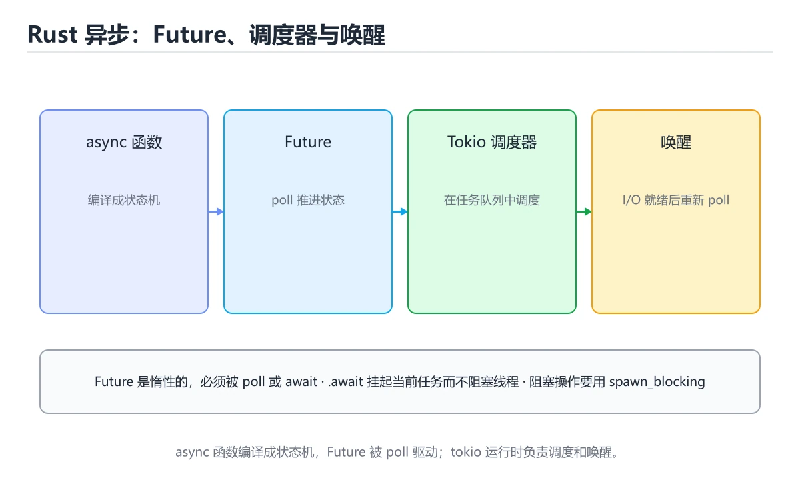
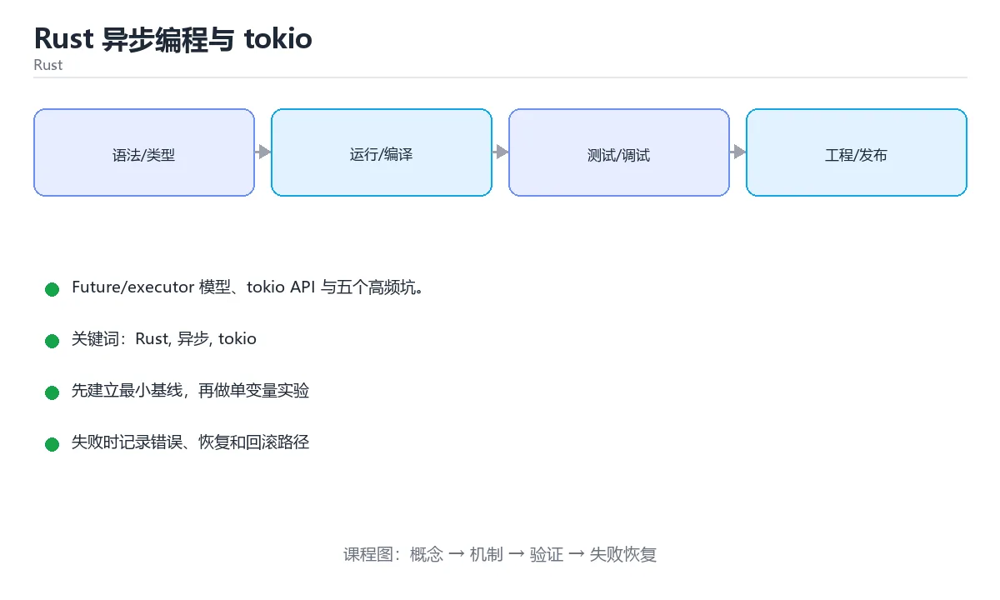

# Rust 异步编程与 tokio





> 内容更新时间：2026-10-03 · 学习阶段：高级 · 预计用时：16 分钟

## 学习目标

- 能用自己的话解释「Rust 异步编程与 tokio」解决了什么问题，而不是只背术语。
- 能说清 「Rust」、「异步」、「tokio」、「Future」 之间的关系，并分别举出一个例子。
- 能把本课知识放回「Rust」的知识体系，说明它和相邻主题的边界。
- 能完成本课练习，并用验收标准检查自己的结果。

> 一句话摘要：Future/executor 模型、tokio API 与五个高频坑。

## 前置知识

- 先完成上一课《Rust 实战：命令行工具》；如果已经掌握，可以直接用本课练习自测。
- 本课阶段：高级。建议具备同一方向的完整基础，能阅读较长的代码、配置或系统设计说明。
- 开始前先复习：Rust、异步、tokio。
- 如果某一步看不懂，先记录具体卡点，完成练习后再回头读一遍。


## 异步模型要点

Rust 的 `async fn` 由编译器生成状态机，返回 `Future`；Future 是**惰性**的，必须被 `await` 或被 executor 驱动才会推进。标准库只提供 Future trait，运行时由生态提供（tokio 最常用）。

| 概念 | 说明 |
| --- | --- |
| Future | 表示"未来会完成的计算"，poll 一次推进一次 |
| executor | 负责调度 Future（tokio 的多线程/当前线程运行时） |
| Waker | Future 就绪时通知 executor 重新 poll |
| Send 约束 | 跨线程 spawn 的 Future 必须 Send，持有非 Send 类型会编译失败 |

## tokio 常用 API

| 需求 | API |
| --- | --- |
| 启动运行时 | `#[tokio::main]` 或手动构建 Runtime |
| 并发等待全部 | `tokio::join!` 或 `futures::future::join_all` |
| 竞速与超时 | `tokio::select!`、`tokio::time::timeout` |
| 后台任务 | `tokio::spawn`（要求 Future: Send + 'static） |
| 同步原语 | `tokio::sync::{Mutex, RwLock, mpsc, oneshot, Semaphore}` |
| 阻塞任务隔离 | `tokio::task::spawn_blocking` |

## 五个高频坑

1. **在异步任务里做阻塞操作**（同步 IO、CPU 密集），会卡住整个执行线程，应用 `spawn_blocking` 或限制线程数。
2. **用 std 的 Mutex 跨 await 持有**，会导致死锁或编译错误；应使用 `tokio::sync::Mutex`，且尽量缩短持锁范围。
3. **忘记 spawn 或 await**，Future 根本不会执行（惰性）。
4. **spawn 的 Future 捕获了非 'static 引用**，编译失败；用 `Arc` 共享所有权或 `move` 闭包。
5. **取消语义**：drop 掉 Future 即取消，但已发生的副作用不会回滚；关键操作要考虑取消后的清理与幂等。

## 与线程模型的选择

| 场景 | 选择 |
| --- | --- |
| 高并发网络 IO | 异步 + tokio 多线程运行时 |
| CPU 密集计算 | 线程池（rayon）或 spawn_blocking |
| 简单脚本与命令行工具 | 直接同步写法，避免引入运行时 |
| 需要极低延迟 | 当前线程运行时 + 减少任务切换 |

经验：**不要为了异步而异步**。异步的收益来自大量并发等待的场景；纯计算任务用 rayon 更简单直接。

## 本课小结
Rust 异步的三句话：**Future 惰性需被驱动、阻塞操作必须隔离、跨 await 的共享状态要用 tokio 同步原语**。


## tokio 速查

| 目的 | 写法 |
| --- | --- |
| 异步入口 | `#[tokio::main]` + `async fn main()` |
| 启动任务 | `tokio::spawn(async { ... })` |
| 并发等待 | `tokio::join!`（固定数量）/ `futures::future::join_all`（集合） |
| 竞速 | `tokio::select!` |
| 延时 | `tokio::time::sleep` |
| 超时 | `tokio::time::timeout(dur, fut)` |
| 阻塞任务 | `tokio::task::spawn_blocking` |
| 多线程运行时 | `#[tokio::main(flavor = "multi_thread")]` |
| 单线程运行时 | `#[tokio::main(flavor = "current_thread")]` |
| 同步原语 | `tokio::sync::Mutex` / `RwLock` / `Semaphore` / `mpsc` |
| 取消 | 丢弃 future，或用 `CancellationToken`（tokio-util） |

```rust
use std::time::Duration;
use tokio::time::{sleep, timeout};

#[tokio::main]
async fn main() -> anyhow::Result<()> {
    // 并发执行两个任务，总耗时接近较慢的那个
    let (a, b) = tokio::join!(fetch("a"), fetch("b"));
    println!("{a} {b}");

    // 超时控制：超过 1 秒即放弃
    match timeout(Duration::from_secs(1), fetch("slow")).await {
        Ok(value) => println!("成功：{value}"),
        Err(_) => eprintln!("超时"),
    }

    // CPU 密集或阻塞操作放到阻塞线程池
    let hash = tokio::task::spawn_blocking(|| {
        // 假设这是一个耗时计算
        (0..1_000_000u64).fold(0u64, |acc, x| acc.wrapping_add(x))
    })
    .await?;
    println!("{hash}");

    Ok(())
}

async fn fetch(name: &str) -> String {
    sleep(Duration::from_millis(300)).await;
    format!("{name} 完成")
}
```

## 并发原语选择速查

| 需求 | 选择 | 理由 |
| --- | --- | --- |
| 计数 / 限流 | `tokio::sync::Semaphore` | 异步友好的并发上限 |
| 任务间传递消息 | `tokio::sync::mpsc` | 生产者消费者 |
| 共享可变状态（跨 await） | `tokio::sync::Mutex` | 可跨 `.await` 持有 |
| 共享状态（不跨 await） | `std::sync::Mutex` | 更快，但不可跨 await |
| 广播 | `tokio::sync::broadcast` | 一对多 |
| 单次初始化 | `tokio::sync::OnceCell` | 异步初始化 |
| 取消传播 | `CancellationToken` | 统一取消一组任务 |

## 常见错误对照表

| 容易踩的做法 | 实际现象 | 原因与正确做法 |
| --- | --- | --- |
| 在 async 里调用阻塞 API | 整个运行时被卡住 | 用异步版本或 `spawn_blocking` |
| 用 `std::sync::Mutex` 跨 `.await` | 编译错误或死锁风险 | 改用 `tokio::sync::Mutex` |
| 忘记 `await` future | 任务从未执行（编译器会告警） | 补 `.await` |
| `tokio::spawn` 捕获非 `'static` 引用 | 编译错误 | 用 `Arc` 共享或改用 `join!` |
| 无限制 `spawn` | 内存暴涨 | 用 `Semaphore` 限制并发 |
| 任务 panic 未观察 | 错误被静默丢弃 | 保存 `JoinHandle` 并处理 `Err` |
| 在 `select!` 分支里做重活 | 阻塞运行时 | 只做轻量处理 |
| 用 `thread::sleep` 做异步延迟 | 阻塞线程 | 用 `tokio::time::sleep` |
| 单线程运行时跑阻塞任务 | 所有任务停摆 | 换多线程运行时或 `spawn_blocking` |
| 不设超时 | 依赖故障时任务堆积 | 统一加 `timeout` 与取消 |

## 自测清单

- [ ] 异步链路中不出现阻塞调用。
- [ ] 跨 `.await` 的共享状态使用 `tokio::sync` 原语。
- [ ] 所有外部调用都有超时与取消。
- [ ] 并发任务数量受信号量限制。
- [ ] 任务错误被记录，不被静默丢弃。


## 零基础详解：async/await 与 Tokio

### 一句话说清它是什么

Rust 的 `async fn` 返回的是一个**惰性的 Future**：不 `.await` 就什么都不会发生。
Tokio 负责提供运行时，把这些 Future 调度起来并发执行——适合大量网络 IO。

### 用生活比喻理解

| 概念 | 比喻 | 说明 |
| --- | --- | --- |
| `async fn` | 写好的待办条 | 只是记录要做的事，还没开始做 |
| `.await` | 去做并等结果 | 真正驱动它执行 |
| Future | 未完成的订单 | 完成前可以被反复「推进」 |
| 运行时 | 调度中心 | 决定谁先跑、谁来唤醒 |
| `join!` | 同时等几张单子 | 并发执行 |
| `select!` | 谁先回来听谁的 | 竞速或超时 |

### 从阻塞到异步

```rust
// 阻塞：整个线程停下来等
let resp = reqwest::blocking::get(url)?;

// 异步：等待期间线程可以去处理别的任务
let resp = reqwest::get(url).await?;
```

### 最小可运行示例

```toml
# Cargo.toml
[dependencies]
tokio = { version = "1", features = ["full"] }
reqwest = { version = "0.12", features = ["json"] }
```

```rust
use std::time::Duration;

async fn fetch_status(url: &str) -> Result<u16, reqwest::Error> {
    let resp = reqwest::get(url).await?;
    Ok(resp.status().as_u16())
}

#[tokio::main]
async fn main() -> Result<(), Box<dyn std::error::Error>> {
    let status = fetch_status("https://example.com").await?;
    println!("状态码 {status}");

    // 超时控制
    let result = tokio::time::timeout(Duration::from_secs(3), fetch_status("https://example.com")).await;
    match result {
        Ok(Ok(code)) => println!("超时前返回 {code}"),
        Ok(Err(e)) => println!("请求失败：{e}"),
        Err(_) => println!("请求超时"),
    }
    Ok(())
}
```

### 串行、并发与竞速

```rust
use tokio::join;

// 串行：约等于两者之和
let a = fetch_status(url1).await?;
let b = fetch_status(url2).await?;

// 并发：约等于较慢的那个
let (a, b) = join!(fetch_status(url1), fetch_status(url2));

// 竞速：谁先返回就用谁
tokio::select! {
    res = fetch_status(url1) => println!("第一个返回：{:?}", res),
    _ = tokio::time::sleep(Duration::from_secs(2)) => println!("超时"),
}
```

| 工具 | 作用 |
| --- | --- |
| `join!` | 等全部完成 |
| `try_join!` | 等全部成功，任一失败立即返回 |
| `select!` | 等第一个完成 |
| `spawn` | 起一个独立任务，返回 `JoinHandle` |
| `timeout` | 给任意 Future 加时限 |

### 并发限制：别一次开一万个请求

```rust
use std::sync::Arc;
use tokio::sync::Semaphore;

let limit = Arc::new(Semaphore::new(10));      // 最多 10 个并发
let mut handles = Vec::new();

for url in urls {
    let permit = limit.clone().acquire_owned().await?;
    handles.push(tokio::spawn(async move {
        let code = fetch_status(&url).await.unwrap_or(0);
        drop(permit);                          // 释放许可
        code
    }));
}

for handle in handles {
    println!("{}", handle.await?);
}
```

### CPU 密集任务不要放在 async 里

```rust
// 错误：会卡住整个运行时
async fn bad() {
    let sum: u64 = (0..10_000_000).sum();
    println!("{sum}");
}

// 正确：丢到阻塞线程池
async fn good() -> u64 {
    tokio::task::spawn_blocking(|| (0..10_000_000u64).sum())
        .await
        .unwrap()
}
```

### 新手最容易踩的八个坑

| 坑 | 现象 | 正确做法 |
| --- | --- | --- |
| 创建 Future 不 `.await` | 什么也没执行 | 记得 await 或 spawn |
| 在 async 里写阻塞调用 | 运行时被卡住 | 用异步版本或 `spawn_blocking` |
| 用 `std::sync::Mutex` 跨 await | 可能死锁 | 用 `tokio::sync::Mutex` |
| 忘了 `#[tokio::main]` | 编译报错 | 加在 main 上 |
| 循环里逐个 await | 慢几倍 | 用 `join_all` 或 `FuturesUnordered` |
| 无限并发 | 连接被耗尽 | 用 `Semaphore` 限流 |
| 忽略 `JoinHandle` 的结果 | 任务 panic 被吞 | 检查 `handle.await` |
| 忘了 `Send` 约束 | 跨任务编译不过 | 避免在 await 期间持有非 Send 数据 |

### 手把手练习：并发抓取并限流

```rust
use std::sync::Arc;
use tokio::sync::Semaphore;

async fn fetch_status(url: String) -> (String, u16) {
    let code = match reqwest::get(&url).await {
        Ok(resp) => resp.status().as_u16(),
        Err(_) => 0,
    };
    (url, code)
}

#[tokio::main]
async fn main() {
    let urls: Vec<String> = vec!["https://example.com".into(); 20];
    let limit = Arc::new(Semaphore::new(5));
    let mut handles = Vec::new();

    for url in urls {
        let permit = limit.clone().acquire_owned().await.unwrap();
        handles.push(tokio::spawn(async move {
            let result = fetch_status(url).await;
            drop(permit);
            result
        }));
    }

    let mut ok = 0;
    for handle in handles {
        let (url, code) = handle.await.unwrap();
        if code == 200 { ok += 1; }
        println!("{code} {url}");
    }
    println!("成功 {ok} 个");
}
```

### 学完自测

- [ ] 能解释「Future 是惰性的」是什么意思。
- [ ] 知道什么时候用 `join!`、什么时候用 `select!`。
- [ ] 能说出为什么不能在 async 里做 CPU 密集计算。
- [ ] 知道 `tokio::sync::Mutex` 与标准库 Mutex 的使用差别。
- [ ] 能用 `Semaphore` 给并发请求限流。

## 动手练习


> 本课练习重点：围绕「Rust、异步、tokio」完成复述、实验和交付，每个结果都要能被别人检查。

先让 cargo check 通过，再补所有权、错误和并发边界，最后运行 clippy。

### 练习 1：建立心智模型（10 分钟）

合上教程，用 3～5 句话回答：

1. 「Rust 异步编程与 tokio」解决了什么问题？
2. 如果没有它，会出现什么具体后果？
3. 它和「异步」是什么关系？

**验收标准**：至少出现一个本课关键词，并写出一个反例、边界条件或失效场景。

### 练习 2：做一次可控实验（20 分钟）

从正文中选一个最小示例，完成以下操作：

1. 先预测修改一个参数、输入或步骤后的结果。
2. 再实际执行或逐步推演，记录真实结果。
3. 如果结果与预测不同，写出差异原因。

**验收标准**：留下「原例 → 改动 → 预测 → 结果 → 原因」五步记录。

### 练习 3：交付一个小结果（30 分钟）

写一个最小 Cargo 示例，先用 `cargo check`，再补一个边界测试。

任务要求：

- 结果必须能被别人检查，不能只写“我已经理解了”。
- 至少覆盖「Rust」和「异步」两个关键词。
- 写出 1 个仍然不确定的问题，以及下一步如何验证。

> 提示：时间有限时优先做练习 1 和练习 2；练习 3 可以拆成两次完成。


## 考点精讲：把测验题还原成判断过程

本课有 6 个判断点。先自己作答，再看「判断依据」；如果结论正确但理由不完整，回到正文对应章节补足概念。

### 考点 1：Rust 中 Future 的特性是？

- **正确判断**：惰性，必须被 await 或 executor 驱动
- **判断依据**：正确答案是「惰性，必须被 await 或 executor 驱动」，本课在「异步模型要点」中说明：Future 是惰性的，必须被 await 或被 executor 驱动才会推进。Future 是状态机，不驱动就永远不会推进。本课还在「本课小结」中说明：Rust 异步的三句话：Future 惰性需被驱动、阻塞操作必须隔离、跨 await 的共享状态要用 tokio 同步原语。本课还在「五个高频坑」中说明：忘记 spawn 或 await，Future 根本不会执行（惰性）。
- **迁移检查**：如果给某个错误选项去掉一个限定词，它会不会变成正确？说明理由。

### 考点 2：在异步任务中执行 CPU 密集计算应该？

- **正确判断**：用 spawn_blocking 隔离到阻塞线程池
- **判断依据**：正确答案是「用 spawn_blocking 隔离到阻塞线程池」，本课在「五个高频坑」中说明：在异步任务里做阻塞操作（同步 IO、CPU 密集），会卡住整个执行线程，应用 spawnblocking 或限制线程数。阻塞异步执行线程会拖慢整个运行时。本课还在「零基础详解：async/await 与 Tokio」中说明：能说出为什么不能在 async 里做 CPU 密集计算。本课还在「本课小结」中说明：Rust 异步的三句话：Future 惰性需被驱动、阻塞操作必须隔离、跨 await 的共享状态要用 tokio 同步原语。
- **迁移检查**：把题干里的一个条件换成边界值，原来的结论还成立吗？写出判断过程。

### 考点 3：跨 await 持有共享可变状态时推荐？

- **正确判断**：tokio::sync::Mutex 并缩短持锁范围
- **判断依据**：std Mutex 跨 await 易导致问题，tokio 提供的异步锁更合适。其他选项：跨 await 的共享状态建议使用 tokio::sync::Mutex 并缩短持锁范围。针对「跨 await 持有共享可变状态时推荐，」，本课在「五个高频坑」中说明：应使用 tokio::sync::Mutex，且尽量缩短持锁范围。本课还在「五个高频坑」中说明：用 std 的 Mutex 跨 await 持有，会导致死锁或编译错误。
- **迁移检查**：遮住选项，只根据定义复述一次答案，再回来看哪个选项与复述一致。

### 考点 4：tokio::select! 的作用是？

- **正确判断**：同时等待多个 future
- **判断依据**：正确答案是「同时等待多个 future」，本课在「异步模型要点」中说明：标准库只提供 Future trait，运行时由生态提供（tokio 最常用）。常用于「请求 vs 超时 vs 取消信号」的竞争场景。本课还在「零基础详解：async/await 与 Tokio」中说明：知道什么时候用 join!、什么时候用 select!。本课还在「零基础详解：async/await 与 Tokio」中说明：知道 tokio::sync::Mutex 与标准库 Mutex 的使用差别。
- **迁移检查**：如果给某个错误选项去掉一个限定词，它会不会变成正确？说明理由。

### 考点 5：#[tokio::main] 宏做的事情是？

- **正确判断**：把 async fn main 包装成同步入口
- **判断依据**：正确答案是「把 async fn main 包装成同步入口」，本课在「异步模型要点」中说明：Rust 的 async fn 由编译器生成状态机，返回 Future。展开后等价于手动创建 Runtime 并调用 blockon。本课还在「零基础详解：async/await 与 Tokio」中说明：Rust 的 async fn 返回的是一个惰性的 Future：不 .await 就什么都不会发生。本课还在「异步模型要点」中说明：标准库只提供 Future trait，运行时由生态提供（tokio 最常用）。
- **迁移检查**：如果给某个错误选项去掉一个限定词，它会不会变成正确？说明理由。

### 考点 6：补全代码：「Rust 异步编程与 tokio」示例中，下面这行代码缺少哪个关键字或函数名？请填入 ____。 `let hash = tokio::task::____(|| {`

- **正确判断**：spawn_blocking
- **判断依据**：正确答案是「spawn_blocking」，这道题在问补全代码：Rust异步编程与tokio示例中，下面这…kio::task::____(||{`，判断时要把题干限定的输入、边界与目标逐项对齐。本课示例中还能看到 `let hash = tokio::task::spawn_blocking(|| {` 这样的用法，说明该关键字在本课代码中承担实际功能。
- **迁移检查**：不看题干，用自己的话补全这句话，再与标准答案对照。

## 本课复习清单

离开本课前，逐项确认：

- [ ] 不看解析，能说出「Rust 中 Future 的特性是？」的判断依据。
- [ ] 不看解析，能说出「在异步任务中执行 CPU 密集计算应该？」的判断依据。
- [ ] 不看解析，能说出「跨 await 持有共享可变状态时推荐？」的判断依据。
- [ ] 不看解析，能说出「tokio::select! 的作用是？」的判断依据。
- [ ] 不看解析，能说出「#[tokio::main] 宏做的事情是？」的判断依据。
- [ ] 不看解析，能说出「补全代码：「Rust 异步编程与 tokio」示例中，下面这行代码缺少哪个关键字…」的判断依据。
- [ ] 至少运行一次本课示例，记录输入、输出和一个边界情况。
- [ ] 把本课最容易混淆的两个概念写成一句话对照。

| 复盘项 | 记录 |
| --- | --- |
| 已经能独立解释的考点 |  |
| 仍然说不清的概念 |  |
| 下一步验证动作 |  |

## 术语速查

把本课反复出现的术语集中放在一起。复习时先遮住右列，尝试用自己的话解释，再回到正文核对。

| 术语 | 本课语境 |
| --- | --- |
| `async fn` | Rust 的 `async fn` 由编译器生成状态机，返回 `Future`；Future 是**惰性**的，必须被 `await` 或被 executor 驱动才会推进。标准库只提供 Future trait，运行时… |
| `Future` | Rust 的 `async fn` 由编译器生成状态机，返回 `Future`；Future 是**惰性**的，必须被 `await` 或被 executor 驱动才会推进。标准库只提供 Future trait，运行时… |
| `await` | Rust 的 `async fn` 由编译器生成状态机，返回 `Future`；Future 是**惰性**的，必须被 `await` 或被 executor 驱动才会推进。标准库只提供 Future trait，运行时… |
| `#[tokio::main]` | \| 启动运行时 \| `#[tokio::main]` 或手动构建 Runtime \| |
| `tokio::join!` | \| 并发等待全部 \| `tokio::join!` 或 `futures::future::join_all` \| |
| `futures::future::join_all` | \| 并发等待全部 \| `tokio::join!` 或 `futures::future::join_all` \| |
| `tokio::select!` | \| 竞速与超时 \| `tokio::select!`、`tokio::time::timeout` \| |
| `tokio::time::timeout` | \| 竞速与超时 \| `tokio::select!`、`tokio::time::timeout` \| |
| `tokio::spawn` | \| 后台任务 \| `tokio::spawn`（要求 Future: Send + 'static） \| |
| `tokio::task::spawn_blocking` | \| 阻塞任务隔离 \| `tokio::task::spawn_blocking` \| |
| `spawn_blocking` | 在异步任务里做阻塞操作**（同步 IO、CPU 密集），会卡住整个执行线程，应用 `spawn_blocking` 或限制线程数。 |
| `tokio::sync::Mutex` | 用 std 的 Mutex 跨 await 持有**，会导致死锁或编译错误；应使用 `tokio::sync::Mutex`，且尽量缩短持锁范围。 |

## 面试问答与自测

下面把本课考点换成面试追问。先口述自己的答案，
再对照参考回答检查是否遗漏了前提、边界或失败路径。

### 追问 1：Rust 中 Future 的特性是？

**参考回答**：正确答案是「惰性，必须被 await 或 executor 驱动」，本课在「异步模型要点」中说明：Future 是惰性的，必须被 await 或被 executor 驱动才会推进。Future 是状态机，不驱动就永远不会推进。本课还在「本课小结」中说明：Rust 异步的三句话：Future 惰性需被驱动、阻塞操作必须隔离、跨 await 的共享状态要用 tokio 同步原语。本课还在「五个高频坑」中说明：忘记 spawn 或 await，Future 根本不会执行（惰性）。

### 追问 2：在异步任务中执行 CPU 密集计算应该？

**参考回答**：正确答案是「用 spawn_blocking 隔离到阻塞线程池」，本课在「五个高频坑」中说明：在异步任务里做阻塞操作（同步 IO、CPU 密集），会卡住整个执行线程，应用 spawnblocking 或限制线程数。阻塞异步执行线程会拖慢整个运行时。本课还在「零基础详解·async/await 与 Tokio」中说明：能说出为什么不能在 async 里做 CPU 密集计算。本课还在「本课小结」中说明：Rust 异步的三句话：Future 惰性需被驱动、阻塞操作必须隔离、跨 await 的共享状态要用 tokio 同步原语。

### 追问 3：跨 await 持有共享可变状态时推荐？

**参考回答**：std Mutex 跨 await 易导致问题，tokio 提供的异步锁更合适。其他选项：跨 await 的共享状态建议使用 tokio::sync::Mutex 并缩短持锁范围。针对「跨 await 持有共享可变状态时推荐，」，本课在「五个高频坑」中说明：应使用 tokio::sync::Mutex，且尽量缩短持锁范围。本课还在「五个高频坑」中说明：用 std 的 Mutex 跨 await 持有，会导致死锁或编译错误。

### 追问 4：tokio::select! 的作用是？

**参考回答**：正确答案是「同时等待多个 future」，本课在「异步模型要点」中说明：标准库只提供 Future trait，运行时由生态提供（tokio 最常用）。常用于「请求 vs 超时 vs 取消信号」的竞争场景。本课还在「零基础详解·async/await 与 Tokio」中说明：知道什么时候用 join!、什么时候用 select!。本课还在「零基础详解·async/await 与 Tokio」中说明：知道 tokio::sync::Mutex 与标准库 Mutex 的使用差别。

### 追问 5：#[tokio::main] 宏做的事情是？

**参考回答**：正确答案是「把 async fn main 包装成同步入口」，本课在「异步模型要点」中说明：Rust 的 async fn 由编译器生成状态机，返回 Future。展开后等价于手动创建 Runtime 并调用 blockon。本课还在「零基础详解·async/await 与 Tokio」中说明：Rust 的 async fn 返回的是一个惰性的 Future：不 .await 就什么都不会发生。本课还在「异步模型要点」中说明：标准库只提供 Future trait，运行时由生态提供（tokio 最常用）。

## English Overview

**Title:** Rust Async & tokio

**Summary:** Futures, executors, tokio APIs and pitfalls.

**Category:** Rust  
**Level:** 高级  
**Key terms:** Rust, 异步, tokio, Future, spawn_blocking

> The full tutorial is written in Chinese. This bilingual overview helps English readers identify the topic, scope and key terms before studying the detailed examples.

## 内容元数据

- 内容版本：v2.0
- 最后更新：2026-10-03
- 学习阶段：高级
- 适用环境：Rust 1.85+ / Cargo
- 内容来源：内置结构化课程与工程实践整理
- 相关主题：Rust、异步、tokio、Future、spawn_blocking
- 质量版本：P0 测验标准 + P1 覆盖扩展 + P2 体验补全


## 参考资料与复核

- 最后复核：2026-10-04
- 下次复核：2027-04-04
- 复核范围：版本兼容、API 行为、安全建议与工程实践
- 来源性质：官方文档与标准；本课正文为离线教学重组，不复制原文

| 参考资料 | 本课用途 |
| --- | --- |
| [The Rust Book](https://doc.rust-lang.org/book/) | 所有权、类型与工程实践 |
| [Rust 标准库](https://doc.rust-lang.org/std/) | 标准库与并发 API |

> 本课主题：Future/executor 模型、tokio API 与五个高频坑。

> App 完全离线展示文字链接，不会自动联网；需要延伸阅读时可复制链接到浏览器。
