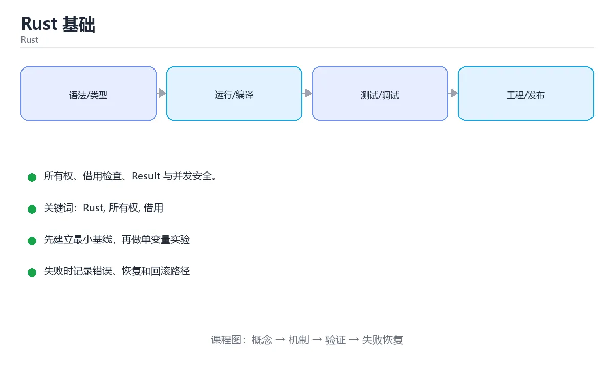

# Rust 基础




> 内容更新时间：2026-10-06 · 学习阶段：基础 · 预计用时：40 分钟

## 本节知识框架

**课程定位**：所属分类 `rust`（Rust），课程主题 `Rust 基础`，学习阶段 基础，建议用时 45 分钟。

本课主线：所有权、借用检查、Result 与并发安全。

**学完本课应当能够**
- 说清 `Rust` 与 `所有权` 的含义与区别，并各举一个正例和一个反例。
- 用本课示例验证 `借用` 的行为，记录输入、输出与失败条件。
- 遇到「忘记 `mut`」这类问题时，能说出触发条件与修复顺序。

### 从概念到验证的学习链条

1. `Rust`：先掌握 Rust 是系统级语言，用编译期检查替代垃圾回收，做到内存安全与零成本抽象，再用它解释 `所有权` 为什么会出现。
2. `所有权`：先掌握 Rust 中每个值只有一个所有者，离开作用域时自动释放的规则，再用它解释 `借用` 为什么会出现。
3. `借用`：先掌握 Rust 在不转移所有权的前提下临时访问值，并在编译期检查引用有效期和别名规则，再用它解释 `生命周期` 为什么会出现。
4. `生命周期`：先掌握 引用保持有效的区间；在 Rust 中还用于把多个引用的有效期关系写进类型，再用它解释 本课示例的观察结果 为什么会出现。

**先修与衔接**：本课是「Rust」分类的第 6 课。相关或后续课程：《Rust 所有权、借用与生命周期》。

### 完成判据

- **定义关**：不看正文也能说明 `Rust` 是 Rust 是系统级语言，用编译期检查替代垃圾回收，做到内存安全与零成本抽象，并指出一个反例。
- **机制关**：能按“输入 → 转换 → 输出 → 验证”复述 `Rust 基础`，而不是只背结论。
- **示例关**：能运行或推演 `Rust 基础` 的 `rust` 示例，并说明一个真实出现的标识符或字面量。
- **证据关**：能指出 `Rust 基础` 示例里的 调用了 `main()`，并说明它支持或反驳了本课的哪一条结论。
- **排错关**：能复现 忘记 `mut`，记录现象并按 加 `mut`，或改用新绑定 修复。
- **迁移关**：能把 `Rust`、`所有权`、`借用`、`生命周期` 放进一个与 `Rust 基础` 不同的项目场景，并保持输入与验证条件可追踪。
- **复盘关**：学完 `Rust 基础` 后，用一句话写下仍然不确定的结论，并列出下一次验证需要的输入、环境和成功判据。

### 复习清单

- [ ] 能不看正文复述本课核心术语，并指出一个边界或反例。
- [ ] 能运行或推演本课示例，记录输入、输出与失败现象。
- [ ] 能完成一次自测，并把错题对照错误表定位原因。

## 核心概念定义

| 术语 | 操作性定义 | 常见边界与风险 |
| --- | --- | --- |
| Rust | Rust 是系统级语言，用编译期检查替代垃圾回收，做到内存安全与零成本抽象。 | 易错：`cannot apply unary operator`；正确做法是Rust 的 `!` 是按位取反，逻辑非是 `!` 只用于 bool。 |
| 所有权 | Rust 中每个值只有一个所有者，离开作用域时自动释放的规则。 | 越界、悬垂引用与释放顺序会破坏结论，必须在边界输入下复验。 |
| 借用 | Rust 在不转移所有权的前提下临时访问值，并在编译期检查引用有效期和别名规则。 | 静态检查只在编译期成立，运行期输入仍需校验。 |
| 生命周期 | 引用保持有效的区间；在 Rust 中还用于把多个引用的有效期关系写进类型。 | 静态检查只在编译期成立，运行期输入仍需校验。 |
| Option<T> | 表示可能没有值，替代 null | 只在「表示可能没有值，替代 null」这一前提下成立，换输入或换环境要重新验证。 |
| Result<T, E> | 表示可能失败，配合 `?` 传播错误 | 只在「表示可能失败，配合 `?` 传播错误」这一前提下成立，换输入或换环境要重新验证。 |
| struct / enum | 数据建模，enum 可携带数据（类似代数数据类型） | 静态检查只在编译期成立，运行期输入仍需校验。 |
| trait | 定义共享行为，可静态分发（泛型）或动态分发（dyn） | 共享状态与调度顺序会改变结论，单线程或串行测试通过不等于并发下成立。 |
| 智能指针 | Box、Rc、Arc、RefCell，用于堆分配与共享所有权 | 共享状态与调度顺序会改变结论，单线程或串行测试通过不等于并发下成立。 |
| Cargo | 项目经理 | 只在「项目经理」这一前提下成立，换输入或换环境要重新验证。 |
| crate | 一个交付单元 | 只在「一个交付单元」这一前提下成立，换输入或换环境要重新验证。 |
| fn main | 大门 | 只在「大门」这一前提下成立，换输入或换环境要重新验证。 |
| 所有权 | 物品只有一个主人 | 只在「物品只有一个主人」这一前提下成立，换输入或换环境要重新验证。 |
| 借用 | 借出去用一下 | 只在「借出去用一下」这一前提下成立，换输入或换环境要重新验证。 |
| let name = ... | 默认不可变，**想改变量必须写 `mut`** | 只在「默认不可变，**想改变量必须写 `mut`**」这一前提下成立，换输入或换环境要重新验证。 |
| {name} | 内联变量，比写参数更直观 | 结果依赖数据分布、模型版本与算力预算，换数据集或换硬件都要重新评估。 |
| println! | 这是宏不是函数，所以有 `!` | 易错：语法错误；正确做法是`println!(...);` 要加分号。 |
| 语句结尾 | 表达式后面不加分号会作为返回值，这点很关键 | 只在「表达式后面不加分号会作为返回值，这点很关键」这一前提下成立，换输入或换环境要重新验证。 |
| 不可变变量 | `let` | 只在「`let`」这一前提下成立，换输入或换环境要重新验证。 |
| 可变变量 | `let mut` | 只在「`let mut`」这一前提下成立，换输入或换环境要重新验证。 |
| 常量 | `const` | 只在「`const`」这一前提下成立，换输入或换环境要重新验证。 |
| i32 / i64 | 有符号整数 | 只在「有符号整数」这一前提下成立，换输入或换环境要重新验证。 |
| u32 / usize | 无符号整数 | 只在「无符号整数」这一前提下成立，换输入或换环境要重新验证。 |
| f64 | 浮点数 | 易错：`mismatched types`；正确做法是显式 `as f64` 或改用同类型。 |
| bool | 布尔 | 易错：`cannot apply unary operator`；正确做法是Rust 的 `!` 是按位取反，逻辑非是 `!` 只用于 bool。 |
| char | 4 字节 Unicode 字符 | 换编码、换字节序或换平台都可能改变结果，处理前先固定输入编码。 |
| String / &str | 可变字符串 / 字符串切片 | 只在「可变字符串 / 字符串切片」这一前提下成立，换输入或换环境要重新验证。 |
| 忘记 mut | `cannot assign twice to immutable variable` | 只在「`cannot assign twice to immutable variable`」这一前提下成立，换输入或换环境要重新验证。 |
| 用 ! 取反整数 | `cannot apply unary operator` | 只在「`cannot apply unary operator`」这一前提下成立，换输入或换环境要重新验证。 |
| 整数与浮点混算 | `mismatched types` | 易错：`mismatched types`；正确做法是显式 `as f64` 或改用同类型。 |
| 字符串用 == 比较不同类型 | 类型不匹配 | 静态检查只在编译期成立，运行期输入仍需校验。 |
| 忘加分号导致类型错 | `expected ()` | 易错：`expected ()`；正确做法是检查表达式是否意外成了返回值。 |
| 下标越界 | 运行时 panic | 易错：运行时 panic；正确做法是用 `get(i)` 返回 `Option`。 |
| 整数溢出 | debug 下 panic，release 下回绕 | 易错：debug 下 panic，release 下回绕；正确做法是用 `checked_add` 等显式处理。 |
| 忘记 ; 在宏调用后 | 语法错误 | 只在「语法错误」这一前提下成立，换输入或换环境要重新验证。 |

## 原理与运行机制

### 机制总览

**教材衔接：语言定位**

Rust 是系统级语言，用**编译期检查**替代垃圾回收，做到内存安全与零成本抽象。它适合操作系统、嵌入式、网络中间件与高性能 CLI（Firefox、Linux 内核、Deno 都有 Rust 代码）。

**教材衔接：所有权：核心中的核心**

三条规则：每个值有唯一所有者；同一时刻只能有一个所有者；所有者离开作用域时值被释放。

| 概念 | 说明 |
| --- | --- |
| Move | 赋值或传参会转移所有权，原变量失效 |
| Borrow | `&T` 不可变借用，`&mut T` 可变借用 |
| 借用规则 | 要么多个不可变借用，要么一个可变借用，二者不能同时存在 |
| 生命周期 | 用标注告诉编译器引用的有效范围 |

这套规则在编译期消灭了悬垂指针、重复释放与数据竞争。

**教材衔接：工程实践**

1. Cargo 一体化管理依赖、构建、测试与文档（Cargo.toml）。
2. 错误处理：库用 thiserror 定义错误类型，应用用 anyhow 简化传播。
3. `cargo fmt`、`cargo clippy`、`cargo test` 是标准三件套。
4. 与 C 互操作用 FFI / bindgen；嵌入式用 no_std。
5. 性能敏感场景可用 unsafe，但必须写清安全前提并尽量封装在小范围内。

**教材衔接：学习曲线提示**

初学者最容易卡在「借用检查器」。建议：先理解所有权与借用规则，再学生命周期；遇到编译错误先读完整提示（Rust 的错误信息质量很高），必要时用 clone 让代码先跑通，再逐步消除不必要的拷贝。

**教材衔接：版本与时效**

- 版本提示：Rust 的行为在最近几个大版本里有过调整，升级「Rust 基础」前先用 to_string 复现当前输出，再对照官方发布说明逐条核对。
- 异步运行时与借用检查规则的变化会影响 Rust，要在 CI 中提前暴露。
- 升级「Rust 基础」涉及的依赖前，先用 to_string 复现当前行为，再逐项核对版本说明与破坏性变更。
- 官方发布说明：https://blog.rust-lang.org/

### 升级检查清单

- 先固定当前版本，跑通全部示例与测验，再升级工具链。
- 一次只改一个版本条件，把 Rust 相关的差异单独记成一条结论。
- 回归范围锁定 to_string 的默认行为，并确认弃用警告是否出现在构建输出里。
- 升级完成后更新本课「最后复核 / 下次复核」日期，并记录 Rust 的版本变化。

### 机制拆解：每一步的输入、动作与输出

#### 1. `Rust`
- 输入：`Rust`；本步把 Rust 是系统级语言，用编译期检查替代垃圾回收，做到内存安全与零成本抽象 当作判断规则。
- 动作：围绕 `Rust` 保留中间状态，并记录它与 `所有权` 的对应关系。
- 输出：`所有权`，它可以被下一段代码、测试或记录继续使用。
- `Rust` 的失败条件：当用 `!` 取反整数时，会出现`cannot apply unary operator`。

#### 2. `所有权`
- 输入：`Rust`；本步把 Rust 中每个值只有一个所有者，离开作用域时自动释放的规则 当作判断规则。
- 动作：围绕 `所有权` 保留中间状态，并记录它与 `借用` 的对应关系。
- 输出：`借用`，它可以被下一段代码、测试或记录继续使用。
- `所有权` 的失败条件：越界、悬垂引用与释放顺序会破坏结论，必须在边界输入下复验。

#### 3. `借用`
- 输入：`所有权`；本步把 Rust 在不转移所有权的前提下临时访问值，并在编译期检查引用有效期和别名规则 当作判断规则。
- 动作：围绕 `借用` 保留中间状态，并记录它与 `生命周期` 的对应关系。
- 输出：`生命周期`，它可以被下一段代码、测试或记录继续使用。
- `借用` 的失败条件：静态检查只在编译期成立，运行期输入仍需校验。

#### 4. `生命周期`
- 输入：`借用`；本步把 引用保持有效的区间；在 Rust 中还用于把多个引用的有效期关系写进类型 当作判断规则。
- 动作：围绕 `生命周期` 保留中间状态，并记录它与 `main` 的对应关系。
- 输出：`main`，它可以被下一段代码、测试或记录继续使用。
- `生命周期` 的失败条件：静态检查只在编译期成立，运行期输入仍需校验。

### 示例中的可观察事实

1. 调用了 `main()`；它对应的课程主题是 `Rust 基础`。
2. 出现字面量 `你好，{name}，计数 {count}`；它对应的课程主题是 `Rust 基础`。
3. 出现字面量 `现在是字符串`；它对应的课程主题是 `Rust 基础`。

### 复现实验记录

- 环境：`Rust 基础` 使用 `rust` 示例，固定 `Rust`、`所有权`、`借用`、`生命周期` 作为第一组条件。
- 首轮输入：先确认 调用了 `main()`，预测 `Rust` 会怎样变化。
- 基线观察：记录命令、输入、输出和错误原文，不用截图代替可复制的文本。
- 单变量修改：只改变 `Rust`，观察 `生命周期` 是否仍满足定义。
- 失败注入：复现 忘记 `mut`，确认现象是 `cannot assign twice to immutable variable`。
- 记录结论：把“修改前、修改后、预期变化、实际变化”写成四列表，这样复盘 `Rust 基础` 时才能区分概念错误与实现错误。

## 典型应用场景

**课程内置实验入口**：`sandbox:rust`，用于动手验证《Rust 基础》的机制；实验结论不替代概念定义与复杂度分析。

- **忘记 `mut`**：典型现象是`cannot assign twice to immutable variable`；正确做法是加 `mut`，或改用新绑定。
- **用 `!` 取反整数**：典型现象是`cannot apply unary operator`；正确做法是Rust 的 `!` 是按位取反，逻辑非是 `!` 只用于 bool。
- **整数与浮点混算**：典型现象是`mismatched types`；正确做法是显式 `as f64` 或改用同类型。
- **字符串用 `==` 比较不同类型**：典型现象是类型不匹配；正确做法是`String` 与 `&str` 比较可用 `==`，但要注意解引用。

### 最小验证场景

- 准备：保留 `rust` 示例的原始输入，先记录 `Rust 基础` 的基线输出和完整运行命令。
- 观察：先核对 调用了 `main()`，再改变一个与 `Rust` 相关的条件。
- 判定：新结果与 `Rust 基础` 的基线不同不等于错误；只有当差异破坏了 `Rust` 的定义或错误表中的约束，才判定为失败。

### 选择与边界

- 使用 `Rust` 时，先满足它的定义：Rust 是系统级语言，用编译期检查替代垃圾回收，做到内存安全与零成本抽象；易错：`cannot apply unary operator`；正确做法是Rust 的 `!` 是按位取反，逻辑非是 `!` 只用于 bool。
- 使用 `所有权` 时，先满足它的定义：Rust 中每个值只有一个所有者，离开作用域时自动释放的规则；越界、悬垂引用与释放顺序会破坏结论，必须在边界输入下复验。
- 使用 `借用` 时，先满足它的定义：Rust 在不转移所有权的前提下临时访问值，并在编译期检查引用有效期和别名规则；静态检查只在编译期成立，运行期输入仍需校验。
- 使用 `生命周期` 时，先满足它的定义：引用保持有效的区间；在 Rust 中还用于把多个引用的有效期关系写进类型；静态检查只在编译期成立，运行期输入仍需校验。

## 代码/协议/SQL 示例

### 最小可验证示例

```rust
#[derive(Debug, Clone, PartialEq)]
enum Command {
    Quit,
    Echo(String),
    Move { x: i32, y: i32 },
}

fn run(cmd: Command) -> String {
    match cmd {
        Command::Quit => "退出".to_string(),
        Command::Echo(text) => text,
        Command::Move { x, y } => format!("移动到 ({x}, {y})"),
    }
}

fn main() {
    println!("{}", run(Command::Move { x: 1, y: 2 }));

    // 错误处理不用异常，用 Result
    let parsed: Result<i32, _> = "42".parse();
    match parsed {
        Ok(n) => println!("解析成功：{n}"),
        Err(e) => eprintln!("解析失败：{e}"),
    }
}
```

**教材衔接：基础语法速查**

| 概念 | 写法 | 说明 |
| --- | --- | --- |
| 不可变绑定 | `let x = 1;` | 默认不可变 |
| 可变绑定 | `let mut x = 1;` | 需要修改时显式声明 |
| 常量 | `const MAX: u32 = 100;` | 必须标注类型 |
| 静态变量 | `static NAME: &str = "app";` | 全程存活 |
| 元组 | `let (a, b) = (1, "x");` | 可解构 |
| 数组 | `let a = [1, 2, 3];` | 固定长度 |
| 切片 | `&a[1..3]` | 借用一部分 |
| 字符串 | `String` / `&str` | 拥有 vs 借用 |
| 枚举 | `enum Status { Ok, Err(String) }` | 可携带数据 |
| 模式匹配 | `match value { ... }` | 必须穷尽 |
| `if let` | 只关心一个分支 | 简化 match |

**教材衔接：常用命令速查**

| 目的 | 命令 |
| --- | --- |
| 新建项目 | `cargo new app` / `cargo init` |
| 编译 | `cargo build` / `cargo build --release` |
| 运行 | `cargo run -- args` |
| 测试 | `cargo test` |
| 格式检查 | `cargo fmt --check` |
| 静态检查 | `cargo clippy -- -D warnings` |
| 更新依赖 | `cargo update` |
| 查看依赖树 | `cargo tree` |
| 文档 | `cargo doc --open` |
| 检查不产出二进制 | `cargo check` |

**运行方式**：运行 `Rust 基础` 的示例时，用 `cargo run` 运行；编译期报错会直接指出所有权或类型问题。

### 示例精读：先找证据，再改一个条件

1. 调用了 `main()`；它出现在 `Rust 基础` 的示例中，阅读时先确认它前后各发生了什么。
2. 出现字面量 `你好，{name}，计数 {count}`；它出现在 `Rust 基础` 的示例中，阅读时先确认它前后各发生了什么。
3. 出现字面量 `现在是字符串`；它出现在 `Rust 基础` 的示例中，阅读时先确认它前后各发生了什么。
- 在 `Rust 基础` 中与 `Rust` 对照：示例必须能支持 Rust 是系统级语言，用编译期检查替代垃圾回收，做到内存安全与零成本抽象，否则说明这一段还缺少实现或验证步骤。
- 在 `Rust 基础` 中与 `所有权` 对照：示例必须能支持 Rust 中每个值只有一个所有者，离开作用域时自动释放的规则，否则说明这一段还缺少实现或验证步骤。
- 在 `Rust 基础` 中与 `借用` 对照：示例必须能支持 Rust 在不转移所有权的前提下临时访问值，并在编译期检查引用有效期和别名规则，否则说明这一段还缺少实现或验证步骤。
- 在 `Rust 基础` 中与 `生命周期` 对照：示例必须能支持 引用保持有效的区间；在 Rust 中还用于把多个引用的有效期关系写进类型，否则说明这一段还缺少实现或验证步骤。

## 时间/空间复杂度或性能分析

**性能关注点（Rust 基础）**：零成本抽象不等于零开销：记录运行时间、内存峰值与编译时间。

**本课特有开销（Rust 基础 · Rust）**：并发度提高后要观察是否出现拐点：延迟上升而吞吐不增，说明瓶颈已转移。

**测量方法**：以 `Rust 基础` 的 `Rust` 场景为对象，固定输入跑一遍记录基线，再把规模或并发度提高一个数量级复测；两次结果的差值与波动范围才是结论依据。

### 需要控制的变量与记录项

- `Rust 基础` 的 `Rust`：固定它的版本、输入范围和资源上限，分别记录速度、内存与失败率的变化。
- `Rust 基础` 的 `所有权`：固定它的版本、输入范围和资源上限，分别记录速度、内存与失败率的变化。
- `Rust 基础` 的 `借用`：固定它的版本、输入范围和资源上限，分别记录速度、内存与失败率的变化。
- `Rust 基础` 的 `生命周期`：固定它的版本、输入范围和资源上限，分别记录速度、内存与失败率的变化。
- `Rust 基础` 的 `Cargo`：固定它的版本、输入范围和资源上限，分别记录速度、内存与失败率的变化。
- `Rust 基础` 中 `Rust` 的边界：易错：`cannot apply unary operator`；正确做法是Rust 的 `!` 是按位取反，逻辑非是 `!` 只用于 bool。达到边界时不要外推，必须重新测量。
- `Rust 基础` 中 `所有权` 的边界：越界、悬垂引用与释放顺序会破坏结论，必须在边界输入下复验。达到边界时不要外推，必须重新测量。
- `Rust 基础` 中 `借用` 的边界：静态检查只在编译期成立，运行期输入仍需校验。达到边界时不要外推，必须重新测量。
- `Rust 基础` 中 `生命周期` 的边界：静态检查只在编译期成立，运行期输入仍需校验。达到边界时不要外推，必须重新测量。
- `Rust 基础` 的代码证据：先验证 调用了 `main()`，再记录该路径的输入规模与耗时；只看代码行数不能推出复杂度。

## 常见误区与易错点

| 容易写错的做法 | 实际现象 | 原因与正确做法 |
| --- | --- | --- |
| 忘记 `mut` | `cannot assign twice to immutable variable` | 加 `mut`，或改用新绑定 |
| 用 `!` 取反整数 | `cannot apply unary operator` | Rust 的 `!` 是按位取反，逻辑非是 `!` 只用于 bool |
| 整数与浮点混算 | `mismatched types` | 显式 `as f64` 或改用同类型 |
| 字符串用 `==` 比较不同类型 | 类型不匹配 | `String` 与 `&str` 比较可用 `==`，但要注意解引用 |
| 忘加分号导致类型错 | `expected ()` | 检查表达式是否意外成了返回值 |
| 下标越界 | 运行时 panic | 用 `get(i)` 返回 `Option` |
| 整数溢出 | debug 下 panic，release 下回绕 | 用 `checked_add` 等显式处理 |
| 忘记 `;` 在宏调用后 | 语法错误 | `println!(...);` 要加分号 |
| cannot find value x in this scope | 变量未定义或作用域外。 | 检查拼写与作用域。 |
| cannot assign twice to immutable variable | 未加 mut。 | 加 mut 或改为重新绑定。 |
| non-exhaustive patterns | match 未覆盖所有情况。 | 补分支或加 _ =>。 |

### 现场 1：忘记 `mut`

**症状**：`cannot assign twice to immutable variable`。

**根因与修复**：加 `mut`，或改用新绑定。

**自检**：在本课示例里复现「忘记 `mut`」，改成加 `mut`，或改用新绑定后重跑；如果症状消失且失败路径按预期变化，说明定位正确。

### 现场 2：用 `!` 取反整数

**症状**：`cannot apply unary operator`。

**根因与修复**：Rust 的 `!` 是按位取反，逻辑非是 `!` 只用于 bool。

**自检**：在本课示例里复现「用 `!` 取反整数」，改成Rust 的 `!` 是按位取反，逻辑非是 `!` 只用于 bool后重跑；如果症状消失且失败路径按预期变化，说明定位正确。

### 现场 3：整数与浮点混算

**症状**：`mismatched types`。

**根因与修复**：显式 `as f64` 或改用同类型。

**自检**：在本课示例里复现「整数与浮点混算」，改成显式 `as f64` 或改用同类型后重跑；如果症状消失且失败路径按预期变化，说明定位正确。

### 现场 4：字符串用 `==` 比较不同类型

**症状**：类型不匹配。

**根因与修复**：`String` 与 `&str` 比较可用 `==`，但要注意解引用。

**自检**：在本课示例里复现「字符串用 `==` 比较不同类型」，改成`String` 与 `&str` 比较可用 `==`，但要注意解引用后重跑；如果症状消失且失败路径按预期变化，说明定位正确。

### 现场 5：忘加分号导致类型错

**症状**：`expected ()`。

**根因与修复**：检查表达式是否意外成了返回值。

**自检**：在本课示例里复现「忘加分号导致类型错」，改成检查表达式是否意外成了返回值后重跑；如果症状消失且失败路径按预期变化，说明定位正确。

### 现场 6：下标越界

**症状**：运行时 panic。

**根因与修复**：用 `get(i)` 返回 `Option`。

**自检**：在本课示例里复现「下标越界」，改成用 `get(i)` 返回 `Option`后重跑；如果症状消失且失败路径按预期变化，说明定位正确。

### 现场 7：整数溢出

**症状**：debug 下 panic，release 下回绕。

**根因与修复**：用 `checked_add` 等显式处理。

**自检**：在本课示例里复现「整数溢出」，改成用 `checked_add` 等显式处理后重跑；如果症状消失且失败路径按预期变化，说明定位正确。

### 现场 8：忘记 `;` 在宏调用后

**症状**：语法错误。

**根因与修复**：`println!(...);` 要加分号。

**自检**：在本课示例里复现「忘记 `;` 在宏调用后」，改成`println!(...);` 要加分号后重跑；如果症状消失且失败路径按预期变化，说明定位正确。

### 现场 9：cannot find value x in this scope

**症状**：变量未定义或作用域外。

**根因与修复**：检查拼写与作用域。

**自检**：在本课示例里复现「cannot find value x in this scope」，改成检查拼写与作用域后重跑；如果症状消失且失败路径按预期变化，说明定位正确。

## 与其他知识点的关系

- **相关或后续**：`Rust 所有权、借用与生命周期`。本课术语会在这些课程里继续使用。
- **术语归属**：`Rust`、`所有权`、`借用` 的定义以本课「核心概念定义」为准，换到其他课程时先确认定义是否被改写。
- 同一分类的《Rust Cargo 第一个程序》也涉及 `Rust`；两课衔接时先确认这个术语的定义是否一致。
- 同一分类的《Rust 变量与可变性》也涉及 `Rust`；两课衔接时先确认这个术语的定义是否一致。

### 先修与后续术语接口

- `Rust 所有权、借用与生命周期`：共享术语 `所有权`、`借用`、`Rust`、`生命周期`，共同关键词 `Rust`、`所有权`、`借用`、`生命周期`。

### 容易混淆的相邻概念

- `Rust` 与 `所有权`：前者强调 Rust 是系统级语言，用编译期检查替代垃圾回收，做到内存安全与零成本抽象；后者强调 Rust 中每个值只有一个所有者，离开作用域时自动释放的规则。判断时分别检查两条定义的适用范围，不要只看名称相似就互换。
- `所有权` 与 `借用`：前者强调 Rust 中每个值只有一个所有者，离开作用域时自动释放的规则；后者强调 Rust 在不转移所有权的前提下临时访问值，并在编译期检查引用有效期和别名规则。判断时分别检查两条定义的适用范围，不要只看名称相似就互换。
- `借用` 与 `生命周期`：前者强调 Rust 在不转移所有权的前提下临时访问值，并在编译期检查引用有效期和别名规则；后者强调 引用保持有效的区间；在 Rust 中还用于把多个引用的有效期关系写进类型。判断时分别检查两条定义的适用范围，不要只看名称相似就互换。

## 自测题与参考答案

> 先独立作答，再对照参考答案；答案都能在本课正文、术语表或错误表里找到依据。

### 自测 1（概念复述）

不看正文，写出 `Rust` 的操作性定义，并说明它与 `所有权` 的区别。

**参考答案**：Rust 是系统级语言，用编译期检查替代垃圾回收，做到内存安全与零成本抽象。

`所有权` 的定位是：Rust 中每个值只有一个所有者，离开作用域时自动释放的规则；两者的差别要从适用对象与失败模式上说明。

### 自测 2（排错）

本课错误表记录了「忘记 `mut`」这类做法。请写出它会出现的现象、根因，以及修复顺序。

**参考答案**：现象是`cannot assign twice to immutable variable`；正确做法是加 `mut`，或改用新绑定。修复时先复现现象并保留证据，再改动一处假设重跑，确认现象消失。

### 自测 3（动手验证）

运行本课的 `rust` 示例，把其中的 `"小明"` 换成一个边界值后重新运行，记录输出与错误信息。

**参考答案**：正常输入下 `rust` 示例应当复现正文给出的结果；把 `"小明"` 换成边界值后，如果结果改变或报错，先核对它是否满足 `Rust 基础` 中`Rust` 的适用范围，再检查错误表里是否有同类现象。

### 自测 4（代码阅读）

阅读本课开头的 `rust` 示例，说明它体现了`Rust` 的哪一条性质，并指出改动哪个输入会让这条性质不再成立。

**参考答案**：`Rust` 的定义是 Rust 是系统级语言，用编译期检查替代垃圾回收，做到内存安全与零成本抽象，示例正是在实现这条定义。改动与 `Rust` 有关的一个输入后，如果结果不再符合 `Rust 基础` 的正文描述，就说明该性质只在当前前提成立。

### 自测 5（迁移）

把 `Rust 基础` 的方法迁移到自己的项目：围绕 `Rust` 写出一个与错误表同类的风险点，并说明触发条件和检验方式。

**参考答案**：例如「non-exhaustive patterns」，它会导致match 未覆盖所有情况；检验方式是按补分支或加 _ =>改一处再复现，确认现象消失且没有引入新的失败分支。

### 自测 6（对比）

用一个表格对比 `Rust` 与 `所有权`：各写一行适用场景、一行失败表现。

**参考答案**：`Rust` 的定义是Rust 是系统级语言，用编译期检查替代垃圾回收，做到内存安全与零成本抽象；`所有权` 的定义是Rust 中每个值只有一个所有者，离开作用域时自动释放的规则。两者的失败表现分别对应本课错误表里与本术语相关的行。

### 自测 7（排错顺序）

面对「忘记 `mut`」引发的问题，请把“复现 `cannot assign twice to immutable variable` → 保留证据 → 加 `mut`，或改用新绑定 → 回归验证”四步写成可执行的检查清单。

**参考答案**：第一步按`cannot assign twice to immutable variable`复现；第二步记录输入、版本与完整报错；第三步按加 `mut`，或改用新绑定只改一处；第四步重跑并确认失败路径也按预期变化。

### 自测 8（边界判断）

针对 `生命周期`，分别写出“可以使用”的条件和“结论不再成立”的条件。

**参考答案**：静态检查只在编译期成立，运行期输入仍需校验。 同时要把 `生命周期` 的定义 引用保持有效的区间；在 Rust 中还用于把多个引用的有效期关系写进类型 与实际输入逐项对照。

### 自测 9（机制重建）

不看正文，按输入、转换、输出、验证四段重建 `Rust` → `所有权` → `借用` → `生命周期` 的作用链。

**参考答案**：起点是 `Rust` 的定义 Rust 是系统级语言，用编译期检查替代垃圾回收，做到内存安全与零成本抽象；中间每一步都保留可观察状态；终点由 `生命周期` 检查，失败时回到错误表定位第一个偏离定义的步骤。

### 自测 10（综合排错）

在 `Rust 基础` 中，现象是 match 未覆盖所有情况。请围绕 non-exhaustive patterns 写出最小复现、关键证据、修复动作和回归验证，并说明为什么不能只凭一次运行下结论。

**参考答案**：先复现 non-exhaustive patterns，记录输入与完整错误；再按 补分支或加 _ => 只改一处。回归时同时跑正常路径和边界路径，只有两次结果都可解释，才把修复视为完成。

### 自测 11（一分钟复述）

用每分钟约 200 字的速度复述 `Rust 基础`：先给主问题，再按顺序说出 `Rust`、`所有权`、`借用`、`生命周期`，最后给一个失败案例。

**自评标准**：主问题必须对应 所有权、借用检查、Result 与并发安全；每个术语都要能接上一句定义或边界；失败案例必须写成可观察现象，不能用“可能有风险”代替证据。

## 术语速查

| 术语 | 一句话说明 |
| --- | --- |
| `Rust` | Rust 是系统级语言，用编译期检查替代垃圾回收，做到内存安全与零成本抽象。 |
| `所有权` | Rust 中每个值只有一个所有者，离开作用域时自动释放的规则。 |
| `借用` | Rust 在不转移所有权的前提下临时访问值，并在编译期检查引用有效期和别名规则。 |
| `生命周期` | 引用保持有效的区间；在 Rust 中还用于把多个引用的有效期关系写进类型。 |

**术语关系**：`Rust`（Rust 是系统级语言） → `所有权`（Rust 中每个值只有一个所有者） → `借用`（Rust 在不转移所有权的前提下临时访问值） → `生命周期`（引用保持有效的区间）。

## 考点精讲

`Rust 基础` 的题库有 6 道题，下面逐题给出题干、正确项与判断依据：先自己作答，再核对正确项，最后回到正文对应小节复核。

### 考点 1：第 1 题

- **题目**：Rust 在编译期保证内存安全依靠什么？
- **正确项**：所有权与借用检查
- **判断依据**：这道题落在术语 `Rust` 上：Rust 是系统级语言，用编译期检查替代垃圾回收，做到内存安全与零成本抽象。复习时把 `Rust` 的定义、适用边界和一个反例一起说清楚，再回到「核心概念定义」核对原文。

### 考点 2：第 2 题

- **题目**：围绕“Rust 基础”中的 Rust、所有权、借用，下列哪两项是本课强调的实践判断？
- **正确项**：验证 所有权 时要固定版本并覆盖边界输入，结论才可复现；学习 Rust 时要同时说明输入、输出和失败路径，不能只看正常流程
- **判断依据**：这道题落在术语 `Rust` 上：Rust 是系统级语言，用编译期检查替代垃圾回收，做到内存安全与零成本抽象。复习时把 `Rust` 的定义、适用边界和一个反例一起说清楚，再回到「核心概念定义」核对原文。

### 考点 3：第 3 题

- **题目**：这段 `rust` 代码对应 `Rust 基础` 的 `Rust`。课程要解决的是所有权、借用检查、Result 与并发安全。关于代码内容，哪一项说法准确？
- **正确项**：出现字面量 `现在是字符串`
- **判断依据**：这道题落在术语 `Rust` 上：Rust 是系统级语言，用编译期检查替代垃圾回收，做到内存安全与零成本抽象。复习时把 `Rust` 的定义、适用边界和一个反例一起说清楚，再回到「核心概念定义」核对原文。

### 考点 4：第 4 题

- **题目**：Rust 中 mut 关键字的作用是？
- **正确项**：让绑定可变
- **判断依据**：这道题落在术语 `Rust` 上：Rust 是系统级语言，用编译期检查替代垃圾回收，做到内存安全与零成本抽象。复习时把 `Rust` 的定义、适用边界和一个反例一起说清楚，再回到「核心概念定义」核对原文。

### 考点 5：第 5 题

- **题目**：rustup 与 cargo 的分工是？
- **正确项**：rustup 管理工具链与版本
- **判断依据**：这道题检验本课主问题：所有权、借用检查、Result 与并发安全。复习时先复述本课主问题，再举一个会让结论失效的输入。

### 考点 6：第 6 题

- **题目**：填空：补齐下面这段术语说明中的空缺。课程 `所有权、借用检查、Result 与并发安全。`，这段说明是：`____` 是系统级语言，用编译期检查替代垃圾回收，做到内存安全与零成本抽象。空缺处应填哪个术语？
- **正确项**：Rust
- **判断依据**：这道题落在术语 `Rust` 上：Rust 是系统级语言，用编译期检查替代垃圾回收，做到内存安全与零成本抽象。复习时把 `Rust` 的定义、适用边界和一个反例一起说清楚，再回到「核心概念定义」核对原文。

### 考点 7：`Rust`

- **要点**：Rust 是系统级语言，用编译期检查替代垃圾回收，做到内存安全与零成本抽象。
- **Rust 的边界**：易错：`cannot apply unary operator`；正确做法是Rust 的 `!` 是按位取反，逻辑非是 `!` 只用于 bool。

### 考点 8：`所有权`

- **要点**：Rust 中每个值只有一个所有者，离开作用域时自动释放的规则。
- **所有权 的边界**：越界、悬垂引用与释放顺序会破坏结论，必须在边界输入下复验。

### 考点 9：`借用`

- **要点**：Rust 在不转移所有权的前提下临时访问值，并在编译期检查引用有效期和别名规则。
- **借用 的边界**：静态检查只在编译期成立，运行期输入仍需校验。

### 考点 10：`生命周期`

- **要点**：引用保持有效的区间；在 Rust 中还用于把多个引用的有效期关系写进类型。
- **生命周期 的边界**：静态检查只在编译期成立，运行期输入仍需校验。

### 考点 11：排错——忘记 `mut`

- **现象**：`cannot assign twice to immutable variable`。
- **处理**：加 `mut`，或改用新绑定。

### 考点 12：排错——用 `!` 取反整数

- **现象**：`cannot apply unary operator`。
- **处理**：Rust 的 `!` 是按位取反，逻辑非是 `!` 只用于 bool。

### 考点 13：综合辨析——`Rust` 与 `生命周期`

- **辨析点**：`Rust` 的定义是 Rust 是系统级语言，用编译期检查替代垃圾回收，做到内存安全与零成本抽象；`生命周期` 的定义是 引用保持有效的区间；在 Rust 中还用于把多个引用的有效期关系写进类型。
- **答题要求**：面对 `Rust 基础` 的题目，先判断描述的是 `Rust` 还是 `生命周期`，再归到对应定义，最后写出一个会让该定义失效的边界输入。

### 考点 14：排错评分点

- **现象分**：能写出 `cannot assign twice to immutable variable`，而不是只写“程序有错”。
- **证据分**：保留触发 忘记 `mut` 的输入、版本和错误原文。
- **修复分**：按 加 `mut`，或改用新绑定 只改一处，并同时回归正常路径与边界路径。

## 内容元数据

- 内容版本：v2.0
- 最后更新：2026-10-06
- 学习阶段：基础
- 适用环境：Rust 1.85+ / Cargo；本课聚焦 Rust。
- 内容来源：内置结构化课程与工程实践整理
- 相关主题：Rust、所有权、借用、生命周期、Cargo
- 质量版本：P0 测验标准 + P1 覆盖扩展 + P2 体验补全

## 参考资料与复核

- 最后复核：2026-10-04
- 下次复核：2027-06-10
- 复核范围：版本兼容、API 行为、安全建议与工程实践
- 来源性质：官方文档、标准或权威教材；本课核对关键词：Rust、所有权、借用、生命周期、Cargo。

| 参考资料 | 本课用途 |
| --- | --- |
| [The Rust Book](https://doc.rust-lang.org/book/) | 所有权、类型与工程实践 |
| [Cargo Book](https://doc.rust-lang.org/cargo/) | 依赖、工作区与发布 |
| [Rust 测试](https://doc.rust-lang.org/book/ch11-00-testing.html) | 单元测试与集成测试 |

| [本课术语索引：Rust 基础](#核心概念定义) | 按本课输入、术语边界和错误表现逐项核对 |
> 「Rust 基础」的链接用于离线阅读后的延伸核对；App 不会自动联网。