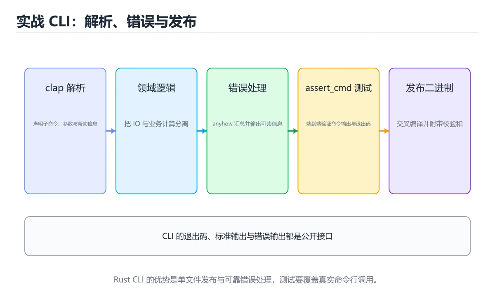
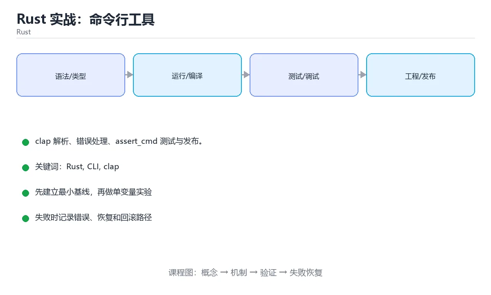

# Rust 实战：命令行工具

> 内容更新时间：2026-10-06 · 学习阶段：高级 · 预计用时：100 分钟





## 本节知识框架

**课程定位**：所属分类为「Rust」，课程主题为「Rust 实战：命令行工具」，学习阶段为「高级」，建议用时 100 分钟。

**本课要解决的主问题**：clap 解析、错误处理、assert_cmd 测试与发布。

| 学习层次 | 要回答的问题 | 完成判据 |
| --- | --- | --- |
| 概念层 | 「Rust 实战：命令行工具」有哪些必须区分的对象与术语？ | 能用自己的话定义核心术语，并各举一个正例和一个反例。 |
| 机制层 | 这些对象按什么顺序发生作用，输入如何变成输出？ | 能画出或写出机制步骤，并说明每一步的失败条件。 |
| 应用层 | 什么场景适合使用「Rust 实战：命令行工具」，什么场景不适合？ | 能给出一个真实场景、一个最小示例和一个边界案例。 |
| 性能层 | 时间、空间、吞吐或延迟受哪些量影响？ | 能说出复杂度或性能瓶颈的证据来源；没有证据时明确写“材料未提供”。 |
| 复习层 | 怎样确认自己不是只记住了结论？ | 能独立完成本课自测，并把错误定位到概念、机制、示例或边界。 |

### 阅读路线

1. 先读「核心概念定义」，建立「Rust」等对象的精确定义。
2. 再读「原理与运行机制」，把定义串成可重复的过程。
3. 用「代码/协议/SQL 示例」验证过程，并只改一个条件观察结果变化。
4. 最后检查性能、易错点、知识关系与自测题，形成可复习的证据链。

**前置知识**：《Rust unsafe、FFI 与生态》

**学习位置**：本课位于《Rust unsafe、FFI 与生态》之后；如果前一课的自测不能通过，应先回补再继续。

**后续衔接**：下一课《Rust 异步编程与 tokio》会继续使用本课术语，学完后建议立即完成一次自测。

**教材衔接：学习目标**

- 能用自己的话解释Rust 实战：命令行工具解决了什么问题，而不是只背术语。
- 能说清 「Rust」、「CLI」、「clap」、「anyhow」 之间的关系，并分别举出一个例子。
- 能把 Rust 放回「Rust 实战：命令行工具」的知识体系，说明它和 CLI 的边界。
- 能完成本课练习，并用验收标准检查自己的结果。

> 一句话摘要：clap 解析、错误处理、assert_cmd 测试与发布。

**教材衔接：前置知识**

- 先完成上一课《Rust unsafe、FFI 与生态》；如果已经掌握，可以直接用本课练习自测。
- 开始前先复习：Rust、CLI、clap。
- 如果 目标与结构 这一步看不懂，先记录具体卡点，再用 read_to_string 复现一遍。

**教材衔接：本课小结**

Rust CLI 的标准配方：**clap 解析 + anyhow/thiserror 错误 + serde 序列化 + assert_cmd 测试 + 多平台发布**；类型系统让这类工具几乎"发布即稳定"。

## 核心概念定义

> 阅读约定：本课先给「Rust 实战：命令行工具」相关术语的操作性定义与适用边界；正文里的口语化说法与定义冲突时，以定义和可复现示例为准。

| 术语 | 操作性定义 | 本课中的边界 |
| --- | --- | --- |
| Rust | Rust CLI 的标准配方：clap 解析 + anyhow/thiserror 错误 + serde 序列化 + assertcmd 测试 + 多平台发布；类型系统让这类工具几乎"发布即稳定"。 | 仅在「Rust 实战：命令行工具」明确给出的输入、版本与资源条件下成立。 |
| Cargo | Rust 的构建与包管理工具，用 Cargo.toml 声明依赖，提供 build、test、run 等子命令。 | 仅在「Rust 实战：命令行工具」明确给出的输入、版本与资源条件下成立。 |
| 命令解析 | clap 用派生宏把结构体变成参数定义，自动生成帮助信息与输入校验。 | 仅在「Rust 实战：命令行工具」明确给出的输入、版本与资源条件下成立。 |
| 错误传播 | 用问号运算符把底层错误向上抛出，配合 anyhow 与 thiserror 保留上下文。 | 仅在「Rust 实战：命令行工具」明确给出的输入、版本与资源条件下成立。 |

### 定义如何使用

在「Rust 实战：命令行工具」中判断一个说法是否成立，先确认它使用的是哪个对象的定义，再检查输入规模、运行环境与失败路径。定义不是口号，而是后续推导、代码示例和自测题共享的约束。

## 原理与运行机制

### 机制总览

1. **建立输入**：把「Rust」按本课定义整理成可观察、可重复的输入条件。
2. **执行转换**：围绕「Cargo」执行本课的核心步骤；每一步都记录中间状态，避免只看最终输出。
3. **产生输出**：得到「命令解析」后，用正文示例或协议/SQL 结果核对输出是否符合预期。
4. **改变一个条件**：只替换一个边界条件或环境参数，观察「Rust 实战：命令行工具」的结论是否仍然成立。

| 阶段 | 关注对象 | 失败时应检查 |
| --- | --- | --- |
| 输入 | Rust | 类型、范围、编码、版本或前置状态是否满足定义。 |
| 处理 | Cargo | 顺序、可见性、锁、路由、事务或调度规则是否被破坏。 |
| 输出 | 命令解析 | 结果是否可复现，错误是否被正确传播而不是被吞掉。 |

本课的机制结论要用「Rust 实战：命令行工具」自己的示例验证。「Rust 实战：命令行工具」没有给出某个数量级、吞吐或内存数据时，本课把该判断标为“材料未提供”，不从相邻主题外推。

**教材衔接：目标与结构**

做一个能读文件、过滤、统计并输出 JSON/表格的 CLI。结构：`main.rs`（解析参数与调度）、`lib.rs`（可测试的业务逻辑）、`tests/`（集成测试）。

**教材衔接：参数解析：clap**

用 derive 声明式定义参数：结构体加 `#[derive(Parser)]`，字段用 `#[arg(short, long, default_value_t)]`，子命令用 `#[derive(Subcommand)]`。clap 自动生成 `--help`、补全与参数校验，比手写解析可靠得多。

**教材衔接：错误处理与输出**

应用层用 `anyhow::Result` 一路 `?` 传播，并在 `main` 用 `fn main() -> anyhow::Result<()>` 统一打印错误与退出码；库层用 thiserror 定义可判定的错误。输出遵循 Unix 习惯：正常结果到 stdout，日志与错误到 stderr，便于管道组合。

**教材衔接：读写与序列化**

serde + serde_json 处理配置与输出；大文件用 BufReader 逐行处理，避免一次性读入内存。注意处理 CRLF、BOM 与无效 UTF-8（必要时按字节处理或使用 lossy 转换）。

**教材衔接：发布**

用 `cargo build --release` 产出单文件二进制；交叉编译可用 cross 或 GitHub Actions 的矩阵构建多平台产物；发布到 crates.io 需完善 README、许可证与版本语义（SemVer）。

**教材衔接：CLI 习惯速查**

| 习惯 | 说明 |
| --- | --- |
| 正常输出走 stdout | 便于管道与其他程序消费 |
| 错误与进度走 stderr | 不污染 stdout |
| 退出码 0 表示成功 | 失败返回非零（`std::process::ExitCode`） |
| 支持 `-h` / `--help` | clap 自动生成 |
| 支持 `--version` | 从 Cargo.toml 读取 |
| 不覆盖已有文件 | 默认拒绝或要求 `--force` |
| 尊重环境变量 | 代理、配置目录（`XDG_*` / `%APPDATA%`） |
| 可被管道中断 | 处理 `SIGPIPE`（Rust 默认忽略，需显式处理） |

**教材衔接：版本与时效**

- 版本提示：Rust 的行为在最近几个大版本里有过调整，升级「Rust 实战：命令行工具」前先用 read_to_string 复现当前输出，再对照官方发布说明逐条核对。
- 把 CLI 的编译告警当作错误处理，升级后才能避免行为漂移。
- 升级前确认 Rust 的兼容范围，把不可回退的改动单独拆成一次提交。
- 官方发布说明：https://blog.rust-lang.org/

### 升级检查清单

- 先固定当前版本，跑通全部示例与测验，再升级工具链。
- 一次只改一个版本条件，把 Rust 相关的差异单独记成一条结论。
- 回归范围锁定 read_to_string 的默认行为，并确认弃用警告是否出现在构建输出里。
- 升级完成后记录 Rust 的新旧版本差异，并据此调整下次复核时间。

**教材衔接：交付评审：评分表、决策记录与证据链**

「Rust 实战：命令行工具」的验收不能只看功能能不能跑通。下面把正文里的交付物、验证命令和关键设计点整理成一张评审表，按表逐项留下证据即可。

### 一、「Rust 实战：命令行工具」的交付物评分表

| 交付物 | 权重 | 合格线 | 需要的证据 |
| --- | ---: | --- | --- |
| 核心链路 | 34% | 能在干净环境复现，且失败路径有明确处理 | 命令与输出、对应测试、一次失败与恢复记录 |
| 测试与验收记录 | 33% | 能在干净环境复现，且失败路径有明确处理 | 命令与输出、对应测试、一次失败与恢复记录 |
| 运行与回滚说明 | 33% | 能在干净环境复现，且失败路径有明确处理 | 命令与输出、对应测试、一次失败与恢复记录 |

「Rust 实战：命令行工具」的评分先看证据再打分：任意一项只要拿不出可复现的命令或测试，该项按 0 分计，不允许用「基本完成」代替。

### 二、需要写下来的决策（ADR）

| 决策点 | 本课给出的做法 | 备选方案 | 代价与回滚 |
| --- | --- | --- | --- |
| 架构与数据流 | 用户/输入 → 接口或命令 → 领域逻辑 → 存储/外部依赖 → 输出与监控 | 不做「架构与数据流」，沿用最朴素的实现（需要额外补一次对照实验） | 若「架构与数据流」出问题，回到上一版本并按本课验收场景重跑 |

ADR 不需要长：每个决策三行就够——选了什么、放弃了什么、出问题怎么退。评审时只检查这三行是否和「Rust 实战：命令行工具」的实际代码一致。

### 三、「Rust 实战：命令行工具」的交付证据链

本课未给出可执行命令，用下面的最小证据集代替：

1. 一条从零开始的环境准备命令。
2. 一条跑通核心链路的命令及其完整输出。
3. 一条触发失败的命令，以及恢复后的验证结果。

把「Rust 实战：命令行工具」的上表整理成一个 evidence/ 目录：每条命令一个文件，文件名带日期，内容包含版本、命令与输出。评审时直接按目录核对，不再口头确认。

### 四、「Rust 实战：命令行工具」的验收指标

| 指标 | 目标值 | 测量方式 | 不达标时的动作 |
| --- | --- | --- | --- |
| Rust 的核心路径耗时与失败率 | 用本课正文给出的阈值，没有就写实测基线 | 固定环境重复三次取中位数 | 回到对应小节定位，先修原因再重测 |
| 资源占用峰值与回收情况 | 用本课正文给出的阈值，没有就写实测基线 | 固定环境重复三次取中位数 | 回到对应小节定位，先修原因再重测 |
| 验收场景的通过率 | 用本课正文给出的阈值，没有就写实测基线 | 固定环境重复三次取中位数 | 回到对应小节定位，先修原因再重测 |

指标必须能用一条命令或一次操作测出来；写不出测量方式的指标，在「Rust 实战：命令行工具」的评审里一律视为未定义。

### 五、评审记录模板

| 记录项 | 填写要求 |
| --- | --- |
| 项目标识 | `rust_cli_project` |
| 本次范围 | 说明这一轮交付了「Rust 实战：命令行工具」的哪些部分 |
| 未完成项 | 列出与 Rust 相关但本轮未做的内容 |
| 证据位置 | 指向 evidence/ 目录下的具体文件 |
| 风险与回滚 | 写清剩余风险、回滚步骤和验证方式 |
| 结论 | 通过 / 有条件通过 / 不通过，三者选一 |

「Rust 实战：命令行工具」评审结束后把这张表填完并归档；下一轮迭代直接读上一次的「未完成项」与「风险与回滚」，避免重复讨论同一个问题。
<!-- p1-project-review:end -->

## 典型应用场景

| 场景 | 典型输入或前提 | 期望产物 |
| --- | --- | --- |
| 学习验证 | 使用本课最小示例和 Rust、CLI | 能复现正文结论，并解释每一步。 |
| 工程落地 | 把「Rust 实战：命令行工具」放入真实模块或服务边界 | 输出可观测、失败可定位、参数可配置。 |
| 故障排查 | 只改一个版本、规模、输入或依赖条件 | 能区分概念错误、实现错误和环境差异。 |

判断「Rust 实战：命令行工具」的场景是否成立，标准是能否写出输入、处理、输出和失败路径；材料中没有出现的数据在本课标注为“材料未提供”，不用推测替代证据。

**课程内置实验入口**：`sandbox:rust`，用于动手验证《Rust 实战：命令行工具》的机制；实验结论不替代概念定义与复杂度分析。

**教材衔接：项目专属规格：Rust 实战：命令行工具**

### 核心场景

clap 解析、错误处理、assert_cmd 测试与发布。 项目目标是把「Rust、CLI、clap、anyhow、发布」落实为可运行、可测试、可回滚的交付物。

### 架构与数据流

```text
用户/输入 → 接口或命令 → 领域逻辑 → 存储/外部依赖 → 输出与监控
                         ↘ 失败分类 → 重试/补偿 → 回滚
```

### 最小数据模型

| 对象 | 关键字段 | 约束 |
| --- | --- | --- |
| 输入实体 | Rust、时间、来源 | 必填校验、长度限制、幂等键 |
| 任务实体 | 状态、优先级、创建时间 | 状态迁移合法、不可重复执行 |
| 结果实体 | 输出、错误码、耗时 | 可序列化、错误可解释 |
| 审计记录 | 操作者、动作、结果、时间 | 不可篡改、可查询、脱敏 |

### 验收场景

1. 正常路径：最小输入得到预期输出，并留下日志与指标。
2. 边界路径：CLI 在重复提交与超长输入下不产生额外副作用。
3. 失败路径：依赖超时或不可用时能快速失败、重试或降级。
4. 幂等路径：同一请求执行两次不会产生重复副作用。
5. 回滚路径：Rust 回滚后数据一致，且能说明恢复时间和影响范围。

**教材衔接：项目交付物**

### 建议仓库结构

```text
src/main.rs
src/domain/
src/infra/
tests/
Cargo.toml
```

### 测试矩阵

| 层级 | 覆盖内容 | 最低数量 | 通过标准 |
| --- | --- | ---: | --- |
| 单元测试 | 领域规则、边界和错误分类 | 8 | 正常、边界、失败路径全部通过 |
| 集成测试 | 数据库、网络、文件或平台边界 | 3 | 使用真实边界且可重复运行 |
| 端到端测试 | 核心用户路径 | 1 | 从输入到输出完整跑通 |
| 手动验收 | 文档中列出的 5 个场景 | 5 | 有命令、输出和结论记录 |

### 验收数据

```json
{
  "project": "rust_cli_project",
  "scenario": "Rust的正常路径",
  "input": {"case": "normal", "value": "read_to_string"},
  "expected": {"ok": true, "checks": ["Rust可复现", "CLI有记录"]},
  "failure_case": {"case": "CLI越界或缺失", "error": "validation_error"},
  "idempotency_key": "rust_cli_project-001"
}
```

### 复盘模板

| 问题 | 记录 |
| --- | --- |
| 原目标是什么？ | 用一句话描述可验收目标 |
| 实际发生了什么？ | 时间线、指标和关键日志 |
| 哪个假设被推翻？ | 根因与促成因素 |
| 如何回滚？ | 步骤、耗时和数据校验 |
| 下一步做什么？ | 负责人、期限和验证方式 |

> 项目验收围绕「Rust、CLI、clap」：至少完成一次正常路径、一次边界输入、一次失败恢复和一次幂等检查。

## 代码/协议/SQL 示例

### 最小可验证示例

下面保留《Rust 实战：命令行工具》原文中的最小示例。先预测《Rust 实战：命令行工具》示例的输出，再按正文步骤运行或推演；示例依赖外部环境时，同时记录版本与输入。

```rust
use clap::Parser;
use std::path::PathBuf;

/// 统计文件行数
#[derive(Parser, Debug)]
#[command(name = "linecount", version, about)]
struct Args {
    /// 要统计的文件路径
    #[arg(value_name = "FILE")]
    path: PathBuf,

    /// 只统计非空行
    #[arg(short, long)]
    non_empty: bool,

    /// 显示每行长度
    #[arg(short = 'l', long, default_value_t = false)]
    lengths: bool,
}

fn main() -> anyhow::Result<()> {
    let args = Args::parse();
    let content = std::fs::read_to_string(&args.path)
        .map_err(|e| anyhow::anyhow!("读取 {} 失败: {e}", args.path.display()))?;

    let count = content
        .lines()
        .filter(|line| !args.non_empty || !line.trim().is_empty())
        .count();

    println!("{count}");
    Ok(())
}
```

**教材衔接：测试**

单元测试覆盖解析与统计函数；集成测试用 `assert_cmd` 调用二进制并断言 stdout、stderr 与退出码。再加 `cargo clippy -- -D warnings` 与 `cargo fmt --check` 进 CI。

**教材衔接：常用 crate 速查**

| 目的 | crate | 说明 |
| --- | --- | --- |
| 参数解析 | `clap`（derive） | 生成帮助与补全 |
| 彩色输出 | `owo-colors`、`colored` | 终端着色 |
| 进度条 | `indicatif` | 下载与批处理进度 |
| 交互提示 | `dialoguer` | 选择、确认、输入 |
| 配置读取 | `figment`、`config` | 多来源合并 |
| 序列化 | `serde` + `serde_json` / `toml` | 结构化数据 |
| 日志 | `tracing` + `tracing-subscriber` | 结构化日志 |
| 错误 | `anyhow` / `thiserror` | 应用与库分别使用 |
| 测试 CLI | `assert_cmd` + `predicates` | 断言 stdout 与退出码 |
| 临时文件 | `tempfile` | 测试与中间产物 |

```rust
use clap::Parser;
use std::path::PathBuf;

/// 统计文件行数
#[derive(Parser, Debug)]
#[command(name = "linecount", version, about)]
struct Args {
    /// 要统计的文件路径
    #[arg(value_name = "FILE")]
    path: PathBuf,

    /// 只统计非空行
    #[arg(short, long)]
    non_empty: bool,

    /// 显示每行长度
    #[arg(short = 'l', long, default_value_t = false)]
    lengths: bool,
}

fn main() -> anyhow::Result<()> {
    let args = Args::parse();
    let content = std::fs::read_to_string(&args.path)
        .map_err(|e| anyhow::anyhow!("读取 {} 失败: {e}", args.path.display()))?;

    let count = content
        .lines()
        .filter(|line| !args.non_empty || !line.trim().is_empty())
        .count();

    println!("{count}");
    Ok(())
}
```

**教材衔接：测试速查**

```rust
#[test]
fn counts_lines() {
    use assert_cmd::Command;
    use predicates::prelude::*;

    let mut cmd = Command::cargo_bin("linecount").unwrap();
    cmd.write_stdin("a\n\nb\n")
        .arg("--non-empty")
        .arg("-")
        .assert()
        .success()
        .stdout(predicate::str::contains("2"));
}
```

**教材衔接：零基础详解：写一个 Rust 命令行工具**

### 一句话说清它是什么

Rust 非常适合写 CLI：编译成单个二进制、启动快、无运行时依赖。
一个完整的 CLI 需要四件套：**参数解析、错误处理、配置读取、日志输出**。

### 用生活比喻理解

| 库 | 比喻 | 作用 |
| --- | --- | --- |
| `clap` | 前台登记 | 解析参数与子命令 |
| `anyhow` | 通用报错卡 | 应用层错误，带上下文 |
| `thiserror` | 分类报错卡 | 库层错误，区分类型 |
| `serde` | 通用翻译 | 读写 JSON 或 TOML |
| `tracing` | 记录仪 | 分级日志 |

### 项目结构

```text
mycli/
  Cargo.toml
  src/
    main.rs        入口：解析参数、调用、退出
    cli.rs         参数定义
    config.rs      配置读取与校验
    commands/      各子命令实现
  tests/
    cli.rs         集成测试
```

```toml
[package]
name = "mycli"
version = "0.1.0"
edition = "2021"

[dependencies]
clap = { version = "4", features = ["derive"] }
anyhow = "1"
serde = { version = "1", features = ["derive"] }
serde_json = "1"
toml = "0.8"
tracing = "0.1"
tracing-subscriber = "0.3"

[dev-dependencies]
assert_cmd = "2"
predicates = "3"
```

### 参数定义：derive 风格

```rust
use clap::{Parser, Subcommand};
use std::path::PathBuf;

#[derive(Parser)]
#[command(name = "mycli", version, about = "示例命令行工具")]
struct Cli {
    /// 输出详细日志
    #[arg(short, long, global = true)]
    verbose: bool,

    #[command(subcommand)]
    command: Command,
}

#[derive(Subcommand)]
enum Command {
    /// 处理指定文件
    Process {
        /// 输入文件路径
        input: PathBuf,
        /// 输出路径，省略则打印到屏幕
        #[arg(short, long)]
        output: Option<PathBuf>,
    },
    /// 显示统计信息
    Stats {
        #[arg(default_value = "data.json")]
        file: PathBuf,
    },
}
```

`clap` 会自动生成 `--help` 与 `--version`，还会校验必填参数。

### 入口：一行解析，一处处理

```rust
fn main() -> anyhow::Result<()> {
    let cli = Cli::parse();

    let level = if cli.verbose {
        tracing::Level::DEBUG
    } else {
        tracing::Level::INFO
    };
    tracing_subscriber::fmt().with_max_level(level).init();

    match cli.command {
        Command::Process { input, output } => process(&input, output.as_deref())?,
        Command::Stats { file } => stats(&file)?,
    }
    Ok(())
}
```

`main` 返回 `Result` 时，出错会自动打印错误并以非 0 退出。

### 错误处理：加 context 而不丢原因

```rust
use anyhow::{bail, Context, Result};
use std::path::Path;

fn process(input: &Path, output: Option<&Path>) -> Result<()> {
    if !input.exists() {
        bail!("输入文件不存在：{}", input.display());
    }

    let text = std::fs::read_to_string(input)
        .with_context(|| format!("读取 {} 失败", input.display()))?;

    let result = transform(&text).context("处理内容失败")?;

    match output {
        Some(path) => {
            std::fs::write(path, &result)
                .with_context(|| format!("写入 {} 失败", path.display()))?;
            tracing::info!(path = %path.display(), "已写出结果");
        }
        None => println!("{result}"),
    }
    Ok(())
}
```

**要点**：`bail!` 提前返回错误，`with_context` 保留原因链，日志用结构化字段。

### 配置读取与校验

```rust
use anyhow::{bail, Context, Result};
use serde::Deserialize;
use std::path::Path;

#[derive(Debug, Deserialize)]
struct Config {
    #[serde(default = "default_threads")]
    threads: usize,
    #[serde(default)]
    dry_run: bool,
}

fn default_threads() -> usize {
    4
}

impl Config {
    fn load(path: &Path) -> Result<Self> {
        let text = std::fs::read_to_string(path)
            .with_context(|| format!("读取配置 {} 失败", path.display()))?;
        let cfg: Config = toml::from_str(&text).context("配置格式不正确")?;

        if cfg.threads == 0 || cfg.threads > 256 {
            bail!("threads 必须在 1 到 256 之间，实际为 {}", cfg.threads);
        }
        Ok(cfg)
    }
}
```

### 集成测试：直接跑二进制

```rust
// tests/cli.rs
use assert_cmd::Command;
use predicates::prelude::*;

#[test]
fn prints_help() {
    Command::cargo_bin("mycli")
        .unwrap()
        .arg("--help")
        .assert()
        .success()
        .stdout(predicate::str::contains("Usage"));
}

#[test]
fn fails_on_missing_file() {
    Command::cargo_bin("mycli")
        .unwrap()
        .args(["process", "/definitely/missing.txt"])
        .assert()
        .failure()
        .stderr(predicate::str::contains("不存在"));
}
```

### 发布

```bash
cargo fmt
cargo clippy -- -D warnings
cargo test
cargo build --release

# 交叉编译到其他平台（静态二进制）
cargo install cross
cross build --release --target x86_64-unknown-linux-musl
```

产物在 `target/release/mycli`，可直接分发。

### 新手最容易踩的八个坑

| 坑 | 现象 | 正确做法 |
| --- | --- | --- |
| 用 `unwrap()` 处理输入 | 用户看到 panic | 用 `?` 加 context |
| 手写参数解析 | 帮助信息不全 | 用 clap derive |
| 错误信息没上下文 | 不知道哪个文件出错 | 用 `with_context` |
| 配置不校验 | 运行到一半才崩 | 加载后立即校验 |
| 日志用 println | 无法分级与关闭 | 用 tracing |
| 输出直接覆盖源文件 | 出错丢数据 | 写临时文件再重命名 |
| 忘记处理管道关闭 | 报 Broken pipe | 处理 `ErrorKind::BrokenPipe` |
| 只测函数不测 CLI | 参数解析出错没人发现 | 加 assert_cmd 集成测试 |

### 学完自测

- [ ] 能说出 clap、anyhow、thiserror 各自的分工。
- [ ] 知道 `main` 返回 `Result` 会带来什么行为。
- [ ] 能说出 `bail!` 与 `with_context` 的用途。
- [ ] 知道配置加载后应该立刻做什么。
- [ ] 能用 assert_cmd 写一个 CLI 集成测试。

**教材衔接：验证命令与预期输出**

「Rust 实战：命令行工具」不能只看「能编译」，还要能按固定命令复现结果。下表给出最低验证集：

| 阶段 | 命令 | 预期输出 |
| --- | --- | --- |
| 格式检查 | `cargo fmt --check` | 没有格式差异 |
| 静态检查 | `cargo clippy -- -D warnings` | 没有 clippy 警告 |
| 运行测试 | `cargo test` | 所有测试通过 |

### 验收证据

- [ ] 保存依赖安装和启动命令的完整输出。
- [ ] 至少运行 3 条 Rust 相关测试，其中一条是非法输入或失败路径。
- [ ] 重复执行 Rust 的操作两次，确认没有重复写入或副作用。
- [ ] 记录一次失败状态码、错误日志和恢复步骤。
- [ ] 交付说明包含版本、启动、验证与回滚四部分。

### 回归与回滚

1. 用临时环境验证 read_to_string，确认无误后再对真实数据执行。
2. 修改一处逻辑后重跑全部验证命令，确认没有回归。
3. 若失败，回滚到上一个可运行版本并保留失败日志。
4. 定位原因后补一条自动化测试，再重新执行发布流程。
5. 把教训写入项目复盘或本课笔记，形成下一次的检查项。

## 时间/空间复杂度或性能分析

**复杂度证据**：「Rust 实战：命令行工具」的现有材料没有给出渐近时间或空间复杂度的明确结论，本课只做定性检查，不补写未经验证的 $O$ 记号。

| 维度 | 本课关注点 | 判断依据 |
| --- | --- | --- |
| 时间/延迟 | 「Rust 实战：命令行工具」的主要步骤是否会随输入规模、并发度或网络往返增长。 | 以正文复杂度、基准数据或可重复测量为准。 |
| 空间/内存 | 中间状态、缓存、副本、连接或索引是否随规模增长。 | 记录峰值内存与数据副本，不只看最终结果。 |
| 吞吐/资源 | 版本、调度、锁、IO、序列化或协议开销是否成为瓶颈。 | 固定环境做对照实验，改变一个变量。 |

评估「Rust 实战：命令行工具」时要区分“正确性成立”和“性能达标”两件事；材料没有给出基准时，本课只保留量级来源与测量方法，不写不可验证的绝对数字。

## 常见误区与易错点

> 复核《Rust 实战：命令行工具》的易错点时，优先保留原文的错误表、故障现场与排错路径；每条修正都要能用本课示例复验。

| 易错点 | 常见表现 | 正确做法 |
| --- | --- | --- |
| 只背结论 | 能复述「Rust 实战：命令行工具」的定义，却说不清输入、输出与边界。 | 回到机制步骤，用最小示例逐一验证。 |
| 混淆相邻概念 | 把本课对象与相邻主题的对象当成同一类。 | 先比较定义、资源归属、生命周期和失败模式。 |
| 忽略版本与环境 | 在开发机通过后直接外推到生产环境。 | 固定版本、输入和资源条件，再记录可复现结果。 |

**教材衔接：常见错误与排查**

| 容易踩的做法 | 实际现象 | 原因与正确做法 |
| --- | --- | --- |
| 用 `unwrap()` 处理用户输入 | 报错时直接 panic，堆栈难看 | 返回 `anyhow::Result` 并输出可读错误 |
| 把日志打到 stdout | 管道结果被污染 | 日志与进度打 stderr |
| 手动解析 `args()` | 帮助信息缺失、边界遗漏 | 用 clap derive |
| 失败仍返回退出码 0 | 脚本无法判断失败 | 返回 `Err` 或非零 `ExitCode` |
| 不处理大文件 | 一次性读入内存导致 OOM | 用 `BufReader` 流式处理 |
| 覆盖用户文件 | 数据丢失 | 默认拒绝，提供 `--force` |
| 硬编码路径分隔符 | 跨平台失败 | 用 `PathBuf` 与 `join` |
| 忽略非 UTF-8 输入 | `read_to_string` 报错 | 用 `read` + `String::from_utf8_lossy` |
| 不写集成测试 | 参数解析改动无人发现 | 用 `assert_cmd` 测 stdout / 退出码 |
| 发布未加 `--release` | 运行速度慢 | 发布用 `cargo build --release` |

**教材衔接：故障现场**

### 现场 1：用 unwrap() 处理用户输入

**症状**：在《Rust 实战：命令行工具》的复现场景中，报错时直接 panic，堆栈难看。

**根因**：触发点是把“用 unwrap() 处理用户输入”当成安全做法。它没有满足《Rust 实战：命令行工具》要求的前提，因此先表现为“报错时直接 panic，堆栈难看”；排查时先完整复现这一段，再核对输入、配置与依赖。

**修复**：针对《Rust 实战：命令行工具》的问题，返回 anyhow::Result 并输出可读错误。

**验证**：保留《Rust 实战：命令行工具》里触发“报错时直接 panic，堆栈难看”的输入、版本和日志，按“返回 anyhow::Result 并输出可读错误”完成修改后原样重放；只有失败现象消失且相邻场景仍可解释，才保留改动。

### 现场 2：把日志打到 stdout

**症状**：在《Rust 实战：命令行工具》的复现场景中，管道结果被污染。

**根因**：“管道结果被污染”只是表层结果。向上追溯会落到“把日志打到 stdout”这一步，因为它省略了《Rust 实战：命令行工具》的约束，使实现行为和预期模型发生了偏离。

**修复**：针对《Rust 实战：命令行工具》的问题，日志与进度打 stderr。

**验证**：保留《Rust 实战：命令行工具》里触发“管道结果被污染”的输入、版本和日志，按“日志与进度打 stderr”完成修改后原样重放；只有失败现象消失且相邻场景仍可解释，才保留改动。

### 现场 3：手动解析 args()

**症状**：在《Rust 实战：命令行工具》的复现场景中，帮助信息缺失、边界遗漏。

**根因**：“帮助信息缺失、边界遗漏”只是表层结果。向上追溯会落到“手动解析 args()”这一步，因为它省略了《Rust 实战：命令行工具》的约束，使实现行为和预期模型发生了偏离。

**修复**：针对《Rust 实战：命令行工具》的问题，用 clap derive。

**验证**：先在《Rust 实战：命令行工具》中记录“手动解析 args()”留下的失败证据，再执行“用 clap derive”并重放；确认错误路径变为明确结果，且修复没有掩盖同类故障。

## 与其他知识点的关系

| 关系 | 课程 | 为什么 |
| --- | --- | --- |
| 先修 | 《Rust unsafe、FFI 与生态》 | 本课会直接使用它的概念或操作前提。 |
| 关联 | 《Rust 异步编程与 tokio》 | 用于横向比较或把本课结论迁移到相邻主题。 |
| 前置顺序 | 《Rust unsafe、FFI 与生态》 | 同分类中安排在本课之前，建议先完成其自测。 |
| 后续顺序 | 《Rust 异步编程与 tokio》 | 同分类中安排在本课之后，会继续使用本课术语。 |

把「Rust 实战：命令行工具」放回知识体系时，不只要记住“前面学过什么”，还要说明两个主题在输入、机制、资源边界和失败模式上的差异。这样才能把单课知识迁移到项目、排障和后续课程。

## 自测题与参考答案

> 先独立作答《Rust 实战：命令行工具》的自测题，再对照答案与解析；每处判断都要能在本课正文或示例中找到依据。

### 自测 1

Rust CLI 最常用的参数解析库是？

A. tracing
B. serde
C. clap
D. tokio

**参考答案**：clap

**解析**：clap 的 derive 风格可自动生成 --help 与补全。其他选项：clap 是 Rust CLI 的参数解析事实标准。在「Rust 实战：命令行工具」里判断这道题，要把Rust、CLI、clap的条件、过程与失败路径逐项对齐，换成“Rust CLI 最常用的参数解析库”这个场景，只有满足前提的结论才成立。

### 自测 2

下面这段 Rust 代码摘自「Rust 实战：命令行工具」的正文示例。关于这段代码，下面哪一项说法与实际内容相符？

```rust
use clap::Parser;
use std::path::PathBuf;

/// 统计文件行数
#[derive(Parser, Debug)]
#[command(name = "linecount", version, about)]
struct Args {
    /// 要统计的文件路径
    #[arg(value_name = "FILE")]
    path: PathBuf,

    /// 只统计非空行
    #[arg(short, long)]
    non_empty: bool,

    /// 显示每行长度
    #[arg(short = 'l', long, default_value_t = false)]
    lengths: bool,
}

fn main() -> anyhow::Result<()> {
    let args = Args::parse();
    let content = std::fs::read_to_string(&args.path)
        .map_err(|e| anyhow::anyhow!("读取 {} 失败: {e}", args.path.display()))?;

    let count = content
        .lines()
        .filter(|line| !args.non_empty || !line.trim().is_empty())
        .count();

    println!("{count}");
    Ok(())
}
```

A. 这段代码包含条件分支，不同输入会走不同的执行路径。
B. 这段代码把主要逻辑封装在函数或方法里，需要被调用才会执行。
C. 这段代码只做静态声明，没有循环、分支或可观察输出。
D. 这段代码包含循环结构，同一段逻辑会被重复执行。

**参考答案**：这段代码只做静态声明，没有循环、分支或可观察输出。

**解析**：题干的正确项是这段代码只做静态声明，没有循环、分支或可观察输出，在「Rust 实战：命令行工具」里它只能证明Rust相关约束存在，不能替代真实运行证据。这段代码出自「Rust 实战：命令行工具」的正文示例，围绕Rust、CLI、clap展开；把输入或边界换成空值、极值或失败情况后，结论要以「Rust 实战：命令行工具」的实际运行结果为准。这道题的关键在「Rust 实战：命令行工具」的Rust、CLI、clap：先确认题干“下面这段 Rust 代码摘自Rust”问的是哪一步，再排除偷换前提的选项。

### 自测 3

围绕“Rust 实战：命令行工具”中的 Rust、CLI、clap，下列哪两项是本课强调的实践判断？

A. 只要 Rust 的常规示例通过，就可以跳过边界与异常路径
B. 验证 CLI 时要固定版本并覆盖边界输入，结论才可复现
C. 把 CLI 的单次运行结果当成所有版本和规模都成立
D. 学习 Rust 时要同时说明输入、输出和失败路径，不能只看正常流程

**参考答案**：验证 CLI 时要固定版本并覆盖边界输入，结论才可复现；学习 Rust 时要同时说明输入、输出和失败路径，不能只看正常流程

**解析**：在「Rust 实战：命令行工具」里，学习 Rust 时要同时说明输入、输出和失败路径，不能只看正常流程。在Rust 实战：命令行工具里，判断 CLI 时要固定版本与边界输入，所以“验证 CLI 时要固定版本并覆盖边界输入，结论才可复现”才可复现。「Rust 实战：命令行工具」要求先交代Rust、CLI、clap的前提再下结论，所以“验证 CLI 时要固定版本并覆盖边界输入”只在题干“围绕Rust 实战”给定的条件下成立。

**教材衔接：复习与自测**

- [ ] 用 clap derive 定义参数并自动生成帮助。
- [ ] 数据输出到 stdout，日志与进度到 stderr。
- [ ] 错误可读，退出码语义正确。
- [ ] 大文件使用流式读取。
- [ ] 用 `assert_cmd` 写集成测试。

**教材衔接：动手练习**

> 本课练习重点：围绕「Rust、CLI、clap」完成复述、实验和交付，每个结果都要能被别人检查。

写一个只做一件事的小程序：输入 Rust，输出 CLI，其余全部省略。

### 练习 1：建立心智模型（10 分钟）

合上教程，用 3～5 句话回答：

1. Rust 实战：命令行工具解决了什么问题？
2. 如果没有它，会出现什么具体后果？
3. 它和「CLI」是什么关系？

验收标准：回答里必须出现 Rust，并写出一个让结论失效的边界条件。

### 练习 2：做一次可控实验（20 分钟）

从正文中选一个最小示例，完成以下操作：

1. 先预测修改一个参数、输入或步骤后的结果。
2. 再实际执行或逐步推演，记录真实结果。
3. 如果结果与预测不同，写出差异原因。

**验收标准**：围绕「目标与结构」小节做一次五步记录，原例取自 read_to_string，改动只允许动一处Rust，原因要能指回正文的判断依据。

### 练习 3：交付一个小结果（30 分钟）

写一个只做一件事的小程序：输入 Rust，输出 CLI，其余全部省略。

任务要求：

- 结果必须能被别人检查，不能只写“我已经理解了”。
- 至少覆盖「Rust」和「CLI」两个关键词。
- 写出 1 个仍然不确定的问题，以及下一步如何验证。

> 提示：时间有限时优先做练习 1 和练习 2；练习 3 可以拆成两次完成。

**教材衔接：可运行练习**

### 任务 1：先跑通，再解释

```bash
cargo fmt
cargo clippy -- -D warnings
cargo test
cargo build --release

# 交叉编译到其他平台（静态二进制）
cargo install cross
cross build --release --target x86_64-unknown-linux-musl
```

### 任务 2：只改一个条件

把「Rust 实战：命令行工具」的最小示例复制一份，只改一个条件再跑一次：

- 改动点：把 CLI 换成边界值，其他输入保持原样。
- 预测：先写下「Rust 实战：命令行工具」在改动后的输出或错误信息，再运行。
- 记录：对照改动前后的结果，指出差异出在哪一步。
- 验收：换回原条件能复现原结果，改动只影响Rust。

### 任务 3：迁移到自己的数据

把 read_to_string 换成你自己的输入，先保持步骤不变，再比较输出差异。

**教材衔接：本课复习清单**

离开本课前，逐项确认：

- [ ] 不看解析，能说出「Rust CLI 最常用的参数解析库是？」的判断依据。
- [ ] 不看解析，能说出「符合 Unix 习惯的输出方式是？」的判断依据。
- [ ] 不看解析，能说出「测试二进制行为（stdout/退出码）常用？」的判断依据。
- [ ] 不看解析，能说出「clap 的 derive 模式如何声明命令行参数？」的判断依据。
- [ ] 不看解析，能说出「命令行工具如何向调用方返回失败状态？」的判断依据。
- [ ] 用 Rust 构造一个正常输入和一个边界输入，分别记录输出与判断依据。
- [ ] 把本课最容易混淆的两个概念写成一句话对照。

| 复盘项 | 记录 |
| --- | --- |
| 已经能独立解释的考点 |  |
| 仍然说不清的概念 |  |
| 下一步验证动作 |  |

---

## 术语速查

把「Rust 实战：命令行工具」里反复出现的术语集中放在一起。复习时先遮住右列，尝试用自己的话解释，再回到正文核对。

| 术语 | 一句话说明 |
| --- | --- |
| `Rust` | Rust CLI 的标准配方：clap 解析 + anyhow/thiserror 错误 + serde 序列化 + assertcmd 测试 + 多平台发布；类型系统让这类工具几乎"发布即稳定"。 |
| `Cargo` | Rust 的构建与包管理工具，用 Cargo.toml 声明依赖，提供 build、test、run 等子命令。 |
| `命令解析` | clap 用派生宏把结构体变成参数定义，自动生成帮助信息与输入校验。 |
| `错误传播` | 用问号运算符把底层错误向上抛出，配合 anyhow 与 thiserror 保留上下文。 |

## 考点精讲

### 考点 1：概念判断·Rust

- **题目**：Rust CLI 最常用的参数解析库是？
- **判断依据**：clap 的 derive 风格可自动生成 --help 与补全。其他选项：clap 是 Rust CLI 的参数解析事实标准。在「Rust 实战：命令行工具」里判断这道题，要把Rust、CLI、clap的条件、过程与失败路径逐项对齐，换成“Rust CLI 最常用的参数解析库”这个场景，只有满足前提的结论才成立。

### 考点 2：概念判断·Rust

- **题目**：符合 Unix 习惯的输出方式是？
- **判断依据**：在「Rust 实战：命令行工具」里，作答时，先用Rust建立输入与输出的基线，再把正常结果进 stdout代入边界条件核对，结论才能复现。这道题的关键在「Rust 实战：命令行工具」的Rust、CLI、clap：先确认题干“符合 Unix 习惯的输出方式是”问的是哪一步，再排除偷换前提的选项。

### 考点 3：概念判断·Rust

- **题目**：测试二进制行为（stdout/退出码）常用？
- **判断依据**：在「Rust 实战：命令行工具」里，assert_cmd。assertcmd 可在集成测试中调用二进制并断言输出。传播，并在 main 用 fn main -> anyhow::Result<> 统一打印错误与退出码。在「Rust 实战：命令行工具」里判断这道题，要把Rust、CLI、clap的条件、过程与失败路径逐项对齐，换成“测试二进制行为（stdout/退出码”这个场景，只有满足前提的结论才成立。

### 考点 4：代码补全·Rust

- **题目**：下面这段 Rust 代码摘自「Rust 实战：命令行工具」的正文示例。关于这段代码，下面哪一项说法与实际内容相符？
- **判断依据**：题干的正确项是这段代码只做静态声明，没有循环、分支或可观察输出，在「Rust 实战：命令行工具」里它只能证明Rust相关约束存在，不能替代真实运行证据。这段代码出自「Rust 实战：命令行工具」的正文示例，围绕Rust、CLI、clap展开；把输入或边界换成空值、极值或失败情况后，结论要以「Rust 实战：命令行工具」的实际运行结果为准。这道题的关键在「Rust 实战：命令行工具」的Rust、CLI、clap：先确认题干“下面这段 Rust 代码摘自Rust”问的是哪一步，再排除偷换前提的选项。

### 考点 5：多选辨析·Rust

- **题目**：围绕“Rust 实战：命令行工具”中的 Rust、CLI、clap，下列哪两项是本课强调的实践判断？
- **判断依据**：在「Rust 实战：命令行工具」里，学习 Rust 时要同时说明输入、输出和失败路径，不能只看正常流程。在Rust 实战：命令行工具里，判断 CLI 时要固定版本与边界输入，所以“验证 CLI 时要固定版本并覆盖边界输入，结论才可复现”才可复现。「Rust 实战：命令行工具」要求先交代Rust、CLI、clap的前提再下结论，所以“验证 CLI 时要固定版本并覆盖边界输入”只在题干“围绕Rust 实战”给定的条件下成立。

### 考点 6：填空·Rust

- **题目**：补全代码：「Rust 实战：命令行工具」示例中，下面这行代码缺少哪个关键字或函数名？请填入 ____。 `let content = std::fs::____(&args.path)`
- **判断依据**：空格应填写「read_to_string」。「Rust 实战：命令行工具」要求先交代Rust、CLI、clap的前提再下结论，所以“readtostring”只在题干“Rust 实战”给定的条件下成立。把“readtostring”代回「Rust 实战：命令行工具」里“Rust 实战”的例子核对，条件一旦改变，结论就要用Rust、CLI、clap重新推导。

## English Overview

**Title:** Rust CLI Project

**Summary:** clap, error handling, assert_cmd and release.

**Category:** Rust
**Level:** 高级
**Key terms:** Rust, CLI, clap, anyhow, 发布

## 内容元数据

- 内容版本：v2.0
- 最后更新：2026-10-06
- 学习阶段：高级
- 适用环境：Rust 1.85+ / Cargo
；本课聚焦 Rust。
- 内容来源：内置结构化课程与工程实践整理
- 相关主题：Rust、CLI、clap、anyhow、发布
- 质量版本：P0 测验标准 + P1 覆盖扩展 + P2 体验补全

## Full English Study Guide

### Overview

**Rust CLI Project** focuses on clap, error handling, assert_cmd and release.

### Learning Outcomes

- Explain what **Rust CLI Project** solves and when it should be used.

### Glossary

- Topic: **Rust CLI Project**
- Related terms: Rust, CLI, clap, anyhow

## Bilingual Section Outline

| 中文小节 | English section |
| --- | --- |
| 学习目标 | Learning objectives |
| 前置知识 | Prerequisites |
| 目标与结构 | 目标与结构 |
| 参数解析：clap | 参数解析：clap |
| 错误处理与输出 | Error handling与输出 |
| 读写与序列化 | 读写与序列化 |
| 测试 | Testing |
| 发布 | Release |
| 本课小结 | Summary |
| 常用 crate 速查 | 常用 crate 速查 |

## 参考资料与复核

- 最后复核：2026-10-04
- 下次复核：2027-06-10
- 复核范围：版本兼容、API 行为、安全建议与工程实践
- 来源性质：官方文档、标准或权威教材；正文为离线教学重组

| 参考资料 | 本课用途 |
| --- | --- |
| [Cargo Book](https://doc.rust-lang.org/cargo/) | 依赖、工作区与发布 |
| [Rust 测试](https://doc.rust-lang.org/book/ch11-00-testing.html) | 单元测试与集成测试 |
| [Tokio 文档](https://tokio.rs/tokio/tutorial) | 异步运行时与任务 |

> 「Rust 实战：命令行工具」的链接用于离线阅读后的延伸核对；App 不会自动联网。

<!-- p1-project-review:start -->
